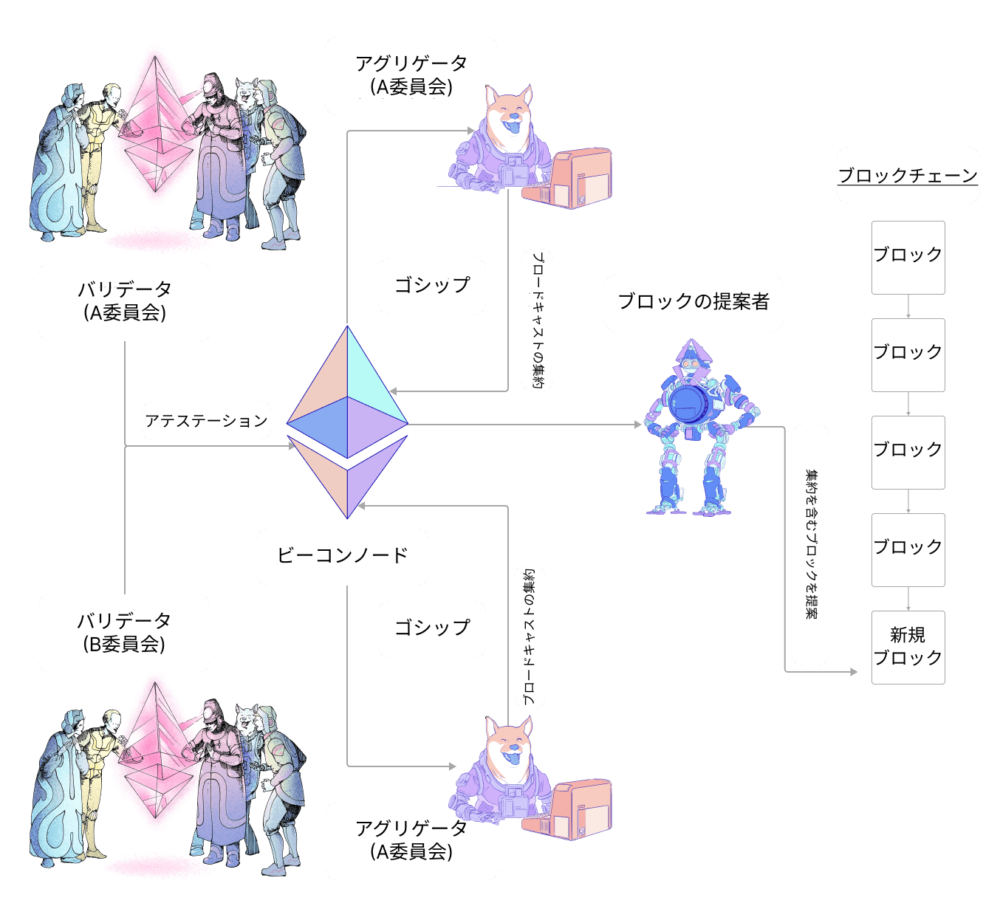

バリデータは、各エポックにおいて、アテステーションを作成、署名し、ブロードキャストする必要があります。 このページでは、アテステーションがどのような内容を持つか、およびどのように処理され、コンセンサスを実現するクライアント間でどのようにやりとりされるかについての概要を説明します。

## アテステーションとは何か？ {#what-is-an-attestation}

[エポック](/glossary/#epoch) (6.4分) ごとに、バリデータはネットワークにアテステーションを提案します。 アテステーションは、当該エポックにおける特定のスロットのみを対象とします。 アテステーションの目的は、バリデータのチェーン観、特に最新の正当化されたブロックと、現在のエポックの最初のブロック (`source` と `target` のチェックポイントとして知られる) に賛成票を投じることです。 この情報は、参加するすべてのバリデータを対象として結合されるため、ネットワークがブロックチェーンの状態についてコンセンサスに達することが可能になります。

アテステーションには、以下の構成要素が含まれます：

- `aggregation_bits`: バリデータのビットリストで、位置がその委員会におけるバリデータインデックスに対応します。値(0/1)は、バリデータが`data`に署名したかどうか(つまり、アクティブであり、ブロック提案者に同意しているかどうか)を示します。
- `data`: 以下に定義される、アテステーションに関する詳細
- `signature`: 個々のバリデータの署名を集約したBLS署名

アテステーションを行うバリデータの最初のタスクは、`data`を構築することです。 `data`には以下の情報が含まれます:

- `slot`: アテステーションが参照するスロット番号
- `index`: 特定のスロットでバリデータが属する委員会を識別する番号
- `beacon_block_root`: バリデータがチェーンの先頭に見るブロックのルートハッシュ(フォークチョイスアルゴリズムを適用した結果)
- `source`: バリデータが最新の正当化されたブロックとして見なすものを示すファイナリティ投票の一部
- `target`: バリデータが現在のエポックの最初のブロックとして見なすものを示すファイナリティ投票の一部

`data`が構築されると、バリデータは参加したことを示すために、自身のバリデータインデックスに対応する`aggregation_bits`のビットを0から1に反転させることができます。

バリデータは最後に、このアテステーションに署名し、ネットワークに送信します。

### 集約アテステーション {#aggregated-attestation}

このデータを各バリデータに提供する場合、ネットワークに対する負担が大きくなります。 このため、各バリデータからのアテステーションは、より広汎に送信する前にサブネット内で集約されます。 これには署名を一緒に集約することも含まれ、ブロードキャストされるアテステーションにはコンセンサス`data`と、その`data`に同意するすべてのバリデータの署名を結合して形成された単一の署名が含まれます。 これは`aggregation_bits`を使って確認できます。なぜなら、これは各バリデータの委員会におけるインデックスを提供し (委員会のIDは`data`で提供)、個々の署名を照会するために使用できるからです。

各エポックで、各サブネットの16のバリデータが`aggregators`として選ばれます。 アグリゲータは、ゴシップネットワークを介して耳にする、自身のものと同等の`data`を持つすべてのアテステーションを収集します。 一致する各アテステーションの送信者は、`aggregation_bits`に記録されます。 アグリゲータは次に、この集約されたアテステーションをより広汎なネットワークに送信します。

バリデータがブロック提案者に選定されると、当該の新規ブロックにおける最新のスロットまで、各サブネットからのアテステーションを集約して、パッケージ化します。

### アテステーション取り込みのライフサイクル {#attestation-inclusion-lifecycle}

1. 生成
2. 伝播
3. 集約
4. 伝播
5. 追加

以下の図は、アテステーションのライフサイクルの概略を示したものです。

## 報酬 {#rewards}

バリデータは、アテステーションを提出することで報酬を得ます。 アテステーションによる報酬は、参加フラグ (ソース、ターゲット、ヘッド)、べース報酬、参加率によって決まります。

それぞれの参加フラグは、送信されたアテステーションとその追加の遅延に応じて、true または false のいずれかになります。

最良のシナリオは、3つのフラグがすべて true の場合です。この場合、バリデーター (正しいフラグごとに) 収益を得ることができます。

`reward += base reward * flag weight * flag attesting rate / 64`

このflag attesting rateは、アクティブな有効残高の合計と、特定のフラグにおけるすべてのアテステーションをしているバリデータの有効残高の合計の比較によって測定されます。

### ベース報酬 {#base-reward}

ベース報酬は、アテステーションを行うバリデータの数と、彼らの有効なステーク済みイーサ残高により計算されます。

`ベース報酬 = バリデータ有効残高 x 2^6 / SQRT(全アクティブバリデータの有効残高)`

#### 取り込み遅延 {#inclusion-delay}

バリデータがチェーンの先頭(`ブロックn`)に投票した時点では、`ブロックn+1`はまだ提案されていませんでした。 そのため、アテステーションは自然に**1ブロック後**に取り込まれ、`ブロックn`がチェーンヘッドであることに投票したすべてのアテステーションが`ブロックn+1`に取り込まれるため、**取り込み遅延**は1になります。 アテステーション報酬は、ベース報酬に追加遅延の値の逆数を掛け合わせて算出されるため、追加の遅延が「2」スロットに倍増した場合、アテステーション報酬は2分の1になります。

### アテステーションのシナリオ {#attestation-scenarios}

#### 投票バリデータの欠落 {#missing-voting-validator}

バリデータがアテステーションを提出できるのは、最長で1エポックの期間です。 エポック0でアテステーションを提出しなかった場合、エポック1で提出できますが、追加遅延が発生します。

#### アグリゲータの欠落 {#missing-aggregator}

エポックごとに、合計16名のアグリゲータが存在します。 さらに、ランダムなバリデータが**256エポックの間、2つのサブネット**を購読し、アグリゲータが欠落した場合のバックアップとして機能します。

#### ブロック提案者の欠落 {#missing-block-proposer}

運が良ければ、アグリゲータがブロック提案者になる場合もあります。 ブロック提案者が欠席したためにアテステーションが追加されなかった場合、次のブロック提案者がこの集約済みのアテステーションを継承して、次のブロックに追加します。 ただし、**取り込み遅延**は1増加します。

## 参考リンク{#further-reading}

- [Vitalikの注釈付きコンセンサス仕様のアテステーション](https://github.com/ethereum/annotated-spec/blob/master/phase0/beacon-chain.md#attestationdata)
- [eth2book.infoのアテステーション](https://eth2book.info/capella/part3/containers/dependencies/#attestationdata)

_役に立つコミュニティリソースを知っていますか? Edit this page and add it!_
