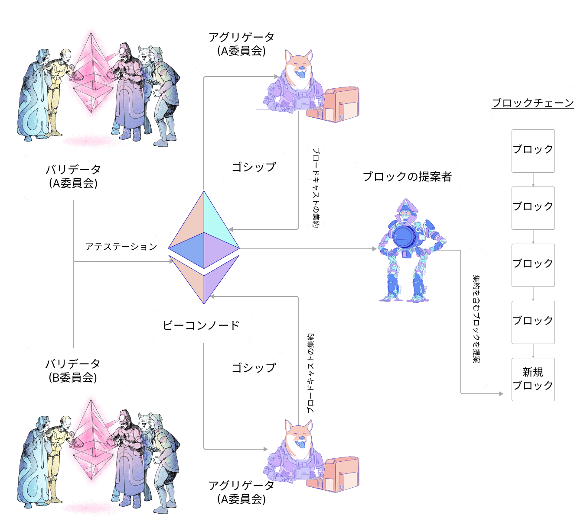

バリデータは、各エポック中にアテステーションを作成、署名、およびブロードキャストすることが期待されています。このページでは、これらのアテステーションがどのようなものか、またコンセンサスクライアント間でどのように処理され、通信されるかについて概説します。

## アテステーションとは？ {#what-is-an-attestation}

各[エポック](/glossary/#epoch)（6.4分）ごとに、バリデータはネットワークにアテステーションを提案します。アテステーションは、エポック内の特定のスロットに対するものです。アテステーションの目的は、バリデータから見たチェーンの状態、特に最新のジャスティファイド・ブロックと現在のエポックの最初のブロック（`source`および`target`チェックポイントとして知られています）に賛成の投票を行うことです。この情報は参加しているすべてのバリデータについて結合され、ネットワークがブロックチェーンの状態についてコンセンサスに達することを可能にします。

アテステーションには以下のコンポーネントが含まれます：

- `aggregation_bits`: バリデータのビットリスト。位置はコミッティ内のバリデータのインデックスに対応します。値（0/1）は、バリデータが`data`に署名したかどうか（つまり、アクティブであり、ブロック・プロポーザーに同意しているかどうか）を示します。
- `data`: 以下で定義される、アテステーションに関する詳細
- `signature`: 個々のバリデータの署名を集約したBLS署名

アテステーションを行うバリデータの最初のタスクは、`data`を構築することです。`data`には以下の情報が含まれます：

- `slot`: アテステーションが参照するスロット番号
- `index`: 特定のスロットでバリデータがどのコミッティに属しているかを識別する番号
- `beacon_block_root`: バリデータがチェーンの先頭にあると見なすブロックのルートハッシュ（フォーク選択アルゴリズムを適用した結果）
- `source`: バリデータが最新のジャスティファイド・ブロックとして見なすものを示す、ファイナリティ投票の一部
- `target`: バリデータが現在のエポックの最初のブロックとして見なすものを示す、ファイナリティ投票の一部

`data`が構築されると、バリデータは`aggregation_bits`内の自身のバリデータインデックスに対応するビットを0から1に反転させ、参加したことを示すことができます。

最後に、バリデータはアテステーションに署名し、ネットワークにブロードキャストします。

### 集約されたアテステーション {#aggregated-attestation}

すべてのバリデータについてこのデータをネットワーク上でやり取りすることには、かなりのオーバーヘッドが伴います。そのため、個々のバリデータからのアテステーションは、より広くブロードキャストされる前にサブネット内で集約されます。これには署名の集約も含まれるため、ブロードキャストされるアテステーションには、コンセンサス`data`と、その`data`に同意するすべてのバリデータの署名を組み合わせた単一の署名が含まれます。これは`aggregation_bits`を使用して確認できます。なぜなら、これによりコミッティ（そのIDは`data`で提供されます）内の各バリデータのインデックスが提供され、個々の署名を照会するために使用できるからです。

各エポックにおいて、各サブネットの16人のバリデータが`aggregators`として選ばれます。アグリゲーターは、ゴシップネットワークを通じて受信した、自身と同等の`data`を持つすべてのアテステーションを収集します。一致する各アテステーションの送信者は`aggregation_bits`に記録されます。その後、アグリゲーターは集約されたアテステーションをより広いネットワークにブロードキャストします。

バリデータがブロック・プロポーザーとして選ばれると、サブネットからの集約されたアテステーションを最新のスロットまで新しいブロックにパッケージ化します。

### アテステーションのインクルージョン・ライフサイクル {#attestation-inclusion-lifecycle}

1. 生成
2. 伝播
3. 集約
4. 伝播
5. インクルージョン（ブロックへの取り込み）

アテステーションのライフサイクルは以下の図に概説されています：

## 報酬 {#rewards}

バリデータはアテステーションを提出することで報酬を得ます。アテステーションの報酬は、参加フラグ（source、target、head）、基本報酬、および参加率に依存します。

各参加フラグは、提出されたアテステーションとそのインクルージョン遅延に応じて、trueまたはfalseのいずれかになります。

最良のシナリオは、3つのフラグすべてがtrueの場合に発生し、その場合バリデータは（正しいフラグごとに）以下を獲得します：

`reward += base reward * flag weight * flag attesting rate / 64`

フラグのアテステーション率は、特定のフラグについてアテステーションを行ったすべてのバリデータのエフェクティブ・バランスの合計を、アクティブなエフェクティブ・バランスの合計と比較して測定されます。

### 基本報酬 {#base-reward}

基本報酬は、アテステーションを行うバリデータの数と、ステークされたイーサのエフェクティブ・バランスに基づいて計算されます：

`base reward = validator effective balance x 2^6 / SQRT(Effective balance of all active validators)`

#### インクルージョン遅延 {#inclusion-delay}

バリデータがチェーンの先頭（`block n`）に投票した時点では、`block n+1`はまだ提案されていませんでした。したがって、アテステーションは自然に**1ブロック後**に取り込まれるため、`block n`がチェーンの先頭であると投票したすべてのアテステーションは`block n+1`に取り込まれ、**インクルージョン遅延**は1になります。インクルージョン遅延が2スロットに倍増すると、アテステーション報酬は半分になります。なぜなら、アテステーション報酬を計算するために、基本報酬にインクルージョン遅延の逆数が掛けられるからです。

### アテステーションのシナリオ {#attestation-scenarios}

#### 投票するバリデータの欠落 {#missing-voting-validator}

バリデータはアテステーションを提出するために最大1エポックの猶予があります。エポック0でアテステーションを逃した場合、エポック1でインクルージョン遅延を伴って提出することができます。

#### アグリゲーターの欠落 {#missing-aggregator}

1エポックあたり合計16人のアグリゲーターが存在します。さらに、ランダムなバリデータが**256エポックの間2つのサブネット**にサブスクライブし、アグリゲーターが欠落した場合のバックアップとして機能します。

#### ブロック・プロポーザーの欠落 {#missing-block-proposer}

場合によっては、運の良いアグリゲーターがブロック・プロポーザーになることもあることに注意してください。ブロック・プロポーザーが欠落したためにアテステーションが取り込まれなかった場合、次のブロック・プロポーザーが集約されたアテステーションを拾い上げ、次のブロックに取り込みます。ただし、**インクルージョン遅延**は1増加します。

## 参考文献 {#further-reading}

- [Vitalikの注釈付きコンセンサス仕様におけるアテステーション](https://github.com/ethereum/annotated-spec/blob/master/phase0/beacon-chain.md#attestationdata)
- [eth2book.infoにおけるアテステーション](https://eth2book.info/capella/part3/containers/dependencies/#attestationdata)

_役に立ったコミュニティリソースをご存知ですか？このページを編集して追加してください！_