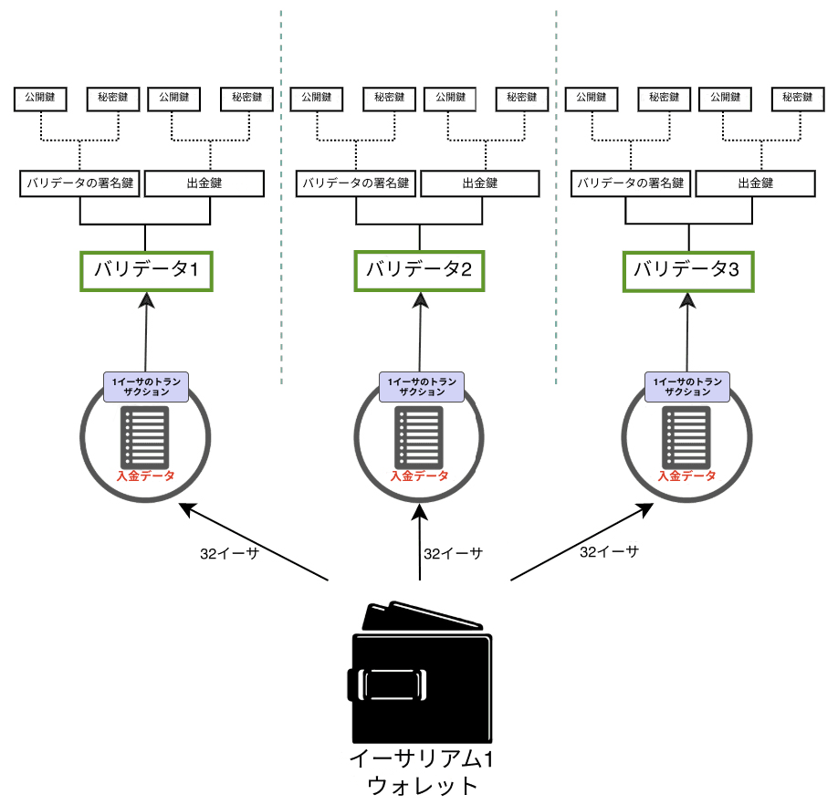
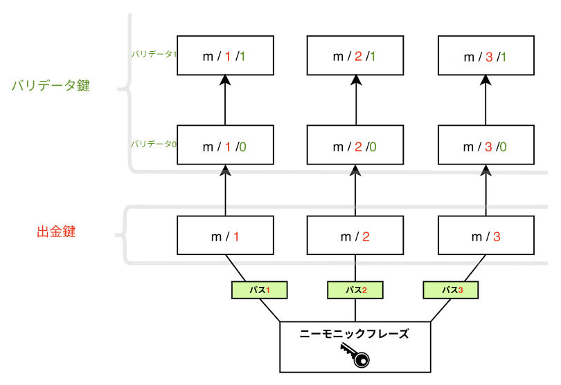

イーサリアムは、公開鍵・秘密鍵暗号技術を使用してユーザーの資産を保護します。公開鍵はイーサリアムのアドレスの基礎として使用されます。つまり、一般に公開され、一意の識別子として使用されます。秘密鍵（または「シークレット」キー）は、アカウントの所有者のみがアクセスできるようにする必要があります。秘密鍵は、トランザクションやデータに「署名」するために使用され、暗号技術によって、特定の秘密鍵の保持者が何らかのアクションを承認したことを証明できます。

イーサリアムの鍵は、[楕円曲線暗号技術](https://en.wikipedia.org/wiki/Elliptic-curve_cryptography)を使用して生成されます。

しかし、イーサリアムが[プルーフ・オブ・ワーク (PoW)](/developers/docs/consensus-mechanisms/pow)から[プルーフ・オブ・ステーク (PoS)](/developers/docs/consensus-mechanisms/pos)に移行した際、新しいタイプの鍵がイーサリアムに追加されました。元の鍵は以前とまったく同じように機能します。アカウントを保護する楕円曲線ベースの鍵に変更はありませんでした。しかし、ユーザーがETHをステーキングし、バリデータを実行してプルーフ・オブ・ステーク (PoS) に参加するためには、新しいタイプの鍵が必要でした。この必要性は、多数のバリデータ間で多くのメッセージがやり取りされることに関連するスケーラビリティの課題から生じました。ネットワークがコンセンサスに達するために必要な通信量を減らすために、簡単に集約できる暗号技術的手法が求められたのです。

この新しいタイプの鍵は、[**Boneh-Lynn-Shacham (BLS)** 署名スキーム](https://wikipedia.org/wiki/BLS_digital_signature)を使用しています。BLSは署名の非常に効率的な集約を可能にするだけでなく、集約された個々のバリデータ鍵のリバースエンジニアリングも可能にし、バリデータ間のアクションを管理するのに理想的です。

## 2種類のバリデータ鍵 {#two-types-of-keys}

プルーフ・オブ・ステーク (PoS) への移行前、イーサリアムのユーザーは資金にアクセスするために単一の楕円曲線ベースの秘密鍵しか持っていませんでした。プルーフ・オブ・ステーク (PoS) の導入により、ソロでステーキングを行いたいユーザーには、**バリデータ鍵**と**引き出し鍵**も必要になりました。

### バリデータ鍵 {#validator-key}

バリデータの署名鍵は、次の2つの要素で構成されています。

- バリデータの**秘密**鍵
- バリデータの**公開**鍵

バリデータの秘密鍵の目的は、ブロックの提案やアテステーションなどのオンチェーン操作に署名することです。このため、これらの鍵はホット・ウォレットに保持する必要があります。

この柔軟性には、バリデータの署名鍵をあるデバイスから別のデバイスへ非常に迅速に移動できるという利点がありますが、紛失したり盗まれたりした場合、窃盗犯はいくつかの方法で**悪意のある行動**をとる可能性があります。

- 以下の方法でバリデータにスラッシングを受けさせる：
  - プロポーザーとして、同じスロットに対して2つの異なるビーコンブロックに署名する
  - アテスターとして、別のアテステーションを「囲む (surrounds)」アテステーションに署名する
  - アテスターとして、同じターゲットを持つ2つの異なるアテステーションに署名する
- 自発的なエグジットを強制し、バリデータのステーキングを停止させ、引き出し鍵の所有者にETH残高へのアクセスを許可する

ユーザーがステーキング・デポジット・コントラクトにETHをデポジットする際、トランザクションデータには**バリデータの公開鍵**が含まれます。これは_デポジットデータ_として知られており、これによりイーサリアムはバリデータを識別できます。

### 出金クレデンシャル {#withdrawal-credentials}

すべてのバリデータには、_出金クレデンシャル_として知られるプロパティがあります。この32バイトのフィールドの最初のバイトは、アカウントのタイプを識別します。`0x00` は元のBLS（シャペラ以前、引き出し不可）クレデンシャルを表し、`0x01` は実行アドレスを指すレガシークレデンシャルを表し、`0x02` は最新の複利型クレデンシャルを表します。

`0x00` のBLS鍵を持つバリデータは、超過残高の支払いやステーキングからの全額引き出しを有効にするために、これらのクレデンシャルを実行アドレスを指すように更新する必要があります。これは、初期の鍵生成時にデポジットデータに実行アドレスを提供するか、_または_後で引き出し鍵を使用して `BLSToExecutionChange` メッセージに署名してブロードキャストすることで実行できます。

[バリデータの出金クレデンシャルの詳細](/developers/docs/consensus-mechanisms/pos/withdrawal-credentials/)

### 引き出し鍵 {#withdrawal-key}

初期デポジット時に設定されていない場合、出金クレデンシャルを実行アドレスを指すように更新するために引き出し鍵が必要になります。これにより、超過残高の支払いの処理が開始され、ユーザーはステーキングしたETHを全額引き出すこともできるようになります。

バリデータ鍵と同様に、引き出し鍵も2つのコンポーネントで構成されています。

- 引き出しの**秘密**鍵
- 引き出しの**公開**鍵

出金クレデンシャルを `0x01` タイプに更新する前にこの鍵を紛失すると、バリデータの残高へのアクセスを失うことになります。アテステーションやブロックへの署名にはバリデータの秘密鍵が必要なため、バリデータは引き続きこれらのアクションを実行できますが、引き出し鍵を紛失した場合、インセンティブはほとんど、あるいはまったくありません。

バリデータ鍵をイーサリアムのアカウント鍵から分離することで、単一のユーザーが複数のバリデータを実行できるようになります。



**注**: ステーキングの義務からエグジットし、バリデータの残高を引き出すには、現在、バリデータ鍵を使用して[自発的エグジットメッセージ (VEM)](https://mirror.xyz/ladislaus.eth/wmoBbUBes2Wp1_6DvP6slPabkyujSU7MZOFOC3QpErs&1)に署名する必要があります。しかし、[EIP-7002](https://eips.ethereum.org/EIPS/eip-7002)は、将来的にユーザーが引き出し鍵でエグジットメッセージに署名することで、バリデータのエグジットをトリガーし、その残高を引き出すことができるようにする提案です。これにより、ETHを[Staking-as-a-Serviceプロバイダー](/staking/saas/#what-is-staking-as-a-service)にデリゲートするステーカーが資金のコントロールを維持できるようになり、トラスト前提が軽減されます。

## シード・フレーズからの鍵の導出 {#deriving-keys-from-seed}

ステーキングされた32 ETHごとに完全に独立した2つの鍵の新しいセットが必要になると、特に複数のバリデータを実行しているユーザーにとって、鍵の管理はすぐに手に負えなくなります。代わりに、単一の共通のシークレットから複数のバリデータ鍵を導出でき、その単一のシークレットを保存することで複数のバリデータ鍵にアクセスできるようになります。

[ニーモニック](https://en.bitcoinwiki.org/wiki/Mnemonic_phrase)とパスは、ユーザーがウォレットに[アクセスする](https://ethereum.stackexchange.com/questions/19055/what-is-the-difference-between-m-44-60-0-0-and-m-44-60-0)際によく目にする重要な機能です。ニーモニックは、秘密鍵の初期シードとして機能する単語のシーケンスです。追加のデータと組み合わせることで、ニーモニックは「マスターキー」として知られるハッシュを生成します。これはツリーのルート（根）と考えることができます。このルートからのブランチ（枝）は階層的なパスを使用して導出できるため、子ノードは親ノードのハッシュとツリー内のインデックスの組み合わせとして存在できます。ニーモニックベースの鍵生成に関する[BIP-32](https://github.com/bitcoin/bips/blob/master/bip-0032.mediawiki)および[BIP-19](https://github.com/bitcoin/bips/blob/master/bip-0039.mediawiki)標準についてお読みください。

これらのパスは次のような構造を持っており、ハードウェアウォレットを操作したことのあるユーザーにはおなじみでしょう。

```
m/44'/60'/0'/0`
```

このパスのスラッシュは、秘密鍵のコンポーネントを次のように区切ります。

```
master_key / purpose / coin_type / account / change / address_index
```

ツリーのルートを共通にし、ブランチで区別できるため、このロジックにより、ユーザーは単一の**ニーモニックフレーズ**に可能な限り多くのバリデータを関連付けることができます。ユーザーはニーモニックフレーズから**任意の数の鍵を導出**できます。

```
[m / 0]
     /
    /
[m] - [m / 1]
    \
     \
      [m / 2]
```

各ブランチは `/` で区切られているため、`m/2` はマスターキーから開始してブランチ2をたどることを意味します。以下の図では、単一のニーモニックフレーズを使用して3つの引き出し鍵を保存し、それぞれに2つのバリデータが関連付けられています。



## 参考文献 {#further-reading}

- [Carl Beekhuizenによるイーサリアム財団のブログ記事](https://blog.ethereum.org/2020/05/21/keys)
- [EIP-2333 BLS12-381 鍵生成](https://eips.ethereum.org/EIPS/eip-2333)
- [EIP-7002: 実行レイヤーがトリガーするエグジット](https://web.archive.org/web/20250125035123/https://research.2077.xyz/eip-7002-unpacking-improvements-to-staking-ux-post-merge)
- [大規模な鍵管理](https://docs.ethstaker.cc/ethstaker-knowledge-base/scaled-node-operators/key-management-at-scale)