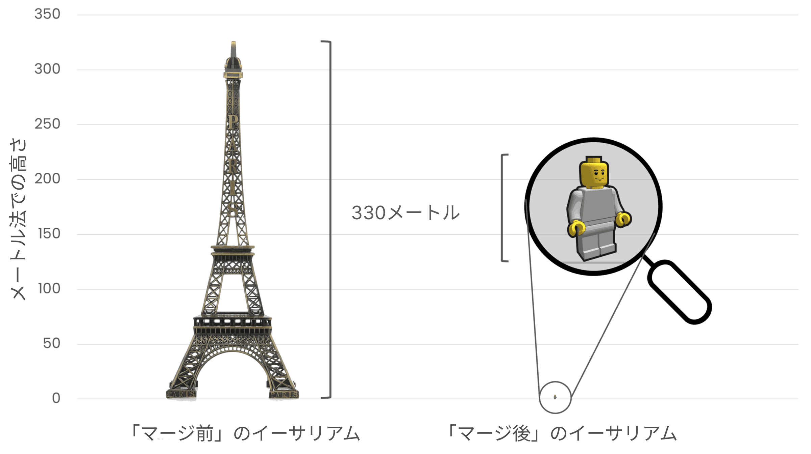

# イーサリアムのエネルギー消費 {#proof-of-stake-energy}

イーサリアムは、環境に優しいブロックチェーンです。 [プルーフ・オブ・ステーク](/developers/docs/consensus-mechanisms/pos)合意メカニズムを使用し、[エネルギーの代わりに ETH を使用してネットワーク](/developers/docs/consensus-mechanisms/pow)を保護します。 イーサリアムのプルーフ・オブ・ステークのメカニズムで消費されるエネルギーは、グローバルネットワーク全体で[1 年あたり約 0.0026 TWh](https://carbon-ratings.com/eth-report-2022)にすぎません。

[CCRI(Crypto Carbon Ratings Institute)](https://carbon-ratings.com)は、電力消費とイーサリアムネットワークのカーボンフットプリントのボトムアップ推定値を作成しました([レポート](https://carbon-ratings.com/eth-report-2022)を参照)。 CCRI は、さまざまなハードウェアとクライアントソフトウェア構成の異なるノードの電力消費を測定しました。 分析時(2022 年 9 月)のネットワークの年間電力消費量の推定値は、**2.601 MWh**(0.0026 TWh)となり、地域別の炭素集約度係数を適用すると、年間の炭素排出量は**870 トン CO2e**に相当するという結果になりました。

<EnergyConsumptionChart />

上図は、各産業の推定年間エネルギー消費量(2022 年 6 月取得)を示しています。 なお、図で示された推定値は、以下の表でリンクされている一般公開の情報源から取得したものです。 CEBCI は、Cambridge Bitcoin Electricity Consumption index(ケンブリッジビットコイン電力消費量インデックス)の略語です。 これらの値は例示的なものであり、公式の推定値、約束、予測を表すものではありません。

イーサリアムのエネルギー消費量の状況について、他の産業の年間推定値と比較することで、0.0026TWh という値が多いのか少ないのかについてしっかりと理解することができます。 データは上の棒グラフにまとめられていますが、詳細は下の表に示されています。

|                        | 年間エネルギー消費量(TWh) | PoS イーサリアムとの比較 | 情報源                                                                                                                                            |
| :--------------------- | :-----------------------: | :----------------------: | ------------------------------------------------------------------------------------------------------------------------------------------------- |
| 金の採掘               |            240            |        92,000 倍         | [情報源](https://www.kitco.com/news/2021-05-17/Gold-s-energy-consumption-doubles-that-of-bitcoin-Galaxy-Digital.html)                             |
| 金の採掘               |            130            |        50,000 倍         | [情報源](https://ccaf.io/cbeci/index/comparisons)                                                                                                 |
| ビットコイン           |            130            |        50,000 倍         | [情報源](https://digiconomist.net/bitcoin-energy-consumption)                                                                                     |
| ビットコイン           |            100            |        38,000 倍         | [情報源](https://ccaf.io/cbeci/index/comparisons)                                                                                                 |
| YouTube                |            244            |        94,000 倍         | [情報源](https://thefactsource.com/how-much-electricity-does-youtube-use/)                                                                        |
| 世界中のデータセンター |            200            |        78,000 倍         | [情報源](https://www.iea.org/commentaries/data-centres-and-energy-from-global-headlines-to-local-headaches)                                       |
| Netflix                |           0.45            |          175 倍          | [情報源](https://s22.q4cdn.com/959853165/files/doc_downloads/2020/02/0220_Netflix_EnvironmentalSocialGovernanceReport_FINAL.pdf)                  |
| Netflix                |            94             |        36,000 倍         | [情報源](https://theshiftproject.org/en/article/unsustainable-use-online-video/)                                                                  |
| PayPal                 |           0.26            |          100 倍          | [情報源](https://app.impaakt.com/analyses/paypal-consumed-264100-mwh-of-energy-in-2020-24-from-non-renewable-sources-27261)                       |
| アメリカのゲーム業界   |            34             |        13,000 倍         | [情報源](https://www.researchgate.net/publication/336909520_Toward_Greener_Gaming_Estimating_National_Energy_Use_and_Energy_Efficiency_Potential) |
| PoW イーサリアム       |            78             |        30,000 倍         | [情報源](https://digiconomist.net/ethereum-energy-consumption)                                                                                    |
| PoS イーサリアム       |          0.0026           |           1 倍           | [情報源](https://carbon-ratings.com/eth-report-2022)                                                                                              |

Youtube のエネルギー消費量はチャンネルと個々の動画別に試算されています。 [こちらの推定値](https://thefactsource.com/how-much-electricity-does-youtube-use/)から、2019 年に Youtube で江南スタイルを観るために消費したエネルギーが、プルーフ・オブ・ステークのイーサリアムが 1 年間に使用するエネルギーの 175 倍であったことが分かります。

エネルギー消費量の正確な推定値を把握するのは難しく、特に、測定対象が複雑なサプライチェーンやデプロイメントに関する詳細を含んでおり、それが効率に影響を及ぼす場合は、より困難になります。 たとえば、金の採掘にかかる上限と下限の推定値にはおよそ 90TWh の差があります。 Netflix のエネルギー消費についても、その情報源によって推定値は大きく変わります。 自己報告された推定値は、第三者による推定値の約 20 分の 1 です。この理由については、[Carbon Brief](https://www.carbonbrief.org/factcheck-what-is-the-carbon-footprint-of-streaming-video-on-netflix)でいくつか議論されています。 同様に、YoutTube の[年間消費電力は 244TWh](https://thefactsource.com/how-much-electricity-does-youtube-use/)と推定されていますが、動画のストリーミングに使用されるデバイスの種類や、データセンターなどの基盤インフラのエネルギー効率によって消費電力は大きく異なります。これらのパラメータに適した値を推定することは難しく、したがって相当な不確実性が存在します。

上のグラフには、ビットコインとの比較や、プルーフ・オブ・ワークを使用していた頃のイーサリアムとの比較も含まれています。 ビットコインのエネルギー消費量の推定値は情報源によって大きく異なり、エネルギー消費量だけでなく、そのエネルギー源や関連する倫理観など、ニュアンスある[議論](https://www.coindesk.com/business/2020/05/19/the-last-word-on-bitcoins-energy-consumption/)が多く集まるトピックです。

多くの記事では、ブロックチェーンの「トランザクションごと」のエネルギー消費量を推定しています。 ブロックを提案、検証するために必要なエネルギーはブロック内のトランザクション数とは無関係のため、誤解を招く可能性があります。 トランザクション単位でエネルギー消費量を試算すると、トランザクション数が少なければエネルギー消費量も少なくなり、その逆もしかりということになりますが、実際はそうではありません。 また、トランザクションごとの推定値は、ブロックチェーンのトランザクションスループットの定義に非常に敏感であり、この定義を微調整することで、値を大きくしたり小さくしたりすることができます。

たとえば、イーサリアムでは、トランザクションのスループットはベースレイヤーのものだけでなく、「[レイヤー 2](/layer-2/)」のロールアップで行われたトランザクションスループット全ての合計です。 通常、レイヤー 2 は計算に含まれませんが、シーケンサーが消費する追加エネルギー(小)と、シーケンサーが処理するトランザクション数(大)を考慮すると、トランザクションごとの推定値が大幅に減少する可能性があります。 これが、プラットフォーム間のトランザクションごとのエネルギー消費量の比較が誤解を招きかねない理由の 1 つです。

## イーサリアムの炭素負債 {#carbon-debt}

イーサリアムのエネルギー消費量は非常に低いものの、以前からそうだったわけではありません。 イーサリアムは当初プルーフ・オブ・ワークを採用しており、現在のプルーフ・オブ・ステークと比べて環境への負荷が非常に大きい仕組みでした。

当初から、プルーフ・オブ・ステークに基づく合意メカニズムの実装を計画していましたが、安全性と分散化を損なうことなく実現するためには、集中的な研究開発に数年を要しました。 こうした背景から、まずはネットワークを開始するために、プルーフ・オブ・ワークのメカニズムが採用されたのです。 プルーフ・オブ・ワークは、マイナーが自分のハードウェアを使って値を計算する必要があり、その過程でエネルギーを消費します。 イーサリアムの総エネルギー消費量は、暗号通貨市場の上げ相場のピークであった 2022 年 2 月に、年間 94TWh 弱となり、ピークを迎えました。 プルーフ・オブ・ステークに移行する直前のエネルギー消費量は、ウズベキスタンの国家消費量に匹敵するほどの[78TWh/yr](https://digiconomist.net/ethereum-energy-consumption)弱にのぼり、アゼルバイジャンと(33MT/yr)同程度の二酸化炭素排出量でした。

イーサリアムがプルーフ・オブ・ワークからプルーフ・オブ・ステークに移行する際の影響について、CCRI による調査が行われました。 年間消費電力量を**99.988%**以上削減しました。 同様に、イーサリアムの二酸化炭素排出量も約**99.992%**削減しました(11,016,000 トン CO2e から 870 トン CO2e へ削減) 。 比喩的に表現すると、上図で示すように、エッフェル塔の高さから小さなプラスチック製のおもちゃのフィギュアの高さにまで排出量を削減したことになります。 その結果、ネットワークの安全性を確保するための環境負荷は大幅に軽減され、 同時に、ネットワークのセキュリティが向上したと考えられています。

## 環境にやさしいアプリケーションレイヤー {#green-applications}

イーサリアムのエネルギー消費量が非常に少ない一方で、イーサリアム上で**再生金融(ReFi)**コミュニティも構築され、大きく成長し、活発化しています。 再生金融(ReFi)アプリケーションは、分散型金融(DeFi)コンポーネントを使って、環境にプラスとなるような外部性をもたらす金融アプリケーションを構築します。 再生金融(ReFi)は、イーサリアムと密接に連携し、技術の進歩と環境保全の両立を目指す[「Solarpunk」](https://en.wikipedia.org/wiki/Solarpunk)運動の一翼を担っています。 イーサリアムが分散型かつ自由参加型で、構成可能であるため、再生金融(ReFi)やソーラーパンクコミュニティの理想的なベースレイヤーとなっています。

[Gitcoin](https://gitcoin.co)のような Web3 ネイティブの公共財資金調達プラットフォームは、イーサリアムのアプリケーションレイヤー上で環境に配慮した構築を促進するために気候ラウンドを実行します。 これらの開発(例:[DeSci](/desci/)など)を通じて、イーサリアムは環境的にも社会的にもネットポジティブな技術になりつつあります。

<InfoBanner emoji=":evergreen_tree:">
  このページの精度の向上に貢献できるとお考えの方は、問題またはPRを提起してください。 このページの統計は、公開されているデータに基づく推定値であり、ethereum.orgチームやイーサリアム・ファウンデーションの公式声明や約束を示すものではありません。 
</InfoBanner>

## 参考文献 {#further-reading}

- [プルーフオブワークのブロックチェーンに関するホワイトハウス報告書](https://www.whitehouse.gov/wp-content/uploads/2022/09/09-2022-Crypto-Assets-and-Climate-Report.pdf)
- [イーサリアムのエネルギー消費](https://mirror.xyz/jmcook.eth/ODpCLtO4Kq7SCVFbU4He8o8kXs418ZZDTj0lpYlZkR8)
- [イーサリアムの二酸化炭素排出量: ボトムアップ推定値](https://kylemcdonald.github.io/ethereum-emissions/) – Kyle McDonald
- [イーサリアムのエネルギー消費指標](https://digiconomist.net/ethereum-energy-consumption/) – _Digiconomist_
- [ETHMerge.com](https://ethmerge.com/) —_[@InsideTheSim](https://twitter.com/InsideTheSim)_
- [マージ - イーサリアムネットワークの電力消費量と二酸化炭素排出量への影響](https://carbon-ratings.com/eth-report-2022) - _CCRI_

## 関連トピック {#related-topics}

- [イーサリアムのビジョン](/roadmap/vision/)
- [ビーコンチェーン](/roadmap/beacon-chain)
- [マージ](/roadmap/merge/)
