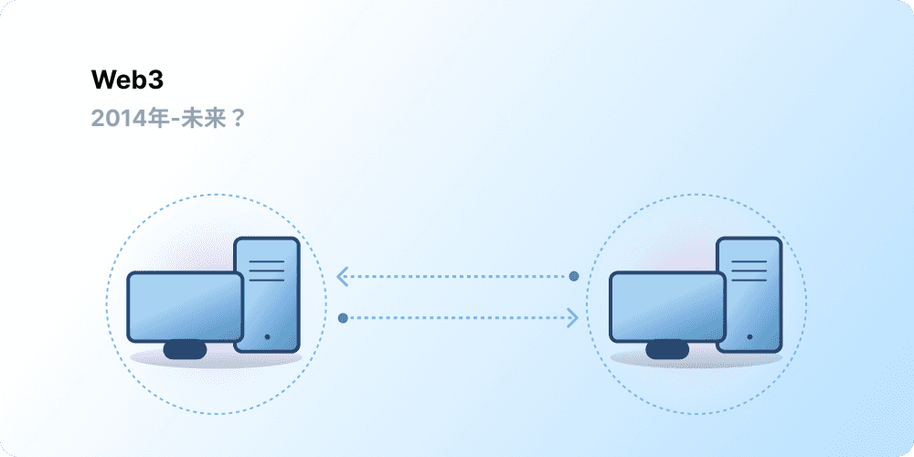

# Web3入門 {#introduction}

中央集権化により、何十億人もの人々がワールドワイドウェブを使い始め、またその基盤となる安定し、堅牢なインフラストラクチャの構築に貢献しました。 同時に、一握りの中央集権組織が大規模にワールドワイドウェブ(World Wide Web)の拠点を占め、一方的に、何が許され、何が許されないかを決定しています。

Web3は、このジレンマに対する答えです。 Web3は、大企業が独占するWebではなく、ユーザーにより構築、運営、所有される非中央集権的な分散化を採用しています。 Web3は企業ではなく個人の手に権力を与えます。 Web3について話す前に、これまでの経緯について振り返ってみましょう。

<Divider />

## 初期のWeb {#early-internet}

ほとんどの人々は、Webの発明以来、存続してきたWebを現代生活の柱として考えています。 しかし、私たちのほとんどが知っている現在のWebは、発明当初に想定されたものとはかなり異なります。 これを分かりやすく理解するために、Webの短い歴史をWeb1.0とWeb2.0に大まかに分けて振り返りましょう。

### Web1.0: 読み取り専用 (1990年～2004年) {#web1}

1989年ジュネーブのセルンで、Tim Berners-Leeは後のワールドワイドウェブ(World Wide Web)となるプロトコルの開発に取り組みました。 彼のアイデアはというと、 地球上のどこからでも情報共有を可能にするオープンな分散型プロトコルを作成することでした。

Berners-Leeが考案した、現在「Web1.0」と呼ばれている最初の創成期は、およそ1990年から2004年の間に起こりました。 Web1.0は、企業が所有する静的なWebサイトが中心で、ユーザー同士の交流はほとんどなく、個人がコンテンツを制作することはほとんどなかったため、読み取り専用のWebとして知られるようになりました。

### Web2.0: 読み取り-書き込み(2004年～現在) {#web2}

Web2.0の時代は、ソーシャルメディアプラットフォームの出現とともに2004年に始まりました。 読み取りだけでなく、ウェブは読み書きできるように進化しました。 企業だけがコンテンツを提供するのではなく、ユーザーが自分で制作したコンテンツを共有し、ユーザー間の交流を行うプラットフォームを提供し始めました。 より多くの人々がインターネットを利用するようになるにつれ、一握りの大企業がウェブ上で生み出されるトラフィックと価値を不均衡にコントロールするようになりました。 また、Web2.0では広告主導型の収益モデルが誕生しました。 ユーザーはコンテンツを作成することができますが、コンテンツを所有したり、収益化の恩恵を受けることはありませんでした。

<Divider />

## Web3.0: 読み取り - 書き込み - 所有 {#web3}

「Web3.0」の前提は、イーサリアムが2014年にリリースされた直後に、 [イーサリアム](/what-is-ethereum/)の共同創設者であるGavin Woodによって作成されました。 Gavinは、初期の暗号採用者の多くが感じていた「Webは過度の信頼を必要としすぎる」という問題の解決策を言葉にしました。 現在私たちが使っているWebのほとんどは、一握りの民間企業が公共の利益のために行動してくれるだろうという「信頼」に依存しています。

### Web3とは {#what-is-web3}

Web3は、新しい、より良いインターネットのビジョンのための包括的な用語となっています。 その中核として、Web3はブロックチェーン、暗号通貨、およびNFTを使い、所有権という形でユーザーに力を戻します。 [Twitterでの2021年の投稿](https://twitter.com/j1mmyeth/status/1459003044067258370)によくそれが表されていますが、Web1は読み取り専用で、Web2は読み取り/書き込み、Web3は読み書き/書き込み/所有が行われると述べています。

#### Web3の主要なアイデア {#core-ideas}

Web3とはについて厳密な定義を提供することは困難ですが、Web3の主な原則についていくつか説明します。

- **Web3は非中央集権型:** インターネットの大部分を中央集権的な組織が管理・所有するのではなく、その所有権はデベロッパーとユーザーの間で分散されます。
- **Web3はパーミッションレス:** 誰もが Web3に参加する平等なアクセス権を持っており、誰も除外されることはありません。
- **Web3にはネイティブの支払いが搭載:** 銀行や支払い処理者の時代遅れのインフラストラクチャに頼るのではなく、暗号通貨を使ってオンラインで送金します。
- **Web3はトラストレス:** 信頼できるサードパーティーに頼る必要はなく、インセンティブと経済メカニズムを使用して動作します。

### Web3の重要性 {#why-is-web3-important}

Web3の並外れた機能は、明確に分けられるものではなく、分類できるものでもありませんが、分かりやすくするために、ここではあえて分けて説明します。

#### 所有権 {#ownership}

Web3は、前例のない方法でデジタル資産の所有権を提供します。 例えば、Web2のゲームをプレイしているとします。 ゲーム内アイテムを購入すると、アカウントに直接紐づけられます。 ゲームクリエイターがアカウントを削除すると、これらのアイテムが失われてしまいます。 または、ゲームのプレイを停止すると、ゲーム内アイテムに投資した価値が失われます。

Web3では、 [ 非代替性トークン(NFT)](/glossary/#nft) を通じて直接所有することができます。 所有権は、誰からも、ゲームのクリエイターからも奪い取られることはありません。 また、ゲームをするのをやめても、ゲーム内のアイテムをオープンマーケットで売却・取引することで、その価値を回収することができます。

<InfoBanner shouldSpaceBetween emoji=":eyes:">
  
非代替性トークン(NFT)について学ぶ

  <ButtonLink href="/nft/">
    非代替性トークン(NFT)の詳細
  </ButtonLink>
</InfoBanner>

#### 検閲耐性 {#censorship-resistance}

プラットフォームとコンテンツの製作者は、非常に不均衡な力関係にあります。

OnlyFansは、100万人を超えるプラットフォームユーザーがコンテンツ作成したアダルトコンテンツサイトで、ユーザーの多くが主な収入源としてプラットフォームを使用しています。 2021年8月に、OnlyFansは不適切な性的コンテンツを禁止する計画を発表しました。 この発表により、自分たちがこれまでコンテンツを提供し、貢献してきたプラットフォームからの収入を奪われるクリエイターの間に、激しい怒りを引き起こしました。 この反発の後、決定はすぐに覆されることになりました。 クリエイターが勝利したとはいえ、Web2.0のクリエイターにとって、プラットフォームを離れれば、せっかく築いた評価やフォロワーを失うという問題が浮き彫りになりました。

Web3では、データはブロックチェーンに保存されます。 あるプラットフォームから離れる場合は、自身の評判を伴って、自分の価値観に合った別のインターフェースに移行することができます。

Web2.0では、コンテンツ制作者は「プラットフォームのルールは変更されない」とプラットフォームを信用する必要がありますが、検閲耐性はWeb3プラットフォームのネイティブの機能です。

#### 分散型自律組織(DAO) {#daos}

Web3では、自分のデータを所有するだけでなく、企業の株式のように機能するトークンを使って、プラットフォームを集団にて所有することができます。 分散型自律組織(DAO)はプラットフォームの分散型の所有権を取りまとめ、ユーザーがプラットフォームの今後についての意思決定をすることができます。

分散型自律組織(DAO)は、技術的には、リソース(トークン)のプールに対する分散型の意思決定を自動化する、合意された[スマートコントラクト](/glossary/#smart-contract)と定義されています。 トークンを持ったユーザーがリソースの使い道について投票し、その投票結果をコードが自動的に実行します。

しかし、多くのWeb3コミュニティが分散型自律組織(DAO)として定義されています。 これらのコミュニティはすべて、コードによる分散化と自動化のレベルが異なります。 現在、分散型自律組織(DAO)とは何か、今後どのような進化を遂げるかを模索が行われているところです。

<InfoBanner shouldSpaceBetween emoji=":eyes:">
  
分散型自律組織(DAO)についてもっと知る

  <ButtonLink href="/dao/">
    分散型自律組織(DAO)の詳細
  </ButtonLink>
</InfoBanner>

### アイデンティティ {#identity}

慣例的に、使用するすべてのプラットフォームでアカウントを作成する必要があります。 例えば、Twitterアカウント、YouTubeアカウント、Redditアカウントを持っているとします。 そこで、表示名またはプロフィール画像を変更したい場合は、 それぞれのアカウントで変更作業をしなければなりません。 ソーシャルサインインを使用する場合もありますが、これは検閲という問題を引き起こします。 これらのプラットフォームは、ワンクリックで、オンライン上の生活すべてからあなたを締め出すことができます。 さらに、多くのプラットフォームでは、アカウントを作成するには個人を特定できる情報を提供する必要があります。

Web3は、イーサリアムアドレスと[イーサリアムネームサービス(ENS) ](/glossary/#ens)プロファイルを使用してデジタルアイデンティティを制御できるようにすることで、これらの問題を解決します。 イーサリアムアドレスを使用すると、安全で、検閲耐性があり、匿名のプラットフォームすべてにおいて、シングルログインが利用できます。

### ネイティブの支払い {#native-payments}

銀行口座のない人や銀行口座を持つことができない国に住む人を除いて、Web2の支払いインフラストラクチャは、銀行や支払い業者に依存しています。 Web3は [ETH](/glossary/#ether)のようなトークンをブラウザで直接送金するため、信頼できるサードパーティを必要としません。

<ButtonLink href="/eth/">
  ETHの詳細
</ButtonLink>

## Web3の制限 {#web3-limitations}

Web3には多くの利点があるにもかかわらず、エコシステムが繁栄するためにはまだ多くの制限があります。

### アクセシビリティ {#accessibility}

イーサリアムでサインインするなどの重要なWeb3機能は、誰でも無料で使用することができます。 しかし、トランザクションの相対的なコストは依然として高額です。 Web3は、高いトランザクションフィーのため、裕福でない人々や、発展途上国では利用されそうもありません。 イーサリアムでは、これらの課題は[ロードマップ](/roadmap/)と[レイヤー2スケーリングソリューション](/glossary/#layer-2)を通じて解決されています。 技術の準備はできていますが、Web3を誰でもアクセスしやすくするには、レイヤー2でより高レベルの導入が必要です。

### ユーザーエクスペリエンス {#user-experience}

Web3を使用するには、現在のところ技術的な障壁は高く、 ユーザーは、セキュリティ上の懸念を理解し、複雑な技術文書を理解し、直感的でないユーザーインターフェイスで操作する必要があります。 [ウォレットプロバイダー](/wallets/find-wallet/)は特にこれを解決するために取り組んでいますが、Web3が大きく採用されるまでには、まだ多くの進歩が必要です。

### 教育 {#education}

Web3では、新しい枠組みのため、Web2.0で使われているものとは異なるメンタルモデルを学ぶことが求められます。 1990年代後半にWeb1.0が人気を博した頃、似たような教育活動が起こりました。ウェブの支持者たちにより、一般の人々を簡単な例えを使った教育(情報ハイウェイ、ブラウザー、ウェブサーフィン)から[テレビ放送](https://www.youtube.com/watch?v=SzQLI7BxfYI)まで様々な方法で広報活動が行われました 。 Web3は難しくはありませんが、これまでとは概念が異なります。 Web3のメリットをWeb2ユーザーに知らせる教育的なイニシアチブは、Web3の発展には不可欠です。

ethereum.orgは、重要なイーサリアムコンテンツをできるだけ多くの言語に翻訳することを目指して、 [翻訳プログラム](/contributing/translation-program/)を通じてWeb3の教育に貢献しています。

### 中央集権化されたインフラストラクチャ {#centralized-infrastructure}

Web3エコシステムは若く、急速に進化しています。 その結果、現在は主に中央集権型のインフラストラクチャ(GitHub、Twitter、Discordなど)に依存しています。 多くのWeb3企業がこれらのギャップを埋めるために急いでいますが、高品質で信頼性の高いインフラストラクチャを構築するには時間がかかります。

## 非中央集権型の未来 {#decentralized-future}

Web3は、若く、進化を遂げているエコシステムです。 2014年にGavin Woodがこの言葉を作りましたが、これらのアイデアの多くは最近、現実のものになっています。 昨年だけでも、暗号通貨への関心がかなり高まり、レイヤー2スケーリングソリューションの改善、新しいガバナンス形態の大規模な実験、デジタルアイデンティティの革命が行われました。

Web3によるより良いWebの実現はまだ始まったばかりですが、それを支えるインフラの整備が進めば、Webの未来は明るいでしょう。

## 参加方法 {#get-involved}

- [ウォレットの取得](/wallets/)
- [コミュニティを探す](/community/)
- [Web3アプリケーションの探索](/dapps/)
- [分散型自律組織(DAO)に参加](/dao/)
- [Web3上での開発](/developers/)

## 参考文献 {#further-reading}

Web3とは何かは、厳密に定義されていません。 さまざまなコミュニティが多様な視点を持っています。 下記にこれらのいくつかをご紹介します。

- [Web3とは? 未来の非中央集権インターネットの説明](https://www.freecodecamp.org/news/what-is-web3/) – _Nader Dabit_
- [Web3の理解](https://medium.com/l4-media/making-sense-of-web-3-c1a9e74dcae) - _Josh Stark_
- [Web3が重要な理由](https://future.a16z.com/why-web3-matters/) - _Chris Dixon_
- [非中央集権化が重要な理由](https://onezero.medium.com/why-decentralization-matters-5e3f79f7638e) - _Chris Dixon_
- [Web3のランドスケープ](https://a16z.com/wp-content/uploads/2021/10/The-web3-Readlng-List.pdf) - _a16z_
- [Web3に関する議論](https://www.notboring.co/p/the-web3-debate?s=r) - _Packy McCormick_

<QuizWidget quizKey="web3" />
