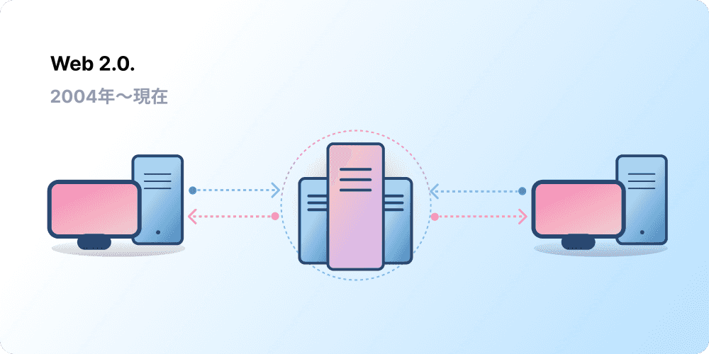
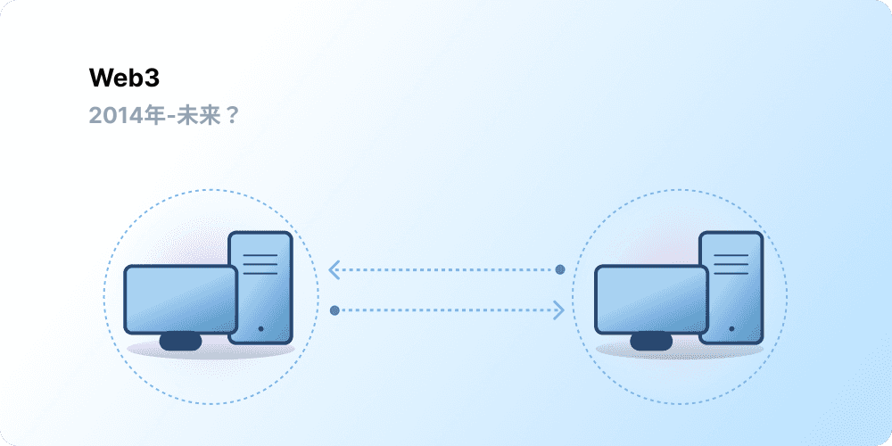

中央集権化は、何十億人もの人々をWorld Wide Webに引き入れるのに役立ち、それが存在する安定した堅牢なインフラストラクチャを構築しました。同時に、少数の集権的な組織がWorld Wide Webの大部分を支配し、何が許可されるべきで何が許可されるべきでないかを一方的に決定しています。

Web3は、このジレンマに対する答えです。大手テクノロジー企業によって独占されたWebではなく、Web3は分散化を受け入れ、ユーザーによって構築、運営、所有されています。Web3は、企業ではなく個人の手に力を委ねます。
Web3について話す前に、私たちがどのようにしてここに至ったのかを探ってみましょう。

<Divider />

## 初期段階のWeb {#early-internet}

多くの人は、Webを現代生活の継続的な柱と考えています。つまり、発明されて以来、ただ存在し続けているものだと。しかし、今日私たちが知っているWebの大部分は、当初想像されていたものとは大きく異なります。これをよりよく理解するためには、Webの短い歴史をWeb 1.0とWeb 2.0という大まかな期間に分けることが役立ちます。

### Web 1.0: 読み取り専用 (1990-2004) {#web1}

1989年、ジュネーブのCERNで、ティム・バーナーズ＝リーはWorld Wide Webとなるプロトコルの開発に忙殺されていました。彼のアイデアは、地球上のどこからでも情報共有を可能にする、オープンで分散型のプロトコルを作成することでした。

現在「Web 1.0」として知られるバーナーズ＝リーの創造物の最初の始まりは、およそ1990年から2004年の間に起こりました。Web 1.0は主に企業が所有する静的なウェブサイトであり、ユーザー間の相互作用はほぼゼロでした。個人がコンテンツを作成することはめったになく、そのため読み取り専用のWebとして知られるようになりました。

### Web 2.0: 読み書き (2004-現在) {#web2}

Web 2.0の時代は、ソーシャルメディアプラットフォームの出現とともに2004年に始まりました。読み取り専用ではなく、Webは読み書きできるように進化しました。企業がユーザーにコンテンツを提供するだけでなく、ユーザー生成コンテンツを共有し、ユーザー間の相互作用に参加するためのプラットフォームも提供し始めました。より多くの人々がオンラインになるにつれて、少数のトップ企業がWeb上で生成されるトラフィックと価値の不均衡な量を支配し始めました。Web 2.0はまた、広告主導の収益モデルを生み出しました。ユーザーはコンテンツを作成できましたが、それを所有したり、その収益化から利益を得たりすることはできませんでした。

<Divider />

## ウェブ・3.0: 読み書き・所有 {#web3}

「ウェブ・3.0」の前提は、2014年に[イーサリアム](/)が立ち上げられた直後に、イーサリアムの共同創設者であるギャビン・ウッドによって作られました。ギャビンは、多くの初期の暗号資産の採用者が感じていた問題、つまりWebは過剰な信頼を必要としているという問題に対する解決策を言葉にしました。すなわち、今日人々が知っていて使用しているWebの大部分は、少数の民間企業が公共の利益のために行動することを信頼することに依存しているということです。

### Web3とは何か？ {#what-is-web3}

Web3は、新しくより良いインターネットのビジョンを表す包括的な用語になりました。その中核として、Web3はブロックチェーン、暗号資産、NFTを使用して、所有権という形でユーザーに力を取り戻します。[2020年のツイッターへの投稿](https://twitter.com/himgajria/status/1266415636789334016)がそれを最もよく表しています。Web1は読み取り専用、Web2は読み書き、Web3は読み書き・所有になるだろう、と。

#### Web3の核となるアイデア {#core-ideas}

Web3とは何かについて厳密な定義を提供することは困難ですが、いくつかの核となる原則がその創造を導いています。

- **Web3は分散型です:** インターネットの大部分が集権的な組織によって管理および所有されるのではなく、所有権はその構築者とユーザーの間で分散されます。
- **Web3はパーミッションレスです:** 誰もがWeb3に参加するための平等なアクセス権を持ち、誰も排除されません。
- **Web3にはネイティブな決済機能があります:** 銀行や決済プロセッサの時代遅れのインフラストラクチャに依存するのではなく、オンラインでの支払いや送金に暗号資産を使用します。
- **Web3はトラストレスです:** 信頼できる第三者に依存するのではなく、インセンティブと経済的メカニズムを使用して機能します。

### なぜWeb3は重要なのか？ {#why-is-web3-important}

Web3のキラー機能は独立しておらず、きちんとしたカテゴリーに収まるわけではありませんが、わかりやすくするために、ここではそれらを分けて説明します。

#### 所有権 {#ownership}

Web3は、これまでにない方法でデジタル資産の所有権を提供します。例えば、Web2のゲームをプレイしているとします。ゲーム内アイテムを購入した場合、それはあなたのアカウントに直接結び付けられます。ゲームの作成者があなたのアカウントを削除した場合、あなたはこれらのアイテムを失います。あるいは、ゲームのプレイをやめた場合、ゲーム内アイテムに投資した価値を失います。

Web3は、[非代替性トークン (NFT)](/glossary/#nft)を通じた直接的な所有権を可能にします。ゲームの作成者でさえ、あなたの所有権を奪う力を持つ人は誰もいません。そして、プレイをやめた場合でも、オープンマーケットでゲーム内アイテムを販売または取引し、その価値を回収することができます。これが実際にどのように機能するかについては、[オンチェーンゲーム](/gaming/)をご覧ください。

<Alert variant="update">
<AlertEmoji text=":eyes:"/>
<AlertContent className="flex-row items-center justify-between">
  
NFTについてさらに学ぶ

  <ButtonLink href="/nft/">
    NFTの詳細
  </ButtonLink>
</AlertContent>
</Alert>

#### 検閲耐性 {#censorship-resistance}

プラットフォームとコンテンツクリエイターの間の力関係は、非常に不均衡です。

OnlyFansは、100万人以上のコンテンツクリエイターを抱えるユーザー生成の成人向けコンテンツサイトであり、その多くがプラットフォームを主な収入源として使用しています。2021年8月、OnlyFansは性的に露骨なコンテンツを禁止する計画を発表しました。この発表は、自分たちが構築に貢献したプラットフォームで収入を奪われていると感じたクリエイターたちの間で激しい怒りを引き起こしました。反発を受けた後、この決定はすぐに撤回されました。クリエイターはこの戦いに勝利したものの、これはWeb 2.0のクリエイターにとっての問題を浮き彫りにしています。つまり、プラットフォームを離れると、蓄積した評判やフォロワーを失うということです。

Web3では、あなたのデータはブロックチェーン上に存在します。プラットフォームを離れることを決定した場合、自分の評判を持ち運び、自分の価値観により明確に合致する別のインターフェースに接続することができます。

Web 2.0では、コンテンツクリエイターはプラットフォームがルールを変更しないことを信頼する必要がありますが、検閲耐性はWeb3プラットフォームのネイティブな機能です。

#### 分散型自律組織 (DAO) {#daos}

Web3で自分のデータを所有するだけでなく、会社の株式のように機能するトークンを使用して、集団としてプラットフォームを所有することもできます。DAOを使用すると、プラットフォームの分散型所有権を調整し、その将来についての意思決定を行うことができます。

DAOは技術的には、リソース（トークン）のプールに対する分散型の意思決定を自動化する、合意された[スマートコントラクト](/glossary/#smart-contract)として定義されます。トークンを持つユーザーはリソースの使途について投票し、コードが自動的に投票結果を実行します。

しかし、人々は多くのWeb3コミュニティをDAOと定義しています。これらのコミュニティはすべて、コードによる分散化と自動化のレベルが異なります。現在、私たちはDAOとは何か、そして将来どのように進化する可能性があるかを探求しています。

<Alert variant="update">
<AlertEmoji text=":eyes:"/>
<AlertContent className="flex-row items-center justify-between">
  
DAOについてさらに学ぶ

  <ButtonLink href="/dao/">
    DAOの詳細
  </ButtonLink>
</AlertContent>
</Alert>

### アイデンティティ {#identity}

従来、使用するプラットフォームごとにアカウントを作成していました。例えば、ツイッターのアカウント、ユーチューブのアカウント、レディットのアカウントを持っているかもしれません。表示名やプロフィール画像を変更したい場合はどうでしょうか？すべてのアカウントで変更を行う必要があります。場合によってはソーシャルサインインを使用することもできますが、これにはおなじみの問題、つまり検閲が伴います。これらのプラットフォームは、ワンクリックであなたのオンライン生活全体からあなたを締め出すことができます。さらに悪いことに、多くのアカウントを作成する際、個人を特定できる情報をプラットフォームに委ねる必要があります。

Web3は、イーサリアムのアドレスと[Ethereum Name Service (ENS)](/glossary/#ens)プロファイルを使用してデジタルアイデンティティを制御できるようにすることで、これらの問題を解決します。イーサリアムのアドレスを使用すると、安全で検閲耐性があり、匿名性を保ったまま、プラットフォーム間で単一のログインが可能になります。

### ネイティブな決済機能 {#native-payments}

Web2の決済インフラストラクチャは銀行や決済プロセッサに依存しており、銀行口座を持たない人々や、たまたま特定の国境内に住んでいる人々を排除しています。
Web3は[ETH](/glossary/#ether)のようなトークンを使用してブラウザ内で直接送金を行い、信頼できる第三者を必要としません。

<ButtonLink href="/what-is-ether/">
  ETHの詳細
</ButtonLink>

## Web3の限界 {#web3-limitations}

現在の形態のWeb3には数多くの利点があるにもかかわらず、エコシステムが繁栄するために対処しなければならない多くの限界がまだ存在します。

### アクセシビリティ {#accessibility}

「Sign-in with Ethereum」のような重要なWeb3機能は、すでに誰でも無料で利用できます。しかし、トランザクションの相対的なコストは依然として多くの人にとって法外です。高いトランザクション手数料のため、Web3は裕福でない発展途上国では利用されにくい傾向があります。イーサリアムでは、これらの課題は[ロードマップ](/roadmap/)と[レイヤー2 (L2) スケーリングソリューション](/glossary/#layer-2)を通じて解決されつつあります。技術的な準備は整っていますが、Web3を誰もがアクセスできるようにするためには、レイヤー2 (L2) でのより高いレベルの普及が必要です。

### ユーザーエクスペリエンス {#user-experience}

Web3を使用するための技術的な参入障壁は、現在高すぎます。ユーザーはセキュリティ上の懸念を理解し、複雑な技術文書を読み解き、直感的でないユーザーインターフェースを操作しなければなりません。特に[ウォレットプロバイダー](/wallets/find-wallet/)はこれを解決するために取り組んでいますが、Web3が大規模に採用されるにはさらなる進歩が必要です。

### 教育 {#education}

Web3は、Web 2.0で使用されているものとは異なるメンタルモデルの学習を必要とする新しいパラダイムを導入します。1990年代後半にWeb 1.0が人気を集めていたときにも、同様の教育の推進が行われました。World Wide Webの支持者は、単純なメタファー（情報スーパーハイウェイ、ブラウザ、ネットサーフィン）から[テレビ放送](https://www.youtube.com/watch?v=SzQLI7BxfYI)まで、大衆を教育するために多数の教育手法を使用しました。Web3は難しいわけではありませんが、異なっています。Web2ユーザーにこれらのWeb3パラダイムを知らせる教育的取り組みは、その成功にとって不可欠です。

Ethereum.orgは、重要なイーサリアムのコンテンツをできるだけ多くの言語に翻訳することを目指す[翻訳プログラム](/contributing/translation-program/)を通じて、Web3の教育に貢献しています。

### 集権的なインフラストラクチャ {#centralized-infrastructure}

Web3エコシステムは若く、急速に進化しています。その結果、現在は主に集権的なインフラストラクチャ（GitHub、ツイッター、ディスコードなど）に依存しています。多くのWeb3企業がこれらのギャップを埋めるために急いでいますが、高品質で信頼性の高いインフラストラクチャを構築するには時間がかかります。

## 分散型の未来 {#decentralized-future}

Web3は若く、進化しているエコシステムです。ギャビン・ウッドは2014年にこの用語を作りましたが、これらのアイデアの多くは最近になってようやく現実のものとなりました。昨年だけでも、暗号資産への関心の大幅な高まり、レイヤー2 (L2) スケーリングソリューションの改善、新しい形態のガバナンスに関する大規模な実験、そしてデジタルアイデンティティにおける革命がありました。

私たちはWeb3でより良いWebを創造する初期段階に過ぎませんが、それを支えるインフラストラクチャを改善し続けるにつれて、Webの未来は明るいものに見えます。

## どのように参加できるか {#get-involved}

- [ウォレットを入手する](/wallets/)
- [コミュニティを見つける](/community/)
- [Web3アプリケーションを探索する](/apps/)
- [DAOに参加する](/dao/)
- [Web3で構築する](/developers/)

## 参考文献 {#further-reading}

Web3は厳密に定義されていません。コミュニティのさまざまな参加者が、それについて異なる視点を持っています。そのうちのいくつかを紹介します。

- [Web3とは何か？未来の分散型インターネットの解説](https://www.freecodecamp.org/news/what-is-web3) – _Nader Dabit_
- [Web 3を理解する](https://medium.com/l4-media/making-sense-of-web-3-c1a9e74dcae) – _Josh Stark_
- [なぜWeb3が重要なのか](https://a16zcrypto.com/posts/article/why-web3-matters/) — _Chris Dixon_
- [なぜ分散化が重要なのか](https://onezero.medium.com/why-decentralization-matters-5e3f79f7638e) - _Chris Dixon_
- [Web3の展望](https://a16z.com/wp-content/uploads/2021/10/The-web3-Readlng-List.pdf) – _a16z_
- [Web3の議論](https://www.notboring.co/p/the-web3-debate) – _Packy McCormick_

<QuizWidget quizKey="web3" />
