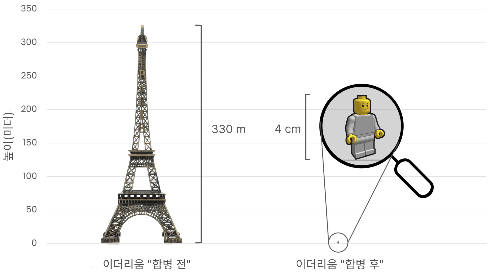

# 이더리움의 에너지 소비량 {#proof-of-stake-energy}

이더리움은 친환경 블록체인입니다. 이더리움의 [지분 증명](/developers/docs/consensus-mechanisms/pos) 합의 메커니즘은 [네트워크를 보호하기 위한 에너지](/developers/docs/consensus-mechanisms/pow) 대신 ETH를 사용합니다. 이더리움의 에너지 소비량은 전체 글로벌 네트워크에 걸쳐 약 [~0.0026 TWh/yr](https://carbon-ratings.com/eth-report-2022)입니다.

이더리움의 에너지 소비 추정치는 [CCRI(암호화폐 탄소 등급 연구소)](https://carbon-ratings.com)의 연구에서 비롯되었습니다. 이들은 이더리움 네트워크의 전력 소비 및 탄소 발자국에 대한 상향식 추정치를 생성했습니다([보고서 참조](https://carbon-ratings.com/eth-report-2022)). CCRI는 다양한 하드웨어와 소프트웨어 설정으로 구성된 다른 노드들의 전기 사용량을 측정했습니다. 네트워크의 연간 전력 소비량 추정치인 **2,601MWh**(0.0026TWh)는 지역별 탄소 집약도 요인을 적용할 경우 연간 **870톤의 CO2e** 탄소 배출량에 해당합니다. 이 값은 노드가 네트워크에 참여하거나 떠날 때 변경됩니다. [케임브리지 블록체인 네트워크 지속 가능성 지수](https://ccaf.io/cbnsi/ethereum)의 7일 이동 평균 추정치를 사용하여 추적할 수 있습니다(해당 기관은 추정에 약간 다른 방법을 사용하며, 자세한 내용은 사이트에서 확인할 수 있습니다).

이더리움의 에너지 소비를 설명하기 위해 일부 다른 제품 및 산업에 대한 연간 추정치를 비교할 수 있습니다. 이는 이더리움에 대한 추정치가 높은지 낮은지를 더 잘 이해하는 데 도움이 됩니다.

<EnergyConsumptionChart />

위 차트는 이더리움의 연간 추정 에너지 소비량(TWh/yr)을 여러 다른 제품 및 산업과 비교하여 보여줍니다. 제공된 추정치는 2023년 7월에 액세스한 공개 정보를 출처로 하며, 출처 링크는 아래 표에서 확인할 수 있습니다.

|              | 연간 에너지 소비량 (TWh) | PoS 이더리움 대비 |                                                                                       출처                                                                                      |
| :----------- | :---------------------------------: | :---------: | :---------------------------------------------------------------------------------------------------------------------------------------------------------------------------: |
| 세계 데이터 센터    |                 190                 |   73,000배   |                                    [출처](https://www.iea.org/commentaries/data-centres-and-energy-from-global-headlines-to-local-headaches)                                    |
| 비트코인         |                 149                 |   53,000배   |                                                                 [출처](https://ccaf.io/cbnsi/cbeci/comparisons)                                                                 |
| 금 채굴         |                 131                 |   50,000x   |                                                                 [출처](https://ccaf.io/cbnsi/cbeci/comparisons)                                                                 |
| 미국내 게임\*     |                  34                 |   13,000x   |                 [출처](https://www.researchgate.net/publication/336909520_Toward_Greener_Gaming_Estimating_National_Energy_Use_and_Energy_Efficiency_Potential)                 |
| PoW 이더리움     |                  21                 |    8,100배   |                                                                     [출처](https://ccaf.io/cbnsi/ethereum/1)                                                                    |
| 구글           |                  19                 |    7,300배   |                                           [출처](https://www.gstatic.com/gumdrop/sustainability/google-2022-environmental-report.pdf)                                           |
| 넷플릭스         |        0.457        |     176배    | [출처](https://assets.ctfassets.net/4cd45et68cgf/7B2bKCqkXDfHLadrjrNWD8/e44583e5b288bdf61e8bf3d7f8562884/2021_US_EN_Netflix_EnvironmentalSocialGovernanceReport-2021_Final.pdf) |
| 페이팔          |         0.26        |     100x    |                                  [출처](https://s202.q4cdn.com/805890769/files/doc_downloads/global-impact/CDP_Climate_Change_PayPal-\(1\).pdf)                                 |
| 에어비앤비        |         0.02        |      8배     |                              [출처](https://s26.q4cdn.com/656283129/files/doc_downloads/governance_doc_updated/Airbnb-ESG-Factsheet-\(Final\).pdf)                              |
| **PoS 이더리움** |      **0.0026**     |    **1배**   |                                                                [출처](https://carbon-ratings.com/eth-report-2022)                                                               |

\*PC, 노트북, 게임 콘솔과 같은 최종 사용자 기기를 포함합니다.

에너지 소비량에 대한 정확한 추정치를 얻는 것은 복잡한 일이며, 특히 측정 대상이 효율성에 영향을 미치는 복잡한 공급망이나 배포 세부 정보를 가지고 있을 경우 더욱 그렇습니다. 예를 들어, 넷플릭스와 구글의 에너지 소비 추정치는 시스템 유지 및 사용자에게 콘텐츠를 제공하는 데 사용되는 에너지(_직접 소비_)만 포함하는지, 아니면 콘텐츠 제작, 기업 사무실 운영, 광고 등에 필요한 지출(_간접 소비_)을 포함하는지에 따라 달라집니다. 간접 지출에는 TV, 컴퓨터, 모바일과 같은 최종 사용자 기기에서 콘텐츠를 소비하는 데 필요한 에너지도 포함될 수 있습니다.

위의 추정치는 완벽한 비교가 아닙니다. 산정된 간접 지출 금액은 출처에 따라 다르며, 최종 사용자 기기의 에너지를 포함하는 경우는 거의 없습니다. 각 기본 출처에는 측정 대상에 대한 자세한 내용이 포함되어 있습니다.

위의 표와 차트에는 비트코인 및 작업 증명 이더리움과의 비교도 포함됩니다. 작업 증명 네트워크의 에너지 소비는 고정되어 있지 않고 매일 변동한다는 점에 유의해야 합니다. 추정치는 출처에 따라 크게 다를 수 있습니다. 이 주제는 소비되는 에너지의 양뿐만 아니라 해당 에너지의 출처 및 관련 윤리에 대해서도 미묘한 [논쟁](https://www.coindesk.com/business/2020/05/19/the-last-word-on-bitcoins-energy-consumption/)을 불러일으킵니다. 에너지 소비가 반드시 환경 발자국으로 정확하게 이어지는 것은 아닙니다. 프로젝트마다 재생 가능 에너지의 비율을 포함한 에너지원의 종류가 다를 수 있기 때문입니다. 예를 들어, [케임브리지 비트코인 전력 소비 지수](https://ccaf.io/cbnsi/cbeci/comparisons)에 따르면, 비트코인 네트워크 수요는 이론적으로 가스 플레어링이나 송배전 과정에서 손실될 수 있는 전기로 충당될 수 있습니다. 이더리움의 지속 가능성을 향한 길은 네트워크의 에너지 집약적인 부분을 친환경적인 대안으로 대체하는 것이었습니다.

[케임브리지 블록체인 네트워크 지속 가능성 지수 사이트](https://ccaf.io/cbnsi/ethereum)에서 여러 산업의 에너지 소비 및 탄소 배출 추정치를 찾아볼 수 있습니다.

## 트랜잭션당 추정치 {#per-transaction-estimates}

많은 기사에서 블록체인의 \ 블록을 제안하고 검증하는 데 필요한 에너지는 블록 내 트랜잭션 수와 무관하기 때문에 오해의 소지가 있을 수 있습니다. 트랜잭션당 에너지 소비 단위는 트랜잭션 수가 적으면 에너지 소비가 줄어들고, 트랜잭션 수가 많으면 에너지 소비가 늘어난다는 것을 의미하지만 사실은 그렇지 않습니다. 또한 트랜잭션당 추정치는 블록체인의 트랜잭션 처리량이 어떻게 정의되는지에 매우 민감하며, 이 정의를 변경하여 값을 더 크거나 작게 보이도록 조작할 수 있습니다.

예를 들어 이더리움에서 트랜잭션 처리량은 베이스 레이어뿐만 아니라 모든 "[레이어 2](/layer-2/)" 롤업의 트랜잭션 처리량의 합계이기도 합니다. 일반적으로 레이어 2는 계산에 포함되지 않지만, 시퀀서가 소비하는 추가 에너지(적음)와 처리하는 트랜잭션 수(많음)를 고려하면 트랜잭션당 추정치가 크게 줄어들 것입니다. 이것이 플랫폼 간 트랜잭션당 에너지 소비량을 비교하는 것이 오해의 소지가 있을 수 있는 한 가지 이유입니다.

## 이더리움의 탄소 부채 {#carbon-debt}

이더리움의 에너지 소비량은 매우 낮지만, 항상 그랬던 것은 아닙니다. 이더리움은 원래 현재의 지분 증명 메커니즘보다 환경 비용이 훨씬 더 큰 작업 증명을 사용했습니다.

이더리움은 처음부터 지분 증명 기반 합의 메커니즘을 구현할 계획이었지만, 보안과 탈중앙화를 희생하지 않고 이를 수행하는 데에는 수년간의 집중적인 연구 개발이 필요했습니다. 따라서 네트워크를 작동하기 위해 작업 증명 메커니즘이 사용되었습니다. 작업 증명은 채굴자가 컴퓨팅 하드웨어를 사용하여 값을 계산하고 그 과정에서 에너지를 소비하도록 요구합니다.

CCRI는 머지로 인해 이더리움의 연간 전기 소비량이 **99.988%** 이상 감소한 것으로 추정합니다. 마찬가지로 이더리움의 탄소 발자국은 약 **99.992%** 감소했습니다(11,016,000톤에서 870톤 CO2e로). 이를 쉽게 비유하자면, 배출량 감소는 위 그림에서 볼 수 있듯이 에펠탑 높이에서 작은 플라스틱 장난감 피규어 높이로 줄어든 것과 같습니다. 결과적으로 네트워크를 보호하는 데 드는 환경 비용이 대폭 감소했습니다. 동시에 네트워크의 보안도 향상된 것으로 평가됩니다.

## 친환경 애플리케이션 레이어 {#green-applications}

이더리움의 에너지 소비는 매우 낮지만, 이더리움을 기반으로 구축되는 상당하고 성장하며 매우 활동적인 [**재생 금융(ReFi)**](/refi/) 커뮤니티도 있습니다. 리파이 애플리케이션은 디파이 구성요소를 사용해 환경에 도움이 되는 긍정적인 외부 효과가 있는 금융 애플리케이션을 구축합니다. ReFi는 이더리움과 긴밀하게 연계되어 있으며 기술 발전과 환경 관리를 결합하는 것을 목표로 하는 더 넓은 ["솔라펑크"](https://en.wikipedia.org/wiki/Solarpunk) 운동의 일부입니다. 이더리움의 탈중앙화, 무허가성, 구성 가능성이라는 특성은 ReFi 및 솔라펑크 커뮤니티에 이상적인 베이스 레이어가 되도록 합니다.

[Gitcoin](https://gitcoin.co)과 같은 Web3 네이티브 공공재 펀딩 플랫폼은 기후 라운드를 운영하여 이더리움의 애플리케이션 레이어에서 환경을 생각하는 구축을 장려합니다. 이러한 이니셔티브(그리고 [DeSci](/desci/)와 같은 다른 이니셔티브)의 개발을 통해 이더리움은 환경적으로나 사회적으로 순긍정적인 기술이 되고 있습니다.

<Alert variant="update">
<AlertEmoji text=":evergreen_tree:" />
<AlertContent>
<AlertDescription>
  이 페이지를 더 정확하게 만들 수 있다고 생각하시면 이슈를 제기하거나 PR을 제출해 주세요. 이 페이지의 통계는 공개적으로 사용 가능한 데이터를 기반으로 한 추정치이며, ethereum.org 팀이나 이더리움 재단의 공식적인 진술이나 약속을 나타내지 않습니다.
</AlertDescription>
</AlertContent>
</Alert>

## 더 읽어보기 {#further-reading}

- [케임브리지 블록체인 네트워크 지속가능성 지수](https://ccaf.io/cbnsi/ethereum)
- [작업 증명 블록체인에 대한 백악관 보고서](https://web.archive.org/web/20221109005700/https://www.whitehouse.gov/wp-content/uploads/2022/09/09-2022-Crypto-Assets-and-Climate-Report.pdf)
- [이더리움 배출량: 상향식 추정](https://kylemcdonald.github.io/ethereum-emissions/) - _Kyle McDonald_
- [이더리움 에너지 소비 지수](https://digiconomist.net/ethereum-energy-consumption/) - _Digiconomist_
- [ETHMerge.com](https://ethmerge.com/) - _[@InsideTheSim](https://twitter.com/InsideTheSim)_
- [머지 - 이더리움 네트워크의 전기 소비 및 탄소 발자국에 미치는 영향](https://carbon-ratings.com/eth-report-2022) - _CCRI_
- [이더리움의 에너지 소비](https://mirror.xyz/jmcook.eth/ODpCLtO4Kq7SCVFbU4He8o8kXs418ZZDTj0lpYlZkR8)

## 관련 주제 {#related-topics}

- [비콘 체인](/roadmap/beacon-chain)
- [머지](/roadmap/merge/)
