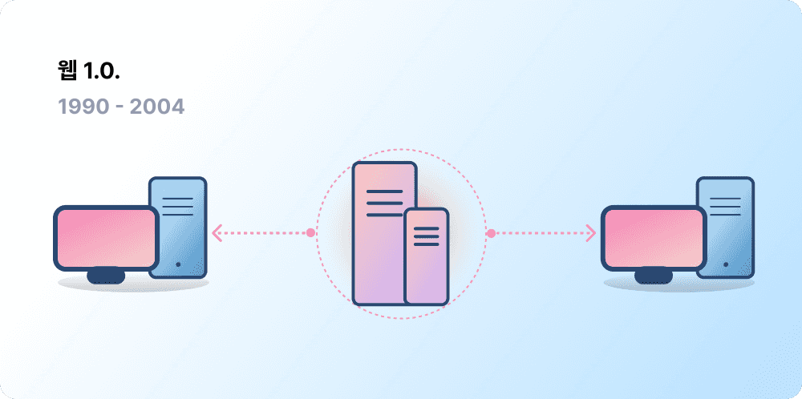
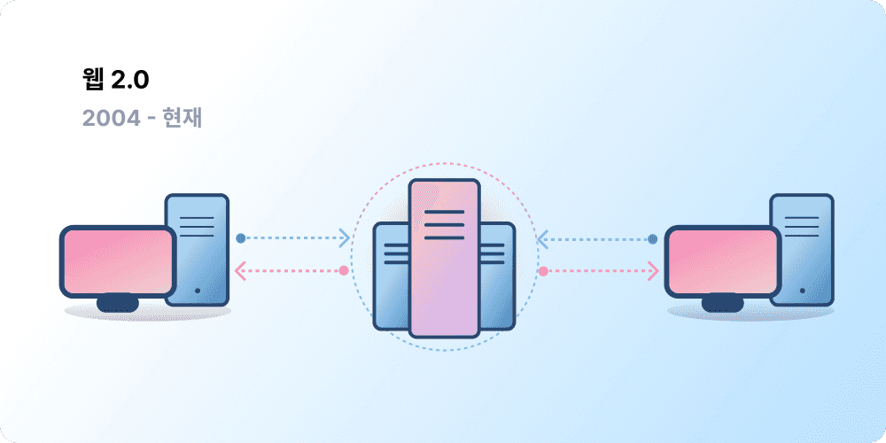
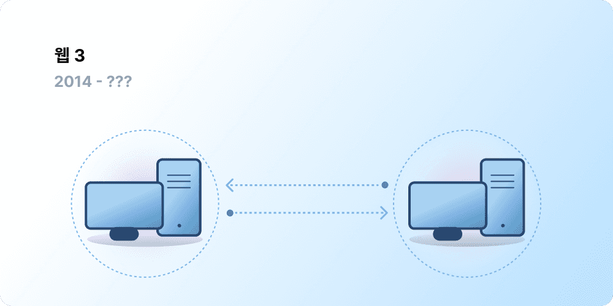

중앙화는 수십억 명의 사람들을 월드 와이드 웹으로 끌어들이는 데 기여했으며, 웹이 존재하는 안정적이고 강력한 인프라를 구축했습니다. 동시에 소수의 중앙화된 주체들이 월드 와이드 웹의 상당 부분을 장악하고 있으며, 무엇이 허용되고 허용되지 않아야 하는지를 일방적으로 결정하고 있습니다.

Web3는 이러한 딜레마에 대한 해답입니다. 대형 기술 기업이 독점하는 웹 대신, Web3는 탈중앙화를 수용하며 사용자에 의해 구축, 운영 및 소유됩니다. Web3는 기업이 아닌 개인의 손에 권력을 쥐여줍니다.
Web3에 대해 이야기하기 전에, 우리가 어떻게 여기까지 오게 되었는지 살펴보겠습니다.

<Divider />

## 초기 웹 {#early-internet}

대부분의 사람들은 웹을 현대 생활의 지속적인 기둥으로 생각합니다. 발명된 이후로 계속 존재해 왔기 때문입니다. 하지만 오늘날 우리가 알고 있는 대부분의 웹은 원래 상상했던 것과는 상당히 다릅니다. 이를 더 잘 이해하려면 웹의 짧은 역사를 웹 1.0과 웹 2.0이라는 느슨한 시기로 나누어 보는 것이 도움이 됩니다.

### 웹 1.0: 읽기 전용 (1990-2004) {#web1}

1989년 제네바의 CERN에서 팀 버너스리(Tim Berners-Lee)는 월드 와이드 웹이 될 프로토콜을 개발하느라 바빴습니다. 그의 아이디어는 무엇이었을까요? 지구상 어디에서나 정보를 공유할 수 있는 개방적이고 탈중앙화된 프로토콜을 만드는 것이었습니다.

현재 '웹 1.0'으로 알려진 버너스리의 창작물의 첫 시작은 대략 1990년에서 2004년 사이에 일어났습니다. 웹 1.0은 주로 기업이 소유한 정적 웹사이트였으며, 사용자 간의 상호작용이 거의 없었고 개인이 콘텐츠를 생산하는 일도 드물었기 때문에 읽기 전용 웹으로 알려지게 되었습니다.

### 웹 2.0: 읽기-쓰기 (2004-현재) {#web2}

웹 2.0 시대는 2004년 소셜 미디어 플랫폼의 등장과 함께 시작되었습니다. 웹은 읽기 전용에서 읽기-쓰기 형태로 진화했습니다. 기업이 사용자에게 콘텐츠를 제공하는 대신, 사용자가 생성한 콘텐츠를 공유하고 사용자 간의 상호작용에 참여할 수 있는 플랫폼을 제공하기 시작했습니다. 더 많은 사람들이 온라인에 접속함에 따라, 소수의 상위 기업들이 웹에서 발생하는 트래픽과 가치의 불균형적인 양을 통제하기 시작했습니다. 웹 2.0은 또한 광고 기반 수익 모델을 탄생시켰습니다. 사용자는 콘텐츠를 만들 수는 있었지만, 이를 소유하거나 수익화로 인한 혜택을 얻지는 못했습니다.

<Divider />

## 웹 3.0: 읽기-쓰기-소유 {#web3}

'웹 3.0'이라는 전제는 2014년 이더리움이 출시된 직후 [이더리움](/) 공동 창립자인 개빈 우드에 의해 만들어졌습니다. 개빈 우드는 많은 초기 암호화폐 채택자들이 느꼈던 문제, 즉 웹이 너무 많은 신뢰를 요구한다는 문제에 대한 해결책을 말로 표현했습니다. 즉, 오늘날 사람들이 알고 사용하는 대부분의 웹은 소수의 민간 기업이 대중의 최선의 이익을 위해 행동할 것이라고 신뢰하는 데 의존하고 있습니다.

### Web3란 무엇인가요? {#what-is-web3}

Web3는 새롭고 더 나은 인터넷의 비전을 포괄하는 용어가 되었습니다. 핵심적으로 Web3는 블록체인, 암호화폐, NFT를 사용하여 소유권의 형태로 사용자에게 권력을 돌려줍니다. [2020년 트위터의 한 게시물](https://twitter.com/himgajria/status/1266415636789334016)이 이를 가장 잘 표현했습니다. 웹1은 읽기 전용이었고, 웹2는 읽기-쓰기이며, Web3는 읽기-쓰기-소유가 될 것입니다.

#### Web3의 핵심 아이디어 {#core-ideas}

Web3가 무엇인지 엄격한 정의를 내리기는 어렵지만, 몇 가지 핵심 원칙이 그 탄생을 이끌고 있습니다.

- **Web3는 탈중앙화되어 있습니다:** 중앙화된 주체가 인터넷의 상당 부분을 통제하고 소유하는 대신, 소유권이 구축자와 사용자에게 분배됩니다.
- **Web3는 무허가성입니다:** 모든 사람이 Web3에 참여할 수 있는 동등한 접근 권한을 가지며, 아무도 배제되지 않습니다.
- **Web3에는 기본 결제 기능이 있습니다:** 은행이나 결제 처리 업체의 구식 인프라에 의존하는 대신, 온라인에서 돈을 지출하고 송금하는 데 암호화폐를 사용합니다.
- **Web3는 무신뢰입니다:** 신뢰할 수 있는 제3자에 의존하는 대신 인센티브와 경제적 메커니즘을 사용하여 작동합니다.

### Web3는 왜 중요한가요? {#why-is-web3-important}

Web3의 핵심 기능들은 서로 분리되어 있지 않고 깔끔한 범주에 들어맞지는 않지만, 이해를 돕기 위해 단순화하여 나누어 보았습니다.

#### 소유권 {#ownership}

Web3는 전례 없는 방식으로 디지털 자산에 대한 소유권을 부여합니다. 예를 들어, 웹2 게임을 하고 있다고 가정해 보겠습니다. 게임 내 아이템을 구매하면 해당 아이템은 계정에 직접 귀속됩니다. 게임 제작자가 계정을 삭제하면 이 아이템들을 잃게 됩니다. 또는 게임을 그만두면 게임 내 아이템에 투자한 가치를 잃게 됩니다.

Web3는 [대체 불가능한 토큰(NFT)](/glossary/#nft)을 통한 직접적인 소유권을 허용합니다. 게임 제작자를 포함한 그 누구도 여러분의 소유권을 빼앗을 권한이 없습니다. 그리고 게임을 그만두더라도 공개 시장에서 게임 내 아이템을 판매하거나 거래하여 그 가치를 회수할 수 있습니다. 이것이 어떻게 작동하는지 보려면 [온체인 게임](/gaming/)을 살펴보세요.

<Alert variant="update">
<AlertEmoji text=":eyes:"/>
<AlertContent className="flex-row items-center justify-between">
  
NFT에 대해 더 알아보기

  <ButtonLink href="/nft/">
    NFT 자세히 보기
  </ButtonLink>
</AlertContent>
</Alert>

#### 검열 저항성 {#censorship-resistance}

플랫폼과 콘텐츠 제작자 간의 권력 역학은 극도로 불균형합니다.

온리팬스(OnlyFans)는 100만 명 이상의 콘텐츠 제작자가 있는 사용자 생성 성인 콘텐츠 사이트로, 이들 중 상당수는 이 플랫폼을 주 수입원으로 사용합니다. 2021년 8월, 온리팬스는 노골적인 성적 콘텐츠를 금지할 계획이라고 발표했습니다. 이 발표는 자신들이 만드는 데 기여한 플랫폼에서 수입을 빼앗긴다고 느낀 플랫폼 내 제작자들 사이에서 분노를 불러일으켰습니다. 반발이 일자 이 결정은 빠르게 번복되었습니다. 제작자들이 이 싸움에서 승리하긴 했지만, 이는 웹 2.0 제작자들의 문제를 부각시킵니다. 플랫폼을 떠나면 그동안 쌓아온 평판과 팔로워를 잃게 된다는 것입니다.

Web3에서 여러분의 데이터는 블록체인에 존재합니다. 플랫폼을 떠나기로 결정할 때, 자신의 평판을 가지고 떠나 자신의 가치관과 더 명확하게 일치하는 다른 인터페이스에 연결할 수 있습니다.

웹 2.0은 콘텐츠 제작자가 플랫폼이 규칙을 바꾸지 않을 것이라고 신뢰할 것을 요구하지만, 검열 저항성은 Web3 플랫폼의 기본 기능입니다.

#### 탈중앙화 자율 조직(DAO) {#daos}

Web3에서는 데이터를 소유할 뿐만 아니라, 회사의 주식처럼 작동하는 토큰을 사용하여 집단으로서 플랫폼을 소유할 수 있습니다. DAO를 사용하면 플랫폼의 탈중앙화된 소유권을 조율하고 플랫폼의 미래에 대한 결정을 내릴 수 있습니다.

기술적으로 DAO는 자원(토큰) 풀에 대한 탈중앙화된 의사 결정을 자동화하는 합의된 [스마트 컨트랙트](/glossary/#smart-contract)로 정의됩니다. 토큰을 가진 사용자는 자원이 어떻게 소비될지에 대해 투표하고, 코드는 투표 결과를 자동으로 실행합니다.

하지만 사람들은 많은 Web3 커뮤니티를 DAO로 정의합니다. 이러한 커뮤니티들은 모두 코드에 의한 탈중앙화 및 자동화 수준이 다릅니다. 현재 우리는 DAO가 무엇이며 미래에 어떻게 진화할 수 있는지 탐구하고 있습니다.

<Alert variant="update">
<AlertEmoji text=":eyes:"/>
<AlertContent className="flex-row items-center justify-between">
  
DAO에 대해 더 알아보기

  <ButtonLink href="/dao/">
    DAO 자세히 보기
  </ButtonLink>
</AlertContent>
</Alert>

### 신원 {#identity}

전통적으로는 사용하는 모든 플랫폼마다 계정을 만들어야 했습니다. 예를 들어, 트위터 계정, 유튜브 계정, 레딧 계정을 각각 가지고 있을 수 있습니다. 표시 이름이나 프로필 사진을 변경하고 싶으신가요? 모든 계정에서 각각 변경해야 합니다. 경우에 따라 소셜 로그인을 사용할 수도 있지만, 이는 검열이라는 익숙한 문제를 야기합니다. 단 한 번의 클릭으로 이러한 플랫폼들은 여러분의 전체 온라인 생활에 대한 접근을 차단할 수 있습니다. 설상가상으로, 많은 플랫폼이 계정을 만들기 위해 개인 식별 정보를 맡기고 신뢰할 것을 요구합니다.

Web3는 이더리움 주소와 [이더리움 네임 서비스(ENS)](/glossary/#ens) 프로필로 디지털 신원을 제어할 수 있게 함으로써 이러한 문제를 해결합니다. 이더리움 주소를 사용하면 안전하고 검열 저항성이 있으며 익명성이 보장되는 단일 로그인으로 여러 플랫폼을 이용할 수 있습니다.

### 기본 결제 {#native-payments}

웹2의 결제 인프라는 은행과 결제 처리 업체에 의존하기 때문에, 은행 계좌가 없는 사람이나 특정 국가의 국경 내에 거주하는 사람들을 배제합니다.
Web3는 [ETH](/glossary/#ether)와 같은 토큰을 사용하여 브라우저에서 직접 돈을 송금하며, 신뢰할 수 있는 제3자를 필요로 하지 않습니다.

<ButtonLink href="/what-is-ether/">
  ETH 자세히 보기
</ButtonLink>

## Web3의 한계 {#web3-limitations}

현재 형태의 Web3가 가진 수많은 이점에도 불구하고, 생태계가 번창하기 위해 해결해야 할 많은 한계가 여전히 존재합니다.

### 접근성 {#accessibility}

이더리움으로 로그인과 같은 중요한 Web3 기능은 이미 누구나 무료로 사용할 수 있습니다. 하지만 트랜잭션의 상대적 비용은 여전히 많은 사람들에게 부담스럽습니다. 높은 트랜잭션 수수료 때문에 부유하지 않은 개발도상국에서는 Web3가 활용될 가능성이 낮습니다. 이더리움에서는 [로드맵](/roadmap/)과 [레이어 2 (l2) 확장 솔루션](/glossary/#layer-2)을 통해 이러한 과제들을 해결하고 있습니다. 기술은 준비되어 있지만, Web3를 모든 사람이 접근할 수 있게 만들려면 레이어 2 (l2)에서 더 높은 수준의 채택이 필요합니다.

### 사용자 경험 {#user-experience}

현재 Web3 사용을 위한 기술적 진입 장벽은 너무 높습니다. 사용자는 보안 문제를 이해하고, 복잡한 기술 문서를 파악하며, 직관적이지 않은 사용자 인터페이스를 탐색해야 합니다. 특히 [지갑 제공업체](/wallets/find-wallet/)들이 이를 해결하기 위해 노력하고 있지만, Web3가 대중적으로 채택되기 위해서는 더 많은 진전이 필요합니다.

### 교육 {#education}

Web3는 웹 2.0에서 사용되던 것과는 다른 멘탈 모델을 학습해야 하는 새로운 패러다임을 도입합니다. 1990년대 후반 웹 1.0이 인기를 얻을 때도 비슷한 교육적 노력이 있었습니다. 월드 와이드 웹의 지지자들은 단순한 은유(정보 고속도로, 브라우저, 웹 서핑)부터 [텔레비전 방송](https://www.youtube.com/watch?v=SzQLI7BxfYI)에 이르기까지 대중을 교육하기 위해 수많은 교육 기법을 사용했습니다. Web3는 어렵지 않지만 다릅니다. 웹2 사용자에게 이러한 Web3 패러다임을 알리는 교육 이니셔티브는 성공을 위해 필수적입니다.

Ethereum.org는 중요한 이더리움 콘텐츠를 가능한 한 많은 언어로 번역하는 것을 목표로 하는 [번역 프로그램](/contributing/translation-program/)을 통해 Web3 교육에 기여하고 있습니다.

### 중앙화된 인프라 {#centralized-infrastructure}

Web3 생태계는 초기 단계이며 빠르게 진화하고 있습니다. 그 결과, 현재는 주로 중앙화된 인프라(GitHub, 트위터, 디스코드 등)에 의존하고 있습니다. 많은 Web3 기업들이 이러한 격차를 메우기 위해 서두르고 있지만, 고품질의 신뢰할 수 있는 인프라를 구축하는 데는 시간이 걸립니다.

## 탈중앙화된 미래 {#decentralized-future}

Web3는 초기 단계의 진화하는 생태계입니다. 개빈 우드가 2014년에 이 용어를 만들었지만, 이러한 아이디어 중 상당수는 최근에야 현실이 되었습니다. 작년 한 해에만 암호화폐에 대한 관심이 크게 급증했고, 레이어 2 (l2) 확장 솔루션이 개선되었으며, 새로운 형태의 거버넌스에 대한 대규모 실험과 디지털 신원의 혁명이 일어났습니다.

우리는 Web3를 통해 더 나은 웹을 만드는 시작 단계에 있을 뿐이지만, 이를 뒷받침할 인프라를 계속 개선해 나간다면 웹의 미래는 밝아 보입니다.

## 어떻게 참여할 수 있나요? {#get-involved}

- [지갑 만들기](/wallets/)
- [커뮤니티 찾기](/community/)
- [Web3 애플리케이션 탐색하기](/apps/)
- [DAO 가입하기](/dao/)
- [Web3에서 구축하기](/developers/)

## 더 읽어보기 {#further-reading}

Web3는 엄격하게 정의되어 있지 않습니다. 다양한 커뮤니티 참여자들이 이에 대해 각기 다른 관점을 가지고 있습니다. 그중 몇 가지를 소개합니다:

- [Web3란 무엇인가? 미래의 탈중앙화 인터넷 설명](https://www.freecodecamp.org/news/what-is-web3) – _Nader Dabit_
- [웹 3 이해하기](https://medium.com/l4-media/making-sense-of-web-3-c1a9e74dcae) – _Josh Stark_
- [Web3가 중요한 이유](https://a16zcrypto.com/posts/article/why-web3-matters/) — _Chris Dixon_
- [탈중앙화가 중요한 이유](https://onezero.medium.com/why-decentralization-matters-5e3f79f7638e) - _Chris Dixon_
- [Web3 환경](https://a16z.com/wp-content/uploads/2021/10/The-web3-Readlng-List.pdf) – _a16z_
- [Web3 논쟁](https://www.notboring.co/p/the-web3-debate) – _Packy McCormick_

<QuizWidget quizKey="web3" />