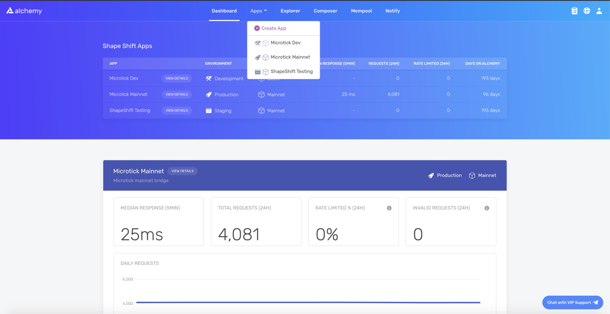
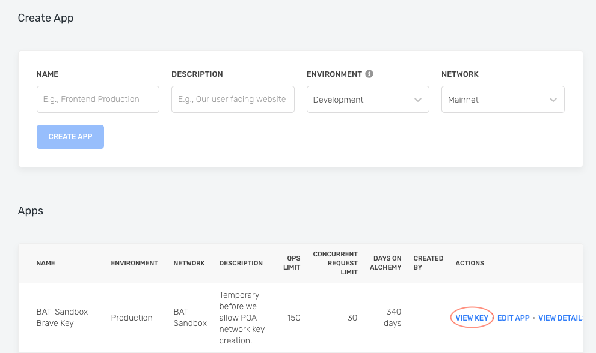
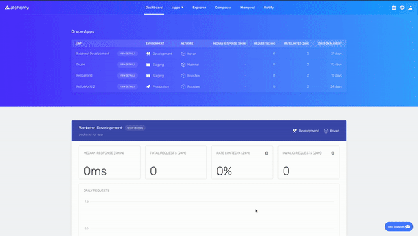

To jest przewodnik dla początkujących po rozpoczęciu programowania w Ethereum przy użyciu [Alchemy](https://alchemyapi.io/), wiodącej platformy dla twórców blockchainów wykorzystywanej przez miliony użytkowników z 70% najlepszych aplikacji blockchain, w tym Maker, 0x, MyEtherWallet, Dharma i Kyber.

Zarejestruj się w Alchemy, aby napisać swój pierwszy skrypt web3! Nie jest wymagane doświadczenie w programowaniu blockchain!

## 1\. Zarejestruj się na darmowym koncie Alchemy {#sign-up-for-a-free-alchemy-account}

Tworzenie konta z Alchemy jest łatwe, [zarejestruj się za darmo tutaj](https://auth.alchemyapi.io/signup).

## 2\. Utwórz aplikację Alchemy {#create-an-alchemy-app}

Aby korzystać z produktów Alchemy, potrzebujesz klucza API do uwierzytelnienia swoich żądań.

Możesz [tworzyć klucze API z panelu](http://dashboard.alchemyapi.io/). Aby utworzyć nowy klucz, przejdź do „Utwórz aplikację”, jak pokazano poniżej:

Specjalne podziękowania dla [_ShapeShift_](https://shapeshift.com/) _za umożliwienie nam pokazania ich panelu!_



Wypełnij szczegóły w sekcji „Utwórz aplikację”, aby uzyskać swój nowy klucz. Możesz również zobaczyć aplikacje, które wcześniej stworzyłeś i aplikacje wykonane przez swój zespół tutaj. Pociągnij istniejące klucze, klikając „Wyświetl klucz” dla dowolnej aplikacji.



Możesz również ściągnąć istniejące klucze API, umieszczając kursor myszy nad „Aplikacje” i wybierając jeden. Możesz tutaj „Wyświetlić klucz”, a także „Edytować aplikację”, aby dodać określone domeny do białej listy, zobaczyć kilka narzędzi dla programistów i wyświetlić dane analityczne.



## 3\. Zgłoś żądanie z wiersza poleceń {#make-a-request-from-the-command-line}

Współpracuj z blockchainem Ethereum przez Alchemy, używając JSON-RPC i curl.

Dla żądań ręcznych, zalecamy zastosowanie `JSON-RPC` poprzez `POST`. Wystarczy przekazać nagłówek `Content-Type: application/json` i zapytanie jako treść `POST` z następującymi polami:

- `jsonrpc`: wersja JSON-RPC - obecnie obsługiwana jest tylko `2.0`.
- `method`: metoda ETH API. [Zobacz materiały dot. API.](https://docs.alchemyapi.io/documentation/alchemy-api-reference/json-rpc)
- `params`: lista parametrów do przekazania do metody.
- `id`: identyfikator Twojego żądania. Zostanie zwrócony wraz z odpowiedzią, dzięki czemu można śledzić, do którego żądania należy odpowiedź.

Poniżej znajduje się przykład, który można uruchomić z wiersza poleceń, aby uzyskać aktualną cenę gazu:

```bash
curl [https://eth-mainnet.alchemyapi.io/v2/demo](https://eth-mainnet.alchemyapi.io/v2/demo) \
-X POST \
-H "Content-Type: application/json" \
-d '{"jsonrpc":"2.0","method":"eth_gasPrice","params":[],"id":73}'
```

**_UWAGA:_** _Zamień_ [_https://eth-mainnet.alchemyapi. o/v2/demo_](https://eth-mainnet.alchemyapi.io/jsonrpc/demo) _z własnym kluczem API_ [_https://eth-mainnet.alchemyapi.io/v2/your-api-key_](https://eth-mainnet.alchemyapi.io/jsonrpc/your-api-key)_._

**Wynik:**

```json
{ "id": 73,"jsonrpc": "2.0","result": "0x09184e72a000" // 100000000000000000 }
```

## 4\. Skonfiguruj swojego klienta Web3 {#set-up-your-web3-client}

**Jeśli masz istniejącego klienta,** zmień adres URL aktualnego dostawcy węzła na adres URL Alchemy z kluczem API: `"https://eth-mainnet.alchemyapi.io/v2/your-api-key"`

**_UWAGA:_** Skrypty poniżej muszą być uruchomione w **kontekście węzłów** lub **zapisane w pliku**, nie uruchamiaj z wiersza poleceń. Jeśli nie masz jeszcze zainstalowanego węzła lub npm, sprawdź ten [przewodnik konfiguracji macs](https://app.gitbook.com/@alchemyapi/s/alchemy/guides/alchemy-for-macs).

Istnieją tony [bibliotek Web3](https://docs.alchemyapi.io/guides/getting-started#other-web3-libraries) które możesz zintegrować z alchemy. zalecamy użycie [Alchemy Web3](https://docs.alchemy.com/reference/api-overview), upuszczonego zamiennika dla web3., zbudowany i skonfigurowany do bezproblemowej pracy z Alchemy. Zapewnia to wiele zalet, takich jak automatyczne próby i solidne wsparcie WebSocket.

Aby zainstalować AlchemyWeb3.js, **przejdź do katalogu projektu** i uruchom:

**Z Yarn:**

```
yarn dodaj @alch/alchemy-web3
```

**Z NPM:**

```
npm install @alch/alchemy-web3
```

Aby wejść w interakcję z infrastrukturą węzła Alchemy, uruchom w NodeJS lub dodaj to do pliku JavaScript:

```js
const { createAlchemyWeb3 } = require("@alch/alchemy-web3")
const web3 = createAlchemyWeb3(
  "https://eth-mainnet.alchemyapi.io/v2/your-api-key"
)
```

## 5\. Napisz swój pierwszy skrypt Web3! {#write-your-first-web3-script}

Teraz, aby ubrudzić sobie ręce odrobiną programowania web3, napiszemy prosty skrypt, który wypisuje najnowszy numer bloku z sieci głównej Ethereum.

1.  **Jeśli jeszcze tego nie zrobiłeś, w swoim terminalu utwórz nowy katalog projektów i przejdź do niego:**

```
mkdir web3-examplecd web3-example
```

**2\. Zainstaluj zależność Alchemy web3 (lub dowolny web3) w swoim projekcie, jeśli jeszcze tego nie zrobiłeś:**

```
npm install @alch/alchemy-web3
```

**3. Utwórz plik o nazwie** `index.js` **i dodaj następujące treści:**

> Ostatecznie powinieneś zastąpić `demo` kluczem API Alchemy.

```js
async function main() {
  const { createAlchemyWeb3 } = require("@alch/alchemy-web3")
  const web3 = createAlchemyWeb3("https://eth-   mainnet.alchemyapi.io/v2/demo")
  const blockNumber = await web3.eth.getBlockNumber()
  console.log("The latest block number is " + blockNumber)
}
main()
```

Nie znasz rozwiązań asynchronicznych? Sprawdź to [Medium post](https://medium.com/better-programming/understanding-async-await-in-javascript-1d81bb079b2c).

**4\. Uruchom go w swoim terminalu, używając węzła**

```
node index.js
```

**5. Powinieneś teraz zobaczyć najnowszy numer bloku w konsoli!**

```
The latest block number is 11043912
```

**Woo! Gratulacje! Właśnie napisałeś swój pierwszy skrypt web3 używając Alchemy 🎉**

Nie jesteś pewien, co zrobić dalej? Spróbuj wdrożyć pierwszy kontrakt inteligentny i popracuj, programując w Solidity [_Hello World Smart_](https://docs.alchemyapi.io/tutorials/hello-world-smart-contract) _Contract Guide, lub sprawdź, co wiesz o pulpicie nawigacyjnym za pomocą_ [_Dashboard Demo App_](https://docs.alchemyapi.io/tutorials/demo-app)_!_

_[Zarejestruj się przy użyciu Alchemy za darmo](https://auth.alchemyapi.io/signup), sprawdź naszą [dokumentację](https://docs.alchemyapi.io/), oraz najnowsze wiadomości, obserwuj nas na [Twitterze](https://twitter.com/AlchemyPlatform)_.
