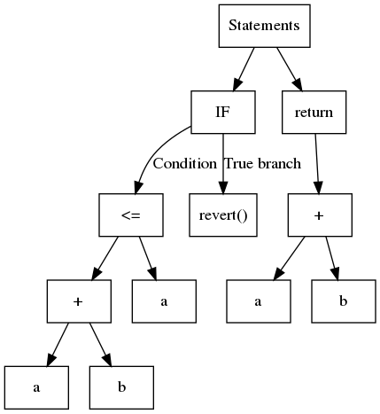
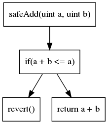

## Jak używać Slither {#how-to-use-slither}

Celem tego samouczka jest pokazanie, jak używać Slither do automatycznego wyszukiwania błędów w inteligentnych kontraktach.

- [Instalacja](#installation)
- [Użycie wiersza poleceń](#command-line)
- [Wprowadzenie do analizy statycznej](#static-analysis): krótkie wprowadzenie do analizy statycznej
- [API](#api-basics): Opis API Pythona

## Instalacja {#installation}

Slither wymaga Pythona >= 3.6. Można go zainstalować za pomocą pip lub dockera.

Slither przez pip:

```bash
pip3 install --user slither-analyzer
```

Slither przez dockera:

```bash
docker pull trailofbits/eth-security-toolbox docker run -it -v "$PWD":/home/trufflecon trailofbits/eth-security-toolbox
```

_Ostatnie polecenie uruchamia eth-security-toolbox w dockerze, który ma dostęp do bieżącego katalogu. Możesz zmienić pliki z hosta i uruchomić narzędzia na plikach z dockera_

Wewnątrz dockera uruchom:

```bash
solc-select 0.5.11 cd /home/trufflecon/
```

### Uruchom skrypt {#running-a-script}

Aby uruchomić skrypt Pythona za pomocą Pythona 3:

```bash
python3 script.py
```

### Wiersz poleceń {#command-line}

**Skrypty wiersza poleceń a zdefiniowane przez użytkownika.** Slither jest wyposażony w zestaw predefiniowanych detektorów, które znajdują wiele częstych błędów. Wywołanie Slither z wiersza poleceń uruchomi wszystkie detektory, nie jest potrzebna szczegółowa wiedza na temat analizy statycznej:

```bash
slither project_paths
```

Oprócz detektorów, Slither ma możliwości przeglądania kodu poprzez swoje narzędzia [drukarki](https://github.com/crytic/slither#printers) i [](https://github.com/crytic/slither#tools).

Użyj [crytic.io](https://crytic.io), aby uzyskać dostęp do prywatnych detektorów i integracji GitHub.

## Analiza statyczna {#static-analysis}

Możliwości i projekt struktury analizy statycznej Slither zostały opisane w postach na blogu ([1](https://blog.trailofbits.com/2018/10/19/slither-a-solidity-static-analysis-framework/), [2](https://blog.trailofbits.com/2019/05/27/slither-the-leading-static-analyzer-for-smart-contracts/)) oraz w [dokumencie akademickim](https://github.com/trailofbits/publications/blob/master/papers/wetseb19.pdf).

Istnieją różne postacie analizy statycznej Najprawdopodobniej zdajesz sobie sprawę, że kompilatory takie jak [clang](https://clang-analyzer.llvm.org/) i [gcc](https://lwn.net/Articles/806099/) zależą od tych technik badawczych, ale również stanowią one podstawę ([Infer](https://fbinfer.com/), [CodeClimate](https://codeclimate.com/), [FindBugs](http://findbugs.sourceforge.net/) i narzędzi opartych na formalnych metodach, takich jak [Frama-C](https://frama-c.com/) i [Polyspace](https://www.mathworks.com/products/polyspace.html).

Nie dokonamy wyczerpującego przeglądu technik analizy statycznej. Zamiast tego skoncentrujemy się na tym, co jest potrzebne, aby zrozumieć, jak działa Slither tak, abyś mógł go skuteczniej używać, aby znaleźć błędy i zrozumieć kod.

- [Reprezentacja kodu](#code-representation)
- [Analiza kodu](#analysis)
- [Reprezentacja pośrednia](#intermediate-representation)

### Reprezentacja kodu {#code-representation}

W przeciwieństwie do analizy dynamicznej, która rozważa pojedynczą ścieżkę wykonania, analiza statyczna rozważa wszystkie ścieżki naraz. W tym celu opiera się na innej reprezentacji kodu. Dwa najczęściej spotykane to abstrakcyjne drzewo składni (AST) i graf przepływu sterowania (CFG).

### Abstrakcyjne drzewa składniowe (AST) {#abstract-syntax-trees-ast}

AST są używane za każdym razem, gdy kompilator analizuje kod. Jest to prawdopodobnie najbardziej podstawowa struktura, na podstawie której można przeprowadzić analizę statyczną.

Krótko mówiąc, AST jest ustrukturyzowanym drzewem, w którym zwyczajowo, każdy liść zawiera zmienną lub stałą, a węzły wewnętrzne są operandami lub operacjami przepływu sterowania. Rozważmy następujący kod:

```solidity
function safeAdd(uint a, uint b) pure internal returns(uint){
    if(a + b <= a){
        revert();
    }
    return a + b;
}
```

Odpowiedni AST jest pokazany w:



Slither używa AST eksportowanego przez solc.

Choć prosty w budowie, AST jest strukturą zagnieżdżoną. Czasem jego przeanalizowanie nie jest proste. Na przykład, aby zidentyfikować operacje używane przez wyrażenie `a + b <= a`, musisz najpierw przeanalizować `<=`, a następnie `+`. Wspólnym podejściem jest stosowanie tak zwanego wzoru odwiedzającego, który rekursywnie przechodzi przez drzewo. Slither zawiera ogólnego odwiedzającego w [`ExpressionVisitor`](https://github.com/crytic/slither/blob/master/slither/visitors/expression/expression.py).

Następujący kod używa `ExpressionVisitor` aby wykryć, czy wyrażenie zawiera dodatek:

```python
from slither.visitors.expression.expression import ExpressionVisitor
from slither.core.expressions.binary_operation import BinaryOperationType

class HasAddition(ExpressionVisitor):

    def result(self):
        return self._result

    def _post_binary_operation(self, expression):
        if expression.type == BinaryOperationType.ADDITION:
            self._result = True

visitor = HasAddition(expression) # expression is the expression to be tested
print(f'The expression {expression} has a addition: {visitor.result()}')
```

### Graf przepływu sterowania (CFG) {#control-flow-graph-cfg}

Drugą najbardziej powszechną reprezentacją kodu jest graf przepływu sterowania. Jak sugeruje jego nazwa, jest to przedstawienie oparte na wykresie, które ujawnia wszystkie ścieżki wykonania. Każdy węzeł zawiera jedną lub wiele instrukcji. Krawędzie na wykresie reprezentują operacje przepływu sterowania (if/then/else, loop itp.). CFG naszego poprzedniego przykładu to:



CFG jest reprezentacją, na której opiera się większość analiz.

Istnieje wiele innych reprezentacji kodów. Każda reprezentacja ma zalety i wady zgodnie z analizą, którą chcesz przeprowadzić.

### Analiza {#analysis}

Najprostszym rodzajem analiz, które możesz wykonać za pomocą Slither, są analizy składni.

### Analiza składni {#syntax-analysis}

Slither może nawigować przez różne elementy kodu i ich reprezentacje, aby znaleźć niespójności i wady za pomocą podejścia podobnego do dopasowania do wzorca.

Na przykład następujące detektory szukają problemów związanych z składnią:

- [Zastępowanie zmiennych stanu](https://github.com/crytic/slither/wiki/Detector-Documentation#state-variable-shadowing): porusza się iteracyjnie po wszystkich zmiennych stanu i sprawdza, czy któryś zastępuje zmienną z dziedziczonego kontraktu ([state.py#L51-L62](https://github.com/crytic/slither/blob/0441338e055ab7151b30ca69258561a5a793f8ba/slither/detectors/shadowing/state.py#L51-L62))

- [Nieprawidłowy interfejs ERC20](https://github.com/crytic/slither/wiki/Detector-Documentation#incorrect-erc20-interface): szukka nieprawidłowych sygnatur funkcji ERC20 ([incorrect_erc20_interface.py#L34-L55](https://github.com/crytic/slither/blob/0441338e055ab7151b30ca69258561a5a793f8ba/slither/detectors/erc/incorrect_erc20_interface.py#L34-L55))

### Analiza semantyczna {#semantic-analysis}

W przeciwieństwie do analizy składni, analiza semantyczna sięga głębiej i analizuje „znaczenie” kodu. Rodzina ta obejmuje kilka szerokich rodzajów analiz. Prowadzą one do bardziej skutecznych i pożytecznych wyników, ale także są bardziej skomplikowane.

Analizy semantyczne są wykorzystywane do najbardziej zaawansowanego wykrywania podatności na zagrożenia.

#### Analiza zależności danych {#fixed-point-computation}

Zmienna `variable_a` jest zależna od danych `variable_b`, jeśli istnieje ścieżka, dla której wartość `variable_a` jest zależna od `variable_b`.

W poniższym kodzie zmienna `_a` jest zależna od `variable_b`:

```solidity
// ...
variable_a = variable_b + 1;
```

Slither posiada wbudowane funkcje [zależności danych](https://github.com/crytic/slither/wiki/data-dependency) dzięki jego pośredniej reprezentacji (omówionej w dalszej części).

Przykład użycia zależności od danych można znaleźć w [niebezpiecznym ścisłym detektorze równości](https://github.com/crytic/slither/wiki/Detector-Documentation#dangerous-strict-equalities). Tutaj Slither będzie szukał ścisłego porównania równości z niebezpieczną wartością ([wronct_strict_equality. y#L86-L87](https://github.com/crytic/slither/blob/6d86220a53603476f9567c3358524ea4db07fb25/slither/detectors/statements/incorrect_strict_equality.py#L86-L87)), i poinformuje użytkownika, że powinien użyć `>=` lub `<=` zamiast `==`, aby uniemożliwić atakującemu przechwycenie kontraktu. Spośród innych detektor uzna za niebezpieczną wartość zwrotną wywołania do `balanceOf(address)` ([invalid \_strict_equality. y#L63-L64](https://github.com/crytic/slither/blob/6d86220a53603476f9567c3358524ea4db07fb25/slither/detectors/statements/incorrect_strict_equality.py#L63-L64)) i użyje silnika zależności od danych, aby śledzić jego użycie.

#### Obliczenia stałoprzecinkowe {#fixed-point-computation}

Jeśli Twoja analiza nawiguje przez CFG i porusza się wzdłuż krawędzi, prawdopodobnie zobaczysz już odwiedzone węzły. Na przykład, jeśli pętla jest przedstawiona w poniższy sposób:

```solidity
for(uint i; i < zakres; ++){
    variable_a += 1
}
```

Twoja analiza będzie musiała wiedzieć, kiedy się zatrzymać. Tutaj są dwie główne strategie: (1) powtórzyć na każdym węźle skończoną liczbę razy, (2) obliczyć tak zwany <em x-id="4">punkt stały</em>. Punkt stały zasadniczo oznacza, że analiza tego węzła nie dostarcza żadnych istotnych informacji.

Przykład użytego puntu stałego można znaleźć w detektorach wielobieżności: Slither eksploruje węzły i szuka wywołań zewnętrznych, zapisuje i odczytuje w pamięci. Po osiągnięciu punktu stałego ([reentrancy.py#L125-L131](https://github.com/crytic/slither/blob/master/slither/detectors/reentrancy/reentrancy.py#L125-L131)), zatrzymuje eksplorację i analizuje wyniki, aby sprawdzić, czy występuje wielobieżność, sprawdzając różne jej wzorce ([reentrancy_benign. y](https://github.com/crytic/slither/blob/b275bcc824b1b932310cf03b6bfb1a1fef0ebae1/slither/detectors/reentrancy/reentrancy_benign.py), [reentrancy_read_before_write.py](https://github.com/crytic/slither/blob/b275bcc824b1b932310cf03b6bfb1a1fef0ebae1/slither/detectors/reentrancy/reentrancy_read_before_write.py), [reentrancy_eth.py](https://github.com/crytic/slither/blob/b275bcc824b1b932310cf03b6bfb1a1fef0ebae1/slither/detectors/reentrancy/reentrancy_eth.py)).

Analizy pisania z wykorzystaniem efektywnego obliczania punktów stałych wymagają dobrego zrozumienia sposobu, w jaki analiza propaguje jej informacje.

### Reprezentacja pośrednia {#intermediate-representation}

Pośrednia reprezentacja (IR) to język mający być bardziej dostosowany do analizy statycznej niż oryginalny. Slither tłumaczy Solidity na własną IR: [SlithIR](https://github.com/crytic/slither/wiki/SlithIR).

Zrozumienie SlithIR nie jest konieczne, jeśli chcesz tylko zapisać podstawowe kontrole. Jeśli jednak planuje się napisać zaawansowane analizy semantyczne, będzie to pomocne. Drukarki [SlithIR](https://github.com/crytic/slither/wiki/Printer-documentation#slithir) i [SSA](https://github.com/crytic/slither/wiki/Printer-documentation#slithir-ssa) pomogą Ci zrozumieć, jak kod jest przetłumaczony.

## Podstawowe informacje o API {#api-basics}

Slither ma interfejs API, który pozwala odkrywać podstawowe atrybuty kontraktu i jego funkcje.

Aby załadować bazę kodu:

```python
from slither import Slither
slither = Slither('/path/to/project')

```

### Odkrywanie kontraktów i funkcji {#exploring-contracts-and-functions}

Obiekt `Slither` zawiera:

- `contracts (list(Contract)`: lista kontraktów
- `contracts_derived (list(Contract)`: lista kontraktów, które nie są dziedziczone przez inny kontrakt (podzbiór kontraktów)
- `get_contract_from_name (str)`: zwraca kontrakt z jego nazwy

Obiekt `Contract` ma:

- `name (str)`: nazwa kontraktu
- `functions (list(Function))`: lista funkcji
- `modifiers (list(Modifier))`: lista funkcji
- `all_functions_lated (list(Function/Modifier))`: lista wszystkich funkcji wewnętrznych osiągalnych przez kontrakt
- `inheritance (list(Contract))`: lista dziedziczonych kontraktów
- `get_function_from_signature (str)`: zwraca funkcję z jej podpisu
- `get_modifier_from_signature (str)`: zwraca modyfikator z jego podpisu
- `get_state_variable_from_name (str)`: zwraca zmienną stanową z jej nazwy

Obiekt `Function` lub `Modifier` ma:

- `name (str)`: nazwa funkcji
- `contract (contract)`: kontrakt, w którym zadeklarowana jest funkcja
- `nodes (list(Node))`: lista węzłów tworzących CFG funkcji/modyfikatora
- `entry_point (Node)`: punkt wejścia CFG
- `variables_read (list(Variable))`: lista odczytanych zmiennych
- `variables_written (list(Variable))`: lista zapisanych zmiennych
- `state_variables_read (list(StateVariable))`: lista odczytanych zmiennych stanu (podzbiór zmiennych`read)
- `state_variables_written (list(StateVariable))`: lista zapisanych zmiennych stanu (podzbiór zmiennych`written)

### Przykład: Drukuj podstawowe informacje {#example-print-basic-information}

[print_basic_information.py](./examples/print_basic_information.py) pokazuje, jak wydrukować podstawowe informacje o projekcie.
