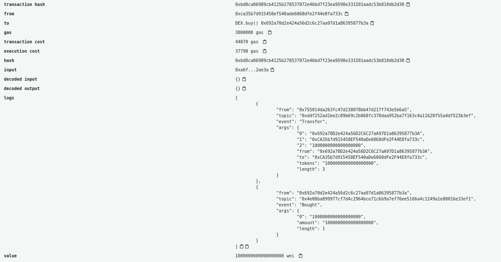

W poprzednim samouczku zbadaliśmy [anatomię tokena ERC-20 w Solidity](/developers/tutorials/understand-the-erc-20-token-smart-contract/) w blockchainie Ethereum. W tym artykule zobaczymy, jak możemy użyć inteligentnego kontraktu do interakcji z tokenem, używając języka Solidity.

Dla tego inteligentnego kontraktu stworzymy naprawdę fikcyjną zdecentralizowaną giełdę, na której użytkownik może wymieniać ether na nasze nowo wdrożone [tokeny ERC-20](/developers/docs/standards/tokens/erc-20/).

W tym samouczku użyjemy kodu, który napisaliśmy w poprzednim samouczku jako podstawy. Nasz DEX utworzy instancjr kontraktu w konstruktorze i wykona operacje:

- wymiana tokenów na ether
- wymiana etheru na tokeny

Rozpoczniemy nasz zdecentralizowany kod wymiany poprzez dodanie naszej prostej bazy kodowej ERC20:

```solidity
pragma solidity ^0.6.0;

interface IERC20 {

    function totalSupply() external view returns (uint256);
    function balanceOf(address account) external view returns (uint256);
    function allowance(address owner, address spender) external view returns (uint256);

    function transfer(address recipient, uint256 amount) external returns (bool);
    function approve(address spender, uint256 amount) external returns (bool);
    function transferFrom(address sender, address recipient, uint256 amount) external returns (bool);


    event Transfer(address indexed from, address indexed to, uint256 value);
    event Approval(address indexed owner, address indexed spender, uint256 value);
}


contract ERC20Basic is IERC20 {

    string public constant name = "ERC20Basic";
    string public constant symbol = "ERC";
    uint8 public constant decimals = 18;


    event Approval(address indexed tokenOwner, address indexed spender, uint tokens);
    event Transfer(address indexed from, address indexed to, uint tokens);


    mapping(address => uint256) balances;

    mapping(address => mapping (address => uint256)) allowed;

    uint256 totalSupply_ = 100 ether;

    using SafeMath for uint256;

   constructor(uint256 total) public {
    balances[msg.sender] = totalSupply_;
    }

    function totalSupply() public override view returns (uint256) {
    return totalSupply_;
    }

    function balanceOf(address tokenOwner) public override view returns (uint256) {
        return balances[tokenOwner];
    }

    function transfer(address receiver, uint256 numTokens) public override returns (bool) {
        require(numTokens <= balances[msg.sender]);
        balances[msg.sender] = balances[msg.sender].sub(numTokens);
        balances[receiver] = balances[receiver].add(numTokens);
        emit Transfer(msg.sender, receiver, numTokens);
        return true;
    }

    function approve(address delegate, uint256 numTokens) public override returns (bool) {
        allowed[msg.sender][delegate] = numTokens;
        emit Approval(msg.sender, delegate, numTokens);
        return true;
    }

    function allowance(address owner, address delegate) public override view returns (uint) {
        return allowed[owner][delegate];
    }

    function transferFrom(address owner, address buyer, uint256 numTokens) public override returns (bool) {
        require(numTokens <= balances[owner]);
        require(numTokens <= allowed[owner][msg.sender]);

        balances[owner] = balances[owner].sub(numTokens);
        allowed[owner][msg.sender] = allowed[owner][msg.sender].sub(numTokens);
        balances[buyer] = balances[buyer].add(numTokens);
        emit Transfer(owner, buyer, numTokens);
        return true;
    }
}

library SafeMath {
    function sub(uint256 a, uint256 b) internal pure returns (uint256) {
      assert(b <= a);
      return a - b;
    }

    function add(uint256 a, uint256 b) internal pure returns (uint256) {
      uint256 c = a + b;
      assert(c >= a);
      return c;
    }
}
```

Nasz nowy inteligentny kontrakt DEX wdroży ERC-20 i otrzyma wszystkie dostarczone:

```solidity
contract DEX {

    IERC20 public token;

    event Bought(uint256 amount);
    event Sold(uint256 amount);

    constructor() public {
        token = new ERC20Basic();
    }

    function buy() payable public {
        // TODO
    }

    function sell(uint256 amount) public {
        // TODO
    }

}
```

Więc wiemy, że mamy nasz DEX i ma całą dostępną rezerwę tokenów. Kontrakt spełnia dwie funkcje:

- `buy`: użytkownik może wysyłać ether i otrzymywać tokeny w zamian
- `sell`: użytkownik może zdecydować się na wysłanie tokenów, aby odzyskać ether

## Funkcja kupna {#the-buy-function}

Zakodujmy funkcję kup. Najpierw będziemy musieli sprawdzić ilość etheru w wiadomości i sprawdzić, czy kontrakty posiadają wystarczającą ilość tokenów i czy wiadomość ma w niej jakiś eter. cJeśli kontrakt posiada wystarczającą ilość tokenów, wyśle liczbę tokenów do użytkownika i wyemituje zdarzenie `Bought`.

Zauważ, że jeśli wywołamy wymagającą funkcję w przypadku błędu, ether wysłany zostanie bezpośrednio przywrócony i odesłany do użytkownika.

Aby uprościć sprawę, po prostu wymieniamy 1 token na 1 eter.

```solidity
function buy() payable public {
    uint256 amountTobuy = msg.value;
    uint256 dexBalance = token.balanceOf(address(this));
    require(amountTobuy > 0, "You need to send some ether");
    require(amountTobuy <= dexBalance, "Not enough tokens in the reserve");
    token.transfer(msg.sender, amountTobuy);
    emit Bought(amountTobuy);
}
```

Jeśli zakup zakończył się sukcesem, powinniśmy zobaczyć dwa zdarzenia w transakcji: Token `Transfer` i `Bought` wydarzenie.



## Funkcja kupna {#the-sell-function}

Funkcja odpowiedzialna za sprzedaż będzie najpierw wymagała od użytkownika zatwierdzenia kwoty poprzez uprzednie wywołanie zatwierdzonej funkcji. Następnie, gdy funkcja sprzedaży jest uruchomiona, sprawdzimy, czy przelew z adresu dzwoniącego na adres umowy zakończył się sukcesem, a następnie wyślemy Ethers z powrotem na adres dzwoniącego.

```solidity
function sell(uint256 amount) public {
    require(amount > 0, "You need to sell at least some tokens");
    uint256 allowance = token.allowance(msg.sender, address(this));
    require(allowance >= amount, "Check the token allowance");
    token.transferFrom(msg.sender, address(this), amount);
    msg.sender.transfer(amount);
    emit Sold(amount);
}
```

Jeśli wszystko działa, powinieneś zobaczyć 2 zdarzenia w transakcji (a `Transfer` i `Sold`) i Twoje saldo tokenu i saldo Ethereum zaktualizowane.


<Divider />

Z tego samouczka zobaczyliśmy, jak sprawdzić saldo i przydział tokena ERC-20, a także jak wywołać `Transfer` i `TransferFrom` inteligentnego kontraktu ERC20 przy użyciu interfejsu.

Po dokonaniu transakcji mamy samouczek JavaScript, aby [poczekać i uzyskać szczegółowe informacje o transakcjach](https://ethereumdev.io/waiting-for-a-transaction-to-be-mined-on-ethereum-with-js/), które zostały wykonane w ramach Twojego kontraktu oraz [samouczek dekodowania zdarzeń generowanych przez transfery tokenów lub inne zdarzenia](https://ethereumdev.io/how-to-decode-event-logs-in-javascript-using-abi-decoder/), o ile masz ABI.

Oto kompletny kod do samouczka:

```solidity
pragma solidity ^0.6.0;

interface IERC20 {

    function totalSupply() external view returns (uint256);
    function balanceOf(address account) external view returns (uint256);
    function allowance(address owner, address spender) external view returns (uint256);

    function transfer(address recipient, uint256 amount) external returns (bool);
    function approve(address spender, uint256 amount) external returns (bool);
    function transferFrom(address sender, address recipient, uint256 amount) external returns (bool);


    event Transfer(address indexed from, address indexed to, uint256 value);
    event Approval(address indexed owner, address indexed spender, uint256 value);
}


contract ERC20Basic is IERC20 {

    string public constant name = "ERC20Basic";
    string public constant symbol = "ERC";
    uint8 public constant decimals = 18;


    event Approval(address indexed tokenOwner, address indexed spender, uint tokens);
    event Transfer(address indexed from, address indexed to, uint tokens);


    mapping(address => uint256) balances;

    mapping(address => mapping (address => uint256)) allowed;

    uint256 totalSupply_ = 10 ether;

    using SafeMath for uint256;

   constructor() public {
    balances[msg.sender] = totalSupply_;
    }

    function totalSupply() public override view returns (uint256) {
    return totalSupply_;
    }

    function balanceOf(address tokenOwner) public override view returns (uint256) {
        return balances[tokenOwner];
    }

    function transfer(address receiver, uint256 numTokens) public override returns (bool) {
        require(numTokens <= balances[msg.sender]);
        balances[msg.sender] = balances[msg.sender].sub(numTokens);
        balances[receiver] = balances[receiver].add(numTokens);
        emit Transfer(msg.sender, receiver, numTokens);
        return true;
    }

    function approve(address delegate, uint256 numTokens) public override returns (bool) {
        allowed[msg.sender][delegate] = numTokens;
        emit Approval(msg.sender, delegate, numTokens);
        return true;
    }

    function allowance(address owner, address delegate) public override view returns (uint) {
        return allowed[owner][delegate];
    }

    function transferFrom(address owner, address buyer, uint256 numTokens) public override returns (bool) {
        require(numTokens <= balances[owner]);
        require(numTokens <= allowed[owner][msg.sender]);

        balances[owner] = balances[owner].sub(numTokens);
        allowed[owner][msg.sender] = allowed[owner][msg.sender].sub(numTokens);
        balances[buyer] = balances[buyer].add(numTokens);
        emit Transfer(owner, buyer, numTokens);
        return true;
    }
}

library SafeMath {
    function sub(uint256 a, uint256 b) internal pure returns (uint256) {
      assert(b <= a);
      return a - b;
    }

    function add(uint256 a, uint256 b) internal pure returns (uint256) {
      uint256 c = a + b;
      assert(c >= a);
      return c;
    }
}

contract DEX {

    event Bought(uint256 amount);
    event Sold(uint256 amount);


    IERC20 public token;

    constructor() public {
        token = new ERC20Basic();
    }

    function buy() payable public {
        uint256 amountTobuy = msg.value;
        uint256 dexBalance = token.balanceOf(address(this));
        require(amountTobuy > 0, "You need to send some Ether");
        require(amountTobuy <= dexBalance, "Not enough tokens in the reserve");
        token.transfer(msg.sender, amountTobuy);
        emit Bought(amountTobuy);
    }

    function sell(uint256 amount) public {
        require(amount > 0, "You need to sell at least some tokens");
        uint256 allowance = token.allowance(msg.sender, address(this));
        require(allowance >= amount, "Check the token allowance");
        token.transferFrom(msg.sender, address(this), amount);
        msg.sender.transfer(amount);
        emit Sold(amount);
    }

}
```
