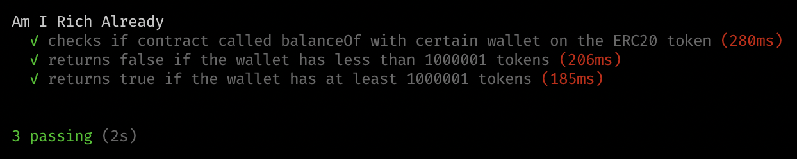

## O czym jest ten samouczek? {#what-is-this-tutorial-about}

Z tego samouczka dowiesz się, jak:

- uużywać dynamicznego tworzenia atrap
- testować interakcje między inteligentnymi kontraktami

Założenia:

- wiesz już, jak napisać prosty inteligentny kontrakt w `Solidity `
- znasz się na `JavaScript` i `TypeScript`
- zapoznałeś się z innymi samouczkami `Waffle` lub wiesz coś na ten temat

## Dynamiczne tworzenie atrap {#dynamic-mocking}

Dlaczego dynamiczne tworzenie atrap jest przydatne? No cóż, pozwala nam pisać testy jednostkowe zamiast testów integracyjnych. Co to oznacza? Oznacza to, że nie musimy martwić się zależnościami inteligentnych kontraktów, dlatego możemy je przetestować w całkowicie izolacji. Pozwolę sobie pokazać, jak dokładnie możesz to zrobić.

### **1. Projekt** {#1-project}

Zanim zaczniemy musimy przygotować prosty projekt node.js:

```bash
$ mkdir dynamic-mocking
$ cd dynamic-mocking
$ mkdir contracts src

$ yarn init
# or if you're using npm
$ npm init
```

Zacznijmy od dodania zależności typescript i test — mokka i chai:

```bash
$ yarn add --dev @types/chai @types/mocha chai mocha ts-node typescript
# lub jeśli używasz npm $ npm install @types/chai @types/mocha chai mocha ts-node typescript --save-dev
```

Teraz dodajmy `Waffle` i `ethers`:

```bash
$ yarn add --dev ethereum-waffle ethers
# or if you're using npm
$ npm install ethereum-waffle ethers --save-dev
```

Twoja struktura projektu powinna teraz wyglądać tak:

```
.
├── contracts
├── package.json
└── test
```

### **2. Inteligentny kontrakt** {#2-smart-contract}

Aby rozpocząć dynamiczne tworzenie atrapy, potrzebujemy inteligentnego kontraktu z zależnościami. Nie martw się, pomyślałem o tym!

Oto prosty inteligentny kontrakt napisany w `Solidity`, którego jedynym celem jest sprawdzenie, czy jesteśmy bogaci. Używa tokena ERC20 do sprawdzenia, czy mamy wystarczającą ilość tokenów. Umieść go w `./contracts/AmIRichAlready.sol`.

```solidity
pragma solidity ^0.6.2;

interface IERC20 {
    function balanceOf(address account) external view returns (uint256);
}

contract AmIRichAlready {
    IERC20 private tokenContract;
    uint public richness = 1000000 * 10 ** 18;

    constructor (IERC20 _tokenContract) public {
        tokenContract = _tokenContract;
    }

    function check() public view returns (bool) {
        uint balance = tokenContract.balanceOf(msg.sender);
        return balance > richness;
    }
}
```

Ponieważ chcemy używać dynamicznego tworzenia atrap, nie potrzebujemy całego ERC20, dlatego używamy interfejsu IERC20 z tylko jedną funkcją.

Nadszedł czas, aby zbudować ten kontrakt! W tym celu użyjemy `Waffle`. Najpierw stworzymy prosty plik konfiguracyjny `waffle.json`, który określa opcje kompilacji.

```json
{
  "compilerType": "solcjs",
  "compilerVersion": "0.6.2",
  "sourceDirectory": "./contracts",
  "outputDirectory": "./build"
}
```

Teraz jesteśmy gotowi zbudować kontrakt z Waffle:

```bash
$ npx waffle
```

Łatwe, prawda? W folderze `build/` pojawiły się dwa pliki odpowiadające umowie i interfejsowi. Wykorzystamy je później do testowania.

### **3. Testowanie** {#3-testing}

Utwórzmy plik o nazwie `AmIRichAlready.test.ts` dla bieżącego testu. Przede wszystkim musimy poradzić sobie z importem. Będziemy ich potrzebować na później:

```typescript
import { expect, use } from "chai"
import { Contract, utils, Wallet } from "ethers"
import {
  deployContract,
  deployMockContract,
  MockProvider,
  solidity,
} from "ethereum-waffle"
```

Z wyjątkiem zależności JS, musimy zaimportować naszą wbudowaną umowę i interfejs:

```typescript
import IERC20 from "../build/IERC20.json"
import AmIRichAlready from "../build/AmIRichAlready.json"
```

Waffle używa `chai` do testowania. Zanim jednak będziemy mogli go użyć, musimy wstrzyknąć wyrażenie matcher Waffle do samego chai:

```typescript
use(solidity)
```

Musimy zaimplementować funkcję `beforeEach()`, która zresetuje stan kontraktu przed każdym testem. Zastanówmy się najpierw nad tym, czego tam potrzebujemy. Aby wdrożyć umowę, potrzebujemy dwóch rzeczy: portfela i wdrożonego kontraktu ERC20, aby przekazać go jako argument dla kontraktu `AmIRichAlready`.

Po pierwsze, tworzymy portfel:

```typescript
const [wallet] = new MockProvider().getWallets()
```

Następnie musimy wdrożyć umowę ERC20. Oto trudna część - mamy tylko interfejs. Jest to ta część, w której Waffle nas ratuje. Waffle posiada magiczną funkcję `wdrożenieMockContract()`, która tworzy kontrakt wykorzystujący tylko _abi_ interfejsu:

```typescript
const mockERC20 = await deployMockContract(wallet, IERC20.abi)
```

Teraz, zarówno z portfelem, jak i z ERC20, możemy kontynuować i wdrożyć kontrakt `AmIRichAlready`:

```typescript
const contract = await deployContract(wallet, AmIRichAlready, [
  mockERC20.address,
])
```

Po tym wszystkim nasza funkcja `beforeEach()` została zakończona. Jak dotąd plik `AmIRichAlready.test.ts` powinien wyglądać tak:

```typescript
import { expect, use } from "chai"
import { Contract, utils, Wallet } from "ethers"
import {
  deployContract,
  deployMockContract,
  MockProvider,
  solidity,
} from "ethereum-waffle"

import IERC20 from "../build/IERC20.json"
import AmIRichAlready from "../build/AmIRichAlready.json"

use(solidity)

describe("Am I Rich Already", () => {
  let mockERC20: Contract
  let contract: Contract
  let wallet: Wallet

  beforeEach(async () => {
    ;[wallet] = new MockProvider().getWallets()
    mockERC20 = await deployMockContract(wallet, IERC20.abi)
    contract = await deployContract(wallet, AmIRichAlready, [mockERC20.address])
  })
})
```

Zapiszmy pierwszy test do kontraktu `AmIRichAlready`. Czy uważasz, że powinniśmy mieć na uwadze nasz test? Tak, masz rację! Powinniśmy sprawdzić, czy już jesteśmy bogaci :)

Ale poczekaj sekundę. Jak nasz pozorowany kontrakt będzie wiedział, jakie wartości należy zwrócić? Nie zaimplementowaliśmy żadnej logiki dla funkcji `balanceOf()`. Jeszcze raz Waffle może tu pomóc. Nasz pozorowany kontrakt ma teraz kilka nowych, fantazyjnych rzeczy:

```typescript
await mockERC20.mock.<nameOfMethod>.returns(<value>)
await mockERC20.mock.<nameOfMethod>.withArgs(<arguments>).returns(<value>)
```

Dzięki tej wiedzy możemy wreszcie napisać nasz pierwszy test:

```typescript
it("returns false if the wallet has less than 1000000 tokens", async () => {
  await mockERC20.mock.balanceOf.returns(utils.parseEther("999999"))
  expect(await contract.check()).to.be.equal(false)
})
```

Podzielmy ten test na części:

1. Ustawiliśmy naszą próbną umowę ERC20 tak, aby zawsze zwracała saldo 999999 tokenów.
2. Sprawdź, czy metoda `contract.check()` zwraca `false`.

Jesteśmy gotowi wystrzelić z grubej rury:


Tak więc test działa, ale... wciąż jest trochę miejsca na ulepszenia. Funkcja `balanceOf()` zawsze zwróci 99999. Możemy ją ulepszyć poprzez określenie portfela, dla którego funkcja powinna zwracać coś — tak jak prawdziwy kontrakt:

```typescript
it("returns false if the wallet has less than 1000001 tokens", async () => {
  await mockERC20.mock.balanceOf
    .withArgs(wallet.address)
    .returns(utils.parseEther("999999"))
  expect(await contract.check()).to.be.equal(false)
})
```

Jak dotąd przetestowaliśmy tylko przypadek, w którym nie jesteśmy wystarczająco bogaci. Przetestujmy przeciwnie:

```typescript
it("returns true if the wallet has at least 1000001 tokens", async () => {
  await mockERC20.mock.balanceOf
    .withArgs(wallet.address)
    .returns(utils.parseEther("1000001"))
  expect(await contract.check()).to.be.equal(true)
})
```

Uruchomiłeś testy...


...i tu jesteś! Nasza umowa wydaje się działać zgodnie z zamierzeniem :)

## Testowanie wywołań kontraktów {#testing-contract-calls}

Podsumujmy dotychczasowe osiągnięcia. Przetestowaliśmy funkcjonalność naszego kontraktu `AmIRichAlready` i wygląda na to, że działa poprawnie. To znaczy, że skończyliśmy, prawda? Nie całkiem! Waffle pozwala nam jeszcze bardziej przetestować nasz kontrakt. Ale jak dokładnie? No cóż, w arsenale Waffle'a znajduje się `calledOnContract()` i wyrażenia matcher `calledOnContractWith()`. Umożliwią nam one sprawdzenie, czy nasz kontrakt wywołał pozorowany kontrakt ERC20. Oto podstawowy test z jednym z tych wyrażeń:

```typescript
it("checks if contract called balanceOf on the ERC20 token", async () => {
  await mockERC20.mock.balanceOf.returns(utils.parseEther("999999"))
  await contract.check()
  expect("balanceOf").to.be.calledOnContract(mockERC20)
})
```

Możemy pójść jeszcze dalej i ulepszyć ten test za pomocą innego wyrażenia matcher, o którym wam mówiłem:

```typescript
it("checks if contract called balanceOf with certain wallet on the ERC20 token", async () => {
  await mockERC20.mock.balanceOf
    .withArgs(wallet.address)
    .returns(utils.parseEther("999999"))
  await contract.check()
  expect("balanceOf").to.be.calledOnContractWith(mockERC20, [wallet.address])
})
```

Sprawdźmy, czy testy są poprawne:



Świetnie, wszystkie testy są zielone.

Testowanie połączeń kontraktowych z Waffle jest bardzo łatwe. I oto najlepsza część. Te wyrażenia matcher działają zarówno z normalnymi, jak i próbnymi kontraktami! Wynika to z tego, że Waffle rejestruje i filtruje połączenia EVM zamiast wstrzykiwać kod, tak jak w przypadku popularnych bibliotek testowych dla innych technologii.

## Meta {#the-finish-line}

Gratulacje! Teraz wiesz jak korzystać z Waffle do dynamicznego testowania połączeń i modelowania kontraktów. Istnieją o wiele bardziej interesujące funkcje, które należy odkryć. Zalecam nurkowanie w dokumentacji Waffle.

Dokumentacja Waffle'a jest dostępna [tutaj](https://ethereum-waffle.readthedocs.io/).

Kod źródłowy dla tego samouczka można znaleźć [tutaj](https://github.com/EthWorks/Waffle/tree/master/examples/dynamic-mocking-and-testing-calls).

Samouczki mogą być interesujące:

- [Testowanie inteligentnych kontraktów z Waffle](/developers/tutorials/testing-smart-contract-with-waffle/)
