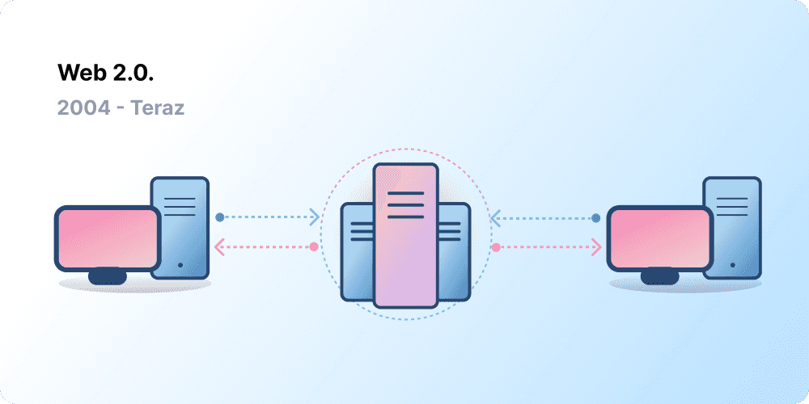
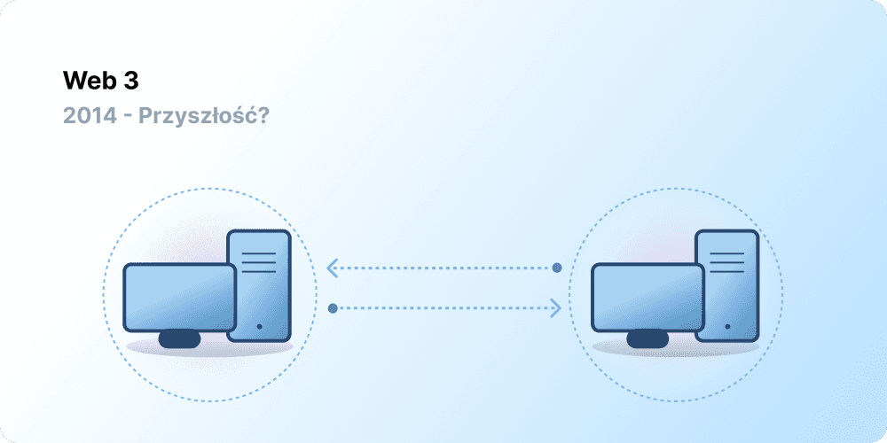

Centralizacja pomogła wprowadzić miliardy ludzi do World Wide Web i stworzyła stabilną, solidną infrastrukturę, na której się opiera. Jednocześnie garstka scentralizowanych podmiotów ma silną pozycję w ogromnych obszarach World Wide Web, jednostronnie decydując o tym, co powinno, a co nie powinno być dozwolone.

Web3 jest odpowiedzią na ten dylemat. Zamiast sieci zmonopolizowanej przez duże firmy technologiczne, Web3 opiera się na decentralizacji i jest budowane, obsługiwane oraz posiadane przez swoich użytkowników. Web3 oddaje władzę w ręce jednostek, a nie korporacji.
Zanim porozmawiamy o Web3, przyjrzyjmy się, jak do tego doszliśmy.

<Divider />

## Wczesna sieć {#early-internet}

Większość ludzi uważa sieć za stały filar współczesnego życia — została wynaleziona i od tamtej pory po prostu istnieje. Jednak sieć, którą większość z nas zna dzisiaj, znacznie różni się od tej pierwotnie wyobrażonej. Aby to lepiej zrozumieć, warto podzielić krótką historię sieci na luźne okresy — Web 1.0 i Web 2.0.

### Web 1.0: Tylko do odczytu (1990-2004) {#web1}

W 1989 roku w CERN w Genewie Tim Berners-Lee był zajęty opracowywaniem protokołów, które miały stać się World Wide Web. Jego pomysł? Stworzenie otwartych, zdecentralizowanych protokołów, które umożliwiałyby udostępnianie informacji z dowolnego miejsca na Ziemi.

Pierwsze wcielenie dzieła Bernersa-Lee, znane obecnie jako „Web 1.0”, miało miejsce mniej więcej w latach 1990-2004. Web 1.0 to głównie statyczne strony internetowe należące do firm, a interakcja między użytkownikami była bliska zeru - jednostki rzadko tworzyły treści - co doprowadziło do tego, że nazwano ją siecią tylko do odczytu.

### Web 2.0: Odczyt i zapis (2004-obecnie) {#web2}

Okres Web 2.0 rozpoczął się w 2004 roku wraz z pojawieniem się platform mediów społecznościowych. Zamiast tylko do odczytu, sieć ewoluowała do odczytu i zapisu. Zamiast firm dostarczających treści użytkownikom, zaczęły one również udostępniać platformy do dzielenia się treściami generowanymi przez użytkowników i angażowania się w interakcje między nimi. W miarę jak coraz więcej osób zaczęło korzystać z internetu, garstka czołowych firm zaczęła kontrolować nieproporcjonalnie dużą część ruchu i wartości generowanej w sieci. Web 2.0 dało również początek modelowi przychodów opartemu na reklamach. Chociaż użytkownicy mogli tworzyć treści, nie byli ich właścicielami ani nie czerpali korzyści z ich monetyzacji.

<Divider />

## Web 3.0: Odczyt, zapis i własność {#web3}

Założenie „Web 3.0” zostało sformułowane przez współzałożyciela [Ethereum](/), Gavina Wooda, krótko po uruchomieniu Ethereum w 2014 roku. Gavin ubrał w słowa rozwiązanie problemu, który odczuwało wielu wczesnych entuzjastów krypto: sieć wymagała zbyt dużego zaufania. Oznacza to, że większość sieci, którą ludzie znają i z której korzystają dzisiaj, opiera się na zaufaniu do garstki prywatnych firm, że będą działać w najlepszym interesie publicznym.

### Czym jest Web3? {#what-is-web3}

Web3 stało się uniwersalnym terminem określającym wizję nowego, lepszego internetu. W swojej istocie Web3 wykorzystuje blockchainy, kryptowaluty i NFT, aby oddać władzę z powrotem w ręce użytkowników w formie własności. [Wpis na Twitterze z 2020 roku](https://twitter.com/himgajria/status/1266415636789334016) ujął to najlepiej: Web1 było tylko do odczytu, Web2 to odczyt i zapis, Web3 będzie odczytem, zapisem i własnością.

#### Główne idee Web3 {#core-ideas}

Chociaż trudno jest podać sztywną definicję tego, czym jest Web3, jego tworzeniem kieruje kilka podstawowych zasad.

- **Web3 jest zdecentralizowane:** zamiast ogromnych połaci internetu kontrolowanych i posiadanych przez scentralizowane podmioty, własność jest rozdzielana między jego twórców i użytkowników.
- **Web3 jest niewymagające pozwoleń:** każdy ma równy dostęp do uczestnictwa w Web3 i nikt nie jest wykluczony.
- **Web3 ma natywne płatności:** wykorzystuje kryptowaluty do wydawania i wysyłania pieniędzy online, zamiast polegać na przestarzałej infrastrukturze banków i procesorów płatniczych.
- **Web3 jest niewymagające zaufania:** działa w oparciu o zachęty i mechanizmy ekonomiczne, zamiast polegać na zaufanych stronach trzecich.

### Dlaczego Web3 jest ważne? {#why-is-web3-important}

Chociaż kluczowe funkcje Web3 nie są odizolowane i nie pasują do zgrabnych kategorii, dla uproszczenia postaraliśmy się je rozdzielić, aby ułatwić ich zrozumienie.

#### Własność {#ownership}

Web3 daje Ci własność Twoich zasobów cyfrowych w niespotykany dotąd sposób. Załóżmy na przykład, że grasz w grę Web2. Jeśli kupisz przedmiot w grze, jest on bezpośrednio powiązany z Twoim kontem. Jeśli twórcy gry usuną Twoje konto, stracisz te przedmioty. Albo, jeśli przestaniesz grać w grę, stracisz wartość zainwestowaną w przedmioty w grze.

Web3 pozwala na bezpośrednią własność poprzez [niewymienialne tokeny (NFT)](/glossary/#nft). Nikt, nawet twórcy gry, nie ma mocy odebrania Ci własności. A jeśli przestaniesz grać, możesz sprzedać lub wymienić swoje przedmioty z gry na otwartych rynkach i odzyskać ich wartość. Odkryj [gry onchain](/gaming/), aby zobaczyć to w akcji.

<Alert variant="update">
<AlertEmoji text=":eyes:"/>
<AlertContent className="flex-row items-center justify-between">
  
Dowiedz się więcej o NFT

  <ButtonLink href="/nft/">
    Więcej o NFT
  </ButtonLink>
</AlertContent>
</Alert>

#### Odporność na cenzurę {#censorship-resistance}

Dynamika władzy między platformami a twórcami treści jest ogromnie niezrównoważona.

OnlyFans to strona z treściami dla dorosłych generowanymi przez użytkowników, zrzeszająca ponad milion twórców, z których wielu traktuje tę platformę jako główne źródło dochodu. W sierpniu 2021 roku OnlyFans ogłosiło plany zakazania treści o charakterze jednoznacznie seksualnym. Ogłoszenie to wywołało oburzenie wśród twórców na platformie, którzy poczuli, że są okradani z dochodów na platformie, którą pomogli stworzyć. Po fali krytyki decyzja została szybko cofnięta. Mimo że twórcy wygrali tę bitwę, uwypukla to problem twórców Web 2.0: tracisz reputację i zgromadzonych obserwujących, jeśli opuścisz platformę.

W Web3 Twoje dane żyją na blockchainie. Kiedy zdecydujesz się opuścić platformę, możesz zabrać ze sobą swoją reputację, podłączając ją do innego interfejsu, który lepiej odpowiada Twoim wartościom.

Web 2.0 wymaga od twórców treści zaufania do platform, że nie zmienią one zasad, ale odporność na cenzurę jest natywną cechą platformy Web3.

#### Zdecentralizowane organizacje autonomiczne (DAO) {#daos}

Oprócz posiadania własnych danych w Web3, możesz być współwłaścicielem platformy jako kolektyw, używając tokenów, które działają jak udziały w firmie. DAO pozwalają na koordynowanie zdecentralizowanej własności platformy i podejmowanie decyzji o jej przyszłości.

DAO są technicznie definiowane jako uzgodnione [inteligentne kontrakty](/glossary/#smart-contract), które automatyzują zdecentralizowane podejmowanie decyzji dotyczących puli zasobów (tokenów). Użytkownicy posiadający tokeny głosują nad tym, jak wydawane są zasoby, a kod automatycznie wykonuje wynik głosowania.

Jednak ludzie określają wiele społeczności Web3 jako DAO. Wszystkie te społeczności mają różny poziom decentralizacji i automatyzacji za pomocą kodu. Obecnie badamy, czym są DAO i jak mogą ewoluować w przyszłości.

<Alert variant="update">
<AlertEmoji text=":eyes:"/>
<AlertContent className="flex-row items-center justify-between">
  
Dowiedz się więcej o DAO

  <ButtonLink href="/dao/">
    Więcej o DAO
  </ButtonLink>
</AlertContent>
</Alert>

### Tożsamość {#identity}

Tradycyjnie tworzyło się konto dla każdej używanej platformy. Na przykład możesz mieć konto na Twitterze, konto na YouTube i konto na Reddicie. Chcesz zmienić swoją nazwę wyświetlaną lub zdjęcie profilowe? Musisz to zrobić na każdym koncie. W niektórych przypadkach możesz użyć logowania społecznościowego, ale wiąże się to ze znanym problemem — cenzurą. Jednym kliknięciem te platformy mogą zablokować Ci dostęp do całego Twojego życia online. Co gorsza, wiele platform wymaga powierzenia im danych osobowych w celu utworzenia konta.

Web3 rozwiązuje te problemy, pozwalając Ci kontrolować swoją cyfrową tożsamość za pomocą adresu Ethereum i profilu [Ethereum Name Service (ENS)](/glossary/#ens). Użycie adresu Ethereum zapewnia pojedyncze logowanie na różnych platformach, które jest bezpieczne, odporne na cenzurę i anonimowe.

### Natywne płatności {#native-payments}

Infrastruktura płatnicza Web2 opiera się na bankach i procesorach płatniczych, wykluczając osoby bez kont bankowych lub te, które akurat mieszkają w granicach niewłaściwego kraju.
Web3 używa tokenów takich jak [ETH](/glossary/#ether) do wysyłania pieniędzy bezpośrednio w przeglądarce i nie wymaga zaufanej strony trzeciej.

<ButtonLink href="/what-is-ether/">
  Więcej o ETH
</ButtonLink>

## Ograniczenia Web3 {#web3-limitations}

Pomimo licznych korzyści płynących z Web3 w jego obecnej formie, wciąż istnieje wiele ograniczeń, z którymi ekosystem musi się zmierzyć, aby mógł się rozwijać.

### Dostępność {#accessibility}

Ważne funkcje Web3, takie jak logowanie przez Ethereum (Sign-in with Ethereum), są już dostępne dla każdego do użytku przy zerowych kosztach. Jednak względny koszt transakcji jest nadal zaporowy dla wielu osób. Web3 jest rzadziej wykorzystywane w mniej zamożnych, rozwijających się krajach ze względu na wysokie opłaty transakcyjne. W Ethereum te wyzwania są rozwiązywane poprzez [mapę drogową](/roadmap/) i [rozwiązania skalujące warstwy 2](/glossary/#layer-2). Technologia jest gotowa, ale potrzebujemy wyższego poziomu adopcji w warstwie 2, aby Web3 stało się dostępne dla wszystkich.

### Doświadczenie użytkownika {#user-experience}

Techniczna bariera wejścia do korzystania z Web3 jest obecnie zbyt wysoka. Użytkownicy muszą pojąć kwestie bezpieczeństwa, zrozumieć złożoną dokumentację techniczną i poruszać się po nieintuicyjnych interfejsach użytkownika. W szczególności [dostawcy portfeli](/wallets/find-wallet/) pracują nad rozwiązaniem tego problemu, ale potrzeba więcej postępów, zanim Web3 zostanie masowo zaadoptowane.

### Edukacja {#education}

Web3 wprowadza nowe paradygmaty, które wymagają nauczenia się innych modeli mentalnych niż te używane w Web 2.0. Podobna kampania edukacyjna miała miejsce, gdy Web 1.0 zyskiwało na popularności pod koniec lat 90.; zwolennicy World Wide Web używali mnóstwa technik edukacyjnych, aby edukować społeczeństwo, od prostych metafor (autostrada informacyjna, przeglądarki, surfowanie po sieci) po [transmisje telewizyjne](https://www.youtube.com/watch?v=SzQLI7BxfYI). Web3 nie jest trudne, ale jest inne. Inicjatywy edukacyjne informujące użytkowników Web2 o tych paradygmatach Web3 są kluczowe dla jego sukcesu.

Ethereum.org przyczynia się do edukacji o Web3 poprzez nasz [Program Tłumaczeń](/contributing/translation-program/), którego celem jest przetłumaczenie ważnych treści dotyczących Ethereum na jak najwięcej języków.

### Scentralizowana infrastruktura {#centralized-infrastructure}

Ekosystem Web3 jest młody i szybko ewoluuje. W rezultacie obecnie zależy głównie od scentralizowanej infrastruktury (GitHub, Twitter, Discord itp.). Wiele firm Web3 spieszy się, aby wypełnić te luki, ale budowa wysokiej jakości, niezawodnej infrastruktury wymaga czasu.

## Zdecentralizowana przyszłość {#decentralized-future}

Web3 to młody i ewoluujący ekosystem. Gavin Wood ukuł ten termin w 2014 roku, ale wiele z tych pomysłów dopiero niedawno stało się rzeczywistością. Tylko w zeszłym roku nastąpił znaczny wzrost zainteresowania kryptowalutami, ulepszenia rozwiązań skalujących warstwy 2, masowe eksperymenty z nowymi formami zarządzania i rewolucje w tożsamości cyfrowej.

Jesteśmy dopiero na początku tworzenia lepszej sieci dzięki Web3, ale w miarę jak kontynuujemy ulepszanie infrastruktury, która będzie ją wspierać, przyszłość sieci rysuje się w jasnych barwach.

## Jak mogę się zaangażować {#get-involved}

- [Zdobądź portfel](/wallets/)
- [Znajdź społeczność](/community/)
- [Odkrywaj aplikacje Web3](/apps/)
- [Dołącz do DAO](/dao/)
- [Buduj w Web3](/developers/)

## Dalsza lektura {#further-reading}

Web3 nie jest sztywno zdefiniowane. Różni uczestnicy społeczności mają na nie różne perspektywy. Oto kilka z nich:

- [Czym jest Web3? Wyjaśnienie zdecentralizowanego internetu przyszłości](https://www.freecodecamp.org/news/what-is-web3) – _Nader Dabit_
- [Zrozumieć Web 3](https://medium.com/l4-media/making-sense-of-web-3-c1a9e74dcae) – _Josh Stark_
- [Dlaczego Web3 ma znaczenie](https://a16zcrypto.com/posts/article/why-web3-matters/) — _Chris Dixon_
- [Dlaczego decentralizacja ma znaczenie](https://onezero.medium.com/why-decentralization-matters-5e3f79f7638e) - _Chris Dixon_
- [Krajobraz Web3](https://a16z.com/wp-content/uploads/2021/10/The-web3-Readlng-List.pdf) – _a16z_
- [Debata o Web3](https://www.notboring.co/p/the-web3-debate) – _Packy McCormick_

<QuizWidget quizKey="web3" />