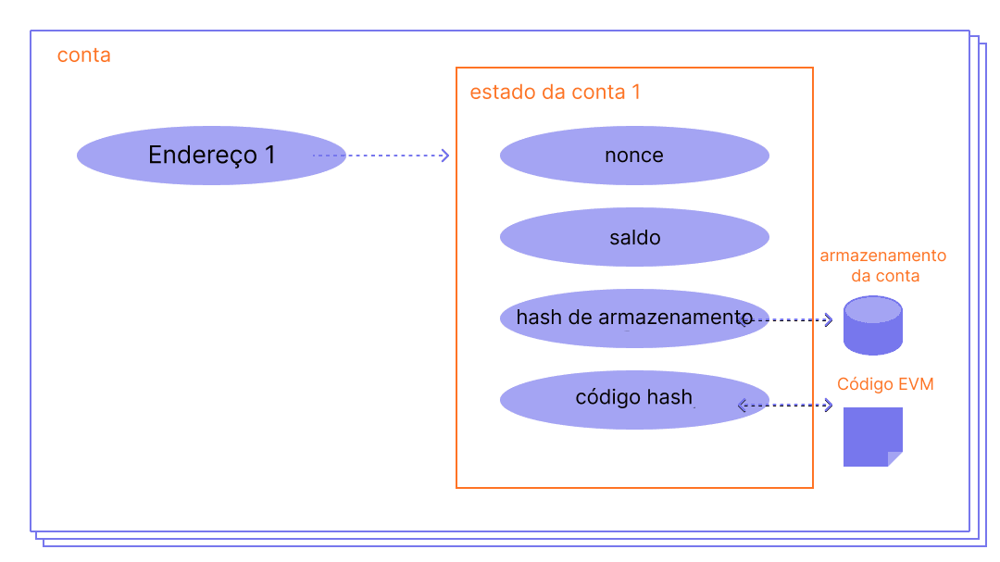

Uma conta na [Ethereum](/) é uma entidade com um saldo em ether (ETH) que pode enviar mensagens na Ethereum. As contas podem ser controladas por usuários ou implantadas como contratos inteligentes.

## Pré-requisitos {#prerequisites}

Para ajudar você a entender melhor esta página, recomendamos que leia primeiro nossa [introdução à Ethereum](/developers/docs/intro-to-ethereum/).

## Tipos de conta {#types-of-account}

A Ethereum tem dois tipos de conta:

- Conta de propriedade externa (EOA) – controlada por qualquer pessoa com as chaves privadas
- Conta de contrato – um contrato inteligente implantado na rede, controlado por código. Aprenda sobre [contratos inteligentes](/developers/docs/smart-contracts/)

Ambos os tipos de conta têm a capacidade de:

- Receber, manter e enviar ETH e tokens
- Interagir com contratos inteligentes implantados

### Principais diferenças {#key-differences}

**Propriedade externa**

- Criar uma conta não custa nada
- Pode iniciar transações
- Transações entre contas de propriedade externa só podem ser transferências de ETH/token
- Composta por um par de chaves criptográficas: chaves públicas e privadas que controlam as atividades da conta

**Contrato**

- Criar um contrato tem um custo porque você está usando o armazenamento da rede
- Só pode enviar mensagens em resposta ao recebimento de uma transação
- Transações de uma conta externa para uma conta de contrato podem acionar um código que pode executar muitas ações diferentes, como transferir tokens ou até mesmo criar um novo contrato
- Contas de contrato não têm chaves privadas. Em vez disso, elas são controladas pela lógica do código do contrato inteligente

## Uma conta examinada {#an-account-examined}

As contas na Ethereum têm quatro campos:

- `nonce` – Um contador que indica o número de transações enviadas de uma conta de propriedade externa ou o número de contratos criados por uma conta de contrato. Apenas uma transação com um determinado nonce pode ser executada para cada conta, protegendo contra ataques de repetição (replay attacks) onde transações assinadas são repetidamente transmitidas e reexecutadas.
- `balance` – O número de Wei de propriedade deste endereço. Wei é uma denominação de ETH e há 1e+18 Wei por ETH.
- `codeHash` – Este hash se refere ao _código_ de uma conta na Máquina Virtual Ethereum (EVM). Contas de contrato têm fragmentos de código programados que podem realizar diferentes operações. Este código da EVM é executado se a conta receber uma chamada de mensagem. Ele não pode ser alterado, ao contrário dos outros campos da conta. Todos esses fragmentos de código estão contidos no banco de dados de estado sob seus hashes correspondentes para recuperação posterior. Este valor de hash é conhecido como codeHash. Para contas de propriedade externa, o campo codeHash é o hash de uma string vazia.
- `storageRoot` – Às vezes conhecido como hash de armazenamento. Um hash de 256 bits do nó raiz de uma [trie de Merkle Patricia](/developers/docs/data-structures-and-encoding/patricia-merkle-trie/) que codifica o conteúdo de armazenamento da conta (um mapeamento entre valores inteiros de 256 bits), codificado na trie como um mapeamento do hash Keccak-256 das chaves inteiras de 256 bits para os valores inteiros de 256 bits codificados em RLP. Esta trie codifica o hash do conteúdo de armazenamento desta conta e é vazia por padrão.


_Diagrama adaptado de [Ethereum EVM illustrated](https://takenobu-hs.github.io/downloads/ethereum_evm_illustrated.pdf)_

## Contas de propriedade externa e pares de chaves {#externally-owned-accounts-and-key-pairs}

Uma conta é composta por um par de chaves criptográficas: pública e privada. Elas ajudam a provar que uma transação foi realmente assinada pelo remetente e evitam falsificações. Sua chave privada é o que você usa para assinar transações, portanto, ela concede a você a custódia sobre os fundos associados à sua conta. Você nunca realmente possui criptomoeda, você possui chaves privadas – os fundos estão sempre no livro-razão da Ethereum.

Isso impede que atores mal-intencionados transmitam transações falsas porque você sempre pode verificar o remetente de uma transação.

Se Alice quiser enviar ether de sua própria conta para a conta de Bob, Alice precisa criar uma solicitação de transação e enviá-la à rede para verificação. O uso de criptografia de chave pública pela Ethereum garante que Alice possa provar que ela iniciou originalmente a solicitação de transação. Sem mecanismos criptográficos, uma adversária mal-intencionada, Eve, poderia simplesmente transmitir publicamente uma solicitação que se parecesse com "enviar 5 ETH da conta de Alice para a conta de Eve", e ninguém seria capaz de verificar que não veio de Alice.

## Criação de conta {#account-creation}

Quando você deseja criar uma conta, a maioria das bibliotecas gerará uma chave privada aleatória para você.

Uma chave privada é composta por 64 caracteres hexadecimais e pode ser criptografada com uma senha.

Exemplo:

`fffffffffffffffffffffffffffffffebaaedce6af48a03bbfd25e8cd036415f`

A chave pública é gerada a partir da chave privada usando o [Algoritmo de Assinatura Digital de Curva Elíptica](https://wikipedia.org/wiki/Elliptic_Curve_Digital_Signature_Algorithm). Você obtém um endereço público para sua conta pegando os últimos 20 bytes do hash Keccak-256 da chave pública e adicionando `0x` ao início.

Isso significa que uma conta de propriedade externa (EOA) tem um endereço de 42 caracteres (segmento de 20 bytes que são 40 caracteres hexadecimais mais o prefixo `0x`).

Exemplo:

`0x5e97870f263700f46aa00d967821199b9bc5a120`

O exemplo a seguir mostra como usar uma ferramenta de assinatura chamada [Clef](https://geth.ethereum.org/docs/tools/clef/introduction) para gerar uma nova conta. Clef é uma ferramenta de gerenciamento de contas e assinatura que vem empacotada com o cliente Ethereum, [Geth](https://geth.ethereum.org). O comando `clef newaccount` cria um novo par de chaves e as salva em um repositório de chaves criptografado.

```
> clef newaccount --keystore <path>

Please enter a password for the new account to be created:
> <password>

------------
INFO [10-28|16:19:09.156] Your new key was generated       address=0x5e97870f263700f46aa00d967821199b9bc5a120
WARN [10-28|16:19:09.306] Please backup your key file      path=/home/user/go-ethereum/data/keystore/UTC--2022-10-28T15-19-08.000825927Z--5e97870f263700f46aa00d967821199b9bc5a120
WARN [10-28|16:19:09.306] Please remember your password!
Generated account 0x5e97870f263700f46aa00d967821199b9bc5a120
```

[Documentação do Geth](https://geth.ethereum.org/docs)

É possível derivar novas chaves públicas a partir da sua chave privada, mas você não pode derivar uma chave privada a partir de chaves públicas. É vital manter suas chaves privadas seguras e, como o nome sugere, **PRIVADAS**.

Você precisa de uma chave privada para assinar mensagens e transações que geram uma assinatura. Outros podem então pegar a assinatura para derivar sua chave pública, provando a autoria da mensagem. Em seu aplicativo, você pode usar uma biblioteca JavaScript para enviar transações para a rede.

## Contas de contrato {#contract-accounts}

As contas de contrato também têm um endereço hexadecimal de 42 caracteres:

Exemplo:

`0x06012c8cf97bead5deae237070f9587f8e7a266d`

O endereço do contrato geralmente é fornecido quando um contrato é implantado na blockchain da Ethereum. O endereço vem do endereço do criador e do número de transações enviadas desse endereço (o "nonce").

## Chaves de validador {#validators-keys}

Há também outro tipo de chave na Ethereum, introduzido quando a Ethereum mudou do consenso baseado em Prova de Trabalho (PoW) para Prova de Participação (PoS). Estas são as chaves 'BLS' e são usadas para identificar validadores. Essas chaves podem ser agregadas de forma eficiente para reduzir a largura de banda necessária para que a rede chegue a um consenso. Sem essa agregação de chaves, o stake mínimo para um validador seria muito maior.

[Mais sobre chaves de validador](/developers/docs/consensus-mechanisms/pos/keys/).

## Uma observação sobre carteiras {#a-note-on-wallets}

Uma conta não é uma carteira. Uma carteira é uma interface ou aplicativo que permite que você interaja com sua conta na Ethereum, seja uma conta de propriedade externa ou uma conta de contrato.

## Uma demonstração visual {#a-visual-demo}

Assista ao Austin guiando você pelas funções de hash e pares de chaves.

<VideoWatch slug="hash-function-eth-build" />

<VideoWatch slug="key-pair-eth-build" />

## Leitura adicional {#further-reading}

- [Entendendo as contas na Ethereum](https://info.etherscan.com/understanding-ethereum-accounts/) - Etherscan

_Conhece um recurso da comunidade que ajudou você? Edite esta página e adicione-o!_

## Tópicos relacionados {#related-topics}

- [Contratos inteligentes](/developers/docs/smart-contracts/)
- [Transações](/developers/docs/transactions/)