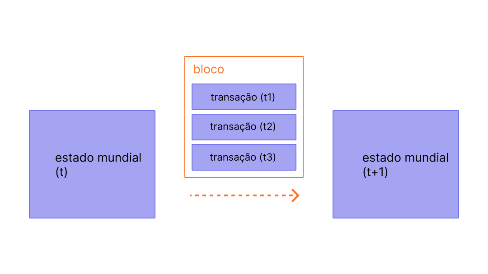

Blocos são lotes de transações com um hash do bloco anterior na cadeia. Isso une os blocos (em uma cadeia) porque os hashes são criptograficamente derivados dos dados do bloco. Isso previne fraudes, porque uma mudança em qualquer bloco no histórico invalidaria todos os blocos subsequentes, alteraria todos os hashes subsequentes e todos que estivessem executando o blockchain notariam.

## Pré-requisitos {#prerequisites}

Os blocos são um tópico muito amigável para iniciantes. Mas para ajudá-lo a entender melhor esta página, recomendamos que você primeiro leia [Contas](/developers/docs/accounts/), [Transações](/developers/docs/transactions/)e nossa [introdução ao Ethereum](/developers/docs/intro-to-ethereum/).

## Por que blocos? {#why-blocks}

Para garantir que todos os participantes da rede Ethereum mantenham um estado sincronizado e concordem com o histórico preciso de transações, nós processamos lotes de transações em blocos. Isso significa que dezenas (ou centenas) de transações são confirmadas, acordadas e sincronizadas de uma só vez.

 _Diagrama adaptado de [Ethereum EVM ilustrado](https://takenobu-hs.github.io/downloads/ethereum_evm_illustrated.pdf)_

Ao espaçar as confirmações, damos a todos os participantes da rede tempo suficiente para chegar a um consenso: mesmo que as solicitações de transação ocorram dezenas de vezes por segundo, os blocos só são criados e confirmados na Ethereum uma vez a cada doze segundos.

## Como os blocos funcionam {#how-blocks-work}

Para preservar o histórico de transação, os blocos são estritamente ordenados (cada novo bloco criado contém uma referência ao seu bloco de origem), e as transações dentro dos blocos também são ordenadas estritamente. Exceto em casos raros, a qualquer momento, todos os participantes da rede concordam com o número exato e o histórico de blocos, e estão trabalhando para processar em lote as solicitações atuais de transações para o bloco seguinte.

Uma vez que um bloco é agregado por um validador selecionado aleatoriamente na rede, ele é propagado pelo resto da rede. Em seguida, todos os nós adicionam esse bloco ao final de sua blockchain e um novo validador é selecionado para criar o próximo bloco. O processo exato de montagem de blocos e o processo de compromisso/consenso são atualmente especificados pelo protocolo de “prova de participação” da Ethereum.

## Protocolo de prova de participação {#proof-of-work-protocol}

Prova de participação significa o seguinte:

- Os nós de validação precisam colocar 32 ETH em um contrato de depósito como garantia contra mau comportamento. Isso ajuda a proteger a rede porque atividades comprovadamente desonestas fazem com que parte de ou toda essa participação seja destruída.
- Em cada espaço (espaçados de doze segundos), um validador é selecionado aleatoriamente para ser o proponente do bloco. Eles agrupam transações, as executam e determinam um novo "estado". Eles agrupam essas informações em um bloco e as passam para outros validadores.
- Outros validadores que ouvem sobre um novo bloco reexecutam as transações para garantir que concordam com a mudança proposta para o estado global. Assumindo que o bloco é válido, eles o adicionam ao seu próprio banco de dados.
- Se um validador ouvir sobre dois blocos conflitantes para o mesmo espaço, eles usam seu algoritmo de escolha de fork para escolher aquele suportado pelo ETH que teve mais participação.

[Mais sobre prova de participação](/developers/docs/consensus-mechanisms/pos)

## O que há em um bloco? {#block-anatomy}

Há muitas informações contidas em um bloco. No nível mais alto, um bloco contém os seguintes campos:

| Campo            | Descrição                                                  |
|:---------------- |:---------------------------------------------------------- |
| `slot`           | o slot ao qual o bloco pertence                            |
| `proposer_index` | a ID do validador que propõe o bloco                       |
| `parent_root`    | o hash do bloco anterior                                   |
| `state_root`     | o hash raiz do estado do objeto                            |
| `body`           | um objeto contendo vários campos, conforme definido abaixo |

O bloco `body` contém vários campos próprios:

| Campo                | Descrição                                                     |
|:-------------------- |:------------------------------------------------------------- |
| `randao_reveal`      | um valor usado para selecionar o proponente do próximo bloco  |
| `eth1_data`          | informações sobre o contrato de depósito                      |
| `graffiti`           | dados arbitrários usados para marcar blocos                   |
| `proposer_slashings` | lista de validadores a serem removidos                        |
| `attester_slashings` | lista de validadores a serem removidos                        |
| `attestations`       | lista de validadores a serem removidos                        |
| `deposits`           | lista de novos depósitos para o contrato de depósito          |
| `voluntary_exits`    | lista de validadores saindo da rede                           |
| `sync_aggregate`     | subconjunto de validadores usados para atender clientes leves |
| `execution_payload`  | transações transmitidas do cliente de execução                |

O campo `attestations` contém uma lista de todas as atestações no bloco. As atestações têm seu próprio tipo de dados que contém vários dados. Cada atestação contém:

| Campo              | Descrição                                                   |
|:------------------ |:----------------------------------------------------------- |
| `aggregation_bits` | uma lista de quais validadores participaram desta atestação |
| `data`             | um contêiner com vários subcampos                           |
| `signature`        | assinatura agregada com todos os validadores de atestação   |

O campo `data` no `attestation` contém o seguinte:

| Campo               | Descrição                                        |
|:------------------- |:------------------------------------------------ |
| `slot`              | o local ao qual a atestação se refere            |
| `index`             | índices para as atestações dos validadores       |
| `beacon_block_root` | o hash raiz do bloco Beacon contendo este objeto |
| `source`            | o último ponto de verificação justificado        |
| `target`            | o último bloco de limite de época                |

A execução das transações no `execution_payload` atualiza o estado global. Todos os clientes reexecutam as transações no `execution_payload` para garantir que o novo estado corresponda ao novo bloco do campo `state_root`. É assim que os clientes podem dizer que um novo bloco é válido e seguro para adicionar à cadeia de blocos deles. O próprio `execution payload` é um objeto com vários campos. Há também um `execution_payload_header` que contém informações importantes de resumo sobre os dados de execução. Essas estruturas de dados são organizadas da seguinte forma:

O `execution_payload_header` contém os seguintes campos:

| Campo               | Descrição                                                          |
|:------------------- |:------------------------------------------------------------------ |
| `parent_hash`       | hash do bloco pai                                                  |
| `fee_recipient`     | endereço da conta para pagar taxas de transação para               |
| `state_root`        | hash raiz para o estado global após aplicar alterações neste bloco |
| `receipts_root`     | hash dos recibos da transação trie                                 |
| `logs_bloom`        | estrutura de dados contendo logs de eventos                        |
| `prev_randao`       | valor usado na seleção do validador aleatório                      |
| `block_number`      | o número do bloco atual                                            |
| `gas_limit`         | gás máximo permitido neste bloco                                   |
| `gas_used`          | a quantidade real de gás usado neste bloco                         |
| `timestamp`         | o tempo do bloco                                                   |
| `extra_data`        | dados adicionais arbitrários como bytes brutos                     |
| `base_fee_per_gas`  | o valor da taxa base                                               |
| `block_hash`        | hash do bloco de execução                                          |
| `transactions_root` | hash raiz das transações na carga                                  |
| `withdrawal_root`   | hash raiz das retiradas no payload                                 |

O próprio `execution_payload` contém o seguinte (note que é idêntico ao cabeçalho, exceto que, em vez do hash raiz das transações, ele inclui a lista real de transações e informações de retirada):

| Campo              | Descrição                                                          |
|:------------------ |:------------------------------------------------------------------ |
| `parent_hash`      | hash do bloco pai                                                  |
| `fee_recipient`    | endereço da conta para pagar taxas de transação para               |
| `state_root`       | hash raiz para o estado global após aplicar alterações neste bloco |
| `receipts_root`    | hash dos recibos da transação trie                                 |
| `logs_bloom`       | estrutura de dados contendo logs de eventos                        |
| `prev_randao`      | valor usado na seleção do validador aleatório                      |
| `block_number`     | o número do bloco atual                                            |
| `gas_limit`        | gás máximo permitido neste bloco                                   |
| `gas_used`         | a quantidade real de gás usado neste bloco                         |
| `timestamp`        | o tempo do bloco                                                   |
| `extra_data`       | dados adicionais arbitrários como bytes brutos                     |
| `base_fee_per_gas` | o valor da taxa base                                               |
| `block_hash`       | hash do bloco de execução                                          |
| `transações`       | lista de transações a serem executadas                             |
| `saques`           | lista de objetos de retirada                                       |

A lista `withdrawals` contém objetos `withdrawal` estruturados da seguinte forma:

| Campo            | Descrição                     |
|:---------------- |:----------------------------- |
| `endereço`       | endereço da conta que retirou |
| `quantidade`     | quantidade retirada           |
| `index`          | valor do índice da retirada   |
| `validatorIndex` | valor do índice do validador  |

## Tempo de bloco {#block-time}

O tempo do bloco refere-se ao tempo de separação dos blocos. No Ethereum, o tempo é dividido em doze unidades de segundos chamadas de "espaços". Em cada espaço, um único validador é selecionado para propor um bloco. Supondo que todos os validadores estejam online e totalmente funcionais, haverá um bloco em cada espaço, o que significa que o tempo de um bloco é de 12s. No entanto, ocasionalmente, os validadores podem estar offline quando chamados para propor um bloco, o que significa que os espaços podem às vezes ficar vazios.

Essa implementação difere dos sistemas baseados em prova de trabalho, na qual os tempos de bloco são probabilísticos e ajustados de acordo com a dificuldade da meta de mineração do protocolo. O [tempo médio do bloco](https://etherscan.io/chart/blocktime) do Ethereum é um exemplo perfeito disso, no qual a transição de prova de trabalho para prova de participação pode ser claramente inferida com base na consistência do novo tempo do bloco de 12s.

## Tamanho do bloco {#block-size}

Uma observação final importante é que os blocos em si são delimitados por tamanho. Cada bloco tem um tamanho alvo de 15 milhões de gás, mas o tamanho dos blocos aumentar ou diminui de acordo com as demandas da rede, até o limite do bloco de 30 milhões de gás (2 vezes o tamanho do bloco de destino). O limite de gás do bloco pode ser ajustado para mais ou para menos em um fator de 1/1.024 em relação ao limite de gás do bloco anterior. Como resultado, os validadores podem alterar o limite de gás do bloco por meio de um consenso. A quantidade total de gás gasto por todas as transações no bloco deve ser inferior ao limite de gás do bloco. Isso é importante porque garante que os blocos não possam ser arbitrariamente grandes. Se os blocos pudessem ser arbitrariamente grandes, os nós completos com menos desempenho iriam gradualmente deixar de conseguir acompanhar a rede devido aos requisitos de espaço e velocidade. Quanto maior o bloco, maior o poder de computação necessário para processá-los a tempo para o próximo espaço. Essa força centralizadora é impedida com a limitação do tamanho dos blocos.

## Leitura adicional {#further-reading}

_Conhece um recurso da comunidade que te ajudou? Edite essa página e adicione!_

## Tópicos relacionados {#related-topics}

- [Transações](/developers/docs/transactions/)
- [Gás](/developers/docs/gas/)
- [Prova de participação](/developers/docs/consensus-mechanisms/pos)
