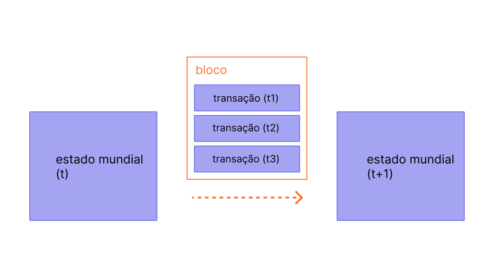

Blocos são lotes de transações com um hash do bloco anterior na cadeia. Isso liga os blocos uns aos outros (em uma cadeia) porque os hashes são derivados criptograficamente dos dados do bloco. Isso previne fraudes, porque uma alteração em qualquer bloco na história invalidaria todos os blocos seguintes, já que todos os hashes subsequentes mudariam e todos que executam a blockchain perceberiam.

## Pré-requisitos {#prerequisites}

Blocos são um tópico muito amigável para iniciantes. Mas para ajudar você a entender melhor esta página, recomendamos que leia primeiro sobre [Contas](/developers/docs/accounts/), [Transações](/developers/docs/transactions/) e nossa [introdução ao Ethereum](/developers/docs/intro-to-ethereum/).

## Por que blocos? {#why-blocks}

Para garantir que todos os participantes na rede [Ethereum](/) mantenham um estado sincronizado e concordem com o histórico preciso de transações, nós agrupamos as transações em blocos. Isso significa que dezenas (ou centenas) de transações são confirmadas, acordadas e sincronizadas todas de uma vez.

_Diagrama adaptado de [Ethereum EVM illustrated](https://takenobu-hs.github.io/downloads/ethereum_evm_illustrated.pdf)_

Ao espaçar as confirmações, damos a todos os participantes da rede tempo suficiente para chegar a um consenso: mesmo que as solicitações de transação ocorram dezenas de vezes por segundo, os blocos são criados e confirmados no Ethereum apenas uma vez a cada doze segundos.

## Como os blocos funcionam {#how-blocks-work}

Para preservar o histórico de transações, os blocos são estritamente ordenados (cada novo bloco criado contém uma referência ao seu bloco pai), e as transações dentro dos blocos também são estritamente ordenadas. Exceto em casos raros, a qualquer momento, todos os participantes da rede estão de acordo sobre o número exato e o histórico de blocos, e estão trabalhando para agrupar as solicitações de transações ativas atuais no próximo bloco.

Uma vez que um bloco é montado por um validador selecionado aleatoriamente na rede, ele é propagado para o resto da rede; todos os nós adicionam este bloco ao final de sua blockchain, e um novo validador é selecionado para criar o próximo bloco. O processo exato de montagem de blocos e o processo de confirmação/consenso são atualmente especificados pelo protocolo de “Prova de Participação (PoS)” do Ethereum.

## Protocolo de Prova de Participação (PoS) {#proof-of-stake-protocol}

A Prova de Participação (PoS) significa o seguinte:

- Os nós validadores precisam fazer stake de 32 ETH em um contrato de depósito como colateral contra mau comportamento. Isso ajuda a proteger a rede porque atividades comprovadamente desonestas levam à destruição de parte ou de todo esse stake.
- Em cada slot (espaçados por doze segundos), um validador é selecionado aleatoriamente para ser o propositor de bloco. Eles agrupam as transações, as executam e determinam um novo 'estado'. Eles empacotam essas informações em um bloco e o repassam para outros validadores.
- Outros validadores que recebem o novo bloco reexecutam as transações para garantir que concordam com a mudança proposta para o estado global. Assumindo que o bloco é válido, eles o adicionam ao seu próprio banco de dados.
- Se um validador recebe dois blocos conflitantes para o mesmo slot, ele usa seu algoritmo de escolha de bifurcação para escolher aquele apoiado pela maior quantidade de ETH em stake.

[Mais sobre a Prova de Participação (PoS)](/developers/docs/consensus-mechanisms/pos)

## O que há em um bloco? {#block-anatomy}

Há muita informação contida em um bloco. No nível mais alto, um bloco contém os seguintes campos:

| Campo            | Descrição                                           |
| :--------------- | :---------------------------------------------------- |
| `slot`           | o slot ao qual o bloco pertence                         |
| `proposer_index` | o ID do validador que está propondo o bloco           |
| `parent_root`    | o hash do bloco anterior                       |
| `state_root`     | o hash raiz do objeto de estado                     |
| `body`           | um objeto contendo vários campos, conforme definido abaixo |

O `body` do bloco contém vários campos próprios:

| Campo                | Descrição                                      |
| :------------------- | :----------------------------------------------- |
| `randao_reveal`      | um valor usado para selecionar o próximo propositor de bloco   |
| `eth1_data`          | informações sobre o contrato de depósito           |
| `graffiti`           | dados arbitrários usados para marcar blocos                |
| `proposer_slashings` | lista de validadores a sofrerem penalização                 |
| `attester_slashings` | lista de atestadores a sofrerem penalização                  |
| `attestations`       | lista de atestações feitas em relação a slots anteriores |
| `deposits`           | lista de novos depósitos no contrato de depósito     |
| `voluntary_exits`    | lista de validadores saindo da rede           |
| `sync_aggregate`     | subconjunto de validadores usados para atender clientes leves |
| `execution_payload`  | transações passadas do cliente de execução    |

O campo `attestations` contém uma lista de todas as atestações no bloco. As atestações têm seu próprio tipo de dados que contém várias informações. Cada atestação contém:

| Campo              | Descrição                                                    |
| :----------------- | :------------------------------------------------------------- |
| `aggregation_bits` | uma lista de quais validadores participaram desta atestação    |
| `data`             | um contêiner com vários subcampos                            |
| `signature`        | assinatura agregada de um conjunto de validadores em relação à parte `data` |

O campo `data` na `attestation` contém o seguinte:

| Campo               | Descrição                                                     |
| :------------------ | :-------------------------------------------------------------- |
| `slot`              | o slot ao qual a atestação se refere                             |
| `index`             | índices para os validadores atestadores                                |
| `beacon_block_root` | o hash raiz do bloco beacon visto como a cabeça da cadeia |
| `source`            | o último ponto de verificação justificado                                   |
| `target`            | o bloco de limite da época mais recente                                 |

A execução das transações no `execution_payload` atualiza o estado global. Todos os clientes reexecutam as transações no `execution_payload` para garantir que o novo estado corresponda ao do campo `state_root` do novo bloco. É assim que os clientes podem saber que um novo bloco é válido e seguro para adicionar à sua blockchain. O próprio `execution payload` é um objeto com vários campos. Há também um `execution_payload_header` que contém informações resumidas importantes sobre os dados de execução. Essas estruturas de dados são organizadas da seguinte forma:

O `execution_payload_header` contém os seguintes campos:

| Campo               | Descrição                                                         |
| :------------------ | :------------------------------------------------------------------ |
| `parent_hash`       | hash do bloco pai                                            |
| `fee_recipient`     | endereço da conta para o pagamento das taxas de transação                      |
| `state_root`        | hash raiz para o estado global após a aplicação das alterações neste bloco |
| `receipts_root`     | hash da trie de recibos de transação                               |
| `logs_bloom`        | estrutura de dados contendo logs de eventos                                |
| `prev_randao`       | valor usado na seleção aleatória de validadores                            |
| `block_number`      | o número do bloco atual                                     |
| `gas_limit`         | limite de gas permitido neste bloco                                   |
| `gas_used`          | a quantidade real de gás usada neste bloco                         |
| `timestamp`         | o tempo de bloco                                                      |
| `extra_data`        | dados adicionais arbitrários como bytes brutos                              |
| `base_fee_per_gas`  | o valor da taxa básica                                                  |
| `block_hash`        | Hash do bloco de execução                                             |
| `transactions_root` | hash raiz das transações no payload                        |
| `withdrawal_root`   | hash raiz dos saques no payload                         |

O próprio `execution_payload` contém o seguinte (note que isso é idêntico ao cabeçalho, exceto que, em vez do hash raiz das transações, ele inclui a lista real de transações e informações de saque):

| Campo              | Descrição                                                         |
| :----------------- | :------------------------------------------------------------------ |
| `parent_hash`      | hash do bloco pai                                            |
| `fee_recipient`    | endereço da conta para o pagamento das taxas de transação                      |
| `state_root`       | hash raiz para o estado global após a aplicação das alterações neste bloco |
| `receipts_root`    | hash da trie de recibos de transação                               |
| `logs_bloom`       | estrutura de dados contendo logs de eventos                                |
| `prev_randao`      | valor usado na seleção aleatória de validadores                            |
| `block_number`     | o número do bloco atual                                     |
| `gas_limit`        | limite de gas permitido neste bloco                                   |
| `gas_used`         | a quantidade real de gás usada neste bloco                         |
| `timestamp`        | o tempo de bloco                                                      |
| `extra_data`       | dados adicionais arbitrários como bytes brutos                              |
| `base_fee_per_gas` | o valor da taxa básica                                                  |
| `block_hash`       | Hash do bloco de execução                                             |
| `transactions`     | lista de transações a serem executadas                                 |
| `withdrawals`      | lista de objetos de saque                                          |

A lista `withdrawals` contém objetos `withdrawal` estruturados da seguinte maneira:

| Campo            | Descrição                        |
| :--------------- | :--------------------------------- |
| `address`        | endereço da conta que realizou o saque |
| `amount`         | valor do saque                  |
| `index`          | valor do índice de saque             |
| `validatorIndex` | valor do índice do validador              |

## Tempo de bloco {#block-time}

O tempo de bloco refere-se ao tempo que separa os blocos. No Ethereum, o tempo é dividido em unidades de doze segundos chamadas 'slots'. Em cada slot, um único validador é selecionado para propor um bloco. Assumindo que todos os validadores estejam online e totalmente funcionais, haverá um bloco em cada slot, o que significa que o tempo de bloco é de 12s. No entanto, ocasionalmente, os validadores podem estar offline quando chamados para propor um bloco, o que significa que os slots às vezes podem ficar vazios.

Essa implementação difere dos sistemas baseados em Prova de Trabalho (PoW), onde os tempos de bloco são probabilísticos e ajustados pela dificuldade de mineração alvo do protocolo. O [tempo médio de bloco](https://etherscan.io/chart/blocktime) do Ethereum é um exemplo perfeito disso, onde a transição da Prova de Trabalho (PoW) para a Prova de Participação (PoS) pode ser claramente inferida com base na consistência do novo tempo de bloco de 12s.

## Tamanho do bloco {#block-size}

Uma nota final importante é que os próprios blocos têm tamanho limitado. Cada bloco tem um tamanho alvo de 30 milhões de gás, mas o tamanho dos blocos aumentará ou diminuirá de acordo com as demandas da rede, até o limite de gas do bloco de 60 milhões (2x o tamanho alvo do bloco). O limite de gas do bloco pode ser ajustado para cima ou para baixo por um fator de 1/1024 a partir do limite de gas do bloco anterior. Como resultado, os validadores podem alterar o limite de gas do bloco por meio de consenso. A quantidade total de gás gasta por todas as transações no bloco deve ser menor que o limite de gas do bloco. Isso é importante porque garante que os blocos não possam ser arbitrariamente grandes. Se os blocos pudessem ser arbitrariamente grandes, os nós completos com menor desempenho gradualmente deixariam de conseguir acompanhar a rede devido aos requisitos de espaço e velocidade. Quanto maior o bloco, maior o poder de computação necessário para processá-los a tempo para o próximo slot. Esta é uma força centralizadora, que é combatida limitando os tamanhos dos blocos.

## Leitura adicional {#further-reading}

_Conhece um recurso da comunidade que o ajudou? Edite esta página e adicione-o!_

## Tópicos relacionados {#related-topics}

- [Transações](/developers/docs/transactions/)
- [Gás](/developers/docs/gas/)
- [Prova de Participação (PoS)](/developers/docs/consensus-mechanisms/pos)