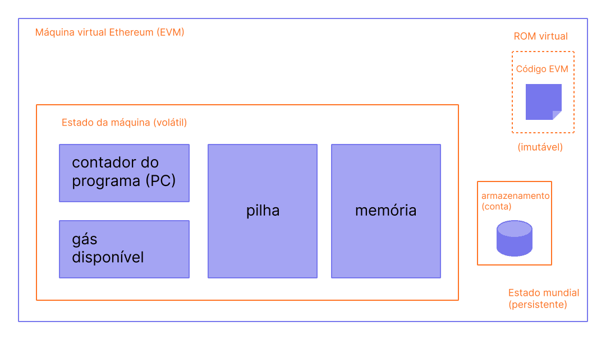

A Máquina Virtual Ethereum (EVM, em inglês) é um ambiente virtual descentralizado que executa códigos de forma consistente e segura em todos os nós do Ethereum. Os "nós" executam a EVM para executar contratos inteligentes, usando "[gas](/gas/)" para medir o esforço computacional necessário para [operações](/developers/docs/evm/opcodes/), garantindo a alocação eficiente de recursos e a segurança da rede.

## Pré-requisitos {#prerequisites}

Alguma familiaridade básica com a terminologia comum em ciência da computação, como [bytes](https://wikipedia.org/wiki/Byte), [memória](https://wikipedia.org/wiki/Computer_memory) e [pilha](https://wikipedia.org/wiki/Stack_(abstract_data_type)) é necessária para entender a EVM. Também recomendamos se familiarizar com conceitos de criptografia/cadeia de blocos, como [funções hash](https://wikipedia.org/wiki/Cryptographic_hash_function) e a [árvore Merkle](https://wikipedia.org/wiki/Merkle_tree).

## Do livro-razão para a máquina de estado {#from-ledger-to-state-machine}

A analogia de um 'livro-razão distribuído' é muitas vezes usada para descrever blockchains como o Bitcoin, que permite uma moeda descentralizada usando ferramentas fundamentais de criptografia. O livro-razão mantém um registro de atividades que deve aderir a um conjunto de regras que regem o que alguém pode e não pode fazer para modificar o livro-razão. Por exemplo, um endereço de Bitcoin não pode gastar mais Bitcoin do que o recebido previamente. Essas regras sustentam todas as transações em Bitcoin e em muitas outras blockchains.

Embora Ethereum tenha sua própria criptomoeda nativa (Ether), que segue quase exatamente as mesmas regras intuitivas, ele também permite dispor de uma função muito mais poderosa: [os contratos inteligentes](/developers/docs/smart-contracts/). Para este recurso mais complexo, uma analogia mais sofisticada é necessária. Em vez de um livro-razão distribuído, Ethereum é uma [máquina de estado distribuída](https://wikipedia.org/wiki/Finite-state_machine). O estado do Ethereum é uma grande estrutura de dados que contém não apenas todas as contas e saldos, mas também um _estado da máquina_, que pode mudar de bloco para bloco de acordo com um conjunto predefinido de regras, as quais podem executar código de máquina arbitrário. As regras específicas para mudar o estado de bloco em bloco são definidas pela EVM.

 _Diagrama adaptado do [Ethereum EVM ilustrado](https://takenobu-hs.github.io/downloads/ethereum_evm_illustrated.pdf)_

## A função de transição do estado Ethereum {#the-ethereum-state-transition-function}

A EVM se comporta como uma função matemática seria: de acordo com a entrada, ele produz uma saída determinística. Portanto, é bastante útil descrever mais formalmente o Ethereum como tendo uma **função de transição de estado**:

```
Y(S, T)= S'
```

Dado um antigo estado `(S)` e um novo conjunto de transações válidas `(T)`, a função de transição de estado de Ethereum `Y(S, T)` produz um novo estado de saída válido `S'`

### Estado {#state}

No contexto do Ethereum, o estado é uma enorme estrutura de dados chamada [árvore de Merkle Patricia modificada](/developers/docs/data-structures-and-encoding/patricia-merkle-trie/), que mantém todas as [contas](/developers/docs/accounts/) vinculadas por hashes e redutíveis a um único hash raiz armazenado na cadeia de blocos.

### Transações {#transactions}

Transações são instruções assinadas criptograficamente de contas. Existem dois tipos de transações: as que resultam em chamadas de mensagem e as que resultam na criação de contratos.

A criação do contrato resulta na criação de uma nova conta de contrato que contém o bytecode compilado do [contrato inteligente](/developers/docs/smart-contracts/anatomy/). Sempre que outra conta faz uma mensagem de chamada a esse contrato, ele executa seu bytecode.

## Instruções da EVM {#evm-instructions}

A EVM é executada como uma [máquina de pilha](https://wikipedia.org/wiki/Stack_machine) com uma profundidade de 1.024 itens. Cada item é uma palavra de 256 bits, que foi escolhida para facilitar o uso com criptografia de 256 bits (como hashes Keccak-256 ou assinaturas secp256k1).

Durante a execução, a EVM mantém uma _memória transiente_ (como um array de bytes direcionado por palavra) que não persiste entre as transações.

Os contratos, no entanto, contêm uma árvore Merkle Patricia de _armazenamento_ (como um array direcionado por palavras) associada com a conta em questão e parte do estado global.

O bytecode compilado do contrato inteligente executa como um número de [opcodes de EVM](/developers/docs/evm/opcodes), que realizam operações padrão de stake como `XOR`, `AND`, `ADD`, `SUB` etc. A EVM também implementa um número de operações de stake específicas da blockchain, como `ADDRESS`, `BALANCE`, `BLOCKHASH` etc.

 _Diagrama adaptado do [Ethereum EVM ilustrado](https://takenobu-hs.github.io/downloads/ethereum_evm_illustrated.pdf)_

## Implementações da EVM {#evm-implementations}

Todas as implementações da EVM devem aderir à especificação descrita no Ethereum Yellowpaper.

Durante o histórico de 9 anos do Ethereum, a EVM passou por várias revisões e existem várias implementações da EVM em várias linguagens de programação.

Os [clientes de execução Ethereum](/developers/docs/nodes-and-clients/#execution-clients) incluem uma implementação EVM. Além disso, existem várias implementações independentes, incluindo:

- [Py-EVM](https://github.com/ethereum/py-evm) - _Python_
- [evmone](https://github.com/ethereum/evmone) - _C++_
- [ethereumjs-vm](https://github.com/ethereumjs/ethereumjs-vm) - _JavaScript_
- [revm](https://github.com/bluealloy/revm) - _Rust_

## Leitura adicional {#further-reading}

- [Ethereum Yellowpaper](https://ethereum.github.io/yellowpaper/paper.pdf)
- [Jellopaper também conhecido como KEVM: semânticos de EVM em K](https://jellopaper.org/)
- [O Beigepaper](https://github.com/chronaeon/beigepaper)
- [Códigos de operação da EVM](https://www.ethervm.io/)
- [Referência interativa dos códigos de operação da máquina virtual Ethereum](https://www.evm.codes/)
- [Uma breve introdução à documentação do Solidy](https://docs.soliditylang.org/en/latest/introduction-to-smart-contracts.html#index-6)
- [Dominando Ethereum - A Máquina Virtual Ethereum](https://github.com/ethereumbook/ethereumbook/blob/develop/13evm.asciidoc)

## Tópicos relacionados {#related-topics}

- [Gás](/developers/docs/gas/)
