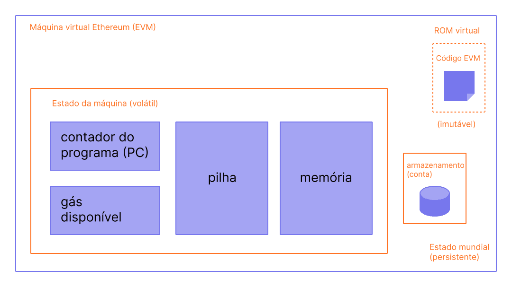

A Máquina Virtual Ethereum (EVM) é um ambiente virtual descentralizado que executa código de forma consistente e segura em todos os nós da [Ethereum](/). Os nós executam a EVM para executar contratos inteligentes, usando "[gás](/developers/docs/gas/)" para medir o esforço computacional necessário para as [operações](/developers/docs/evm/opcodes/), garantindo a alocação eficiente de recursos e a segurança da rede.

## Pré-requisitos {#prerequisites}

Alguma familiaridade básica com a terminologia comum em ciência da computação, como [bytes](https://wikipedia.org/wiki/Byte), [memória](https://wikipedia.org/wiki/Computer_memory) e uma [pilha (stack)](<https://wikipedia.org/wiki/Stack_(abstract_data_type)>) é necessária para entender a EVM. Também seria útil estar confortável com conceitos de criptografia/blockchain, como [funções de hash](https://wikipedia.org/wiki/Cryptographic_hash_function) e a [árvore de Merkle](https://wikipedia.org/wiki/Merkle_tree).

## Do livro-razão à máquina de estado {#from-ledger-to-state-machine}

A analogia de um 'livro-razão distribuído' é frequentemente usada para descrever blockchains como o Bitcoin, que permitem uma moeda descentralizada usando ferramentas fundamentais de criptografia. O livro-razão mantém um registro de atividades que deve aderir a um conjunto de regras que governam o que alguém pode e não pode fazer para modificar o livro-razão. Por exemplo, um endereço Bitcoin não pode gastar mais Bitcoin do que recebeu anteriormente. Essas regras sustentam todas as transações no Bitcoin e em muitas outras blockchains.

Embora a Ethereum tenha sua própria criptomoeda nativa (ether) que segue quase exatamente as mesmas regras intuitivas, ela também permite uma função muito mais poderosa: [contratos inteligentes](/developers/docs/smart-contracts/). Para esse recurso mais complexo, é necessária uma analogia mais sofisticada. Em vez de um livro-razão distribuído, a Ethereum é uma [máquina de estado](https://wikipedia.org/wiki/Finite-state_machine) distribuída. O estado da Ethereum é uma grande estrutura de dados que contém não apenas todas as contas e saldos, mas um _estado de máquina_, que pode mudar de bloco para bloco de acordo com um conjunto de regras predefinidas, e que pode executar código de máquina arbitrário. As regras específicas de mudança de estado de bloco para bloco são definidas pela EVM.


_Diagrama adaptado de [Ethereum EVM illustrated](https://takenobu-hs.github.io/downloads/ethereum_evm_illustrated.pdf)_

## A função de transição de estado da Ethereum {#the-ethereum-state-transition-function}

A EVM se comporta como uma função matemática: dada uma entrada, ela produz uma saída determinística. Portanto, é bastante útil descrever a Ethereum de forma mais formal como tendo uma **função de transição de estado**:

```
Y(S, T)= S'
```

Dado um estado antigo válido `(S)` e um novo conjunto de transações válidas `(T)`, a função de transição de estado da Ethereum `Y(S, T)` produz um novo estado de saída válido `S'`

### Estado {#state}

No contexto da Ethereum, o estado é uma enorme estrutura de dados chamada de [trie de Merkle Patricia modificada](/developers/docs/data-structures-and-encoding/patricia-merkle-trie/), que mantém todas as [contas](/developers/docs/accounts/) vinculadas por hashes e redutíveis a um único hash raiz armazenado na blockchain.

### Transações {#transactions}

Transações são instruções assinadas criptograficamente a partir de contas. Existem dois tipos de transações: aquelas que resultam em chamadas de mensagem e aquelas que resultam na criação de contratos.

A criação de contrato resulta na criação de uma nova conta de contrato contendo o bytecode compilado do [contrato inteligente](/developers/docs/smart-contracts/anatomy/). Sempre que outra conta faz uma chamada de mensagem para esse contrato, ele executa seu bytecode.

## Instruções da EVM {#evm-instructions}

A EVM é executada como uma [máquina de pilha (stack machine)](https://wikipedia.org/wiki/Stack_machine) com uma profundidade de 1024 itens. Cada item é uma palavra de 256 bits, que foi escolhida pela facilidade de uso com criptografia de 256 bits (como hashes Keccak-256 ou assinaturas secp256k1).

Durante a execução, a EVM mantém uma _memória_ transitória (como uma matriz de bytes endereçada por palavra), que não persiste entre as transações.

### Armazenamento transitório {#transient-storage}

O armazenamento transitório é um armazenamento de chave-valor por transação acessado por meio dos códigos de operação `TSTORE` e `TLOAD`. Ele persiste em todas as chamadas internas durante a mesma transação, mas é limpo no final da transação. Ao contrário da memória, o armazenamento transitório é modelado como parte do estado da EVM em vez do quadro de execução, mas não é confirmado no estado global. O armazenamento transitório permite o compartilhamento de estado temporário com eficiência de gás em chamadas internas durante uma transação.

### Armazenamento {#storage}

Os contratos contêm uma trie de _armazenamento_ Merkle Patricia (como uma matriz de palavras endereçável por palavra), associada à conta em questão e parte do estado global. Esse armazenamento persistente difere do armazenamento transitório, que está disponível apenas pela duração de uma única transação e não faz parte da trie de armazenamento persistente da conta.

### Códigos de operação {#opcodes}

O bytecode compilado do contrato inteligente é executado como uma série de [códigos de operação](/developers/docs/evm/opcodes) da EVM, que executam operações de pilha padrão como `XOR`, `AND`, `ADD`, `SUB`, etc. A EVM também implementa várias operações de pilha específicas de blockchain, como `ADDRESS`, `BALANCE`, `BLOCKHASH`, etc. O conjunto de códigos de operação também inclui `TSTORE` e `TLOAD`, que fornecem acesso ao armazenamento transitório.


_Diagramas adaptados de [Ethereum EVM illustrated](https://takenobu-hs.github.io/downloads/ethereum_evm_illustrated.pdf)_

## Implementações da EVM {#evm-implementations}

Todas as implementações da EVM devem aderir à especificação descrita no yellow paper da Ethereum.

Ao longo dos dez anos de história da Ethereum, a EVM passou por várias revisões e existem várias implementações da EVM em várias linguagens de programação.

Os [clientes de execução da Ethereum](/developers/docs/nodes-and-clients/#execution-clients) incluem uma implementação da EVM. Além disso, existem várias implementações independentes, incluindo:

- [Py-EVM](https://github.com/ethereum/py-evm) - _Python_
- [evmone](https://github.com/ethereum/evmone) - _C++_
- [ethereumjs-vm](https://github.com/ethereumjs/ethereumjs-vm) - _JavaScript_
- [revm](https://github.com/bluealloy/revm) - _Rust_

## Leitura adicional {#further-reading}

- [Yellow paper da Ethereum](https://ethereum.github.io/yellowpaper/paper.pdf)
- [Jellopaper, também conhecido como KEVM: Semântica da EVM em K](https://jellopaper.org/)
- [O Beigepaper](https://github.com/chronaeon/beigepaper)
- [Códigos de operação da Máquina Virtual Ethereum](https://www.ethervm.io/)
- [Referência interativa de códigos de operação da Máquina Virtual Ethereum](https://www.evm.codes/)
- [Uma breve introdução na documentação da Solidity](https://docs.soliditylang.org/en/latest/introduction-to-smart-contracts.html#index-6)
- [Mastering Ethereum - A Máquina Virtual Ethereum](https://github.com/ethereumbook/ethereumbook/blob/openedition/13evm.asciidoc)

## Tópicos relacionados {#related-topics}

- [Gás](/developers/docs/gas/)

## Tutoriais: Máquina Virtual Ethereum (EVM) / Códigos de operação na Ethereum {#tutorials}

- [Entendendo as especificações da EVM do yellow paper](/developers/tutorials/yellow-paper-evm/) _– Um passo a passo guiado da especificação formal da EVM do yellow paper da Ethereum._
- [Engenharia reversa de um contrato](/developers/tutorials/reverse-engineering-a-contract/) _– Como fazer engenharia reversa de um contrato inteligente compilado usando códigos de operação da EVM._