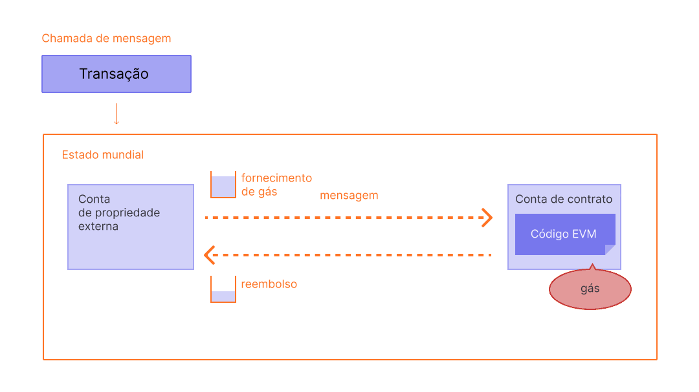

O gás é essencial para a rede Ethereum. É o combustível que permite que ele funcione, da mesma forma que um carro precisa de gasolina para funcionar.

## Pré-requisitos {#prerequisites}

Para entender melhor esta página, recomendamos que você leia primeiro sobre [transações](/developers/docs/transactions/) e [EVM](/developers/docs/evm/).

## O que é gás? {#what-is-gas}

Gás refere-se à unidade que mede a quantidade de esforço computacional necessário para executar operações específicas na rede Ethereum.

Como cada transação Ethereum requer recursos computacionais para executar, estes recursos têm de ser pagos para garantir que o Ethereum não seja vulnerável a spam e não possa ficar preso em loops computacionais infinitos. Pagamentos por computação são feitos na forma de uma taxa de gas.

A taxa de gas é **a quantia de gas usada para fazer alguma operação, multiplicada pelo custo da unidade de gas**. A taxa é paga independentemente da transação ter sucesso ou falhar.

 _Diagrama adaptado do [Ethereum EVM ilustrado](https://takenobu-hs.github.io/downloads/ethereum_evm_illustrated.pdf)_

Taxas de gas tem que ser pagas na moeda nativa do Ethereum, ether (ETH). Preços de gas são geralmente cotados em gwei, que é uma denominação do ETH. Cada gwei é igual a um bilionésimo de um ETH (0,000000001 ETH ou 10-9 ETH).

Por exemplo, em vez de dizer que seu gás custa 0.000000001 Ether, pode-se dizer que ele custa 1 Gwei.

A palavra 'gwei' é uma contração de 'giga-wei', significando 'bilhão de wei'. Um gwei é igual a um bilhão de wei. O próprio Wei (nomeado em homenagem a [Wei Dai](https://wikipedia.org/wiki/WeiDai), criador do [B-Money](https://www.investopedia.com/terms/b/bmoney.asp)) é a menor unidade de ETH.

## Como são calculadas as taxas de gás? {#how-are-gas-fees-calculated}

Você pode definir a quantidade de gás que está disposto a pagar ao enviar uma transação. Ao oferecer uma certa quantidade de gás, você está fazendo um lance para que sua transação seja incluída no próximo bloco. Se você oferecer muito pouco, é menos provável que os validadores escolham sua transação para inclusão, o que significa que sua transação pode ser executada com atraso ou simplesmente não. Se você oferecer muito, pode desperdiçar algum ETH. Então, como você pode saber quanto deve pagar?

O total de gás que você paga é dividido em dois componentes: a `base_fee` e a `priority fee` (gorjeta).

A `base_fee` é definida pelo protocolo - você tem que pagar pelo menos este valor para que sua transação seja considerada válida. A `priority fee` é uma gorjeta que você adiciona à taxa base (base fee) para tornar sua transação atrativa para os validadores, para que eles a escolham para inclusão no próximo bloco.

Uma transação que paga apenas a `base_fee` é tecnicamente válida, mas é improvável que seja incluída, porque não oferece incentivo aos validadores para a escolhê-la em detrimento de qualquer outra transação. A taxa de `priority` 'correta' é determinada pelo uso da rede no momento em que você envia sua transação - se houver muita demanda, então você pode ter que definir sua taxa de `priority` maior, mas quando há menos demanda você pode pagar menos.

Por exemplo, digamos que Jordan tem que pagar a Taylor 1 ETH. Uma transferência de ETH requer 21.000 unidades de gás e a taxa básica é de 10 gwei. João inclui uma gorjeta de 2 gwei.

A taxa total agora seria igual a:

`unidades de gás usadas * (taxa de base + taxa de prioridade)`

onde a `base_fee` é um valor definido pelo protocolo e a `priority fee` é um valor definido pelo usuário como gorjeta ao validador.

ou seja, `21.000 * (10 + 2) = 252.000 gwei` (0.000252 ETH).

Quando João enviar o dinheiro, 1,000252 ETH serão deduzidos da conta de João. Tomé receberá 1,0000 ETH. O validador recebe a gorjeta de 0,000042 ETH. A `taxa base` de 0,00021 ETH foi queimada.

### Taxa base {#base-fee}

Cada bloco tem uma taxa base que funciona como um preço de reserva. Para ser elegível para inclusão em um bloco, o preço oferecido por gás deve ser pelo menos igual à taxa base. A taxa base é calculada independentemente do bloco atual e, em vez disso, é determinada pelos blocos anteriores, tornando as taxas de transação mais previsíveis para os usuários. Quando o bloco é criado, esta **taxa base é "queimada"**, removendo-a de circulação.

A taxa base é calculada por uma fórmula que compara o tamanho do bloco anterior (a quantidade de gás utilizada para todas as transações) com o tamanho do alvo. A taxa base aumentará em um máximo de 12,5% por bloco se o tamanho do bloco de destino for excedido. Esse crescimento exponencial torna economicamente inviável que o tamanho do bloco permaneça elevado indefinidamente.

| Número do bloco | Gás incluído | Aumento de taxa | Taxa base atual |
| --------------- | ------------:| ---------------:| ---------------:|
| 1               |          15M |              0% |        100 gwei |
| 2               |          30M |              0% |        100 gwei |
| 3               |          30M |           12,5% |      112,5 gwei |
| 4               |          30M |           12,5% |      126,6 gwei |
| 5               |          30M |           12,5% |      142,4 gwei |
| 6               |          30M |           12,5% |      160,2 gwei |
| 7               |          30M |           12,5% |      180,2 gwei |
| 8               |          30M |           12,5% |      202,7 gwei |

Conforme a tabela acima, para criar uma transação no bloco número 9, uma carteira informará o usuário que a **taxa base máxima** a ser adicionada ao próximo bloco é a `taxa base atual * 112,5%` ou `202,7 gwei * 112,5% = 228,1 gwei`.

Também é importante notar que, é improvável que veremos picos prolongados de blocos completos, devido à velocidade com que a taxa base aumenta antes de um bloco completo.

| Número do bloco | Gás incluído | Aumento da taxa | Taxa base atual |
| --------------- | ------------:| ---------------:| ---------------:|
| 30              |          30M |           12,5% |     2705,6 gwei |
| ...             |          ... |           12,5% |             ... |
| 50              |          30M |           12,5% |    28531,3 gwei |
| ...             |          ... |           12,5% |             ... |
| 100             |          30M |           12,5% | 10302608,6 gwei |

### Taxa de prioridade (gorjetas) {#priority-fee}

A taxa de prioridade (gorjeta) incentiva os validadores a incluir uma transação no bloco. Sem gorjetas, os validadores achariam economicamente viável minerar blocos vazios, pois receberiam a mesma recompensa pelo bloco. Pequenas gorjetas dão aos validadores um incentivo mínimo para incluir uma transação. Para que as transações sejam executadas preferencialmente antes de outras transações no mesmo bloco, uma gorjeta maior pode ser adicionada para tentar ultrapassar as transações concorrentes.

### Taxa máxima {#maxfee}

Para executar uma transação na rede, os usuários podem especificar um limite máximo que estão dispostos a pagar para que a sua transação seja executada. Este parâmetro opcional é conhecido como `maxFeePerGas`. Para que uma transação seja executada, a taxa máxima deve exceder a soma da taxa base e da gorjeta. O remetente da transação é reembolsado pela diferença entre a taxa máxima e a soma da taxa base e da gorjeta.

### Tamanho do bloco {#block-size}

Cada bloco tem um tamanho alvo de 15 milhões de gás, mas o tamanho dos blocos aumentará ou diminuirá de acordo com a demanda da rede, até o limite do bloco de 30 milhões de gás (2x o tamanho do bloco alvo). O protocolo atinge um tamanho de bloco de equilíbrio de 15 milhões em média através do processo de _tentativa e erro_. Isso significa que se o tamanho do bloco for maior que o tamanho do bloco alvo, o protocolo aumentará a taxa base para o bloco a seguir. Da mesma forma, o protocolo diminuirá a taxa base se o tamanho do bloco for menor que o tamanho do bloco de destino. A quantidade pela qual a taxa base é ajustada é proporcional ao quão longe o tamanho do bloco atual está do alvo. [Mais sobre blocos](/developers/docs/blocks/).

### Calculando taxas de gás na prática {#calculating-fees-in-practice}

Você pode explicitamente declarar o quanto está disposto a pagar para que sua transação seja executada. No entanto, a maioria dos provedores de carteira definirá automaticamente uma taxa de transação recomendada (taxa base + taxa prioritária recomendada) para reduzir a quantidade de complexidade que pesa sobre seus usuários.

## Porque as taxas de gás existem? {#why-do-gas-fees-exist}

Em resumo, as taxas de gás ajudam a manter a rede Ethereum segura. Ao exigir uma taxa para cada cálculo executado na rede, evitamos que os maus atores enviem spam para a rede. Para evitar loops infinitos acidentais ou hostis ou outro desperdício de cálculo no código, cada transação deve definir um limite para quantas etapas de cálculo de execução de código ela pode usar. A unidade fundamental de cálculo é "gás".

Embora uma transação inclua um limite, qualquer gás não usado em uma transação é devolvido ao usuário (ou seja, `taxa máxima - (taxa base + gorjeta)` é retornada).

 _Diagrama adaptado do [Ethereum EVM ilustrado](https://takenobu-hs.github.io/downloads/ethereum_evm_illustrated.pdf)_

## Qual é o limite de gás? {#what-is-gas-limit}

O limite de gás se refere à quantidade máxima de gás que você está disposto a consumir em uma transação. Transações mais complicadas envolvendo [contratos inteligentes](/developers/docs/smart-contracts/) exigem mais trabalho de cálculo, portanto, exigem um limite de gás mais alto do que um simples pagamento. Uma transferência ETH padrão requer um limite de gás de 21.000 unidades de gás.

Por exemplo, se você colocar um limite de gás de 50.000 para uma simples transferência de ETH, a EVM consumirá 21.000 e você receberá de volta os 29.000 restantes. No entanto, se você especificar muito pouco gás, por exemplo, um limite de gás de 20.000 para uma simples transferência de ETH, a EVM consumirá suas 20.000 unidades de gás tentando cumprir a transação, mas não será concluída. A EVM então reverte quaisquer alterações, mas como o validador já fez 20 mil unidades de gás de trabalho, esse gás é consumido.

## Por que as taxas de gás são tão altas? {#why-can-gas-fees-get-so-high}

As altas taxas de gás são devidas à popularidade do Ethereum. Se houver muita demanda, os usuários devem oferecer valores mais altos de gorjeta e tentar superar as transações de outros usuários. Uma gorjeta mais alta pode aumentar a probabilidade de sua transação entrar no próximo bloco. Além disso, aplicativos de contratos inteligentes mais complexos podem estar realizando muitas operações para dar suporte a suas funções, fazendo com que consumam muito combustível.

## Iniciativas para reduzir os custos do gás {#initiatives-to-reduce-gas-costs}

As [atualizações de escalabilidade](/roadmap/) do Ethereum deverão em última análise resolver algumas das questões de taxas de gás que, por sua vez, permitirá que a plataforma processe milhares de transações por segundo e escale globalmente.

A escalabilidade da camada 2 é uma iniciativa primária para melhorar significativamente os custos do gás, a experiência do usuário e a escalabilidade. [Mais sobre a escalabilidade de camada 2](/developers/docs/scaling/#layer-2-scaling).

## Monitoramento de taxas de gás {#monitoring-gas-fees}

Se você deseja monitorar os preços do gás, para poder enviar seu ETH por menos, pode usar muitas ferramentas diferentes, como:

- [Etherscan Gas Tracker](https://etherscan.io/gastracker): _calculadora do preço do gas de uma transação_
- [Blocknative ETH Gas Estimator](https://chrome.google.com/webstore/detail/blocknative-eth-gas-estim/ablbagjepecncofimgjmdpnhnfjiecfm): _uma extensão do Chrome para estimar o preço do gás e que suporta transações do tipo 0 e do tipo 2 EIP-1559._
- [Calculadora de taxas de gás Cryptoneur](https://www.cryptoneur.xyz/gas-fees-calculator) _Calcule as taxas de gás em sua moeda local para diferentes tipos de transação na Rede principal, no Arbitrum e Polygon._

## Ferramentas relacionadas {#related-tools}

- [Gas Platform da Blocknative](https://www.blocknative.com/gas): _API para estimativas do gás desenvolvida pela plataforma global de dados mempool da Blocknative_

## Leitura adicional {#further-reading}

- [Explicação sobre o gás de Ethereum](https://defiprime.com/gas)
- [Reduzindo o consumo de gás de seus Contratos Inteligentes](https://medium.com/coinmonks/8-ways-of-reducing-the-gas-consumption-of-your-smart-contracts-9a506b339c0a)
- [Prova de participação em comparação à Prova de trabalho](https://blockgeeks.com/guides/proof-of-work-vs-proof-of-stake/)
- [Estratégias de otimização de gás para desenvolvedores](https://www.alchemy.com/overviews/solidity-gas-optimization)
- [Documentos EIP-1559](https://eips.ethereum.org/EIPS/eip-1559).
- [Recursos EIP-1559 de Tim Beiko](https://hackmd.io/@timbeiko/1559-resources).
