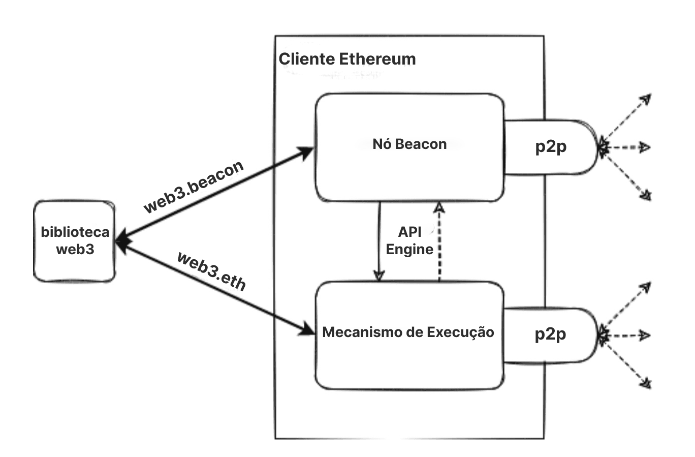
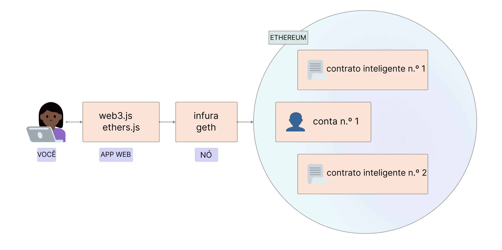

[Ethereum](/) é uma rede distribuída de computadores (conhecidos como nós) executando software que pode verificar blocos e dados de transação. O software deve ser executado no seu computador para transformá-lo em um nó do Ethereum. Existem dois softwares separados (conhecidos como 'clientes') necessários para formar um nó.

## Pré-requisitos {#prerequisites}

Você deve entender o conceito de uma rede ponto a ponto e o [básico da EVM](/developers/docs/evm/) antes de se aprofundar e executar sua própria instância de um cliente Ethereum. Dê uma olhada na nossa [introdução ao Ethereum](/developers/docs/intro-to-ethereum/).

Se você é novo no tópico de nós, recomendamos primeiro conferir nossa introdução amigável sobre [como executar um nó do Ethereum](/run-a-node).

## O que são nós e clientes? {#what-are-nodes-and-clients}

Um "nó" é qualquer instância de software cliente Ethereum que está conectada a outros computadores que também executam o software Ethereum, formando uma rede. Um cliente é uma implementação do Ethereum que verifica os dados em relação às regras do protocolo e mantém a rede segura. Um nó precisa executar dois clientes: um cliente de consenso e um cliente de execução.

- O cliente de execução (também conhecido como Mecanismo de Execução, cliente EL ou antigamente cliente Eth1) escuta novas transações transmitidas na rede, as executa na EVM e mantém o estado mais recente e o banco de dados de todos os dados atuais do Ethereum.
- O cliente de consenso (também conhecido como nó do Beacon, cliente CL ou antigamente cliente Eth2) implementa o algoritmo de consenso de Prova de Participação (PoS), que permite que a rede chegue a um acordo com base em dados validados do cliente de execução. Há também um terceiro software, conhecido como 'validador', que pode ser adicionado ao cliente de consenso, permitindo que um nó participe da segurança da rede.

Esses clientes trabalham juntos para acompanhar o topo da cadeia do Ethereum e permitir que os usuários interajam com a rede Ethereum. O design modular com vários softwares trabalhando juntos é chamado de [complexidade encapsulada](https://vitalik.eth.limo/general/2022/02/28/complexity.html). Essa abordagem facilitou a execução do [The Merge](/roadmap/merge) de forma contínua, torna o software cliente mais fácil de manter e desenvolver, e permite a reutilização de clientes individuais, por exemplo, no [ecossistema de camada 2 (l2)](/layer-2/).

Diagrama simplificado de um cliente de execução e consenso acoplados.

### Diversidade de clientes {#client-diversity}

Tanto os [clientes de execução](/developers/docs/nodes-and-clients/#execution-clients) quanto os [clientes de consenso](/developers/docs/nodes-and-clients/#consensus-clients) existem em uma variedade de linguagens de programação desenvolvidas por equipes diferentes.

Múltiplas implementações de clientes podem tornar a rede mais forte, reduzindo sua dependência de uma única base de código. O objetivo ideal é alcançar a diversidade sem que nenhum cliente domine a rede, eliminando assim um possível ponto único de falha.
A variedade de linguagens também atrai uma comunidade de desenvolvedores mais ampla e permite que eles criem integrações em sua linguagem preferida.

Saiba mais sobre a [diversidade de clientes](/developers/docs/nodes-and-clients/client-diversity/).

O que essas implementações têm em comum é que todas seguem uma única especificação. As especificações ditam como a rede e a blockchain do Ethereum funcionam. Cada detalhe técnico é definido e as especificações podem ser encontradas como:

- Originalmente, o [yellow paper do Ethereum](https://ethereum.github.io/yellowpaper/paper.pdf)
- [Especificações de execução](https://github.com/ethereum/execution-specs/)
- [Especificações de consenso](https://github.com/ethereum/consensus-specs)
- [EIPs](https://eips.ethereum.org/) implementadas em várias [atualizações da rede](/ethereum-forks/)

### Rastreando nós na rede {#network-overview}

Vários rastreadores oferecem uma visão geral em tempo real dos nós na rede Ethereum. Observe que, devido à natureza das redes descentralizadas, esses rastreadores só podem fornecer uma visão limitada da rede e podem relatar resultados diferentes.

- [Mapa de nós](https://etherscan.io/nodetracker) pelo Etherscan
- [Ethernodes](https://ethernodes.org/) pela Bitfly
- [Nodewatch](https://www.nodewatch.io/) pela Chainsafe, rastreando nós de consenso
- [Monitoreth](https://monitoreth.io/) - pela MigaLabs, uma ferramenta de monitoramento de rede distribuída
- [Relatórios Semanais de Saúde da Rede](https://probelab.io) - pelo ProbeLab, usando o [rastreador Nebula](https://github.com/dennis-tra/nebula) e outras ferramentas

## Tipos de nós {#node-types}

Se você quiser [executar seu próprio nó](/developers/docs/nodes-and-clients/run-a-node/), deve entender que existem diferentes tipos de nós que consomem dados de maneira diferente. Na verdade, os clientes podem executar três tipos diferentes de nós: leve, completo e de arquivo. Também existem opções de diferentes estratégias de sincronização que permitem um tempo de sincronização mais rápido. A sincronização refere-se à rapidez com que ele pode obter as informações mais atualizadas sobre o estado do Ethereum.

### Nó completo {#full-node}

Os nós completos fazem uma validação bloco a bloco da blockchain, incluindo o download e a verificação do corpo do bloco e dos dados de estado para cada bloco. Existem diferentes classes de nó completo - alguns começam a partir do bloco gênesis e verificam cada bloco em toda a história da blockchain. Outros iniciam sua verificação em um bloco mais recente que eles confiam ser válido (por exemplo, o 'snap sync' do Geth). Independentemente de onde a verificação começa, os nós completos mantêm apenas uma cópia local de dados relativamente recentes (normalmente os 128 blocos mais recentes), permitindo que dados mais antigos sejam excluídos para economizar espaço em disco. Dados mais antigos podem ser regenerados quando necessário.

- Armazena dados completos da blockchain (embora isso seja podado periodicamente para que um nó completo não armazene todos os dados de estado até o gênesis)
- Participa da validação de bloco, verifica todos os blocos e estados.
- Todos os estados podem ser recuperados do armazenamento local ou regenerados a partir de 'snapshots' por um nó completo.
- Serve a rede e fornece dados mediante solicitação.

### Nó de arquivo {#archive-node}

Os nós de arquivo são nós completos que verificam cada bloco desde o gênesis e nunca excluem nenhum dos dados baixados.

- Armazena tudo o que é mantido no nó completo e constrói um arquivo de estados históricos. É necessário se você quiser consultar algo como o saldo de uma conta no bloco #4.000.000, ou simplesmente testar de forma confiável seu próprio conjunto de transações sem validá-las usando rastreamento.
- Esses dados representam unidades de terabytes, o que torna os nós de arquivo menos atraentes para usuários comuns, mas podem ser úteis para serviços como exploradores de blocos, fornecedores de carteiras e análises de cadeia.

A sincronização de clientes em qualquer modo que não seja o de arquivo resultará em dados de blockchain podados. Isso significa que não há um arquivo de todos os estados históricos, mas o nó completo é capaz de construí-los sob demanda.

Saiba mais sobre [Nós de arquivo](/developers/docs/nodes-and-clients/archive-nodes).

### Nó leve {#light-node}

Em vez de baixar cada bloco, os nós leves baixam apenas os cabeçalhos dos blocos. Esses cabeçalhos contêm informações resumidas sobre o conteúdo dos blocos. Qualquer outra informação que o nó leve exija é solicitada a um nó completo. O nó leve pode então verificar independentemente os dados que recebe em relação às raízes de estado nos cabeçalhos dos blocos. Os nós leves permitem que os usuários participem da rede Ethereum sem o hardware poderoso ou a alta largura de banda necessários para executar nós completos. Eventualmente, os nós leves podem ser executados em telefones celulares ou dispositivos incorporados. Os nós leves não participam do consenso (ou seja, não podem ser validadores), mas podem acessar a blockchain do Ethereum com a mesma funcionalidade e garantias de segurança que um nó completo.

Os clientes leves são uma área de desenvolvimento ativo para o Ethereum e esperamos ver novos clientes leves para a camada de consenso e a camada de execução em breve.
Também existem rotas potenciais para fornecer dados de clientes leves pela [rede de fofocas (gossip network)](https://www.ethportal.net/). Isso é vantajoso porque a rede de fofocas poderia suportar uma rede de nós leves sem exigir que nós completos atendam às solicitações.

O Ethereum ainda não suporta uma grande população de nós leves, mas o suporte a nós leves é uma área que deve se desenvolver rapidamente no futuro próximo. Em particular, clientes como [Nimbus](https://nimbus.team/), [Helios](https://github.com/a16z/helios) e [Lodestar](https://lodestar.chainsafe.io/) estão atualmente muito focados em nós leves.

## Por que devo executar um nó do Ethereum? {#why-should-i-run-an-ethereum-node}

Executar um nó permite que você use o Ethereum de forma direta, sem necessidade de confiança e privada, ao mesmo tempo em que apoia a rede, mantendo-a mais robusta e descentralizada.

### Benefícios para você {#benefits-to-you}

Executar seu próprio nó permite que você use o Ethereum de maneira privada, autossuficiente e sem necessidade de confiança. Você não precisa confiar na rede porque pode verificar os dados você mesmo com seu cliente. "Não confie, verifique" é um mantra popular da blockchain.

- Seu nó verifica todas as transações e blocos em relação às regras de consenso por si só. Isso significa que você não precisa depender de nenhum outro nó na rede ou confiar totalmente neles.
- Você pode usar uma carteira Ethereum com seu próprio nó. Você pode usar aplicativos descentralizados (dapps) com mais segurança e privacidade porque não precisará vazar seus endereços e saldos para intermediários. Tudo pode ser verificado com seu próprio cliente. [MetaMask](https://metamask.io), [Frame](https://frame.sh/) e [muitas outras carteiras](/wallets/find-wallet/) oferecem importação de RPC, permitindo que usem seu nó.
- Você pode executar e auto-hospedar outros serviços que dependem de dados do Ethereum. Por exemplo, isso pode ser um validador da Beacon Chain, software como camada 2 (l2), infraestrutura, exploradores de blocos, processadores de pagamento, etc.
- Você pode fornecer seus próprios [endpoints RPC](/developers/docs/apis/json-rpc/) personalizados. Você poderia até oferecer esses endpoints publicamente para a comunidade para ajudá-los a evitar grandes provedores centralizados.
- Você pode se conectar ao seu nó usando **Comunicações Interprocessos (IPC)** ou reescrever o nó para carregar seu programa como um plugin. Isso garante baixa latência, o que ajuda muito, por exemplo, ao processar muitos dados usando bibliotecas Web3 ou quando você precisa substituir suas transações o mais rápido possível (ou seja, frontrunning).
- Você pode fazer staking de ETH diretamente para proteger a rede e ganhar recompensas. Veja [staking solo](/staking/solo/) para começar.

### Benefícios para a rede {#network-benefits}

Um conjunto diversificado de nós é importante para a saúde, segurança e resiliência operacional do Ethereum.

- Os nós completos aplicam as regras de consenso para que não possam ser enganados a aceitar blocos que não as seguem. Isso fornece segurança extra na rede porque, se todos os nós fossem nós leves, que não fazem verificação completa, os validadores poderiam atacar a rede.
- No caso de um ataque que supere as defesas criptoeconômicas da [Prova de Participação (PoS)](/developers/docs/consensus-mechanisms/pos/#what-is-pos), uma recuperação social pode ser realizada por nós completos escolhendo seguir a cadeia honesta.
- Mais nós na rede resultam em uma rede mais diversificada e robusta, o objetivo final da descentralização, que permite um sistema resistente à censura e confiável.
- Os nós completos fornecem acesso aos dados da blockchain para clientes leves que dependem deles. Os nós leves não armazenam toda a blockchain, em vez disso, eles verificam os dados por meio das [raízes de estado nos cabeçalhos dos blocos](/developers/docs/blocks/#block-anatomy). Eles podem solicitar mais informações aos nós completos, se precisarem.

Se você executar um nó completo, toda a rede Ethereum se beneficiará disso, mesmo que você não execute um validador.

## Executando seu próprio nó {#running-your-own-node}

Interessado em executar seu próprio cliente Ethereum?

Para uma introdução amigável para iniciantes, visite nossa página [executar um nó](/run-a-node) para saber mais.

Se você é um usuário mais técnico, mergulhe em mais detalhes e opções sobre como [iniciar seu próprio nó](/developers/docs/nodes-and-clients/run-a-node/).

## Alternativas {#alternatives}

Configurar seu próprio nó pode custar tempo e recursos, mas você nem sempre precisa executar sua própria instância. Nesse caso, você pode usar um provedor de API de terceiros. Para uma visão geral do uso desses serviços, confira [nós como serviço](/developers/docs/nodes-and-clients/nodes-as-a-service/).

Se alguém executar um nó do Ethereum com uma API pública em sua comunidade, você pode apontar suas carteiras para um nó da comunidade via RPC Personalizado e obter mais privacidade do que com algum terceiro confiável aleatório.

Por outro lado, se você executar um cliente, poderá compartilhá-lo com seus amigos que possam precisar dele.

## Clientes de execução {#execution-clients}

A comunidade Ethereum mantém vários clientes de execução de código aberto (anteriormente conhecidos como 'clientes Eth1', ou apenas 'clientes Ethereum'), desenvolvidos por equipes diferentes usando linguagens de programação diferentes. Isso torna a rede mais forte e mais [diversificada](/developers/docs/nodes-and-clients/client-diversity/). O objetivo ideal é alcançar a diversidade sem que nenhum cliente domine para reduzir quaisquer pontos únicos de falha.

Esta tabela resume os diferentes clientes. Todos eles passam por [testes de cliente](https://github.com/ethereum/tests) e são mantidos ativamente para se manterem atualizados com as atualizações da rede.

| Cliente                                                                   | Linguagem   | Sistemas operacionais     | Redes                | Estratégias de sincronização                                            | Poda de estado   |
| ------------------------------------------------------------------------ | ---------- | --------------------- | ----------------------- | ---------------------------------------------------------- | --------------- |
| [Geth](https://geth.ethereum.org/)                                       | Go         | Linux, Windows, macOS | Mainnet, Sepolia, Hoodi | [Snap](#snap-sync), [Completa](#full-sync)                     | Arquivo, Podado |
| [Nethermind](https://www.nethermind.io/)                                 | C#, .NET   | Linux, Windows, macOS | Mainnet, Sepolia, Hoodi | [Snap](#snap-sync), Rápida, [Completa](#full-sync)               | Arquivo, Podado |
| [Besu](https://besu.hyperledger.org/en/stable/)                          | Java       | Linux, Windows, macOS | Mainnet, Sepolia, Hoodi | [Snap](#snap-sync), [Rápida](#fast-sync), [Completa](#full-sync) | Arquivo, Podado |
| [Erigon](https://github.com/ledgerwatch/erigon)                          | Go         | Linux, Windows, macOS | Mainnet, Sepolia, Hoodi | [Completa](#full-sync)                                         | Arquivo, Podado |
| [Reth](https://reth.rs/)                                                 | Rust       | Linux, Windows, macOS | Mainnet, Sepolia, Hoodi | [Completa](#full-sync)                                         | Arquivo, Podado |
| [EthereumJS](https://github.com/ethereumjs/ethereumjs-monorepo) _(beta)_ | TypeScript | Linux, Windows, macOS | Sepolia, Hoodi          | [Completa](#full-sync)                                         | Podado          |

Para saber mais sobre as redes suportadas, leia sobre as [redes do Ethereum](/developers/docs/networks/).

Cada cliente tem casos de uso e vantagens exclusivos, portanto, você deve escolher um com base em suas próprias preferências. A diversidade permite que as implementações sejam focadas em diferentes recursos e públicos de usuários. Você pode querer escolher um cliente com base em recursos, suporte, linguagem de programação ou licenças.

### Besu {#besu}

O Hyperledger Besu é um cliente Ethereum de nível empresarial para redes públicas e permissionadas. Ele executa todos os recursos da Rede Principal do Ethereum (Mainnet), do rastreamento ao GraphQL, possui monitoramento extensivo e é suportado pela ConsenSys, tanto em canais abertos da comunidade quanto por meio de SLAs comerciais para empresas. É escrito em Java e licenciado sob a Apache 2.0.

A extensa [documentação](https://besu.hyperledger.org/en/stable/) do Besu o guiará por todos os detalhes sobre seus recursos e configurações.

### Erigon {#erigon}

O Erigon, anteriormente conhecido como Turbo-Geth, começou como uma bifurcação do Go Ethereum orientada para velocidade e eficiência de espaço em disco. O Erigon é uma implementação completamente rearquitetada do Ethereum, atualmente escrita em Go, mas com implementações em outras linguagens em desenvolvimento. O objetivo do Erigon é fornecer uma implementação mais rápida, mais modular e mais otimizada do Ethereum. Ele pode realizar uma sincronização completa de nó de arquivo usando cerca de 2 TB de espaço em disco, em menos de 3 dias.

### Go Ethereum {#geth}

O Go Ethereum (Geth, para abreviar) é uma das implementações originais do protocolo Ethereum. Atualmente, é o cliente mais difundido com a maior base de usuários e variedade de ferramentas para usuários e desenvolvedores. É escrito em Go, totalmente de código aberto e licenciado sob a GNU LGPL v3.

Saiba mais sobre o Geth em sua [documentação](https://geth.ethereum.org/docs).

### Nethermind {#nethermind}

O Nethermind é uma implementação do Ethereum criada com a pilha de tecnologia C# .NET, licenciada com LGPL-3.0, rodando em todas as principais plataformas, incluindo ARM. Ele oferece ótimo desempenho com:

- uma máquina virtual otimizada
- acesso ao estado
- rede e recursos ricos como painéis Prometheus/Grafana, suporte a registro corporativo seq, rastreamento JSON-RPC e plugins de análise.

O Nethermind também possui [documentação detalhada](https://docs.nethermind.io), forte suporte de desenvolvimento, uma comunidade online e suporte 24/7 disponível para usuários premium.

### Reth {#reth}

O Reth (abreviação de Rust Ethereum) é uma implementação de nó completo do Ethereum focada em ser amigável, altamente modular, rápida e eficiente. O Reth foi originalmente construído e impulsionado pela Paradigm, e é licenciado sob as licenças Apache e MIT.

O Reth está pronto para produção e é adequado para uso em ambientes de missão crítica, como staking ou serviços de alto tempo de atividade. Tem um bom desempenho em casos de uso em que é necessário alto desempenho com grandes margens, como RPC, MEV, indexação, simulações e atividades P2P.

Saiba mais conferindo o [Reth Book](https://reth.rs/) ou o [repositório do Reth no GitHub](https://github.com/paradigmxyz/reth?tab=readme-ov-file#reth).

### Em desenvolvimento {#execution-in-development}

Esses clientes ainda estão em estágios iniciais de desenvolvimento e ainda não são recomendados para uso em produção.

#### EthereumJS {#ethereumjs}

O Cliente de Execução EthereumJS (EthereumJS) é escrito em TypeScript e composto por vários pacotes, incluindo primitivas principais do Ethereum representadas pelas classes Block, Transaction e Merkle-Patricia Trie e componentes principais do cliente, incluindo uma implementação da Ethereum Virtual Machine (EVM), uma classe de blockchain e a pilha de rede devp2p.

Saiba mais sobre isso lendo sua [documentação](https://github.com/ethereumjs/ethereumjs-monorepo/tree/master)

## Clientes de consenso {#consensus-clients}

Existem vários clientes de consenso (anteriormente conhecidos como clientes 'Eth2') para dar suporte às [atualizações de consenso](/roadmap/beacon-chain/). Eles são responsáveis por toda a lógica relacionada ao consenso, incluindo o algoritmo de escolha de bifurcação, processamento de atestados e gerenciamento de recompensas e penalizações da [Prova de Participação (PoS)](/developers/docs/consensus-mechanisms/pos).

| Cliente                                                        | Linguagem   | Sistemas operacionais     | Redes                                                |
| ------------------------------------------------------------- | ---------- | --------------------- | ------------------------------------------------------- |
| [Lighthouse](https://lighthouse.sigmaprime.io/)               | Rust       | Linux, Windows, macOS | Beacon Chain, Hoodi, Pyrmont, Sepolia e mais         |
| [Lodestar](https://lodestar.chainsafe.io/)                    | TypeScript | Linux, Windows, macOS | Beacon Chain, Hoodi, Sepolia e mais                  |
| [Nimbus](https://nimbus.team/)                                | Nim        | Linux, Windows, macOS | Beacon Chain, Hoodi, Sepolia e mais                  |
| [Prysm](https://prysm.offchainlabs.com/docs/)                 | Go         | Linux, Windows, macOS | Beacon Chain, Gnosis, Hoodi, Pyrmont, Sepolia e mais |
| [Teku](https://consensys.net/knowledge-base/ethereum-2/teku/) | Java       | Linux, Windows, macOS | Beacon Chain, Gnosis, Hoodi, Sepolia e mais          |
| [Grandine](https://docs.grandine.io/)                         | Rust       | Linux, Windows, macOS | Beacon Chain, Hoodi, Sepolia e mais                  |

### Lighthouse {#lighthouse}

O Lighthouse é uma implementação de cliente de consenso escrita em Rust sob a licença Apache-2.0. É mantido pela Sigma Prime e tem sido estável e pronto para produção desde o gênesis da Beacon Chain. É utilizado por várias empresas, pools de staking e indivíduos. O objetivo é ser seguro, de alto desempenho e interoperável em uma ampla gama de ambientes, desde PCs de mesa até implantações automatizadas sofisticadas.

A documentação pode ser encontrada no [Lighthouse Book](https://lighthouse-book.sigmaprime.io/)

### Lodestar {#lodestar}

O Lodestar é uma implementação de cliente de consenso pronta para produção escrita em TypeScript sob a licença LGPL-3.0. É mantido pela ChainSafe Systems e é o mais novo dos clientes de consenso para stakers solo, desenvolvedores e pesquisadores. O Lodestar consiste em um nó do Beacon e um cliente validador alimentado por implementações em JavaScript dos protocolos Ethereum. O Lodestar visa melhorar a usabilidade do Ethereum com clientes leves, expandir a acessibilidade para um grupo maior de desenvolvedores e contribuir ainda mais para a diversidade do ecossistema.

Mais informações podem ser encontradas no [site do Lodestar](https://lodestar.chainsafe.io/)

### Nimbus {#nimbus}

O Nimbus é uma implementação de cliente de consenso escrita em Nim sob a licença Apache-2.0. É um cliente pronto para produção em uso por stakers solo e pools de staking. O Nimbus foi projetado para eficiência de recursos, facilitando a execução em dispositivos com recursos restritos e infraestrutura corporativa com igual facilidade, sem comprometer a estabilidade ou o desempenho da recompensa. Uma pegada de recursos mais leve significa que o cliente tem uma margem de segurança maior quando a rede está sob estresse.

Saiba mais na [documentação do Nimbus](https://nimbus.guide/)

### Prysm {#prysm}

O Prysm é um cliente de consenso de código aberto e completo escrito em Go sob a licença GPL-3.0. Ele apresenta uma interface de usuário de aplicativo da web opcional e prioriza a experiência do usuário, a documentação e a configurabilidade para usuários institucionais e de stake em casa.

Visite a [documentação do Prysm](https://prysm.offchainlabs.com/docs/) para saber mais.

### Teku {#teku}

O Teku é um dos clientes originais do gênesis da Beacon Chain. Juntamente com os objetivos usuais (segurança, robustez, estabilidade, usabilidade, desempenho), o Teku visa especificamente cumprir totalmente com todos os vários padrões de clientes de consenso.

O Teku oferece opções de implantação muito flexíveis. O nó do Beacon e o cliente validador podem ser executados juntos como um único processo, o que é extremamente conveniente para stakers solo, ou os nós podem ser executados separadamente para operações de staking sofisticadas. Além disso, o Teku é totalmente interoperável com o [Web3Signer](https://github.com/ConsenSys/web3signer/) para segurança de chave de assinatura e proteção contra penalização (slashing).

O Teku é escrito em Java e licenciado sob a Apache 2.0. É desenvolvido pela equipe de Protocolos da ConsenSys, que também é responsável pelo Besu e Web3Signer. Saiba mais na [documentação do Teku](https://docs.teku.consensys.net/en/latest/).

### Grandine {#grandine}

O Grandine é uma implementação de cliente de consenso, escrita em Rust sob a licença GPL-3.0. É mantido pela Grandine Core Team e é rápido, de alto desempenho e leve. Ele se adapta a uma ampla gama de stakers, desde stakers solo executando em dispositivos de poucos recursos, como o Raspberry Pi, até grandes stakers institucionais executando dezenas de milhares de validadores.

A documentação pode ser encontrada no [Grandine Book](https://docs.grandine.io/)

## Modos de sincronização {#sync-modes}

Para acompanhar e verificar os dados atuais na rede, o cliente Ethereum precisa sincronizar com o estado mais recente da rede. Isso é feito baixando dados de pares, verificando criptograficamente sua integridade e construindo um banco de dados local da blockchain.

Os modos de sincronização representam diferentes abordagens para esse processo com várias compensações. Os clientes também variam em sua implementação de algoritmos de sincronização. Sempre consulte a documentação oficial do cliente escolhido para obter detalhes sobre a implementação.

### Modos de sincronização da camada de execução {#execution-layer-sync-modes}

A camada de execução pode ser executada em diferentes modos para se adequar a diferentes casos de uso, desde a reexecução do estado mundial da blockchain até a sincronização apenas com o topo da cadeia a partir de um ponto de verificação confiável.

#### Sincronização completa {#full-sync}

Uma sincronização completa baixa todos os blocos (incluindo cabeçalhos e corpos de blocos) e regenera o estado da blockchain de forma incremental, executando cada bloco desde o gênesis.

- Minimiza a confiança e oferece a mais alta segurança verificando cada transação.
- Com um número crescente de transações, pode levar de dias a semanas para processar todas as transações.

Os [nós de arquivo](#archive-node) realizam uma sincronização completa para construir (e reter) um histórico completo das mudanças de estado feitas por cada transação em cada bloco.

#### Sincronização rápida {#fast-sync}

Como uma sincronização completa, uma sincronização rápida baixa todos os blocos (incluindo cabeçalhos, transações e recibos). No entanto, em vez de reprocessar as transações históricas, uma sincronização rápida depende dos recibos até atingir um topo recente, quando muda para a importação e processamento de blocos para fornecer um nó completo.

- Estratégia de sincronização rápida.
- Reduz a demanda de processamento em favor do uso da largura de banda.

#### Snap sync {#snap-sync}

As sincronizações snap também verificam a cadeia bloco a bloco. No entanto, em vez de começar no bloco gênesis, uma sincronização snap começa em um ponto de verificação 'confiável' mais recente que se sabe fazer parte da verdadeira blockchain. O nó salva pontos de verificação periódicos enquanto exclui dados mais antigos que uma certa idade. Esses snapshots são usados para regenerar dados de estado conforme necessário, em vez de armazená-los para sempre.

- Estratégia de sincronização mais rápida, atualmente padrão na Rede Principal do Ethereum (Mainnet).
- Economiza muito uso de disco e largura de banda de rede sem sacrificar a segurança.

[Mais sobre snap sync](https://github.com/ethereum/devp2p/blob/master/caps/snap.md).

#### Sincronização leve {#light-sync}

O modo de cliente leve baixa todos os cabeçalhos de bloco, dados de bloco e verifica alguns aleatoriamente. Sincroniza apenas o topo da cadeia a partir do ponto de verificação confiável.

- Obtém apenas o estado mais recente enquanto depende da confiança nos desenvolvedores e no mecanismo de consenso.
- Cliente pronto para uso com o estado atual da rede em alguns minutos.

**Nota:** A sincronização leve ainda não funciona com o Ethereum de Prova de Participação (PoS) - novas versões de sincronização leve devem ser lançadas em breve!

[Mais sobre clientes leves](/developers/docs/nodes-and-clients/light-clients/)

### Modos de sincronização da camada de consenso {#consensus-layer-sync-modes}

#### Sincronização otimista {#optimistic-sync}

A sincronização otimista é uma estratégia de sincronização pós-The Merge projetada para ser opcional e compatível com versões anteriores, permitindo que os nós de execução sincronizem por meio de métodos estabelecidos. O mecanismo de execução pode importar _otimisticamente_ blocos do Beacon sem verificá-los totalmente, encontrar o topo mais recente e, em seguida, começar a sincronizar a cadeia com os métodos acima. Então, depois que o cliente de execução for atualizado, ele informará o cliente de consenso sobre a validade das transações na Beacon Chain.

[Mais sobre sincronização otimista](https://github.com/ethereum/consensus-specs/blob/master/sync/optimistic.md)

#### Sincronização de ponto de verificação {#checkpoint-sync}

Uma sincronização de ponto de verificação, também conhecida como sincronização de subjetividade fraca, cria uma experiência de usuário superior para sincronizar um nó do Beacon. É baseada em premissas de confiança de [subjetividade fraca](/developers/docs/consensus-mechanisms/pos/weak-subjectivity/) que permite sincronizar a Beacon Chain a partir de um ponto de verificação de subjetividade fraca recente em vez do gênesis. As sincronizações de ponto de verificação tornam o tempo de sincronização inicial significativamente mais rápido com premissas de confiança semelhantes à sincronização a partir do [gênesis](/glossary/#genesis-block).

Na prática, isso significa que seu nó se conecta a um serviço remoto para baixar estados finalizados recentes e continua verificando os dados a partir desse ponto. O terceiro que fornece os dados é confiável e deve ser escolhido com cuidado.

Mais sobre [sincronização de ponto de verificação](https://notes.ethereum.org/@djrtwo/ws-sync-in-practice)

## Leitura adicional {#further-reading}

- [Ethereum 101 - Parte 2 - Entendendo os Nós](https://kauri.io/ethereum-101-part-2-understanding-nodes/48d5098292fd4f11b251d1b1814f0bba/a) _– Wil Barnes, 13 de fevereiro de 2019_
- [Executando Nós Completos do Ethereum: Um Guia para os Pouco Motivados](https://medium.com/@JustinMLeroux/running-ethereum-full-nodes-a-guide-for-the-barely-motivated-a8a13e7a0d31) _– Justin Leroux, 7 de novembro de 2019_

## Tópicos relacionados {#related-topics}

- [Blocos](/developers/docs/blocks/)
- [Redes](/developers/docs/networks/)

## Tutoriais relacionados {#related-tutorials}

- [Transforme seu Raspberry Pi 4 em um nó validador apenas gravando o cartão MicroSD – Guia de instalação](/developers/tutorials/run-node-raspberry-pi/) _– Grave seu Raspberry Pi 4, conecte um cabo ethernet, conecte o disco SSD e ligue o dispositivo para transformar o Raspberry Pi 4 em um nó completo do Ethereum executando a camada de execução (Mainnet) e/ou a camada de consenso (Beacon Chain / validador)._