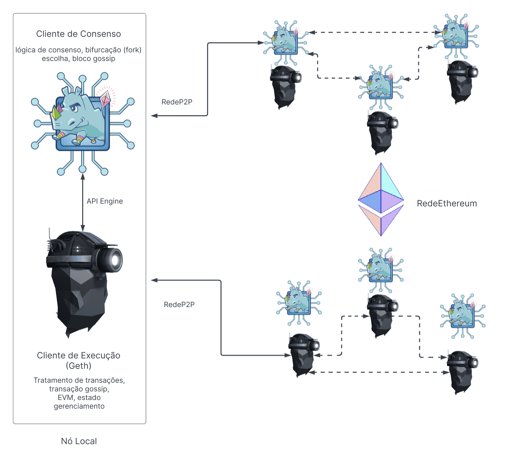

Um nó do Ethereum é composto por dois clientes: um [cliente de execução](/developers/docs/nodes-and-clients/#execution-clients) e um [cliente de consenso](/developers/docs/nodes-and-clients/#consensus-clients). Para que um nó proponha um novo bloco, ele também deve executar um [cliente validador](#validators).

Quando o Ethereum usava a [Prova de Trabalho (PoW)](/developers/docs/consensus-mechanisms/pow/), um cliente de execução era suficiente para executar um nó completo do Ethereum. No entanto, desde a implementação da [Prova de Participação (PoS)](/developers/docs/consensus-mechanisms/pos/), o cliente de execução deve ser usado junto com outro software chamado [cliente de consenso](/developers/docs/nodes-and-clients/#consensus-clients).

O diagrama abaixo mostra a relação entre os dois clientes do Ethereum. Os dois clientes se conectam às suas respectivas redes ponto a ponto (P2P). Redes P2P separadas são necessárias, pois os clientes de execução propagam transações em sua rede P2P, permitindo que gerenciem seu pool de transações local, enquanto os clientes de consenso propagam blocos em sua rede P2P, permitindo o consenso e o crescimento da cadeia.

_Existem várias opções para o cliente de execução, incluindo o Erigon, o Nethermind e o Besu_.

Para que essa estrutura de dois clientes funcione, os clientes de consenso devem passar pacotes de transações para o cliente de execução. O cliente de execução executa as transações localmente para validar que as transações não violam nenhuma regra do Ethereum e que a atualização proposta para o estado do Ethereum está correta. Quando um nó é selecionado para ser um produtor de blocos, sua instância de cliente de consenso solicita pacotes de transações do cliente de execução para incluir no novo bloco e executá-los para atualizar o estado global. O cliente de consenso controla o cliente de execução por meio de uma conexão RPC local usando a [Engine API](https://github.com/ethereum/execution-apis/blob/main/src/engine/common.md).

## O que o cliente de execução faz? {#execution-client}

O cliente de execução é responsável pela validação, manipulação e propagação de transações, juntamente com o gerenciamento de estado e o suporte à Máquina Virtual Ethereum ([EVM](/developers/docs/evm/)). Ele **não** é responsável pela construção de blocos, propagação de blocos ou manipulação da lógica de consenso. Essas tarefas são de responsabilidade do cliente de consenso.

O cliente de execução cria cargas de execução - a lista de transações, a trie de estado atualizada e outros dados relacionados à execução. Os clientes de consenso incluem a carga de execução em cada bloco. O cliente de execução também é responsável por reexecutar transações em novos blocos para garantir que sejam válidas. A execução de transações é feita no computador incorporado do cliente de execução, conhecido como [Máquina Virtual Ethereum (EVM)](/developers/docs/evm).

O cliente de execução também oferece uma interface de usuário para o Ethereum por meio de [métodos RPC](/developers/docs/apis/json-rpc) que permitem aos usuários consultar a blockchain do Ethereum, enviar transações e implantar contratos inteligentes. É comum que as chamadas RPC sejam tratadas por uma biblioteca como [Web3js](https://docs.web3js.org/), [Web3py](https://web3py.readthedocs.io/en/v5/), ou por uma interface de usuário, como uma carteira de navegador.

Em resumo, o cliente de execução é:

- um portal de usuário para o Ethereum
- o lar da Máquina Virtual Ethereum, do estado do Ethereum e do pool de transações.

## O que o cliente de consenso faz? {#consensus-client}

O cliente de consenso lida com toda a lógica que permite que um nó permaneça em sincronização com a rede Ethereum. Isso inclui receber blocos de pares e executar um algoritmo de escolha de fork para garantir que o nó sempre siga a cadeia com o maior acúmulo de atestados (ponderados pelos saldos efetivos dos validadores). Semelhante ao cliente de execução, os clientes de consenso têm sua própria rede P2P por meio da qual compartilham blocos e atestados.

O cliente de consenso não participa do atestado ou da proposta de blocos - isso é feito por um validador, um complemento opcional para um cliente de consenso. Um cliente de consenso sem um validador apenas acompanha a cabeça da cadeia, permitindo que o nó permaneça sincronizado. Isso permite que um usuário faça transações com o Ethereum usando seu cliente de execução, confiante de que está na cadeia correta.

## Validadores {#validators}

Fazer staking e executar o software validador torna um nó elegível para ser selecionado para propor um novo bloco. Os operadores de nós podem adicionar um validador aos seus clientes de consenso depositando 32 ETH no contrato de depósito. O cliente validador vem empacotado com o cliente de consenso e pode ser adicionado a um nó a qualquer momento. O validador lida com atestados e propostas de blocos. Ele também permite que um nó acumule recompensas ou perca ETH por meio de penalidades ou penalização (slashing).

[Mais sobre staking](/staking/).

## Comparação dos componentes de um nó {#node-comparison}

| Cliente de Execução                                | Cliente de Consenso                                                                                                                                       | Validador                    |
| -------------------------------------------------- | --------------------------------------------------------------------------------------------------------------------------------------------------------- | ---------------------------- |
| Propaga transações em sua rede P2P                 | Propaga blocos e atestados em sua rede P2P                                                                                                                | Propõe blocos                |
| Executa/reexecuta transações                       | Executa o algoritmo de escolha de fork                                                                                                                    | Acumula recompensas/penalidades |
| Verifica as mudanças de estado recebidas           | Acompanha a cabeça da cadeia                                                                                                                              | Faz atestados                |
| Gerencia as tries de estado e de recibos           | Gerencia o estado do Beacon (contém informações de consenso e execução)                                                                                   | Requer 32 ETH em staking     |
| Cria a carga de execução                           | Acompanha a aleatoriedade acumulada no RANDAO (um algoritmo que fornece aleatoriedade verificável para seleção de validadores e outras operações de consenso) | Pode sofrer penalização (slashing) |
| Expõe a API JSON-RPC para interagir com o Ethereum | Acompanha a justificação e a finalização                                                                                                                  |                              |

## Leitura adicional {#further-reading}

- [Prova de Participação (PoS)](/developers/docs/consensus-mechanisms/pos)
- [Proposta de bloco](/developers/docs/consensus-mechanisms/pos/block-proposal)
- [Recompensas e penalidades do validador](/developers/docs/consensus-mechanisms/pos/rewards-and-penalties)