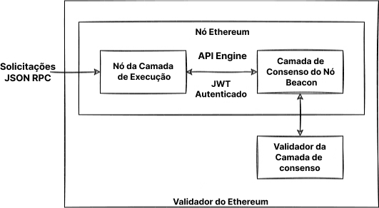

Exdcutar um nó próprio proporciona vários benefícios, abre novas possibilidades e ajuda a dar suporte ao ecossistema. Esta página vai ajudar você a iniciar seu próprio nó, para assim participar na validação das transações de Ethereum.

Observe que após [A Fusão](/roadmap/merge) (The Merge), são necessários dois clientes para executar um nó Ethereum; um cliente da **camada de execução (EL)** e um cliente da **camada de consenso (CL)**. Esta página mostrará como instalar, configurar e conectar esses dois clientes para executar um nó Ethereum.

## Pré-requisitos {#prerequisites}

Você deve entender o que é um nó Ethereum e por que é importante executar um cliente. Isso é abordado em [Nós e clientes](/developers/docs/nodes-and-clients/).

Se você é novo no tópico de executar um nó ou está procurando um caminho menos técnico, recomendamos primeiro verificar nossa introdução simplificada sobre como [executar um nó Ethereum](/run-a-node).

## Escolhendo um método {#choosing-approach}

O primeiro passo para iniciar um nó é escolher sua abordagem. Com base nos requisitos e várias possibilidades, você deve selecionar a implementação do cliente (de ambos os clientes de execução e consenso), o ambiente (hardware, sistema) e os parâmetros para as configurações do cliente.

Esta página guiará você por essas decisões e ajudará você a encontrar a maneira mais adequada para executar sua instância do Ethereum.

Para escolher entre as implementações de cliente, veja todos os [clientes de execução](/developers/docs/nodes-and-clients/#execution-clients) prontos para a Rede principal disponíveis, [clientes de consenso](/developers/docs/nodes-and-clients/#consensus-clients) e saiba mais sobre a [diversidade de clientes](/developers/docs/nodes-and-clients/client-diversity).

Decida se deseja executar o software em seu próprio [hardware ou na nuvem](#local-vs-cloud), considerando os [requisitos](#requirements) dos clientes.

Após preparar o ambiente, instale os clientes escolhidos com [interface simples para iniciantes](#automatized-setup) ou [manualmente](#manual-setup) usando um terminal com opções avançadas.

Quando o nó estiver em execução e sincronização, você estará pronto para [usá-lo](#using-the-node), mas fique de olho em sua [manutenção](#operating-the-node).



### Ambiente e hardware {#environment-and-hardware}

#### Local ou nuvem {#local-vs-cloud}

Os clientes Ethereum são capazes de executar em computadores de grau de consumo e não exigem nenhum hardware especial, como máquinas de mineração, por exemplo. Portanto, você tem várias opções para implantar o nó de acordo com suas necessidades. Para simplificar, vamos analisar como executar um nó em uma máquina física local e um servidor na nuvem:

- Nuvem
  - Os provedores oferecem alto tempo de atividade do servidor e endereços IP públicos estáticos
  - Obter um servidor dedicado ou virtual pode ser mais cômodo que desenvolver o seu próprio
  - A desvantagem está em ter que confiar em um terceiro: o servidor
  - Por causa do tamanho do armazenamento necessário para o nó completo, o preço de um servidor alugado pode ficar alto
- Hardware próprio
  - Um método mais confiável e soberano
  - Investimento único
  - Existe a opção para comprar máquinas pré-configuradas
  - Você tem que fisicamente preparar, manter e solucionar os problemas potenciais que surgirem

Ambas as opções têm vantagens e desvantagens, as quais foram resumidas acima. Caso estiver procurando uma solução para a nuvem, além de muitos provedores tradicionais de computação na nuvem, também existem serviços focados em executar nós. Confira [nós como serviço](/developers/docs/nodes-and-clients/nodes-as-a-service/) para obter mais opções de nós hospedados.

#### Hardware {#hardware}

No entanto, uma rede descentralizada que resiste à censura não deve depender de provedores na nuvem. Em vez disso, executar seu nó em seu próprio hardware local é mais saudável para o ecossistema. As [estimativas](https://www.ethernodes.org/networkType/Hosting) mostram uma grande parte dos nós executados na nuvem, o que pode se tornar um único ponto de falha.

Os clientes Ethereum podem ser executados no seu computador, laptop, servidor ou até mesmo em um computador de placa única. Enquanto for possível executar clientes em seu computador pessoal, ter um computador dedicado apenas para seu nó poderá melhorar significativamente seu desempenho e segurança, ao mesmo tempo que minimiza o impacto em seu computador principal.

O uso de seu próprio hardware pode ser muito fácil. Existem muitas opções simples, bem como configurações avançadas para pessoas mais técnicas. Então, vamos analisar os requisitos e meios para executar clientes Ethereum em seu computador.

#### Requisitos {#requirements}

Os requisitos de hardware diferem conforme o cliente, mas geralmente não são tão altos, já que o nó só precisa ser sincronizado. Não confunda isso com mineração, que requer muito mais poder de computação. No entanto, os tempos de sincronização e desempenho melhoram com hardware mais potente.

Antes de instalar qualquer cliente, verifique se o seu computador tem recursos suficientes para executá-lo. Você pode encontrar os requisitos mínimos e recomendados abaixo.

O afunilamento do seu hardware é, geralmente, o espaço em disco. Sincronizar a blockchain Ethereum é muito intensivo em termos de entrada/saída e requer muito espaço. É melhor ter uma **unidade de estado sólido (SSD)** com centenas de GBs de espaço livre para economizar, mesmo após a sincronização.

O tamanho do banco de dados e a velocidade da sincronização inicial dependem do cliente escolhido, sua configuração e [estratégia de sincronização](/developers/docs/nodes-and-clients/#sync-modes).

Verifique também se sua conexão de Internet não está limitada devido a um [limite de largura de banda](https://wikipedia.org/wiki/Data_cap). É recomendado usar uma conexão ilimitada para que a sincronização inicial e os dados transmitidos à rede possam exceder seu limite.

##### Sistema operacional

Todos os clientes dão suporte aos principais sistemas operacionais: Linux, MacOS e Windows. Isso significa que você pode executar seu nó em computadores ou servidores regulares com o sistema operacional (SO) que melhor atenda às suas necessidades. Verifique se o seu sistema operacional está atualizado para evitar possíveis problemas e vulnerabilidades de segurança.

##### Requisitos mínimos

- CPU com mais de 2 núcleos
- 8 GB de RAM
- SSD de 2 TB
- Mais de 10 MBit/s de largura de banda

##### Especificações recomendadas

- CPU rápida com mais de 4 núcleos
- Mais de 16 GB de RAM
- SSD rápido com mais de 2 TB
- Mais de 25 MBit/s de largura de banda

O modo de sincronização e o cliente que você escolher afetará os requisitos de espaço, mas estimamos o espaço em disco necessário para cada cliente abaixo.

| Cliente    | Tamanho do disco (sincronização rápida) | Tamanho do disco (arquivo completo) |
| ---------- | --------------------------------------- | ----------------------------------- |
| Geth       | + de 500 GB                             | + de 12 TB                          |
| Nethermind | + de 500 GB                             | + 12 TB                             |
| Besu       | + de 800 GB                             | + de 12 TB                          |
| Erigon     | N/D                                     | + de 2,5 TB                         |

- Observação: O Erigon não oferece sincronização rápida, mas permite a remoção completa (~ 500 GB)

Para clientes de consenso, o requisito de espaço também depende da implementação do cliente e dos recursos habilitados (por exemplo, removedor de validador), mas geralmente contam com outros 200 GB necessários para dados do beacon. Com um grande número de validadores, a carga de largura de banda também aumenta. Você pode encontrar [detalhes sobre os requisitos do cliente de consenso nesta análise](https://mirror.xyz/0x934e6B4D7eee305F8C9C42b46D6EEA09CcFd5EDc/b69LBy8p5UhcGJqUAmT22dpvdkU-Pulg2inrhoS9Mbc).

#### Soluções "Plug-and-play" {#plug-and-play}

A opção mais fácil para executar um nó com seu próprio hardware é usando ferramentas plug-and-play. Máquinas pré-configuradas de fornecedores oferecem a experiência mais direta: pedir, conectar, executar. Tudo é pré-configurado e roda automaticamente com um guia intuitivo e painel de controle para monitorar e controlar o software.

- [DappNode](https://dappnode.io/)
- [Avado](https://ava.do/)

#### Ethereum em um computador de placa única {#ethereum-on-a-single-board-computer}

Uma maneira fácil e barata de executar um nó Ethereum é usar um computador de placa única, mesmo com uma arquitetura ARM como o Raspberry Pi. O [Ethereum no ARM](https://ethereum-on-arm-documentation.readthedocs.io/en/latest/) fornece imagens fáceis de executar de múltipla execução e cliente de consenso para Raspberry Pi e outras placas ARM.

Dispositivos pequenos, acessíveis e eficientes como esses são ideais para executar um nó em casa, porém, lembre-se de seu desempenho limitado.

## Executando seu nó {#spinning-up-node}

A configuração real do cliente pode ser feita com programas automatizados ou manualmente, configurando o software do cliente diretamente.

Para usuários menos avançados, a abordagem recomendada é usar um programa, ou seja, um software que orienta você durante a instalação e automatiza o processo de configuração do cliente. No entanto, se você tiver alguma experiência em usar um terminal, as etapas da configuração manual deverão ser simples de seguir.

### Guia de configuração {#automatized-setup}

Vários projetos de fácil utilização visam melhorar a experiência de configuração de um cliente. Esses programas fornecem instalação e configuração automáticas de cliente, com alguns até oferecendo uma interface gráfica para configuração guiada e monitoramento de clientes.

Abaixo estão alguns projetos que podem ajudar você a instalar e controlar clientes com apenas alguns cliques:

- [DappNode](https://docs.dappnode.io/user/quick-start/first-steps/) — O DappNode não vem apenas com o computador de um fornecedor. O software, o verdadeiro inicializador de nós e o centro de controle com muitos recursos podem ser usados em hardwares aleatórios.
- [eth-docker](https://eth-docker.net/) — Configuração automatizada usando o Docker, focada em participação (staking) fácil e segura. Requer conhecimento básico de terminal e Docker, sendo recomendada para usuários um pouco mais avançados.
- [Stereum](https://stereum.net/ethereum-node-setup/) — Inicializador para instalar clientes em um servidor remoto via conexão SSH com um guia de configuração GUI, centro de controle e muitos outros recursos.
- [NiceNode](https://www.nicenode.xyz/) — Programa com uma experiência de usuário simples para executar um nó em seu computador. Basta escolher os clientes e iniciá-los em alguns cliques. Ainda em desenvolvimento.
- [Sedge](https://docs.sedge.nethermind.io/docs/intro) — Ferramenta de configuração de nós que gera automaticamente uma configuração do Docker usando o assistente da CLI. Escrito em Go pela Nethermind.

### Configuração manual do cliente {#manual-setup}

A outra opção é baixar, verificar e configurar o software cliente manualmente. Mesmo que alguns clientes ofereçam uma interface gráfica, uma configuração manual ainda requer habilidades básicas com o terminal, mas oferece muito mais versatilidade.

Conforme explicado anteriormente, configurar seu próprio nó Ethereum exigirá executar um par de clientes de consenso e execução. Alguns clientes podem incluir um cliente leve de outro tipo e sincronizar sem a necessidade de qualquer outro software. No entanto, a verificação sem confiança completa requer as duas implementações.

#### Obtendo o software do cliente {#getting-the-client}

Primeiro, você precisa obter o software do [cliente de execução](/developers/docs/nodes-and-clients/#execution-clients) e do [cliente de consenso](/developers/docs/nodes-and-clients/#consensus-clients) de sua preferência.

Você pode simplesmente baixar um aplicativo executável ou um pacote de instalação que se adapte ao seu sistema operacional e à sua arquitetura. Sempre verifique as assinaturas e as somas de verificação dos pacotes baixados. Alguns clientes também oferecem repositórios ou imagens do Docker para instalação e atualizações mais fáceis. Todos os clientes são de código aberto, portanto, você também pode construí-los a partir do código-fonte. Esse método é mais avançado, mas, em alguns casos, pode ser necessário.

As instruções para instalar cada cliente são fornecidas na documentação associada às listas de clientes acima.

Aqui estão as páginas de lançamento dos clientes, nas quais você pode encontrar seus binários pré-compilados ou instruções sobre instalação:

##### Clientes de execução

- [Besu](https://github.com/hyperledger/besu/releases)
- [Erigon](https://github.com/ledgerwatch/erigon/releases)
- [Geth](https://geth.ethereum.org/downloads/)
- [Nethermind](https://downloads.nethermind.io/)

Também é relevante observar que a diversidade de clientes é um [problema na camada de execução](/developers/docs/nodes-and-clients/client-diversity/#execution-layer). Recomenda-se que os leitores considerem a execução de um cliente de execução minoritário.

##### Clientes de consenso

- [Lighthouse](https://github.com/sigp/lighthouse/releases/latest)
- [Lodestar](https://chainsafe.github.io/lodestar/install/source/) (não fornece um binário pré-compilado, apenas uma imagem do Docker ou para ser compilado a partir da fonte)
- [Nimbus](https://github.com/status-im/nimbus-eth2/releases/latest)
- [Prysm](https://github.com/prysmaticlabs/prysm/releases/latest)
- [Teku](https://github.com/ConsenSys/teku/releases)

A [diversidade de clientes](/developers/docs/nodes-and-clients/client-diversity/) é fundamental para nós de consenso executando validadores. Se a maioria dos validadores está executando a implementação de um único cliente, a segurança da rede está em risco. Portanto, é recomendável considerar a escolha de um cliente minoritário.

[Veja o uso mais recente do cliente de rede](https://clientdiversity.org/) e saiba mais sobre a [diversidade de clientes](/developers/docs/nodes-and-clients/client-diversity).

##### Verificando o software

Ao baixar o software da Internet, é recomendável verificar sua integridade. Essa etapa é opcional, mas, especialmente com uma parte de infraestrutura crucial como o cliente Ethereum, é importante estar ciente dos possíveis vetores de ataque e evitá-los. Se você baixou um binário pré-compilado, você precisa confiar nele e correr o risco de um invasor substituir o executável por um malicioso.

Os desenvolvedores assinam binários lançados com suas chaves PGP para que você possa verificar criptograficamente se está executando exatamente o software que eles criaram. Você só precisa obter as chaves públicas usadas pelos desenvolvedores, que podem ser encontradas nas páginas de lançamento do cliente ou na documentação. Após baixar a versão do cliente e sua assinatura, você pode usar uma implementação PGP, por exemplo, [GnuPG](https://gnupg.org/download/index.html) para verificá-los facilmente. Confira um tutorial sobre como verificar software de código aberto usando `GPG` no [Linux](https://www.tecmint.com/verify-pgp-signature-downloaded-software/) ou [Windows/MacOS](https://freedom.press/training/verifying-open-source-software/).

Outra forma de verificação é garantir que o hash, uma impressão digital criptográfica exclusiva do software que você baixou, corresponde ao fornecido pelos desenvolvedores. Isso é ainda mais fácil do que usar o PGP, e alguns clientes oferecem apenas essa opção. Basta executar a função de hash no software baixado e compará-lo com o da página de lançamento. Por exemplo:

```
sha256sum teku-22.6.1.tar.gz

9b2f8c1f8d4dab0404ce70ea314ff4b3c77e9d27aff9d1e4c1933a5439767dde
```

#### Configuração do cliente {#client-setup}

Depois de instalar, baixar ou compilar o software cliente, você estará pronto para executá-lo. Isso só significa que ele tem de ser executado com a configuração adequada. Os clientes oferecem opções de configuração variadas, que podem habilitar vários recursos.

Vamos começar com opções que podem influenciar significativamente o desempenho do cliente e o uso de dados. Os [modos de sincronização](/developers/docs/nodes-and-clients/#sync-modes) representam diferentes métodos de download e validação de dados da blockchain. Antes de iniciar o nó, você deve decidir que rede e modo de sincronização deve ser usado. As coisas mais importantes a considerar são o espaço em disco e o tempo de sincronização de que o cliente precisará. Preste atenção nos documentos do cliente para determinar qual modo de sincronização é o padrão. Se não for adequado para você, escolha outro com base no nível de segurança, nos dados disponíveis e no custo. Além do algoritmo de sincronização, você também pode definir a remoção de diferentes tipos de dados antigos. A limpeza habilita a exclusão de dados desatualizados, por exemplo, a remoção de nós de árvore de estado inacessíveis em blocos recentes.

Outras opções básicas de configuração são, por exemplo, escolher uma rede, Mainnet (Rede principal) ou redes de teste, habilitando o ponto de extremidade HTTP para RPC ou WebSockets, etc. Você pode encontrar todos os recursos e opções na documentação do cliente. Várias configurações de cliente podem ser definidas executando o cliente com os marcadores correspondentes diretamente na CLI ou no arquivo de configuração. Cada cliente é um pouco diferente, por isso, sempre consulte a documentação oficial ou a página de ajuda do cliente para obter detalhes sobre as opções de configuração.

Para fins de teste, você pode preferir executar um cliente em uma das redes de testes. [Veja a visão geral das redes suportadas](/developers/docs/nodes-and-clients/#execution-clients).

Exemplos de execução de clientes de execução com configuração básica podem ser encontrados na próxima seção.

#### Iniciando a execução do cliente {#starting-the-execution-client}

Antes de iniciar o software cliente do Ethereum, faça uma última verificação para ter certeza de que seu ambiente está pronto. Por exemplo, verifique se:

- Há espaço em disco suficiente, considerando a rede escolhida e o modo de sincronização.
- A memória e a CPU não são interrompidas por outros programas.
- O sistema operacional é atualizado para a versão mais recente.
- O sistema tem a hora e a data corretas.
- Seu roteador e seu firewall aceitam conexões nas portas de escuta. Por padrão, os clientes do Ethereum usam uma porta de escuta (TCP) e uma porta de descoberta (UDP), ambas na porta 30303 por padrão.

Execute seu cliente primeiro em uma rede de testes para garantir que tudo esteja funcionando corretamente.

Ao iniciar, você precisa declarar alguma configuração de cliente que não seja a padrão. Você pode usar sinalizadores ou o arquivo de configuração para declarar sua configuração preferida. O conjunto de recursos e a sintaxe de configuração de cada cliente diferem. Confira a documentação do seu cliente para ver as especificações.

Os clientes de execução e consenso se comunicam por meio de um terminal autenticado especificado na [API Engine](https://github.com/ethereum/execution-apis/tree/main/src/engine). Para se conectar a um cliente de consenso, o cliente de execução deve gerar um [`jwtsecret`](https://jwt.io/) em um caminho conhecido. Por razões de segurança e estabilidade, os clientes devem ser executados no mesmo computador e ambos os clientes devem conhecer esse caminho, pois ele é usado para autenticar uma conexão RPC local entre eles. O cliente de execução também deve definir uma porta de escuta para APIs autenticadas.

Esse token é gerado automaticamente pelo software cliente, mas, em alguns casos, talvez você precise fazer isso sozinho. Você pode gerá-lo usando o [OpenSSL](https://www.openssl.org/):

```
openssl rand -hex 32 > jwtsecret
```

#### Iniciando a execução do cliente {#running-an-execution-client}

Esta seção guiará você na inicialização dos clientes de execução. Ela serve apenas como exemplo de configuração básica, que iniciará o cliente com estas configurações:

- Especifica a rede à qual se conectar, a rede principal nos nossos exemplos
  - Em vez disso, você pode escolher [uma das redes de teste](/developers/docs/networks/) para fazer um teste preliminar da sua configuração
- Define o diretório de dados, no qual todos os dados, incluindo a blockchain, serão armazenados
  - Certifique-se de substituir o caminho por um real, por exemplo, apontando para sua unidade externa
- Habilita interfaces para comunicação com o cliente
  - Incluindo o RPC JSON e a API Engine para comunicação com o cliente de consenso
- Define o caminho até `jwtsecret` para a API autenticada
  - Certifique-se de substituir o caminho de exemplo por um real que possa ser acessado pelos clientes, por exemplo, `/tmp/jwtsecret`

Lembre-se de que este é apenas um exemplo básico, todas as outras configurações serão definidas como padrão. Preste atenção na documentação de cada cliente para saber mais sobre valores padrão, configurações e recursos. Para mais recursos, por exemplo, para executar validadores, monitoramento, etc., consulte a documentação específica do cliente.

> Observe que as barras invertidas `\` nos exemplos são apenas para fins de formatação; marcadores de configuração podem ser definidos em uma única linha.

##### Executando o Besu

Este exemplo inicia o Besu na rede principal, armazena dados da cadeia de blocos no formato padrão em `/data/ethereum`, habilita o RPC JSON e o RPC Engine para conectar o cliente de consenso. A API Engine é autenticada com o token `jwtsecret` e somente chamadas de `localhost` são permitidas.

```
besu --network=mainnet \
    --data-path=/data/ethereum \
    --rpc-http-enabled=true \
    --engine-rpc-enabled=true \
    --engine-host-allowlist="*" \
    --engine-jwt-enabled=true \
    --engine-jwt-secret=/path/to/jwtsecret
```

O Besu também vem com uma opção de inicializador, que fará uma série de perguntas e gerará o arquivo de configuração. Execute o inicializador interativo usando:

```
besu --Xlauncher
```

A [documentação do Besu](https://besu.hyperledger.org/en/latest/HowTo/Get-Started/Starting-node/) contém opções adicionais e detalhes de configuração.

##### Executando o Erigon

Este exemplo inicia o Erigon na rede principal, armazena dados da blockchain em `/data/ethereum`, habilita o RPC JSON, define quais namespaces são permitidos e habilita a autenticação para conectar o cliente de consenso, definido pelo caminho `jwtsecret`.

```
erigon --chain mainnet \
    --datadir /data/ethereum \
    --http --http.api=engine,eth,web3,net \
    --authrpc.jwtsecret=/path/to/jwtsecret
```

O Erigon, por padrão, executa uma sincronização completa com um HDD de 8 GB, que resultará em mais de 2 TB de dados de arquivo. Verifique se o `datadir` está apontando para o disco com espaço livre suficiente ou olha para o sinalizador `--prune`, que pode ajustar diferentes tipos de dados. Verifique o `--help` do Erigon para saber mais.

##### Executando o Geth

Este exemplo inicia o Geth na rede principal, armazena os dados da cadeia de blocos em `/data/ethereum`, habilita o RPC JSON e define quais namespaces são permitidos. Ele também habilita a autenticação para conectar o cliente de consenso, que requer o caminho para `jwtsecret` e também a opção que define quais conexões são permitidas, em nosso exemplo apenas no `localhost`.

```
geth --mainnet \
    --datadir "/data/ethereum" \
    --http --authrpc.addr localhost \
    --authrpc.vhosts="localhost" \
    --authrpc.port 8551
    --authrpc.jwtsecret=/path/to/jwtsecret
```

Confira a [documentação para todas as opções de configuração](https://geth.ethereum.org/docs/fundamentals/command-line-options) e saiba mais sobre [como executar Geth com um cliente de consenso](https://geth.ethereum.org/docs/getting-started/consensus-clients).

##### Executando o Nethermind

O Nethermind oferece várias [opções de instalação](https://docs.nethermind.io/nethermind/first-steps-with-nethermind/getting-started). O pacote vem com vários binários, incluindo um Inicializador com configuração guiada, que ajudará você a criar a configuração interativamente. Como alternativa, você encontrará o Executor, que é o executável em si, que simplesmente pode ser executado com os sinalizadores de configuração. O RPC JSON é habilitado por padrão.

```
Nethermind.Runner --config mainnet \
    --datadir /data/ethereum \
    --JsonRpc.JwtSecretFile=/path/to/jwtsecret
```

Os documentos do Nethermind oferecem um [guia completo](https://docs.nethermind.io/nethermind/first-steps-with-nethermind/running-nethermind-post-merge) sobre como executar o Nethermind com o cliente de consenso.

Um cliente de execução iniciará suas funções principais, pontos de extremidade escolhidos e começará a procurar por pares. Após conseguir descobrir os pares, o cliente inicia a sincronização. O cliente de execução aguardará uma conexão do cliente de consenso. Os dados atuais da cadeia de blocos estarão disponíveis assim que o cliente for sincronizado com sucesso com o estado atual.

#### Iniciando um cliente de consenso {#starting-the-consensus-client}

O cliente de consenso deve ser iniciado com a configuração de porta correta para estabelecer uma conexão RPC local com o cliente de execução. Os clientes de consenso têm de ser executados com a porta do cliente de execução exposta como argumento de configuração.

O cliente de consenso também precisa do caminho para o `jwt-secret` do cliente de execução para autenticar a conexão RPC entre eles. Semelhante aos exemplos de execução acima, cada cliente de consenso tem um parâmetro de configuração que usa o caminho do arquivo do token jwt como argumento. Isso deve ser consistente com o caminho `jwtsecret` fornecido ao cliente de execução.

Se você planeja executar um validador, certifique-se de adicionar um marcador de configuração especificando o endereço Ethereum do destinatário da taxa. É aí que as recompensas do ether para o validador se acumulam. Cada cliente de consenso tem uma opção, por exemplo, `--suggested-fee-recipient=0xabcd1`, que recebe um endereço Ethereum como argumento.

Ao iniciar um Beacon Node em uma rede de testes, você pode economizar um tempo de sincronização significativo usando um ponto de extremidade público para [sincronização de ponto de verificação](https://notes.ethereum.org/@launchpad/checkpoint-sync).

#### Executando um cliente de consenso

##### Executando o Lighthouse

Antes de executar o Lighthouse, saiba mais sobre como instalá-lo e configurá-lo na [Documentação do Lighthouse](https://lighthouse-book.sigmaprime.io/installation.html).

```
lighthouse beacon_node \
    --network mainnet \
    --datadir /data/ethereum \
    --http \
    --execution-endpoint http://127.0.0.1:8551 \
    --execution-jwt /path/to/jwtsecret
```

##### Executando o Lodestar

Instale o software Lodestar compilando-o ou baixando a imagem do Docker. Saiba mais na [documentação](https://chainsafe.github.io/lodestar/) e no [guia de configuração](https://hackmd.io/@philknows/rk5cDvKmK) mais abrangente.

```
lodestar beacon \
    --rootDir="/data/ethereum" \
    --network=mainnet \
    --eth1.enabled=true \
    --execution.urls="http://127.0.1:8551" \
    --jwt-secret="/path/to/jwtsecret"
```

##### Executando o Nimbus

O Nimbus vem com ambos os clientes de consenso e de execução. Ele pode ser executado em vários dispositivos, até mesmo com um poder de computação bem modesto. Após [instalar as dependências e o próprio Nimbus](https://nimbus.guide/quick-start.html), você pode executar seu cliente de consenso:

```
nimbus_beacon_node \
    --network=mainnet \
    --web3-url=http://127.0.0.1:8551 \
    --rest \
    --jwt-secret="/path/to/jwtsecret"
```

##### Executando o Prysm

O Prysm vem com um script que permite uma instalação automática fácil. Os detalhes podem ser encontrados na [documentação do Prysm](https://docs.prylabs.network/docs/install/install-with-script).

```
./prysm.sh beacon-chain \
    --mainnet \
    --datadir /data/ethereum  \
    --execution-endpoint=http://localhost:8551  \
    --jwt-secret=/path/to/jwtsecret
```

##### Executando o Teku

```
teku --network mainnet \
    --data-path "/data/ethereum" \
    --ee-endpoint http://localhost:8551 \
    --ee-jwt-secret-file "/path/to/jwtsecret"
```

Quando um cliente de consenso se conecta ao cliente de execução para ler o contrato de depósito e identificar validadores, ele também se conecta a outros pares do Beacon Node e começa a sincronizar os slots de consenso da origem. Quando o Beacon Node atinge a época atual, a API Beacon se torna utilizável para seus validadores. Saiba mais sobre [APIs do Beacon Node](https://eth2docs.vercel.app/).

### Adicionando validadores {#adding-validators}

Um cliente de consenso serve como um Beacon Node para os validadores se conectarem. Cada cliente de consenso tem seu próprio software de validador descrito em detalhes em sua respectiva documentação.

Executar seu próprio validador permite a [participação individual](/staking/solo/), o método mais impactante e não confiável para dar suporte à rede Ethereum. No entanto, isso requer um depósito de 32 ETH. Para executar um validador em seu próprio nó com uma quantidade menor, um pool descentralizado com operadores de nós sem permissão, como [Rocket Pool](https://rocketpool.net/node-operators), poderá ser interessante.

A maneira mais fácil de começar com a participação e a geração de chaves de validação é usar a [Plataforma de lançamento de participação da rede de testes Goerli](https://goerli.launchpad.ethereum.org/), que permite testar sua configuração [executando nós no Goerli](https://notes.ethereum.org/@launchpad/goerli). Quando você estiver pronto para a Mainnet (Rede principal), você poderá repetir essas etapas usando a [Plataforma de lançamento de participação da Mainnet](https://launchpad.ethereum.org/).

Consulte a [página de staking (participação)](/staking) para obter uma visão geral sobre as opções de participação.

### Usando o nó {#using-the-node}

Os clientes de execução oferecem [pontos de extremidade da API RPC](/developers/docs/apis/json-rpc/) que você pode usar para enviar transações, interagir ou implantar contratos inteligentes na rede Ethereum de várias maneiras:

- Chamando-os manualmente com um protocolo adequado (por exemplo, usando `curl`)
- Anexando um console (por exemplo, `geth attach`)
- Implementá-los em aplicações usando bibliotecas da Web3, por exemplo, [web3.py](https://web3py.readthedocs.io/en/stable/overview.html#overview), [ethers](https://github.com/ethers-io/ethers.js/)

Diferentes clientes têm diferentes implementações dos pontos de extremidade RPC. Porém, existe um JSON-RPC padrão que você pode usar com cada cliente. Para obter uma visão geral, [leia a documentação sobre JSON-RPC](/developers/docs/apis/json-rpc/). Os aplicativos que precisam de informações da rede Ethereum podem usar esse RPC. Por exemplo, a popular carteira MetaMask permite que você [se conecte ao seu próprio ponto de extremidade RPC](https://metamask.zendesk.com/hc/en-us/articles/360015290012-Using-a-Local-Node), que conta com grandes benefícios de privacidade e segurança.

Todos os clientes de consenso expõem uma [API Beacon](https://ethereum.github.io/beacon-APIs), que pode ser usada para verificar o status do cliente de consenso ou baixar blocos e dados de consenso enviando solicitações usando ferramentas como [Curl](https://curl.se). Mais informações sobre isso podem ser encontradas na documentação de cada cliente de consenso.

#### Comunicação com o RPC {#reaching-rpc}

A porta padrão para o cliente de execução JSON-RPC é `8545`, mas você pode modificar as portas dos pontos de extremidade locais na configuração. Por padrão, a interface RPC só pode ser acessada no host local do seu computador. Para torná-lo acessível remotamente, você pode expô-lo ao público alterando o endereço para `0.0.0.0`. Isso o tornará acessível pela rede local e endereços IP públicos. Na maioria dos casos, você também precisará configurar o encaminhamento de porta no seu roteador.

Tenha cuidado ao expor as portas à Internet, pois isso permitirá que qualquer pessoa na Internet controle seu nó. Atores maliciosos poderão acessar seu nó para derrubar seu sistema ou roubar seus fundos se você estiver usando seu cliente como uma carteira.

Uma forma de contornar isso é evitar que métodos RPC potencialmente nocivos sejam modificáveis. Por exemplo, com o Geth, você pode declarar métodos modificáveis com um sinalizador: `--http.api web3,eth,txpool`.

O acesso à interface RPC pode ser estendido por meio do desenvolvimento de APIs da camada de borda ou aplicativos de servidor Web, como o Nginx, e conectando-os ao endereço e porta locais do seu cliente. A utilização de uma camada intermediária também pode permitir que os desenvolvedores configurem um certificado para conexões `https` seguras na interface RPC.

Configurar um servidor Web, um proxy ou uma API Rest externa não é a única maneira de fornecer acesso ao ponto de extremidade RPC do seu nó. Outra maneira de preservar a privacidade para configurar um ponto de extremidade publicamente acessível é hospedar o nó em seu próprio serviço onion da rede [Tor](https://www.torproject.org/). Isso permitirá que você se comunique com o RPC fora da sua rede local sem um endereço público estático de IP ou portas abertas. No entanto, usar essa configuração só permitirá que o ponto de extremidade RPC seja acessível pela da rede Tor, que não é suportada por todos os aplicativos e poderá resultar em problemas de conexão.

Para fazer isso, você precisa criar seu próprio [serviço onion](https://community.torproject.org/onion-services/). Confira [a documentação](https://community.torproject.org/onion-services/setup/) sobre a configuração do serviço onion para hospedar o seu próprio serviço. Você pode direcioná-lo para um servidor Web com proxy para a porta RPC ou apenas diretamente para o RPC.

Por fim, e uma das formas mais populares de fornecer acesso a redes internas, é por meio de uma conexão VPN. Dependendo do seu caso de uso e da quantidade de usuários que precisam de acesso ao seu nó, uma conexão VPN segura pode ser uma opção. [OpenVPN](https://openvpn.net/) é uma VPN SSL completa que implementa a extensão de rede segura da camada OSI 2 ou 3 usando o protocolo SSL/TLS padrão da indústria, dá suporte a métodos flexíveis de autenticação de cliente com base em certificados, cartões inteligentes e/ou credenciais de usuário/senha e permite políticas de controle de acesso específicas de usuário ou grupo usando regras de firewall aplicadas à interface virtual VPN.

### Operando o nó {#operating-the-node}

Você deve monitorar regularmente seu nó para garantir que ele esteja funcionando corretamente. Talvez seja necessário realizar manutenções ocasionais.

#### Mantendo o nó online {#keeping-node-online}

Seu nó não precisa estar online o tempo todo, mas você deve mantê-lo online o máximo possível para mantê-lo sincronizado com a rede. Você pode desligá-lo para reiniciá-lo, mas lembre-se de que:

- O encerramento pode levar alguns minutos se o estado recente ainda estiver sendo gravado no disco.
- Encerramentos forçados podem danificar o banco de dados, exigindo que você ressincronize todo o nó.
- Seu cliente ficará dessincronizado com a rede e precisará ser ressincronizado quando você o reiniciar. Embora o nó possa começar a sincronizar a partir do ponto do último encerramento, o processo pode demorar dependendo de quanto tempo ele esteve offline.

_Isso não se aplica a nós validadores da camada de consenso._ Colocar seu nó offline afetará todos os serviços dependentes dele. Se você estiver rodando um nó para fins de _staking (participação)_, você deve tentar minimizar o tempo de inatividade tanto quanto possível.

#### Criando serviços de clientes {#creating-client-services}

Considere criar um serviço para executar seus clientes automaticamente na inicialização. Por exemplo, em servidores Linux, a boa prática seria criar um serviço, por exemplo, com `systemd`, que executa o cliente com a configuração adequada em um usuário com privilégios limitados, e reiniciar automaticamente.

#### Atualizando clientes {#updating-clients}

Você precisa manter seu software cliente atualizado com os patches de segurança, recursos e [EIPs](/eips/) mais recentes. Sobretudo antes das [bifurcações permanentes](/history/), verifique se você está executando as versões corretas do cliente.

> Antes de atualizações importantes da rede, a EF publica uma postagem em seu [blog](https://blog.ethereum.org). Você pode [assinar esses anúncios](https://groups.google.com/a/ethereum.org/g/announcements) para receber uma notificação no seu e-mail quando o seu nó precisar de uma atualização.

Atualizar clientes é muito simples. Cada cliente tem instruções específicas em sua documentação, mas o processo geralmente é apenas baixar a versão mais recente e reiniciar o cliente com o novo executável. O cliente deve continuar de onde parou, mas com as atualizações aplicadas.

Cada implementação de cliente tem uma cadeia de caracteres de versão legível por humanos usada no protocolo ponto a ponto, mas também é acessível a partir da linha de comando. Essa cadeia de caracteres de versão permite que os usuários verifiquem se estão executando a versão correta e possibilita exploradores de blocos e outras ferramentas analíticas interessadas em quantificar a distribuição de clientes específicos na rede. Consulte a documentação de cada cliente para obter mais informações sobre cadeias de caracteres de versão.

#### Executando serviços adicionais {#running-additional-services}

Executar seu próprio nó permite que você use serviços que exigem acesso direto ao cliente RPC do Ethereum. Estes são serviços construídos em cima do Ethereum, como [soluções de camada 2](/developers/docs/scaling/#layer-2-scaling), back-end para carteiras, exploradores de blocos, ferramentas de desenvolvimento e outras infraestruturas do Ethereum.

#### Monitorando o nó {#monitoring-the-node}

Para monitorar seu nó corretamente, considere coletar métricas. Os clientes fornecem pontos de extremidade de métricas para que você possa obter dados abrangentes sobre seu nó. Use ferramentas como [InfluxDB](https://www.influxdata.com/get-influxdb/) ou [Prometheus](https://prometheus.io/) para criar bancos de dados que você pode transformar em visualizações e gráficos em softwares como o [Grafana](https://grafana.com/). Existem muitas configurações para usar esse software e diferentes painéis do Grafana para você visualizar seu nó e a rede como um todo. Por exemplo, confira o [tutorial sobre como monitorar o Geth](/developers/tutorials/monitoring-geth-with-influxdb-and-grafana/).

Como parte do seu monitoramento, fique de olho no desempenho do seu computador. Durante a sincronização inicial do seu nó, o software cliente pode sobrecarregar muito a CPU e a memória RAM. Para fazer isso, além do Grafana, você pode usar as ferramentas que seu sistema operacional oferece, como `htop` ou `uptime`.

## Leitura adicional {#further-reading}

- [Guias de participação do Ethereum](https://github.com/SomerEsat/ethereum-staking-guides) — _Somer Esat, atualizado regularmente_
- [Guia | Como configurar um validador para participação do Ethereum na rede principal](https://www.coincashew.com/coins/overview-eth/guide-or-how-to-setup-a-validator-on-eth2-mainnet) _— CoinCashew, atualizado regularmente_
- [Guias do ETHStaker sobre como executar validadores em redes de teste](https://github.com/remyroy/ethstaker#guides) — _ETHStaker, atualizado regularmente_
- [Perguntas frequentes sobre o The Merge para operadores de nós](https://notes.ethereum.org/@launchpad/node-faq-merge) — _julho de 2022_
- [Analisando os requisitos de hardware para tornar um nó totalmente validado no Ethereum](https://medium.com/coinmonks/analyzing-the-hardware-requirements-to-be-an-ethereum-full-validated-node-dc064f167902) _– Albert Palau, 24 de setembro de 2018_
- [Executando nós completos do Ethereum: um guia para os pouco motivados](https://medium.com/@JustinMLeroux/running-ethereum-full-nodes-a-guide-for-the-barely-motivated-a8a13e7a0d31) _— Justin Leroux, 7 de novembro de 2019_
- [Executando um nó do Hyperledger Besu na Mainnet (Rede principal) do Ethereum: benefícios, requisitos e configurações](https://pegasys.tech/running-a-hyperledger-besu-node-on-the-ethereum-mainnet-benefits-requirements-and-setup/) _— Felipe Faraggi, 7 de maio de 2020_
- [Implantando o cliente Nethermind do Ethereum com uma pilha de monitoramento](https://medium.com/nethermind-eth/deploying-nethermind-ethereum-client-with-monitoring-stack-55ce1622edbd) _— Nethermind.eth, 8 de julho de 2020_

## Tópicos relacionados {#related-topics}

- [ Nós e clientes](/developers/docs/nodes-and-clients/)
- [Blocos](/developers/docs/blocks/)
- [Redes](/developers/docs/networks/)
