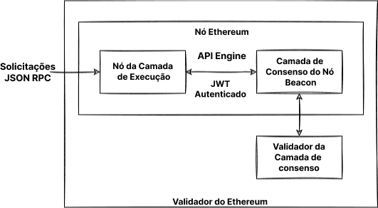

Executar o seu próprio nó oferece vários benefícios, abre novas possibilidades e ajuda a apoiar o ecossistema. Esta página guiará você na criação do seu próprio nó e na participação da validação de transações do [Ethereum](/).

Observe que após [The Merge](/roadmap/merge), dois clientes são exigidos para executar um nó do Ethereum; um cliente da **camada de execução (EL)** e um cliente da **camada de consenso (CL)**. Esta página mostrará como instalar, configurar e conectar esses dois clientes para executar um nó do Ethereum.

## Pré-requisitos {#prerequisites}

Você deve entender o que é um nó do Ethereum e por que você pode querer executar um cliente. Isso é abordado em [Nós e clientes](/developers/docs/nodes-and-clients/).

Se você é novo no tópico de executar um nó, ou está procurando um caminho menos técnico, recomendamos primeiro conferir nossa introdução amigável sobre [como executar um nó do Ethereum](/run-a-node).

## Escolhendo uma abordagem {#choosing-approach}

O primeiro passo para criar o seu nó é escolher a sua abordagem. Com base nos requisitos e em várias possibilidades, você deve selecionar a implementação do cliente (tanto dos clientes de execução quanto de consenso), o ambiente (hardware, sistema) e os parâmetros para as configurações do cliente.

Esta página guiará você por essas decisões e ajudará a encontrar a maneira mais adequada de executar a sua instância do Ethereum.

Para escolher entre as implementações de clientes, veja todos os [clientes de execução](/developers/docs/nodes-and-clients/#execution-clients) e [clientes de consenso](/developers/docs/nodes-and-clients/#consensus-clients) disponíveis e prontos para a Mainnet, e aprenda sobre a [diversidade de clientes](/developers/docs/nodes-and-clients/client-diversity).

Decida se deseja executar o software no seu próprio [hardware ou na nuvem](#local-vs-cloud), considerando os [requisitos](#requirements) dos clientes.

Após preparar o ambiente, instale os clientes escolhidos com uma [interface amigável para iniciantes](#automatized-setup) ou [manualmente](#manual-setup) usando um terminal com opções avançadas.

Quando o nó estiver em execução e em sincronização, você estará pronto para [usá-lo](#using-the-node), mas certifique-se de ficar de olho na sua [manutenção](#operating-the-node).



### Ambiente e hardware {#environment-and-hardware}

#### Local ou nuvem {#local-vs-cloud}

Os clientes Ethereum podem ser executados em computadores de nível de consumidor e não exigem nenhum hardware especial, como máquinas de mineração, por exemplo. Portanto, você tem várias opções para implantar o nó com base nas suas necessidades.
Para simplificar, vamos pensar em executar um nó tanto em uma máquina física local quanto em um servidor na nuvem:

- Nuvem
  - Os provedores oferecem alto tempo de atividade do servidor e endereços IP públicos estáticos
  - Obter um servidor dedicado ou virtual pode ser mais confortável do que montar o seu próprio
  - A desvantagem é confiar em terceiros - o provedor do servidor
  - Devido ao tamanho de armazenamento exigido para um nó completo, o preço de um servidor alugado pode ficar alto
- Hardware próprio
  - Abordagem mais soberana e sem necessidade de confiança
  - Investimento único
  - Uma opção para comprar máquinas pré-configuradas
  - Você tem que preparar fisicamente, manter e potencialmente solucionar problemas da máquina e da rede

Ambas as opções têm vantagens diferentes resumidas acima. Se você está procurando uma solução em nuvem, além de muitos provedores tradicionais de computação em nuvem, também existem serviços focados na implantação de nós. Confira [nós como serviço](/developers/docs/nodes-and-clients/nodes-as-a-service/) para mais opções de nós hospedados.

#### Hardware {#hardware}

No entanto, uma rede descentralizada e resistente à censura não deve depender de provedores de nuvem. Em vez disso, executar o seu nó no seu próprio hardware local é mais saudável para o ecossistema. [Estimativas](https://www.ethernodes.org/networkType/cl/Hosting) mostram que uma grande parte dos nós é executada na nuvem, o que pode se tornar um ponto único de falha.

Os clientes Ethereum podem ser executados no seu computador, laptop, servidor ou até mesmo em um computador de placa única. Embora seja possível executar clientes no seu computador pessoal, ter uma máquina dedicada apenas para o seu nó pode melhorar significativamente o seu desempenho e segurança, minimizando o impacto no seu computador principal.

Usar o seu próprio hardware pode ser muito fácil. Existem muitas opções simples, bem como configurações avançadas para pessoas mais técnicas. Então, vamos analisar os requisitos e os meios para executar clientes Ethereum na sua máquina.

#### Requisitos {#requirements}

Os requisitos de hardware diferem por cliente, mas geralmente não são tão altos, já que o nó só precisa se manter em sincronização. Não confunda isso com mineração, que exige muito mais poder de computação. O tempo de sincronização e o desempenho melhoram com um hardware mais poderoso, no entanto.

Antes de instalar qualquer cliente, certifique-se de que o seu computador tenha recursos suficientes para executá-lo. Você pode encontrar os requisitos mínimos e recomendados abaixo.

O gargalo para o seu hardware é principalmente o espaço em disco. A sincronização da blockchain do Ethereum é muito intensiva em entrada/saída e exige muito espaço. É melhor ter uma **unidade de estado sólido (SSD)** com centenas de GBs de espaço livre de sobra, mesmo após a sincronização.

O tamanho do banco de dados e a velocidade da sincronização inicial dependem do cliente escolhido, da sua configuração e da [estratégia de sincronização](/developers/docs/nodes-and-clients/#sync-modes).

Certifique-se também de que a sua conexão com a internet não seja limitada por um [limite de largura de banda](https://wikipedia.org/wiki/Data_cap). É recomendado usar uma conexão não medida, pois a sincronização inicial e os dados transmitidos para a rede podem exceder o seu limite.

##### Sistema operacional
Todos os clientes suportam os principais sistemas operacionais - Linux, macOS, Windows. Isso significa que você pode executar nós em máquinas desktop ou servidores comuns com o sistema operacional (SO) que melhor lhe convier. Certifique-se de que o seu SO esteja atualizado para evitar possíveis problemas e vulnerabilidades de segurança.

##### Requisitos mínimos
- CPU com 2+ núcleos
- 8 GB de RAM
- SSD de 2 TB
- Largura de banda de 10+ MBit/s

##### Especificações recomendadas
- CPU rápida com 4+ núcleos
- 16 GB+ de RAM
- SSD rápido com 2+ TB
- Largura de banda de 25+ MBit/s

O modo de sincronização e o cliente que você escolher afetarão os requisitos de espaço, mas estimamos o espaço em disco que você precisará para cada cliente abaixo.

| Cliente    | Tamanho do disco (sincronização snap) | Tamanho do disco (arquivo completo) |
| ---------- | ------------------------------------- | ----------------------------------- |
| Besu       | 800GB+                                | 12TB+                               |
| Erigon     | N/A                                   | 2.5TB+                              |
| Geth       | 500GB+                                | 12TB+                               |
| Nethermind | 500GB+                                | 12TB+                               |
| Reth       | N/A                                   | 2.2TB+                              |

- Nota: O Erigon e o Reth não oferecem sincronização snap, mas a Poda Completa (Full Pruning) é possível (\~2TB para o Erigon, ~1.2TB para o Reth)

Para clientes de consenso, o requisito de espaço também depende da implementação do cliente e dos recursos ativados (por exemplo, penalizador de validador), mas geralmente conte com mais 200 GB necessários para os dados do beacon. Com um grande número de validadores, a carga de largura de banda também cresce. Você pode encontrar [detalhes sobre os requisitos do cliente de consenso nesta análise](https://mirror.xyz/0x934e6B4D7eee305F8C9C42b46D6EEA09CcFd5EDc/b69LBy8p5UhcGJqUAmT22dpvdkU-Pulg2inrhoS9Mbc).

#### Soluções plug-and-play {#plug-and-play}

A opção mais fácil para executar um nó com o seu próprio hardware é usar caixas plug-and-play. Máquinas pré-configuradas de fornecedores oferecem a experiência mais direta: encomendar, conectar, executar. Tudo é pré-configurado e executado automaticamente com um guia intuitivo e um painel para monitorar e controlar o software.

- [DAppNode](https://dappnode.io/)
- [Avado](https://ava.do/)

#### Ethereum em um computador de placa única {#ethereum-on-a-single-board-computer}

Uma maneira fácil e barata de executar um nó do Ethereum é usar um computador de placa única, mesmo com uma arquitetura ARM como o Raspberry Pi. O [Ethereum on ARM](https://ethereum-on-arm-documentation.readthedocs.io/en/latest/) fornece imagens fáceis de executar de vários clientes de execução e consenso para o Raspberry Pi e outras placas ARM.

Dispositivos pequenos, acessíveis e eficientes como esses são ideais para executar um nó em casa, mas tenha em mente o seu desempenho limitado.

## Criando o nó {#spinning-up-node}

A configuração real do cliente pode ser feita com inicializadores automatizados ou manualmente, configurando o software do cliente diretamente.

Para usuários menos avançados, a abordagem recomendada é usar um inicializador, um software que guia você pela instalação e automatiza o processo de configuração do cliente. No entanto, se você tiver alguma experiência no uso de um terminal, os passos para a configuração manual devem ser simples de seguir.

### Configuração guiada {#automatized-setup}

Vários projetos amigáveis visam melhorar a experiência de configuração de um cliente. Esses inicializadores fornecem instalação e configuração automáticas do cliente, com alguns até oferecendo uma interface gráfica para configuração guiada e monitoramento de clientes.

Abaixo estão alguns projetos que podem ajudar você a instalar e controlar clientes com apenas alguns cliques:

- [DAppNode](https://docs.dappnode.io/docs/user/getting-started/choose-your-path) - O DAppNode não vem apenas com uma máquina de um fornecedor. O software, o próprio inicializador do nó e o centro de controle com muitos recursos podem ser usados em hardware arbitrário.
- [EthPillar](https://www.coincashew.com/coins/overview-eth/ethpillar) - A maneira mais rápida e fácil de configurar um nó completo. Ferramenta de configuração de uma linha e TUI de gerenciamento de nó. Gratuito. Código aberto. Bens públicos para o Ethereum por stakers solo. Suporte a ARM64 e AMD64.
- [eth-docker](https://eth-docker.net/) - Configuração automatizada usando Docker focada em staking fácil e seguro, exige conhecimento básico de terminal e Docker, recomendado para usuários um pouco mais avançados.
- [Stereum](https://stereum-dev.github.io/ethereum-node-web-docs) - Inicializador para instalar clientes em um servidor remoto via conexão SSH com um guia de configuração GUI, centro de controle e muitos outros recursos.
- [Sedge](https://docs.sedge.nethermind.io/docs/intro) - Ferramenta de configuração de nó que gera automaticamente uma configuração do Docker usando um assistente de CLI. Escrito em Go pelo Nethermind.
- [Chainstack Self-Hosted](https://docs.chainstack.com/docs/self-hosted/introduction) - Interface de usuário da Web e CLI para implantar clientes de execução e consenso no Kubernetes. Inicialização de snapshot e monitoramento integrado incluídos. Gratuito. Nenhuma conta da Chainstack é exigida. Construído pela Chainstack.

### Configuração manual de clientes {#manual-setup}

A outra opção é baixar, verificar e configurar o software do cliente manualmente. Mesmo que alguns clientes ofereçam uma interface gráfica, uma configuração manual ainda exige habilidades básicas com o terminal, mas oferece muito mais versatilidade.

Como explicado antes, configurar o seu próprio nó do Ethereum exigirá a execução de um par de clientes de consenso e execução. Alguns clientes podem incluir um cliente leve do outro tipo e sincronizar sem a necessidade de nenhum outro software. No entanto, a verificação completa sem necessidade de confiança exige ambas as implementações.

#### Obtendo o software do cliente {#getting-the-client}

Primeiro, você precisa obter o software do seu [cliente de execução](/developers/docs/nodes-and-clients/#execution-clients) e [cliente de consenso](/developers/docs/nodes-and-clients/#consensus-clients) preferidos.

Você pode simplesmente baixar um aplicativo executável ou pacote de instalação que se adapte ao seu sistema operacional e arquitetura. Sempre verifique as assinaturas e checksums dos pacotes baixados. Alguns clientes também oferecem repositórios ou imagens do Docker para facilitar a instalação e as atualizações. Todos os clientes são de código aberto, então você também pode compilá-los a partir do código-fonte. Este é um método mais avançado, mas em alguns casos, pode ser exigido.

As instruções para instalar cada cliente são fornecidas na documentação vinculada nas listas de clientes acima.

Aqui estão as páginas de lançamento dos clientes onde você pode encontrar os seus binários pré-compilados ou instruções de instalação:

##### Clientes de execução
- [Besu](https://github.com/hyperledger/besu/releases)
- [Erigon](https://github.com/ledgerwatch/erigon/releases)
- [Geth](https://geth.ethereum.org/downloads)
- [Nethermind](https://downloads.nethermind.io/)
- [Reth](https://reth.rs/installation/installation.html)

Também vale a pena notar que a diversidade de clientes é um [problema na camada de execução](/developers/docs/nodes-and-clients/client-diversity/#execution-layer). É recomendado que os leitores considerem executar um cliente de execução minoritário.

##### Clientes de consenso
- [Lighthouse](https://github.com/sigp/lighthouse/releases/latest)
- [Lodestar](https://chainsafe.github.io/lodestar/run/getting-started/installation#build-from-source/) (Não fornece um binário pré-compilado, apenas uma imagem do Docker ou para ser compilado a partir do código-fonte)
- [Nimbus](https://github.com/status-im/nimbus-eth2/releases/latest)
- [Prysm](https://github.com/prysmaticlabs/prysm/releases/latest)
- [Teku](https://github.com/ConsenSys/teku/releases)

A [diversidade de clientes](/developers/docs/nodes-and-clients/client-diversity/) é crítica para nós de consenso que executam validadores. Se a maioria dos validadores estiver executando uma única implementação de cliente, a segurança da rede estará em risco. Portanto, é recomendado considerar a escolha de um cliente minoritário.

[Veja o uso mais recente de clientes da rede](https://clientdiversity.org/) e aprenda mais sobre a [diversidade de clientes](/developers/docs/nodes-and-clients/client-diversity).

##### Verificando o software
Ao baixar software da internet, é recomendado verificar a sua integridade. Este passo é opcional, mas especialmente com uma peça de infraestrutura crucial como o cliente Ethereum, é importante estar ciente dos possíveis vetores de ataque e evitá-los. Se você baixou um binário pré-compilado, você precisa confiar nele e correr o risco de que um invasor possa trocar o executável por um malicioso.

Os desenvolvedores assinam os binários lançados com as suas chaves PGP para que você possa verificar criptograficamente que está executando exatamente o software que eles criaram. Você só precisa obter as chaves públicas usadas pelos desenvolvedores, que podem ser encontradas nas páginas de lançamento do cliente ou na documentação. Após baixar o lançamento do cliente e a sua assinatura, você pode usar uma implementação PGP, por exemplo, o [GnuPG](https://gnupg.org/download/index.html), para verificá-los facilmente. Confira um tutorial sobre como verificar software de código aberto usando `gpg` no [Linux](https://www.tecmint.com/verify-pgp-signature-downloaded-software/) ou [Windows/macOS](https://freedom.press/training/verifying-open-source-software/).

Outra forma de verificação é certificar-se de que o hash, uma impressão digital criptográfica única, do software que você baixou corresponde ao fornecido pelos desenvolvedores. Isso é ainda mais fácil do que usar PGP, e alguns clientes oferecem apenas esta opção. Basta executar a função de hash no software baixado e compará-lo com o da página de lançamento. Por exemplo:

```sh
sha256sum teku-22.6.1.tar.gz

9b2f8c1f8d4dab0404ce70ea314ff4b3c77e9d27aff9d1e4c1933a5439767dde
```

#### Configuração do cliente {#client-setup}

Após instalar, baixar ou compilar o software do cliente, você está pronto para executá-lo. Isso significa apenas que ele deve ser executado com a configuração adequada. Os clientes oferecem ricas opções de configuração, que podem ativar vários recursos.

Vamos começar com opções que podem influenciar significativamente o desempenho do cliente e o uso de dados. Os [modos de sincronização](/developers/docs/nodes-and-clients/#sync-modes) representam diferentes métodos de baixar e validar dados da blockchain. Antes de iniciar o nó, você deve decidir qual rede e modo de sincronização usar. As coisas mais importantes a considerar são o espaço em disco e o tempo de sincronização que o cliente precisará. Preste atenção à documentação do cliente para determinar qual modo de sincronização é o padrão. Se isso não for adequado para você, escolha outro com base no nível de segurança, dados disponíveis e custo. Além do algoritmo de sincronização, você também pode definir a poda (pruning) de diferentes tipos de dados antigos. A poda permite excluir dados desatualizados, ou seja, remover nós da trie de estado que são inacessíveis a partir de blocos recentes.

Outras opções básicas de configuração são, por exemplo, escolher uma rede - Mainnet ou redes de teste, ativar o endpoint HTTP para RPC ou WebSockets, etc. Você pode encontrar todos os recursos e opções na documentação do cliente. Várias configurações do cliente podem ser definidas executando o cliente com as flags correspondentes diretamente na CLI ou no arquivo de configuração. Cada cliente é um pouco diferente; por favor, consulte sempre a sua documentação oficial ou página de ajuda para obter detalhes sobre as opções de configuração.

Para fins de teste, você pode preferir executar um cliente em uma das redes de teste. [Veja a visão geral das redes suportadas](/developers/docs/nodes-and-clients/#execution-clients).

Exemplos de execução de clientes de execução com configuração básica podem ser encontrados na próxima seção.

#### Iniciando o cliente de execução {#starting-the-execution-client}

Antes de iniciar o software do cliente Ethereum, faça uma última verificação para garantir que o seu ambiente esteja pronto. Por exemplo, certifique-se de que:

- Há espaço em disco suficiente considerando a rede e o modo de sincronização escolhidos.
- A memória e a CPU não estão sendo interrompidas por outros programas.
- O sistema operacional está atualizado para a versão mais recente.
- O sistema tem a hora e a data corretas.
- O seu roteador e firewall aceitam conexões nas portas de escuta. Por padrão, os clientes Ethereum usam uma porta de escuta (TCP) e uma porta de descoberta (UDP), ambas na 30303 por padrão.

Execute o seu cliente em uma rede de teste primeiro para ajudar a garantir que tudo esteja funcionando corretamente.

Você precisa declarar quaisquer configurações do cliente que não sejam padrão no início. Você pode usar flags ou o arquivo de configuração para declarar a sua configuração preferida. O conjunto de recursos e a sintaxe de configuração de cada cliente diferem. Confira a documentação do seu cliente para obter os detalhes.

Os clientes de execução e consenso se comunicam por meio de um endpoint autenticado especificado na [Engine API](https://github.com/ethereum/execution-apis/tree/main/src/engine). Para se conectar a um cliente de consenso, o cliente de execução deve gerar um [`jwtsecret`](https://jwt.io/) em um caminho conhecido. Por motivos de segurança e estabilidade, os clientes devem ser executados na mesma máquina, e ambos os clientes devem conhecer esse caminho, pois ele é usado para autenticar uma conexão RPC local entre eles. O cliente de execução também deve definir uma porta de escuta para APIs autenticadas.

Este token é gerado automaticamente pelo software do cliente, mas em alguns casos, você pode precisar fazer isso sozinho. Você pode gerá-lo usando o [OpenSSL](https://www.openssl.org/):

```sh
openssl rand -hex 32 > jwtsecret
```

#### Executando um cliente de execução {#running-an-execution-client}

Esta seção guiará você na inicialização de clientes de execução. Ela serve apenas como um exemplo de uma configuração básica, que iniciará o cliente com estas configurações:

- Especifica a rede à qual se conectar, a Mainnet nos nossos exemplos
  - Em vez disso, você pode escolher [uma das redes de teste](/developers/docs/networks/) para testes preliminares da sua configuração
- Define o diretório de dados, onde todos os dados, incluindo a blockchain, serão armazenados
  - Certifique-se de substituir o caminho por um real, por exemplo, apontando para a sua unidade externa
- Ativa interfaces para comunicação com o cliente
  - Incluindo JSON-RPC e Engine API para comunicação com o cliente de consenso
- Define o caminho para o `jwtsecret` para a API autenticada
  - Certifique-se de substituir o caminho de exemplo por um real que possa ser acessado pelos clientes, por exemplo, `/tmp/jwtsecret`

Lembre-se de que este é apenas um exemplo básico, todas as outras configurações serão definidas como padrão. Preste atenção à documentação de cada cliente para aprender sobre valores padrão, configurações e recursos. Para mais recursos, por exemplo, para executar validadores, monitoramento, etc., consulte a documentação do cliente específico.

> Observe que as barras invertidas `\` nos exemplos são apenas para fins de formatação; as flags de configuração podem ser definidas em uma única linha.

##### Executando o Besu
Este exemplo inicia o Besu na Mainnet, armazena os dados da blockchain no formato padrão em `/data/ethereum`, ativa o JSON-RPC e o Engine RPC para conectar o cliente de consenso. A Engine API é autenticada com o token `jwtsecret` e apenas chamadas de `localhost` são permitidas.

```sh
besu --network=mainnet \
    --data-path=/data/ethereum \
    --rpc-http-enabled=true \
    --engine-rpc-enabled=true \
    --engine-host-allowlist="*" \
    --engine-jwt-enabled=true \
    --engine-jwt-secret=/path/to/jwtsecret
```

O Besu também vem com uma opção de inicializador que fará uma série de perguntas e gerará o arquivo de configuração. Execute o inicializador interativo usando:

```sh
besu --Xlauncher
```

A [documentação do Besu](https://besu.hyperledger.org/public-networks/get-started/start-node/) contém opções adicionais e detalhes de configuração.

##### Executando o Erigon
Este exemplo inicia o Erigon na Mainnet, armazena os dados da blockchain em `/data/ethereum`, ativa o JSON-RPC, define quais namespaces são permitidos e ativa a autenticação para conectar o cliente de consenso que é definido pelo caminho `jwtsecret`.

```sh
erigon --chain mainnet \
    --datadir /data/ethereum  \
    --http --http.api=engine,eth,web3,net \
    --authrpc.jwtsecret=/path/to/jwtsecret
```

O Erigon, por padrão, realiza uma sincronização completa com 8 GB de HDD, o que resultará em mais de 2 TB de dados de arquivo. Certifique-se de que `datadir` esteja apontando para um disco com espaço livre suficiente ou analise a flag `--prune` que pode cortar diferentes tipos de dados. Verifique o `--help` do Erigon para saber mais.

##### Executando o Geth
Este exemplo inicia o Geth na Mainnet, armazena os dados da blockchain em `/data/ethereum`, ativa o JSON-RPC e define quais namespaces são permitidos. Ele também ativa a autenticação para conectar o cliente de consenso, o que exige o caminho para o `jwtsecret` e também a opção que define quais conexões são permitidas, no nosso exemplo apenas de `localhost`.

```sh
geth --mainnet \
    --datadir "/data/ethereum" \
    --http --authrpc.addr localhost \
    --authrpc.vhosts="localhost" \
    --authrpc.port 8551
    --authrpc.jwtsecret=/path/to/jwtsecret
```

Verifique a [documentação para todas as opções de configuração](https://geth.ethereum.org/docs/fundamentals/command-line-options) e aprenda mais sobre [como executar o Geth com um cliente de consenso](https://geth.ethereum.org/docs/getting-started/consensus-clients).

##### Executando o Nethermind
O Nethermind oferece várias [opções de instalação](https://docs.nethermind.io/get-started/installing-nethermind). O pacote vem com vários binários, incluindo um Inicializador com uma configuração guiada, que ajudará você a criar a configuração interativamente. Alternativamente, você encontra o Runner, que é o próprio executável, e você pode simplesmente executá-lo com flags de configuração. O JSON-RPC é ativado por padrão.

```sh
Nethermind.Runner --config mainnet \
    --datadir /data/ethereum \
    --JsonRpc.JwtSecretFile=/path/to/jwtsecret
```

A documentação do Nethermind oferece um [guia completo](https://docs.nethermind.io/get-started/running-node/) sobre como executar o Nethermind com o cliente de consenso.

Um cliente de execução iniciará as suas funções principais, os endpoints escolhidos e começará a procurar por pares. Após descobrir pares com sucesso, o cliente inicia a sincronização. O cliente de execução aguardará uma conexão do cliente de consenso. Os dados atuais da blockchain estarão disponíveis assim que o cliente for sincronizado com sucesso com o estado atual.

##### Executando o Reth
Este exemplo inicia o Reth na Mainnet, usando o local de dados padrão. Ativa a autenticação JSON-RPC e Engine RPC para conectar o cliente de consenso que é definido pelo caminho `jwtsecret`, com apenas chamadas de `localhost` sendo permitidas.

```sh
reth node \
    --authrpc.jwtsecret /path/to/jwtsecret \
    --authrpc.addr 127.0.0.1 \
    --authrpc.port 8551
```

Veja [Configurando o Reth](https://reth.rs/run/config.html?highlight=data%20directory#configuring-reth) para saber mais sobre os diretórios de dados padrão. A [documentação do Reth](https://reth.rs/run/mainnet.html) contém opções adicionais e detalhes de configuração.

#### Iniciando o cliente de consenso {#starting-the-consensus-client}

O cliente de consenso deve ser iniciado com a configuração de porta correta para estabelecer uma conexão RPC local com o cliente de execução. Os clientes de consenso devem ser executados com a porta exposta do cliente de execução como argumento de configuração.

O cliente de consenso também precisa do caminho para o `jwt-secret` do cliente de execução para autenticar a conexão RPC entre eles. Semelhante aos exemplos de execução acima, cada cliente de consenso tem uma flag de configuração que recebe o caminho do arquivo do token jwt como argumento. Isso deve ser consistente com o caminho `jwtsecret` fornecido ao cliente de execução.

Se você planeja executar um validador, certifique-se de adicionar uma flag de configuração especificando o endereço Ethereum do destinatário da taxa. É aqui que as recompensas em ether para o seu validador se acumulam. Cada cliente de consenso tem uma opção, por exemplo, `--suggested-fee-recipient=0xabcd1`, que recebe um endereço Ethereum como argumento.

Ao iniciar um nó do Beacon em uma rede de teste, você pode economizar um tempo significativo de sincronização usando um endpoint público para a [sincronização de ponto de verificação](https://notes.ethereum.org/@launchpad/checkpoint-sync).

#### Executando um cliente de consenso {#running-a-consensus-client}

##### Executando o Lighthouse
Antes de executar o Lighthouse, aprenda mais sobre como instalá-lo e configurá-lo no [Lighthouse Book](https://lighthouse-book.sigmaprime.io/installation.html).

```sh
lighthouse beacon_node \
    --network mainnet \
    --datadir /data/ethereum \
    --http \
    --execution-endpoint http://127.0.0.1:8551 \
    --execution-jwt /path/to/jwtsecret
```

##### Executando o Lodestar
Instale o software do Lodestar compilando-o ou baixando a imagem do Docker. Aprenda mais na [documentação](https://chainsafe.github.io/lodestar/) e no [guia de configuração](https://hackmd.io/@philknows/rk5cDvKmK) mais abrangente.

```sh
lodestar beacon \
    --dataDir="/data/ethereum" \
    --network=mainnet \
    --eth1.enabled=true \
    --execution.urls="http://127.0.0.1:8551" \
    --jwt-secret="/path/to/jwtsecret"
```

##### Executando o Nimbus
O Nimbus vem com clientes de consenso e de execução. Ele pode ser executado em vários dispositivos, mesmo com um poder de computação muito modesto.
Após [instalar as dependências e o próprio Nimbus](https://nimbus.guide/quick-start.html), você pode executar o seu cliente de consenso:

```sh
nimbus_beacon_node \
    --network=mainnet \
    --web3-url=http://127.0.0.1:8551 \
    --rest \
    --jwt-secret="/path/to/jwtsecret"
```

##### Executando o Prysm
O Prysm vem com um script que permite uma instalação automática fácil. Os detalhes podem ser encontrados na [documentação do Prysm](https://prysm.offchainlabs.com/docs/install-prysm/install-with-script/).

```sh
./prysm.sh beacon-chain \
    --mainnet \
    --datadir /data/ethereum  \
    --execution-endpoint=http://localhost:8551  \
    --jwt-secret=/path/to/jwtsecret
```

##### Executando o Teku
```sh
teku --network mainnet \
    --data-path "/data/ethereum" \
    --ee-endpoint http://localhost:8551 \
    --ee-jwt-secret-file "/path/to/jwtsecret"
```

Quando um cliente de consenso se conecta ao cliente de execução para ler o contrato de depósito e identificar validadores, ele também se conecta a outros pares do nó do Beacon e começa a sincronizar os slots de consenso a partir do bloco gênese. Assim que o nó do Beacon atinge a época atual, a API do Beacon se torna utilizável para os seus validadores. Aprenda mais sobre as [APIs do nó do Beacon](https://eth2docs.vercel.app/).

### Adicionando validadores {#adding-validators}

Um cliente de consenso serve como um nó do Beacon para os validadores se conectarem. Cada cliente de consenso tem o seu próprio software de validador descrito em detalhes na sua respectiva documentação.

Executar o seu próprio validador permite o [staking solo](/staking/solo/), o método mais impactante e sem necessidade de confiança para apoiar a rede Ethereum. No entanto, isso exige um depósito de 32 ETH. Para executar um validador no seu próprio nó com uma quantia menor, um pool descentralizado com operadores de nós não permissionados, como o [Rocket Pool](https://rocketpool.net/node-operators), pode interessar a você.

A maneira mais fácil de começar com o staking e a geração de chaves de validador é usar o [Hoodi Testnet Staking Launchpad](https://hoodi.launchpad.ethereum.org/), que permite testar a sua configuração [executando nós no Hoodi](https://notes.ethereum.org/@launchpad/hoodi). Quando você estiver pronto para a Mainnet, você pode repetir esses passos usando o [Mainnet Staking Launchpad](https://launchpad.ethereum.org/).

Consulte a [página de staking](/staking) para obter uma visão geral sobre as opções de staking.

### Usando o nó {#using-the-node}

Os clientes de execução oferecem [endpoints de API RPC](/developers/docs/apis/json-rpc/) que você pode usar para enviar transações, interagir com ou implantar contratos inteligentes na rede Ethereum de várias maneiras:

- Chamando-os manualmente com um protocolo adequado (por exemplo, usando `curl`)
- Anexando um console fornecido (por exemplo, `geth attach`)
- Implementando-os em aplicativos usando bibliotecas Web3, por exemplo, [Web3.py](https://web3py.readthedocs.io/en/stable/overview.html#overview), [ethers](https://github.com/ethers-io/ethers.js/)

Diferentes clientes têm diferentes implementações dos endpoints RPC. Mas há um JSON-RPC padrão que você pode usar com todos os clientes. Para uma visão geral, [leia a documentação do JSON-RPC](/developers/docs/apis/json-rpc/). Aplicativos que precisam de informações da rede Ethereum podem usar este RPC. Por exemplo, a popular carteira MetaMask permite que você se [conecte ao seu próprio endpoint RPC](https://metamask.zendesk.com/hc/en-us/articles/360015290012-Using-a-Local-Node), o que tem fortes benefícios de privacidade e segurança.

Todos os clientes de consenso expõem uma [API do Beacon](https://ethereum.github.io/beacon-APIs) que pode ser usada para verificar o status do cliente de consenso ou baixar blocos e dados de consenso enviando solicitações usando ferramentas como o [Curl](https://curl.se). Mais informações sobre isso podem ser encontradas na documentação de cada cliente de consenso.

#### Acessando o RPC {#reaching-rpc}

A porta padrão para o JSON-RPC do cliente de execução é `8545`, mas você pode modificar as portas dos endpoints locais na configuração. Por padrão, a interface RPC só pode ser acessada no localhost do seu computador. Para torná-la acessível remotamente, você pode querer expô-la ao público alterando o endereço para `0.0.0.0`. Isso a tornará acessível pela rede local e por endereços IP públicos. Na maioria dos casos, você também precisará configurar o encaminhamento de porta no seu roteador.

Aborde a exposição de portas à internet com cautela, pois isso permitirá que qualquer pessoa na internet controle o seu nó. Atores mal-intencionados podem acessar o seu nó para derrubar o seu sistema ou roubar os seus fundos se você estiver usando o seu cliente como uma carteira.

Uma maneira de contornar isso é evitar que métodos RPC potencialmente prejudiciais sejam modificáveis. Por exemplo, com o Geth, você pode declarar métodos modificáveis com uma flag: `--http.api web3,eth,txpool`.

O acesso à interface RPC pode ser estendido por meio do desenvolvimento de APIs de camada de borda ou aplicativos de servidor da Web, como o Nginx, e conectando-os ao endereço e porta locais do seu cliente. Aproveitar uma camada intermediária também pode permitir que os desenvolvedores configurem um certificado para conexões `https` seguras com a interface RPC.

Configurar um servidor da Web, um proxy ou uma API Rest voltada para o exterior não é a única maneira de fornecer acesso ao endpoint RPC do seu nó. Outra maneira de preservar a privacidade para configurar um endpoint acessível publicamente é hospedar o nó no seu próprio serviço onion do [Tor](https://www.torproject.org/). Isso permitirá que você acesse o RPC fora da sua rede local sem um endereço IP público estático ou portas abertas. No entanto, o uso dessa configuração pode permitir apenas que o endpoint RPC seja acessível por meio da rede Tor, o que não é suportado por todos os aplicativos e pode resultar em problemas de conexão.

Para fazer isso, você tem que criar o seu próprio [serviço onion](https://community.torproject.org/onion-services/). Confira [a documentação](https://community.torproject.org/onion-services/setup/) sobre a configuração do serviço onion para hospedar o seu próprio. Você pode apontá-lo para um servidor da Web com proxy para a porta RPC ou apenas diretamente para o RPC.

Por fim, e uma das maneiras mais populares de fornecer acesso a redes internas é por meio de uma conexão VPN. Dependendo do seu caso de uso e da quantidade de usuários que precisam de acesso ao seu nó, uma conexão VPN segura pode ser uma opção. O [OpenVPN](https://openvpn.net/) é uma VPN SSL completa que implementa a extensão de rede segura da camada 2 ou 3 do modelo OSI usando o protocolo SSL/TLS padrão da indústria, suporta métodos flexíveis de autenticação de cliente baseados em certificados, cartões inteligentes e/ou credenciais de nome de usuário/senha, e permite políticas de controle de acesso específicas de usuário ou grupo usando regras de firewall aplicadas à interface virtual da VPN.

### Operando o nó {#operating-the-node}

Você deve monitorar regularmente o seu nó para garantir que ele esteja funcionando corretamente. Você pode precisar fazer manutenção ocasional.

#### Mantendo um nó online {#keeping-node-online}

O seu nó não precisa estar online o tempo todo, mas você deve mantê-lo online o máximo possível para mantê-lo em sincronização com a rede. Você pode desligá-lo para reiniciá-lo, mas tenha em mente que:

- O desligamento pode levar alguns minutos se o estado recente ainda estiver sendo gravado no disco.
- Desligamentos forçados podem danificar o banco de dados, exigindo que você sincronize novamente todo o nó.
- O seu cliente ficará fora de sincronização com a rede e precisará sincronizar novamente quando você o reiniciar. Embora o nó possa começar a sincronizar de onde foi desligado pela última vez, o processo pode levar tempo dependendo de quanto tempo ele esteve offline.

_Isso não se aplica a nós validadores da camada de consenso._ Colocar o seu nó offline afetará todos os serviços dependentes dele. Se você estiver executando um nó para fins de _staking_, você deve tentar minimizar o tempo de inatividade o máximo possível.

#### Criando serviços de cliente {#creating-client-services}

Considere criar um serviço para executar os seus clientes automaticamente na inicialização. Por exemplo, em servidores Linux, uma boa prática seria criar um serviço, por exemplo, com `systemd`, que executa o cliente com a configuração adequada, sob um usuário com privilégios limitados e reinicia automaticamente.

#### Atualizando clientes {#updating-clients}

Você precisa manter o software do seu cliente atualizado com os patches de segurança, recursos e [EIPs](/eips/) mais recentes. Especialmente antes de [hard forks](/ethereum-forks/), certifique-se de estar executando as versões corretas do cliente.

> Antes de atualizações importantes da rede, a EF publica uma postagem no seu [blog](https://blog.ethereum.org). Você pode [assinar esses anúncios](https://blog.ethereum.org/category/protocol#subscribe) para receber uma notificação no seu e-mail quando o seu nó precisar de uma atualização.

Atualizar clientes é muito simples. Cada cliente tem instruções específicas na sua documentação, mas o processo geralmente é apenas baixar a versão mais recente e reiniciar o cliente com o novo executável. O cliente deve continuar de onde parou, mas com as atualizações aplicadas.

Cada implementação de cliente tem uma string de versão legível por humanos usada no protocolo ponto a ponto, mas também é acessível a partir da linha de comando. Esta string de versão permite que os usuários verifiquem se estão executando a versão correta e permite que exploradores de blocos e outras ferramentas analíticas interessadas em quantificar a distribuição de clientes específicos na rede. Consulte a documentação individual do cliente para obter mais informações sobre strings de versão.

#### Executando serviços adicionais {#running-additional-services}

Executar o seu próprio nó permite que você use serviços que exigem acesso direto ao RPC do cliente Ethereum. Estes são serviços construídos sobre o Ethereum, como [soluções de camada 2 (l2)](/developers/docs/scaling/#layer-2-scaling), backend para carteiras, exploradores de blocos, ferramentas de desenvolvedor e outras infraestruturas do Ethereum.

#### Monitorando o nó {#monitoring-the-node}

Para monitorar adequadamente o seu nó, considere coletar métricas. Os clientes fornecem endpoints de métricas para que você possa obter dados abrangentes sobre o seu nó. Use ferramentas como o [InfluxDB](https://www.influxdata.com/get-influxdb/) ou o [Prometheus](https://prometheus.io/) para criar bancos de dados que você pode transformar em visualizações e gráficos em softwares como o [Grafana](https://grafana.com/). Existem muitas configurações para usar este software e diferentes painéis do Grafana para você visualizar o seu nó e a rede como um todo. Por exemplo, confira o [tutorial sobre como monitorar o Geth](/developers/tutorials/monitoring-geth-with-influxdb-and-grafana/).

Como parte do seu monitoramento, certifique-se de ficar de olho no desempenho da sua máquina. Durante a sincronização inicial do seu nó, o software do cliente pode ser muito pesado na CPU e na RAM. Além do Grafana, você pode usar as ferramentas que o seu SO oferece, como `htop` ou `uptime`, para fazer isso.

## Leitura adicional {#further-reading}

- [Guias de staking do Ethereum](https://github.com/SomerEsat/ethereum-staking-guides) - _Somer Esat, atualizado frequentemente_
- [Guia | Como configurar um validador para staking do Ethereum na Mainnet](https://www.coincashew.com/coins/overview-eth/guide-or-how-to-setup-a-validator-on-eth2-mainnet) _– CoinCashew, atualizado frequentemente_
- [Guias do EthStaker sobre como executar validadores em redes de teste](https://github.com/remyroy/ethstaker#guides) – _EthStaker, atualizado regularmente_
- [Aplicativo de exemplo AWS Blockchain Node Runner para nós do Ethereum](https://aws-samples.github.io/aws-blockchain-node-runners/docs/Blueprints/Ethereum) - _AWS, atualizado frequentemente_
- [Perguntas frequentes sobre The Merge para operadores de nós](https://notes.ethereum.org/@launchpad/node-faq-merge) - _Julho de 2022_
- [Analisando os requisitos de hardware para ser um nó completo validado do Ethereum](https://medium.com/coinmonks/analyzing-the-hardware-requirements-to-be-an-ethereum-full-validated-node-dc064f167902) _– Albert Palau, 24 de setembro de 2018_
- [Executando nós completos do Ethereum: um guia para os pouco motivados](https://medium.com/@JustinMLeroux/running-ethereum-full-nodes-a-guide-for-the-barely-motivated-a8a13e7a0d31) _– Justin Leroux, 7 de novembro de 2019_
- [Executando um nó do Hyperledger Besu na Rede Principal do Ethereum: benefícios, requisitos e configuração](https://pegasys.tech/running-a-hyperledger-besu-node-on-the-ethereum-mainnet-benefits-requirements-and-setup/) _– Felipe Faraggi, 7 de maio de 2020_
- [Implantando o cliente Ethereum Nethermind com pilha de monitoramento](https://medium.com/nethermind-eth/deploying-nethermind-ethereum-client-with-monitoring-stack-55ce1622edbd) _– Nethermind.eth, 8 de julho de 2020_

## Tópicos relacionados {#related-topics}

- [Nós e clientes](/developers/docs/nodes-and-clients/)
- [Blocos](/developers/docs/blocks/)
- [Redes](/developers/docs/networks/)