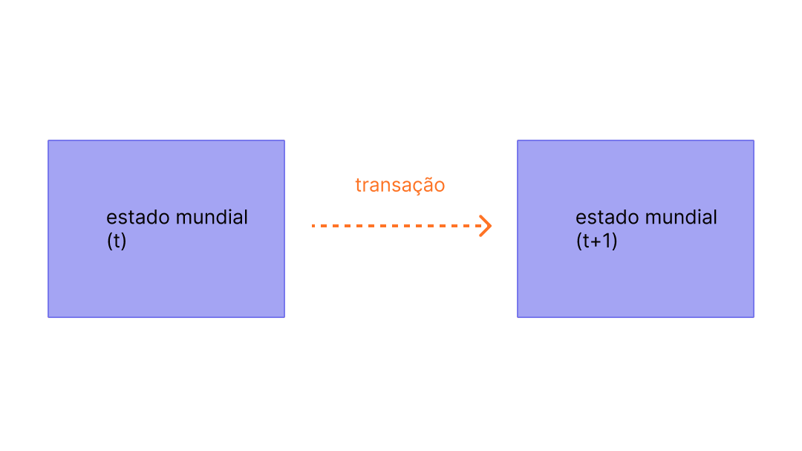
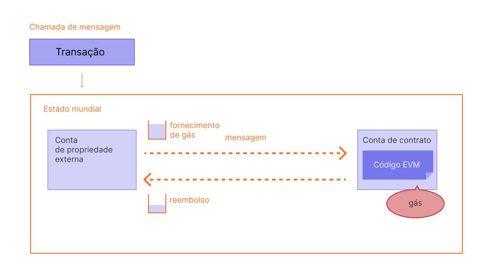

Transações são instruções assinadas criptograficamente a partir de contas. Uma conta iniciará uma transação para atualizar o estado da rede [Ethereum](/). A transação mais simples é a transferência de ETH de uma conta para outra.

## Pré-requisitos {#prerequisites}

Para ajudar você a entender melhor esta página, recomendamos que leia primeiro sobre [Contas](/developers/docs/accounts/) e nossa [introdução ao Ethereum](/developers/docs/intro-to-ethereum/).

## O que é uma transação? {#whats-a-transaction}

Uma transação no Ethereum refere-se a uma ação iniciada por uma conta de propriedade externa, em outras palavras, uma conta gerenciada por um humano, não por um contrato. Por exemplo, se Bob enviar 1 ETH para Alice, a conta de Bob deve ser debitada e a de Alice deve ser creditada. Essa ação de mudança de estado ocorre dentro de uma transação.


_Diagrama adaptado de [Ethereum EVM illustrated](https://takenobu-hs.github.io/downloads/ethereum_evm_illustrated.pdf)_

As transações, que alteram o estado da EVM, precisam ser transmitidas para toda a rede. Qualquer nó pode transmitir uma solicitação para que uma transação seja executada na EVM; depois que isso acontece, um validador executará a transação e propagará a mudança de estado resultante para o resto da rede.

As transações exigem uma taxa e devem ser incluídas em um bloco validado. Para tornar esta visão geral mais simples, abordaremos as taxas de gás e a validação em outro lugar.

Uma transação enviada inclui as seguintes informações:

- `from` – o endereço do remetente, que assinará a transação. Esta será uma conta de propriedade externa, pois contas de contrato não podem enviar transações
- `to` – o endereço de recebimento (se for uma conta de propriedade externa, a transação transferirá valor. Se for uma conta de contrato, a transação executará o código do contrato)
- `signature` – o identificador do remetente. Isso é gerado quando a chave privada do remetente assina a transação e confirma que o remetente autorizou esta transação
- `nonce` - um contador incrementado sequencialmente que indica o número da transação da conta (nonce)
- `value` – quantidade de ETH a ser transferida do remetente para o destinatário (denominada em Wei, onde 1 ETH é igual a 1e+18 Wei)
- `input data` – campo opcional para incluir dados arbitrários
- `gasLimit` – a quantidade máxima de unidades de gás que podem ser consumidas pela transação. A [EVM](/developers/docs/evm/opcodes) especifica as unidades de gás exigidas por cada etapa computacional
- `maxPriorityFeePerGas` - o preço máximo do gás consumido a ser incluído como uma taxa de prioridade para o validador
- `maxFeePerGas` - a taxa máxima por unidade de gás que se está disposto a pagar pela transação (incluindo `baseFeePerGas` e `maxPriorityFeePerGas`)

O gás é uma referência à computação necessária para processar a transação por um validador. Os usuários precisam pagar uma taxa por essa computação. O `gasLimit` e o `maxPriorityFeePerGas` determinam a taxa de transação máxima paga ao validador. [Mais sobre Gás](/developers/docs/gas/).

O objeto da transação será parecido com isto:

```js
{
  from: "0xEA674fdDe714fd979de3EdF0F56AA9716B898ec8",
  to: "0xac03bb73b6a9e108530aff4df5077c2b3d481e5a",
  gasLimit: "21000",
  maxFeePerGas: "300",
  maxPriorityFeePerGas: "10",
  nonce: "0",
  value: "10000000000"
}
```

Mas um objeto de transação precisa ser assinado usando a chave privada do remetente. Isso prova que a transação só poderia ter vindo do remetente e não foi enviada de forma fraudulenta.

Um cliente Ethereum como o Geth lidará com esse processo de assinatura.

Exemplo de chamada [JSON-RPC](/developers/docs/apis/json-rpc):

```json
{
  "id": 2,
  "jsonrpc": "2.0",
  "method": "account_signTransaction",
  "params": [
    {
      "from": "0x1923f626bb8dc025849e00f99c25fe2b2f7fb0db",
      "gas": "0x55555",
      "maxFeePerGas": "0x1234",
      "maxPriorityFeePerGas": "0x1234",
      "input": "0xabcd",
      "nonce": "0x0",
      "to": "0x07a565b7ed7d7a678680a4c162885bedbb695fe0",
      "value": "0x1234"
    }
  ]
}
```

Exemplo de resposta:

```json
{
  "jsonrpc": "2.0",
  "id": 2,
  "result": {
    "raw": "0xf88380018203339407a565b7ed7d7a678680a4c162885bedbb695fe080a44401a6e4000000000000000000000000000000000000000000000000000000000000001226a0223a7c9bcf5531c99be5ea7082183816eb20cfe0bbc322e97cc5c7f71ab8b20ea02aadee6b34b45bb15bc42d9c09de4a6754e7000908da72d48cc7704971491663",
    "tx": {
      "nonce": "0x0",
      "maxFeePerGas": "0x1234",
      "maxPriorityFeePerGas": "0x1234",
      "gas": "0x55555",
      "to": "0x07a565b7ed7d7a678680a4c162885bedbb695fe0",
      "value": "0x1234",
      "input": "0xabcd",
      "v": "0x26",
      "r": "0x223a7c9bcf5531c99be5ea7082183816eb20cfe0bbc322e97cc5c7f71ab8b20e",
      "s": "0x2aadee6b34b45bb15bc42d9c09de4a6754e7000908da72d48cc7704971491663",
      "hash": "0xeba2df809e7a612a0a0d444ccfa5c839624bdc00dd29e3340d46df3870f8a30e"
    }
  }
}
```

- o `raw` é a transação assinada na forma codificada de [Recursive Length Prefix (RLP)](/developers/docs/data-structures-and-encoding/rlp)
- a `tx` é a transação assinada no formato JSON

Com o hash da assinatura, pode-se provar criptograficamente que a transação veio do remetente e foi enviada à rede.

### O campo de dados {#the-data-field}

A grande maioria das transações acessa um contrato a partir de uma conta de propriedade externa.
A maioria dos contratos é escrita em Solidity e interpreta seu campo de dados de acordo com a [interface binária de aplicação (ABI)](/glossary/#abi).

Os primeiros quatro bytes especificam qual função chamar, usando o hash do nome e dos argumentos da função.
Às vezes, você pode identificar a função a partir do seletor usando [este banco de dados](https://www.4byte.directory/signatures/).

O restante dos dados de chamada é composto pelos argumentos, [codificados conforme especificado nas especificações da ABI](https://docs.soliditylang.org/en/latest/abi-spec.html#formal-specification-of-the-encoding).

Por exemplo, vamos dar uma olhada [nesta transação](https://etherscan.io/tx/0xd0dcbe007569fcfa1902dae0ab8b4e078efe42e231786312289b1eee5590f6a1).
Use **Click to see More** (Clique para ver mais) para ver os dados de chamada.

O seletor de função é `0xa9059cbb`. Existem várias [funções conhecidas com esta assinatura](https://www.4byte.directory/signatures/?bytes4_signature=0xa9059cbb).
Neste caso, [o código-fonte do contrato](https://etherscan.io/address/0xa0b86991c6218b36c1d19d4a2e9eb0ce3606eb48#code) foi carregado no Etherscan, então sabemos que a função é `transfer(address,uint256)`.

O restante dos dados é:

```
0000000000000000000000004f6742badb049791cd9a37ea913f2bac38d01279
000000000000000000000000000000000000000000000000000000003b0559f4
```

De acordo com as especificações da ABI, valores inteiros (como endereços, que são inteiros de 20 bytes) aparecem na ABI como palavras de 32 bytes, preenchidas com zeros na frente.
Portanto, sabemos que o endereço `to` é [`4f6742badb049791cd9a37ea913f2bac38d01279`](https://etherscan.io/address/0x4f6742badb049791cd9a37ea913f2bac38d01279).
O `value` é 0x3b0559f4 = 990206452.

### Descritores de transação {#transaction-descriptors}

Como o campo de dados contém bytes hexadecimais opacos, pode ser extremamente difícil verificar qual ação uma transação realmente executará. Essa vulnerabilidade de "assinatura cega" é resolvida pela **[Assinatura Clara (Clear Signing)](https://clearsigning.org/)** por meio do uso de [descritores de transação](https://eips.ethereum.org/EIPS/eip-7730) (definidos pelo ERC-7730).  

A especificação ERC-7730 usa descritores de transação (frequentemente estruturados como arquivos JSON) para enriquecer os dados encontrados em ABIs e mensagens estruturadas, como dados de chamada de transação da EVM, mensagens EIP-712 e Operações de Usuário EIP-4337. Os desenvolvedores usam esses descritores para mapear variáveis de transação específicas diretamente em modelos de formatação, garantindo que os dados subjacentes permaneçam legíveis por máquina para os aplicativos.

No frontend, as carteiras usam esse contexto de formatação para traduzir bytecode opaco em informações claras e legíveis por humanos. Ao resolver automaticamente valores como endereços de token em tickers reconhecidos, ou valores em decimais, os usuários recebem um resumo em linguagem simples da intenção exata da transação (por exemplo, 'Trocar 1000 USDC por pelo menos 0,25 WETH') antes de assinarem.

## Tipos de transações {#types-of-transactions}

No Ethereum, existem alguns tipos diferentes de transações:

- Transações regulares: uma transação de uma conta para outra.
- Transações de implantação de contrato: uma transação sem um endereço 'to' (para), onde o campo de dados é usado para o código do contrato.
- Execução de um contrato: uma transação que interage com um contrato inteligente implantado. Neste caso, o endereço 'to' é o endereço do contrato inteligente.

### Sobre o gás {#on-gas}

Como mencionado, as transações custam [gás](/developers/docs/gas/) para serem executadas. Transações de transferência simples exigem 21.000 unidades de Gás.

Portanto, para Bob enviar a Alice 1 ETH a uma `baseFeePerGas` de 190 gwei e uma `maxPriorityFeePerGas` de 10 gwei, Bob precisará pagar a seguinte taxa:

```
(190 + 10) * 21000 = 4,200,000 gwei
--ou--
0.0042 ETH
```

A conta de Bob será debitada em **-1,0042 ETH** (1 ETH para Alice + 0,0042 ETH em taxas de gás)

A conta de Alice será creditada em **+1,0 ETH**

A taxa básica será queimada **-0,00399 ETH**

O validador fica com a taxa de prioridade **+0,000210 ETH**



_Diagrama adaptado de [Ethereum EVM illustrated](https://takenobu-hs.github.io/downloads/ethereum_evm_illustrated.pdf)_

Qualquer gás não utilizado em uma transação é reembolsado para a conta do usuário.

### Interações com contratos inteligentes {#smart-contract-interactions}

O gás é necessário para qualquer transação que envolva um contrato inteligente.

Os contratos inteligentes também podem conter funções conhecidas como funções [`view`](https://docs.soliditylang.org/en/latest/contracts.html#view-functions) ou [`pure`](https://docs.soliditylang.org/en/latest/contracts.html#pure-functions), que não alteram o estado do contrato. Como tal, chamar essas funções a partir de uma EOA não exigirá nenhum gás. A chamada RPC subjacente para este cenário é [`eth_call`](/developers/docs/apis/json-rpc#eth_call).

Diferentemente de quando acessadas usando `eth_call`, essas funções `view` ou `pure` também são comumente chamadas internamente (ou seja, do próprio contrato ou de outro contrato), o que custa gás.

## Ciclo de vida da transação {#transaction-lifecycle}

Depois que a transação for enviada, o seguinte acontece:

1. Um hash da transação é gerado criptograficamente:
   `0x97d99bc7729211111a21b12c933c949d4f31684f1d6954ff477d0477538ff017`
2. A transação é então transmitida para a rede e adicionada a um pool de transações que consiste em todas as outras transações pendentes da rede.
3. Um validador deve escolher sua transação e incluí-la em um bloco para verificar a transação e considerá-la "bem-sucedida".
4. Com o passar do tempo, o bloco contendo sua transação será atualizado para "justificado" e depois "finalizado". Essas atualizações tornam muito mais certo que sua transação foi bem-sucedida e nunca será alterada. Uma vez que um bloco é "finalizado", ele só poderia ser alterado por um ataque no nível da rede que custaria muitos bilhões de dólares.

## Uma demonstração visual {#a-visual-demo}

Assista Austin guiá-lo através de transações, gás e mineração.

<VideoWatch slug="transactions-eth-build" />

## Envelope de Transação Tipada {#typed-transaction-envelope}

O Ethereum originalmente tinha um formato para transações. Cada transação continha um nonce, preço do gás, limite de gas, endereço de destino (to), valor, dados, v, r e s. Esses campos são [codificados em RLP](/developers/docs/data-structures-and-encoding/rlp/), para se parecerem com isto:

`RLP([nonce, gasPrice, gasLimit, to, value, data, v, r, s])`

O Ethereum evoluiu para suportar vários tipos de transações para permitir que novos recursos, como listas de acesso e a [EIP-1559](https://eips.ethereum.org/EIPS/eip-1559), sejam implementados sem afetar os formatos de transação legados.

A [EIP-2718](https://eips.ethereum.org/EIPS/eip-2718) é o que permite esse comportamento. As transações são interpretadas como:

`TransactionType || TransactionPayload`

Onde os campos são definidos como:

- `TransactionType` - um número entre 0 e 0x7f, para um total de 128 tipos de transação possíveis.
- `TransactionPayload` - um array de bytes arbitrário definido pelo tipo de transação.

Com base no valor de `TransactionType`, uma transação pode ser classificada como:

1. **Transações do Tipo 0 (Legadas):** O formato de transação original usado desde o lançamento do Ethereum. Elas não incluem recursos da [EIP-1559](https://eips.ethereum.org/EIPS/eip-1559), como cálculos dinâmicos de taxa de gas ou listas de acesso para contratos inteligentes. As transações legadas não possuem um prefixo específico indicando seu tipo em sua forma serializada, começando com o byte `0xf8` ao usar a codificação [Recursive Length Prefix (RLP)](/developers/docs/data-structures-and-encoding/rlp). O valor de TransactionType para essas transações é `0x0`.

2. **Transações do Tipo 1:** Introduzidas na [EIP-2930](https://eips.ethereum.org/EIPS/eip-2930) como parte da [atualização Berlim](/ethereum-forks/#berlin) do Ethereum, essas transações incluem um parâmetro `accessList`. Esta lista especifica endereços e chaves de armazenamento que a transação espera acessar, ajudando a reduzir potencialmente os custos de [gás](/developers/docs/gas/) para transações complexas envolvendo contratos inteligentes. As mudanças no mercado de taxas da EIP-1559 não estão incluídas nas transações do Tipo 1. As transações do Tipo 1 também incluem um parâmetro `yParity`, que pode ser `0x0` ou `0x1`, indicando a paridade do valor y da assinatura secp256k1. Elas são identificadas por começarem com o byte `0x01`, e seu valor de TransactionType é `0x1`.

3. **Transações do Tipo 2**, comumente chamadas de transações EIP-1559, são transações introduzidas na [EIP-1559](https://eips.ethereum.org/EIPS/eip-1559), na [atualização London](/ethereum-forks/#london) do Ethereum. Elas se tornaram o tipo de transação padrão na rede Ethereum. Essas transações introduzem um novo mecanismo de mercado de taxas que melhora a previsibilidade ao separar a taxa de transação em uma taxa básica e uma taxa de prioridade. Elas começam com o byte `0x02` e incluem campos como `maxPriorityFeePerGas` e `maxFeePerGas`. As transações do Tipo 2 agora são o padrão devido à sua flexibilidade e eficiência, sendo especialmente favorecidas durante períodos de alto congestionamento da rede por sua capacidade de ajudar os usuários a gerenciar as taxas de transação de forma mais previsível. O valor de TransactionType para essas transações é `0x2`.

4. **Transações do Tipo 3 (Blob)** foram introduzidas na [EIP-4844](https://eips.ethereum.org/EIPS/eip-4844) como parte da [atualização Dencun](/ethereum-forks/#dencun) do Ethereum. Essas transações são projetadas para lidar com dados "blob" (Binary Large Objects) de forma mais eficiente, beneficiando particularmente os rollups de camada 2 (l2) ao fornecer uma maneira de postar dados na rede Ethereum a um custo menor. As transações de blob incluem campos adicionais, como `blobVersionedHashes`, `maxFeePerBlobGas` e `blobGasPrice`. Elas começam com o byte `0x03`, e seu valor de TransactionType é `0x3`. As transações de blob representam uma melhoria significativa na disponibilidade de dados e nas capacidades de escalabilidade do Ethereum.

5. **Transações do Tipo 4** foram introduzidas na [EIP-7702](https://eips.ethereum.org/EIPS/eip-7702) como parte da [atualização Pectra](/roadmap/pectra/) do Ethereum. Essas transações são projetadas para serem compatíveis com o futuro da abstração de conta. Elas permitem que as EOAs se comportem temporariamente como contas de contrato inteligente sem comprometer sua funcionalidade original. Elas incluem um parâmetro `authorization_list`, que especifica o contrato inteligente ao qual a EOA delega sua autoridade. Após a transação, o campo de código da EOA terá o endereço do contrato inteligente delegado.

## Leitura adicional {#further-reading}

- [EIP-2718: Envelope de Transação Tipada](https://eips.ethereum.org/EIPS/eip-2718)

_Conhece um recurso comunitário que o ajudou? Edite esta página e adicione-o!_

## Tópicos relacionados {#related-topics}

- [Contas](/developers/docs/accounts/)
- [Máquina Virtual Ethereum (EVM)](/developers/docs/evm/)
- [Gás](/developers/docs/gas/)