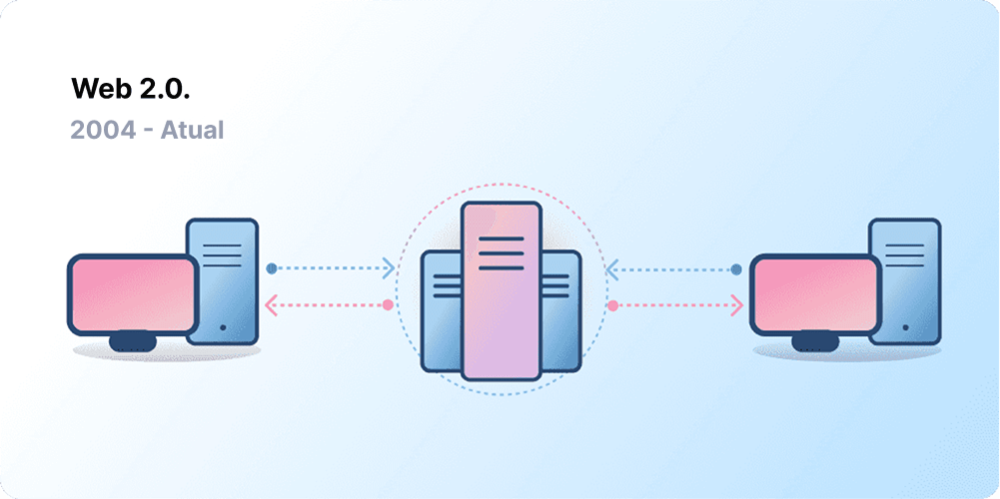
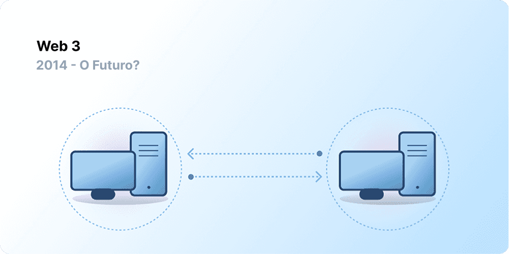

A centralização ajudou a integrar bilhões de pessoas à World Wide Web e criou a infraestrutura estável e robusta na qual ela vive. Ao mesmo tempo, um punhado de entidades centralizadas tem um forte domínio sobre grandes partes da World Wide Web, decidindo unilateralmente o que deve e o que não deve ser permitido.

A Web3 é a resposta para esse dilema. Em vez de uma Web monopolizada por grandes empresas de tecnologia, a Web3 adota a descentralização e está sendo construída, operada e de propriedade de seus usuários. A Web3 coloca o poder nas mãos dos indivíduos em vez das corporações.
Antes de falarmos sobre a Web3, vamos explorar como chegamos até aqui.

<Divider />

## Os primórdios da Web {#early-internet}

A maioria das pessoas pensa na Web como um pilar contínuo da vida moderna — ela foi inventada e simplesmente existe desde então. No entanto, a Web que a maioria de nós conhece hoje é bem diferente do que foi imaginado originalmente. Para entender isso melhor, é útil dividir a curta história da Web em períodos flexíveis — Web 1.0 e Web 2.0.

### Web 1.0: Somente leitura (1990-2004) {#web1}

Em 1989, no CERN, em Genebra, Tim Berners-Lee estava ocupado desenvolvendo os protocolos que se tornariam a World Wide Web. Sua ideia? Criar protocolos abertos e descentralizados que permitissem o compartilhamento de informações de qualquer lugar da Terra.

A primeira concepção da criação de Berners-Lee, agora conhecida como 'Web 1.0', ocorreu aproximadamente entre 1990 e 2004. A Web 1.0 era composta principalmente por sites estáticos de propriedade de empresas, e havia quase zero interação entre os usuários - os indivíduos raramente produziam conteúdo - o que a levou a ser conhecida como a web de somente leitura.

### Web 2.0: Leitura e escrita (2004-hoje) {#web2}

O período da Web 2.0 começou em 2004 com o surgimento das plataformas de mídia social. Em vez de ser somente leitura, a web evoluiu para leitura e escrita. Em vez de as empresas fornecerem conteúdo aos usuários, elas também começaram a fornecer plataformas para compartilhar conteúdo gerado pelo usuário e se envolver em interações de usuário para usuário. À medida que mais pessoas ficavam online, um punhado de empresas líderes começou a controlar uma quantidade desproporcional do tráfego e do valor gerado na web. A Web 2.0 também deu origem ao modelo de receita impulsionado por publicidade. Embora os usuários pudessem criar conteúdo, eles não eram donos dele nem se beneficiavam de sua monetização.

<Divider />

## Web 3.0: Ler, escrever e possuir {#web3}

A premissa da 'Web 3.0' foi cunhada pelo cofundador do [Ethereum](/), Gavin Wood, logo após o lançamento do Ethereum em 2014. Gavin colocou em palavras uma solução para um problema que muitos dos primeiros adeptos de cripto sentiam: a Web exigia muita confiança. Ou seja, a maior parte da Web que as pessoas conhecem e usam hoje depende de confiar em um punhado de empresas privadas para agir de acordo com os melhores interesses do público.

### O que é a Web3? {#what-is-web3}

A Web3 se tornou um termo genérico para a visão de uma internet nova e melhor. Em sua essência, a Web3 usa blockchains, criptomoedas e NFTs para devolver o poder aos usuários na forma de propriedade. [Uma postagem de 2020 no Twitter](https://twitter.com/himgajria/status/1266415636789334016) resumiu perfeitamente: a Web1 era somente leitura, a Web2 é leitura e escrita, a Web3 será ler, escrever e possuir.

#### Ideias centrais da Web3 {#core-ideas}

Embora seja desafiador fornecer uma definição rígida do que é a Web3, alguns princípios fundamentais orientam sua criação.

- **A Web3 é descentralizada:** em vez de grandes partes da internet serem controladas e de propriedade de entidades centralizadas, a propriedade é distribuída entre seus construtores e usuários.
- **A Web3 é não permissionada:** todos têm acesso igualitário para participar da Web3, e ninguém é excluído.
- **A Web3 tem pagamentos nativos:** ela usa criptomoeda para gastar e enviar dinheiro online, em vez de depender da infraestrutura desatualizada de bancos e processadores de pagamento.
- **A Web3 é sem necessidade de confiança:** ela opera usando incentivos e mecanismos econômicos em vez de depender de terceiros confiáveis.

### Por que a Web3 é importante? {#why-is-web3-important}

Embora os principais recursos da Web3 não sejam isolados e não se encaixem em categorias perfeitas, por simplicidade, tentamos separá-los para torná-los mais fáceis de entender.

#### Propriedade {#ownership}

A Web3 lhe dá a propriedade de seus ativos digitais de uma forma sem precedentes. Por exemplo, digamos que você esteja jogando um jogo da Web2. Se você comprar um item no jogo, ele estará vinculado diretamente à sua conta. Se os criadores do jogo excluírem sua conta, você perderá esses itens. Ou, se você parar de jogar, perderá o valor que investiu em seus itens do jogo.

A Web3 permite a propriedade direta por meio de [tokens não fungíveis (NFTs)](/glossary/#nft). Ninguém, nem mesmo os criadores do jogo, tem o poder de tirar sua propriedade. E, se você parar de jogar, poderá vender ou negociar seus itens do jogo em mercados abertos e recuperar o valor deles. Explore os [jogos onchain](/gaming/) para ver isso na prática.

<Alert variant="update">
<AlertEmoji text=":eyes:"/>
<AlertContent className="flex-row items-center justify-between">
  
Saiba mais sobre NFTs

  <ButtonLink href="/nft/">
    Mais sobre NFTs
  </ButtonLink>
</AlertContent>
</Alert>

#### Resistência à censura {#censorship-resistance}

A dinâmica de poder entre plataformas e criadores de conteúdo é massivamente desequilibrada.

O OnlyFans é um site de conteúdo adulto gerado por usuários com mais de 1 milhão de criadores de conteúdo, muitos dos quais usam a plataforma como sua principal fonte de renda. Em agosto de 2021, o OnlyFans anunciou planos para proibir conteúdo sexualmente explícito. O anúncio gerou indignação entre os criadores na plataforma, que sentiram que estavam sendo roubados de uma renda em uma plataforma que ajudaram a criar. Após a reação negativa, a decisão foi rapidamente revertida. Apesar de os criadores terem vencido essa batalha, isso destaca um problema para os criadores da Web 2.0: você perde a reputação e os seguidores que acumulou se sair de uma plataforma.

Na Web3, seus dados vivem na blockchain. Quando você decide sair de uma plataforma, pode levar sua reputação com você, conectando-a a outra interface que se alinhe mais claramente com seus valores.

A Web 2.0 exige que os criadores de conteúdo confiem que as plataformas não mudarão as regras, mas a resistência à censura é um recurso nativo de uma plataforma Web3.

#### Organizações autônomas descentralizadas (DAOs) {#daos}

Além de ser dono de seus dados na Web3, você pode ser dono da plataforma como um coletivo, usando tokens que agem como ações de uma empresa. As DAOs permitem que você coordene a propriedade descentralizada de uma plataforma e tome decisões sobre o futuro dela.

As DAOs são definidas tecnicamente como [contratos inteligentes](/glossary/#smart-contract) acordados que automatizam a tomada de decisões descentralizada sobre um conjunto de recursos (tokens). Os usuários com tokens votam em como os recursos são gastos, e o código executa automaticamente o resultado da votação.

No entanto, as pessoas definem muitas comunidades da Web3 como DAOs. Todas essas comunidades têm diferentes níveis de descentralização e automação por código. Atualmente, estamos explorando o que são as DAOs e como elas podem evoluir no futuro.

<Alert variant="update">
<AlertEmoji text=":eyes:"/>
<AlertContent className="flex-row items-center justify-between">
  
Saiba mais sobre DAOs

  <ButtonLink href="/dao/">
    Mais sobre DAOs
  </ButtonLink>
</AlertContent>
</Alert>

### Identidade {#identity}

Tradicionalmente, você criaria uma conta para cada plataforma que usa. Por exemplo, você pode ter uma conta no Twitter, uma conta no YouTube e uma conta no Reddit. Quer mudar seu nome de exibição ou foto de perfil? Você tem que fazer isso em todas as contas. Você pode usar logins sociais em alguns casos, mas isso apresenta um problema familiar — a censura. Com um único clique, essas plataformas podem bloquear você de toda a sua vida online. Pior ainda, muitas plataformas exigem que você confie a elas informações de identificação pessoal para criar uma conta.

A Web3 resolve esses problemas permitindo que você controle sua identidade digital com um endereço Ethereum e um perfil do [Ethereum Name Service (ENS)](/glossary/#ens). O uso de um endereço Ethereum fornece um login único em várias plataformas que é seguro, resistente à censura e anônimo.

### Pagamentos nativos {#native-payments}

A infraestrutura de pagamento da Web2 depende de bancos e processadores de pagamento, excluindo pessoas sem contas bancárias ou aquelas que por acaso vivem dentro das fronteiras do país errado.
A Web3 usa tokens como o [ETH](/glossary/#ether) para enviar dinheiro diretamente no navegador e não exige terceiros confiáveis.

<ButtonLink href="/what-is-ether/">
  Mais sobre o ETH
</ButtonLink>

## Limitações da Web3 {#web3-limitations}

Apesar dos inúmeros benefícios da Web3 em sua forma atual, ainda existem muitas limitações que o ecossistema deve resolver para que ela floresça.

### Acessibilidade {#accessibility}

Recursos importantes da Web3, como o Sign-in with Ethereum (Fazer login com Ethereum), já estão disponíveis para qualquer pessoa usar a custo zero. Mas o custo relativo das transações ainda é proibitivo para muitos. É menos provável que a Web3 seja utilizada em nações em desenvolvimento e menos ricas devido às altas taxas de transação. No Ethereum, esses desafios estão sendo resolvidos por meio do [roteiro](/roadmap/) e das [soluções de escalabilidade de camada 2 (l2)](/glossary/#layer-2). A tecnologia está pronta, mas precisamos de níveis mais altos de adoção na camada 2 (l2) para tornar a Web3 acessível a todos.

### Experiência do usuário {#user-experience}

A barreira técnica de entrada para usar a Web3 é atualmente muito alta. Os usuários devem compreender as preocupações de segurança, entender a documentação técnica complexa e navegar por interfaces de usuário não intuitivas. Os [provedores de carteira](/wallets/find-wallet/), em particular, estão trabalhando para resolver isso, mas é necessário mais progresso antes que a Web3 seja adotada em massa.

### Educação {#education}

A Web3 introduz novos paradigmas que exigem o aprendizado de modelos mentais diferentes dos usados na Web 2.0. Um esforço educacional semelhante aconteceu quando a Web 1.0 estava ganhando popularidade no final da década de 1990; os defensores da world wide web usaram uma série de técnicas educacionais para educar o público, desde metáforas simples (a rodovia da informação, navegadores, surfar na web) até [transmissões de televisão](https://www.youtube.com/watch?v=SzQLI7BxfYI). A Web3 não é difícil, mas é diferente. Iniciativas educacionais que informam os usuários da Web2 sobre esses paradigmas da Web3 são vitais para o seu sucesso.

O Ethereum.org contribui para a educação sobre a Web3 por meio do nosso [Programa de Tradução](/contributing/translation-program/), com o objetivo de traduzir conteúdos importantes do Ethereum para o maior número possível de idiomas.

### Infraestrutura centralizada {#centralized-infrastructure}

O ecossistema da Web3 é jovem e está evoluindo rapidamente. Como resultado, atualmente ele depende principalmente de infraestrutura centralizada (GitHub, Twitter, Discord, etc.). Muitas empresas da Web3 estão correndo para preencher essas lacunas, mas construir uma infraestrutura confiável e de alta qualidade leva tempo.

## Um futuro descentralizado {#decentralized-future}

A Web3 é um ecossistema jovem e em evolução. Gavin Wood cunhou o termo em 2014, mas muitas dessas ideias só recentemente se tornaram realidade. Apenas no último ano, houve um aumento considerável no interesse por criptomoedas, melhorias nas soluções de escalabilidade de camada 2 (l2), experimentos massivos com novas formas de governança e revoluções na identidade digital.

Estamos apenas no começo da criação de uma Web melhor com a Web3, mas à medida que continuamos a melhorar a infraestrutura que a suportará, o futuro da Web parece brilhante.

## Como posso me envolver {#get-involved}

- [Obter uma carteira](/wallets/)
- [Encontrar uma comunidade](/community/)
- [Explorar aplicativos da Web3](/apps/)
- [Juntar-se a uma DAO](/dao/)
- [Construir na Web3](/developers/)

## Leitura adicional {#further-reading}

A Web3 não é rigidamente definida. Vários participantes da comunidade têm perspectivas diferentes sobre ela. Aqui estão algumas delas:

- [O que é a Web3? A Internet Descentralizada do Futuro Explicada](https://www.freecodecamp.org/news/what-is-web3) – _Nader Dabit_
- [Entendendo a Web 3](https://medium.com/l4-media/making-sense-of-web-3-c1a9e74dcae) – _Josh Stark_
- [Por que a Web3 é importante](https://a16zcrypto.com/posts/article/why-web3-matters/) — _Chris Dixon_
- [Por que a descentralização é importante](https://onezero.medium.com/why-decentralization-matters-5e3f79f7638e) - _Chris Dixon_
- [O cenário da Web3](https://a16z.com/wp-content/uploads/2021/10/The-web3-Readlng-List.pdf) – _a16z_
- [O debate sobre a Web3](https://www.notboring.co/p/the-web3-debate) – _Packy McCormick_

<QuizWidget quizKey="web3" />