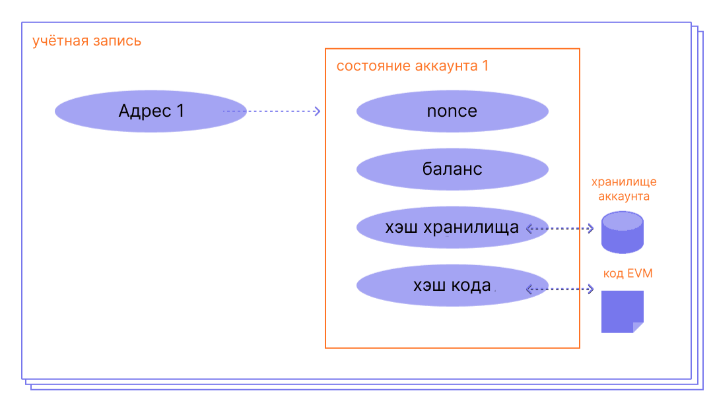

Аккаунт Ethereum — это сущность с балансом эфира (ETH), которая может отправлять транзакции в Ethereum. Аккаунты могут управляться пользователем или развертываться как умные контракты.

## Прежде чем начать {#prerequisites}

Чтобы лучше понять эту страницу, мы советуем вам вначале прочитать наше [введение в Ethereum](/developers/docs/intro-to-ethereum/).

## Типы аккаунтов {#types-of-account}

В Ethereum есть два типа аккаунтов:

- Внешняя учетная запись (EOA) – управляется кем-либо с помощью приватных ключей.
- Аккаунт контракта – смарт-контракт, развернутый в сети и управляемый кодом. Подробнее об [умных контрактах](/developers/docs/smart-contracts/)

Оба типа аккаунтов имеют возможность:

- Получать, удерживать и отправлять ETH и токены
- Взаимодействовать с развернутыми умными контрактами

### Основные отличия {#key-differences}

**Внешний**

- Создание аккаунта бесплатно
- Можно инициировать транзакции
- Транзакции между внешними аккаунтами могут быть только в ETH и токенах
- Образуется криптографической парой ключей: публичный и приватный ключи для контроля действий аккаунта

**Контракт**

- Создание контракта имеет свою цену, потому что вы используете сетевое хранилище
- Может отправлять транзакции только в ответ на получение транзакции
- Транзакции с внешнего аккаунта на аккаунт контракта могут запустить код, который может выполнить множество различных действий, таких как передача токенов или даже создание нового контракта
- У аккаунтов контракта нет приватных ключей. Вместо этого они управляются логикой кода смарт-контракта.

## Аккаунт проверен {#an-account-examined}

У аккаунтов Ethereum есть четыре поля:

- `nonce` – счетчик с указанием количества транзакций, переданных с внешней учетной записи, или количества контрактов, созданных в контрактном аккаунте. Только одна транзакция с заданным значением nonce может быть выполнена для каждого аккаунта, что защищает от атак повтора, в которых неоднократно транслируются и повторно выполняются подписанные транзакции.
- `balance` — количество wei, принадлежащих этому адресу. Wei — это часть ЕТН, один ETH равен 1e+18 Wei.
- `codeHash` — этот хэш ссылается на _код_ учетной записи на виртуальной машине Ethereum (EVM). Аккаунты контракта имеют запрограммированные фрагменты кода, которые могут выполнять различные операции. Этот EVM-код запускается при вызове аккаунта. Изменить это нельзя, в отличие от других полей аккаунта. Все фрагменты кода содержатся в базе состояний под соответствующими хэшами для последующего извлечения. Это значение хэша известно как codeHash. Для внешних аккаунтов поле codeHash — это хэш пустой строки.
- `storageRoot` — также известен как хэш хранилища. 256-битный хэш корня «дерева Меркла Патрисии», кодирующего содержимое хранилища аккаунта, кодируется в дереве как отображение из 256-битного хэша Keccak 256-битных целых ключей в 256-битные значения RLP. Дерево кодирует хэш хранилища этого аккаунта и по умолчанию пусто.

 _Источник адаптированной диаграммы: [Ethereum EVM illustrated](https://takenobu-hs.github.io/downloads/ethereum_evm_illustrated.pdf)_

## Внешние аккаунты и пары ключей {#externally-owned-accounts-and-key-pairs}

Учетная запись состоит из двух криптографических ключей: открытого и секретного. Они помогают доказать, что транзакция была подписана отправителем, и не допускают подделки. Приватный ключ используется для подписания транзакций, а потому он предоставляет вам возможность хранить свои средства на счете. У вас нет криптовалюты как таковой, у вас есть приватные ключи, а все средства находятся в общем реестре Ethereum.

Это не позволяет злоумышленникам передавать поддельные транзакции, так как вы всегда можете проверить отправителя транзакции.

Если Алиса хочет отправить эфир со своего счета на счет Боба, Алисе необходимо создать запрос транзакции и отправить его в сеть для верификации. Использование криптографии с публичными ключами гарантирует, что Алиса сможет доказать, что она действительно создала запрос транзакции. Без криптографических механизмов злоумышленник Ева может просто публично транслировать запрос, такой как «отправить 5 ETH с аккаунта Алисы на аккаунт Евы», и никто не сможет подтвердить, что он был получен не от Алисы.

## Создание аккаунта {#account-creation}

Когда вы хотите создать аккаунт, большинство библиотек сгенерируют вам случайный приватный ключ.

Приватный ключ состоит из 64 шестнадцатиричных символов и может быть зашифрован с помощью пароля.

Пример:

`fffffffffffffffffffffffffffffffebaaedce6af48a03bbfd25e8cd036415f`

Публичный ключ генерируется из приватного ключа с помощью [цифрового алгоритма подписи эллиптических кривых](https://wikipedia.org/wiki/Elliptic_Curve_Digital_Signature_Algorithm). Для получения публичного адреса своего аккаунта берутся последние 20 байтов хэша Keccak-256 публичного ключа и добавляется `0x` в начало.

Это означает, что внешняя учетная запись (EOA) имеет 42-значный адрес (20-байтовый сегмент, состоящий из 40 шестнадцатеричных символов и префикса `0x`).

Пример:

`0x5e97870f263700f46aa00d967821199b9bc5a120`

Следующий пример показывает, как использовать инструмент подписи под названием [Clef](https://geth.ethereum.org/docs/tools/clef/introduction), чтобы создать новый аккаунт. Clef — это утилита для управления аккаунтом и подписями, идущая в комплекте с клиентом Ethereum — [Geth](https://geth.ethereum.org). Команда `clef newaccount` создает новую пару ключей и сохраняет их в зашифрованном хранилище ключей.

```
> clef newaccount --keystore <path>

Please enter a password for the new account to be created:
> <password>

------------
INFO [10-28|16:19:09.156] Your new key was generated       address=0x5e97870f263700f46aa00d967821199b9bc5a120
WARN [10-28|16:19:09.306] Please backup your key file      path=/home/user/go-ethereum/data/keystore/UTC--2022-10-28T15-19-08.000825927Z--5e97870f263700f46aa00d967821199b9bc5a120
WARN [10-28|16:19:09.306] Please remember your password!
Generated account 0x5e97870f263700f46aa00d967821199b9bc5a120
```

[Документация Geth](https://geth.ethereum.org/docs)

Возможно получение новых публичных ключей из вашего приватного ключа, но получить приватный ключ, зная публичные, нельзя. Крайне важно хранить секретные ключи в безопасности и как следует из названия **В СЕКРЕТЕ**.

Для подписи сообщений и транзакций, которые выводят подпись, необходим приватный ключ. Затем другие пользователи могут проверить подлинность подписи с помощью вашего публичного ключа. В своем приложении вы можете использовать библиотеку JavaScript для отправки транзакций в сеть.

## Аккаунты контракта {#contract-accounts}

Аккаунты контракта также имеют шестнадцатеричный адрес из 42 символов:

Пример:

`0x06012c8cf97bead5deae237070f9587f8e7a266d`

Адрес контракта, как правило, создается при размещении контракта в блокчейне Ethereum. Адрес контракта получается из адреса и числа транзакций, отправленных с этого адреса (nonce).

## Ключи валидатора {#validators-keys}

Есть еще один тип ключей в Ethereum, который был представлен, когда Ethereum переключился с доказательства работы на консенсус с доказательством владения. Эти ключи называются BLS, они используются для идентификации валидаторов. Они могут быть эффективно собраны, чтобы снизить нагрузку на пропускную способность, необходимую сети для поддержания консенсуса. Без аггрегации ключей минимальная сумма ставки для вадиатора была бы гораздо больше.

[Подробнее о ключах валидатора](/developers/docs/consensus-mechanisms/pos/keys/).

## Заметка о кошельках {#a-note-on-wallets}

Аккаунт не является кошельком. Кошелек — это интерфейс или приложение, которое позволяет взаимодействовать с аккаунтом Ethereum, внешним аккаунтом или аккаунтом контракта.

## Визуализация {#a-visual-demo}

Посмотрите, как Остин описывает хэш-функции и пары ключей.

<YouTube id="QJ010l-pBpE" />

<YouTube id="9LtBDy67Tho" />

## Дополнительные ресурсы {#further-reading}

- [Что такое аккаунты Ethereum](https://info.etherscan.com/understanding-ethereum-accounts/) — etherscan

_Знаете ресурс сообщества, который вам пригодился? Измените эту страницу и добавьте его!_

## Похожие темы {#related-topics}

- [Умные контракты](/developers/docs/smart-contracts/)
- [Транзакции](/developers/docs/transactions/)
