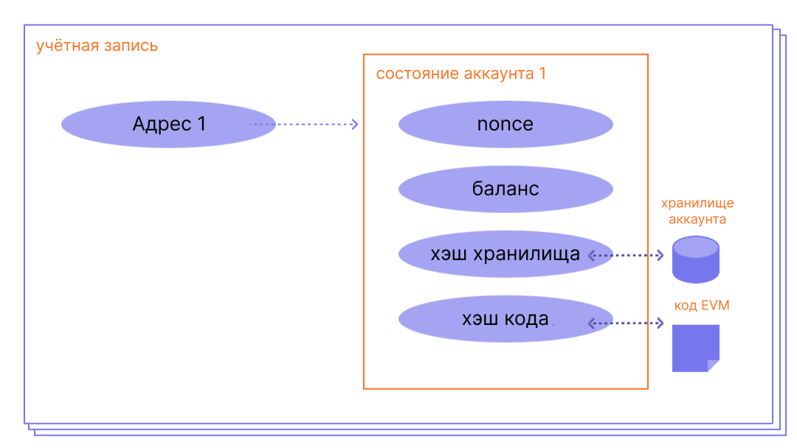

[Аккаунт](/) в Эфириуме — это сущность с балансом эфира (ETH), которая может отправлять сообщения в Эфириуме. Аккаунты могут управляться пользователями или быть развернуты как смарт-контракты.

## Предварительные требования {#prerequisites}

Чтобы лучше понять эту страницу, мы рекомендуем сначала прочитать наше [введение в Эфириум](/developers/docs/intro-to-ethereum/).

## Типы аккаунтов {#types-of-account}

В Эфириуме есть два типа аккаунтов:

- Внешний аккаунт (EOA) — контролируется любым, у кого есть приватные ключи.
- Контрактный аккаунт — смарт-контракт, развернутый в сети и управляемый кодом. Узнайте больше о [смарт-контрактах](/developers/docs/smart-contracts/).

Оба типа аккаунтов имеют возможность:

- Получать, хранить и отправлять ETH и токены.
- Взаимодействовать с развернутыми смарт-контрактами.

### Ключевые отличия {#key-differences}

**Внешние аккаунты**

- Создание аккаунта ничего не стоит.
- Могут инициировать транзакции.
- Транзакции между внешними аккаунтами могут быть только переводами ETH или токенов.
- Состоят из криптографической пары ключей: открытого и приватного ключей, которые контролируют действия аккаунта.

**Контрактные аккаунты**

- Создание контракта имеет стоимость, поскольку вы используете хранилище сети.
- Могут отправлять сообщения только в ответ на получение транзакции.
- Транзакции с внешнего аккаунта на контрактный аккаунт могут запускать код, который может выполнять множество различных действий, таких как перевод токенов или даже создание нового контракта.
- Контрактные аккаунты не имеют приватных ключей. Вместо этого они управляются логикой кода смарт-контракта.

## Изучение аккаунта {#an-account-examined}

Аккаунты в Эфириуме имеют четыре поля:

- `nonce` — счетчик, который указывает количество транзакций, отправленных с внешнего аккаунта, или количество контрактов, созданных контрактным аккаунтом. Для каждого аккаунта может быть выполнена только одна транзакция с заданным нонсом, что защищает от атак повторного воспроизведения, когда подписанные транзакции многократно транслируются и выполняются повторно.
- `balance` — количество Wei, принадлежащих этому адресу. Wei — это номинал ETH, и в 1 ETH содержится 1e+18 Wei.
- `codeHash` — этот хеш ссылается на _код_ аккаунта в виртуальной машине Эфириума (EVM). Контрактные аккаунты имеют запрограммированные фрагменты кода, которые могут выполнять различные операции. Этот код EVM выполняется, если аккаунт получает вызов сообщения. Он не может быть изменен, в отличие от других полей аккаунта. Все такие фрагменты кода содержатся в базе данных состояния под соответствующими хешами для последующего извлечения. Это значение хеша известно как codeHash. Для внешних аккаунтов поле codeHash представляет собой хеш пустой строки.
- `storageRoot` — иногда называется хешем хранилища. 256-битный хеш корневого узла [префиксного дерева Меркла-Патриции](/developers/docs/data-structures-and-encoding/patricia-merkle-trie/), который кодирует содержимое хранилища аккаунта (сопоставление между 256-битными целочисленными значениями), закодированное в дереве как сопоставление 256-битного хеша Keccak-256 от 256-битных целочисленных ключей с RLP-закодированными 256-битными целочисленными значениями. Это дерево кодирует хеш содержимого хранилища этого аккаунта и по умолчанию пусто.


_Диаграмма адаптирована из [Ethereum EVM illustrated](https://takenobu-hs.github.io/downloads/ethereum_evm_illustrated.pdf)_

## Внешние аккаунты и пары ключей {#externally-owned-accounts-and-key-pairs}

Аккаунт состоит из пары криптографических ключей: открытого и приватного. Они помогают доказать, что транзакция действительно была подписана отправителем, и предотвращают подделки. Ваш приватный ключ — это то, что вы используете для подписания транзакций, поэтому он предоставляет вам контроль над средствами, связанными с вашим аккаунтом. На самом деле вы никогда не храните криптовалюту, вы храните приватные ключи — средства всегда находятся в реестре Эфириума.

Это предотвращает трансляцию поддельных транзакций злоумышленниками, поскольку вы всегда можете проверить отправителя транзакции.

Если Алиса хочет отправить эфир со своего аккаунта на аккаунт Боба, Алисе нужно создать запрос на транзакцию и отправить его в сеть для проверки. Использование криптографии с открытым ключом в Эфириуме гарантирует, что Алиса может доказать, что именно она изначально инициировала запрос на транзакцию. Без криптографических механизмов злоумышленница Ева могла бы просто публично транслировать запрос, который выглядит примерно как «отправить 5 ETH с аккаунта Алисы на аккаунт Евы», и никто не смог бы проверить, что он исходит не от Алисы.

## Создание аккаунта {#account-creation}

Когда вы хотите создать аккаунт, большинство библиотек сгенерируют для вас случайный приватный ключ.

Приватный ключ состоит из 64 шестнадцатеричных символов и может быть зашифрован паролем.

Пример:

`fffffffffffffffffffffffffffffffebaaedce6af48a03bbfd25e8cd036415f`

Открытый ключ генерируется из приватного ключа с использованием [алгоритма цифровой подписи на эллиптических кривых](https://wikipedia.org/wiki/Elliptic_Curve_Digital_Signature_Algorithm). Вы получаете публичный адрес для своего аккаунта, взяв последние 20 байт хеша Keccak-256 от открытого ключа и добавив `0x` в начало.

Это означает, что внешний аккаунт (EOA) имеет адрес из 42 символов (20-байтовый сегмент, который представляет собой 40 шестнадцатеричных символов, плюс префикс `0x`).

Пример:

`0x5e97870f263700f46aa00d967821199b9bc5a120`

В следующем примере показано, как использовать инструмент для подписания под названием [Clef](https://geth.ethereum.org/docs/tools/clef/introduction) для генерации нового аккаунта. Clef — это инструмент для управления аккаунтами и подписания, который поставляется в комплекте с клиентом Эфириума [Geth](https://geth.ethereum.org). Команда `clef newaccount` создает новую пару ключей и сохраняет их в зашифрованном хранилище ключей.

```
> clef newaccount --keystore <path>

Пожалуйста, введите пароль для создаваемого нового аккаунта:
> <password>

------------
INFO [10-28|16:19:09.156] Ваш новый ключ сгенерирован      address=0x5e97870f263700f46aa00d967821199b9bc5a120
WARN [10-28|16:19:09.306] Пожалуйста, сделайте резервную копию файла ключа path=/home/user/go-ethereum/data/keystore/UTC--2022-10-28T15-19-08.000825927Z--5e97870f263700f46aa00d967821199b9bc5a120
WARN [10-28|16:19:09.306] Пожалуйста, запомните свой пароль!
Сгенерирован аккаунт 0x5e97870f263700f46aa00d967821199b9bc5a120
```

[Документация Geth](https://geth.ethereum.org/docs)

Можно получить новые открытые ключи из вашего приватного ключа, но вы не можете получить приватный ключ из открытых ключей. Жизненно важно хранить ваши приватные ключи в безопасности и, как следует из названия, в **ПРИВАТНОСТИ**.

Вам нужен приватный ключ для подписания сообщений и транзакций, которые выводят подпись. Затем другие могут взять подпись, чтобы получить ваш открытый ключ, доказав авторство сообщения. В своем приложении вы можете использовать библиотеку JavaScript для отправки транзакций в сеть.

## Контрактные аккаунты {#contract-accounts}

Контрактные аккаунты также имеют 42-символьный шестнадцатеричный адрес:

Пример:

`0x06012c8cf97bead5deae237070f9587f8e7a266d`

Адрес контракта обычно выдается при развертывании контракта в блокчейне Эфириума. Адрес формируется из адреса создателя и количества транзакций, отправленных с этого адреса («нонс»).

## Ключи валидатора {#validators-keys}

В Эфириуме также существует другой тип ключей, представленный, когда Эфириум перешел от консенсуса на основе доказательства выполнения работы (PoW) к доказательству доли владения. Это ключи BLS, и они используются для идентификации валидаторов. Эти ключи могут быть эффективно агрегированы для уменьшения пропускной способности, необходимой сети для достижения консенсуса. Без этой агрегации ключей минимальный стейк для валидатора был бы намного выше.

[Подробнее о ключах валидатора](/developers/docs/consensus-mechanisms/pos/keys/).

## Заметка о кошельках {#a-note-on-wallets}

Аккаунт — это не кошелек. Кошелек — это интерфейс или приложение, которое позволяет вам взаимодействовать с вашим аккаунтом в Эфириуме, будь то внешний аккаунт или контрактный аккаунт.

## Визуальная демонстрация {#a-visual-demo}

Посмотрите, как Остин рассказывает о хеш-функциях и парах ключей.

<VideoWatch slug="hash-function-eth-build" />

<VideoWatch slug="key-pair-eth-build" />

## Дополнительная литература {#further-reading}

- [Понимание аккаунтов в Эфириуме](https://info.etherscan.com/understanding-ethereum-accounts/) — Etherscan

_Знаете ресурс сообщества, который вам помог? Отредактируйте эту страницу и добавьте его!_

## Связанные темы {#related-topics}

- [Смарт-контракты](/developers/docs/smart-contracts/)
- [Транзакции](/developers/docs/transactions/)