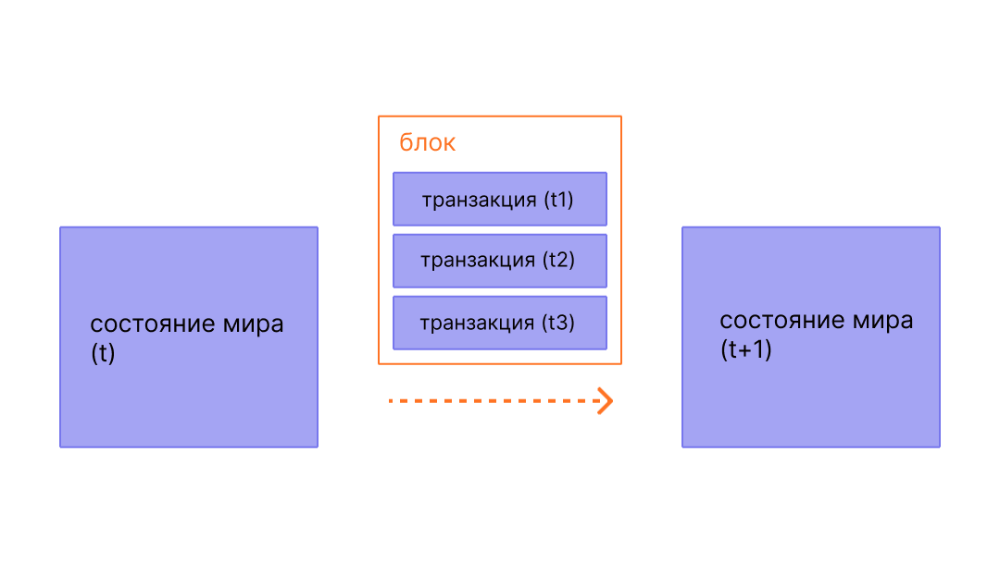

Блоки — это пакеты транзакций, содержащие хеш предыдущего блока в цепи. Это связывает блоки вместе (в цепь), поскольку хеши криптографически выводятся из данных блока. Это предотвращает мошенничество, так как одно изменение в любом историческом блоке сделает недействительными все последующие блоки, поскольку все последующие хеши изменятся, и каждый, кто поддерживает работу блокчейна, заметит это.

## Предварительные требования {#prerequisites}

Блоки — очень простая для новичков тема. Но чтобы помочь вам лучше понять эту страницу, мы рекомендуем сначала прочитать про [аккаунты](/developers/docs/accounts/), [транзакции](/developers/docs/transactions/) и наше [введение в Эфириум](/developers/docs/intro-to-ethereum/).

## Зачем нужны блоки? {#why-blocks}

Чтобы гарантировать, что все участники сети [Эфириума](/) поддерживают синхронизированное состояние и согласны с точной историей транзакций, мы объединяем транзакции в блоки. Это означает, что десятки (или сотни) транзакций фиксируются, согласовываются и синхронизируются одновременно.

_Диаграмма адаптирована из [Иллюстрированной EVM Эфириума](https://takenobu-hs.github.io/downloads/ethereum_evm_illustrated.pdf)_

Разделяя коммиты во времени, мы даем всем участникам сети достаточно времени для достижения консенсуса: хотя запросы на транзакции происходят десятки раз в секунду, блоки создаются и фиксируются в Эфириуме только раз в двенадцать секунд.

## Как работают блоки {#how-blocks-work}

Для сохранения истории транзакций блоки строго упорядочены (каждый созданный новый блок содержит ссылку на свой родительский блок), и транзакции внутри блоков также строго упорядочены. За исключением редких случаев, в любой момент времени все участники сети согласны с точным количеством и историей блоков и работают над объединением текущих активных запросов на транзакции в следующий блок.

Как только блок собирается случайно выбранным валидатором в сети, он распространяется по остальной сети; все узлы добавляют этот блок в конец своего блокчейна, и выбирается новый валидатор для создания следующего блока. Точный процесс сборки блока и процесс фиксации/консенсуса в настоящее время определяется протоколом «доказательство доли владения» (PoS) Эфириума.

## Протокол доказательства доли владения (PoS) {#proof-of-stake-protocol}

Доказательство доли владения означает следующее:

- Узлы-валидаторы должны застейкать 32 ETH в депозитный контракт в качестве залога от недобросовестного поведения. Это помогает защитить сеть, поскольку доказуемо нечестная деятельность приводит к уничтожению части или всего этого стейка.
- В каждом слоте (с интервалом в двенадцать секунд) случайным образом выбирается валидатор, который становится предлагающим блок. Он объединяет транзакции вместе, выполняет их и определяет новое «состояние». Он упаковывает эту информацию в блок и передает ее другим валидаторам.
- Другие валидаторы, которые узнают о новом блоке, повторно выполняют транзакции, чтобы убедиться, что они согласны с предложенным изменением глобального состояния. Если блок действителен, они добавляют его в свою собственную базу данных.
- Если валидатор узнает о двух конфликтующих блоках для одного и того же слота, он использует свой алгоритм выбора форка, чтобы выбрать тот, который поддерживается наибольшим количеством застейканных ETH.

[Подробнее о доказательстве доли владения](/developers/docs/consensus-mechanisms/pos)

## Что находится в блоке? {#block-anatomy}

В блоке содержится много информации. На самом высоком уровне блок содержит следующие поля:

| Поле             | Описание                                              |
| :--------------- | :---------------------------------------------------- |
| `slot`           | слот, к которому принадлежит блок                     |
| `proposer_index` | ID валидатора, предлагающего блок                     |
| `parent_root`    | хеш предыдущего блока                                 |
| `state_root`     | корневой хеш объекта состояния                        |
| `body`           | объект, содержащий несколько полей, как определено ниже |

`body` блока содержит несколько собственных полей:

| Поле                 | Описание                                         |
| :------------------- | :----------------------------------------------- |
| `randao_reveal`      | значение, используемое для выбора следующего предлагающего блок |
| `eth1_data`          | информация о депозитном контракте                |
| `graffiti`           | произвольные данные, используемые для пометки блоков |
| `proposer_slashings` | список валидаторов, которые будут подвергнуты слэшингу |
| `attester_slashings` | список аттестующих, которые будут подвергнуты слэшингу |
| `attestations`       | список аттестаций, сделанных для предыдущих слотов |
| `deposits`           | список новых депозитов в депозитный контракт     |
| `voluntary_exits`    | список валидаторов, покидающих сеть              |
| `sync_aggregate`     | подмножество валидаторов, используемых для обслуживания легких клиентов |
| `execution_payload`  | транзакции, переданные от клиента исполнения     |

Поле `attestations` содержит список всех аттестаций в блоке. Аттестации имеют свой собственный тип данных, который содержит несколько элементов данных. Каждая аттестация содержит:

| Поле               | Описание                                                       |
| :----------------- | :------------------------------------------------------------- |
| `aggregation_bits` | список валидаторов, участвовавших в этой аттестации            |
| `data`             | контейнер с несколькими подполями                              |
| `signature`        | агрегированная подпись набора валидаторов для части `data` |

Поле `data` в `attestation` содержит следующее:

| Поле                | Описание                                                        |
| :------------------ | :-------------------------------------------------------------- |
| `slot`              | слот, к которому относится аттестация                           |
| `index`             | индексы аттестующих валидаторов                                 |
| `beacon_block_root` | корневой хеш блока сигнальной цепи, рассматриваемого как вершина цепи |
| `source`            | последняя обоснованная контрольная точка                        |
| `target`            | последний блок границы эпохи                                    |

Выполнение транзакций в `execution_payload` обновляет глобальное состояние. Все клиенты повторно выполняют транзакции в `execution_payload`, чтобы убедиться, что новое состояние совпадает с полем `state_root` нового блока. Именно так клиенты могут определить, что новый блок действителен и безопасен для добавления в их блокчейн. Сам `execution payload` представляет собой объект с несколькими полями. Существует также `execution_payload_header`, который содержит важную сводную информацию о данных исполнения. Эти структуры данных организованы следующим образом:

`execution_payload_header` содержит следующие поля:

| Поле                | Описание                                                            |
| :------------------ | :------------------------------------------------------------------ |
| `parent_hash`       | хеш родительского блока                                             |
| `fee_recipient`     | адрес аккаунта для выплаты комиссий за транзакции                   |
| `state_root`        | корневой хеш глобального состояния после применения изменений в этом блоке |
| `receipts_root`     | хеш дерева квитанций транзакций                                     |
| `logs_bloom`        | структура данных, содержащая журналы событий                        |
| `prev_randao`       | значение, используемое при случайном выборе валидатора              |
| `block_number`      | номер текущего блока                                                |
| `gas_limit`         | максимальный лимит газа, разрешенный в этом блоке                   |
| `gas_used`          | фактическое количество газа, использованного в этом блоке           |
| `timestamp`         | время блока                                                         |
| `extra_data`        | произвольные дополнительные данные в виде необработанных байтов     |
| `base_fee_per_gas`  | значение базовой комиссии                                           |
| `block_hash`        | хеш блока исполнения                                                |
| `transactions_root` | корневой хеш транзакций в полезной нагрузке                         |
| `withdrawal_root`   | корневой хеш выводов в полезной нагрузке                            |

Сам `execution_payload` содержит следующее (обратите внимание, что это идентично заголовку, за исключением того, что вместо корневого хеша транзакций он включает фактический список транзакций и информацию о выводе):

| Поле               | Описание                                                            |
| :----------------- | :------------------------------------------------------------------ |
| `parent_hash`      | хеш родительского блока                                             |
| `fee_recipient`    | адрес аккаунта для выплаты комиссий за транзакции                   |
| `state_root`       | корневой хеш глобального состояния после применения изменений в этом блоке |
| `receipts_root`    | хеш дерева квитанций транзакций                                     |
| `logs_bloom`       | структура данных, содержащая журналы событий                        |
| `prev_randao`      | значение, используемое при случайном выборе валидатора              |
| `block_number`     | номер текущего блока                                                |
| `gas_limit`        | максимальный лимит газа, разрешенный в этом блоке                   |
| `gas_used`         | фактическое количество газа, использованного в этом блоке           |
| `timestamp`        | время блока                                                         |
| `extra_data`       | произвольные дополнительные данные в виде необработанных байтов     |
| `base_fee_per_gas` | значение базовой комиссии                                           |
| `block_hash`       | хеш блока исполнения                                                |
| `transactions`     | список транзакций для выполнения                                    |
| `withdrawals`      | список объектов вывода                                              |

Список `withdrawals` содержит объекты `withdrawal`, структурированные следующим образом:

| Поле             | Описание                           |
| :--------------- | :--------------------------------- |
| `address`        | адрес аккаунта, который осуществил вывод |
| `amount`         | сумма вывода                       |
| `index`          | значение индекса вывода            |
| `validatorIndex` | значение индекса валидатора        |

## Время блока {#block-time}

Время блока — это время, разделяющее блоки. В Эфириуме время делится на двенадцатисекундные единицы, называемые «слотами». В каждом слоте выбирается один валидатор, который предлагает блок. При условии, что все валидаторы находятся в сети и полностью функциональны, в каждом слоте будет блок, что означает, что время блока составляет 12 секунд. Однако иногда валидаторы могут быть не в сети, когда их вызывают для предложения блока, что означает, что слоты иногда могут оставаться пустыми.

Эта реализация отличается от систем на основе доказательства выполнения работы (PoW), где время блока является вероятностным и настраивается целевой сложностью майнинга протокола. [Среднее время блока](https://etherscan.io/chart/blocktime) Эфириума является прекрасным примером этого, когда переход от доказательства выполнения работы к доказательству доли владения можно четко проследить на основе стабильности нового 12-секундного времени блока.

## Размер блока {#block-size}

Последнее важное замечание заключается в том, что сами блоки ограничены в размере. Каждый блок имеет целевой размер в 30 миллионов газа, но размер блоков будет увеличиваться или уменьшаться в соответствии с потребностями сети, вплоть до лимита блока в 60 миллионов газа (в 2 раза больше целевого размера блока). Лимит газа блока может быть скорректирован в большую или меньшую сторону на коэффициент 1/1024 от лимита газа предыдущего блока. В результате валидаторы могут изменять лимит газа блока посредством консенсуса. Общее количество газа, затраченного всеми транзакциями в блоке, должно быть меньше лимита газа блока. Это важно, поскольку гарантирует, что блоки не могут быть произвольно большими. Если бы блоки могли быть произвольно большими, то менее производительные полные узлы постепенно перестали бы успевать за сетью из-за требований к пространству и скорости. Чем больше блок, тем больше вычислительной мощности требуется для его обработки вовремя для следующего слота. Это централизующая сила, которой противостоит ограничение размеров блоков.

## Дополнительная литература {#further-reading}

_Знаете ресурс сообщества, который помог вам? Отредактируйте эту страницу и добавьте его!_

## Связанные темы {#related-topics}

- [Транзакции](/developers/docs/transactions/)
- [Газ](/developers/docs/gas/)
- [Доказательство доли владения](/developers/docs/consensus-mechanisms/pos)