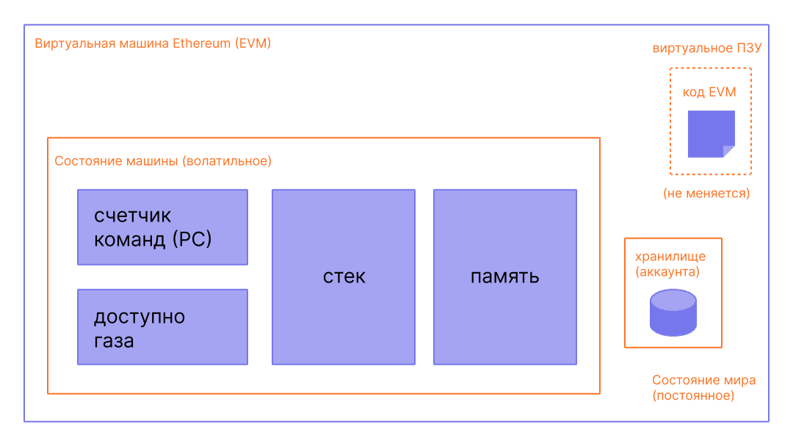

Виртуальная машина Ethereum (EVM) — это децентрализованная виртуальная среда, которая стабильно и безопасно исполняет код на всех узлах Ethereum. Узлы запускают EVM для выполнения смарт-контрактов, используя "[газ](/developers/docs/gas/)" для измерения вычислительных усилий, необходимых для [операций](/developers/docs/evm/opcodes/), обеспечивая эффективное распределение ресурсов и безопасность сети.

## Предварительные условия {#prerequisites}

Для понимания EVM необходимо базовое знакомство с общепринятой терминологией в информатике, такой как [байты](https://wikipedia.org/wiki/Byte), [память](https://wikipedia.org/wiki/Computer_memory) и [стек](https://wikipedia.org/wiki/Stack_\(abstract_data_type\)). Также было бы полезно ознакомиться с такими понятиями криптографии и блокчейна, как [хеш-функции](https://wikipedia.org/wiki/Cryptographic_hash_function) и [дерево Меркла](https://wikipedia.org/wiki/Merkle_tree).

## От реестра к машине состояний {#from-ledger-to-state-machine}

Аналогия с «распределенным реестром» часто используется для описания таких блокчейнов, как Биткойн, которые позволяют децентрализовать валюту с использованием фундаментальных инструментов криптографии. Реестр содержит запись о деятельности, которая должна соответствовать набору правил, регулирующих, что кто-то может и не может сделать для изменения реестра. Например, биткойн-адрес не может потратить больше биткойнов, чем получил ранее. Эти правила лежат в основе всех транзакций во многих блокчейнах, включая Биткойн.

Хотя у Ethereum есть собственная криптовалюта (эфир), которая следует почти тем же интуитивно понятным правилам, он также предоставляет гораздо более мощную функцию: [смарт-контракты](/developers/docs/smart-contracts/). Для этой более сложной функции требуется более сложная аналогия. Вместо распределенного реестра Ethereum представляет собой распределенную [машину состояний](https://wikipedia.org/wiki/Finite-state_machine). Состояние Ethereum — это большая структура данных, в которой хранятся не только все аккаунты и балансы, но и _состояние машины_, которое может изменяться от блока к блоку в соответствии с заранее определенным набором правил и которое может выполнять произвольный машинный код. Конкретные правила изменения состояния от блока к блоку определяются EVM.


_Схема адаптирована из [Ethereum EVM illustrated](https://takenobu-hs.github.io/downloads/ethereum_evm_illustrated.pdf)_

## Функция перехода состояний Ethereum {#the-ethereum-state-transition-function}

EVM ведет себя как математическая функция: при вводе данных производится детерминированный вывод. Поэтому будет полезно более формально описать Ethereum как имеющий **функцию перехода состояний**:

```
Y(S, T)= S'
```

Для старого валидного состояния `(S)` и нового набора валидных транзакций `(T)` функция перехода состояний Ethereum `Y(S, T)` создает новое валидное выходное состояние `S'`

### Состояние {#state}

В контексте Ethereum состояние — это огромная структура данных, называемая [модифицированным деревом Меркла-Патриции](/developers/docs/data-structures-and-encoding/patricia-merkle-trie/), в которой все [аккаунты](/developers/docs/accounts/) связаны хешами и сводятся к одному корневому хешу, хранящемуся в блокчейне.

### Транзакции {#transactions}

Транзакции — это криптографически подписанные инструкции от аккаунтов. Есть два типа транзакций: те, которые приводят к вызовам сообщений, и те, которые приводят к созданию контракта.

Создание контракта приводит к созданию нового аккаунта контракта, содержащего скомпилированный байт-код [смарт-контракта](/developers/docs/smart-contracts/anatomy/). Всякий раз, когда другая учетная запись выполняет вызов сообщения для этого контракта, она выполняет свой байткод.

## Инструкции EVM {#evm-instructions}

EVM выполняется как [стековая машина](https://wikipedia.org/wiki/Stack_machine) с глубиной стека в 1024 элемента. Каждый элемент стека — это 256-битное слово, выбранное для удобства использования в 256-битной криптографии (например, хэши Keccak-256 или подписи secp256k1).

Во время выполнения EVM поддерживает временную _память_ (в виде массива байтов с пословной адресацией), которая не сохраняется между транзакциями.

### Временное хранилище

Временное хранилище — это хранилище типа «ключ — значение» для каждой транзакции, доступ к которому осуществляется с помощью опкодов `TSTORE` и `TLOAD`. Оно сохраняется во всех внутренних вызовах в рамках одной транзакции, но очищается в конце транзакции. В отличие от памяти, временное хранилище моделируется как часть состояния EVM, а не фрейма исполнения, однако оно не фиксируется в глобальном состоянии. Временное хранилище обеспечивает эффективный с точки зрения расхода газа временный совместный доступ к состоянию между внутренними вызовами во время транзакции.

### Хранилище

Контракты содержат дерево Меркла-Патриции _хранилища_ (в виде массива слов с пословной адресацией), связанное с соответствующим аккаунтом и являющееся частью глобального состояния. Это постоянное хранилище отличается от временного хранилища, которое доступно только на время одной транзакции и не является частью дерева постоянного хранилища аккаунта.

### Машинный код

Скомпилированный байт-код смарт-контракта исполняется как набор [опкодов](/developers/docs/evm/opcodes) EVM, которые выполняют стандартные стековые операции, такие как `XOR`, `AND`, `ADD`, `SUB` и т. д. EVM также реализует ряд специфичных для блокчейна стековых операций, таких как `ADDRESS`, `BALANCE`, `BLOCKHASH` и т. д. Набор опкодов также включает `TSTORE` и `TLOAD`, которые предоставляют доступ к временному хранилищу.


_Схемы адаптированы из [Ethereum EVM illustrated](https://takenobu-hs.github.io/downloads/ethereum_evm_illustrated.pdf)_

## Реализации EVM {#evm-implementations}

Все реализации EVM должны соответствовать спецификации, описанной в Желтой книге Ethereum.

За десятилетнюю историю Ethereum EVM претерпела несколько изменений, и существует несколько реализаций EVM на различных языках программирования.

[Клиенты исполнения Ethereum](/developers/docs/nodes-and-clients/#execution-clients) включают в себя реализацию EVM. Кроме того, существует несколько автономных реализаций, включая:

- [Py-EVM](https://github.com/ethereum/py-evm) - _Python_
- [evmone](https://github.com/ethereum/evmone) - _C++_
- [ethereumjs-vm](https://github.com/ethereumjs/ethereumjs-vm) - _JavaScript_
- [revm](https://github.com/bluealloy/revm) - _Rust_

## Дополнительные материалы {#further-reading}

- [Желтая книга Ethereum](https://ethereum.github.io/yellowpaper/paper.pdf)
- [Jellopaper, также известная как KEVM: семантика EVM в K](https://jellopaper.org/)
- [Бежевая книга](https://github.com/chronaeon/beigepaper)
- [Опкоды виртуальной машины Ethereum](https://www.ethervm.io/)
- [Интерактивный справочник по опкодам виртуальной машины Ethereum](https://www.evm.codes/)
- [Краткое введение в документации Solidity](https://docs.soliditylang.org/en/latest/introduction-to-smart-contracts.html#index-6)
- [Осваиваем Ethereum — виртуальная машина Ethereum](https://github.com/ethereumbook/ethereumbook/blob/openedition/13evm.asciidoc)

## Связанные темы {#related-topics}

- [Газ](/developers/docs/gas/)
