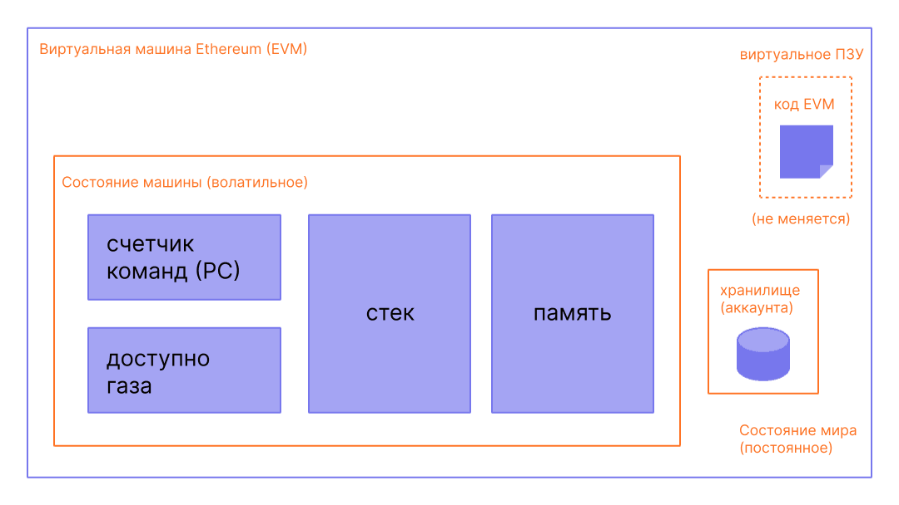
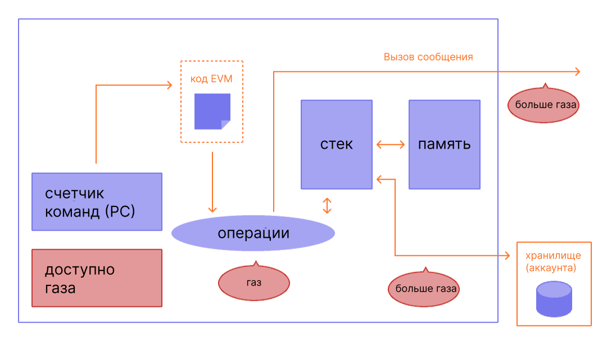

Виртуальная машина Эфириума (EVM) — это децентрализованная виртуальная среда, которая согласованно и безопасно выполняет код на всех узлах [Эфириума](/). Узлы запускают EVM для выполнения смарт-контрактов, используя «[газ](/developers/docs/gas/)» для измерения вычислительных усилий, необходимых для [операций](/developers/docs/evm/opcodes/), что обеспечивает эффективное распределение ресурсов и безопасность сети.

## Предварительные требования {#prerequisites}

Для понимания EVM необходимо базовое знакомство с общей терминологией информатики, такой как [байты](https://wikipedia.org/wiki/Byte), [память](https://wikipedia.org/wiki/Computer_memory) и [стек](<https://wikipedia.org/wiki/Stack_(abstract_data_type)>). Также будет полезно разбираться в концепциях криптографии и блокчейна, таких как [хеш-функции](https://wikipedia.org/wiki/Cryptographic_hash_function) и [дерево Меркла](https://wikipedia.org/wiki/Merkle_tree).

## От реестра к автомату состояний {#from-ledger-to-state-machine}

Аналогия «распределенного реестра» часто используется для описания блокчейнов, таких как Биткоин, которые обеспечивают работу децентрализованной криптовалюты с использованием фундаментальных инструментов криптографии. Реестр ведет запись активности, которая должна соответствовать набору правил, определяющих, что можно и чего нельзя делать для изменения реестра. Например, адрес Биткоина не может потратить больше биткоинов, чем он получил ранее. Эти правила лежат в основе всех транзакций в Биткоине и многих других блокчейнах.

Хотя у Эфириума есть собственная нативная криптовалюта (эфир), которая следует почти тем же интуитивно понятным правилам, он также обеспечивает гораздо более мощную функцию: [смарт-контракты](/developers/docs/smart-contracts/). Для этой более сложной функции требуется более сложная аналогия. Вместо распределенного реестра Эфириум представляет собой распределенный [автомат состояний](https://wikipedia.org/wiki/Finite-state_machine). Состояние Эфириума — это большая структура данных, которая содержит не только все аккаунты и балансы, но и _состояние машины_, которое может меняться от блока к блоку в соответствии с заранее определенным набором правил и которое может выполнять произвольный машинный код. Конкретные правила изменения состояния от блока к блоку определяются EVM.


_Диаграмма адаптирована из [Иллюстрированного руководства по EVM Эфириума](https://takenobu-hs.github.io/downloads/ethereum_evm_illustrated.pdf)_

## Функция перехода состояния Эфириума {#the-ethereum-state-transition-function}

EVM ведет себя как математическая функция: получая входные данные, она выдает детерминированный результат. Поэтому весьма полезно более формально описать Эфириум как имеющий **функцию перехода состояния**:

```
Y(S, T)= S'
```

Получая старое допустимое состояние `(S)` и новый набор допустимых транзакций `(T)`, функция перехода состояния Эфириума `Y(S, T)` создает новое допустимое выходное состояние `S'`

### Состояние {#state}

В контексте Эфириума состояние — это огромная структура данных, называемая [модифицированным префиксным деревом Меркла-Патриции](/developers/docs/data-structures-and-encoding/patricia-merkle-trie/), которая хранит все [аккаунты](/developers/docs/accounts/), связанные хешами и сводимые к единому корневому хешу, хранящемуся в блокчейне.

### Транзакции {#transactions}

Транзакции — это криптографически подписанные инструкции от аккаунтов. Существует два типа транзакций: те, которые приводят к вызовам сообщений, и те, которые приводят к созданию контрактов.

Создание контракта приводит к созданию нового контрактного аккаунта, содержащего скомпилированный байт-код [смарт-контракта](/developers/docs/smart-contracts/anatomy/). Всякий раз, когда другой аккаунт выполняет вызов сообщения к этому контракту, он выполняет свой байт-код.

## Инструкции EVM {#evm-instructions}

EVM работает как [стековая машина](https://wikipedia.org/wiki/Stack_machine) с глубиной 1024 элемента. Каждый элемент представляет собой 256-битное слово, что было выбрано для простоты использования с 256-битной криптографией (такой как хеши Keccak-256 или подписи secp256k1).

Во время выполнения EVM поддерживает временную _память_ (в виде массива байтов с адресацией по словам), которая не сохраняется между транзакциями.

### Временное хранилище {#transient-storage}

Временное хранилище — это хранилище пар «ключ-значение» для каждой транзакции, доступ к которому осуществляется через коды операций `TSTORE` и `TLOAD`. Оно сохраняется при всех внутренних вызовах в течение одной и той же транзакции, но очищается в конце транзакции. В отличие от памяти, временное хранилище моделируется как часть состояния EVM, а не фрейма выполнения, однако оно не фиксируется в глобальном состоянии. Временное хранилище обеспечивает эффективное с точки зрения газа совместное использование временного состояния между внутренними вызовами во время транзакции.

### Хранилище {#storage}

Контракты содержат _дерево хранилища_ Меркла-Патриции (в виде массива слов с адресацией по словам), связанное с рассматриваемым аккаунтом и являющееся частью глобального состояния. Это постоянное хранилище отличается от временного хранилища, которое доступно только на время одной транзакции и не является частью постоянного дерева хранилища аккаунта.

### Коды операций {#opcodes}

Скомпилированный байт-код смарт-контракта выполняется в виде ряда [кодов операций](/developers/docs/evm/opcodes) EVM, которые выполняют стандартные стековые операции, такие как `XOR`, `AND`, `ADD`, `SUB` и т. д. EVM также реализует ряд специфичных для блокчейна стековых операций, таких как `ADDRESS`, `BALANCE`, `BLOCKHASH` и т. д. Набор кодов операций также включает `TSTORE` и `TLOAD`, которые предоставляют доступ к временному хранилищу.


_Диаграммы адаптированы из [Иллюстрированного руководства по EVM Эфириума](https://takenobu-hs.github.io/downloads/ethereum_evm_illustrated.pdf)_

## Реализации EVM {#evm-implementations}

Все реализации EVM должны соответствовать спецификации, описанной в желтой книге Эфириума.

За десятилетнюю историю Эфириума EVM претерпела несколько изменений, и существует несколько реализаций EVM на различных языках программирования.

[Клиенты исполнения Эфириума](/developers/docs/nodes-and-clients/#execution-clients) включают реализацию EVM. Кроме того, существует множество автономных реализаций, в том числе:

- [Py-EVM](https://github.com/ethereum/py-evm) — _Python_
- [evmone](https://github.com/ethereum/evmone) — _C++_
- [ethereumjs-vm](https://github.com/ethereumjs/ethereumjs-vm) — _JavaScript_
- [revm](https://github.com/bluealloy/revm) — _Rust_

## Дополнительная литература {#further-reading}

- [Желтая книга Эфириума](https://ethereum.github.io/yellowpaper/paper.pdf)
- [Jellopaper или KEVM: семантика EVM в K](https://jellopaper.org/)
- [Бежевая книга (The Beigepaper)](https://github.com/chronaeon/beigepaper)
- [Коды операций виртуальной машины Эфириума](https://www.ethervm.io/)
- [Интерактивный справочник по кодам операций виртуальной машины Эфириума](https://www.evm.codes/)
- [Краткое введение в документации Solidity](https://docs.soliditylang.org/en/latest/introduction-to-smart-contracts.html#index-6)
- [Освоение Эфириума — Виртуальная машина Эфириума](https://github.com/ethereumbook/ethereumbook/blob/openedition/13evm.asciidoc)

## Связанные темы {#related-topics}

- [Газ](/developers/docs/gas/)

## Руководства: Виртуальная машина Эфириума (EVM) / Коды операций в Эфириуме {#tutorials}

- [Понимание спецификаций EVM в желтой книге](/developers/tutorials/yellow-paper-evm/) _— пошаговое руководство по формальной спецификации EVM из желтой книги Эфириума._
- [Обратная разработка контракта](/developers/tutorials/reverse-engineering-a-contract/) _— как выполнить обратную разработку скомпилированного смарт-контракта с использованием кодов операций EVM._