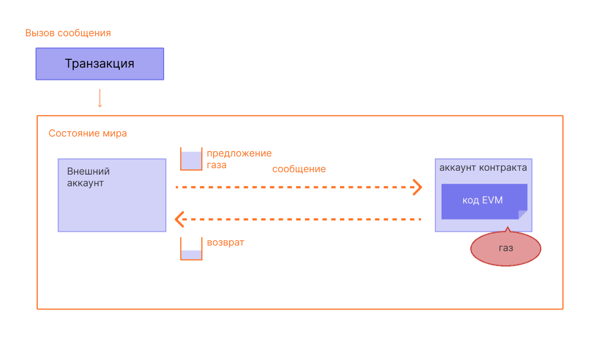

Газ жизненно важен для сети [Эфириум](/). Это топливо, которое позволяет ей работать, так же как автомобилю нужен бензин для движения.

## Предварительные требования {#prerequisites}

Для лучшего понимания этой страницы мы рекомендуем сначала прочитать про [транзакции](/developers/docs/transactions/) и [EVM](/developers/docs/evm/).

## Что такое газ? {#what-is-gas}

Газ — это единица измерения вычислительных усилий, необходимых для выполнения определенных операций в сети Эфириум.

Поскольку каждая транзакция в Эфириуме требует вычислительных ресурсов для выполнения, эти ресурсы должны быть оплачены, чтобы гарантировать, что Эфириум не уязвим для спама и не может застрять в бесконечных вычислительных циклах. Оплата за вычисления производится в виде комиссии за газ.

Комиссия за газ — это **количество газа, использованного для выполнения какой-либо операции, умноженное на стоимость единицы газа**. Комиссия выплачивается независимо от того, была ли транзакция успешной или нет.

_Схема адаптирована из [Ethereum EVM illustrated](https://takenobu-hs.github.io/downloads/ethereum_evm_illustrated.pdf)_

Комиссии за газ должны оплачиваться в собственной валюте Эфириума — эфире (ETH). Цены на газ обычно указываются в Gwei, который является номиналом ETH. Каждый Gwei равен одной миллиардной доле ETH (0,000000001 ETH или 10-9 ETH).

Например, вместо того чтобы говорить, что ваш газ стоит 0,000000001 эфира, вы можете сказать, что ваш газ стоит 1 Gwei.

Слово «Gwei» — это сокращение от «giga-wei», что означает «миллиард Wei». Один Gwei равен одному миллиарду Wei. Сам Wei (названный в честь [Вэй Дая](https://wikipedia.org/wiki/Wei_Dai), создателя [b-money](https://www.investopedia.com/terms/b/bmoney.asp)) является наименьшей единицей ETH.

## Как рассчитываются комиссии за газ? {#how-are-gas-fees-calculated}

Вы можете установить количество газа, которое готовы заплатить при отправке транзакции. Предлагая определенное количество газа, вы делаете ставку на то, чтобы ваша транзакция была включена в следующий блок. Если вы предложите слишком мало, валидаторы с меньшей вероятностью выберут вашу транзакцию для включения, что означает, что ваша транзакция может быть выполнена с опозданием или не выполнена вообще. Если вы предложите слишком много, вы можете потратить ETH впустую. Итак, как узнать, сколько платить?

Общий объем газа, который вы платите, делится на два компонента: `base fee` и `priority fee` (чаевые).

`base fee` устанавливается протоколом — вы должны заплатить как минимум эту сумму, чтобы ваша транзакция считалась действительной. `priority fee` — это чаевые, которые вы добавляете к базовой комиссии, чтобы сделать вашу транзакцию привлекательной для валидаторов, чтобы они выбрали ее для включения в следующий блок.

Транзакция, которая оплачивает только `base fee`, технически действительна, но вряд ли будет включена, поскольку она не предлагает валидаторам никаких стимулов выбрать ее вместо любой другой транзакции. «Правильная» `priority` определяется загруженностью сети в момент отправки вашей транзакции — если спрос высок, вам, возможно, придется установить `priority` выше, но когда спрос меньше, вы можете заплатить меньше.

Например, скажем, Джордан должен заплатить Тейлору 1 ETH. Перевод ETH требует 21 000 единиц газа, а базовая комиссия составляет 10 Gwei. Джордан включает чаевые в размере 2 Gwei.

Общая комиссия теперь будет равна:

`units of gas used * (base fee + priority fee)`

где `base fee` — это значение, установленное протоколом, а `priority fee` — это значение, установленное пользователем в качестве чаевых валидатору.

например, `21,000 * (10 + 2) = 252,000 gwei` (0,000252 ETH).

Когда Джордан отправляет деньги, с аккаунта Джордана будет списано 1,000252 ETH. Тейлору будет зачислено 1,0000 ETH. Валидатор получает чаевые в размере 0,000042 ETH. `base fee` в размере 0,00021 ETH сжигается.

### Базовая комиссия {#base-fee}

Каждый блок имеет базовую комиссию, которая действует как резервная цена. Чтобы иметь право на включение в блок, предложенная цена за газ должна как минимум равняться базовой комиссии. Базовая комиссия рассчитывается независимо от текущего блока и вместо этого определяется предшествующими ему блоками, что делает комиссии за транзакции более предсказуемыми для пользователей. Когда блок создается, эта **базовая комиссия «сжигается»**, изымаясь из обращения.

Базовая комиссия рассчитывается по формуле, которая сравнивает размер предыдущего блока (количество газа, использованного для всех транзакций) с целевым размером (половина лимита газа). Базовая комиссия будет увеличиваться или уменьшаться максимум на 12,5% за блок, если размер целевого блока выше или ниже целевого значения соответственно. Этот экспоненциальный рост делает экономически невыгодным сохранение большого размера блока на неопределенный срок.

| Номер блока | Включенный газ | Увеличение комиссии | Текущая базовая комиссия |
| ------------ | -----------: | -----------: | ---------------: |
| 1            |       18 млн |           0% |         100 Gwei |
| 2            |       36 млн |           0% |         100 Gwei |
| 3            |       36 млн |        12,5% |       112,5 Gwei |
| 4            |       36 млн |        12,5% |       126,6 Gwei |
| 5            |       36 млн |        12,5% |       142,4 Gwei |
| 6            |       36 млн |        12,5% |       160,2 Gwei |
| 7            |       36 млн |        12,5% |       180,2 Gwei |
| 8            |       36 млн |        12,5% |       202,7 Gwei |

В таблице выше приведен пример с использованием 36 миллионов в качестве лимита газа. Следуя этому примеру, для создания транзакции в блоке номер 9 кошелек с уверенностью сообщит пользователю, что **максимальная базовая комиссия**, которая будет добавлена к следующему блоку, составляет `current base fee * 112.5%` или `202.7 gwei * 112.5% = 228.1 gwei`.

Также важно отметить, что маловероятно, что мы увидим продолжительные всплески полных блоков из-за скорости, с которой базовая комиссия увеличивается перед полным блоком.

| Номер блока | Включенный газ | Увеличение комиссии | Текущая базовая комиссия |
| ------------ | -----------: | -----------: | ---------------: |
| 30           |       36 млн |        12,5% |      2705,6 Gwei |
| ...          |          ... |        12,5% |              ... |
| 50           |       36 млн |        12,5% |     28531,3 Gwei |
| ...          |          ... |        12,5% |              ... |
| 100          |       36 млн |        12,5% |  10302608,6 Gwei |

### Приоритетная комиссия (чаевые) {#priority-fee}

Приоритетная комиссия (чаевые) стимулирует валидаторов максимизировать количество транзакций в блоке, ограниченное только лимитом газа блока. Без чаевых рациональный валидатор мог бы включить меньше транзакций — или даже ноль — без какого-либо прямого штрафа на уровне исполнения или уровне консенсуса, поскольку вознаграждения за стейкинг не зависят от того, сколько транзакций находится в блоке. Кроме того, чаевые позволяют пользователям перебивать ставки других для получения приоритета в рамках одного и того же блока, эффективно сигнализируя о срочности. 

### Максимальная комиссия {#maxfee}

Для выполнения транзакции в сети пользователи могут указать максимальный лимит, который они готовы заплатить за выполнение своей транзакции. Этот необязательный параметр известен как `maxFeePerGas`. Чтобы транзакция была выполнена, максимальная комиссия должна превышать сумму базовой комиссии и чаевых. Отправителю транзакции возвращается разница между максимальной комиссией и суммой базовой комиссии и чаевых.

### Размер блока {#block-size}

Каждый блок имеет целевой размер, равный половине текущего лимита газа, но размер блоков будет увеличиваться или уменьшаться в соответствии со спросом в сети, вплоть до достижения лимита блока (в 2 раза больше целевого размера блока). Протокол достигает равновесного среднего размера блока на целевом уровне посредством процесса _нащупывания_ (tâtonnement). Это означает, что если размер блока больше целевого размера блока, протокол увеличит базовую комиссию для следующего блока. Аналогично, протокол уменьшит базовую комиссию, если размер блока меньше целевого размера блока.

Сумма, на которую корректируется базовая комиссия, пропорциональна тому, насколько текущий размер блока далек от целевого. Это линейный расчет от -12,5% для пустого блока, 0% при целевом размере, вплоть до +12,5% для блока, достигающего лимита газа. Лимит газа может колебаться с течением времени на основе сигналов валидаторов, а также посредством обновлений сети. Вы можете [посмотреть изменения лимита газа с течением времени здесь](https://eth.blockscout.com/stats/averageGasLimit?interval=threeMonths).

[Подробнее о блоках](/developers/docs/blocks/)

### Расчет комиссий за газ на практике {#calculating-fees-in-practice}

Вы можете явно указать, сколько готовы заплатить за выполнение вашей транзакции. Однако большинство провайдеров кошельков автоматически устанавливают рекомендуемую комиссию за транзакцию (базовая комиссия + рекомендуемая приоритетная комиссия), чтобы снизить уровень сложности для своих пользователей.

## Почему существуют комиссии за газ? {#why-do-gas-fees-exist}

Вкратце, комиссии за газ помогают поддерживать безопасность сети Эфириум. Требуя плату за каждое вычисление, выполняемое в сети, мы не позволяем злоумышленникам рассылать спам в сети. Чтобы избежать случайных или враждебных бесконечных циклов или других вычислительных потерь в коде, каждая транзакция должна устанавливать лимит на то, сколько вычислительных шагов выполнения кода она может использовать. Фундаментальной единицей вычислений является «газ».

Хотя транзакция включает лимит, любой газ, не использованный в транзакции, возвращается пользователю (например, возвращается `max fee - (base fee + tip)`).

_Схема адаптирована из [Ethereum EVM illustrated](https://takenobu-hs.github.io/downloads/ethereum_evm_illustrated.pdf)_

## Что такое лимит газа? {#what-is-gas-limit}

Лимит газа — это максимальное количество газа, которое вы готовы потратить на транзакцию. Более сложные транзакции, включающие [смарт-контракты](/developers/docs/smart-contracts/), требуют больше вычислительной работы, поэтому для них требуется более высокий лимит газа, чем для простого платежа. Стандартный перевод ETH требует лимита газа в 21 000 единиц газа.

Например, если вы установите лимит газа 50 000 для простого перевода ETH, EVM потребит 21 000, и вы получите обратно оставшиеся 29 000. Однако, если вы укажете слишком мало газа, например, лимит газа 20 000 для простого перевода ETH, транзакция завершится неудачей на этапе проверки. Она будет отклонена до включения в блок, и газ не будет потреблен. С другой стороны, если у транзакции закончится газ во время выполнения (например, смарт-контракт израсходует весь газ на полпути), EVM выполнит откат любых изменений, но весь предоставленный газ все равно будет потреблен за выполненную работу.

## Почему комиссии за газ могут быть такими высокими? {#why-can-gas-fees-get-so-high}

Высокие комиссии за газ обусловлены популярностью Эфириума. Если спрос слишком велик, пользователи должны предлагать более высокие суммы чаевых, чтобы попытаться перебить транзакции других пользователей. Более высокие чаевые могут повысить вероятность того, что ваша транзакция попадет в следующий блок. Кроме того, более сложные приложения смарт-контрактов могут выполнять множество операций для поддержки своих функций, что заставляет их потреблять много газа.

## Инициативы по снижению стоимости газа {#initiatives-to-reduce-gas-costs}

[Обновления масштабируемости](/roadmap/) Эфириума в конечном итоге должны решить некоторые проблемы с комиссиями за газ, что, в свою очередь, позволит платформе обрабатывать тысячи транзакций в секунду и масштабироваться на глобальном уровне.

Масштабирование на уровне 2 (l2) — это основная инициатива по значительному улучшению стоимости газа, пользовательского опыта и масштабируемости.

[Подробнее о масштабировании на уровне 2 (l2)](/developers/docs/scaling/#layer-2-scaling)

## Мониторинг комиссий за газ {#monitoring-gas-fees}

Если вы хотите отслеживать цены на газ, чтобы отправлять свои ETH дешевле, вы можете использовать множество различных инструментов, таких как:

- [Etherscan](https://etherscan.io/gastracker) _Оценщик цены газа для транзакций_
- [Blockscout](https://eth.blockscout.com/gas-tracker) _Оценщик цены газа для транзакций с открытым исходным кодом_
- [ETH Gas Tracker](https://www.ethgastracker.com/) _Мониторинг и отслеживание цен на газ в Эфириуме и на уровне 2 (l2) для снижения комиссий за транзакции и экономии денег_
- [Blocknative ETH Gas Estimator](https://chrome.google.com/webstore/detail/blocknative-eth-gas-estim/ablbagjepecncofimgjmdpnhnfjiecfm) _Расширение для Хрома для оценки газа, поддерживающее как устаревшие транзакции типа 0, так и транзакции типа 2 EIP-1559._
- [Cryptoneur Gas Fees Calculator](https://cryptoneur.xyz/en/gas-fees-calculator) _Расчет комиссий за газ в вашей местной валюте для различных типов транзакций в Мейннете, Arbitrum и Polygon._

## Связанные инструменты {#related-tools}

- [Blocknative's Gas Platform](https://www.blocknative.com/gas) _API для оценки газа на базе глобальной платформы данных мемпула Blocknative_
- [Gas Network](https://gas.network) Ончейн-оракулы газа. Поддержка более 35 сетей. 

## Дополнительная литература {#further-reading}

- [Объяснение газа в Эфириуме](https://defiprime.com/gas)
- [Снижение потребления газа вашими смарт-контрактами](https://medium.com/coinmonks/8-ways-of-reducing-the-gas-consumption-of-your-smart-contracts-9a506b339c0a)
- [Стратегии оптимизации газа для разработчиков](https://www.alchemy.com/overviews/solidity-gas-optimization)
- [Документация EIP-1559](https://eips.ethereum.org/EIPS/eip-1559).
- [Ресурсы Tim Beiko по EIP-1559](https://hackmd.io/@timbeiko/1559-resources)
- [EIP-1559: Отделение механизмов от мемов](https://web.archive.org/web/20241126205908/https://research.2077.xyz/eip-1559-separating-mechanisms-from-memes)
