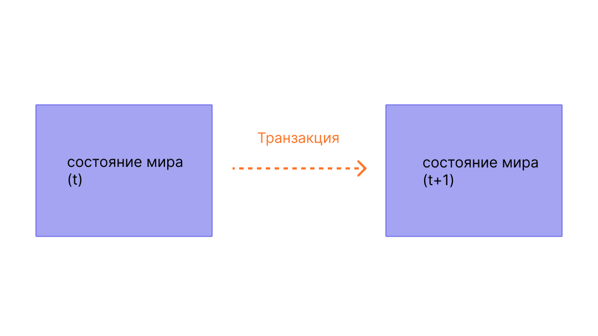

Транзакции — это криптографически подписанные инструкции от аккаунтов. Аккаунт инициирует транзакцию для обновления состояния сети Ethereum. Самая простая транзакция — перевод ETH с одного аккаунта на другой.

## Предварительные условия {#prerequisites}

Чтобы помочь вам лучше понять эту страницу, мы рекомендуем сначала прочитать [Аккаунты](/developers/docs/accounts/) и наше [введение в Ethereum](/developers/docs/intro-to-ethereum/).

## Что такое транзакция? {#whats-a-transaction}

Транзакция Ethereum относится к действию, инициированному внешним аккаунтом, то есть аккаунтом, управляемым человеком, а не контрактом. Например, если Боб отправляет Алисе 1 ETH, аккаунт Боба должен быть дебетован, а счет Алисы — кредитован. Это действие по изменению состояния происходит внутри транзакции.


_Диаграмма адаптирована из [Ethereum EVM illustrated](https://takenobu-hs.github.io/downloads/ethereum_evm_illustrated.pdf)_

Транзакции, которые изменяют состояние EVM, должны транслироваться по всей сети. Любой узел может транслировать запрос на выполнение транзакции на EVM; после этого валидатор выполнит транзакцию и распространит результирующее измененное состояние на остальную часть сети.

Транзакции требуют уплаты комиссии и должны быть включены в подтвержденный блок. Чтобы упростить этот обзор, мы рассмотрим плату за газ и валидацию в другом месте.

Отправленная транзакция включает следующую информацию:

- `from` — адрес отправителя, который будет подписывать транзакцию. Это будет внешний аккаунт, поскольку аккаунты контрактов не могут отправлять транзакции
- `to` — адрес получателя (если это внешний аккаунт, транзакция передаст стоимость. Если это аккаунт контракта, транзакция выполнит код контракта).
- `signature` — идентификатор отправителя. Он генерируется, когда приватный ключ отправителя подписывает транзакцию и подтверждает, что отправитель авторизовал эту транзакцию.
- `nonce` — последовательно увеличивающийся счетчик, который указывает номер транзакции для аккаунта
- `value` — сумма ETH для перевода от отправителя получателю (указывается в WEI, где 1 ETH равен 1e+18 wei)
- `input data` — необязательное поле для включения произвольных данных.
- `gasLimit` — максимальное количество единиц газа, которое может быть потреблено транзакцией. [EVM](/developers/docs/evm/opcodes) определяет количество единиц газа, необходимое для каждого вычислительного шага
- `maxPriorityFeePerGas` — максимальная цена потребленного газа, которая будет включена в качестве чаевых для валидатора
- `maxFeePerGas` — максимальная комиссия за единицу газа, которую готовы заплатить за транзакцию (включая `baseFeePerGas` и `maxPriorityFeePerGas`)

Газ — это ссылка на вычисления, необходимые для обработки транзакции валидатором. Пользователи должны платить за это вычисление. `gasLimit` и `maxPriorityFeePerGas` определяют максимальную комиссию за транзакцию, выплачиваемую валидатору. [Подробнее о газе](/developers/docs/gas/).

Объект транзакции будет выглядеть примерно так:

```js
{
  from: "0xEA674fdDe714fd979de3EdF0F56AA9716B898ec8",
  to: "0xac03bb73b6a9e108530aff4df5077c2b3d481e5a",
  gasLimit: "21000",
  maxFeePerGas: "300",
  maxPriorityFeePerGas: "10",
  nonce: "0",
  value: "10000000000"
}
```

Но объект транзакции должен быть подписан с использованием приватного ключа отправителя. Это доказывает, что транзакция могла исходить только от отправителя и не была отправлена ​​обманным путем.

Клиент Ethereum, такой как Geth, будет обрабатывать этот процесс подписи.

Пример вызова [JSON-RPC](/developers/docs/apis/json-rpc):

```json
{
  "id": 2,
  "jsonrpc": "2.0",
  "method": "account_signTransaction",
  "params": [
    {
      "from": "0x1923f626bb8dc025849e00f99c25fe2b2f7fb0db",
      "gas": "0x55555",
      "maxFeePerGas": "0x1234",
      "maxPriorityFeePerGas": "0x1234",
      "input": "0xabcd",
      "nonce": "0x0",
      "to": "0x07a565b7ed7d7a678680a4c162885bedbb695fe0",
      "value": "0x1234"
    }
  ]
}
```

Пример ответа:

```json
{
  "jsonrpc": "2.0",
  "id": 2,
  "result": {
    "raw": "0xf88380018203339407a565b7ed7d7a678680a4c162885bedbb695fe080a44401a6e4000000000000000000000000000000000000000000000000000000000000001226a0223a7c9bcf5531c99be5ea7082183816eb20cfe0bbc322e97cc5c7f71ab8b20ea02aadee6b34b45bb15bc42d9c09de4a6754e7000908da72d48cc7704971491663",
    "tx": {
      "nonce": "0x0",
      "maxFeePerGas": "0x1234",
      "maxPriorityFeePerGas": "0x1234",
      "gas": "0x55555",
      "to": "0x07a565b7ed7d7a678680a4c162885bedbb695fe0",
      "value": "0x1234",
      "input": "0xabcd",
      "v": "0x26",
      "r": "0x223a7c9bcf5531c99be5ea7082183816eb20cfe0bbc322e97cc5c7f71ab8b20e",
      "s": "0x2aadee6b34b45bb15bc42d9c09de4a6754e7000908da72d48cc7704971491663",
      "hash": "0xeba2df809e7a612a0a0d444ccfa5c839624bdc00dd29e3340d46df3870f8a30e"
    }
  }
}
```

- `raw` — это подписанная транзакция в закодированном виде с [префиксом рекурсивной длины (RLP)](/developers/docs/data-structures-and-encoding/rlp)
- `tx` — это подписанная транзакция в формате JSON

С помощью хэша подписи можно криптографически доказать, что транзакция пришла от отправителя и была отправлена ​​в сеть.

### Поле данных {#the-data-field}

В подавляющем большинстве операций доступ к контракту осуществляется с внешнего аккаунта.
Большинство контрактов написаны на Solidity и интерпретируют свое поле данных в соответствии с [двоичным интерфейсом приложения (ABI)](/glossary/#abi).

Первые четыре байта указывают, какую функцию следует вызвать, используя хэш имени функции и ее аргументов.
Иногда можно определить функцию по селектору, используя [эту базу данных](https://www.4byte.directory/signatures/).

Остальная часть calldata — это аргументы, [закодированные в соответствии со спецификациями ABI](https://docs.soliditylang.org/en/latest/abi-spec.html#formal-specification-of-the-encoding).

Например, давайте посмотрим на [эту транзакцию](https://etherscan.io/tx/0xd0dcbe007569fcfa1902dae0ab8b4e078efe42e231786312289b1eee5590f6a1).
Используйте **Click to see More**, чтобы просмотреть данные calldata.

Селектор функции — `0xa9059cbb`. Существует несколько [известных функций с этой подписью](https://www.4byte.directory/signatures/?bytes4_signature=0xa9059cbb).
В данном случае [исходный код контракта](https://etherscan.io/address/0xa0b86991c6218b36c1d19d4a2e9eb0ce3606eb48#code) был загружен в Etherscan, поэтому мы знаем, что функцией является `transfer(address,uint256)`.

Остальные данные таковы:

```
0000000000000000000000004f6742badb049791cd9a37ea913f2bac38d01279
000000000000000000000000000000000000000000000000000000003b0559f4
```

Согласно спецификациям ABI целочисленные значения (такие как адреса, которые являются 20-байтовыми целыми числами) отображаются в ABI как 32-байтовые слова, заполненные нулями спереди.
Таким образом, мы знаем, что адрес `to` — [`4f6742badb049791cd9a37ea913f2bac38d01279`](https://etherscan.io/address/0x4f6742badb049791cd9a37ea913f2bac38d01279).
Значение `value` равно 0x3b0559f4 = 990206452.

## Типы транзакций {#types-of-transactions}

В Ethereum существует несколько различных типов транзакций:

- Обычные транзакции: транзакция с одной учетной записи на другую.
- Транзакции развертывания контракта: транзакция без адреса «to», где поле данных используется для кода контракта.
- Исполнение контракта: транзакция, которая взаимодействует с развернутым умным контрактом. В этом случае адрес «to» — это адрес умного контракта.

### О газе {#on-gas}

Как уже упоминалось, для выполнения транзакций требуется [газ](/developers/docs/gas/). Для простых транзакций перевода требуется 21 000 единиц газа.

Итак, чтобы Боб отправил Алисе 1 ETH при `baseFeePerGas` в 190 gwei и `maxPriorityFeePerGas` в 10 gwei, Бобу нужно будет заплатить следующую комиссию:

```
(190 + 10) * 21 000 = 4 200 000 gwei
--или--
0,0042 ETH
```

Со счета Боба будет списано **-1,0042 ETH** (1 ETH для Алисы + 0,0042 ETH в виде комиссии за газ).

На счет Алисы будет зачислено **+1,0 ETH**

Базовая комиссия будет сожжена **-0,00399 ETH**

Валидатор получает чаевые **+0,000210 ETH**


_Диаграмма адаптирована из [Ethereum EVM illustrated](https://takenobu-hs.github.io/downloads/ethereum_evm_illustrated.pdf)_

Любой газ, не использованный в транзакции, возвращается в аккаунт пользователя.

### Взаимодействие со смарт-контрактами {#smart-contract-interactions}

Газ необходим для любой транзакции, которая связана со смарт-контрактом.

Смарт-контракты также могут содержать функции, известные как функции [`view`](https://docs.soliditylang.org/en/latest/contracts.html#view-functions) или [`pure`](https://docs.soliditylang.org/en/latest/contracts.html#pure-functions), которые не изменяют состояние контракта. Поэтому для вызова этих функций из внешней учетной записи (EOA) не требуется газ. Основной вызов RPC для этого сценария — [`eth_call`](/developers/docs/apis/json-rpc#eth_call).

В отличие от доступа через `eth_call`, эти функции `view` или `pure` также часто вызываются внутренне (т. е. из самого контракта или из другого контракта), что требует затрат газа.

## Жизненный цикл транзакции {#transaction-lifecycle}

После отправки транзакции происходит следующее:

1. Хэш транзакции генерируется криптографически:
   `0x97d99bc7729211111a21b12c933c949d4f31684f1d6954ff477d0477538ff017`
2. Затем транзакция транслируется в сеть и добавляется в пул транзакций, состоящий из всех других ожидающих транзакций сети.
3. Валидатор должен взять вашу транзакцию и включить ее в блок, чтобы подтвердить транзакцию и признать ее «успешной».
4. По прошествии времени блок, содержащий вашу транзакцию, будет обновлен до уровня «утвержденный», а затем «завершенный» Эти обновления делают гораздо
   более вероятным, что ваша транзакция была успешной и никогда не будет изменена. Как только блок будет «финализирован», его можно будет изменить
   только путем атаки на уровне сети, которая будет стоить многие миллиарды долларов.

## Наглядная демонстрация {#a-visual-demo}

Посмотрите, как Остин рассказывает о транзакциях, газе и майнинге.

<YouTube id="er-0ihqFQB0" />

## Типизированный конверт транзакции {#typed-transaction-envelope}

Ethereum изначально имел один формат транзакций. Каждая транзакция содержала значение nonce, цену на газ, лимит газа, адрес, значение, данные, v, r и s. Эти поля [кодируются с помощью RLP](/developers/docs/data-structures-and-encoding/rlp/), и выглядят примерно так:

`RLP([nonce, gasPrice, gasLimit, to, value, data, v, r, s])`

Ethereum эволюционировал и теперь поддерживает несколько типов транзакций, что позволяет реализовывать новые функции, такие как списки доступа и [EIP-1559](https://eips.ethereum.org/EIPS/eip-1559), не затрагивая устаревшие форматы транзакций.

Именно [EIP-2718](https://eips.ethereum.org/EIPS/eip-2718) обеспечивает такое поведение. Транзакции интепретируются следующим образом:

`TransactionType || TransactionPayload`

Где поля определяются так:

- `TransactionType` — число от 0 до 0x7f, что в сумме дает 128 возможных типов транзакций.
- `TransactionPayload` — произвольный массив байтов, определяемый типом транзакции.

В зависимости от значения `TransactionType` транзакцию можно классифицировать как:

1. **Транзакции типа 0 (устаревшие):** исходный формат транзакций, используемый с момента запуска Ethereum. Они не включают такие функции из [EIP-1559](https://eips.ethereum.org/EIPS/eip-1559), как динамический расчет комиссии за газ или списки доступа для смарт-контрактов. Устаревшие транзакции не имеют определенного префикса, указывающего их тип в сериализованной форме, и начинаются с байта `0xf8` при использовании кодировки [префикса рекурсивной длины (RLP)](/developers/docs/data-structures-and-encoding/rlp). Значение `TransactionType` для этих транзакций равно `0x0`.

2. **Транзакции типа 1:** Эти транзакции, представленные в [EIP-2930](https://eips.ethereum.org/EIPS/eip-2930) в рамках [обновления Berlin](/ethereum-forks/#berlin) для Ethereum, включают параметр `accessList`. Этот список определяет адреса и ключи хранилища, к которым, как ожидается, будет обращаться транзакция, что помогает потенциально снизить затраты на [газ](/developers/docs/gas/) для сложных транзакций с участием смарт-контрактов. Изменения рынка комиссий EIP-1559 не включены в транзакции типа 1. Транзакции типа 1 также включают параметр `yParity`, который может быть либо `0x0`, либо `0x1` и указывает на четность y-значения подписи secp256k1. Они идентифицируются по начальному байту `0x01`, а их значение `TransactionType` равно `0x1`.

3. **Транзакции типа 2**, широко известные как транзакции EIP-1559, это транзакции, введенные в [EIP-1559](https://eips.ethereum.org/EIPS/eip-1559) в рамках [обновления London](/ethereum-forks/#london) для Ethereum. Они стали стандартным типом транзакций в сети Ethereum. Эти транзакции создают новый механизм рынка комиссий, который повышает предсказуемость, разделяя комиссию за транзакции на базовую и приоритетную. Они начинаются с байта `0x02` и включают такие поля, как `maxPriorityFeePerGas` и `maxFeePerGas`. Транзакции типа 2 теперь являются стандартными из-за их гибкости и эффективности, особенно предпочтительны в периоды высокой загруженности сети из-за их способности помочь пользователям управлять комиссиями за транзакции более предсказуемо. Значение `TransactionType` для этих транзакций равно `0x2`.

4. **Транзакции типа 3 (Blob)** были введены в [EIP-4844](https://eips.ethereum.org/EIPS/eip-4844) в рамках [обновления Dencun](/ethereum-forks/#dencun) в Ethereum. Эти транзакции предназначены для более эффективной обработки данных типа blob (Binary Large Objects), что особенно выгодно для ролл-апов уровня 2, поскольку они предоставляют способ публикации данных в сети Ethereum по более низкой цене. Транзакции типа blob включают дополнительные поля, такие как `blobVersionedHashes`, `maxFeePerBlobGas` и `blobGasPrice`. Они начинаются с байта `0x03`, а их значение `TransactionType` равно `0x3`. Транзакции типа blob представляют собой значительное улучшение доступности данных и возможностей масштабирования Ethereum.

5. **Транзакции типа 4** были введены в [EIP-7702](https://eips.ethereum.org/EIPS/eip-7702) в рамках [обновления Pectra](/roadmap/pectra/) в Ethereum. Эти транзакции разработаны с учетом прямой совместимости с абстракцией аккаунтов. Они позволяют EOA временно вести себя как аккаунты смарт-контрактов, не нарушая их исходной функциональности. Они включают параметр `authorization_list`, который указывает смарт-контракт, которому EOA делегирует свои полномочия. После транзакции поле кода EOA будет содержать адрес делегированного смарт-контракта.

## Дополнительные материалы {#further-reading}

- [EIP-2718: Типизированный конверт транзакции](https://eips.ethereum.org/EIPS/eip-2718)

_Знаете ресурс сообщества, который вам пригодился? Измените эту страницу и добавьте его!_

## Смежные темы {#related-topics}

- [Аккаунты](/developers/docs/accounts/)
- [Виртуальная машина Ethereum (EVM)](/developers/docs/evm/)
- [Газ](/developers/docs/gas/)
