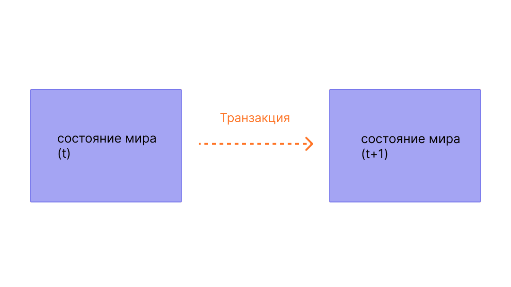

Транзакции — это криптографически подписанные инструкции от аккаунтов. Аккаунт инициирует транзакцию для обновления состояния сети [Эфириум](/). Самая простая транзакция — это перевод ETH с одного аккаунта на другой.

## Предварительные требования {#prerequisites}

Чтобы лучше понять эту страницу, мы рекомендуем сначала прочитать про [аккаунты](/developers/docs/accounts/) и наше [введение в Эфириум](/developers/docs/intro-to-ethereum/).

## Что такое транзакция? {#whats-a-transaction}

Транзакция Эфириума — это действие, инициированное внешне принадлежащим аккаунтом (externally-owned account, EOA), то есть аккаунтом, управляемым человеком, а не контрактом. Например, если Боб отправляет Алисе 1 ETH, счет Боба должен быть списан, а счет Алисы — пополнен. Это действие, изменяющее состояние, происходит в рамках транзакции.


_Схема адаптирована из [Ethereum EVM illustrated](https://takenobu-hs.github.io/downloads/ethereum_evm_illustrated.pdf)_

Транзакции, которые изменяют состояние EVM, должны транслироваться всей сети. Любой узел может транслировать запрос на выполнение транзакции в EVM; после этого валидатор выполнит транзакцию и распространит полученное изменение состояния на остальную часть сети.

Транзакции требуют комиссии и должны быть включены в проверенный блок. Чтобы упростить этот обзор, мы рассмотрим комиссии за газ и валидацию в другом месте.

Отправленная транзакция включает следующую информацию:

- `from` — адрес отправителя, который будет подписывать транзакцию. Это будет внешне принадлежащий аккаунт, так как контрактные аккаунты не могут отправлять транзакции
- `to` — адрес получателя (если это внешне принадлежащий аккаунт, транзакция переведет средства. Если это контрактный аккаунт, транзакция выполнит код контракта)
- `signature` — идентификатор отправителя. Он генерируется, когда приватный ключ отправителя подписывает транзакцию и подтверждает, что отправитель авторизовал эту транзакцию
- `nonce` — последовательно увеличивающийся счетчик, который указывает номер транзакции с аккаунта (нонс)
- `value` — сумма ETH для перевода от отправителя к получателю (выраженная в Wei, где 1 ETH равен 1e+18 Wei)
- `input data` — необязательное поле для включения произвольных данных
- `gasLimit` — максимальное количество единиц газа, которое может быть потреблено транзакцией (лимит газа). [EVM](/developers/docs/evm/opcodes) определяет единицы газа, необходимые для каждого вычислительного шага
- `maxPriorityFeePerGas` — максимальная цена потребленного газа, которая будет включена в качестве чаевых валидатору
- `maxFeePerGas` — максимальная комиссия за единицу газа, которую готовы заплатить за транзакцию (включая `baseFeePerGas` и `maxPriorityFeePerGas`)

Газ — это ссылка на вычисления, необходимые для обработки транзакции валидатором. Пользователи должны платить комиссию за эти вычисления. `gasLimit` и `maxPriorityFeePerGas` определяют максимальную комиссию за транзакцию, выплачиваемую валидатору. [Подробнее о газе](/developers/docs/gas/).

Объект транзакции будет выглядеть примерно так:

```js
{
  from: "0xEA674fdDe714fd979de3EdF0F56AA9716B898ec8",
  to: "0xac03bb73b6a9e108530aff4df5077c2b3d481e5a",
  gasLimit: "21000",
  maxFeePerGas: "300",
  maxPriorityFeePerGas: "10",
  nonce: "0",
  value: "10000000000"
}
```

Но объект транзакции должен быть подписан с использованием приватного ключа отправителя. Это доказывает, что транзакция могла исходить только от отправителя и не была отправлена мошенническим путем.

Клиент Эфириума, такой как Go Ethereum (Geth), будет обрабатывать этот процесс подписания.

Пример вызова [JSON-RPC](/developers/docs/apis/json-rpc):

```json
{
  "id": 2,
  "jsonrpc": "2.0",
  "method": "account_signTransaction",
  "params": [
    {
      "from": "0x1923f626bb8dc025849e00f99c25fe2b2f7fb0db",
      "gas": "0x55555",
      "maxFeePerGas": "0x1234",
      "maxPriorityFeePerGas": "0x1234",
      "input": "0xabcd",
      "nonce": "0x0",
      "to": "0x07a565b7ed7d7a678680a4c162885bedbb695fe0",
      "value": "0x1234"
    }
  ]
}
```

Пример ответа:

```json
{
  "jsonrpc": "2.0",
  "id": 2,
  "result": {
    "raw": "0xf88380018203339407a565b7ed7d7a678680a4c162885bedbb695fe080a44401a6e4000000000000000000000000000000000000000000000000000000000000001226a0223a7c9bcf5531c99be5ea7082183816eb20cfe0bbc322e97cc5c7f71ab8b20ea02aadee6b34b45bb15bc42d9c09de4a6754e7000908da72d48cc7704971491663",
    "tx": {
      "nonce": "0x0",
      "maxFeePerGas": "0x1234",
      "maxPriorityFeePerGas": "0x1234",
      "gas": "0x55555",
      "to": "0x07a565b7ed7d7a678680a4c162885bedbb695fe0",
      "value": "0x1234",
      "input": "0xabcd",
      "v": "0x26",
      "r": "0x223a7c9bcf5531c99be5ea7082183816eb20cfe0bbc322e97cc5c7f71ab8b20e",
      "s": "0x2aadee6b34b45bb15bc42d9c09de4a6754e7000908da72d48cc7704971491663",
      "hash": "0xeba2df809e7a612a0a0d444ccfa5c839624bdc00dd29e3340d46df3870f8a30e"
    }
  }
}
```

- `raw` — это подписанная транзакция в закодированной форме [Recursive Length Prefix (RLP)](/developers/docs/data-structures-and-encoding/rlp)
- `tx` — это подписанная транзакция в формате JSON

С помощью хеша подписи можно криптографически доказать, что транзакция исходила от отправителя и была отправлена в сеть.

### Поле данных {#the-data-field}

Подавляющее большинство транзакций обращаются к контракту с внешне принадлежащего аккаунта.
Большинство контрактов написаны на Solidity и интерпретируют свое поле данных в соответствии с [двоичным интерфейсом приложения (ABI)](/glossary/#abi).

Первые четыре байта указывают, какую функцию вызывать, используя хеш имени функции и ее аргументов.
Иногда вы можете определить функцию по селектору, используя [эту базу данных](https://www.4byte.directory/signatures/).

Остальная часть данных вызова (calldata) — это аргументы, [закодированные в соответствии со спецификациями ABI](https://docs.soliditylang.org/en/latest/abi-spec.html#formal-specification-of-the-encoding).

Например, давайте посмотрим на [эту транзакцию](https://etherscan.io/tx/0xd0dcbe007569fcfa1902dae0ab8b4e078efe42e231786312289b1eee5590f6a1).
Используйте **Click to see More** (Нажмите, чтобы увидеть больше), чтобы просмотреть данные вызова.

Селектор функции — `0xa9059cbb`. Существует несколько [известных функций с этой подписью](https://www.4byte.directory/signatures/?bytes4_signature=0xa9059cbb).
В данном случае [исходный код контракта](https://etherscan.io/address/0xa0b86991c6218b36c1d19d4a2e9eb0ce3606eb48#code) был загружен на Etherscan, поэтому мы знаем, что это функция `transfer(address,uint256)`.

Остальные данные:

```
0000000000000000000000004f6742badb049791cd9a37ea913f2bac38d01279
000000000000000000000000000000000000000000000000000000003b0559f4
```

Согласно спецификациям ABI, целочисленные значения (такие как адреса, которые являются 20-байтовыми целыми числами) отображаются в ABI как 32-байтовые слова, дополненные нулями спереди.
Поэтому мы знаем, что адрес `to` — это [`4f6742badb049791cd9a37ea913f2bac38d01279`](https://etherscan.io/address/0x4f6742badb049791cd9a37ea913f2bac38d01279).
`value` равно 0x3b0559f4 = 990206452.

### Дескрипторы транзакций {#transaction-descriptors}

Поскольку поле данных содержит непрозрачные шестнадцатеричные байты, может быть крайне сложно проверить, какое действие на самом деле выполнит транзакция. Эта уязвимость «слепого подписания» устраняется с помощью **[прозрачного подписания (Clear Signing)](https://clearsigning.org/)** за счет использования [дескрипторов транзакций](https://eips.ethereum.org/EIPS/eip-7730) (определенных в ERC-7730).  

Спецификация ERC-7730 использует дескрипторы транзакций (часто структурированные как файлы JSON) для обогащения данных, содержащихся в ABI и структурированных сообщениях, таких как данные вызова транзакций EVM, сообщения EIP-712 и пользовательские операции (User Operations) EIP-4337. Разработчики используют эти дескрипторы для сопоставления конкретных переменных транзакции непосредственно с шаблонами форматирования, гарантируя, что базовые данные остаются машиночитаемыми для приложений.

На фронтенде кошельки используют этот контекст форматирования для перевода непрозрачного байт-кода в понятную, удобочитаемую информацию. Автоматически преобразуя такие значения, как адреса токенов, в распознаваемые тикеры, или суммы в десятичные дроби, пользователи получают сводку точного намерения транзакции на простом языке (например, «Своп 1000 USDC на как минимум 0.25 обернутого эфира (WETH)») перед тем, как они ее подпишут.

## Типы транзакций {#types-of-transactions}

В Эфириуме существует несколько различных типов транзакций:

- Обычные транзакции: транзакция с одного аккаунта на другой.
- Транзакции развертывания контракта: транзакция без адреса получателя ('to'), где поле данных используется для кода контракта.
- Выполнение контракта: транзакция, которая взаимодействует с развернутым смарт-контрактом. В этом случае адрес получателя ('to') — это адрес смарт-контракта.

### О газе {#on-gas}

Как уже упоминалось, выполнение транзакций требует [газа](/developers/docs/gas/). Простые транзакции перевода требуют 21000 единиц газа.

Таким образом, чтобы Боб отправил Алисе 1 ETH при `baseFeePerGas` в 190 Gwei и `maxPriorityFeePerGas` в 10 Gwei, Бобу нужно будет заплатить следующую комиссию:

```
(190 + 10) * 21000 = 4,200,000 gwei
--или--
0.0042 ETH
```

Со счета Боба будет списано **-1.0042 ETH** (1 ETH для Алисы + 0.0042 ETH в виде комиссии за газ)

На счет Алисы будет зачислено **+1.0 ETH**

Базовая комиссия будет сожжена **-0.00399 ETH**

Валидатор оставляет себе чаевые **+0.000210 ETH**


_Схема адаптирована из [Ethereum EVM illustrated](https://takenobu-hs.github.io/downloads/ethereum_evm_illustrated.pdf)_

Любой газ, не использованный в транзакции, возвращается на аккаунт пользователя.

### Взаимодействие со смарт-контрактами {#smart-contract-interactions}

Газ требуется для любой транзакции, в которой задействован смарт-контракт.

Смарт-контракты также могут содержать функции, известные как функции [`view`](https://docs.soliditylang.org/en/latest/contracts.html#view-functions) или [`pure`](https://docs.soliditylang.org/en/latest/contracts.html#pure-functions), которые не изменяют состояние контракта. Таким образом, вызов этих функций с EOA не потребует газа. Базовым вызовом RPC для этого сценария является [`eth_call`](/developers/docs/apis/json-rpc#eth_call).

В отличие от доступа с использованием `eth_call`, эти функции `view` или `pure` также часто вызываются внутренне (то есть из самого контракта или из другого контракта), что требует затрат газа.

## Жизненный цикл транзакции {#transaction-lifecycle}

После отправки транзакции происходит следующее:

1. Криптографически генерируется хеш транзакции:
   `0x97d99bc7729211111a21b12c933c949d4f31684f1d6954ff477d0477538ff017`
2. Затем транзакция транслируется в сеть и добавляется в пул транзакций, состоящий из всех остальных ожидающих транзакций сети.
3. Валидатор должен выбрать вашу транзакцию и включить ее в блок, чтобы проверить транзакцию и считать ее «успешной».
4. Со временем блок, содержащий вашу транзакцию, будет обновлен до статуса «обоснованный» (justified), а затем «финализированный» (finalized). Эти обновления дают гораздо большую уверенность в том, что ваша транзакция была успешной и никогда не будет изменена. Как только блок становится «финализированным», его можно изменить только с помощью атаки на уровне сети, которая будет стоить много миллиардов долларов.

## Визуальная демонстрация {#a-visual-demo}

Посмотрите, как Остин рассказывает о транзакциях, газе и майнинге.

<VideoWatch slug="transactions-eth-build" />

## Типизированный конверт транзакции {#typed-transaction-envelope}

Изначально в Эфириуме был один формат для транзакций. Каждая транзакция содержала нонс, цену газа, лимит газа, адрес получателя, значение, данные, v, r и s. Эти поля [кодируются с помощью RLP](/developers/docs/data-structures-and-encoding/rlp/) и выглядят примерно так:

`RLP([nonce, gasPrice, gasLimit, to, value, data, v, r, s])`

Эфириум эволюционировал для поддержки нескольких типов транзакций, чтобы позволить реализовывать новые функции, такие как списки доступа и [EIP-1559](https://eips.ethereum.org/EIPS/eip-1559), не затрагивая устаревшие форматы транзакций.

[EIP-2718](https://eips.ethereum.org/EIPS/eip-2718) — это то, что делает такое поведение возможным. Транзакции интерпретируются как:

`TransactionType || TransactionPayload`

Где поля определяются как:

- `TransactionType` — число от 0 до 0x7f, что в сумме дает 128 возможных типов транзакций.
- `TransactionPayload` — произвольный массив байтов, определяемый типом транзакции.

На основе значения `TransactionType` транзакция может быть классифицирована как:

1. **Транзакции типа 0 (устаревшие):** Исходный формат транзакций, используемый с момента запуска Эфириума. Они не включают функции из [EIP-1559](https://eips.ethereum.org/EIPS/eip-1559), такие как динамические вычисления комиссии за газ или списки доступа для смарт-контрактов. Устаревшие транзакции не имеют специального префикса, указывающего их тип в сериализованной форме, и начинаются с байта `0xf8` при использовании кодировки [Recursive Length Prefix (RLP)](/developers/docs/data-structures-and-encoding/rlp). Значение TransactionType для этих транзакций равно `0x0`.

2. **Транзакции типа 1:** Представленные в [EIP-2930](https://eips.ethereum.org/EIPS/eip-2930) как часть [обновления Берлин (Berlin)](/ethereum-forks/#berlin) в Эфириуме, эти транзакции включают параметр `accessList`. Этот список указывает адреса и ключи хранилища, к которым транзакция ожидает получить доступ, помогая потенциально снизить затраты [газа](/developers/docs/gas/) для сложных транзакций с участием смарт-контрактов. Изменения рынка комиссий EIP-1559 не включены в транзакции типа 1. Транзакции типа 1 также включают параметр `yParity`, который может быть либо `0x0`, либо `0x1`, указывая на четность значения y подписи secp256k1. Они идентифицируются тем, что начинаются с байта `0x01`, а их значение TransactionType равно `0x1`.

3. **Транзакции типа 2**, обычно называемые транзакциями EIP-1559, — это транзакции, представленные в [EIP-1559](https://eips.ethereum.org/EIPS/eip-1559) в рамках [обновления Лондон (London)](/ethereum-forks/#london) в Эфириуме. Они стали стандартным типом транзакций в сети Эфириум. Эти транзакции вводят новый механизм рынка комиссий, который улучшает предсказуемость за счет разделения комиссии за транзакцию на базовую комиссию и приоритетную комиссию. Они начинаются с байта `0x02` и включают такие поля, как `maxPriorityFeePerGas` и `maxFeePerGas`. Транзакции типа 2 теперь используются по умолчанию из-за их гибкости и эффективности, и особенно предпочтительны в периоды высокой перегрузки сети за их способность помогать пользователям более предсказуемо управлять комиссиями за транзакции. Значение TransactionType для этих транзакций равно `0x2`.

4. **Транзакции типа 3 (блоб-транзакции)** были представлены в [EIP-4844](https://eips.ethereum.org/EIPS/eip-4844) как часть [обновления Dencun](/ethereum-forks/#dencun) в Эфириуме. Эти транзакции предназначены для более эффективной обработки данных «блобов» (Binary Large Objects), что особенно выгодно для роллапов уровня 2 (l2), поскольку предоставляет способ публикации данных в сети Эфириум с меньшими затратами. Блоб-транзакции включают дополнительные поля, такие как `blobVersionedHashes`, `maxFeePerBlobGas` и `blobGasPrice`. Они начинаются с байта `0x03`, а их значение TransactionType равно `0x3`. Блоб-транзакции представляют собой значительное улучшение доступности данных (DA) и возможностей масштабирования Эфириума.

5. **Транзакции типа 4** были представлены в [EIP-7702](https://eips.ethereum.org/EIPS/eip-7702) как часть [обновления Пектра (Pectra)](/roadmap/pectra/) в Эфириуме. Эти транзакции разработаны с учетом прямой совместимости с абстракцией учетной записи. Они позволяют EOA временно вести себя как контрактные аккаунты без ущерба для их исходной функциональности. Они включают параметр `authorization_list`, который указывает смарт-контракт, которому EOA делегирует свои полномочия. После транзакции поле кода EOA будет содержать адрес делегированного смарт-контракта.

## Дополнительная литература {#further-reading}

- [EIP-2718: Типизированный конверт транзакции](https://eips.ethereum.org/EIPS/eip-2718)

_Знаете ресурс сообщества, который помог вам? Отредактируйте эту страницу и добавьте его!_

## Связанные темы {#related-topics}

- [Аккаунты](/developers/docs/accounts/)
- [Виртуальная машина Эфириума (EVM)](/developers/docs/evm/)
- [Газ](/developers/docs/gas/)