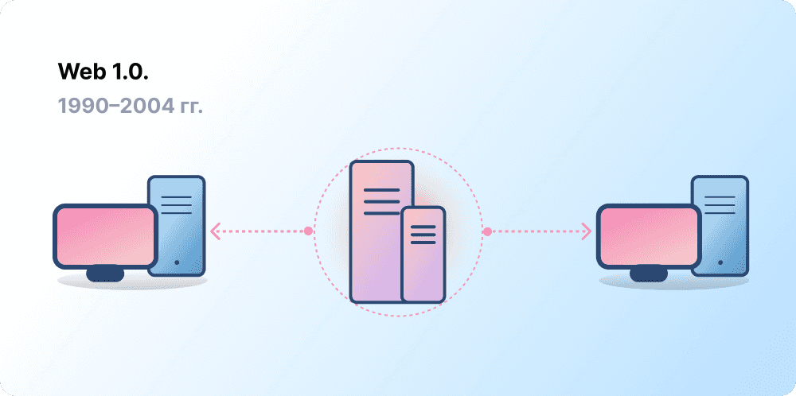
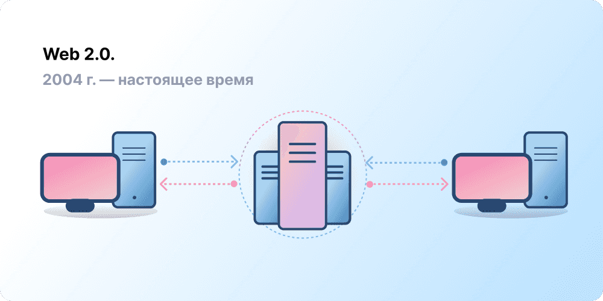
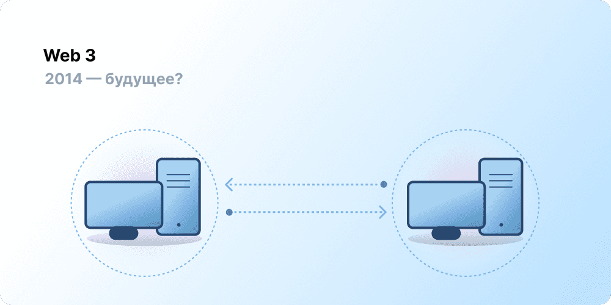

Централизация помогла привлечь миллиарды людей во Всемирную паутину и создала стабильную, надежную инфраструктуру, на которой она существует. В то же время горстка централизованных организаций удерживает контроль над обширными участками Всемирной паутины, в одностороннем порядке решая, что должно быть разрешено, а что нет.

Web3 — это ответ на данную дилемму. Вместо Сети, монополизированной крупными технологическими компаниями, Web3 использует децентрализацию, а также создается, управляется и принадлежит своим пользователям. Web3 передает власть в руки отдельных людей, а не корпораций.
Прежде чем говорить о Web3, давайте разберемся, как мы к этому пришли.

<Divider />

## Ранняя Сеть {#early-internet}

Большинство людей воспринимают Сеть как неотъемлемую опору современной жизни: она была изобретена и с тех пор просто существует. Однако Сеть, которую большинство из нас знает сегодня, сильно отличается от того, какой она задумывалась изначально. Чтобы лучше это понять, полезно разбить короткую историю Сети на условные периоды — Web 1.0 и Веб 2.0.

### Web 1.0: Только для чтения (1990-2004) {#web1}

В 1989 году в ЦЕРН (Женева) Тим Бернерс-Ли был занят разработкой протоколов, которые впоследствии станут Всемирной паутиной. В чем заключалась его идея? Создать открытые, децентрализованные протоколы, позволяющие обмениваться информацией из любой точки Земли.

Первый этап развития творения Бернерса-Ли, ныне известного как «Web 1.0», пришелся примерно на период с 1990 по 2004 год. Web 1.0 состоял в основном из статических веб-сайтов, принадлежащих компаниям, а взаимодействие между пользователями было близко к нулю — отдельные люди редко создавали контент, — из-за чего этот период стал известен как сеть «только для чтения».

### Веб 2.0: Чтение и запись (с 2004 по настоящее время) {#web2}

Период Веб 2.0 начался в 2004 году с появлением платформ социальных сетей. Вместо режима «только для чтения» сеть эволюционировала в режим «чтение и запись». Компании стали не только предоставлять контент пользователям, но и предлагать платформы для обмена пользовательским контентом и взаимодействия между пользователями. По мере того как все больше людей выходило в интернет, горстка ведущих компаний начала контролировать непропорционально большую долю трафика и ценности, генерируемой в сети. Веб 2.0 также породил модель доходов, основанную на рекламе. Хотя пользователи могли создавать контент, они не владели им и не получали выгоды от его монетизации.

<Divider />

## Веб 3.0: Чтение, запись, владение {#web3}

Концепция «Веб 3.0» была предложена соучредителем [Эфириума](/) Гэвином Вудом вскоре после запуска Эфириума в 2014 году. Гэвин Вуд сформулировал решение проблемы, которую ощущали многие ранние пользователи криптовалют: Сеть требовала слишком большого доверия. То есть большая часть Сети, которую люди знают и используют сегодня, опирается на доверие к горстке частных компаний в том, что они будут действовать в интересах общества.

### Что такое Web3? {#what-is-web3}

Web3 стал универсальным термином для обозначения концепции нового, лучшего интернета. В своей основе Web3 использует блокчейны, криптовалюты и NFT, чтобы вернуть власть пользователям в виде права собственности. [В одном из постов в Твиттере за 2020 год](https://twitter.com/himgajria/status/1266415636789334016) это было сказано лучше всего: Web1 был только для чтения, Веб2 — для чтения и записи, Web3 будет для чтения, записи и владения.

#### Основные идеи Web3 {#core-ideas}

Хотя дать строгое определение тому, что такое Web3, довольно сложно, его создание направляется несколькими основными принципами.

- **Web3 децентрализован:** вместо того чтобы обширные участки интернета контролировались и принадлежали централизованным организациям, право собственности распределяется между его создателями и пользователями.
- **Web3 является общедоступным:** каждый имеет равный доступ к участию в Web3, и никто не исключается.
- **Web3 имеет встроенные платежи:** он использует криптовалюту для расходов и отправки денег онлайн вместо того, чтобы полагаться на устаревшую инфраструктуру банков и платежных систем.
- **Web3 не требует доверия:** он работает с использованием стимулов и экономических механизмов вместо того, чтобы полагаться на доверенных третьих лиц.

### Почему Web3 важен? {#why-is-web3-important}

Хотя ключевые особенности Web3 не изолированы друг от друга и не вписываются в четкие категории, для простоты мы попытались разделить их, чтобы сделать более понятными.

#### Право собственности {#ownership}

Web3 дает вам право собственности на ваши цифровые активы беспрецедентным образом. Например, скажем, вы играете в игру Веб2. Если вы покупаете внутриигровой предмет, он привязывается непосредственно к вашему аккаунту. Если создатели игры удалят ваш аккаунт, вы потеряете эти предметы. Или, если вы перестанете играть в игру, вы потеряете ценность, которую вложили в свои внутриигровые предметы.

Web3 обеспечивает прямое владение через [невзаимозаменяемые токены (NFT)](/glossary/#nft). Никто, даже создатели игры, не имеет права лишить вас права собственности. А если вы перестанете играть, вы сможете продать или обменять свои внутриигровые предметы на открытых рынках и вернуть их стоимость. Изучите [ончейн-игры](/gaming/), чтобы увидеть это в действии.

<Alert variant="update">
<AlertEmoji text=":eyes:"/>
<AlertContent className="flex-row items-center justify-between">
  
Узнайте больше об NFT

  <ButtonLink href="/nft/">
    Подробнее об NFT
  </ButtonLink>
</AlertContent>
</Alert>

#### Устойчивость к цензуре {#censorship-resistance}

Динамика власти между платформами и создателями контента сильно несбалансирована.

OnlyFans — это сайт с пользовательским контентом для взрослых, насчитывающий более 1 миллиона создателей контента, многие из которых используют платформу в качестве основного источника дохода. В августе 2021 года OnlyFans объявил о планах запретить откровенно сексуальный контент. Это объявление вызвало возмущение среди создателей на платформе, которые почувствовали, что их лишают дохода на платформе, которую они помогли создать. После негативной реакции решение было быстро отменено. Несмотря на то, что создатели выиграли эту битву, она подчеркивает проблему для создателей Веб 2.0: вы теряете репутацию и аудиторию, которые накопили, если покидаете платформу.

В Web3 ваши данные хранятся в блокчейне. Когда вы решаете покинуть платформу, вы можете забрать свою репутацию с собой, подключив ее к другому интерфейсу, который более четко соответствует вашим ценностям.

Веб 2.0 требует от создателей контента доверять платформам в том, что они не изменят правила, но устойчивость к цензуре является встроенной функцией платформы Web3.

#### Децентрализованные автономные организации (ДАО) {#daos}

Помимо владения своими данными в Web3, вы можете владеть платформой коллективно, используя токены, которые действуют как акции в компании. ДАО позволяют координировать децентрализованное владение платформой и принимать решения о ее будущем.

Технически ДАО определяются как согласованные [смарт-контракты](/glossary/#smart-contract), которые автоматизируют децентрализованное принятие решений в отношении пула ресурсов (токенов). Пользователи с токенами голосуют за то, как расходуются ресурсы, а код автоматически выполняет результаты голосования.

Однако люди называют многие сообщества Web3 ДАО. Все эти сообщества имеют разные уровни децентрализации и автоматизации с помощью кода. В настоящее время мы изучаем, что такое ДАО и как они могут развиваться в будущем.

<Alert variant="update">
<AlertEmoji text=":eyes:"/>
<AlertContent className="flex-row items-center justify-between">
  
Узнайте больше о ДАО

  <ButtonLink href="/dao/">
    Подробнее о ДАО
  </ButtonLink>
</AlertContent>
</Alert>

### Идентичность {#identity}

Традиционно вы создавали аккаунт для каждой используемой платформы. Например, у вас может быть аккаунт в Твиттере, аккаунт на Ютубе и аккаунт на Реддите. Хотите изменить отображаемое имя или фотографию профиля? Вам придется сделать это в каждом аккаунте. В некоторых случаях вы можете использовать вход через социальные сети, но это создает знакомую проблему — цензуру. Одним щелчком мыши эти платформы могут заблокировать вам доступ ко всей вашей онлайн-жизни. Хуже того, многие платформы требуют, чтобы вы доверяли им личную информацию для создания аккаунта.

Web3 решает эти проблемы, позволяя вам контролировать свою цифровую идентичность с помощью адреса Эфириума и профиля [службы имен Эфириума (ENS)](/glossary/#ens). Использование адреса Эфириума обеспечивает единый вход на различные платформы, который является безопасным, устойчивым к цензуре и анонимным.

### Встроенные платежи {#native-payments}

Платежная инфраструктура Веб2 опирается на банки и платежные системы, исключая людей без банковских счетов или тех, кто случайно оказался в границах «неправильной» страны.
Web3 использует токены, такие как [ETH](/glossary/#ether), для отправки денег непосредственно в браузере и не требует доверенной третьей стороны.

<ButtonLink href="/what-is-ether/">
  Подробнее об ETH
</ButtonLink>

## Ограничения Web3 {#web3-limitations}

Несмотря на многочисленные преимущества Web3 в его нынешнем виде, все еще существует множество ограничений, которые экосистема должна устранить для своего процветания.

### Доступность {#accessibility}

Важные функции Web3, такие как вход с помощью Эфириума (Sign-in with Ethereum), уже доступны для бесплатного использования всем желающим. Но относительная стоимость транзакций по-прежнему остается непомерно высокой для многих. Web3 с меньшей вероятностью будет использоваться в менее богатых, развивающихся странах из-за высоких комиссий за транзакции. В Эфириуме эти проблемы решаются с помощью [дорожной карты](/roadmap/) и [решений для масштабирования уровня 2 (l2)](/glossary/#layer-2). Технология готова, но нам нужен более высокий уровень внедрения на уровне 2 (l2), чтобы сделать Web3 доступным для всех.

### Пользовательский опыт {#user-experience}

Технический барьер для входа в использование Web3 в настоящее время слишком высок. Пользователи должны осознавать проблемы безопасности, понимать сложную техническую документацию и ориентироваться в неинтуитивных пользовательских интерфейсах. [Провайдеры кошельков](/wallets/find-wallet/), в частности, работают над решением этой проблемы, но требуется больший прогресс, прежде чем Web3 будет принят в массовом порядке.

### Образование {#education}

Web3 вводит новые парадигмы, которые требуют изучения иных ментальных моделей, чем те, что используются в Веб 2.0. Подобная образовательная кампания проводилась, когда Web 1.0 набирал популярность в конце 1990-х годов; сторонники всемирной паутины использовали множество образовательных методов для просвещения общественности: от простых метафор (информационная магистраль, браузеры, серфинг в сети) до [телевизионных трансляций](https://www.youtube.com/watch?v=SzQLI7BxfYI). Web3 не сложен, но он другой. Образовательные инициативы, информирующие пользователей Веб2 об этих парадигмах Web3, жизненно важны для его успеха.

Ethereum.org вносит свой вклад в образование в сфере Web3 через нашу [Программу переводов](/contributing/translation-program/), стремясь перевести важный контент об Эфириуме на как можно большее количество языков.

### Централизованная инфраструктура {#centralized-infrastructure}

Экосистема Web3 молода и быстро развивается. В результате в настоящее время она в основном зависит от централизованной инфраструктуры (GitHub, Твиттер, Дискорд и т. д.). Многие компании Web3 спешат заполнить эти пробелы, но создание высококачественной и надежной инфраструктуры требует времени.

## Децентрализованное будущее {#decentralized-future}

Web3 — это молодая и развивающаяся экосистема. Гэвин Вуд придумал этот термин в 2014 году, но многие из этих идей стали реальностью лишь недавно. Только за последний год произошел значительный всплеск интереса к криптовалюте, улучшения в решениях для масштабирования уровня 2 (l2), масштабные эксперименты с новыми формами управления и революции в цифровой идентичности.

Мы находимся только в начале создания лучшей Сети с помощью Web3, но по мере того, как мы продолжаем улучшать инфраструктуру, которая будет ее поддерживать, будущее Сети выглядит блестящим.

## Как я могу принять участие {#get-involved}

- [Завести кошелек](/wallets/)
- [Найти сообщество](/community/)
- [Изучить приложения Web3](/apps/)
- [Присоединиться к ДАО](/dao/)
- [Создавать на Web3](/developers/)

## Дополнительная литература {#further-reading}

Web3 не имеет жесткого определения. Различные участники сообщества имеют разные взгляды на него. Вот некоторые из них:

- [Что такое Web3? Объяснение децентрализованного интернета будущего](https://www.freecodecamp.org/news/what-is-web3) — _Надер Дабит_
- [Осмысление Web 3](https://medium.com/l4-media/making-sense-of-web-3-c1a9e74dcae) — _Джош Старк_
- [Почему Web3 имеет значение](https://a16zcrypto.com/posts/article/why-web3-matters/) — _Крис Диксон_
- [Почему децентрализация имеет значение](https://onezero.medium.com/why-decentralization-matters-5e3f79f7638e) — _Крис Диксон_
- [Ландшафт Web3](https://a16z.com/wp-content/uploads/2021/10/The-web3-Readlng-List.pdf) — _a16z_
- [Дебаты о Web3](https://www.notboring.co/p/the-web3-debate) — _Паки Маккормик_

<QuizWidget quizKey="web3" />
