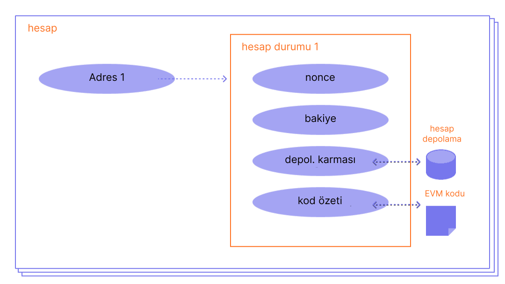

Bir Ethereum hesabı, Ethereum üzerinde işlem gönderebilen bir ether (ETH) bakiyesi barındıran bir varlıktır. Hesaplar kullanıcılar tarafından kontrol edilebilir veya akıllı sözleşme olarak dağıtılabilirler.

## Ön Koşullar {#prerequisites}

Bu sayfayı daha iyi anlamanız için öncelikle [Ethereum'a giriş](/developers/docs/intro-to-ethereum/) kısmını okumanızı öneriyoruz.

## Hesap türleri {#types-of-account}

Ethereum'da iki tür hesap bulunur:

- Harici olarak sahiplenilmiş hesaplar (EOA) - özel anahtarı olan herhangi biri tarafından kontrol edilir
- Sözleşme hesabı - kod tarafından kontrol edilen, ağ içine yayılmış bir akıllı sözleşme. [Akıllı sözleşmeler](/developers/docs/smart-contracts/) hakkında daha fazla bilgi

İki hesap türü de şunları yapabilir:

- ETH ve token alma, tutma ve gönderme
- Dağıtılmış akıllı sözleşmelerle etkileşime girme

### Önemli farkları {#key-differences}

**Harici olarak sahiplenilmiş**

- Hesap oluşturmak tamamen ücretsizdir
- İşlem başlatabilir
- Harici olarak sahiplenilmiş hesaplar arası işlemler sadece ETH/token transferleri olabilir
- Kriptografik bir anahtar çiftinden oluşur: hesap aktivitelerini kontrol eden herkese açık ve özel anahtarlar

**Sözleşme**

- Ağ depolaması kullandığınız için sözleşme oluşturmanın bir ücreti vardır
- Yalnızca bir işlemin alınmasına yanıt olarak işlem gönderebilir
- Harici bir hesaptan bir sözleşme hesabına yapılan işlemler, token'ları aktarmak ve hatta yeni bir sözleşme oluşturmak gibi birçok farklı eylemi gerçekleştirebilen kodları tetikleyebilir
- Sözleşme hesaplarının özel anahtarları yoktur. Bunun yerine, akıllı sözleşmenin kodunun mantığı tarafından kontrol edilirler

## Bir hesabın incelemesi {#an-account-examined}

Ethereum hesaplarının dört alanı vardır:

- `nonce` –harici bir hesaptan gönderilmiş ya da bir sözleşme hesabı tarafından yaratılmış sözleşmelerin sayısını belirten bir sayaç. Verilen tek seferlik sayı ile her bir hesap için sadece bir işlem yürütülebilir, bu imzalanmış işlemlerin tekrarlı şekilde yayınlandığı ve yürütüldüğü tekrar saldırılarına karşı koruma sağlar.
- `balance` – Bu adrese ait wei sayısı. Wei, ETH'nin bir birimidir ve ETH başına 1e+18 wei bulunur.
- `codeHash` – Bu hash değeri, Ethereum sanal makinesi (EVM) üzerindeki bir hesabın _kodunu_ temsil eder. Sözleşme hesaplarına, farklı işlemler gerçekleştirebilen kod parçacıkları programlanmıştır. Hesap bir mesaj çağrısı aldıysa bu EVM kodu çalıştırılır. Diğer hesap alanlarının aksine değiştirilemez. Bu türdeki tüm kod parçaları, daha sonra geri alınmak üzere durum veri tabanında karşılık gelen hash'leri altında bulunur. Bu hash değeri codeHash olarak bilinir. Harici olarak sahiplenilmiş hesaplar için codeHash alanı, boş bir dizenin hash değeridir.
- `storageRoot` - Bazen depolama hash'i olarak da bilinir. Hesabın depolama içeriğini kodlayan bir Merkle Patricia ağaç kök düğümünün 256 bit hash değeri, (256 bit tamsayı değerleri arasında bir eşleme), 256-bit tam sayı anahtarlarının 256-bit Keccak hash değerinden RLP-kodlanmış 256-bit tamsayı değerlerine bir eşleme olarak ağaç içerisine kodlanmıştır. Bu ağaç, bu hesabın depolama içeriğinin hash değerini kodlar ve varsayılan olarak boştur.

 _Diyagram [Ethereum EVM resmediciden](https://takenobu-hs.github.io/downloads/ethereum_evm_illustrated.pdf) uyarlanmıştır_

## Harici olarak sahiplenilmiş hesaplar ve anahtar çiftleri {#externally-owned-accounts-and-key-pairs}

Bir hesap, genel ve özel olmak üzere bir çift kriptografik anahtardan oluşur. Bir işlemin gerçekten gönderen tarafından imzalandığını kanıtlamaya yardımcı olurlar ve sahteciliği önlerler. Özel anahtarınız, işlemleri imzalamak için kullandığınız anahtar olduğu için hesabınızla ilişkili fonların velayetini size verir. Kripto para aslında hiçbir zaman sizde durmaz, sizde özel anahtarlar bulunur: Fonlar her zaman Ethereum'un defterindedir.

Bu, bir işlemin gönderenini her zaman doğrulayabileceğiniz için kötü niyetli kişilerin sahte işlemler yayınlamasını önler.

Alice, kendi hesabından Bob'un hesabına ether göndermek isterse, Alice'in bir işlem talebi oluşturması ve doğrulama için ağa göndermesi gerekir. Ethereum'un açık anahtarlı kriptografi kullanımı, Alice'in işlem talebini ilk olarak kendisinin başlattığını kanıtlayabilmesini sağlar. Kriptografik mekanizmalar olmasaydı kötü niyetli bir saldırgan olan Eve, "Alice'in hesabından Havva'nın hesabına 5 ETH gönder" gibi görünen bir talebi herkese açık bir şekilde yayınlayabilir ve hiç kimse bunun Alice'den gelmediğini doğrulayamazdı.

## Hesap oluşturma {#account-creation}

Bir hesap oluşturmak istediğinizde, çoğu kütüphane sizin için rastgele bir özel anahtar üretir.

Bir özel anahtar, 64 hex karakterinden oluşur ve şifrelenebilir.

Örnek:

`fffffffffffffffffffffffffffffffebaaedce6af48a03bbfd25e8cd036415f`

Açık anahtar, [Eliptik Eğri Dijital İmza Algoritması](https://wikipedia.org/wiki/Elliptic_Curve_Digital_Signature_Algorithm) kullanılarak özel anahtar ile oluşturulur. Açık anahtarın Keccak-256 hash değerinin son 20 baytını alarak ve başına `0x` ekleyerek hesabınız için genel bir adres alırsınız.

Bu, Dışarıdan sahip olunan hesabın (EOA) 42 karakterlik bir adrese sahip olduğu anlamına gelir (40 onaltılık karaktere ve `0x` önekine sahip 20 baytlık segment).

Örnek:

`0x5e97870f263700f46aa00d967821199b9bc5a120`

Aşağıdaki örnek bir [Clef](https://geth.ethereum.org/docs/tools/clef/introduction) imzalama aracının yeni bir hesap oluşturmak için nasıl kullanılacağını gösteriyor. Clef bir Ethereum İstemcisi ile donatılmış bir hesap yönetimi ve imzalama aracıdır,[Geth](https://geth.ethereum.org). `Clef newaccount` komutu yeni bir anahtar çifti oluşturur ve bunları şifrelenmiş olan anahtar deposuna yerleştirir.

```
> clef newaccount --keystore <path>

Please enter a password for the new account to be created:
> <password>

------------
INFO [10-28|16:19:09.156] Your new key was generated       address=0x5e97870f263700f46aa00d967821199b9bc5a120
WARN [10-28|16:19:09.306] Please backup your key file      path=/home/user/go-ethereum/data/keystore/UTC--2022-10-28T15-19-08.000825927Z--5e97870f263700f46aa00d967821199b9bc5a120
WARN [10-28|16:19:09.306] Please remember your password!
Generated account 0x5e97870f263700f46aa00d967821199b9bc5a120
```

[Geth dokümanları](https://geth.ethereum.org/docs)

Özel anahtarınızdan yeni açık anahtarlar türetebilirsiniz, ancak açık anahtarlardan bir özel anahtar türetemezsiniz. Özel anahtarlarınızı güvende ve adından da anlaşılacağı gibi **ÖZEL** tutmanız hayati önem taşır.

Bir imza çıktısı veren mesajları ve işlemleri imzalamak için özel bir anahtara ihtiyacınız vardır. Diğerleri daha sonra ortak anahtarınızı türetmek için imzayı alabilir ve mesajın yazarını kanıtlayabilir. Uygulamanızda, ağa işlem göndermek için JavaScript kütüphanesini kullanabilirsiniz.

## Sözleşme hesapları {#contract-accounts}

Sözleşme hesaplarında ayrıca 42 karakterlik bir onaltılık adres bulunur:

Örnek:

`0x06012c8cf97bead5deae237070f9587f8e7a266d`

Sözleşme adresi genellikle Ethereum Blok Zincirine bir sözleşme dağıtıldığında verilir. Adres, içerik oluşturucunun adresinden ve bu adresten gönderilen işlem ("nonce" değeri) sayısından gelir.

## Doğrulayıcı anahtarları {#validators-keys}

Ethereumda bir anahtar türü daha var ve ilk kez Ethereum iş ispatından mutabakata dayalı olan hisse ispatına geçtiğinde tanıtıldı. Bunlar doğrulayıcıları tanımlamak için kullanılan BLS anahtarları. Bu anahtarlar ağın mutabakata varabilmesi için gereken bant genişliğini kısmak için etkili bir şekilde birleşebilirler. Bu anahtar toplama süreci olmazsa bir doğrulayıcıya düşen minimum hisse çok daha fazla olurdu.

[Doğrulayıcı anahtarlarıyla ilgili daha fazlası](/developers/docs/consensus-mechanisms/pos/keys/).

## Cüzdanlar hakkında bir not {#a-note-on-wallets}

Hesap, cüzdan demek değildir. Cüzdan, ister harici olarak sahiplenilmiş bir hesap ister bir sözleşme hesabı olsun, Ethereum hesabınızla etkileşim kurmanıza olanak sağlayan bir arayüz veya uygulamadır.

## Görsel bir demo {#a-visual-demo}

Austin'in karma fonksiyonlarını ve anahtar çiftlerini açıklamasını izleyin.

<YouTube id="QJ010l-pBpE" />

<YouTube id="9LtBDy67Tho" />

## Daha fazla okuma {#further-reading}

- [Ethereum hesaplarını anlamak](https://info.etherscan.com/understanding-ethereum-accounts/) - etherscan

_Size yardımcı olan bir topluluk kaynağı mı biliyorsunuz? Bu sayfayı düzenleyin ve ekleyin!_

## İlgili konular {#related-topics}

- [Akıllı sözleşmeler](/developers/docs/smart-contracts/)
- [İşlemler](/developers/docs/transactions/)
