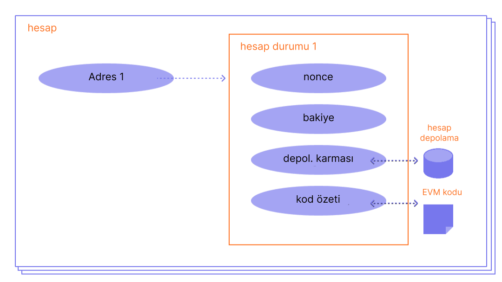

Bir [Ethereum](/) hesabı, Ethereum üzerinde mesajlar gönderebilen ve bir Ether (ETH) bakiyesine sahip olan bir varlıktır. Hesaplar kullanıcı kontrollü olabilir veya akıllı sözleşmeler olarak dağıtılabilir.

## Ön koşullar {#prerequisites}

Bu sayfayı daha iyi anlamanıza yardımcı olmak için öncelikle [Ethereum'a giriş](/developers/docs/intro-to-ethereum/) bölümümüzü okumanızı öneririz.

## Hesap türleri {#types-of-account}

Ethereum'un iki hesap türü vardır:

- Harici olarak sahip olunan hesap (EOA) – özel anahtarlara sahip olan herkes tarafından kontrol edilir
- Kontrat hesabı – ağa dağıtılmış, kod tarafından kontrol edilen bir akıllı sözleşme. [Akıllı sözleşmeler](/developers/docs/smart-contracts/) hakkında bilgi edinin

Her iki hesap türü de şu yeteneklere sahiptir:

- ETH ve Token almak, tutmak ve göndermek
- Dağıtılmış akıllı sözleşmelerle etkileşime girmek

### Temel farklar {#key-differences}

**Harici olarak sahip olunan**

- Bir hesap oluşturmanın hiçbir maliyeti yoktur
- İşlemleri başlatabilir
- Harici olarak sahip olunan hesaplar arasındaki işlemler yalnızca ETH/Token transferleri olabilir
- Hesap etkinliklerini kontrol eden kriptografik bir anahtar çiftinden oluşur: açık ve özel anahtarlar

**Sözleşme**

- Ağ depolama alanını kullandığınız için bir sözleşme oluşturmanın bir maliyeti vardır
- Yalnızca bir işlem almaya yanıt olarak mesaj gönderebilir
- Harici bir hesaptan bir kontrat hesabına yapılan işlemler, Token transferi veya hatta yeni bir sözleşme oluşturma gibi birçok farklı eylemi yürütebilen kodu tetikleyebilir
- Kontrat hesaplarının özel anahtarları yoktur. Bunun yerine, akıllı sözleşme kodunun mantığı tarafından kontrol edilirler

## Bir hesabın incelenmesi {#an-account-examined}

Ethereum hesaplarının dört alanı vardır:

- `nonce` – Harici olarak sahip olunan bir hesaptan gönderilen işlem sayısını veya bir kontrat hesabı tarafından oluşturulan sözleşme sayısını gösteren bir sayaç. İmzalı işlemlerin tekrar tekrar yayınlandığı ve yeniden yürütüldüğü tekrarlama saldırılarına karşı koruma sağlamak için her hesap için belirli bir nonce ile yalnızca bir işlem yürütülebilir.
- `balance` – Bu adresin sahip olduğu Wei miktarı. Wei, ETH'nin bir alt birimidir ve her ETH için 1e+18 Wei vardır.
- `codeHash` – Bu hash, Ethereum sanal makinesindeki (EVM) bir hesabın _kodunu_ ifade eder. Kontrat hesapları, farklı işlemleri gerçekleştirebilen programlanmış kod parçalarına sahiptir. Bu EVM kodu, hesap bir mesaj çağrısı alırsa yürütülür. Diğer hesap alanlarının aksine değiştirilemez. Tüm bu tür kod parçaları, daha sonra alınmak üzere ilgili hash'leri altında durum veritabanında bulunur. Bu hash değeri codeHash olarak bilinir. Harici olarak sahip olunan hesaplar için codeHash alanı boş bir dizenin hash'idir.
- `storageRoot` – Bazen depolama hash'i olarak da bilinir. Hesabın depolama içeriğini (256 bitlik tam sayı değerleri arasındaki bir eşleme) kodlayan bir [Merkle Patricia Ağacı](/developers/docs/data-structures-and-encoding/patricia-merkle-trie/) kök düğümünün 256 bitlik hash'idir; bu, 256 bitlik tam sayı anahtarlarının Keccak 256 bitlik hash'inden RLP kodlu 256 bitlik tam sayı değerlerine bir eşleme olarak ağaca kodlanmıştır. Bu ağaç, bu hesabın depolama içeriğinin hash'ini kodlar ve varsayılan olarak boştur.


_Diyagram [Ethereum EVM illustrated](https://takenobu-hs.github.io/downloads/ethereum_evm_illustrated.pdf) kaynağından uyarlanmıştır_

## Harici olarak sahip olunan hesaplar ve anahtar çiftleri {#externally-owned-accounts-and-key-pairs}

Bir hesap, açık ve özel olmak üzere bir çift kriptografik anahtardan oluşur. Bunlar, bir işlemin gerçekten gönderen tarafından imzalandığını kanıtlamaya yardımcı olur ve sahteciliği önler. Özel anahtarınız işlemleri imzalamak için kullandığınız şeydir, bu nedenle hesabınızla ilişkili fonların velayetini size verir. Aslında hiçbir zaman kripto para tutmazsınız, özel anahtarları tutarsınız – fonlar her zaman Ethereum'un defterindedir.

Bu, kötü niyetli aktörlerin sahte işlemler yayınlamasını önler çünkü bir işlemin göndericisini her zaman doğrulayabilirsiniz.

Alice kendi hesabından Bob'un hesabına Ether göndermek isterse, Alice'in bir işlem isteği oluşturması ve doğrulama için ağa göndermesi gerekir. Ethereum'un açık anahtar kriptografisi kullanımı, Alice'in işlem isteğini başlangıçta kendisinin başlattığını kanıtlayabilmesini sağlar. Kriptografik mekanizmalar olmadan, kötü niyetli bir düşman olan Eve, "Alice'in hesabından Eve'in hesabına 5 ETH gönder" gibi görünen bir isteği herkese açık olarak yayınlayabilir ve hiç kimse bunun Alice'ten gelmediğini doğrulayamazdı.

## Hesap oluşturma {#account-creation}

Bir hesap oluşturmak istediğinizde, çoğu kütüphane size rastgele bir özel anahtar üretecektir.

Bir özel anahtar 64 onaltılık (hex) karakterden oluşur ve bir parolayla şifrelenebilir.

Örnek:

`fffffffffffffffffffffffffffffffebaaedce6af48a03bbfd25e8cd036415f`

Açık anahtar, [Eliptik Eğri Dijital İmza Algoritması](https://wikipedia.org/wiki/Elliptic_Curve_Digital_Signature_Algorithm) kullanılarak özel anahtardan üretilir. Açık anahtarın Keccak-256 hash'inin son 20 baytını alıp başına `0x` ekleyerek hesabınız için açık bir adres elde edersiniz.

Bu, Harici olarak sahip olunan bir hesabın (EOA) 42 karakterlik bir adrese (40 onaltılık karakter olan 20 baytlık bölüm artı `0x` öneki) sahip olduğu anlamına gelir.

Örnek:

`0x5e97870f263700f46aa00d967821199b9bc5a120`

Aşağıdaki örnek, yeni bir hesap oluşturmak için [Clef](https://geth.ethereum.org/docs/tools/clef/introduction) adlı bir imzalama aracının nasıl kullanılacağını göstermektedir. Clef, Ethereum istemcisi [Geth](https://geth.ethereum.org) ile birlikte gelen bir hesap yönetimi ve imzalama aracıdır. `clef newaccount` komutu yeni bir anahtar çifti oluşturur ve bunları şifrelenmiş bir anahtar deposuna kaydeder.

```
> clef newaccount --keystore <path>

Please enter a password for the new account to be created:
> <password>

------------
INFO [10-28|16:19:09.156] Your new key was generated       address=0x5e97870f263700f46aa00d967821199b9bc5a120
WARN [10-28|16:19:09.306] Please backup your key file      path=/home/user/go-ethereum/data/keystore/UTC--2022-10-28T15-19-08.000825927Z--5e97870f263700f46aa00d967821199b9bc5a120
WARN [10-28|16:19:09.306] Please remember your password!
Generated account 0x5e97870f263700f46aa00d967821199b9bc5a120
```

[Geth belgeleri](https://geth.ethereum.org/docs)

Özel anahtarınızdan yeni açık anahtarlar türetmek mümkündür, ancak açık anahtarlardan bir özel anahtar türetemezsiniz. Özel anahtarlarınızı güvende tutmanız ve adından da anlaşılacağı gibi **ÖZEL (GİZLİ)** tutmanız hayati önem taşır.

Bir imza çıktısı veren mesajları ve işlemleri imzalamak için bir özel anahtara ihtiyacınız vardır. Başkaları daha sonra açık anahtarınızı türetmek için imzayı alabilir ve mesajın yazarını kanıtlayabilir. Uygulamanızda, ağa işlemler göndermek için bir JavaScript kütüphanesi kullanabilirsiniz.

## Kontrat hesapları {#contract-accounts}

Kontrat hesapları da 42 karakterlik onaltılık bir adrese sahiptir:

Örnek:

`0x06012c8cf97bead5deae237070f9587f8e7a266d`

Sözleşme adresi genellikle bir sözleşme Ethereum Blokzinciri'ne dağıtıldığında verilir. Adres, oluşturucunun adresinden ve o adresten gönderilen işlem sayısından ("nonce") gelir.

## Doğrulayıcı anahtarları {#validators-keys}

Ethereum'da, Ethereum İş Kanıtı'ndan (PoW) Hisse Kanıtı (PoS) tabanlı mutabakata geçtiğinde tanıtılan başka bir anahtar türü daha vardır. Bunlar 'BLS' anahtarlarıdır ve doğrulayıcıları tanımlamak için kullanılırlar. Bu anahtarlar, ağın mutabakata varması için gereken bant genişliğini azaltmak amacıyla verimli bir şekilde birleştirilebilir. Bu anahtar birleştirme olmadan, bir doğrulayıcı için minimum stake çok daha yüksek olurdu.

[Doğrulayıcı anahtarları hakkında daha fazlası](/developers/docs/consensus-mechanisms/pos/keys/).

## Cüzdanlar hakkında bir not {#a-note-on-wallets}

Bir hesap bir cüzdan değildir. Cüzdan, harici olarak sahip olunan bir hesap veya bir kontrat hesabı fark etmeksizin Ethereum hesabınızla etkileşime girmenizi sağlayan bir arayüz veya uygulamadır.

## Görsel bir demo {#a-visual-demo}

Austin'in hash fonksiyonları ve anahtar çiftleri hakkındaki anlatımını izleyin.

<VideoWatch slug="hash-function-eth-build" />

<VideoWatch slug="key-pair-eth-build" />

## Daha fazla okuma {#further-reading}

- [Ethereum Hesaplarını Anlamak](https://info.etherscan.com/understanding-ethereum-accounts/) - Etherscan

_Size yardımcı olan bir topluluk kaynağı mı biliyorsunuz? Bu sayfayı düzenleyin ve ekleyin!_

## İlgili konular {#related-topics}

- [Akıllı sözleşmeler](/developers/docs/smart-contracts/)
- [İşlemler](/developers/docs/transactions/)