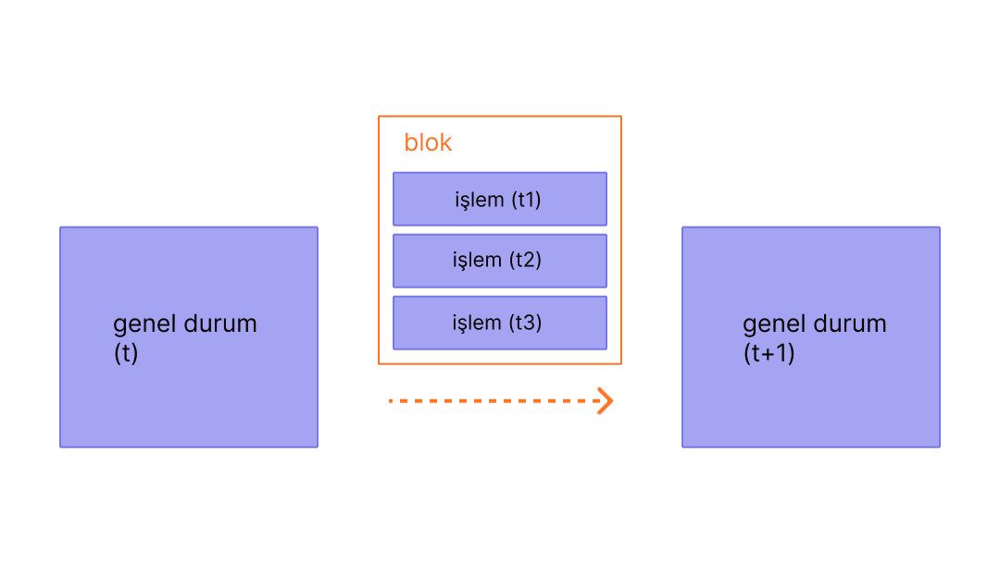

Bloklar, zincirdeki bir önceki bloğun hash'ini içeren işlem gruplarıdır. Bu, blokları birbirine (bir zincir halinde) bağlar çünkü hash'ler kriptografik olarak blok verilerinden türetilir. Bu durum dolandırıcılığı önler, çünkü geçmişteki herhangi bir blokta yapılacak tek bir değişiklik, sonraki tüm hash'ler değişeceği ve blokzinciri çalıştıran herkes bunu fark edeceği için sonraki tüm blokları geçersiz kılacaktır.

## Ön koşullar {#prerequisites}

Bloklar, yeni başlayanlar için oldukça uygun bir konudur. Ancak bu sayfayı daha iyi anlamanıza yardımcı olmak için öncelikle [Hesaplar](/developers/docs/accounts/), [İşlemler](/developers/docs/transactions/) ve [Ethereum'a giriş](/developers/docs/intro-to-ethereum/) bölümlerimizi okumanızı öneririz.

## Neden bloklar? {#why-blocks}

[Ethereum](/) ağındaki tüm katılımcıların senkronize bir durumu korumasını ve işlemlerin kesin geçmişi üzerinde mutabakata varmasını sağlamak için işlemleri bloklar halinde gruplandırıyoruz. Bu, düzinelerce (veya yüzlerce) işlemin aynı anda taahhüt edildiği, üzerinde anlaşıldığı ve senkronize edildiği anlamına gelir.

_Diyagram [Ethereum EVM illustrated](https://takenobu-hs.github.io/downloads/ethereum_evm_illustrated.pdf)'dan uyarlanmıştır_

Taahhütleri aralıklı hale getirerek, tüm ağ katılımcılarına mutabakata varmaları için yeterli zaman tanıyoruz: işlem talepleri saniyede onlarca kez gerçekleşse bile, bloklar Ethereum'da yalnızca on iki saniyede bir oluşturulur ve taahhüt edilir.

## Bloklar nasıl çalışır {#how-blocks-work}

İşlem geçmişini korumak için bloklar kesin bir şekilde sıralanır (oluşturulan her yeni blok, ebeveyn bloğuna bir referans içerir) ve bloklar içindeki işlemler de kesin bir şekilde sıralanır. Nadir durumlar dışında, herhangi bir zamanda, ağdaki tüm katılımcılar blokların tam sayısı ve geçmişi konusunda hemfikirdir ve mevcut canlı işlem taleplerini bir sonraki blokta gruplandırmak için çalışırlar.

Bir blok, ağ üzerinde rastgele seçilen bir doğrulayıcı tarafından bir araya getirildikten sonra ağın geri kalanına yayılır; tüm düğümler bu bloğu kendi blokzincirlerinin sonuna ekler ve bir sonraki bloğu oluşturmak için yeni bir doğrulayıcı seçilir. Kesin blok oluşturma süreci ve taahhüt/mutabakat süreci şu anda Ethereum'un "Hisse Kanıtı (PoS)" protokolü tarafından belirlenmektedir.

## Hisse Kanıtı (PoS) protokolü {#proof-of-stake-protocol}

Hisse Kanıtı (PoS) şu anlama gelir:

- Doğrulayıcı düğümler, kötü davranışlara karşı teminat olarak bir yatırma sözleşmesine 32 ETH stake etmek zorundadır. Bu, ağı korumaya yardımcı olur çünkü kanıtlanabilir şekilde dürüst olmayan faaliyetler, bu stake'in bir kısmının veya tamamının yok edilmesine yol açar.
- Her slotta (on iki saniye arayla) bir doğrulayıcı rastgele olarak blok teklifçisi seçilir. İşlemleri bir araya getirir, yürütür ve yeni bir 'durum' belirlerler. Bu bilgileri bir blok içine sarar ve diğer doğrulayıcılara iletirler.
- Yeni bloğu duyan diğer doğrulayıcılar, küresel durumdaki önerilen değişiklikle aynı fikirde olduklarından emin olmak için işlemleri yeniden yürütürler. Bloğun geçerli olduğunu varsayarak, onu kendi veritabanlarına eklerler.
- Bir doğrulayıcı aynı slot için birbiriyle çelişen iki blok duyarsa, en çok stake edilen ETH tarafından desteklenen bloğu seçmek için çatal seçimi algoritmalarını kullanır.

[Hisse Kanıtı (PoS) hakkında daha fazlası](/developers/docs/consensus-mechanisms/pos)

## Bir bloğun içinde ne var? {#block-anatomy}

Bir bloğun içinde pek çok bilgi bulunur. En üst düzeyde bir blok aşağıdaki alanları içerir:

| Alan            | Açıklama                                           |
| :--------------- | :---------------------------------------------------- |
| `slot`           | bloğun ait olduğu slot                         |
| `proposer_index` | bloğu teklif eden doğrulayıcının kimliği (ID)           |
| `parent_root`    | önceki bloğun hash'i                       |
| `state_root`     | durum nesnesinin kök hash'i                     |
| `body`           | aşağıda tanımlandığı gibi çeşitli alanlar içeren bir nesne |

Blok `body` kendi içinde çeşitli alanlar içerir:

| Alan                | Açıklama                                      |
| :------------------- | :----------------------------------------------- |
| `randao_reveal`      | bir sonraki blok teklifçisini seçmek için kullanılan bir değer   |
| `eth1_data`          | yatırma sözleşmesi hakkında bilgi           |
| `graffiti`           | blokları etiketlemek için kullanılan rastgele veriler                |
| `proposer_slashings` | ceza kesintisi uygulanacak doğrulayıcıların listesi                 |
| `attester_slashings` | ceza kesintisi uygulanacak onaylayıcıların listesi                  |
| `attestations`       | önceki slotlara karşı yapılan onayların listesi |
| `deposits`           | yatırma sözleşmesine yapılan yeni yatırımların listesi     |
| `voluntary_exits`    | ağdan çıkan doğrulayıcıların listesi           |
| `sync_aggregate`     | hafif istemcilere hizmet vermek için kullanılan doğrulayıcıların alt kümesi |
| `execution_payload`  | yürütme istemcisinden aktarılan işlemler    |

`attestations` alanı, bloktaki tüm onayların bir listesini içerir. Onaylar, birkaç veri parçasını içeren kendi veri türlerine sahiptir. Her onay şunları içerir:

| Alan              | Açıklama                                                    |
| :----------------- | :------------------------------------------------------------- |
| `aggregation_bits` | bu onaya hangi doğrulayıcıların katıldığının bir listesi    |
| `data`             | birden fazla alt alan içeren bir kapsayıcı                            |
| `signature`        | bir dizi doğrulayıcının `data` kısmına karşı toplu imzası |

`attestation` içindeki `data` alanı şunları içerir:

| Alan               | Açıklama                                                     |
| :------------------ | :-------------------------------------------------------------- |
| `slot`              | onayın ilgili olduğu slot                             |
| `index`             | onaylayan doğrulayıcılar için endeksler                                |
| `beacon_block_root` | zincirin başı olarak görülen işaret bloğunun kök hash'i |
| `source`            | son gerekçelendirilmiş kontrol noktası                                   |
| `target`            | en son dönem sınırı bloğu                                 |

`execution_payload` içindeki işlemleri yürütmek küresel durumu günceller. Tüm istemciler, yeni durumun yeni bloktaki `state_root` alanıyla eşleştiğinden emin olmak için `execution_payload` içindeki işlemleri yeniden yürütür. İstemciler yeni bir bloğun geçerli ve blokzincirlerine eklenmesinin güvenli olduğunu bu şekilde anlayabilirler. `execution payload`'ün kendisi çeşitli alanlara sahip bir nesnedir. Ayrıca yürütme verileri hakkında önemli özet bilgiler içeren bir `execution_payload_header` da vardır. Bu veri yapıları aşağıdaki gibi düzenlenmiştir:

`execution_payload_header` aşağıdaki alanları içerir:

| Alan               | Açıklama                                                         |
| :------------------ | :------------------------------------------------------------------ |
| `parent_hash`       | ebeveyn bloğunun hash'i                                            |
| `fee_recipient`     | işlem ücretlerinin ödeneceği hesap adresi                      |
| `state_root`        | bu bloktaki değişiklikleri uyguladıktan sonra küresel durum için kök hash |
| `receipts_root`     | işlem makbuzları trie'sinin hash'i                               |
| `logs_bloom`        | olay günlüklerini içeren veri yapısı                                |
| `prev_randao`       | rastgele doğrulayıcı seçiminde kullanılan değer                            |
| `block_number`      | mevcut bloğun numarası                                     |
| `gas_limit`         | bu blokta izin verilen maksimum gaz                                   |
| `gas_used`          | bu blokta kullanılan gerçek gaz miktarı                         |
| `timestamp`         | blok süresi                                                      |
| `extra_data`        | ham baytlar olarak rastgele ek veriler                              |
| `base_fee_per_gas`  | taban ücret değeri                                                  |
| `block_hash`        | Yürütme bloğunun hash'i                                             |
| `transactions_root` | yükteki işlemlerin kök hash'i                        |
| `withdrawal_root`   | yükteki çekim işlemlerinin kök hash'i                         |

`execution_payload`'ün kendisi aşağıdakileri içerir (bunun, işlemlerin kök hash'i yerine işlemlerin ve çekim bilgilerinin gerçek listesini içermesi dışında başlıkla aynı olduğuna dikkat edin):

| Alan              | Açıklama                                                         |
| :----------------- | :------------------------------------------------------------------ |
| `parent_hash`      | ebeveyn bloğunun hash'i                                            |
| `fee_recipient`    | işlem ücretlerinin ödeneceği hesap adresi                      |
| `state_root`       | bu bloktaki değişiklikleri uyguladıktan sonra küresel durum için kök hash |
| `receipts_root`    | işlem makbuzları trie'sinin hash'i                               |
| `logs_bloom`       | olay günlüklerini içeren veri yapısı                                |
| `prev_randao`      | rastgele doğrulayıcı seçiminde kullanılan değer                            |
| `block_number`     | mevcut bloğun numarası                                     |
| `gas_limit`        | bu blokta izin verilen maksimum gaz                                   |
| `gas_used`         | bu blokta kullanılan gerçek gaz miktarı                         |
| `timestamp`        | blok süresi                                                      |
| `extra_data`       | ham baytlar olarak rastgele ek veriler                              |
| `base_fee_per_gas` | taban ücret değeri                                                  |
| `block_hash`       | Yürütme bloğunun hash'i                                             |
| `transactions`     | yürütülecek işlemlerin listesi                                 |
| `withdrawals`      | çekim nesnelerinin listesi                                          |

`withdrawals` listesi, aşağıdaki şekilde yapılandırılmış `withdrawal` nesnelerini içerir:

| Alan            | Açıklama                        |
| :--------------- | :--------------------------------- |
| `address`        | çekim yapan hesap adresi |
| `amount`         | çekim miktarı                  |
| `index`          | çekim endeks değeri             |
| `validatorIndex` | doğrulayıcı endeks değeri              |

## Blok süresi {#block-time}

Blok süresi, blokları ayıran zamanı ifade eder. Ethereum'da zaman, 'slot' adı verilen on iki saniyelik birimlere bölünmüştür. Her slotta bir blok teklif etmek için tek bir doğrulayıcı seçilir. Tüm doğrulayıcıların çevrimiçi ve tamamen işlevsel olduğu varsayıldığında, her slotta bir blok olacaktır, bu da blok süresinin 12 saniye olduğu anlamına gelir. Ancak, bazen doğrulayıcılar bir blok teklif etmeye çağrıldıklarında çevrimdışı olabilirler, bu da slotların bazen boş kalabileceği anlamına gelir.

Bu uygulama, blok sürelerinin olasılıksal olduğu ve protokolün hedef madencilik zorluğu tarafından ayarlandığı İş Kanıtı (PoW) tabanlı sistemlerden farklıdır. Ethereum'un [ortalama blok süresi](https://etherscan.io/chart/blocktime), İş Kanıtı'ndan (PoW) Hisse Kanıtı'na (PoS) geçişin yeni 12 saniyelik blok süresinin tutarlılığına dayanılarak açıkça anlaşılabildiği bunun mükemmel bir örneğidir.

## Blok boyutu {#block-size}

Son önemli bir not da blokların boyutlarının sınırlı olmasıdır. Her bloğun hedef boyutu 30 milyon gazdır ancak blokların boyutu, 60 milyon gazlık (hedef blok boyutunun 2 katı) blok limitine kadar ağ taleplerine göre artacak veya azalacaktır. Blok gaz limiti, önceki bloğun gaz limitinden 1/1024 oranında yukarı veya aşağı ayarlanabilir. Sonuç olarak, doğrulayıcılar mutabakat yoluyla blok gaz limitini değiştirebilirler. Bloktaki tüm işlemler tarafından harcanan toplam gaz miktarı, blok gaz limitinden az olmalıdır. Bu önemlidir çünkü blokların keyfi olarak büyük olmamasını sağlar. Bloklar keyfi olarak büyük olabilseydi, daha az performanslı tam düğümler alan ve hız gereksinimleri nedeniyle yavaş yavaş ağa ayak uyduramaz hale gelirdi. Blok ne kadar büyük olursa, onları bir sonraki slot için zamanında işlemek için gereken hesaplama gücü de o kadar büyük olur. Bu, blok boyutlarının sınırlandırılmasıyla direnilen merkezileştirici bir güçtür.

## Daha fazla bilgi {#further-reading}

_Size yardımcı olan bir topluluk kaynağı mı biliyorsunuz? Bu sayfayı düzenleyin ve ekleyin!_

## İlgili konular {#related-topics}

- [İşlemler](/developers/docs/transactions/)
- [Gaz](/developers/docs/gas/)
- [Hisse Kanıtı (PoS)](/developers/docs/consensus-mechanisms/pos)