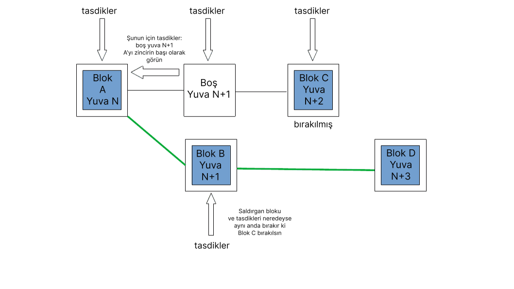

Hırsızlar ve sabotajcılar sürekli Ethereum müşteri yazılımına saldırı fırsatı kollamaktadır. Bu sayfa, Ethereum fikir birliği katmanındaki bilinen saldırıları ve bu saldırıların nasıl savunulduğunu açıklar. Bu sayfadaki bilgiler [daha uzun versiyonundan](https://mirror.xyz/jmcook.eth/YqHargbVWVNRQqQpVpzrqEQ8IqwNUJDIpwRP7SS5FXs) uyumlu hale getirilmiştir.

## Ön koşullar {#prerequisites}

[Hisse ispatı](/developers/docs/consensus-mechanisms/pos/) hakkında bazı temel bilgiler gereklidir. Ayrıca, Ethereum'un [teşvik katmanı](/developers/docs/consensus-mechanisms/pos/rewards-and-penalties) ve çatal seçim algoritması ile [LMD-GHOST](/developers/docs/consensus-mechanisms/pos/gasper) hakkında temel anlayışa sahip olmak size yardımcı olacaktır.

## Salgırganlar ne ister? {#what-do-attackers-want}

Yaygın bir yanlış anlaşılma, başarılı bir saldırganın yeni ether yaratabileceği veya keyfi hesaplardan ether çekebileceğidir. Bunların hiçbiri mümkün değildir çünkü tüm yürütmeler, ağdaki bütün yürütüm işlemcileri tarafından yürütülür. Geçerliliğin temel şartlarını karşılamak zorundadırlar (ör. yürütmelerin göndericinin özel anahtarıyla imzalanması, göndericinin yeterli bakiyeye sahip olması gibi) ya da bu işlemler geri döndürülür. Bir saldırganın gerçek anlamda hedefleyebileceği üç sonuç sınıfı mevcuttur: yeniden düzenlemeler, çift kesinlik veya kesinlik gecikmesi.

**"Yeniden Düzenleme"**, ana zincirdeki blokların yeniden düzenlenmesi, sırasının değiştirilmesidir. Bu eylem sırasında yeni bloklar eklenebilir, çıkarılabilir. Kötü niyetli bir yeniden düzenleme, bazı seçilmiş blokların ağa dahil edilip edilmemesini hedefler ve bu sayede kopya harcama, önden işlem, arkadan işlem gibi yöntemlerle kazanç sağlar (MEV). Yeniden düzenlemeler bazı işlemlerin ana ağa dahil edilmesini de engelleyebilir, bu bir sansür çeşididir. Yeniden düzenleme'nin en uç örneği "kesinlik bozma"dır. Bu, kesinleştirilmiş blokların silinmesi veya başka ve daha önceden kesinleştirilmiş blokla değiştirilmesi şeklinde olabilir. Bu ancak hisselenen etherin ⅓'ünün, saldırgan tarafından yok edilmesi durumunda mümkündür. Bunun olamayacağının garantisi "ekonomik kesinlik" olarak bilinir - bu konuya ilerki bölümlerde değinilecektir.

**Çift kesinlik**; 2 çatalın aynı anda kesinleşebileceği, zincirde kalıcı parçalanmaya yol açabilecek nadir gerçekleşen ancak oldukça tehlikeli bir durumdur. Bu, tüm hisselenmiş etherlerin %34'ünü hedefleyen bir saldırgan için teorik olarak olasıdır. Topluluk çevrimdışı koordine edilmeye ve hangi zincirin takip edileceği hangi zincirin sosyal katmanda güce ihtiyaç duyduğu konusunda anlaşmaya varmaya zorlanır.

**Kesinlik gecikmesi** saldırısı, ağın zincir kısımlarının kesinleşmesi için gereken şartlara ulaşmasını engeller. Kesinlik olmadan Ethereum üzerine inşa edilmiş finansal uygulamalara güvenmek zordur. Kesinlik gecikmesi saldırısının amacı, eğer saldırganın bazı stratejik kısa pozisyonları yoksa doğrudan kâr elde etmek yerine Ethereum'a hasar vermektir.

Sosyal katmandaki saldırı, Ethereum'daki açık güveni zedelemek, etheri değersizleştirmek, benimsenmeyi azaltmak veya bant harici uyumu daha zor hale getirerek Ethereum topluluğunu zayıflatmak olabilir.

Kötü niyetli birinin Ethereum'a neden saldırabileceği üzerine konuştuğumuza göre, bir sonraki bölümler bu işi _nasıl_ yapabileceği üzerinedir.

## Saldırı Yöntemleri {#methods-of-attack}

### Katman 0 Saldırıları {#layer-0}

Her şeyden önce, Ethereum'da aktif olarak rol almayan bireyler (istemci yazılımları yürüterek) sosyal katmanı (Katman 0) hedefleyerek saldırabilir. 0. Katman Ethereum'un üzerine inşa edildiği bir temel gibidir ve tüm katmanlara yayılıp sıçrayabilecek saldırılar için ciddi potansiyel bir hedeftir. Bazı örnekleri şöyle sıralanabilir:

- Bir yanlış bilgilendirme kampanyası Ethereum'un yol haritasında, geliştirici ekiplerinde, uygulamalarda ve daha birçok yerde topluluğun sahip olduğu güveni baltalayabilir. Bunun sonucunda ağı güvene almak isteyen bireylerin sayısı azalabilir ki bu da hem merkeziyetsizliğin hem de kripto-ekonomik güvenliği azaltır.
- Geliştirici topluluğunu hedef gösteren saldırılar ve/veya tehditler. Bu geliştiricilerin gönüllü istifalarına ve Ethereum ilerlemesinin yavaşlamasına sebep olabilir.

- Yer alma ve benimsenmeyi teşvikten çok hızlı biçimde vazgeçireceğinden aşırı partizan düzenlemeler de Katman 0'a bir saldırı olarak algılanabilir.
- Tartışmaları gölgelemeyi, kilit kararları ertelemeyi, istenmeyen fikir oluşturmayı hedefleyen bilinebilir ancak kötü niyetli kişilerin geliştirici topluluğuna sızmaları.
- Karar vermeyi etkilemesi için Ethereum ekosisteminde kilit oyunculara rüşvet verilmesi.

Bu saldırıları özellikle tehlikeli yapan şey ise çoğu vakada çok az miktarda ana para ve neyin nasıl yapılacağı bilgisinin yeterli oluşudur. Bir Katman 0 saldırısı kripto-ekonomik saldırının bir çarpanı olabilir. Örneğin, sansür veya kesinlik bozma bir şekilde kötü niyetli paydaşların çoğunluğu tarafından getçekleştirilirse, sosyal katmanı zayıflatmak, topluluğun koordine olarak bir cevap vermesini zorlaştırabilir.

Katman 0 saldırılarına karşı savunma genellikle dümdüz değildir ancak bazı temel ilkeler belirlenebilir. Bunlardan biri, Ethereum hakkında gerçek bilginin, dürüst topluluk üyeleri tarafından bloglar, discord sunucuları, açıklamalı özellikler, kitaplar, podcastler, YouTube ve daha fazlası yardımıyla, safsataya oranla daha fazla yayılmasıdır. ethereum.org'da biz, kesin bilgiyi sağlamak ve bunu mümkün olduğu kadar fazla dile çevirmek için sıkı çalışıyoruz. Bir alanı yüksek kaliteli bilgi ve meme'ler ile doldurmak yanlış bilgilendirmeye karşı etkili bir savunmadır.

Sosyal ağ saldırılarına karşı bir diğer önemli güçlendirme de açık görev belirlemesi ve yönetişim protokolüdür. Ethereum; aynı zamanda ölçeklenebilirlik ve sürdürülebilirliğe yüksek önem verirken akıllı sözleşme katman 1'lerinde kendisini, merkeziyetsizleşme ve güvenliğin şampiyonu olarak konumlandırmıştır. Ethereum topluluğunda her ne anlaşmazlık çıkarsa çıksın bu temel ilkeler asgari düzeyde hasarlanır. Bu temel ilkelere karşı hikâyeye değer verme ve onları, EIP (Ethereum Geliştirme Önerisi) sürecinde başarılı gözden geçirme turlarıyla sınama, topluluğun iyi ve kötü aktörleri birbirinden ayırt etmesine ve kötü niyetli aktörlerin Ethereum'un gelecek yöneliminin etkileme kapsamını daraltmasına yardımcı olabilir.

Son olarak, Ethererum topluluğunun açık kalması ve tüm katılımcıları hoş karşılaması kritiktir. Dışlayıcı ve kapı bekçileri olan bir topluluk sosyal saldırılara karşı daha savunmasızdır çünkü "biz ve onlar" anlatılarını kurmak çok daha kolaydır. Kabilecilik ve toksik maksimalizm topluluğu yaralar ve 0. Katmanın sağladığı güvenliği yıpratır. Ağın güvenliği menfaatine olan Etherliler, görüşlerini hem sanal hem de fiziksel dünyada belirtmeli ve Ethereum'un 0. Katman güvenliğine doğrudan katkı sağlamalıdır.

### Protokole saldırma {#attacking-the-protocol}

Herkes Ethereum'un istemci yazılımını yürütebilir. Bir müşteriye bir doğrulayıcı eklemek için kullanıcının mevduat sözleşmesine 32 ether hisselemesi gerekir. Bir doğrulayıcı, kullanıcıya yeni bloklar önerip onları onaylayarak Ethereum ağ güvenliğinde aktif olarak yer alma imkânı tanır. Artık doğrulayıcı, blok zincirin gelecekteki içeriğini etkileyebilecek bir sese sahiptir - dürüstçe çalışıp ödüller aracılığıyla ether zulalarını büyütebilirler ya da kendi çıkarları için süreci manipüle ederek kendi hisselerini riske atabilirler. Bir saldırıyı bağlamanın bir yolu toplam hisselemenin daha büyük kısmını biriktirmek ve sonradan bunları, dürüst doğrulayıcıları saf dışı bırakmak için kullanmaktır. Saldırganın kontrol ettiği hisse yüzdesi arttıkça özellikle gelecekte keşfedeceğimiz iktisadi kilometre taşlarında oy verme kuvveti de artacaktır. Ancak çoğu saldırgan bu yolla saldırmak için yeterince ether biriktirmeyi başaramaz, bu sebeple bu yol yerine dürüst çoğunluğu belirli bir yol içine çekmek için kurnazca teknikler kullanırlar.

Temelde, tüm düşük bahisli saldırılar, doğrulayıcıların iki tür yanlış davranışının ince varyasyonlarıdır: yetersiz aktivite (onaylama/öneride bulunmama veya geç bulunma) ya da aşırı aktivite (bir yuvada çok fazla kez öneride/onaylamada buluma). En basit haliyle bu eylemler, çatal seçim algoritması ve teşvik katmanı tarafından kolayca ele alınabilir, ancak sistemi bir saldırganın avantajına çevirmenin zekice yolları elbette bulunur.

### Düşük miktar ETH kullanılan saldırılar {#attacks-by-small-stakeholders}

#### yeniden düzenlemeler {#reorgs}

Birçok sayfa, toplam hisselenmiş etherin yalnızca küçük bir kısmı kullanılarak yeniden düzenleme ya da kesinlik gecikmesini başarmış Ethereum karşı saldırılarını açıkladı. Bu saldırılar genellikle saldırganın diğer doğrulayıcılara dayandırdığı bazı bilgilere ve daha sonra onları bazı ayrıntılar ve/veya elverişli zamanda ortaya bırakmasına dayanır. Genellikle bazı dürüst blokları, kurallı zincirden ayırmayı amaçlarlar. [Neuder ile arkadaşları 2020'de](https://arxiv.org/pdf/2102.02247.pdf) bir saldırgan doğrulayıcının bir bloka (`B`) belirli bir yuva `n+1` için nasıl ispat yarattığını, ancak ağdaki diğer düğümlerden nasıl alıkoyduğunu bize gösterdi. Bunun yerine bir sonraki yuvaya `n+2` dek ispatlı blok ile kalırlar. Dürüst bir doğrulayıcı yuva `n+2` için bir blok (`C`) önerir. Neredeyse eş zamanlı olarak saldırgan, geri tuttuğu blok olan (`B`)'yi ve onun için tutulan beyanlarını yayınlayabilir. Ayrıca yuva `n+2`'nin oylarıyla `B`'nin zincirin başı olduğunu beyan ederek dürüst blok `C`'nin varlığını etkili bir şekilde inkar etme gücünü sağlayabilir. Dürüst blok `D` salındığı zaman çatal seçim algoritması `D`'nin `B` üzerine inşa edilmesinin `D`'nin `C` üzerine inşa edilmesinden daha ağır olduğunu görür. Saldırgan, sonrasında eski ön yeniden düzenleme 1. blokunu kullanarak kurallı zincirin `n+2` yuvasındaki `C` dürüst blokunu ortadan kaldırmayı başardı. Hisselerin [%34'üne sahip bir saldırganın](https://www.youtube.com/watch?v=6vzXwwk12ZE) bu saldırıda başarıya ulaşma ihtimali, [bu notta](https://notes.ethereum.org/plgVdz-ORe-fGjK06BZ_3A#Fork-choice-by-block-slot-pair) açıklandığı üzere çok fazladır. Teorik olarak da olsa bu saldırı daha küçük hisselemelerle denenebilir. [Neuder ve diğeri 2020 yılında](https://arxiv.org/pdf/2102.02247.pdf), bu saldırının %30 hisse ile yapıldığını [söylese de daha sonrasında saldırının %2'lik hisse ile ve](https://arxiv.org/pdf/2009.04987.pdf) diğer bölümde inceleyeceğimiz [dengeleme yöntemlerini kullanan tek bir doğrulayıcı tarafından](https://arxiv.org/abs/2110.10086#) yapılmış olduğu ortaya çıkmıştır.

Tek blok yeniden düzenleme saldırısının kavramsal diyagramı yukarıda açıklanmıştır (şuradan alınmıştır: https://notes.ethereum.org/plgVdz-ORe-fGjK06BZ_3A#Fork-choice-by-block-slot-pair)

Daha karmaşık bir saldırı dürüst doğrulayıcı ekibini, zincirin başı hakkında farklı görüşlere sahip apayrı gruplar bölebilir. Bu, **dengeleme saldırısı** olarak bilinir. Saldırgan, blok önerme sırasını bekler ve söz konusu zaman geldiğinde iki taneyi denkleştirir ve önerir. Sonrasında dürüst doğrulayıcı ekibinin bir yarısına bir bloku, diğer yarısına diğer bloku gönderir. Denkleştirme, çatal seçim algoritması tarafından algılanır ve blok önericisi ağdan ceza ile atılır, ancak iki blok ve her bir çatala güvenen birer doğrulayıcı ekip yarımları var olmaya devam eder. Bu sırada geriye kalan kötü niyetli doğrulayıcılar kendi ispatlarını geri çeker. Sonra, aynı çatal seçim algoritmasının yürütüldüğü gibi iki çataldan birini kabullenenler seçici olarak ispatları yayınlamaya başlar, birikmiş ispat ağırlığını çatallarlardan birine verirler. Bu, saldırgan doğrulayıcıların iki çatal arasında eşit sayıda doğrulayıcı sağladıkları sürece sonsuza dek sürebilir. Herhangi bir çatal 2/3 süper çoğunluğunu yakalayamayacağından ağ kesinleştirilemez.

**Sıçrama saldırıları** benzerdir. Oylar tekrardan saldırgan doğrulayıcılar tarafından geri çekilir. Oyları iki çatal arasında eşit bir bölünmeyle dağılım sağlamak için yayınlamak yerine, çatal A ve çatal B arasında değişen kontrol noktalarını gerekçelendirmek adına oylarını uygun anlarda kullanırlar. İki çatal arasında bu gerekçelendirmenin terse çevrilmesi, her iki zincirde de sonuçlandırılabilir olan haklı kaynak ve hedef kontrol noktalarının ikizleşmesini engeller, böylece kesinlik durdurulur.

<YouTube id="xcPxwhrg3Ao"/>

Sıçrama saldırıları da dengeleme saldırıları da saldırganın, ağ arasında genellikle olmayan ileti zamanlaması üzerindeki ince kontrolüne bel bağlar. Yine de savunmalar protokol içine, daha yavaş olanlarına kıyasla hızlı iletilere, fazladan ağırlıklandırılımış formda inşa edilmiştir. Bu, [önerici ağırlık güçlendirmesi](https://github.com/ethereum/consensus-specs/pull/2730) olarak bilinir. Sıçrama saldırılarına karşı savunabilmek için çatal seçim algoritması güncellenerek, en son gerçekleşen haklı kontrol noktasını yalnızca her dönemin [ilk 1/3 yuvasında](https://ethresear.ch/t/prevention-of-bouncing-attack-on-ffg/6114) bir alternatif zincire geçebilecek şekilde değiştirilmiştir. Bu koşul, saldırganın daha sonra kullanmak üzere oy biriktirmesini engeller - çatal seçim algoritması öncelikli seçtiği kontrol noktasına sadık kalarak bu süre zarfında çoğu dürüst doğrulayıcı dönemin ilk 1/3'ünde seçilmiş kontrol noktasında sadık kalarak oylamış olur.

Bu önlemlerin birleşimi, dürüst bir blok önericisinin yuvanın başlangıcından hemen sonra bloklarını çok hızlı bir şekilde yayınlayabileceği, ardından malum yeni blok için çatal seçim algoritmasının farklı bir zincire geçmesini nedenselleştiren ~1/3 yuva (4 saniyede) kadarlık bir süre doğduğu senaryoya imkân tanır. Aynı son tarihin ardından, yavaş doğrulayıcılardan gelen tasdikler, daha önce gelenlere kıyasla daha düşük ağırlık sahibi olur. Bu, zincirin başını belirlemede hızlı önericileri ve doğrulayıcıları güçlü bir şekilde destekler ve dengeleme veya sıçrama saldırısının başarı ihtimalini önemli ölçüde azaltır.

Not almaya değer, o sunucu yalnız "ucuz yeniden düzenleme" karşıtı savunmasını arttırınca, başka bir deyişle bunlar küçük bir kilitle birlikte saldırgan tarafından denenmiş. Aslında, önerici artırıcının kendisi büyük hissedarlar tarafından oynanabilir. [Bu gönderinin](https://ethresear.ch/t/change-fork-choice-rule-to-mitigate-balancing-and-reorging-attacks/11127) yazarı bir saldırganın %7'lik bir kilitle oylarını nasıl stratejik bir şekilde dürüst onaylayıcıları kandırarak kendilerinin çatallanmasını oluşturmak ve dürüst bir blokun yeniden düzenlenmesi için dağıtabileceğini açıklıyor. Bu saldırı, olası olmayan ideal gecikme durumları tahmin edilerek planlanmıştır. En büyük kilit aynı zamanda daha fazla büyük risk ve daha güçlü engel anlamına geldiği için ihtimaller saldırgan için hâlâ çok uzun.

Öneri arttırıcıya rağmen [özel olarak LMD kuralını hedef alan bir dengeleme saldırısı](https://ethresear.ch/t/balancing-attack-lmd-edition/11853) da önerilmiştir. Bir saldırgan blok önerilerini ve her bir blokun yarı ağını yayarak, çatallar için yaklaşık dengede olan iki rakip zinciri ayarlar. Sonra gizlice anlaşmış doğrulayıcılar, ağın yarısı önce Çatal `A`'ya giden oyları, diğer yarısını da Çatal `B`'ye giden oyları alacak şekilde oylarını gönderirler. LMD kuralı ikinci tasdiki yok saydığı ve her doğrulayıcı için sadece ilkini tuttuğu için, ağın yarısı `A` için oyları görür ve `B` için hiç görmez, diğer yarısı ise `B` için oyları görür ve `A` için hiç görmez. Yazarlar LMD kuralını düşmana bir dengeleme saldırısı düzenlemesi için "dikkate değer seviyede güç" vermek olarak açıklarlar.

Bu LMD saldırı vektörü [çatal seçim algoritmasının güncellenmesi](https://github.com/ethereum/consensus-specs/pull/2845) ile kapatılmıştır yani çatal seçim tercihinden kaçamaklı doğrulayıcıları tamamen yok sayar. Kaçamaklı doğrulayıcıların gelecekteki etkisi ayrıca çatal seçim algoritması tarafından düşürülür. Bu yukarıda belirtilen dengeleme saldırısını önlerken aynı zamanda çığ saldırılarına karşı sağlamlığı da sürdürür.

[**Çığ saldırısı**](https://ethresear.ch/t/avalanche-attack-on-proof-of-stake-ghost/11854/3) denilen diğer bir saldırı türü [Mart 2022 belgesinde](https://arxiv.org/pdf/2203.01315.pdf) açıklanmıştır. Bir çığ saldırısı düzenlemek için, saldırganın birkaç ardışık blok önericisini kontrol etmesi gerekir. Her blok öneri yuvasında, saldırgan blokunu tutar ve zincir tutulan bloklarla eşit bir alt ağaç ağırlığına gelene kadar biriktirir. Sonrasında, maksimum olarak muğlaklık oluşturmak için tutulan bloklar serbest bırakılır. Yazarlar önerici güçlendirmesinin - dengeleme ve sekme saldırılarına karşı ana defans - bazı çığ saldırılarına karşı koruma sağlamadığını belirtirler. Ancak, yazarlar saldırıyı sadece Ethereum'un çatal seçim algoritmasının yüksek derecede idealize edilmiş bir versiyonunda göstermişlerdir (LMD olmadan GHOST kullanmışlardır).

Çığ saldırısı LMD-GHOST çatal seçim algoritmasının LMD kısmı tarafından engellenir. LMG "latest-message-driven (en son yürütülen mesaj)" anlamına gelir ve bir doğrulayıcının diğer doğrulayıcılardan aldığı son mesajların bulunduğu, doğrulayıcı tarafından tutulan bir tablodur. Bu alan sadece spesifik bir doğrulayıcı için yeni bir mesaj mevcut tablodakinden daha sonraki bir yuvadan ise güncellenir. Pratikte, her bir yuva kabul edilen ilk mesajı aldığı ve eş olan ekleme mesajların görmezden gelinmesi anlamına gelir. Başka bir şekilde anlatılacak olursa, fikir birliği istemcileri muğlaklıkları saymazlar - her bir doğrulayıcıdan gelen ilk mesajı kullanırlar ve muğlaklıklar basitçe yok sayılır, çığ saldırıları önlenir.

Çatal seçim kuralına önerici güçlendirmesi tarafından sağlanan güvenliğe katkı sağlayabilecek birkaç potansiyel gelecek güncellemesi bulunmaktadır. Biri [gözlem-birleşim](https://ethresear.ch/t/view-merge-as-a-replacement-for-proposer-boost/13739)'dir, tasdikçiler bir yuvanın başlangıcından `n` saniye önce çatal seçimi görüşlerini dondururlar ve önerici sonrasında ağ üzerinde zincirin görünümünün senkronize edilmesine yardımcı olur. Diğer bir yükseltme ise, zinciri sadece tek bir yuvadan sonra kesinleştirerek mesaj zamanlamasına dayalı saldırılara karşı koruma sağlayan [tek yuva kesinliğidir](https://notes.ethereum.org/@vbuterin/single_slot_finality).

#### Kesinlik Gecikmesi {#finality-delay}

[Düşük maliyetli tek blok yeniden düzenleme saldırısından ilk bahseden yazı](https://econcs.pku.edu.cn/wine2020/wine2020/Workshop/GTiB20_paper_8.pdf), dönem-sınırı blokunu teklif edenin salgırgan olması durumuna dayanan, Kesinlik Gecikmesinden ("canlılık hatası" olarak da bilinir) de bahseder. Bu durum kritiktir çünkü dönem sınırı bloklarını, Casper FFG zincirin belirli parçalarını kesinleştirmek için bir kontrol noktası olarak kullanır. Saldırgan basitçe, yeterli sayıda dürüst doğrulayıcı FFG oylarını, kesinleştirme hedefi olarak bir önceki dönem sınırı bloku lehine kullanana kadar blokunu bekletir. Bunun ardından beklettiği bloku teklif eder. Bloklarını doğrularlar, diğer dürüst doğrulayıcılar da kendi bloklarını doğrular ve bu durum hedefi farklı kontrol noktaları olan bir çatallanma oluşturur. Eğer zamanlama doğruysa, bu durum kesinleştirmeyi geciktirir çünkü çatallanmanın iki tarafında da, zinciri doğrulayacak 2/3 mutlak çoğunluk sağlanamaz. Kilitlediği miktar azaldıkça, saldırganın zamanlamasının daha nokta atışı olması gerekir. Çünkü saldırgan doğrudan daha az onaylamada bulur ve bu da dönem sınırı blokunu teklif eden onaylayıcı olma olasılığını düşürür.

#### Uzun mesafe saldırıları {#long-range-attacks}

Hisse ispatı blok zincirlerine özel olan bir saldırı sınıfı vardır, bu saldırı sınıfı başlangıç blokunun doğrulamasına katılan doğrulayıcılardan birinin, orijinal zincir yanında ayrı bir çatal zinciri yürütmesine, ileri ve fırsat görülen bir noktada dürüst onaylayıcıları da bu çatal zinciri onaylamaya geçmelerine ikna etmesine dayanır. Bu tür bir saldırı Ethereum üzerinde mümkün değildir çünkü kesinlik aygıtı, belirli aralıklarla (kontrol noktaları) tüm onaylayıcıların orijinal ağın durumu üzerinde anlaşmalarını mecbur kılar. Bu basit mekanizma, uzun menzilli saldırıları bertaraf eder çünkü Ethereum asla kesinleştirilmiş blokları yeniden düzenletmez. Ağa katılan yeni düğümler, yakın zamanlı ve güvenilir bir durum karması ("[zayıf öznellik](https://blog.ethereum.org/2014/11/25/proof-stake-learned-love-weak-subjectivity/) kontrol noktası") bularak ve bunu bir Başlangıç bloku gibi kullanarak üzerine inşa eder. Bu ağa katılan yeni düğümlerin, kendi başlarına bilgi onaylamaya başlamadan onlara bir "güven kapısı" oluşturur.

#### Hizmet Reddi {#denial-of-service}

Ethereum'un PoS mekanizması, her bir yuvada blok önericisi olması adına toplam doğrulayıcı ekibinden tek bir doğrulayıcıyı seçer. Bu, açıkça bilinen bir fonksiyon kullanılarak işlenebilir ve bir rakibin, kendi blok önerilerinin önceliği adına bir sonraki blok önericisini bilmesi mümkündür. Daha sonra saldırgan, kendi eşleriyle bilgi takasını önlemek için blok önericisini spamlayabilir. Ağın geri kalanı için bu durum, blok önericisinin çevrimdışı olduğu ve yuvanın boş gideceği şeklinde ortaya çıkar. Bu, belli başlı doğrulayıcılara karşı onların blok zincire bilgi eklemelerini engelleyen, bir çeşit sansür formu olabilir. Tekil gizli lider seçimleri (SSLE) veya tekil olmayan gizli lider seçimleri uygulamak DoS risklerini azaltır çünkü sadece blok önericisi seçildiğini bilir ve seçim önceden bilinemez. Bu henüz uygulanmadı, ancak [araştırma ve geliştirmenin](https://ethresear.ch/t/secret-non-single-leader-election/11789) aktif bir alanıdır.

Tüm bunlar, küçük bir hisse ile Ethereum'a başarıyla saldırmanın çok zor olduğu gerçeğini gösterir. Burada açıklanan uygun saldırılar; idealleştirilmiş çatal seçim algoritması, olanaksız ağ şartları veya saldırgan aracıların halihazırda istemci yazılımına küçük yamalar ile yakın bağ kurmalarını gerektirir. Bu, tabii ki sıfırıncı gün açıklarının mevcut olması ihtimalini sıfırlamaz, ancak azınlık hisse bir saldırganın etkili olması için gereken teknik yeteneğin, fikir birliği katmanı bilgisinin ve şansın ekstrem şekilde yüksek sınırını gösterir. Bir saldırganın bakış açısından en iyi iddiaları, mümkün olduğu kadar fazla ether biriktirmek ve toplam hisselerin daha büyük bir oranıyla, güçlenerek geri dönmektir.

### Toplam hissenin >= %33'ünü kullanan saldırganlar {#attackers-with-33-stake}

Bu makalede daha önce açıklanan tüm saldırıların başarılı olması, saldırganın oy vermek için daha fazla hisselenmiş ethere sahip olduğu ve her bir yuvada, blok önermesi için daha fazla doğrulayıcının seçildiği zamanda daha olası hale gelir. Böylece kötü niyetli bir doğrulayıcı mümkün olan en fazla miktarda hisselenmiş etheri kontrol etmeyi hedefleyebilir.

Hisselenmiş etherin %33'ü saldırgan için bir kıyastır çünkü bu miktardan fazla olan her şeyle diğer doğrulayıcıların eylemlerini incelikle kontrol etmek zorunda kalmadan zincir kesinleşmesini engelleme yeteneğine sahipt olunur. Hep birlikte bir anda yok olabilirler. Eğer hisselenmiş etherin 1/3'ü ya da daha fazlası kötü niyetle ispatlanır veya ispatlanmaları başarısız olursa kalan 2/3 süper çoğunluk var olamaz ve zincir kesinleşemez. Buna karşı savunma, hareketsizlik sızıntısıdır. Hareketsizlik sızıntısı, ispatlamada başarısız olan veya çoğunluğa karşı ispata uğraşan doğrulayıcıları belirler. Zincirin tekrardan kesinleşebilmesi için ispatlamayan doğruyucuların hep birlikte sahip olduğu etherin toplamın 1/3'ünden daha azını temsil edene kadar sahip oldukları bu hisselenmiş ether kademe kademe uzaklaştırılır.

Hareketsizlik sızıntısının amacı zincirin tekrardan kesinleşebilmesidir. Ancak saldırgan da hisselenmiş etherinin bir kısmını kaybeder. Toplam hisselenmiş etherin %33'ünü temsil eden doğrulayıcıların sürekli hareketsizliği, doğrulayıcılar cezalandırılmasa dahi oldukça pahalıdır.

Ethereum ağının senkronize olmadığını varsaydığımızda (ör. gönderilen ve alınan mesajlar arasında gecikme olması) toplam hisselerin %34'üne sahip saldırgan çift kesinliğe yol açabilir. Bu; saldırganlar blok üreticileri olarak seçildiği zaman birden fazla bloku denkleştirip daha sonra da tüm doğrulayıcılarıyla oylamalarından dolayıdır. Bu, blok zincirin çatalının var olduğu ve her birinin %34 hisselenmiş ether ile oylandığı bir durum yaratır. Her bir çatal, böyle bir durumda her iki zincirin de kesinleşebileceği (çünkü saldırgan doğrulayıcıların %34'ü + kalan %66'nın yarısı = %67), süper çoğunluk tarafından desteklenmek için kalan doğrulayıcıların yalnızca %50'sinin kendi lehine oy vermelerini gerektirir. Yarışan blokların her biri dürüst doğrulayıcıların yaklaşık %50'si tarafından alınmalıdır, bu nedenle bu saldırı, saldırganın ağ üzerindeki mesajların zamanlaması üzerinde belli bir derecede kontrol sahibi olduğu durumlarda mümkündür. Böylece dürüst doğrulayıcıların yarısını her bir zincire yönlendirebilirler. Saldırganın bu çifte kesinliği elde etmek için kendi tüm kilidini (bugünkü doğrulayıcı kümesiyle yaklaşık 10 milyon ether'in %34'ü) mutlaka yok etmesi gerekecektir. Çünkü saldırganın %34'ü kadar olan doğrulayıcıları aynı anda çifte oy kullanmış olacaktır - en yüksek oranda ceza gerektiren ihlal türüdür. Bu saldırıya karşı savunma, hisselenen toplam etherin %34'ünü yok etmenin çok büyük bir maliyeti olmasıdır. Bu saldırıdan kurtulmak için Ethereum topluluğunun "bant dışında" olarak koordine olması ve çatalın birini takip etmeye ve diğerini görmezden gelmeye karar vermesi gerekecektir.

### Toplam hissenin ~%50'sini kullanan saldırganlar {#attackers-with-50-stake}

Hisselenen etherin %50'sinde, zararlı bir doğrulayıcı grubu teorik olarak zinciri eşit boyutlu iki çatala bölebilir ve ardından %50 hissenin tamamını dürüst doğrulayıcı kümesinin aksine oy vermek için kullanabilir, böylece iki çatalı koruyabilir ve kesinliği önleyebilir. Her iki çataldaki hareketsizlik sızıntısı, sonunda her iki zincirin de kesinleşmesine yol açacaktır. Bu noktada, tek seçenek sosyal iyileşmeye geri dönmektir.

Dürüst doğrulayıcı sayısındaki değişim, ağ gecikmesi vb. faktörler nedeniyle bir saldırgan doğrulayıcı grubunun toplam hissenin tam olarak %50'sini sürekli olarak kontrol edebilmesi çok olası değildir. Bu tür bir saldırıyı gerçekleştirmenin büyük maliyeti ile başarılı olma olasılığının düşük olması, rasyonel bir saldırgan için güçlü bir caydırıcı gibi görünmektedir, özellikle _%50'nin üzerindeki_ daha fazla güce erişmek için küçük bir ek yatırım gerektiğinde.

Toplam hissenin >%50'sinde, saldırgan çatal seçim algoritmasına hükmedebilir. Bu durumda, saldırgan, dürüst istemcileri kandırmaya gerek kalmadan kısa yeniden yapılandırmalar için yeterli kontrolü sağlayarak çoğunluk oyu ile onaylayabilecektir. Dürüst doğrulayıcılar aynı şeyi yapacaktır çünkü çatal seçim algoritmaları da saldırganın tercih ettiği zinciri en ağır olarak görecek ve böylece zincir kesinliğe ulaşabilecektir. Bu, saldırganın belirli işlemleri sansürlemesini, kısa vadeli yeniden düzenlemeleri gerçekleştirmesini ve blokları kendi lehlerine yeniden düzenleyerek maksimum MEV'yi çıkarmasını sağlar. Bu tür bir saldırıya karşı savunma, çoğunluk hissesinin (şu anda yaklaşık 19 milyar ABD doları) risk altına alınmasına neden olan büyük maliyettir çünkü sosyal katmanın muhtemelen dürüst bir azınlık çatalını benimseyip, saldırganın hissesinin değerini dramatik bir şekilde düşürme eğiliminde olmasıdır.

### Toplam hissenin >=%66'sını kullanan saldırganlar {#attackers-with-66-stake}

Hisselenmiş toplam eterin %66'sı veya daha fazlasına sahip olan bir saldırgan, herhangi bir dürüst doğrulayıcıyı zorlamak zorunda kalmadan tercih ettiği zinciri kesinleştirebilir. Saldırgan, tercih ettiği çatal için oy kullanabilir ve ardından kesinleştirebilir çünkü basitçe dürüst olmayan bir üstün çoğunluk ile oy kullanabilirler. Saldırgan, üstün çoğunluk hissedarı olarak harcama, geri sarma ve yeniden harcama, belirli işlemleri sansürleme ve istediği zaman zinciri yeniden düzenleme gücüyle sonuçlandırılmış blokların içeriğini her zaman kontrol edecektir. %51 yerine, %66'yı kontrol etmek için ek ether satın alarak, saldırgan etkin bir şekilde sonradan yapılan yeniden düzenleme ve yeniden bozma yeteneğini satın alıyor (yani hem geçmişi değiştirme hem de geleceği kontrol etme yeteneği). Buradaki tek gerçek savunma, hisselnmiş toplam etherin %66'sının yüksek maliyeti ve alternatif bir çatalın benimsenmesini koordine etmek için sosyal katmana geri dönme seçeneğidir. Bunu bir sonraki bölümde daha detaylı inceleyebiliriz.

## İnsanlar: Savunmanın son hattı {#people-the-last-line-of-defense}

Dürüst olmayan doğrulayıcılar zincirin kendi tercih ettikleri sürümünü tamamlamayı başarırlarsa, Ethereum topluluğu zor duruma düşer. Kanonik zincir, geçmişine kazınmış dürüst olmayan bir bölüm içerirken, dürüst doğrulayıcılar alternatif (dürüst) bir zinciri onayladıkları için cezalandırılabilirler. Kesinleşmiş ancak yanlış bir zincirin, bir hatadan da kaynaklanabileceğini unutmayın. Sonuç olarak, son yedek seçenek, olayı çözmesi için sosyal katmana (Katman 0) güvenmektir.

Ethereum'un PoS mutabakat mekanizmasının güçlü yönlerinden biri, topluluğun bir saldırıyla karşılaştığında kullanabileceği [çeşitli savunma stratejileri](https://youtu.be/1m12zgJ42dI?t=1712) bulunmasıdır. En düşük tepki, saldırganların doğrulayıcılarını ağdan zorla çıkararak herhangi bir ek ceza uygulamadan olabilir. Ağa tekrar katılmak isteyen saldırgan, doğrulayıcı kümesinin yavaşça büyümesini sağlayan bir etkinleştirme kuyruğuna katılmak zorunda kalacaktır. Örneğin, hisselenmiş ether miktarını ikiye katlamak için yeterli sayıda doğrulayıcı eklemek yaklaşık 200 gün sürer; bu da dürüst doğrulayıcılara, saldırganın bir sonraki %51 saldırı girişiminde bulunabilmesi için 200 gün süre kazandırır. Ancak topluluk, saldırgana daha sert cezalar verme kararı da alabilir. Önceki ödülleri iptal etmek veya hisselenen sermayelerinin bir kısmını (yüzde 100'e kadar) yakmak gibi.

Saldırgana uygulanan ceza ne olursa olsun, topluluk aynı zamanda Ethereum istemcilerine kodlanmış olan çatal seçim algoritması tarafından tercih edilen sahte zincirin gerçekte geçersiz olduğuna ve topluluğun dürüst zincir üzerine inşa etmesi gerektiğine karar vermek zorundadır. Dürüst doğrulayıcılar; örneğin, saldırının başlamadan önce klasik zincirden ayrılan veya saldırganın doğrulayıcılarını zorla çıkaran Ethereum blok zincirinin topluluk tarafından kabul edilen bir çatalının üzerine inşa etmeye kolektif olarak karar verebilirler. Dürüst doğrulayıcılar, saldırganın zincirine (haklı olarak) tanıklık etmedikleri için kendilerine uygulanan cezalardan kaçınmak için bu zincir üzerine inşa etmeye teşvik edilirler. Borsalar, erişim sağlayıcıları ve Ethereum üzerine inşa edilmiş uygulamalar, muhtemelen dürüst zincirde bulunmayı tercih eder ve dürüst doğrulayıcıları dürüst blok zinciri takip ederler.

Ancak, bu önemli bir yönetişim zorluğu olabilir. Kuşkusuz bazı kullanıcılar ve doğrulayıcılar dürüst zincire dönüş nedeniyle zarar görebilir, saldırıdan sonra doğrulanan bloklardaki işlemler potansiyel olarak geri alınabilir, uygulama katmanını bozabilir ve bazı kullanıcılar için "kod hukuktur" inancını sarsabilir. Bu nedenle, bir geri dönüş durumu ciddi etik ve teknik zorluklar içerebilir. Borsaların ve uygulamaların büyük olasılıkla zincir dışı işlemleri, şimdi geri alınabilecek olan zincir üzerindeki işlemlere bağlı olacaktır. Bu, düzeltilmesi zor bir şekilde geri çekilmeler ve revizyonlar zincirini başlatabilir. Özellikle haksız kazançlar karıştırıldıysa, DeFi veya diğer türevlere yatırıldıysa ve dürüst kullanıcılar için ikincil etkileri varsa, bu durumu adil bir şekilde çözmek zor olabilir. Kuşkusuz bazı kullanıcılar, belki de kurumsal olanlar, ya akıllıca davranarak ya da tesadüfen, dürüst olmayan zincirden zaten fayda sağlamış olabilirler ve kazançlarını korumak için bir çatala karşı çıkabilirler. %51> saldırılara karşı topluluk tepkisinin pratikte denemesi, akılcı ve koordineli bir önlem planının hızla uygulanabilmesini sağlamak için çağrılar yapılmıştır. Vitalik tarafından ethresear.ch platformunda bazı yararlı tartışmalar ve bilgiler [burada](https://ethresear.ch/t/timeliness-detectors-and-51-attack-recovery-in-blockchains/6925), [burada](https://ethresear.ch/t/responding-to-51-attacks-in-casper-ffg/6363) ve Twitter'da [burada](https://twitter.com/skylar_eth/status/1551798684727508992?s=20&t=oHZ1xv8QZdOgAXhxZKtHEw) sunulmuştur. Koordineli bir sosyal yanıtın amacı, saldırgana yönelik cezayı hedefli ve belirli yapmak, diğer kullanıcılar üzerindeki etkileri en aza indirmektir.

Yönetişim, halihazırda karmaşık bir konu. Dürüst olmayan kesinleştirme zincirine karşı bir Katman 0 acil tepkiyi yönetmek, şüphesiz Ethereum topluluğu için zorlu olabilir, ancak Ethereum'un geçmişinde [gerçekleşmiştir](/history/#dao-fork-summary) - [iki kez](/history/#tangerine-whistle)).

Yine de, son çare olarak gerçek dünyada bir çözüm bulunmasının oldukça tatmin edici bir yönü vardır. Sonuç olarak, üzerimizde bulunan bu olağanüstü teknoloji yığınına rağmen, en kötü durum gerçekleşirse, gerçek insanlar çözüm bulmak için bir araya gelmek zorunda kalacaklardır.

## Özet {#summary}

Bu sayfa, saldırganların Ethereum'un hisse ispatı mutabakat protokolünü istismar etmeye çalışabilecekleri yolları inceledi. Hisselenen toplam etherin artan oranlarına sahip saldırganlar için yeniden düzenlemeler ve kesinlik gecikmeleri incelendi. Genel olarak, daha zengin bir saldırgan daha yüksek bir başarı şansına sahiptir çünkü hisseleri, gelecekteki blok içeriklerini etkileyebilecekleri oy gücüne dönüşür. Belli eşik miktarlarda hisselenen ether ile saldırganın gücü yükselir:

%33: kesinlik gecikmesi

%34: kesinlik gecikmesi, çift kesinlik

%51: kesinlik gecikmesi, çift kesinlik, sansür, blok zincir geleceği üzerinde kontrol

%66: kesinlik gecikmesi, çift kesinlik, sansür, blok zincir geçmişi ve geleceği üzerinde kontrol

Ayrıca, küçük miktarlarda hisselenmiş ether gerektiren ama dürüst doğrulayıcı ekibini kendi lehlerine çevirip mesaj zamanlaması üzerinde ince kontrol sağlayan, çok tecrübeli bir saldırgana ihtiyaç duyan, daha karışık saldırılar da vardır.

Genelde, bu potansiyel saldırı vektörlerine rağmen, başarılı bir saldırı riski düşüktür; kesinlikle iş ispatı eş değerlerinden daha düşüktür. Bunun sebebi, oy güçleriyle dürüst doğrulayıcıları bastırmayı hedefleyen bir saldırgan tarafından riske atılan hisselenmiş etherin yüksek maliyetidir. Yerleşik "ödül-ceza" teşvik katmanı, çoğu kötülüğe, özellikle düşük hisse sahibi saldırganlara karşı koruma sağlar. Daha kurnaz sıçrama ve dengeleme saldırılarının da başarılı olma olasılığı düşüktür çünkü gerçek ağ koşulları, mesajların belirli doğrulayıcı alt kümelerine ulaşmasını çok zor hale getirir ve istemci ekipleri, basit onarımlarla, bilinen sıçrama, dengeleme ve çığ saldırısı vektörlerini kapatırlar.

%34, %51 veya %66 saldırıları çözülmek için büyük ihtimalle bant dışı sosyal koordinasyon gerektirecektir. Bu, topluluk için zahmetli olsa da, topluluğun bant dışı karşılık verebilmesi, saldırgan için güçlü bir caydırıcıdır. Ethereum sosyal katmanı temel dayanaktır - teknik olarak başarılı bir saldırı, topluluğun dürüst bir çatal benimsemesiyle etkisiz hale getirilebilir. Saldırgan ile Ethereum topluluğu arasında bir yarış olabilir - %66 saldırısı için harcanan milyarlarca dolar, saldırganı Ethereum topluluğu tarafından yok sayılan hileli zincirde likit olmayan hisselenmiş ether ile bırakan başarılı bir sosyal koordinasyon saldırısı tarafından yok edilebilir. Bunun, saldırgan için kârlı olma ihtimali, etkin bir caydırıcı olacak kadar düşüktür. İşte bu yüzden, birbirine sıkıca bağlı değerlere sahip sosyal bir katmanı sürdürmeye yönelik yatırımlar çok önemlidir.

## Daha Fazla Okuma {#further-reading}

- [Bu sayfanın daha detaylı bir versiyonu](https://mirror.xyz/jmcook.eth/YqHargbVWVNRQqQpVpzrqEQ8IqwNUJDIpwRP7SS5FXs)
- [Uzlaşma kesinliği üzerine, Vitalik](https://blog.ethereum.org/2016/05/09/on-settlement-finality/)
- [LMD GHOST belgesi](https://arxiv.org/abs/2003.03052)
- [Casper-FFG belgesi](https://arxiv.org/abs/1710.09437)
- [Gasper belgesi](https://arxiv.org/pdf/2003.03052.pdf)
- [Önerici ağırlık arttırma mutabakat özellikleri](https://github.com/ethereum/consensus-specs/pull/2730)
- [ethresear.ch üzerindeki sıçrama saldırıları](https://ethresear.ch/t/prevention-of-bouncing-attack-on-ffg/6114)
- [SSLE araştırması](https://ethresear.ch/t/secret-non-single-leader-election/11789)
