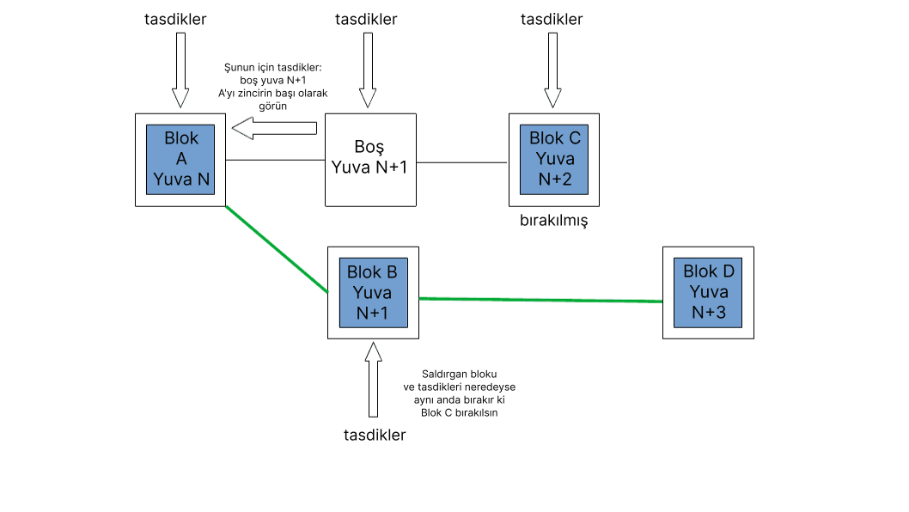

Hırsızlar ve sabotajcılar sürekli olarak [Ethereum](/)'un istemci yazılımına saldırmak için fırsatlar ararlar. Bu sayfa, Ethereum'un mutabakat katmanındaki bilinen saldırı vektörlerini ve bu saldırılara karşı nasıl savunma yapılabileceğini özetlemektedir. Bu sayfadaki bilgiler, [daha uzun bir sürümden](https://mirror.xyz/jmcook.eth/YqHargbVWVNRQqQpVpzrqEQ8IqwNUJDIpwRP7SS5FXs) uyarlanmıştır.

## Ön Koşullar {#prerequisites}

[Hisse Kanıtı (PoS)](/developers/docs/consensus-mechanisms/pos/) hakkında temel düzeyde bilgi gereklidir. Ayrıca, Ethereum'un [teşvik katmanı](/developers/docs/consensus-mechanisms/pos/rewards-and-penalties) ve çatallanma seçimi algoritması olan [LMD-GHOST](/developers/docs/consensus-mechanisms/pos/gasper) hakkında temel bir anlayışa sahip olmak faydalı olacaktır.

## Saldırganlar ne ister? {#what-do-attackers-want}

Yaygın bir yanılgı, başarılı bir saldırganın yeni Ether üretebileceği veya rastgele hesaplardan Ether boşaltabileceğidir. Bunların hiçbiri mümkün değildir çünkü tüm işlemler ağdaki tüm yürütme istemcileri tarafından yürütülür. Geçerliliğin temel koşullarını sağlamaları gerekir (örneğin, işlemlerin göndericinin özel anahtarı ile imzalanmış olması, göndericinin yeterli bakiyesinin olması vb.), aksi takdirde basitçe geri alınırlar. Bir saldırganın gerçekçi olarak hedefleyebileceği üç sonuç sınıfı vardır: yeniden düzenlemeler, çifte kesinlik veya kesinlik gecikmesi.

Bir **"yeniden düzenleme"**, blokların yeni bir sıraya göre yeniden dizilmesidir; bu, kurallı zincirde bazı blokların eklenmesi veya çıkarılmasıyla da olabilir. Kötü niyetli bir yeniden düzenleme, belirli blokların dahil edilmesini veya hariç tutulmasını sağlayarak çifte harcamaya veya önden koşma ve arkadan çalıştırma işlemleri (MEV) yoluyla değer çıkarımına olanak tanıyabilir. Yeniden düzenlemeler, belirli işlemlerin kurallı zincire dahil edilmesini önlemek için de kullanılabilir; bu bir tür sansürdür. Yeniden düzenlemenin en uç biçimi, daha önce kesinleşmiş blokları kaldıran veya değiştiren "kesinlik geri alımı"dır. Bu, yalnızca toplam stake edilen Ether'in ⅓'ünden fazlasının saldırgan tarafından yok edilmesi durumunda mümkündür; bu garanti "ekonomik kesinlik" olarak bilinir, bu konuya daha sonra değineceğiz.

**Çifte kesinlik**, iki çatallanmanın aynı anda kesinleşebildiği ve zincirde kalıcı bir bölünme yarattığı, pek olası olmayan ancak ciddi bir durumdur. Bu, toplam stake edilen Ether'in %34'ünü riske atmaya istekli bir saldırgan için teorik olarak mümkündür. Topluluk, zincir dışı koordinasyon sağlamak ve hangi zincirin takip edileceği konusunda bir anlaşmaya varmak zorunda kalacaktır; bu da sosyal katmanda güç gerektirir.

Bir **kesinlik gecikmesi** saldırısı, ağın zincirin bölümlerini kesinleştirmek için gerekli koşullara ulaşmasını engeller. Kesinlik olmadan, Ethereum üzerine inşa edilmiş finansal uygulamalara güvenmek zordur. Bir kesinlik gecikmesi saldırısının amacı, saldırganın bazı stratejik kısa pozisyonları olmadığı sürece, doğrudan kâr elde etmekten ziyade muhtemelen sadece Ethereum'u bozmaktır.

Sosyal katmana yönelik bir saldırı, Ethereum'a olan kamu güvenini sarsmayı, Ether'in değerini düşürmeyi, benimsenmeyi azaltmayı veya bant dışı koordinasyonu zorlaştırmak için Ethereum topluluğunu zayıflatmayı amaçlayabilir.

Bir düşmanın Ethereum'a neden saldırabileceğini belirledikten sonra, aşağıdaki bölümler bunu _nasıl_ yapabileceklerini incelemektedir.

## Saldırı Yöntemleri {#methods-of-attack}

### Katman 0 Saldırıları {#layer-0}

Öncelikle, Ethereum'a aktif olarak katılmayan (istemci yazılımı çalıştırmayan) bireyler, sosyal katmanı (Katman 0) hedef alarak saldırabilirler. Katman 0, Ethereum'un üzerine inşa edildiği temeldir ve bu nedenle, yığının geri kalanına yayılan sonuçları olan saldırılar için potansiyel bir yüzeyi temsil eder. Bazı örnekler şunları içerebilir:

- Bir dezenformasyon kampanyası, topluluğun Ethereum'un yol haritasına, geliştirici ekiplerine, uygulamalarına vb. duyduğu güveni aşındırabilir. Bu durum, ağın güvenliğini sağlamaya katılmaya istekli bireylerin sayısını azaltarak hem merkeziyetsizliği hem de kripto-ekonomik güvenliği zayıflatabilir.
- Geliştirici topluluğuna yönelik hedefli saldırılar ve/veya gözdağı. Bu, geliştiricilerin gönüllü çıkışına yol açabilir ve Ethereum'un ilerlemesini yavaşlatabilir.

- Aşırı hevesli düzenlemeler de Katman 0'a yönelik bir saldırı olarak değerlendirilebilir, çünkü katılımı ve benimsenmeyi hızla caydırabilir.
- Amacı gereksiz tartışmalarla (bike-shedding) ilerlemeyi yavaşlatmak, önemli kararları geciktirmek, spam oluşturmak vb. olan bilgili ancak kötü niyetli aktörlerin geliştirici topluluğuna sızması.
- Karar alma süreçlerini etkilemek için Ethereum ekosistemindeki kilit oyunculara verilen rüşvetler.

Bu saldırıları özellikle tehlikeli kılan şey, çoğu durumda çok az sermaye veya teknik bilgi gerektirmesidir. Bir Katman 0 saldırısı, kripto-ekonomik bir saldırı üzerinde çarpan etkisi yaratabilir. Örneğin, kötü niyetli bir çoğunluk paydaşı tarafından sansür veya kesinlik geri alımı gerçekleştirilirse, sosyal katmanın zayıflatılması, bant dışı bir topluluk tepkisini koordine etmeyi zorlaştırabilir.

Katman 0 saldırılarına karşı savunma yapmak muhtemelen kolay değildir, ancak bazı temel ilkeler belirlenebilir. Bunlardan biri, topluluğun dürüst üyeleri tarafından bloglar, Discord sunucuları, açıklamalı spesifikasyonlar, kitaplar, podcast'ler ve YouTube aracılığıyla oluşturulan ve yayılan Ethereum hakkındaki kamuya açık bilgiler için genel olarak yüksek bir sinyal-gürültü oranını korumaktır. ethereum.org olarak bizler, doğru bilgileri korumak ve mümkün olduğunca çok dile çevirmek için çok çalışıyoruz. Bir alanı yüksek kaliteli bilgiler ve memlerle doldurmak, dezenformasyona karşı etkili bir savunmadır.

Sosyal katman saldırılarına karşı bir diğer önemli tahkimat, net bir misyon beyanı ve yönetişim protokolüdür. Ethereum, akıllı sözleşme katman 1'leri arasında kendini merkeziyetsizlik ve güvenlik şampiyonu olarak konumlandırırken, aynı zamanda ölçeklenebilirliğe ve sürdürülebilirliğe de büyük değer vermektedir. Ethereum topluluğunda ne tür anlaşmazlıklar ortaya çıkarsa çıksın, bu temel ilkelerden asgari düzeyde ödün verilir. Bir anlatıyı bu temel ilkelere göre değerlendirmek ve EIP (Ethereum İyileştirme Teklifi) sürecindeki ardışık inceleme turları aracılığıyla incelemek, topluluğun iyi aktörleri kötü aktörlerden ayırmasına yardımcı olabilir ve kötü niyetli aktörlerin Ethereum'un gelecekteki yönünü etkileme kapsamını sınırlar.

Son olarak, Ethereum topluluğunun tüm katılımcılara açık ve misafirperver kalması kritik önem taşır. Bekçileri olan ve dışlayıcı bir topluluk, "biz ve onlar" anlatıları oluşturmak kolay olduğu için sosyal saldırılara karşı özellikle savunmasızdır. Kabilecilik ve toksik maksimalizm topluluğa zarar verir ve Katman 0 güvenliğini aşındırır. Ağın güvenliğinde çıkarı olan Ethereum kullanıcıları, çevrim içi ve gerçek dünyadaki davranışlarını Ethereum'un Katman 0 güvenliğine doğrudan bir katkı olarak görmelidir.

### Protokole saldırmak {#attacking-the-protocol}

Herkes Ethereum'un istemci yazılımını çalıştırabilir. Bir istemciye bir doğrulayıcı eklemek için, kullanıcının yatırma sözleşmesine 32 Ether stake etmesi gerekir. Bir doğrulayıcı, kullanıcının yeni bloklar teklif ederek ve onaylayarak Ethereum'un ağ güvenliğine aktif olarak katılmasına olanak tanır. Doğrulayıcı artık blokzincirin gelecekteki içeriğini etkilemek için kullanabileceği bir sese sahiptir; bunu dürüstçe yapıp ödüller aracılığıyla Ether zulasını büyütebilir veya stake'ini riske atarak süreci kendi avantajına manipüle etmeye çalışabilir. Bir saldırı düzenlemenin bir yolu, toplam stake'in daha büyük bir bölümünü biriktirmek ve ardından bunu dürüst doğrulayıcıları oylamada alt etmek için kullanmaktır. Saldırgan tarafından kontrol edilen stake oranı ne kadar büyükse, özellikle daha sonra inceleyeceğimiz belirli ekonomik dönüm noktalarında oy gücü de o kadar büyük olur. Ancak çoğu saldırgan, bu şekilde saldırmak için yeterli Ether biriktiremeyecektir, bu nedenle bunun yerine dürüst çoğunluğu belirli bir şekilde hareket etmeye manipüle etmek için ince teknikler kullanmaları gerekir.

Temel olarak, tüm küçük stake saldırıları iki tür doğrulayıcı hatalı davranışının ince varyasyonlarıdır: eksik aktivite (onaylamama/teklif etmeme veya bunu geç yapma) veya aşırı aktivite (bir slotta çok fazla teklif etme/onaylama). En basit biçimleriyle bu eylemler, çatallanma seçimi algoritması ve teşvik katmanı tarafından kolayca ele alınır, ancak sistemi bir saldırganın avantajına olacak şekilde oynamanın zekice yolları vardır.

### Küçük miktarlarda ETH kullanan saldırılar {#attacks-by-small-stakeholders}

#### yeniden düzenlemeler {#reorgs}

Çeşitli makaleler, toplam stake edilen Ether'in yalnızca küçük bir kısmıyla yeniden düzenlemeler veya kesinlik gecikmesi sağlayan Ethereum saldırılarını açıklamıştır. Bu saldırılar genellikle saldırganın diğer doğrulayıcılardan bazı bilgileri saklamasına ve ardından bunları nüanslı bir şekilde ve/veya uygun bir anda yayınlamasına dayanır. Genellikle bazı dürüst blokları kurallı zincirden çıkarmayı amaçlarlar. [Neuder ve arkadaşları (2020)](https://arxiv.org/pdf/2102.02247.pdf), saldıran bir doğrulayıcının belirli bir `n+1` slotu için bir blok (`B`) oluşturup onaylayabileceğini, ancak bunu ağdaki diğer düğümlere yaymaktan kaçınabileceğini gösterdi. Bunun yerine, onaylanmış o bloğu bir sonraki `n+2` slotuna kadar ellerinde tutarlar. Dürüst bir doğrulayıcı, `n+2` slotu için bir blok (`C`) teklif eder. Neredeyse eşzamanlı olarak saldırgan, sakladığı bloğu (`B`) ve bunun için sakladığı onayları yayınlayabilir ve ayrıca `n+2` slotu için oylarıyla `B` bloğunun zincirin başı olduğunu onaylayarak dürüst `C` bloğunun varlığını fiilen inkar edebilir. Dürüst `D` bloğu yayınlandığında, çatallanma seçimi algoritması `B` üzerine inşa edilen `D` bloğunun, `C` üzerine inşa edilen `D` bloğundan daha ağır olduğunu görür. Saldırgan böylece, 1 blokluk önceden planlanmış bir yeniden düzenleme kullanarak `n+2` slotundaki dürüst `C` bloğunu kurallı zincirden çıkarmayı başarmıştır. [Bu notta](https://notes.ethereum.org/plgVdz-ORe-fGjK06BZ_3A#Fork-choice-by-block-slot-pair) açıklandığı gibi, stake'in [%34'üne sahip bir saldırganın](https://www.youtube.com/watch?v=6vzXwwk12ZE) bu saldırıda başarılı olma şansı çok yüksektir. Ancak teoride bu saldırı daha küçük stake'lerle de denenebilir. [Neuder ve arkadaşları (2020)](https://arxiv.org/pdf/2102.02247.pdf) bu saldırının %30'luk bir stake ile çalıştığını açıkladı, ancak daha sonra [toplam stake'in %2'si](https://arxiv.org/pdf/2009.04987.pdf) ile ve ardından bir sonraki bölümde inceleyeceğimiz dengeleme tekniklerini kullanan [tek bir doğrulayıcı](https://arxiv.org/abs/2110.10086#) için de uygulanabilir olduğu gösterildi.

Yukarıda açıklanan tek blokluk yeniden düzenleme saldırısının kavramsal bir diyagramı (https://notes.ethereum.org/plgVdz-ORe-fGjK06BZ_3A#Fork-choice-by-block-slot-pair adresinden uyarlanmıştır)

Daha karmaşık bir saldırı, dürüst doğrulayıcı setini zincirin başı hakkında farklı görüşlere sahip ayrı gruplara bölebilir. Bu, **dengeleme saldırısı** olarak bilinir. Saldırgan bir blok teklif etme şansını bekler ve bu şans geldiğinde çifte imza atarak iki blok teklif eder. Bir bloğu dürüst doğrulayıcı setinin yarısına, diğer bloğu ise diğer yarısına gönderirler. Çifte imza, çatallanma seçimi algoritması tarafından tespit edilir ve blok teklifçisi ceza kesintisine uğrayıp ağdan atılır, ancak iki blok var olmaya devam eder ve doğrulayıcı setinin yaklaşık yarısı her bir çatallanmayı onaylar. Bu arada, kalan kötü niyetli doğrulayıcılar onaylarını saklarlar. Ardından, çatallanma seçimi algoritması çalışırken, bir veya diğer çatallanmayı destekleyen onayları seçici olarak yeterli sayıda doğrulayıcıya yayınlayarak, birikmiş onay ağırlığını bir veya diğer çatallanma lehine çevirirler. Bu, saldıran doğrulayıcıların iki çatallanma arasında eşit bir doğrulayıcı dağılımını sürdürmesiyle süresiz olarak devam edebilir. Hiçbir çatallanma 2/3 süper çoğunluk çekemeyeceğinden, ağ kesinleşemez.

**Sıçrama saldırıları** da benzerdir. Oylar yine saldıran doğrulayıcılar tarafından saklanır. İki çatallanma arasında eşit bir bölünmeyi korumak için oyları yayınlamak yerine, oylarını uygun anlarda A çatallanması ile B çatallanması arasında gidip gelen kontrol noktalarını gerekçelendirmek için kullanırlar. İki çatallanma arasındaki bu gerekçelendirme gitgelleri, her iki zincirde de kesinleşebilecek gerekçelendirilmiş kaynak ve hedef kontrol noktası çiftlerinin olmasını engelleyerek kesinliği durdurur.

<VideoWatch slug="pos-reorgs-attack-defense" />

Hem sıçrama hem de dengeleme saldırıları, saldırganın ağ genelindeki mesaj zamanlaması üzerinde çok ince bir kontrole sahip olmasına dayanır ki bu pek olası değildir. Yine de, yavaş mesajlara kıyasla hızlı mesajlara verilen ek ağırlıklandırma şeklinde protokole savunmalar yerleştirilmiştir. Bu, [teklif edici ağırlığı artırma](https://github.com/ethereum/consensus-specs/pull/2730) olarak bilinir. Sıçrama saldırılarına karşı savunma yapmak için çatallanma seçimi algoritması, en son gerekçelendirilmiş kontrol noktasının yalnızca [her dönemdeki slotların ilk 1/3'ü](https://ethresear.ch/t/prevention-of-bouncing-attack-on-ffg/6114) sırasında alternatif bir zincirinkine geçebileceği şekilde güncellendi. Bu koşul, saldırganın daha sonra kullanmak üzere oy biriktirmesini engeller; çatallanma seçimi algoritması, çoğu dürüst doğrulayıcının oy kullanmış olacağı dönemin ilk 1/3'ünde seçtiği kontrol noktasına sadık kalır.

Birlikte ele alındığında bu önlemler, dürüst bir blok teklifçisinin bloğunu slotun başlamasından çok kısa bir süre sonra yayınladığı, ardından o yeni bloğun çatallanma seçimi algoritmasının başka bir zincire geçmesine neden olabileceği ~1/3 slotluk (4 saniye) bir sürenin olduğu bir senaryo yaratır. Aynı son tarihten sonra, yavaş doğrulayıcılardan gelen onaylar, daha erken gelenlere kıyasla daha düşük ağırlıklandırılır. Bu, zincirin başını belirlemede hızlı teklif edicileri ve doğrulayıcıları güçlü bir şekilde destekler ve başarılı bir dengeleme veya sıçrama saldırısı olasılığını önemli ölçüde azaltır.

Teklif edici artırmanın tek başına yalnızca "ucuz yeniden düzenlemelere", yani küçük bir stake'e sahip bir saldırgan tarafından denenenlere karşı savunma sağladığını belirtmekte fayda var. Aslında, teklif edici artırmanın kendisi de daha büyük paydaşlar tarafından manipüle edilebilir. [Bu gönderinin](https://ethresear.ch/t/change-fork-choice-rule-to-mitigate-balancing-and-reorging-attacks/11127) yazarları, stake'in %7'sine sahip bir saldırganın, dürüst doğrulayıcıları kendi çatallanmaları üzerine inşa etmeleri için kandırmak ve dürüst bir bloğu yeniden düzenleyerek çıkarmak amacıyla oylarını stratejik olarak nasıl kullanabileceğini açıklamaktadır. Bu saldırı, gerçekleşmesi pek olası olmayan ideal gecikme koşulları varsayılarak tasarlanmıştır. Saldırgan için ihtimaller hala çok düşüktür ve daha büyük stake, aynı zamanda risk altındaki daha fazla sermaye ve daha güçlü bir ekonomik caydırıcılık anlamına gelir.

Teklif edici artırmaya rağmen uygulanabilir olduğu öne sürülen, [özellikle LMD kuralını hedefleyen bir dengeleme saldırısı](https://ethresear.ch/t/balancing-attack-lmd-edition/11853) da önerilmiştir. Bir saldırgan, blok teklifinde çifte imza atarak ve her bir bloğu ağın yaklaşık yarısına yayarak, çatallanmalar arasında yaklaşık bir denge kurarak rekabet eden iki zincir oluşturur. Ardından, işbirlikçi doğrulayıcılar oylarında çifte imza atarlar ve bunu, ağın yarısının önce `A` Çatallanması için oylarını alacağı, diğer yarısının ise önce `B` Çatallanması için oylarını alacağı şekilde zamanlarlar. LMD kuralı ikinci onayı atıp her doğrulayıcı için yalnızca ilkini tuttuğundan, ağın yarısı `A` için oyları görür ve `B` için hiç oy görmez, diğer yarısı ise `B` için oyları görür ve `A` için hiç oy görmez. Yazarlar, LMD kuralının düşmana bir dengeleme saldırısı düzenlemek için "dikkat çekici bir güç" verdiğini belirtmektedir.

Bu LMD saldırı vektörü, çifte imza atan doğrulayıcıları çatallanma seçimi değerlendirmesinden tamamen çıkaracak şekilde [çatallanma seçimi algoritması güncellenerek](https://github.com/ethereum/consensus-specs/pull/2845) kapatılmıştır. Çifte imza atan doğrulayıcıların gelecekteki etkileri de çatallanma seçimi algoritması tarafından düşürülür. Bu, yukarıda özetlenen dengeleme saldırısını önlerken aynı zamanda çığ saldırılarına karşı dayanıklılığı da korur.

[**Çığ saldırıları**](https://ethresear.ch/t/avalanche-attack-on-proof-of-stake-ghost/11854/3) adı verilen başka bir saldırı sınıfı, [Mart 2022 tarihli bir makalede](https://arxiv.org/pdf/2203.01315.pdf) açıklanmıştır. Bir çığ saldırısı düzenlemek için saldırganın art arda birkaç blok teklifçisini kontrol etmesi gerekir. Blok teklif slotlarının her birinde saldırgan, dürüst zincir saklanan bloklarla eşit bir alt ağaç ağırlığına ulaşana kadar bloğunu saklar ve biriktirir. Ardından, saklanan bloklar maksimum düzeyde çifte imza yaratacak şekilde yayınlanır. Yazarlar, dengeleme ve sıçrama saldırılarına karşı birincil savunma olan teklif edici artırmanın, çığ saldırısının bazı varyantlarına karşı koruma sağlamadığını öne sürmektedir. Ancak yazarlar, saldırıyı yalnızca Ethereum'un çatallanma seçimi algoritmasının oldukça idealize edilmiş bir versiyonunda göstermişlerdir (LMD olmadan GHOST kullandılar).

Çığ saldırısı, LMD-GHOST çatallanma seçimi algoritmasının LMD kısmı tarafından hafifletilir. LMD, "en son mesaj odaklı" anlamına gelir ve her doğrulayıcı tarafından tutulan, diğer doğrulayıcılardan alınan en son mesajı içeren bir tabloyu ifade eder. Bu alan, yalnızca yeni mesaj belirli bir doğrulayıcı için tabloda zaten bulunan slottan daha sonraki bir slottan geliyorsa güncellenir. Uygulamada bu, her slotta alınan ilk mesajın kabul edilen mesaj olduğu ve ek mesajların göz ardı edilecek çifte imzalar olduğu anlamına gelir. Başka bir deyişle, mutabakat istemcileri çifte imzaları saymaz; her doğrulayıcıdan ilk gelen mesajı kullanırlar ve çifte imzalar basitçe atılarak çığ saldırıları önlenir.

Çatallanma seçimi kuralında, teklif edici artırmanın sağladığı güvenliğe katkıda bulunabilecek başka potansiyel gelecekteki yükseltmeler de vardır. Bunlardan biri, onaylayıcıların bir slotun başlamasından `n` saniye önce çatallanma seçimi görünümlerini dondurduğu ve ardından teklif edicinin ağ genelinde zincir görünümünü senkronize etmeye yardımcı olduğu [görünüm birleştirme (view-merge)](https://ethresear.ch/t/view-merge-as-a-replacement-for-proposer-boost/13739)'dir. Bir diğer potansiyel yükseltme, zinciri yalnızca bir slottan sonra kesinleştirerek mesaj zamanlamasına dayalı saldırılara karşı koruma sağlayan [tek slotluk kesinliktir](https://notes.ethereum.org/@vbuterin/single_slot_finality).

#### Kesinlik Gecikmesi {#finality-delay}

Düşük maliyetli tek blokluk yeniden düzenleme saldırısını ilk açıklayan [aynı makale](https://econcs.pku.edu.cn/wine2020/wine2020/Workshop/GTiB20_paper_8.pdf), saldırganın bir dönem sınırı bloğu için blok teklifçisi olmasına dayanan bir kesinlik gecikmesi (diğer adıyla "canlılık hatası") saldırısını da açıklamıştır. Bu kritiktir çünkü bu dönem sınırı blokları, Casper FFG'nin zincirin bölümlerini kesinleştirmek için kullandığı kontrol noktaları haline gelir. Saldırgan, yeterli sayıda dürüst doğrulayıcı FFG oylarını mevcut kesinleştirme hedefi olarak önceki dönem sınırı bloğu lehine kullanana kadar bloğunu saklar. Ardından sakladıkları bloğu yayınlarlar. Kendi bloklarını onaylarlar ve kalan dürüst doğrulayıcılar da aynısını yaparak farklı hedef kontrol noktalarına sahip çatallanmalar oluştururlar. Eğer zamanlamayı tam olarak doğru yaparlarsa, her iki çatallanmayı da onaylayan 2/3'lük bir süper çoğunluk olmayacağı için kesinliği engellerler. Stake ne kadar küçükse, zamanlamanın o kadar hassas olması gerekir çünkü saldırgan doğrudan daha az onayı kontrol eder ve saldırganın belirli bir dönem sınırı bloğunu teklif eden doğrulayıcıyı kontrol etme olasılığı o kadar düşüktür.

#### Uzun menzilli saldırılar {#long-range-attacks}

Hisse Kanıtı (PoS) blokzincirlerine özgü, başlangıç bloğuna katılan bir doğrulayıcının dürüst olanın yanında blokzincirin ayrı bir çatallanmasını sürdürmesini ve sonunda dürüst doğrulayıcı setini çok daha sonra uygun bir zamanda ona geçmeye ikna etmesini içeren bir saldırı sınıfı da vardır. Bu tür bir saldırı, tüm doğrulayıcıların düzenli aralıklarla ("kontrol noktaları") dürüst zincirin durumu üzerinde anlaşmasını sağlayan kesinlik aracı nedeniyle Ethereum'da mümkün değildir. Bu basit mekanizma uzun menzilli saldırganları etkisiz hale getirir çünkü Ethereum istemcileri kesinleşmiş blokları yeniden düzenlemez. Ağa katılan yeni düğümler, güvenilir bir yeni durum hash'i (bir "[zayıf öznellik](https://blog.ethereum.org/2014/11/25/proof-stake-learned-love-weak-subjectivity) kontrol noktası") bularak ve bunu üzerine inşa edilecek sözde bir başlangıç bloğu olarak kullanarak bunu yaparlar. Bu, ağa giren yeni bir düğümün bilgileri kendi başına doğrulamaya başlamadan önce bir 'güven ağ geçidi' oluşturur.

#### Hizmet Reddi (DoS) {#denial-of-service}

Ethereum'un PoS mekanizması, her slotta bir blok teklifçisi olmak üzere toplam doğrulayıcı setinden tek bir doğrulayıcı seçer. Bu, halka açık olarak bilinen bir işlev kullanılarak hesaplanabilir ve bir düşmanın bir sonraki blok teklifçisini blok teklifinden biraz önce belirlemesi mümkündür. Ardından saldırgan, akranlarıyla bilgi alışverişinde bulunmalarını engellemek için blok teklifçisine spam gönderebilir. Ağın geri kalanına, blok teklifçisi çevrim dışıymış gibi görünür ve slot basitçe boş kalır. Bu, belirli doğrulayıcılara karşı bir tür sansür olabilir ve blokzincire bilgi eklemelerini engelleyebilir. Tekli gizli lider seçimlerinin (SSLE) veya tekli olmayan gizli lider seçimlerinin uygulanması DoS risklerini azaltacaktır çünkü yalnızca blok teklifçisi seçildiğini bilir ve seçim önceden bilinemez. Bu henüz uygulanmamıştır, ancak aktif bir [araştırma ve geliştirme](https://ethresear.ch/t/secret-non-single-leader-election/11789) alanıdır.

Tüm bunlar, küçük bir stake ile Ethereum'a başarılı bir şekilde saldırmanın çok zor olduğu gerçeğine işaret etmektedir. Burada açıklanan uygulanabilir saldırılar, idealize edilmiş bir çatallanma seçimi algoritması, olası olmayan ağ koşulları gerektirir veya saldırı vektörleri istemci yazılımına yapılan nispeten küçük yamalarla zaten kapatılmıştır. Bu elbette pratikte sıfırıncı gün açıklarının var olma olasılığını ortadan kaldırmaz, ancak azınlık stake'ine sahip bir saldırganın etkili olabilmesi için gereken teknik yetenek, mutabakat katmanı bilgisi ve şansın son derece yüksek çıtasını gösterir. Bir saldırganın bakış açısından en iyi seçenekleri, mümkün olduğunca çok Ether biriktirmek ve toplam stake'in daha büyük bir oranıyla donanmış olarak geri dönmek olabilir.

### Toplam stake'in >= %33'ünü kullanan saldırganlar {#attackers-with-33-stake}

Bu makalede daha önce bahsedilen tüm saldırıların, saldırganın oy kullanmak için daha fazla stake edilmiş Ether'i ve her slotta blok teklif etmek üzere seçilebilecek daha fazla doğrulayıcısı olduğunda başarılı olma olasılığı artar. Bu nedenle kötü niyetli bir doğrulayıcı, mümkün olduğunca çok stake edilmiş Ether'i kontrol etmeyi amaçlayabilir.

Stake edilen Ether'in %33'ü bir saldırgan için bir ölçüttür çünkü bu miktardan daha büyük herhangi bir oranla, diğer doğrulayıcıların eylemlerini ince bir şekilde kontrol etmek zorunda kalmadan zincirin kesinleşmesini engelleme yeteneğine sahip olurlar. Basitçe hepsi birlikte ortadan kaybolabilirler. Stake edilen Ether'in 1/3'ü veya daha fazlası kötü niyetli olarak onaylıyor veya onaylamıyorsa, 2/3'lük bir süper çoğunluk var olamaz ve zincir kesinleşemez. Buna karşı savunma, hareketsizlik sızıntısıdır. Hareketsizlik sızıntısı, onaylamayan veya çoğunluğun aksine onaylayan doğrulayıcıları tanımlar. Bu onaylamayan doğrulayıcıların sahip olduğu stake edilmiş Ether, zincirin yeniden kesinleşebilmesi için sonunda toplu olarak toplamın 1/3'ünden daha azını temsil edene kadar yavaş yavaş eksiltilir.

Hareketsizlik sızıntısının amacı, zincirin yeniden kesinleşmesini sağlamaktır. Ancak saldırgan da stake ettiği Ether'in bir kısmını kaybeder. Toplam stake edilen Ether'in %33'ünü temsil eden doğrulayıcılar arasında kalıcı hareketsizlik, doğrulayıcılar ceza kesintisine uğramasa bile çok pahalıdır.

Ethereum ağının asenkron olduğu (yani mesajların gönderilmesi ve alınması arasında gecikmeler olduğu) varsayıldığında, toplam stake'in %34'ünü kontrol eden bir saldırgan çifte kesinliğe neden olabilir. Bunun nedeni, saldırganın bir blok üreticisi olarak seçildiğinde çifte imza atabilmesi ve ardından tüm doğrulayıcılarıyla çifte oy kullanabilmesidir. Bu, her biri için stake edilen Ether'in %34'ünün oy kullandığı bir blokzincir çatallanmasının var olduğu bir durum yaratır. Her iki çatallanmanın da bir süper çoğunluk tarafından desteklenmesi için her bir çatallanmanın kalan doğrulayıcıların yalnızca %50'sinin kendi lehine oy kullanmasına ihtiyacı vardır, bu durumda her iki zincir de kesinleşebilir (çünkü saldırganların doğrulayıcılarının %34'ü + kalan %66'nın yarısı = her çatallanmada %67). Rekabet eden blokların her birinin dürüst doğrulayıcıların yaklaşık %50'si tarafından alınması gerekir, bu nedenle bu saldırı yalnızca saldırganın ağ üzerinden yayılan mesajların zamanlaması üzerinde bir dereceye kadar kontrole sahip olması ve böylece dürüst doğrulayıcıların yarısını her bir zincire yönlendirebilmesi durumunda uygulanabilir. Saldırgan, bu çifte kesinliği elde etmek için zorunlu olarak tüm stake'ini (bugünkü doğrulayıcı setiyle ~10 milyon Ether'in %34'ü) yok edecektir çünkü doğrulayıcılarının %34'ü aynı anda çifte oy kullanacaktır; bu, maksimum korelasyon cezası ile ceza kesintisi gerektiren bir suçtur. Bu saldırıya karşı savunma, toplam stake edilen Ether'in %34'ünü yok etmenin çok büyük maliyetidir. Bu saldırıdan kurtulmak, Ethereum topluluğunun "bant dışı" koordine olmasını ve çatallanmalardan birini veya diğerini takip etmeyi kabul edip diğerini görmezden gelmesini gerektirecektir.

### Toplam stake'in ~%50'sini kullanan saldırganlar {#attackers-with-50-stake}

Stake edilen Ether'in %50'sinde, yaramaz bir doğrulayıcı grubu teorik olarak zinciri eşit büyüklükte iki çatallanmaya bölebilir ve ardından dürüst doğrulayıcı setinin aksine oy kullanmak için %50'lik stake'lerinin tamamını kullanarak iki çatallanmayı koruyabilir ve kesinliği önleyebilir. Her iki çatallanmadaki hareketsizlik sızıntısı sonunda her iki zincirin de kesinleşmesine yol açacaktır. Bu noktada tek seçenek sosyal kurtarmaya başvurmaktır.

Dürüst doğrulayıcı sayılarındaki bir dereceye kadar dalgalanma, ağ gecikmesi vb. göz önüne alındığında, düşman bir doğrulayıcı grubunun toplam stake'in tam olarak %50'sini tutarlı bir şekilde kontrol edebilmesi pek olası değildir; böyle bir saldırı düzenlemenin devasa maliyeti, düşük başarı olasılığı ile birleştiğinde, özellikle %50'den _daha fazlasını_ elde etmek için yapılacak küçük bir ek yatırım çok daha fazla gücün kilidini açtığında, rasyonel bir saldırgan için güçlü bir caydırıcı gibi görünmektedir.

Toplam stake'in >%50'sinde saldırgan çatallanma seçimi algoritmasına hükmedebilir. Bu durumda saldırgan, çoğunluk oyu ile onaylayabilecek ve dürüst istemcileri kandırmaya gerek kalmadan kısa yeniden düzenlemeler yapmak için yeterli kontrolü elde edecektir. Dürüst doğrulayıcılar da aynı yolu izleyecektir çünkü onların çatallanma seçimi algoritması da saldırganın tercih ettiği zinciri en ağır zincir olarak görecek ve böylece zincir kesinleşebilecektir. Bu, saldırganın belirli işlemleri sansürlemesine, kısa menzilli yeniden düzenlemeler yapmasına ve blokları kendi lehine yeniden sıralayarak maksimum MEV çıkarmasına olanak tanır. Buna karşı savunma, sosyal katmanın devreye girip dürüst bir azınlık çatallanmasını benimsemesi ve saldırganın stake'inin değerini önemli ölçüde düşürmesi muhtemel olduğundan, bir saldırgan tarafından riske atılan çoğunluk stake'inin (şu anda 19 milyar ABD dolarının biraz altında) devasa maliyetidir.

### Toplam stake'in >=%66'sını kullanan saldırganlar {#attackers-with-66-stake}

Toplam stake edilen Ether'in %66'sına veya daha fazlasına sahip bir saldırgan, herhangi bir dürüst doğrulayıcıyı zorlamak zorunda kalmadan tercih ettiği zinciri kesinleştirebilir. Saldırgan, dürüst olmayan bir süper çoğunlukla oy kullanabildiği için, tercih ettiği çatallanmaya oy verebilir ve ardından onu kesinleştirebilir. Süper çoğunluk paydaşı olarak saldırgan, harcama, geri sarma ve tekrar harcama, belirli işlemleri sansürleme ve zinciri istediği gibi yeniden düzenleme gücüyle kesinleşmiş blokların içeriğini her zaman kontrol edecektir. %51 yerine %66'yı kontrol etmek için ek Ether satın alarak, saldırgan fiilen geçmişe dönük yeniden düzenlemeler ve kesinlik geri alımları yapma (yani geleceği kontrol etmenin yanı sıra geçmişi de değiştirme) yeteneğini satın almaktadır. Buradaki tek gerçek savunma, toplam stake edilen Ether'in %66'sının muazzam maliyeti ve alternatif bir çatallanmanın benimsenmesini koordine etmek için sosyal katmana geri dönme seçeneğidir. Bunu bir sonraki bölümde daha ayrıntılı olarak inceleyebiliriz.

## İnsanlar: son savunma hattı {#people-the-last-line-of-defense}

Dürüst olmayan doğrulayıcılar zincirin tercih ettikleri versiyonunu kesinleştirmeyi başarırlarsa, Ethereum topluluğu zor bir duruma düşer. Kurallı zincir, geçmişine işlenmiş dürüst olmayan bir bölüm içerirken, dürüst doğrulayıcılar alternatif (dürüst) bir zinciri onayladıkları için cezalandırılabilirler. Kesinleşmiş ancak yanlış bir zincirin, çoğunluk istemcisindeki bir hatadan da kaynaklanabileceğini unutmayın. Sonunda, nihai geri dönüş, durumu çözmek için sosyal katmana (Katman 0) güvenmektir.

Ethereum'un PoS mutabakatının güçlü yönlerinden biri, bir saldırı karşısında topluluğun kullanabileceği [bir dizi savunma stratejisi](https://youtu.be/1m12zgJ42dI?t=1712) olmasıdır. Minimal bir yanıt, saldırganların doğrulayıcılarını herhangi bir ek ceza olmaksızın ağdan zorla çıkarmak olabilir. Ağa yeniden girmek için saldırganın, doğrulayıcı setinin kademeli olarak büyümesini sağlayan bir etkinleştirme kuyruğuna katılması gerekecektir. Örneğin, stake edilen Ether miktarını iki katına çıkarmak için yeterli doğrulayıcı eklemek yaklaşık 200 gün sürer ve bu da saldırganın başka bir %51 saldırısı denemesinden önce dürüst doğrulayıcılara fiilen 200 gün kazandırır. Ancak topluluk, geçmiş ödülleri iptal ederek veya stake ettikleri sermayenin bir kısmını (%100'e kadar) yakarak saldırganı daha sert bir şekilde cezalandırmaya da karar verebilir.

Saldırgana verilen ceza ne olursa olsun, topluluk ayrıca Ethereum istemcilerine kodlanmış çatallanma seçimi algoritması tarafından tercih edilen zincir olmasına rağmen dürüst olmayan zincirin aslında geçersiz olup olmadığına ve topluluğun bunun yerine dürüst zincir üzerine inşa etmesi gerekip gerekmediğine birlikte karar vermelidir. Dürüst doğrulayıcılar, örneğin saldırı başlamadan önce kurallı zincirden ayrılmış olabilecek veya saldırganların doğrulayıcılarının zorla çıkarıldığı, topluluk tarafından kabul edilen bir Ethereum blokzinciri çatallanması üzerine inşa etmeyi toplu olarak kabul edebilirler. Dürüst doğrulayıcılar bu zincir üzerine inşa etmeye teşvik edilecektir çünkü saldırganın zincirini (haklı olarak) onaylamadıkları için kendilerine uygulanan cezalardan kaçınacaklardır. Borsalar, itibari para geçişleri ve Ethereum üzerine inşa edilen uygulamalar muhtemelen dürüst zincirde olmayı tercih edecek ve dürüst doğrulayıcıları dürüst blokzincire kadar takip edeceklerdir.

Ancak bu, önemli bir yönetişim zorluğu olacaktır. Dürüst zincire geri dönmenin bir sonucu olarak bazı kullanıcılar ve doğrulayıcılar şüphesiz kaybedecek, saldırıdan sonra doğrulanan bloklardaki işlemler potansiyel olarak geri alınarak uygulama katmanını bozabilecek ve bu durum, "kod kanundur" inancına sahip bazı kullanıcıların etiğini oldukça basit bir şekilde zedeleyecektir. Borsalar ve uygulamalar büyük olasılıkla zincir dışı eylemleri, şimdi geri alınabilecek zincir içi işlemlere bağlamış olacak ve özellikle haksız kazançlar karıştırılmış, DeFi'ye veya dürüst kullanıcılar için ikincil etkileri olan diğer türevlere yatırılmışsa, adil bir şekilde çözülmesi zor olacak bir geri çekme ve revizyon silsilesi başlatacaktır. Şüphesiz bazı kullanıcılar, belki de kurumsal olanlar, kurnazlık veya tesadüf eseri dürüst olmayan zincirden zaten faydalanmış olacak ve kazançlarını korumak için bir çatallanmaya karşı çıkabileceklerdir. Mantıklı ve koordineli bir hafifletmenin hızlı bir şekilde yürütülebilmesi için >%51 saldırılarına karşı topluluk tepkisinin prova edilmesi yönünde çağrılar yapılmıştır. Vitalik'in ethresear.ch üzerinde [burada](https://ethresear.ch/t/timeliness-detectors-and-51-attack-recovery-in-blockchains/6925) ve [burada](https://ethresear.ch/t/responding-to-51-attacks-in-casper-ffg/6363) ve Twitter'da [burada](https://twitter.com/skylar_eth/status/1551798684727508992?s=20&t=oHZ1xv8QZdOgAXhxZKtHEw) bazı faydalı tartışmaları bulunmaktadır. Koordineli bir sosyal tepkinin amacı, saldırganı cezalandırma ve diğer kullanıcılar üzerindeki etkileri en aza indirme konusunda çok hedefli ve spesifik olmak olmalıdır.

Yönetişim zaten karmaşık bir konudur. Dürüst olmayan bir kesinleşen zincire karşı Katman 0 acil durum müdahalesini yönetmek Ethereum topluluğu için şüphesiz zorlayıcı olacaktır, ancak bu Ethereum tarihinde [gerçekleşmiştir](/ethereum-forks/#dao-fork-summary) ([iki kez](/ethereum-forks/#tangerine-whistle)).

Yine de, nihai geri dönüşün gerçek dünyada (meatspace) olmasında oldukça tatmin edici bir şey var. Nihayetinde, üzerimizdeki bu olağanüstü teknoloji yığınına rağmen, en kötüsü gerçekleşecek olsaydı, gerçek insanların bundan kurtulmak için koordine olmaları gerekirdi.

## Özet {#summary}

Bu sayfa, saldırganların Ethereum'un Hisse Kanıtı (PoS) mutabakat protokolünü istismar etmeye çalışabilecekleri bazı yolları inceledi. Toplam stake edilen Ether'in artan oranlarına sahip saldırganlar için yeniden düzenlemeler ve kesinlik gecikmeleri incelendi. Genel olarak, daha zengin bir saldırganın başarı şansı daha yüksektir çünkü stake'leri, gelecekteki blokların içeriğini etkilemek için kullanabilecekleri oy gücüne dönüşür. Belirli stake edilmiş Ether eşik miktarlarında, saldırganın gücü seviye atlar:

%33: kesinlik gecikmesi

%34: kesinlik gecikmesi, çifte kesinlik

%51: kesinlik gecikmesi, çifte kesinlik, sansür, blokzincirin geleceği üzerinde kontrol

%66: kesinlik gecikmesi, çifte kesinlik, sansür, blokzincirin geleceği ve geçmişi üzerinde kontrol

Ayrıca, küçük miktarlarda stake edilmiş Ether gerektiren, ancak dürüst doğrulayıcı setini kendi lehlerine çevirmek için mesaj zamanlaması üzerinde ince bir kontrole sahip çok sofistike bir saldırgana dayanan bir dizi daha karmaşık saldırı da vardır.

Genel olarak, bu potansiyel saldırı vektörlerine rağmen başarılı bir saldırı riski düşüktür, kesinlikle İş Kanıtı (PoW) eşdeğerlerinden daha düşüktür. Bunun nedeni, dürüst doğrulayıcıları oy güçleriyle alt etmeyi amaçlayan bir saldırgan tarafından riske atılan stake edilmiş Ether'in devasa maliyetidir. Yerleşik "havuç ve sopa" teşvik katmanı, özellikle düşük stake'li saldırganlar için çoğu suistimale karşı koruma sağlar. Daha ince sıçrama ve dengeleme saldırılarının da başarılı olması pek olası değildir çünkü gerçek ağ koşulları, mesaj iletiminin belirli doğrulayıcı alt kümelerine ince kontrolünü sağlamayı çok zorlaştırır ve istemci ekipleri bilinen sıçrama, dengeleme ve çığ saldırısı vektörlerini basit yamalarla hızla kapatmıştır.

%34, %51 veya %66 saldırılarının çözülmesi muhtemelen bant dışı sosyal koordinasyon gerektirecektir. Bu durum topluluk için muhtemelen acı verici olsa da, bir topluluğun bant dışı yanıt verebilme yeteneği bir saldırgan için güçlü bir caydırıcıdır. Ethereum sosyal katmanı nihai güvencedir; teknik olarak başarılı bir saldırı, topluluğun dürüst bir çatallanmayı benimsemeyi kabul etmesiyle yine de etkisiz hale getirilebilir. Saldırgan ile Ethereum topluluğu arasında bir yarış olacaktır; %66'lık bir saldırıya harcanan milyarlarca dolar, yeterince hızlı bir şekilde gerçekleştirilirse başarılı bir sosyal koordinasyon saldırısıyla muhtemelen yok edilecek ve saldırganı, Ethereum topluluğu tarafından görmezden gelinen bilinen dürüst olmayan bir zincirde ağır likit olmayan stake edilmiş Ether çantalarıyla baş başa bırakacaktır. Bunun saldırgan için kârlı olma olasılığı, etkili bir caydırıcı olacak kadar düşüktür. Sıkı sıkıya uyumlu değerlere sahip uyumlu bir sosyal katmanı sürdürmeye yatırım yapmanın bu kadar önemli olmasının nedeni budur.

## Daha Fazla Okuma {#further-reading}

- [Bu sayfanın daha ayrıntılı versiyonu](https://mirror.xyz/jmcook.eth/YqHargbVWVNRQqQpVpzrqEQ8IqwNUJDIpwRP7SS5FXs)
- [Vitalik'in uzlaşma kesinliği üzerine yazısı](https://blog.ethereum.org/2016/05/09/on-settlement-finality)
- [LMD-GHOST makalesi](https://arxiv.org/abs/2003.03052)
- [Casper FFG makalesi](https://arxiv.org/abs/1710.09437)
- [Gasper makalesi](https://arxiv.org/pdf/2003.03052.pdf)
- [Teklif edici ağırlığı artırma mutabakat spesifikasyonları](https://github.com/ethereum/consensus-specs/pull/2730)
- [ethresear.ch üzerinde sıçrama saldırıları](https://ethresear.ch/t/prevention-of-bouncing-attack-on-ffg/6114)
- [SSLE araştırması](https://ethresear.ch/t/secret-non-single-leader-election/11789)