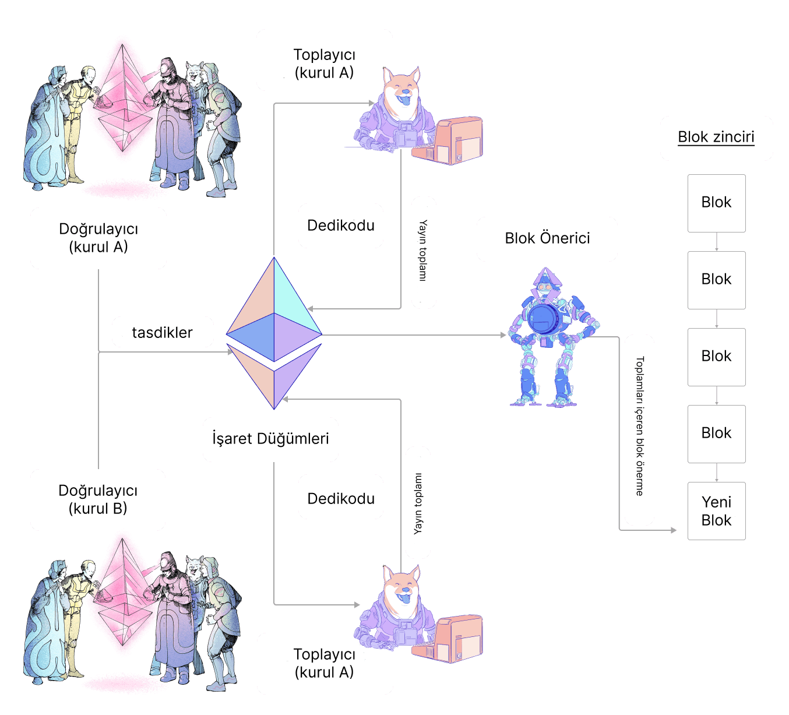

Bir doğrulayıcının her dönem (epoch) boyunca bir onay oluşturması, imzalaması ve yayınlaması beklenir. Bu sayfa, bu onayların neye benzediğini ve mutabakat istemcileri arasında nasıl işlendiğini ve iletildiğini özetlemektedir.

## Onay nedir? {#what-is-an-attestation}

Her [dönemde](/glossary/#epoch) (6,4 dakika) bir doğrulayıcı ağa bir onay teklif eder. Onay, dönemdeki belirli bir slot içindir. Onayın amacı, doğrulayıcının zincir görünümü lehine, özellikle de en son gerekçelendirilmiş blok ve mevcut dönemdeki ilk blok (`source` ve `target` kontrol noktaları olarak bilinir) lehine oy kullanmaktır. Bu bilgi, katılan tüm doğrulayıcılar için birleştirilerek ağın blokzincirin durumu hakkında mutabakata varmasını sağlar.

Onay aşağıdaki bileşenleri içerir:

- `aggregation_bits`: konumun komitelerindeki doğrulayıcı endeksiyle eşleştiği bir doğrulayıcı bit listesi; değer (0/1), doğrulayıcının `data` verisini imzalayıp imzalamadığını (yani aktif olup olmadıklarını ve blok teklifçisiyle aynı fikirde olup olmadıklarını) gösterir
- `data`: aşağıda tanımlandığı gibi onayla ilgili ayrıntılar
- `signature`: bireysel doğrulayıcıların imzalarını bir araya getiren bir BLS imzası

Onaylayan bir doğrulayıcı için ilk görev `data` verisini oluşturmaktır. `data` aşağıdaki bilgileri içerir:

- `slot`: Onayın atıfta bulunduğu slot numarası
- `index`: Belirli bir slotta doğrulayıcının hangi komiteye ait olduğunu tanımlayan bir numara
- `beacon_block_root`: Doğrulayıcının zincirin başında gördüğü bloğun kök hash'i (çatallanma seçimi algoritmasının uygulanmasının sonucu)
- `source`: Doğrulayıcıların en son gerekçelendirilmiş blok olarak ne gördüklerini gösteren kesinlik oyunun bir parçası
- `target`: Doğrulayıcıların mevcut dönemdeki ilk blok olarak ne gördüklerini gösteren kesinlik oyunun bir parçası

`data` oluşturulduktan sonra, doğrulayıcı katıldığını göstermek için `aggregation_bits` içindeki kendi doğrulayıcı endeksine karşılık gelen biti 0'dan 1'e çevirebilir.

Son olarak, doğrulayıcı onayı imzalar ve ağa yayınlar.

### Birleştirilmiş onay {#aggregated-attestation}

Bu verilerin her doğrulayıcı için ağ etrafında aktarılmasıyla ilişkili önemli bir ek yük vardır. Bu nedenle, bireysel doğrulayıcılardan gelen onaylar, daha geniş çapta yayınlanmadan önce alt ağlar içinde birleştirilir. Bu, yayınlanan bir onayın mutabakat `data` verisini ve bu `data` ile aynı fikirde olan tüm doğrulayıcıların imzalarının birleştirilmesiyle oluşturulan tek bir imzayı içermesi için imzaların bir araya getirilmesini içerir. Bu, `aggregation_bits` kullanılarak kontrol edilebilir çünkü bu, bireysel imzaları sorgulamak için kullanılabilecek komitelerindeki (kimliği `data` içinde sağlanan) her doğrulayıcının endeksini sağlar.

Her dönemde her alt ağdaki 16 doğrulayıcı `aggregators` olarak seçilir. Birleştiriciler, dedikodu ağı üzerinden duydukları ve kendilerininkiyle eşdeğer `data` verisine sahip tüm onayları toplarlar. Eşleşen her onayın göndericisi `aggregation_bits` içine kaydedilir. Birleştiriciler daha sonra onay toplamını daha geniş ağa yayınlar.

Bir doğrulayıcı blok teklifçisi olarak seçildiğinde, alt ağlardan gelen birleştirilmiş onayları yeni bloktaki en son slota kadar paketler.

### Onay dahil edilme yaşam döngüsü {#attestation-inclusion-lifecycle}

1. Üretim
2. Yayılım
3. Birleştirme
4. Yayılım
5. Dahil edilme

Onay yaşam döngüsü aşağıdaki şemada özetlenmiştir:

## Ödüller {#rewards}

Doğrulayıcılar onay sundukları için ödüllendirilirler. Onay ödülü, katılım bayraklarına (kaynak, hedef ve baş), temel ödüle ve katılım oranına bağlıdır.

Katılım bayraklarının her biri, sunulan onaya ve dahil edilme gecikmesine bağlı olarak doğru veya yanlış olabilir.

En iyi senaryo, üç bayrağın da doğru olduğu durumda gerçekleşir; bu durumda bir doğrulayıcı (doğru bayrak başına) şunları kazanır:

`reward += base reward * flag weight * flag attesting rate / 64`

Bayrak onaylama oranı, verilen bayrak için onaylayan tüm doğrulayıcıların etkin bakiyelerinin toplamının toplam aktif etkin bakiye ile karşılaştırılması kullanılarak ölçülür.

### Temel ödül {#base-reward}

Temel ödül, onaylayan doğrulayıcıların sayısına ve stake edilen etkin Ether bakiyelerine göre hesaplanır:

`base reward = validator effective balance x 2^6 / SQRT(Effective balance of all active validators)`

#### Dahil edilme gecikmesi {#inclusion-delay}

Doğrulayıcıların zincirin başı (`block n`) için oy kullandığı sırada, `block n+1` henüz teklif edilmemişti. Bu nedenle onaylar doğal olarak **bir blok sonra** dahil edilir, böylece zincir başının `block n` olduğuna oy veren tüm onaylar `block n+1` içine dahil edilir ve **dahil edilme gecikmesi** 1 olur. Dahil edilme gecikmesi iki slota çıkarsa, onay ödülü yarıya iner, çünkü onay ödülünü hesaplamak için temel ödül dahil edilme gecikmesinin tersi ile çarpılır.

### Onay senaryoları {#attestation-scenarios}

#### Eksik Oy Veren Doğrulayıcı {#missing-voting-validator}

Doğrulayıcıların onaylarını sunmak için en fazla 1 dönemleri vardır. Onay 0. dönemde kaçırıldıysa, 1. dönemde bir dahil edilme gecikmesiyle sunabilirler.

#### Eksik Birleştirici {#missing-aggregator}

Dönem başına toplam 16 Birleştirici vardır. Buna ek olarak, rastgele doğrulayıcılar **256 dönem boyunca iki alt ağa** abone olur ve birleştiricilerin eksik olması durumunda yedek olarak hizmet ederler.

#### Eksik blok teklifçisi {#missing-block-proposer}

Bazı durumlarda şanslı bir birleştiricinin aynı zamanda blok teklifçisi olabileceğini unutmayın. Blok teklifçisi kaybolduğu için onay dahil edilmediyse, bir sonraki blok teklifçisi birleştirilmiş onayı alır ve bir sonraki bloğa dahil eder. Ancak, **dahil edilme gecikmesi** bir artacaktır.

## Daha fazla bilgi {#further-reading}

- [Vitalik'in açıklamalı mutabakat spesifikasyonunda onaylar](https://github.com/ethereum/annotated-spec/blob/master/phase0/beacon-chain.md#attestationdata)
- [eth2book.info'da onaylar](https://eth2book.info/capella/part3/containers/dependencies/#attestationdata)

_Size yardımcı olan bir topluluk kaynağı mı biliyorsunuz? Bu sayfayı düzenleyin ve ekleyin!_