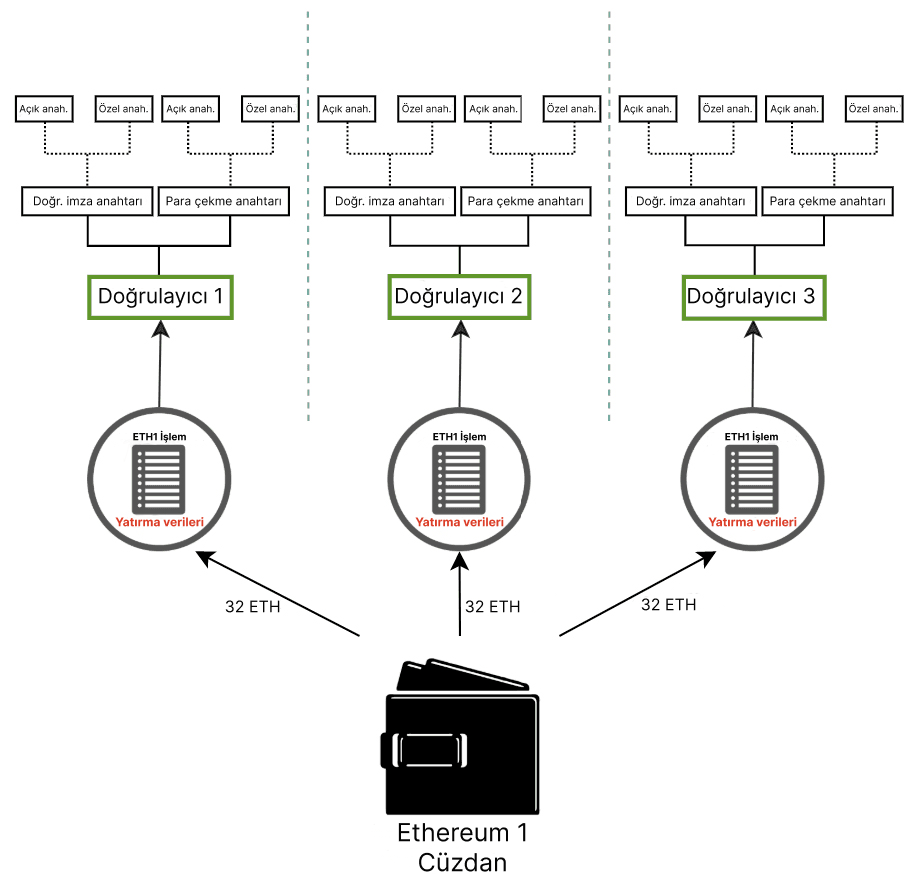
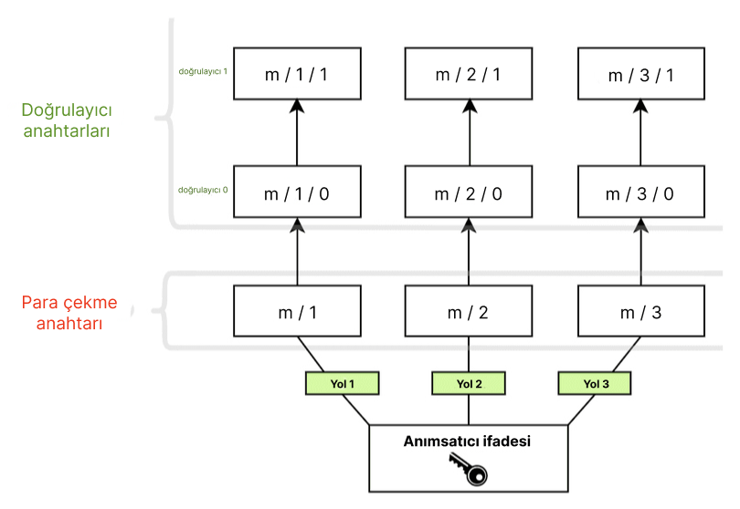

Ethereum, kullanıcı varlıklarını açık-özel anahtar kriptografisi kullanarak güvence altına alır. Açık anahtar, bir Ethereum adresi için temel olarak kullanılır; yani genel halk tarafından görülebilir ve benzersiz bir tanımlayıcı olarak kullanılır. Özel (veya 'gizli') anahtar yalnızca bir hesap sahibinin erişimine açık olmalıdır. Özel anahtar, işlemleri ve verileri 'imzalamak' için kullanılır, böylece kriptografi, sahibinin belirli bir özel anahtarın bazı eylemlerini onayladığını kanıtlayabilir.

Ethereum'un anahtarları [eliptik eğri kriptografisi](https://en.wikipedia.org/wiki/Elliptic-curve_cryptography) kullanılarak oluşturulur.

Ancak, Ethereum [İş Kanıtı (PoW)](/developers/docs/consensus-mechanisms/pow) sisteminden [Hisse Kanıtı (PoS)](/developers/docs/consensus-mechanisms/pos) sistemine geçtiğinde Ethereum'a yeni bir anahtar türü eklendi. Orijinal anahtarlar eskisi gibi çalışmaya devam etmektedir; hesapları güvence altına alan eliptik eğri tabanlı anahtarlarda hiçbir değişiklik yapılmamıştır. Ancak kullanıcıların, ETH stake ederek ve doğrulayıcıları çalıştırarak Hisse Kanıtı'na (PoS) katılmak için yeni bir anahtar türüne ihtiyacı vardı. Bu ihtiyaç, ağın mutabakata varması için gereken iletişim miktarını azaltmak amacıyla kolayca birleştirilebilen kriptografik bir yöntem gerektiren, çok sayıda doğrulayıcı arasında geçen birçok mesajla ilişkili ölçeklenebilirlik zorluklarından ortaya çıktı.

Bu yeni anahtar türü, [**Boneh-Lynn-Shacham (BLS)** imza şemasını](https://wikipedia.org/wiki/BLS_digital_signature) kullanır. BLS, imzaların çok verimli bir şekilde birleştirilmesini sağlar, ancak aynı zamanda birleştirilmiş bireysel doğrulayıcı anahtarlarının tersine mühendisliğine de olanak tanır ve doğrulayıcılar arasındaki eylemleri yönetmek için idealdir.

## İki tür doğrulayıcı anahtarı {#two-types-of-keys}

Hisse Kanıtı'na (PoS) geçişten önce, Ethereum kullanıcılarının fonlarına erişmek için yalnızca tek bir eliptik eğri tabanlı özel anahtarı vardı. Hisse Kanıtı'nın (PoS) tanıtılmasıyla birlikte, bireysel staker olmak isteyen kullanıcıların ayrıca bir **doğrulayıcı anahtarı** ve bir **çekim anahtarı** edinmesi gerekti.

### Doğrulayıcı anahtarı {#validator-key}

Doğrulayıcı imzalama anahtarı iki unsurdan oluşur:

- Doğrulayıcı **özel** anahtarı
- Doğrulayıcı **açık** anahtarı

Doğrulayıcı özel anahtarının amacı, blok teklifleri ve onaylar gibi zincir içi işlemleri imzalamaktır. Bu nedenle, bu anahtarlar bir sıcak cüzdanda tutulmalıdır.

Bu esneklik, doğrulayıcı imzalama anahtarlarını bir cihazdan diğerine çok hızlı bir şekilde taşıma avantajına sahiptir, ancak kaybolmaları veya çalınmaları durumunda bir hırsız birkaç yolla **kötü niyetli davranabilir**:

- Doğrulayıcının şu yollarla ceza kesintisine uğramasına neden olmak:
  - Bir teklif edici olup aynı slot için iki farklı işaret (beacon) bloğu imzalamak
  - Bir onaylayıcı olup başka bir onayı "çevreleyen" bir onay imzalamak
  - Bir onaylayıcı olup aynı hedefe sahip iki farklı onay imzalamak
- Doğrulayıcının staking yapmasını durduran ve ETH bakiyesine erişimi çekim anahtarı sahibine veren gönüllü bir çıkışa zorlamak

Bir kullanıcı staking depozitosu sözleşmesine ETH yatırdığında, **doğrulayıcı açık anahtarı** işlem verilerine dahil edilir. Bu, _depozito verisi_ olarak bilinir ve Ethereum'un doğrulayıcıyı tanımlamasını sağlar.

### Çekim kimlik bilgileri {#withdrawal-credentials}

Her doğrulayıcının _çekim kimlik bilgileri_ olarak bilinen bir özelliği vardır. Bu 32 baytlık alanın ilk baytı hesap türünü tanımlar: `0x00`, orijinal BLS (Şapella öncesi, çekilemeyen) kimlik bilgilerini temsil eder, `0x01`, bir yürütme adresini işaret eden eski kimlik bilgilerini temsil eder ve `0x02`, modern bileşik kimlik bilgisi türünü temsil eder.

`0x00` BLS anahtarlarına sahip doğrulayıcılar, fazla bakiye ödemelerini veya staking'den tam çekim işlemini etkinleştirmek için bu kimlik bilgilerini bir yürütme adresini işaret edecek şekilde güncellemelidir. Bu, ilk anahtar oluşturma sırasında depozito verilerinde bir yürütme adresi sağlanarak _VEYA_ daha sonraki bir zamanda bir `BLSToExecutionChange` mesajını imzalamak ve yayınlamak için çekim anahtarı kullanılarak yapılabilir.

[Doğrulayıcı çekim kimlik bilgileri hakkında daha fazlası](/developers/docs/consensus-mechanisms/pos/withdrawal-credentials/)

### Çekim anahtarı {#withdrawal-key}

İlk para yatırma işlemi sırasında ayarlanmamışsa, çekim kimlik bilgilerini bir yürütme adresini işaret edecek şekilde güncellemek için çekim anahtarı gerekecektir. Bu, fazla bakiye ödemelerinin işlenmeye başlamasını sağlayacak ve ayrıca kullanıcıların stake ettikleri ETH'yi tamamen çekmelerine olanak tanıyacaktır.

Tıpkı doğrulayıcı anahtarları gibi, çekim anahtarları da iki bileşenden oluşur:

- Çekim **özel** anahtarı
- Çekim **açık** anahtarı

Çekim kimlik bilgilerini `0x01` türüne güncellemeden önce bu anahtarı kaybetmek, doğrulayıcı bakiyesine erişimi kaybetmek anlamına gelir. Doğrulayıcı, bu eylemler doğrulayıcının özel anahtarını gerektirdiğinden onayları ve blokları imzalamaya devam edebilir, ancak çekim anahtarları kaybolursa bunun için çok az teşvik vardır veya hiç yoktur.

Doğrulayıcı anahtarlarını Ethereum hesap anahtarlarından ayırmak, tek bir kullanıcı tarafından birden fazla doğrulayıcının çalıştırılmasını sağlar.



**Not**: Staking görevlerinden çıkış yapmak ve bir doğrulayıcının bakiyesini çekmek şu anda doğrulayıcı anahtarıyla bir [gönüllü çıkış mesajı (VEM)](https://mirror.xyz/ladislaus.eth/wmoBbUBes2Wp1_6DvP6slPabkyujSU7MZOFOC3QpErs&1) imzalamayı gerektirir. Ancak [EIP-7002](https://eips.ethereum.org/EIPS/eip-7002), gelecekte bir kullanıcının çekim anahtarıyla çıkış mesajlarını imzalayarak bir doğrulayıcının çıkışını tetiklemesine ve bakiyesini çekmesine olanak tanıyacak bir tekliftir. Bu, ETH'lerini [hizmet olarak staking sağlayıcılarına](/staking/saas/#what-is-staking-as-a-service) yetki devreden staker'ların fonlarının kontrolünü ellerinde tutmalarını sağlayarak güven varsayımlarını azaltacaktır.

## Bir kurtarma ifadesinden anahtarlar türetmek {#deriving-keys-from-seed}

Stake edilen her 32 ETH, tamamen bağımsız 2 yeni anahtar seti gerektirseydi, anahtar yönetimi, özellikle birden fazla doğrulayıcı çalıştıran kullanıcılar için hızla hantal hale gelirdi. Bunun yerine, tek bir ortak sırdan birden fazla doğrulayıcı anahtarı türetilebilir ve bu tek sırrın saklanması, birden fazla doğrulayıcı anahtarına erişim sağlar.

[Anımsatıcılar (Mnemonics)](https://en.bitcoinwiki.org/wiki/Mnemonic_phrase) ve yollar, kullanıcıların cüzdanlarına [eriştiklerinde](https://ethereum.stackexchange.com/questions/19055/what-is-the-difference-between-m-44-60-0-0-and-m-44-60-0) sıklıkla karşılaştıkları belirgin özelliklerdir. Anımsatıcı, bir özel anahtar için başlangıç tohumu (seed) görevi gören bir kelime dizisidir. Ek verilerle birleştirildiğinde anımsatıcı, 'ana anahtar' (master key) olarak bilinen bir hash üretir. Bu, bir ağacın kökü olarak düşünülebilir. Bu kökten gelen dallar daha sonra hiyerarşik bir yol kullanılarak türetilebilir, böylece alt düğümler, üst düğümlerinin hash'i ve ağaçtaki endekslerinin kombinasyonları olarak var olabilir. Anımsatıcı tabanlı anahtar oluşturma için [BIP-32](https://github.com/bitcoin/bips/blob/master/bip-0032.mediawiki) ve [BIP-19](https://github.com/bitcoin/bips/blob/master/bip-0039.mediawiki) standartları hakkında bilgi edinin.

Bu yollar, donanım cüzdanlarıyla etkileşime girmiş kullanıcıların aşina olacağı aşağıdaki yapıya sahiptir:

```
m/44'/60'/0'/0`
```

Bu yoldaki eğik çizgiler, özel anahtarın bileşenlerini aşağıdaki gibi ayırır:

```
master_key / purpose / coin_type / account / change / address_index
```

Bu mantık, kullanıcıların tek bir **anımsatıcı ifadeye** mümkün olduğunca çok doğrulayıcı eklemesini sağlar çünkü ağaç kökü ortak olabilir ve farklılaşma dallarda gerçekleşebilir. Kullanıcı, anımsatıcı ifadeden **istediği sayıda anahtar türetebilir**.

```
[m / 0]
     /
    /
[m] - [m / 1]
    \
     \
      [m / 2]
```

Her dal bir `/` ile ayrılır, bu nedenle `m/2`, ana anahtarla başlayıp 2. dalı takip etmek anlamına gelir. Aşağıdaki şemada, her biri ilişkili iki doğrulayıcıya sahip üç çekim anahtarını saklamak için tek bir anımsatıcı ifade kullanılmıştır.



## Daha fazla bilgi {#further-reading}

- [Carl Beekhuizen tarafından yazılan Ethereum Vakfı blog yazısı](https://blog.ethereum.org/2020/05/21/keys)
- [EIP-2333 BLS12-381 anahtar oluşturma](https://eips.ethereum.org/EIPS/eip-2333)
- [EIP-7002: Yürütme Katmanı Tarafından Tetiklenen Çıkışlar](https://web.archive.org/web/20250125035123/https://research.2077.xyz/eip-7002-unpacking-improvements-to-staking-ux-post-merge)
- [Büyük ölçekte anahtar yönetimi](https://docs.ethstaker.cc/ethstaker-knowledge-base/scaled-node-operators/key-management-at-scale)