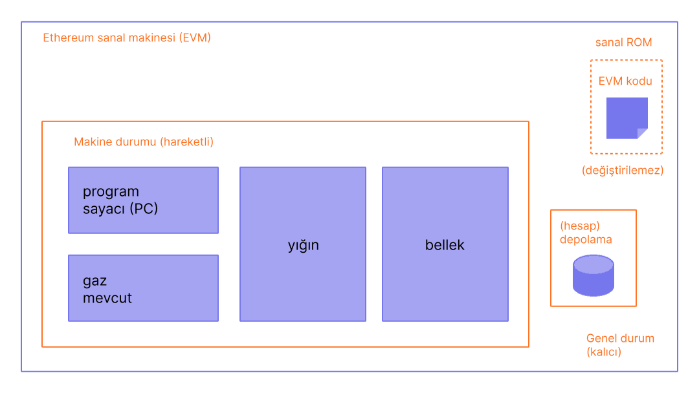
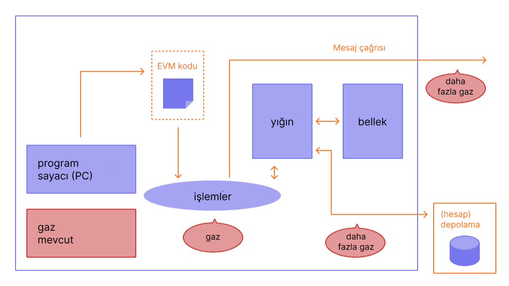

Ethereum Sanal Makinesi (EVM), tüm ethereum düğümlerinde kodu sürekli ve güvenli bir şekilde çalıştıran merkeziyetsiz bir sanal ortamdır. Düğümler, akıllı sözleşmeleri yürütmek için EVM'yi çalıştırır, [operasyonlar](/developers/docs/evm/opcodes/) için gereken hesaplama çabasını ölçmek için "[gaz](/developers/docs/gas/)" kullanır, böylece verimli kaynak tahsisi ve ağ güvenliği sağlanmış olur.

## Ön Koşullar {#prerequisites}

EVM'yi anlamak için [bayt](https://wikipedia.org/wiki/Byte), [bellek](https://wikipedia.org/wiki/Computer_memory) ve [yığın](https://wikipedia.org/wiki/Stack_\(abstract_data_type\)) gibi bilgisayar bilimindeki yaygın terminolojiye temel düzeyde aşina olmak gereklidir. [Karma işlevleri](https://wikipedia.org/wiki/Cryptographic_hash_function) ve [Merkle ağacı](https://wikipedia.org/wiki/Merkle_tree) gibi kriptografi/blokzincir kavramlarına aşina olmak da yararlı olacaktır.

## Ledger'dan durum makinesine {#from-ledger-to-state-machine}

“Dağıtılmış defter” analojisi, genellikle temel kriptografi araçlarını kullanarak merkeziyetsiz bir para birimini mümkün kılan Bitcoin gibi blok zincirlerini tanımlamak için kullanılır. Defter, bir kişinin defteri değiştirmek için neler yapıp yapamayacağını düzenleyen kurallara uyması gereken bir faaliyet kaydı tutar. Örneğin, bir Bitcoin adresi daha önce aldığından daha fazla Bitcoin harcayamaz. Bu kurallar, Bitcoin ve diğer birçok blok zincirindeki tüm işlemlerin temelini oluşturur.

Ethereum'un neredeyse tamamen aynı sezgisel kuralları takip eden kendi yerel kripto parası (ether) olsa da, çok daha güçlü bir işlevi de mümkün kılar: [akıllı sözleşmeler](/developers/docs/smart-contracts/). Bu daha karmaşık olan özellik için daha karmaşık bir analoji gerekir. Ethereum, dağıtık bir defter yerine dağıtık bir [durum makinesidir](https://wikipedia.org/wiki/Finite-state_machine). Ethereum'un durumu, yalnızca tüm hesapları ve bakiyeleri değil, aynı zamanda önceden tanımlanmış bir dizi kurala göre bloktan bloğa değişebilen ve isteğe bağlı makine kodunu çalıştırabilen bir _makine durumunu_ da tutan büyük bir veri yapısıdır. Durumu bloktan bloğa değiştirmenin özel kuralları EVM tarafından tanımlanır.


_Diyagram [Ethereum EVM illustrated](https://takenobu-hs.github.io/downloads/ethereum_evm_illustrated.pdf) kaynağından uyarlanmıştır_

## Ethereum durum geçiş fonksiyonu {#the-ethereum-state-transition-function}

EVM, matematiksel bir fonksiyon gibi davranır: Bir girdi verildiğinde, deterministik bir çıktı üretir. Bu nedenle Ethereum'u **durum geçiş fonksiyonuna** sahip olarak daha resmi bir şekilde tanımlamak oldukça yararlıdır:

```
Y(S, T)= S'
```

Eski bir geçerli durum `(S)` ve yeni bir geçerli işlem kümesi `(T)` verildiğinde, Ethereum durum geçiş fonksiyonu `Y(S, T)` yeni bir geçerli çıktı durumu olan `S'`'yi üretir.

### Durum {#state}

Ethereum bağlamında durum, tüm [hesapları](/developers/docs/accounts/) karmalarla bağlı tutan ve blokzincirde depolanan tek bir kök karmasına indirgenebilen, [değiştirilmiş Merkle Patricia Ağacı](/developers/docs/data-structures-and-encoding/patricia-merkle-trie/) adı verilen devasa bir veri yapısıdır.

### İşlemler {#transactions}

İşlemler, hesaplardan gelen kriptografik olarak imzalanmış talimatlardır. İki tür işlem vardır: mesaj çağrılarıyla sonuçlananlar ve sözleşme oluşturulmasıyla sonuçlananlar.

Sözleşme oluşturma, derlenmiş [akıllı sözleşme](/developers/docs/smart-contracts/anatomy/) bayt kodunu içeren yeni bir sözleşme hesabının oluşturulmasıyla sonuçlanır. Başka bir hesap o sözleşmeye mesaj çağrısı yaptığında, sözleşme kendi bayt kodunu yürütür.

## EVM talimatları {#evm-instructions}

EVM, 1024 öğe derinliğine sahip bir [yığın makinesi](https://wikipedia.org/wiki/Stack_machine) olarak çalışır. Her öğe, 256 bitlik kriptografi (Keccak-256 hash'leri veya secp256k1 imzaları gibi) ile kullanım kolaylığı sağlamak için seçilmiş 256 bitlik bir kelimedir.

Yürütme sırasında EVM, işlemler arasında kalıcı olmayan geçici bir _bellek_ (kelime adresli bir bayt dizisi olarak) tutar.

### Geçici depolama

Geçici depolama, `TSTORE` ve `TLOAD` işlem kodları aracılığıyla erişilen, işlem başına bir anahtar-değer deposudur. Aynı işlem sırasındaki tüm dahili çağrılar boyunca varlığını sürdürür ancak işlem sonunda temizlenir. Belleğin aksine, geçici depolama yürütme çerçevesinden ziyade EVM durumunun bir parçası olarak modellenir, ancak küresel duruma işlenmez. Geçici depolama, bir işlem sırasındaki dahili çağrılar arasında gaz açısından verimli geçici durum paylaşımını mümkün kılar.

### Depolama

Sözleşmeler, söz konusu hesapla ilişkili ve küresel durumun bir parçası olan bir Merkle Patricia _depolama_ ağacı (kelimeyle adreslenebilir bir kelime dizisi olarak) içerir. Bu kalıcı depolama, yalnızca tek bir işlem süresince kullanılabilen ve hesabın kalıcı depolama ağacının bir parçasını oluşturmayan geçici depolamadan farklıdır.

### İşlem kodları

Derlenmiş akıllı sözleşme bayt kodu, `XOR`, `AND`, `ADD`, `SUB` vb. gibi standart yığın işlemlerini gerçekleştiren bir dizi EVM [işlem kodu](/developers/docs/evm/opcodes) olarak yürütülür. EVM ayrıca `ADDRESS`, `BALANCE`, `BLOCKHASH` vb. gibi blokzincire özgü bir dizi yığın işlemi uygular. İşlem kodu seti ayrıca geçici depolamaya erişim sağlayan `TSTORE` ve `TLOAD`'u da içerir.


_Diyagramlar [Ethereum EVM illustrated](https://takenobu-hs.github.io/downloads/ethereum_evm_illustrated.pdf) kaynağından uyarlanmıştır_

## EVM uygulamaları {#evm-implementations}

EVM'nin tüm uygulamaları, Ethereum Sarı Kağıdında açıklanan şartnameye uymalıdır.

Ethereum'un on yıllık geçmişi boyunca EVM çeşitli revizyonlardan geçmiştir ve EVM'nin farklı programlama dillerinde yazılmış çeşitli uygulamaları bulunmaktadır.

[Ethereum yürütüm istemcileri](/developers/docs/nodes-and-clients/#execution-clients) bir EVM uygulaması içerir. Ek olarak, çok sayıda bütünsel uygulama da vardır:

- [Py-EVM](https://github.com/ethereum/py-evm) - _Python_
- [evmone](https://github.com/ethereum/evmone) - _C++_
- [ethereumjs-vm](https://github.com/ethereumjs/ethereumjs-vm) - _JavaScript_
- [revm](https://github.com/bluealloy/revm) - _Rust_

## Ek Okumalar {#further-reading}

- [Ethereum Sarı Raporu](https://ethereum.github.io/yellowpaper/paper.pdf)
- [Jellopaper ya da diğer adıyla KEVM: K'de EVM Semantiği](https://jellopaper.org/)
- [Bej Rapor](https://github.com/chronaeon/beigepaper)
- [Ethereum Sanal Makinesi İşlem Kodları](https://www.ethervm.io/)
- [Ethereum Sanal Makinesi İşlem Kodları Etkileşimli Referansı](https://www.evm.codes/)
- [Solidity'nin dokümantasyonundaki kısa bir giriş](https://docs.soliditylang.org/en/latest/introduction-to-smart-contracts.html#index-6)
- [Mastering Ethereum - Ethereum Sanal Makinesi](https://github.com/ethereumbook/ethereumbook/blob/openedition/13evm.asciidoc)

## İlgili Konular {#related-topics}

- [Gaz](/developers/docs/gas/)
