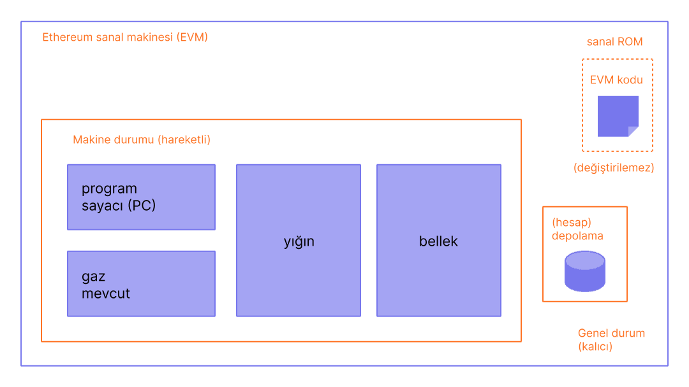

Ethereum Sanal Makinesi (EVM), tüm [Ethereum](/) düğümlerinde kodu tutarlı ve güvenli bir şekilde yürüten merkeziyetsiz bir sanal ortamdır. Düğümler, akıllı sözleşmeleri yürütmek için EVM'yi çalıştırır ve [operasyonlar](/developers/docs/evm/opcodes/) için gereken hesaplama çabasını ölçmek amacıyla "[Gaz](/developers/docs/gas/)" kullanarak verimli kaynak tahsisi ve ağ güvenliği sağlar.

## Ön Koşullar {#prerequisites}

EVM'yi anlamak için [baytlar](https://wikipedia.org/wiki/Byte), [bellek](https://wikipedia.org/wiki/Computer_memory) ve [yığın (stack)](<https://wikipedia.org/wiki/Stack_(abstract_data_type)>) gibi bilgisayar bilimlerindeki yaygın terminolojiye temel düzeyde aşina olmak gereklidir. Ayrıca [hash fonksiyonları](https://wikipedia.org/wiki/Cryptographic_hash_function) ve [Merkle ağacı](https://wikipedia.org/wiki/Merkle_tree) gibi kriptografi/blokzincir kavramlarına hakim olmak da faydalı olacaktır.

## Defterden durum makinesine {#from-ledger-to-state-machine}

'Dağıtık defter' analojisi, genellikle kriptografinin temel araçlarını kullanarak merkeziyetsiz bir para birimi sağlayan Bitcoin gibi blokzincirleri tanımlamak için kullanılır. Defter, birinin defteri değiştirmek için ne yapıp ne yapamayacağını yöneten bir dizi kurala uyması gereken bir aktivite kaydı tutar. Örneğin, bir Bitcoin adresi daha önce aldığından daha fazla Bitcoin harcayamaz. Bu kurallar, Bitcoin ve diğer birçok blokzincirdeki tüm işlemlerin temelini oluşturur.

Ethereum, neredeyse tamamen aynı sezgisel kuralları izleyen kendi yerel kripto parasına (Ether) sahip olsa da, çok daha güçlü bir işlevi de mümkün kılar: [akıllı sözleşmeler](/developers/docs/smart-contracts/). Bu daha karmaşık özellik için daha gelişmiş bir analoji gereklidir. Ethereum, dağıtık bir defter yerine dağıtık bir [durum makinesidir](https://wikipedia.org/wiki/Finite-state_machine). Ethereum'un durumu, yalnızca tüm hesapları ve bakiyeleri değil, aynı zamanda önceden tanımlanmış bir dizi kurala göre bloktan bloğa değişebilen ve rastgele makine kodunu yürütebilen bir _makine durumunu_ da tutan büyük bir veri yapısıdır. Durumun bloktan bloğa değiştirilmesine ilişkin belirli kurallar EVM tarafından tanımlanır.


_Diyagram [Ethereum EVM illustrated](https://takenobu-hs.github.io/downloads/ethereum_evm_illustrated.pdf) kaynağından uyarlanmıştır_

## Ethereum durum geçiş fonksiyonu {#the-ethereum-state-transition-function}

EVM tıpkı matematiksel bir fonksiyon gibi davranır: Bir girdi verildiğinde deterministik bir çıktı üretir. Bu nedenle, Ethereum'u bir **durum geçiş fonksiyonuna** sahip olarak daha resmi bir şekilde tanımlamak oldukça faydalıdır:

```
Y(S, T)= S'
```

Eski bir geçerli durum `(S)` ve yeni bir geçerli işlemler kümesi `(T)` verildiğinde, Ethereum durum geçiş fonksiyonu `Y(S, T)`, yeni bir geçerli çıktı durumu `S'` üretir.

### Durum {#state}

Ethereum bağlamında durum, tüm [hesapları](/developers/docs/accounts/) hash'ler ile birbirine bağlı tutan ve blokzincirde depolanan tek bir kök hash'e indirgenebilen, [değiştirilmiş Merkle Patricia Ağacı](/developers/docs/data-structures-and-encoding/patricia-merkle-trie/) adı verilen devasa bir veri yapısıdır.

### İşlemler {#transactions}

İşlemler, hesaplardan gelen kriptografik olarak imzalanmış talimatlardır. İki tür işlem vardır: mesaj çağrılarıyla sonuçlananlar ve sözleşme oluşturmayla sonuçlananlar.

Sözleşme oluşturma, derlenmiş [akıllı sözleşme](/developers/docs/smart-contracts/anatomy/) baytkodunu içeren yeni bir kontrat hesabının oluşturulmasıyla sonuçlanır. Başka bir hesap bu sözleşmeye ne zaman bir mesaj çağrısı yaparsa, sözleşme kendi baytkodunu yürütür.

## EVM talimatları {#evm-instructions}

EVM, 1024 öğe derinliğine sahip bir [yığın makinesi (stack machine)](https://wikipedia.org/wiki/Stack_machine) olarak çalışır. Her öğe, 256 bitlik kriptografi (Keccak-256 hash'leri veya secp256k1 imzaları gibi) ile kullanım kolaylığı için seçilmiş olan 256 bitlik bir kelimedir (word).

Yürütme sırasında EVM, işlemler arasında kalıcı olmayan geçici bir _bellek_ (kelime adresli bir bayt dizisi olarak) tutar.

### Geçici depolama {#transient-storage}

Geçici depolama, `TSTORE` ve `TLOAD` işlem kodları aracılığıyla erişilen, işlem başına bir anahtar-değer deposudur. Aynı işlem sırasındaki tüm dahili çağrılar boyunca kalıcıdır ancak işlemin sonunda temizlenir. Belleğin aksine, geçici depolama yürütme çerçevesi yerine EVM durumunun bir parçası olarak modellenir, ancak küresel duruma işlenmez. Geçici depolama, bir işlem sırasındaki dahili çağrılar arasında Gaz açısından verimli geçici durum paylaşımına olanak tanır.

### Depolama {#storage}

Sözleşmeler, söz konusu hesapla ilişkili ve küresel durumun bir parçası olan bir Merkle Patricia _depolama_ trie'si (kelime adreslenebilir bir kelime dizisi olarak) içerir. Bu kalıcı depolama, yalnızca tek bir işlemin süresi boyunca kullanılabilen ve hesabın kalıcı depolama trie'sinin bir parçasını oluşturmayan geçici depolamadan farklıdır.

### İşlem kodları {#opcodes}

Derlenmiş akıllı sözleşme baytkodu, `XOR`, `AND`, `ADD`, `SUB` vb. gibi standart yığın operasyonlarını gerçekleştiren bir dizi EVM [işlem kodu](/developers/docs/evm/opcodes) olarak yürütülür. EVM ayrıca `ADDRESS`, `BALANCE`, `BLOCKHASH` vb. gibi blokzincire özgü bir dizi yığın operasyonunu da uygular. İşlem kodu seti ayrıca geçici depolamaya erişim sağlayan `TSTORE` ve `TLOAD` kodlarını da içerir.


_Diyagramlar [Ethereum EVM illustrated](https://takenobu-hs.github.io/downloads/ethereum_evm_illustrated.pdf) kaynağından uyarlanmıştır_

## EVM uygulamaları {#evm-implementations}

EVM'nin tüm uygulamaları, Ethereum Sarı Bülteni'nde açıklanan spesifikasyona uymak zorundadır.

Ethereum'un on yıllık tarihi boyunca EVM çeşitli revizyonlardan geçmiştir ve çeşitli programlama dillerinde EVM'nin birkaç uygulaması bulunmaktadır.

[Ethereum yürütme istemcileri](/developers/docs/nodes-and-clients/#execution-clients) bir EVM uygulaması içerir. Ayrıca, aşağıdakiler de dahil olmak üzere birden fazla bağımsız uygulama vardır:

- [Py-EVM](https://github.com/ethereum/py-evm) - _Python_
- [evmone](https://github.com/ethereum/evmone) - _C++_
- [ethereumjs-vm](https://github.com/ethereumjs/ethereumjs-vm) - _JavaScript_
- [revm](https://github.com/bluealloy/revm) - _Rust_

## Daha Fazla Okuma {#further-reading}

- [Ethereum Sarı Bülteni](https://ethereum.github.io/yellowpaper/paper.pdf)
- [Jellopaper namıdiğer KEVM: K'de EVM'nin Semantiği](https://jellopaper.org/)
- [Bej Bülten (The Beigepaper)](https://github.com/chronaeon/beigepaper)
- [Ethereum Sanal Makinesi İşlem Kodları](https://www.ethervm.io/)
- [Ethereum Sanal Makinesi İşlem Kodları İnteraktif Referansı](https://www.evm.codes/)
- [Solidity belgelerinde kısa bir giriş](https://docs.soliditylang.org/en/latest/introduction-to-smart-contracts.html#index-6)
- [Mastering Ethereum - Ethereum Sanal Makinesi](https://github.com/ethereumbook/ethereumbook/blob/openedition/13evm.asciidoc)

## İlgili Konular {#related-topics}

- [Gaz](/developers/docs/gas/)

## Eğitimler: Ethereum Sanal Makinesi (EVM) / Ethereum'daki İşlem Kodları {#tutorials}

- [Sarı Bülten'in EVM Spesifikasyonlarını Anlamak](/developers/tutorials/yellow-paper-evm/) _– Ethereum Sarı Bülteni'ndeki resmi EVM spesifikasyonunun rehberli bir incelemesi._
- [Bir Sözleşmeye Tersine Mühendislik Uygulamak](/developers/tutorials/reverse-engineering-a-contract/) _– EVM işlem kodlarını kullanarak derlenmiş bir akıllı sözleşmeye nasıl tersine mühendislik yapılacağı._