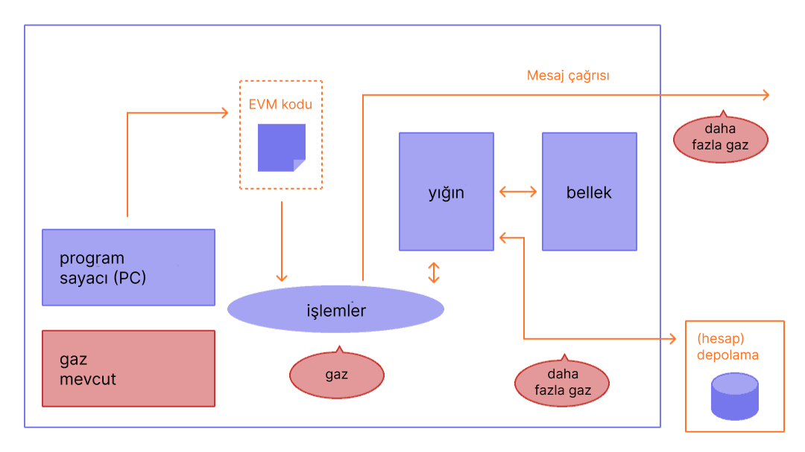

Gaz, [Ethereum](/) ağı için çok önemlidir. Bir arabanın çalışması için benzine ihtiyaç duyması gibi, onun da çalışmasını sağlayan yakıttır.

## Ön koşullar {#prerequisites}

Bu sayfayı daha iyi anlamak için öncelikle [işlemler](/developers/docs/transactions/) ve [EVM](/developers/docs/evm/) hakkında okuma yapmanızı öneririz.

## Gaz nedir? {#what-is-gas}

Gaz, Ethereum ağında belirli operasyonları yürütmek için gereken hesaplama çabası miktarını ölçen birimi ifade eder.

Her Ethereum işlemi yürütülmek için hesaplama kaynakları gerektirdiğinden, Ethereum'un spamlara karşı savunmasız olmamasını ve sonsuz hesaplama döngülerinde sıkışıp kalmamasını sağlamak için bu kaynakların ödenmesi gerekir. Hesaplama için ödeme, bir gaz ücreti şeklinde yapılır.

Gaz ücreti, **bir işlemi yapmak için kullanılan gaz miktarının birim gaz başına maliyetle çarpımıdır**. Ücret, bir işlemin başarılı veya başarısız olmasından bağımsız olarak ödenir.

_Diyagram [Ethereum EVM illustrated](https://takenobu-hs.github.io/downloads/ethereum_evm_illustrated.pdf) kaynağından uyarlanmıştır_

Gaz ücretleri, Ethereum'un yerel para birimi olan Ether (ETH) cinsinden ödenmelidir. Gas fiyatları genellikle ETH'nin bir alt birimi olan Gwei cinsinden belirtilir. Her bir Gwei, bir ETH'nin milyarda birine (0,000000001 ETH veya 10-9 ETH) eşittir.

Örneğin, gazınızın 0,000000001 Ether tuttuğunu söylemek yerine, gazınızın 1 Gwei tuttuğunu söyleyebilirsiniz.

'Gwei' kelimesi, 'milyar Wei' anlamına gelen 'giga-wei' kelimesinin kısaltmasıdır. Bir Gwei, bir milyar Wei'ye eşittir. Wei'nin kendisi ([b-money](https://www.investopedia.com/terms/b/bmoney.asp) yaratıcısı [Wei Dai](https://wikipedia.org/wiki/Wei_Dai)'nin adını almıştır) ETH'nin en küçük birimidir.

## Gaz ücretleri nasıl hesaplanır? {#how-are-gas-fees-calculated}

Bir işlem gönderdiğinizde ödemeye razı olduğunuz gaz miktarını belirleyebilirsiniz. Belirli bir miktar gaz teklif ederek, işleminizin bir sonraki bloka dahil edilmesi için teklif vermiş olursunuz. Çok az teklif ederseniz, doğrulayıcıların işleminizi dahil etmek için seçme olasılığı daha düşüktür, bu da işleminizin geç yürütülebileceği veya hiç yürütülmeyebileceği anlamına gelir. Çok fazla teklif ederseniz, bir miktar ETH israf edebilirsiniz. Peki, ne kadar ödeyeceğinizi nasıl bilebilirsiniz?

Ödediğiniz toplam gaz iki bileşene ayrılır: `base fee` (taban ücret) ve `priority fee` (öncelik ücreti).

`base fee` protokol tarafından belirlenir; işleminizin geçerli sayılması için en az bu tutarı ödemeniz gerekir. `priority fee`, işleminizi doğrulayıcılar için cazip hale getirmek ve böylece bir sonraki bloka dahil edilmek üzere seçmelerini sağlamak için taban ücrete eklediğiniz bir öncelik ücretidir.

Yalnızca `base fee` ödeyen bir işlem teknik olarak geçerlidir ancak doğrulayıcılara onu başka bir işleme tercih etmeleri için hiçbir teşvik sunmadığından dahil edilme olasılığı düşüktür. 'Doğru' `priority` ücreti, işleminizi gönderdiğiniz andaki ağ kullanımına göre belirlenir; çok fazla talep varsa `priority` ücretinizi daha yüksek ayarlamanız gerekebilir, ancak daha az talep olduğunda daha az ödeyebilirsiniz.

Örneğin, Jordan'ın Taylor'a 1 ETH ödemesi gerektiğini varsayalım. Bir ETH transferi 21.000 birim gaz gerektirir ve taban ücret 10 Gwei'dir. Jordan 2 Gwei'lik bir öncelik ücreti ekler.

Toplam ücret artık şuna eşit olacaktır:

`units of gas used * (base fee + priority fee)`

burada `base fee` protokol tarafından belirlenen bir değerdir ve `priority fee` kullanıcı tarafından doğrulayıcıya bir öncelik ücreti olarak belirlenen bir değerdir.

örn., `21,000 * (10 + 2) = 252,000 gwei` (0,000252 ETH).

Jordan parayı gönderdiğinde, Jordan'ın hesabından 1,000252 ETH düşülecektir. Taylor'ın hesabına 1,0000 ETH yatırılacaktır. Doğrulayıcı 0,000042 ETH'lik öncelik ücretini alır. 0,00021 ETH'lik `base fee` yakılır.

### Taban ücret {#base-fee}

Her blok, bir rezerv fiyatı görevi gören bir taban ücrete sahiptir. Bir bloka dahil edilmeye uygun olmak için, gaz başına teklif edilen fiyatın en az taban ücrete eşit olması gerekir. Taban ücret, mevcut bloktan bağımsız olarak hesaplanır ve bunun yerine ondan önceki bloklar tarafından belirlenir, bu da işlem ücretlerini kullanıcılar için daha öngörülebilir hale getirir. Blok oluşturulduğunda bu **taban ücret "yakılır"** ve dolaşımdan kaldırılır.

Taban ücret, önceki blokun boyutunu (tüm işlemler için kullanılan gaz miktarı) hedef boyutla (gaz limitinin yarısı) karşılaştıran bir formülle hesaplanır. Hedef blok boyutu hedefin sırasıyla üzerinde veya altındaysa, taban ücret blok başına maksimum %12,5 oranında artacak veya azalacaktır. Bu üstel büyüme, blok boyutunun süresiz olarak yüksek kalmasını ekonomik olarak uygulanamaz hale getirir.

| Blok Numarası | Dahil Edilen Gaz | Ücret Artışı | Mevcut Taban Ücret |
| ------------ | -----------: | -----------: | ---------------: |
| 1            |          18M |           0% |         100 Gwei |
| 2            |          36M |           0% |         100 Gwei |
| 3            |          36M |        12.5% |       112.5 Gwei |
| 4            |          36M |        12.5% |       126.6 Gwei |
| 5            |          36M |        12.5% |       142.4 Gwei |
| 6            |          36M |        12.5% |       160.2 Gwei |
| 7            |          36M |        12.5% |       180.2 Gwei |
| 8            |          36M |        12.5% |       202.7 Gwei |

Yukarıdaki tabloda, gaz limiti olarak 36 milyon kullanılarak bir örnek gösterilmiştir. Bu örneği takiben, 9 numaralı blokta bir işlem oluşturmak için bir cüzdan, kullanıcıya bir sonraki bloka eklenecek **maksimum taban ücretin** `current base fee * 112.5%` veya `202.7 gwei * 112.5% = 228.1 gwei` olduğunu kesin olarak bildirecektir.

Ayrıca, dolu bir bloktan önce taban ücretin artış hızı nedeniyle dolu blokların uzun süreli artışlarını görmemizin pek olası olmadığını belirtmek de önemlidir.

| Blok Numarası | Dahil Edilen Gaz | Ücret Artışı | Mevcut Taban Ücret |
| ------------ | -----------: | -----------: | ---------------: |
| 30           |          36M |        12.5% |      2705.6 Gwei |
| ...          |          ... |        12.5% |              ... |
| 50           |          36M |        12.5% |     28531.3 Gwei |
| ...          |          ... |        12.5% |              ... |
| 100          |          36M |        12.5% |  10302608.6 Gwei |

### Öncelik ücreti {#priority-fee}

Öncelik ücreti, doğrulayıcıları yalnızca blok gaz limiti ile sınırlı olmak üzere bir bloktaki işlem sayısını en üst düzeye çıkarmaya teşvik eder. Öncelik ücretleri olmadan, rasyonel bir doğrulayıcı, staking ödülleri bir blokta kaç işlem olduğundan bağımsız olduğu için, herhangi bir doğrudan yürütme katmanı veya mutabakat katmanı cezası olmaksızın daha az (veya hatta sıfır) işlem dahil edebilir. Ek olarak, öncelik ücretleri, kullanıcıların aynı blok içinde öncelik için diğerlerinden daha yüksek teklif vermesine olanak tanıyarak aciliyeti etkili bir şekilde belirtir. 

### Maksimum ücret {#maxfee}

Ağda bir işlemi yürütmek için kullanıcılar, işlemlerinin yürütülmesi için ödemeye razı oldukları maksimum bir sınır belirleyebilirler. Bu isteğe bağlı parametre `maxFeePerGas` olarak bilinir. Bir işlemin yürütülmesi için maksimum ücretin, taban ücret ile öncelik ücretinin toplamını aşması gerekir. İşlemi gönderene, maksimum ücret ile taban ücret ve öncelik ücreti toplamı arasındaki fark iade edilir.

### Blok boyutu {#block-size}

Her blok, mevcut gaz limitinin yarısı kadar bir hedef boyuta sahiptir, ancak blokların boyutu, blok sınırına (hedef blok boyutunun 2 katı) ulaşılana kadar ağ talebine uygun olarak artacak veya azalacaktır. Protokol, _tâtonnement_ (deneme yanılma) süreci aracılığıyla hedefte bir denge ortalama blok boyutuna ulaşır. Bu, blok boyutu hedef blok boyutundan büyükse, protokolün bir sonraki blok için taban ücreti artıracağı anlamına gelir. Benzer şekilde, blok boyutu hedef blok boyutundan küçükse protokol taban ücreti düşürecektir.

Taban ücretin ayarlanma miktarı, mevcut blok boyutunun hedeften ne kadar uzak olduğuyla orantılıdır. Bu, boş bir blok için -%12,5'ten, hedef boyutta %0'a ve gaz limitine ulaşan bir blok için +%12,5'e kadar doğrusal bir hesaplamadır. Gaz limiti, doğrulayıcı sinyallerine ve ayrıca ağ yükseltmelerine bağlı olarak zaman içinde dalgalanabilir. [Gaz limitindeki değişiklikleri zaman içinde buradan görüntüleyebilirsiniz](https://eth.blockscout.com/stats/averageGasLimit?interval=threeMonths).

[Bloklar hakkında daha fazlası](/developers/docs/blocks/)

### Uygulamada gaz ücretlerini hesaplama {#calculating-fees-in-practice}

İşleminizin yürütülmesi için ne kadar ödemeye razı olduğunuzu açıkça belirtebilirsiniz. Ancak çoğu cüzdan sağlayıcısı, kullanıcılarına yüklenen karmaşıklık miktarını azaltmak için otomatik olarak önerilen bir işlem ücreti (taban ücret + önerilen öncelik ücreti) belirleyecektir.

## Gaz ücretleri neden var? {#why-do-gas-fees-exist}

Kısacası, gaz ücretleri Ethereum ağını güvende tutmaya yardımcı olur. Ağda yürütülen her hesaplama için bir ücret talep ederek, kötü niyetli kişilerin ağa spam göndermesini engelliyoruz. Kodda kazara veya düşmanca sonsuz döngülerden veya diğer hesaplama israflarından kaçınmak için, her işlemin kullanabileceği kod yürütme hesaplama adımlarının sayısına bir sınır koyması gerekir. Temel hesaplama birimi "gaz"dır.

Bir işlem bir limit içerse de, bir işlemde kullanılmayan herhangi bir gaz kullanıcıya iade edilir (örn., `max fee - (base fee + tip)` iade edilir).

_Diyagram [Ethereum EVM illustrated](https://takenobu-hs.github.io/downloads/ethereum_evm_illustrated.pdf) kaynağından uyarlanmıştır_

## Gaz limiti nedir? {#what-is-gas-limit}

Gaz limiti, bir işlemde tüketmeye razı olduğunuz maksimum gaz miktarını ifade eder. [Akıllı sözleşmeler](/developers/docs/smart-contracts/) içeren daha karmaşık işlemler daha fazla hesaplama işi gerektirir, bu nedenle basit bir ödemeden daha yüksek bir gaz limiti gerektirirler. Standart bir ETH transferi 21.000 birim gaz limiti gerektirir.

Örneğin, basit bir ETH transferi için 50.000'lik bir gaz limiti koyarsanız, EVM 21.000'ini tüketir ve kalan 29.000'i geri alırsınız. Ancak, çok az gaz belirtirseniz, örneğin basit bir ETH transferi için 20.000'lik bir gaz limiti, işlem doğrulama aşamasında başarısız olacaktır. Bir bloka dahil edilmeden önce reddedilecek ve hiçbir gaz tüketilmeyecektir. Öte yandan, bir işlemin yürütülmesi sırasında gazı biterse (örn., bir akıllı sözleşme gazın tamamını yarı yolda tüketirse), EVM tüm değişiklikleri geri alacaktır, ancak sağlanan tüm gaz yine de gerçekleştirilen iş için tüketilmiş olacaktır.

## Gaz ücretleri neden bu kadar yükselebilir? {#why-can-gas-fees-get-so-high}

Yüksek gaz ücretleri Ethereum'un popülaritesinden kaynaklanmaktadır. Çok fazla talep varsa, kullanıcılar diğer kullanıcıların işlemlerinden daha yüksek teklif vermek için daha yüksek öncelik ücreti miktarları sunmalıdır. Daha yüksek bir öncelik ücreti, işleminizin bir sonraki bloka girme olasılığını artırabilir. Ayrıca, daha karmaşık akıllı sözleşme uygulamaları işlevlerini desteklemek için birçok operasyon yapıyor olabilir ve bu da onların çok fazla gaz tüketmesine neden olur.

## Gaz maliyetlerini düşürme girişimleri {#initiatives-to-reduce-gas-costs}

Ethereum [ölçeklenebilirlik yükseltmeleri](/roadmap/) nihayetinde gaz ücreti sorunlarının bazılarını ele almalıdır, bu da platformun saniyede binlerce işlemi işlemesini ve küresel olarak ölçeklenmesini sağlayacaktır.

Katman 2 (L2) ölçeklendirmesi, gaz maliyetlerini, kullanıcı deneyimini ve ölçeklenebilirliği büyük ölçüde iyileştirmeye yönelik birincil girişimdir.

[Katman 2 (L2) ölçeklendirmesi hakkında daha fazlası](/developers/docs/scaling/#layer-2-scaling)

## Gaz ücretlerini izleme {#monitoring-gas-fees}

ETH'nizi daha ucuza gönderebilmek için gas fiyatlarını izlemek istiyorsanız, aşağıdakiler gibi birçok farklı aracı kullanabilirsiniz:

- [Etherscan](https://etherscan.io/gastracker) _İşlem gas fiyatı tahmincisi_
- [Blockscout](https://eth.blockscout.com/gas-tracker) _Açık kaynaklı işlem gas fiyatı tahmincisi_
- [ETH Gas Tracker](https://www.ethgastracker.com/) _İşlem ücretlerini azaltmak ve tasarruf etmek için Ethereum ve L2 gas fiyatlarını izleyin ve takip edin_
- [Blocknative ETH Gas Estimator](https://chrome.google.com/webstore/detail/blocknative-eth-gas-estim/ablbagjepecncofimgjmdpnhnfjiecfm) _Hem Tip 0 eski işlemleri hem de Tip 2 EIP-1559 işlemlerini destekleyen gas tahmin eden Chrome uzantısı._
- [Cryptoneur Gas Fees Calculator](https://www.cryptoneur.xyz/gas-fees-calculator) _Ana Ağ, Arbitrum ve Polygon üzerindeki farklı işlem türleri için gaz ücretlerini yerel para biriminizde hesaplayın._

## İlgili araçlar {#related-tools}

- [Blocknative's Gas Platform](https://www.blocknative.com/gas) _Blocknative'in küresel bellek havuzu veri platformu tarafından desteklenen gas tahmini API'si_
- [Gas Network](https://gas.network) Zincir içi Gas Kâhinleri. 35'ten fazla zincir için destek. 

## Daha fazla okuma {#further-reading}

- [Ethereum Gazı Açıklandı](https://defiprime.com/gas)
- [Akıllı Sözleşmelerinizin gaz tüketimini azaltma](https://medium.com/coinmonks/8-ways-of-reducing-the-gas-consumption-of-your-smart-contracts-9a506b339c0a)
- [Geliştiriciler için Gaz Optimizasyonu Stratejileri](https://www.alchemy.com/overviews/solidity-gas-optimization)
- [EIP-1559 belgeleri](https://eips.ethereum.org/EIPS/eip-1559).
- [Tim Beiko'nun EIP-1559 Kaynakları](https://hackmd.io/@timbeiko/1559-resources)
- [EIP-1559: Mekanizmaları Memlerden Ayırmak](https://web.archive.org/web/20241126205908/https://research.2077.xyz/eip-1559-separating-mechanisms-from-memes)