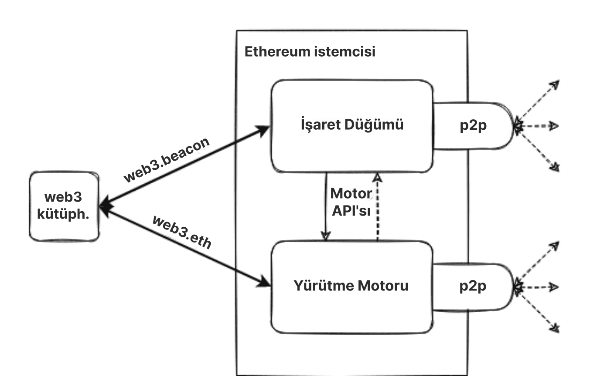
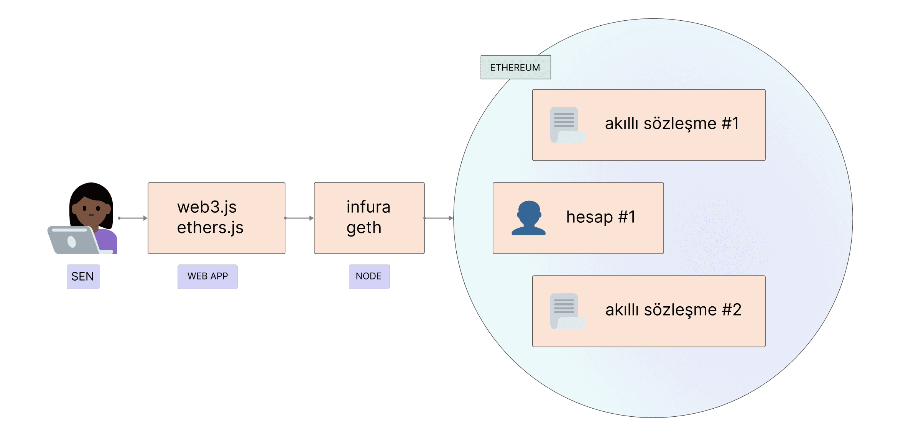

[Ethereum](/), blokları ve işlem verilerini doğrulayabilen yazılımları çalıştıran bilgisayarlardan (düğümler olarak bilinir) oluşan dağıtık bir ağdır. Bilgisayarınızı bir Ethereum düğümüne dönüştürmek için yazılımın bilgisayarınızda çalıştırılması gerekir. Bir düğüm oluşturmak için ('istemciler' olarak bilinen) iki ayrı yazılım parçası gereklidir.

## Ön koşullar {#prerequisites}

Daha derine inmeden ve kendi Ethereum istemcinizi çalıştırmadan önce eşler arası ağ kavramını ve [EVM'nin temellerini](/developers/docs/evm/) anlamalısınız. [Ethereum'a giriş](/developers/docs/intro-to-ethereum/) bölümümüze göz atın.

Düğümler konusuna yeniyseniz, öncelikle [bir Ethereum düğümü çalıştırma](/run-a-node) hakkındaki kullanıcı dostu giriş bölümümüze göz atmanızı öneririz.

## Düğümler ve istemciler nelerdir? {#what-are-nodes-and-clients}

Bir "düğüm", Ethereum yazılımı çalıştıran diğer bilgisayarlara bağlı olan ve bir ağ oluşturan herhangi bir Ethereum istemci yazılımı örneğidir. Bir istemci, verileri protokol kurallarına göre doğrulayan ve ağı güvenli tutan bir Ethereum uygulamasıdır. Bir düğüm iki istemci çalıştırmalıdır: bir fikir birliği istemcisi ve bir yürütme istemcisi.

- Yürütme istemcisi (Yürütme Motoru, EL istemcisi veya eski adıyla Eth1 istemcisi olarak da bilinir) ağda yayınlanan yeni işlemleri dinler, bunları EVM'de yürütür ve tüm mevcut Ethereum verilerinin en son durumunu ve veritabanını tutar.
- Fikir birliği istemcisi (İşaret Düğümü, CL istemcisi veya eski adıyla Eth2 istemcisi olarak da bilinir), ağın yürütme istemcisinden gelen doğrulanmış verilere dayanarak anlaşmaya varmasını sağlayan Hisse Kanıtı (PoS) mutabakat algoritmasını uygular. Ayrıca, fikir birliği istemcisine eklenebilen ve bir düğümün ağın güvenliğini sağlamaya katılmasına olanak tanıyan 'doğrulayıcı' olarak bilinen üçüncü bir yazılım parçası da vardır.

Bu istemciler, Ethereum zincirinin başını takip etmek ve kullanıcıların Ethereum ağıyla etkileşime girmesine izin vermek için birlikte çalışır. Birlikte çalışan birden fazla yazılım parçasından oluşan modüler tasarıma [kapsüllenmiş karmaşıklık](https://vitalik.eth.limo/general/2022/02/28/complexity.html) denir. Bu yaklaşım, [Birleşme](/roadmap/merge)'nin sorunsuz bir şekilde yürütülmesini kolaylaştırdı, istemci yazılımının bakımını ve geliştirilmesini kolaylaştırır ve örneğin [katman 2 (l2) ekosisteminde](/layer-2/) bireysel istemcilerin yeniden kullanılmasını sağlar.

Birleştirilmiş bir yürütme ve fikir birliği istemcisinin basitleştirilmiş diyagramı.

### İstemci çeşitliliği {#client-diversity}

Hem [yürütme istemcileri](/developers/docs/nodes-and-clients/#execution-clients) hem de [fikir birliği istemcileri](/developers/docs/nodes-and-clients/#consensus-clients), farklı ekipler tarafından geliştirilen çeşitli programlama dillerinde mevcuttur.

Birden fazla istemci uygulaması, ağın tek bir kod tabanına olan bağımlılığını azaltarak ağı daha güçlü hale getirebilir. İdeal hedef, herhangi bir istemcinin ağa hakim olmamasını sağlayarak çeşitliliğe ulaşmak ve böylece potansiyel bir tek hata noktasını ortadan kaldırmaktır.
Dil çeşitliliği aynı zamanda daha geniş bir geliştirici topluluğunu davet eder ve tercih ettikleri dilde entegrasyonlar oluşturmalarına olanak tanır.

[İstemci çeşitliliği](/developers/docs/nodes-and-clients/client-diversity/) hakkında daha fazla bilgi edinin.

Bu uygulamaların ortak noktası, hepsinin tek bir spesifikasyonu takip etmesidir. Spesifikasyonlar, Ethereum ağının ve blokzincirin nasıl işleyeceğini belirler. Her teknik detay tanımlanmıştır ve spesifikasyonlar şu şekilde bulunabilir:

- Başlangıçta, [Ethereum Sarı Bülteni](https://ethereum.github.io/yellowpaper/paper.pdf)
- [Yürütme spesifikasyonları](https://github.com/ethereum/execution-specs/)
- [Mutabakat spesifikasyonları](https://github.com/ethereum/consensus-specs)
- Çeşitli [ağ yükseltmelerinde](/ethereum-forks/) uygulanan [EIP'ler](https://eips.ethereum.org/)

### Ağdaki düğümleri izleme {#network-overview}

Birden fazla izleyici, Ethereum ağındaki düğümlerin gerçek zamanlı bir genel görünümünü sunar. Merkeziyetsiz ağların doğası gereği, bu tarayıcıların ağın yalnızca sınırlı bir görünümünü sağlayabileceğini ve farklı sonuçlar bildirebileceğini unutmayın.

- Etherscan tarafından [Düğüm haritası](https://etherscan.io/nodetracker)
- Bitfly tarafından [Ethernodes](https://ethernodes.org/)
- Chainsafe tarafından [Nodewatch](https://www.nodewatch.io/), fikir birliği düğümlerini tarar
- MigaLabs tarafından [Monitoreth](https://monitoreth.io/), Dağıtık bir ağ izleme aracı
- ProbeLab tarafından [Haftalık Ağ Sağlığı Raporları](https://probelab.io), [Nebula tarayıcısı](https://github.com/dennis-tra/nebula) ve diğer araçları kullanarak

## Düğüm türleri {#node-types}

[Kendi düğümünüzü çalıştırmak](/developers/docs/nodes-and-clients/run-a-node/) istiyorsanız, verileri farklı şekilde tüketen farklı düğüm türleri olduğunu anlamalısınız. Aslında istemciler üç farklı türde düğüm çalıştırabilir: hafif, tam ve arşiv. Ayrıca daha hızlı eşzamanlama süresi sağlayan farklı eşzamanlama stratejisi seçenekleri de vardır. Eşzamanlama, Ethereum'un durumu hakkında en güncel bilgileri ne kadar hızlı alabileceğini ifade eder.

### Tam düğüm {#full-node}

Tam düğümler, her blok için blok gövdesini ve durum verilerini indirmek ve doğrulamak da dahil olmak üzere blokzincirin blok blok doğrulamasını yapar. Farklı tam düğüm sınıfları vardır - bazıları başlangıç bloğundan başlar ve blokzincirin tüm geçmişindeki her bir bloğu doğrular. Diğerleri doğrulamalarına geçerli olduğuna güvendikleri daha yeni bir bloktan başlar (örneğin, Geth'in 'snap sync' özelliği). Doğrulamanın nerede başladığına bakılmaksızın, tam düğümler yalnızca nispeten yeni verilerin (genellikle en son 128 blok) yerel bir kopyasını tutarak disk alanından tasarruf etmek için eski verilerin silinmesine olanak tanır. Eski veriler ihtiyaç duyulduğunda yeniden oluşturulabilir.

- Tüm blokzincir verilerini depolar (ancak bu periyodik olarak budanır, böylece tam bir düğüm başlangıca kadar olan tüm durum verilerini depolamaz)
- Blok doğrulamaya katılır, tüm blokları ve durumları doğrular.
- Tüm durumlar yerel depolamadan alınabilir veya tam bir düğüm tarafından 'anlık görüntülerden' yeniden oluşturulabilir.
- Ağa hizmet eder ve istek üzerine veri sağlar.

### Arşiv düğümü {#archive-node}

Arşiv düğümleri, başlangıçtan itibaren her bloğu doğrulayan ve indirilen verilerin hiçbirini asla silmeyen tam düğümlerdir.

- Tam düğümde tutulan her şeyi depolar ve geçmiş durumların bir arşivini oluşturur. 4.000.000 numaralı bloktaki bir hesap bakiyesi gibi bir şeyi sorgulamak veya kendi işlem setinizi izleme kullanarak doğrulamadan basit ve güvenilir bir şekilde test etmek istiyorsanız buna ihtiyaç vardır.
- Bu veriler terabaytlarca birimi temsil eder, bu da arşiv düğümlerini ortalama kullanıcılar için daha az çekici hale getirir ancak blok gezginleri, cüzdan satıcıları ve zincir analitiği gibi hizmetler için kullanışlı olabilir.

İstemcileri arşiv dışındaki herhangi bir modda eşzamanlamak, budanmış blokzincir verileriyle sonuçlanacaktır. Bu, tüm geçmiş durumların bir arşivi olmadığı, ancak tam düğümün bunları talep üzerine oluşturabileceği anlamına gelir.

[Arşiv düğümleri](/developers/docs/nodes-and-clients/archive-nodes) hakkında daha fazla bilgi edinin.

### Hafif düğüm {#light-node}

Hafif düğümler her bloğu indirmek yerine yalnızca blok başlıklarını indirir. Bu başlıklar, blokların içeriği hakkında özet bilgiler içerir. Hafif düğümün ihtiyaç duyduğu diğer tüm bilgiler tam bir düğümden istenir. Hafif düğüm daha sonra aldıkları verileri blok başlıklarındaki durum köklerine karşı bağımsız olarak doğrulayabilir. Hafif düğümler, kullanıcıların tam düğümleri çalıştırmak için gereken güçlü donanım veya yüksek bant genişliği olmadan Ethereum ağına katılmalarını sağlar. Sonunda, hafif düğümler cep telefonlarında veya gömülü cihazlarda çalışabilir. Hafif düğümler mutabakata katılmazlar (yani doğrulayıcı olamazlar), ancak Ethereum blokzincirine tam bir düğümle aynı işlevsellik ve güvenlik garantileriyle erişebilirler.

Hafif istemciler Ethereum için aktif bir geliştirme alanıdır ve yakında mutabakat katmanı ve yürütme katmanı için yeni hafif istemciler görmeyi bekliyoruz.
Ayrıca [dedikodu ağı (gossip network)](https://www.ethportal.net/) üzerinden hafif istemci verileri sağlamak için potansiyel yollar da vardır. Bu avantajlıdır çünkü dedikodu ağı, tam düğümlerin isteklere hizmet etmesini gerektirmeden hafif düğümlerden oluşan bir ağı destekleyebilir.

Ethereum henüz büyük bir hafif düğüm popülasyonunu desteklemiyor, ancak hafif düğüm desteği yakın gelecekte hızla gelişmesi beklenen bir alandır. Özellikle [Nimbus](https://nimbus.team/), [Helios](https://github.com/a16z/helios) ve [Lodestar](https://lodestar.chainsafe.io/) gibi istemciler şu anda büyük ölçüde hafif düğümlere odaklanmıştır.

## Neden bir Ethereum düğümü çalıştırmalıyım? {#why-should-i-run-an-ethereum-node}

Bir düğüm çalıştırmak, ağı daha sağlam ve merkeziyetsiz tutarak desteklerken Ethereum'u doğrudan, güven gerektirmeyen bir şekilde ve gizlilik içinde kullanmanıza olanak tanır.

### Size faydaları {#benefits-to-you}

Kendi düğümünüzü çalıştırmak, Ethereum'u gizli, kendi kendine yeten ve güven gerektirmeyen bir şekilde kullanmanızı sağlar. Ağa güvenmenize gerek yoktur çünkü verileri istemcinizle kendiniz doğrulayabilirsiniz. "Güvenme, doğrula" popüler bir blokzincir mantrasıdır.

- Düğümünüz tüm işlemleri ve blokları mutabakat kurallarına göre kendi başına doğrular. Bu, ağdaki diğer düğümlere güvenmek veya onlara tamamen itimat etmek zorunda olmadığınız anlamına gelir.
- Kendi düğümünüzle bir Ethereum cüzdanı kullanabilirsiniz. Adreslerinizi ve bakiyelerinizi aracılara sızdırmak zorunda kalmayacağınız için merkeziyetsiz uygulamaları (dapp'ler) daha güvenli ve gizli bir şekilde kullanabilirsiniz. Her şey kendi istemcinizle kontrol edilebilir. [MetaMask](https://metamask.io), [Frame](https://frame.sh/) ve [diğer birçok cüzdan](/wallets/find-wallet/), düğümünüzü kullanmalarına olanak tanıyan RPC içe aktarma özelliği sunar.
- Ethereum'dan gelen verilere bağlı olan diğer hizmetleri çalıştırabilir ve kendi sunucunuzda barındırabilirsiniz. Örneğin, bu bir İşaret Zinciri doğrulayıcısı, katman 2 (l2) gibi yazılımlar, altyapı, blok gezginleri, ödeme işlemcileri vb. olabilir.
- Kendi özel [RPC uç noktalarınızı](/developers/docs/apis/json-rpc/) sağlayabilirsiniz. Hatta bu uç noktaları, büyük merkezi sağlayıcılardan kaçınmalarına yardımcı olmak için topluluğa açık olarak sunabilirsiniz.
- **Süreçler Arası İletişim (IPC)** kullanarak düğümünüze bağlanabilir veya programınızı bir eklenti olarak yüklemek için düğümü yeniden yazabilirsiniz. Bu, örneğin Web3 kütüphanelerini kullanarak çok fazla veri işlerken veya işlemlerinizi olabildiğince hızlı bir şekilde değiştirmeniz gerektiğinde (yani önden koşma/frontrunning) çok yardımcı olan düşük gecikme süresi sağlar.
- Ağı güvence altına almak ve ödüller kazanmak için doğrudan ETH stake edebilirsiniz. Başlamak için [bireysel staking](/staking/solo/) bölümüne bakın.

### Ağ faydaları {#network-benefits}

Çeşitli düğüm kümeleri, Ethereum'un sağlığı, güvenliği ve operasyonel dayanıklılığı için önemlidir.

- Tam düğümler mutabakat kurallarını uygular, böylece bu kurallara uymayan blokları kabul etmeleri için kandırılamazlar. Bu, ağda ekstra güvenlik sağlar çünkü tüm düğümler tam doğrulama yapmayan hafif düğümler olsaydı, doğrulayıcılar ağa saldırabilirdi.
- [Hisse Kanıtı (PoS)](/developers/docs/consensus-mechanisms/pos/#what-is-pos) kripto-ekonomik savunmalarını aşan bir saldırı durumunda, dürüst zinciri takip etmeyi seçen tam düğümler tarafından bir sosyal kurtarma gerçekleştirilebilir.
- Ağda daha fazla düğüm olması, sansüre dirençli ve güvenilir bir sistem sağlayan merkeziyetsizliğin nihai hedefi olan daha çeşitli ve sağlam bir ağ ile sonuçlanır.
- Tam düğümler, buna bağlı olan hafif istemciler için blokzincir verilerine erişim sağlar. Hafif düğümler tüm blokzinciri depolamaz, bunun yerine verileri [blok başlıklarındaki durum kökleri](/developers/docs/blocks/#block-anatomy) aracılığıyla doğrularlar. İhtiyaç duyarlarsa tam düğümlerden daha fazla bilgi isteyebilirler.

Tam bir düğüm çalıştırırsanız, bir doğrulayıcı çalıştırmasanız bile tüm Ethereum ağı bundan faydalanır.

## Kendi düğümünüzü çalıştırma {#running-your-own-node}

Kendi Ethereum istemcinizi çalıştırmakla ilgileniyor musunuz?

Yeni başlayanlara uygun bir giriş için daha fazla bilgi edinmek üzere [bir düğüm çalıştırın](/run-a-node) sayfamızı ziyaret edin.

Daha teknik bir kullanıcıysanız, [kendi düğümünüzü nasıl kuracağınız](/developers/docs/nodes-and-clients/run-a-node/) konusunda daha fazla ayrıntıya ve seçeneğe dalın.

## Alternatifler {#alternatives}

Kendi düğümünüzü kurmak size zaman ve kaynaklara mal olabilir ancak her zaman kendi örneğinizi çalıştırmanız gerekmez. Bu durumda, üçüncü taraf bir API sağlayıcısı kullanabilirsiniz. Bu hizmetlerin kullanımına genel bir bakış için [hizmet olarak düğümler](/developers/docs/nodes-and-clients/nodes-as-a-service/) bölümüne göz atın.

Topluluğunuzda birisi herkese açık bir API ile bir Ethereum düğümü çalıştırıyorsa, cüzdanlarınızı Özel RPC aracılığıyla bir topluluk düğümüne yönlendirebilir ve rastgele güvenilir bir üçüncü taraftan daha fazla gizlilik elde edebilirsiniz.

Öte yandan, bir istemci çalıştırıyorsanız, bunu ihtiyacı olabilecek arkadaşlarınızla paylaşabilirsiniz.

## Yürütme istemcileri {#execution-clients}

Ethereum topluluğu, farklı programlama dilleri kullanılarak farklı ekipler tarafından geliştirilen birden fazla açık kaynaklı yürütme istemcisini (önceden 'Eth1 istemcileri' veya sadece 'Ethereum istemcileri' olarak bilinirdi) sürdürmektedir. Bu, ağı daha güçlü ve daha [çeşitli](/developers/docs/nodes-and-clients/client-diversity/) hale getirir. İdeal hedef, herhangi bir tek hata noktasını azaltmak için herhangi bir istemcinin hakimiyeti olmadan çeşitliliğe ulaşmaktır.

Bu tablo farklı istemcileri özetlemektedir. Hepsi [istemci testlerini](https://github.com/ethereum/tests) geçer ve ağ yükseltmeleriyle güncel kalmak için aktif olarak sürdürülür.

| İstemci                                                                   | Dil   | İşletim sistemleri     | Ağlar                | Eşzamanlama stratejileri                                            | Durum budama   |
| ------------------------------------------------------------------------ | ---------- | --------------------- | ----------------------- | ---------------------------------------------------------- | --------------- |
| [Geth](https://geth.ethereum.org/)                                       | Go         | Linux, Windows, macOS | Mainnet, Sepolia, Hoodi | [Snap](#snap-sync), [Tam](#full-sync)                     | Arşiv, Budanmış |
| [Nethermind](https://www.nethermind.io/)                                 | C#, .NET   | Linux, Windows, macOS | Mainnet, Sepolia, Hoodi | [Snap](#snap-sync), Hızlı, [Tam](#full-sync)               | Arşiv, Budanmış |
| [Besu](https://besu.hyperledger.org/en/stable/)                          | Java       | Linux, Windows, macOS | Mainnet, Sepolia, Hoodi | [Snap](#snap-sync), [Hızlı](#fast-sync), [Tam](#full-sync) | Arşiv, Budanmış |
| [Erigon](https://github.com/ledgerwatch/erigon)                          | Go         | Linux, Windows, macOS | Mainnet, Sepolia, Hoodi | [Tam](#full-sync)                                         | Arşiv, Budanmış |
| [Reth](https://reth.rs/)                                                 | Rust       | Linux, Windows, macOS | Mainnet, Sepolia, Hoodi | [Tam](#full-sync)                                         | Arşiv, Budanmış |
| [EthereumJS](https://github.com/ethereumjs/ethereumjs-monorepo) _(beta)_ | TypeScript | Linux, Windows, macOS | Sepolia, Hoodi          | [Tam](#full-sync)                                         | Budanmış          |

Desteklenen ağlar hakkında daha fazla bilgi için [Ethereum ağları](/developers/docs/networks/) bölümünü okuyun.

Her istemcinin benzersiz kullanım durumları ve avantajları vardır, bu nedenle kendi tercihlerinize göre birini seçmelisiniz. Çeşitlilik, uygulamaların farklı özelliklere ve kullanıcı kitlelerine odaklanmasını sağlar. Özelliklere, desteğe, programlama diline veya lisanslara göre bir istemci seçmek isteyebilirsiniz.

### Besu {#besu}

Hyperledger Besu, halka açık ve izinli ağlar için kurumsal düzeyde bir Ethereum istemcisidir. İzlemeden GraphQL'e kadar tüm Ethereum Ana Ağı özelliklerini çalıştırır, kapsamlı izleme özelliklerine sahiptir ve hem açık topluluk kanallarında hem de işletmeler için ticari SLA'lar aracılığıyla ConsenSys tarafından desteklenmektedir. Java ile yazılmıştır ve Apache 2.0 lisanslıdır.

Besu'nun kapsamlı [belgeleri](https://besu.hyperledger.org/en/stable/), özellikleri ve kurulumları hakkındaki tüm ayrıntılarda size rehberlik edecektir.

### Erigon {#erigon}

Eskiden Turbo-Geth olarak bilinen Erigon, hız ve disk alanı verimliliğine yönelik bir Go Ethereum çatallanması olarak başladı. Erigon, şu anda Go ile yazılmış ancak diğer dillerdeki uygulamaları geliştirilmekte olan, tamamen yeniden mimarilendirilmiş bir Ethereum uygulamasıdır. Erigon'un amacı, Ethereum'un daha hızlı, daha modüler ve daha optimize edilmiş bir uygulamasını sağlamaktır. Yaklaşık 2 TB disk alanı kullanarak 3 günden kısa bir sürede tam bir arşiv düğümü eşzamanlaması gerçekleştirebilir.

### Go Ethereum {#geth}

Go Ethereum (kısaca Geth), Ethereum protokolünün orijinal uygulamalarından biridir. Şu anda, en büyük kullanıcı tabanına ve kullanıcılar ile geliştiriciler için çeşitli araçlara sahip en yaygın istemcidir. Go ile yazılmıştır, tamamen açık kaynaklıdır ve GNU LGPL v3 altında lisanslanmıştır.

[Belgelerinde](https://geth.ethereum.org/docs) Geth hakkında daha fazla bilgi edinin.

### Nethermind {#nethermind}

Nethermind, C# .NET teknoloji yığını ile oluşturulmuş, LGPL-3.0 ile lisanslanmış, ARM dahil tüm büyük platformlarda çalışan bir Ethereum uygulamasıdır. Şunlarla harika bir performans sunar:

- optimize edilmiş bir sanal makine
- durum erişimi
- ağ oluşturma ve Prometheus/Grafana panoları, seq kurumsal günlük kaydı desteği, JSON-RPC izleme ve analitik eklentileri gibi zengin özellikler.

Nethermind ayrıca [ayrıntılı belgelere](https://docs.nethermind.io), güçlü geliştirici desteğine, çevrimiçi bir topluluğa ve premium kullanıcılar için 7/24 desteğe sahiptir.

### Reth {#reth}

Reth (Rust Ethereum'un kısaltması), kullanıcı dostu, son derece modüler, hızlı ve verimli olmaya odaklanan bir Ethereum tam düğüm uygulamasıdır. Reth başlangıçta Paradigm tarafından oluşturulmuş ve ileriye taşınmıştır ve Apache ile MIT lisansları altında lisanslanmıştır.

Reth üretime hazırdır ve staking veya yüksek çalışma süresine sahip hizmetler gibi görev açısından kritik ortamlarda kullanıma uygundur. RPC, MEV, indeksleme, simülasyonlar ve P2P etkinlikleri gibi büyük marjlarla yüksek performansın gerekli olduğu kullanım durumlarında iyi performans gösterir.

[Reth Kitabı](https://reth.rs/)'na veya [Reth GitHub deposuna](https://github.com/paradigmxyz/reth?tab=readme-ov-file#reth) göz atarak daha fazla bilgi edinin.

### Geliştirme aşamasında {#execution-in-development}

Bu istemciler henüz geliştirmenin erken aşamalarındadır ve henüz üretim kullanımı için önerilmemektedir.

#### EthereumJS {#ethereumjs}

EthereumJS Yürütme İstemcisi (EthereumJS) TypeScript ile yazılmıştır ve Blok, İşlem ve Merkle-Patricia Trie sınıfları tarafından temsil edilen temel Ethereum ilkelleri ile Ethereum Sanal Makinesi (EVM) uygulaması, bir blokzincir sınıfı ve devp2p ağ yığını dahil olmak üzere temel istemci bileşenlerini içeren bir dizi paketten oluşur.

[Belgelerini](https://github.com/ethereumjs/ethereumjs-monorepo/tree/master) okuyarak bu konuda daha fazla bilgi edinin

## Fikir birliği istemcileri {#consensus-clients}

[Mutabakat yükseltmelerini](/roadmap/beacon-chain/) desteklemek için birden fazla fikir birliği istemcisi (önceden 'Eth2' istemcileri olarak bilinirdi) vardır. Çatallanma seçimi algoritması, onaylamaların işlenmesi ve [Hisse Kanıtı (PoS)](/developers/docs/consensus-mechanisms/pos) ödüllerinin ve cezalarının yönetilmesi dahil olmak üzere mutabakatla ilgili tüm mantıktan sorumludurlar.

| İstemci                                                        | Dil   | İşletim sistemleri     | Ağlar                                                |
| ------------------------------------------------------------- | ---------- | --------------------- | ------------------------------------------------------- |
| [Lighthouse](https://lighthouse.sigmaprime.io/)               | Rust       | Linux, Windows, macOS | İşaret Zinciri, Hoodi, Pyrmont, Sepolia ve daha fazlası         |
| [Lodestar](https://lodestar.chainsafe.io/)                    | TypeScript | Linux, Windows, macOS | İşaret Zinciri, Hoodi, Sepolia ve daha fazlası                  |
| [Nimbus](https://nimbus.team/)                                | Nim        | Linux, Windows, macOS | İşaret Zinciri, Hoodi, Sepolia ve daha fazlası                  |
| [Prysm](https://prysm.offchainlabs.com/docs/)                 | Go         | Linux, Windows, macOS | İşaret Zinciri, Gnosis, Hoodi, Pyrmont, Sepolia ve daha fazlası |
| [Teku](https://consensys.net/knowledge-base/ethereum-2/teku/) | Java       | Linux, Windows, macOS | İşaret Zinciri, Gnosis, Hoodi, Sepolia ve daha fazlası          |
| [Grandine](https://docs.grandine.io/)                         | Rust       | Linux, Windows, macOS | İşaret Zinciri, Hoodi, Sepolia ve daha fazlası                  |

### Lighthouse {#lighthouse}

Lighthouse, Apache-2.0 lisansı altında Rust ile yazılmış bir fikir birliği istemcisi uygulamasıdır. Sigma Prime tarafından sürdürülmektedir ve İşaret Zinciri başlangıcından bu yana kararlı ve üretime hazırdır. Çeşitli işletmeler, staking havuzları ve bireyler tarafından güvenilmektedir. Masaüstü bilgisayarlardan karmaşık otomatik dağıtımlara kadar çok çeşitli ortamlarda güvenli, performanslı ve birlikte çalışabilir olmayı amaçlamaktadır.

Belgeler [Lighthouse Kitabı](https://lighthouse-book.sigmaprime.io/)'nda bulunabilir

### Lodestar {#lodestar}

Lodestar, LGPL-3.0 lisansı altında Typescript ile yazılmış, üretime hazır bir fikir birliği istemcisi uygulamasıdır. ChainSafe Systems tarafından sürdürülmektedir ve bireysel staker'lar, geliştiriciler ve araştırmacılar için fikir birliği istemcilerinin en yenisidir. Lodestar, Ethereum protokollerinin JavaScript uygulamaları tarafından desteklenen bir işaret düğümü ve doğrulayıcı istemcisinden oluşur. Lodestar, hafif istemcilerle Ethereum kullanılabilirliğini iyileştirmeyi, daha büyük bir geliştirici grubuna erişilebilirliği genişletmeyi ve ekosistem çeşitliliğine daha fazla katkıda bulunmayı amaçlamaktadır.

Daha fazla bilgi [Lodestar web sitesinde](https://lodestar.chainsafe.io/) bulunabilir

### Nimbus {#nimbus}

Nimbus, Apache-2.0 lisansı altında Nim ile yazılmış bir fikir birliği istemcisi uygulamasıdır. Bireysel staker'lar ve staking havuzları tarafından kullanılan üretime hazır bir istemcidir. Nimbus, kaynak verimliliği için tasarlanmıştır ve kararlılıktan veya ödül performansından ödün vermeden kaynak kısıtlı cihazlarda ve kurumsal altyapıda eşit kolaylıkla çalıştırılmasını kolaylaştırır. Daha hafif bir kaynak ayak izi, ağ stres altındayken istemcinin daha büyük bir güvenlik marjına sahip olduğu anlamına gelir.

[Nimbus belgelerinde](https://nimbus.guide/) daha fazla bilgi edinin

### Prysm {#prysm}

Prysm, GPL-3.0 lisansı altında Go ile yazılmış tam özellikli, açık kaynaklı bir fikir birliği istemcisidir. İsteğe bağlı bir web uygulaması kullanıcı arayüzüne sahiptir ve hem evde stake edenler hem de kurumsal kullanıcılar için kullanıcı deneyimini, belgeleri ve yapılandırılabilirliği ön planda tutar.

Daha fazla bilgi edinmek için [Prysm belgelerini](https://prysm.offchainlabs.com/docs/) ziyaret edin.

### Teku {#teku}

Teku, orijinal İşaret Zinciri başlangıç istemcilerinden biridir. Olağan hedeflerin (güvenlik, sağlamlık, kararlılık, kullanılabilirlik, performans) yanı sıra Teku, özellikle tüm çeşitli fikir birliği istemcisi standartlarına tam olarak uymayı amaçlamaktadır.

Teku çok esnek dağıtım seçenekleri sunar. İşaret düğümü ve doğrulayıcı istemcisi, bireysel staker'lar için son derece uygun olan tek bir süreç olarak birlikte çalıştırılabilir veya karmaşık staking işlemleri için düğümler ayrı ayrı çalıştırılabilir. Buna ek olarak Teku, imzalama anahtarı güvenliği ve kesinti koruması için [Web3Signer](https://github.com/ConsenSys/web3signer/) ile tamamen birlikte çalışabilir.

Teku Java ile yazılmıştır ve Apache 2.0 lisanslıdır. Besu ve Web3Signer'dan da sorumlu olan ConsenSys'teki Protokoller ekibi tarafından geliştirilmiştir. [Teku belgelerinde](https://docs.teku.consensys.net/en/latest/) daha fazla bilgi edinin.

### Grandine {#grandine}

Grandine, GPL-3.0 lisansı altında Rust ile yazılmış bir fikir birliği istemcisi uygulamasıdır. Grandine Çekirdek Ekibi tarafından sürdürülmektedir ve hızlı, yüksek performanslı ve hafiftir. Raspberry Pi gibi düşük kaynaklı cihazlarda çalışan bireysel staker'lardan on binlerce doğrulayıcı çalıştıran büyük kurumsal staker'lara kadar çok çeşitli staker'lara uyar.

Belgeler [Grandine Kitabı](https://docs.grandine.io/)'nda bulunabilir

## Eşzamanlama modları {#sync-modes}

Ağdaki mevcut verileri takip etmek ve doğrulamak için Ethereum istemcisinin en son ağ durumuyla eşzamanlanması gerekir. Bu, eşlerden veri indirerek, bütünlüklerini kriptografik olarak doğrulayarak ve yerel bir blokzincir veritabanı oluşturarak yapılır.

Eşzamanlama modları, çeşitli ödünleşimlerle bu sürece farklı yaklaşımları temsil eder. İstemciler ayrıca eşzamanlama algoritmalarını uygulamalarında da farklılık gösterir. Uygulama ile ilgili ayrıntılar için her zaman seçtiğiniz istemcinin resmi belgelerine başvurun.

### Yürütme katmanı eşzamanlama modları {#execution-layer-sync-modes}

Yürütme katmanı, blokzincirin dünya durumunu yeniden yürütmekten yalnızca güvenilir bir kontrol noktasından zincirin ucuyla eşzamanlamaya kadar farklı kullanım durumlarına uyacak şekilde farklı modlarda çalıştırılabilir.

#### Tam eşzamanlama {#full-sync}

Tam bir eşzamanlama, tüm blokları (başlıklar ve blok gövdeleri dahil) indirir ve başlangıçtan itibaren her bloğu yürüterek blokzincirin durumunu aşamalı olarak yeniden oluşturur.

- Her işlemi doğrulayarak güveni en aza indirir ve en yüksek güvenliği sunar.
- Artan işlem sayısıyla birlikte, tüm işlemleri işlemek günlerden haftalara kadar sürebilir.

[Arşiv düğümleri](#archive-node), her bloktaki her işlemin yaptığı durum değişikliklerinin tam bir geçmişini oluşturmak (ve korumak) için tam bir eşzamanlama gerçekleştirir.

#### Hızlı eşzamanlama {#fast-sync}

Tam bir eşzamanlama gibi, hızlı bir eşzamanlama da tüm blokları (başlıklar, işlemler ve makbuzlar dahil) indirir. Bununla birlikte, geçmiş işlemleri yeniden işlemek yerine, hızlı bir eşzamanlama, tam bir düğüm sağlamak için blokları içe aktarmaya ve işlemeye geçtiği yeni bir başa ulaşana kadar makbuzlara dayanır.

- Hızlı eşzamanlama stratejisi.
- Bant genişliği kullanımı lehine işleme talebini azaltır.

#### Snap eşzamanlaması {#snap-sync}

Snap eşzamanlamaları da zinciri blok blok doğrular. Bununla birlikte, başlangıç bloğundan başlamak yerine, bir snap eşzamanlaması, gerçek blokzincirin bir parçası olduğu bilinen daha yeni bir 'güvenilir' kontrol noktasından başlar. Düğüm, belirli bir yaştan daha eski verileri silerken periyodik kontrol noktalarını kaydeder. Bu anlık görüntüler, durum verilerini sonsuza kadar depolamak yerine gerektiğinde yeniden oluşturmak için kullanılır.

- En hızlı eşzamanlama stratejisi, şu anda Ethereum Ana Ağı'nda varsayılandır.
- Güvenlikten ödün vermeden çok fazla disk kullanımı ve ağ bant genişliği tasarrufu sağlar.

[Snap eşzamanlaması hakkında daha fazlası](https://github.com/ethereum/devp2p/blob/master/caps/snap.md).

#### Hafif eşzamanlama {#light-sync}

Hafif istemci modu tüm blok başlıklarını, blok verilerini indirir ve bazılarını rastgele doğrular. Yalnızca güvenilir kontrol noktasından zincirin ucunu eşzamanlar.

- Geliştiricilere ve mutabakat mekanizmasına olan güvene dayanırken yalnızca en son durumu alır.
- İstemci birkaç dakika içinde mevcut ağ durumuyla kullanıma hazır olur.

**Not:** Hafif eşzamanlama henüz Hisse Kanıtı (PoS) Ethereum ile çalışmıyor - hafif eşzamanlamanın yeni sürümleri yakında çıkacak!

[Hafif istemciler hakkında daha fazlası](/developers/docs/nodes-and-clients/light-clients/)

### Mutabakat katmanı eşzamanlama modları {#consensus-layer-sync-modes}

#### İyimser eşzamanlama {#optimistic-sync}

İyimser eşzamanlama, yürütme düğümlerinin yerleşik yöntemlerle eşzamanlanmasına olanak tanıyan, isteğe bağlı ve geriye dönük uyumlu olacak şekilde tasarlanmış bir birleşme sonrası eşzamanlama stratejisidir. Yürütme motoru, işaret bloklarını tam olarak doğrulamadan _iyimser bir şekilde_ içe aktarabilir, en son başı bulabilir ve ardından yukarıdaki yöntemlerle zinciri eşzamanlamaya başlayabilir. Ardından, yürütme istemcisi arayı kapattıktan sonra, İşaret Zincirindeki işlemlerin geçerliliği hakkında fikir birliği istemcisini bilgilendirecektir.

[İyimser eşzamanlama hakkında daha fazlası](https://github.com/ethereum/consensus-specs/blob/master/sync/optimistic.md)

#### Kontrol noktası eşzamanlaması {#checkpoint-sync}

Zayıf öznellik eşzamanlaması olarak da bilinen kontrol noktası eşzamanlaması, bir İşaret Düğümünü eşzamanlamak için üstün bir kullanıcı deneyimi yaratır. İşaret Zincirinin başlangıç yerine yeni bir zayıf öznellik kontrol noktasından eşzamanlanmasını sağlayan [zayıf öznellik](/developers/docs/consensus-mechanisms/pos/weak-subjectivity/) varsayımlarına dayanır. Kontrol noktası eşzamanlamaları, [başlangıçtan](/glossary/#genesis-block) eşzamanlamaya benzer güven varsayımlarıyla ilk eşzamanlama süresini önemli ölçüde hızlandırır.

Uygulamada bu, düğümünüzün son kesinleşmiş durumları indirmek için uzak bir hizmete bağlandığı ve o noktadan itibaren verileri doğrulamaya devam ettiği anlamına gelir. Verileri sağlayan üçüncü tarafa güvenilir ve dikkatle seçilmelidir.

[Kontrol noktası eşzamanlaması](https://notes.ethereum.org/@djrtwo/ws-sync-in-practice) hakkında daha fazlası

## Daha fazla okuma {#further-reading}

- [Ethereum 101 - Bölüm 2 - Düğümleri Anlamak](https://kauri.io/ethereum-101-part-2-understanding-nodes/48d5098292fd4f11b251d1b1814f0bba/a) _– Wil Barnes, 13 Şubat 2019_
- [Ethereum Tam Düğümlerini Çalıştırmak: Zar Zor Motive Olanlar İçin Bir Kılavuz](https://medium.com/@JustinMLeroux/running-ethereum-full-nodes-a-guide-for-the-barely-motivated-a8a13e7a0d31) _– Justin Leroux, 7 Kasım 2019_

## İlgili konular {#related-topics}

- [Bloklar](/developers/docs/blocks/)
- [Ağlar](/developers/docs/networks/)

## İlgili eğitimler {#related-tutorials}

- [Sadece MicroSD kartı flaşlayarak Raspberry Pi 4'ünüzü bir doğrulayıcı düğümüne dönüştürün – Kurulum kılavuzu](/developers/tutorials/run-node-raspberry-pi/) _– Raspberry Pi 4'ünüzü flaşlayın, bir ethernet kablosu takın, SSD diskini bağlayın ve Raspberry Pi 4'ü yürütme katmanını (Ana Ağ) ve / veya mutabakat katmanını (İşaret Zinciri / doğrulayıcı) çalıştıran tam bir Ethereum düğümüne dönüştürmek için cihazı açın._