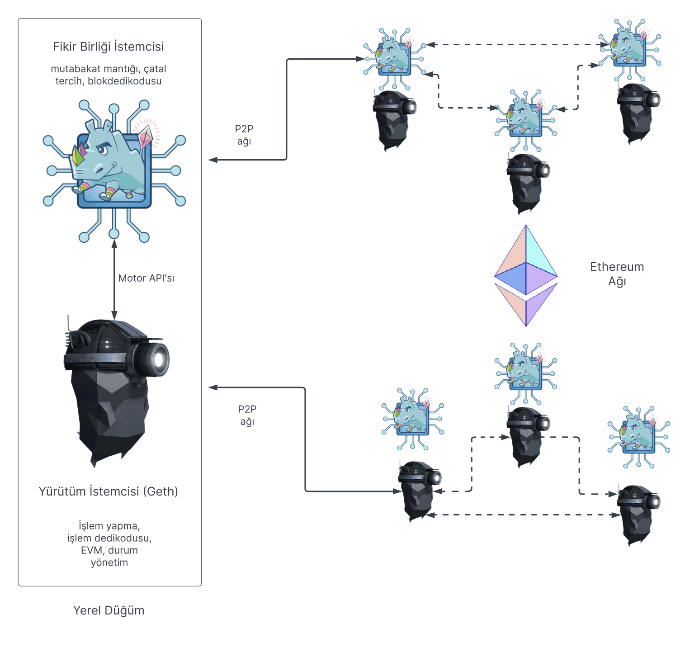

Bir Ethereum düğümü iki istemciden oluşur: bir [yürütme istemcisi](/developers/docs/nodes-and-clients/#execution-clients) ve bir [fikir birliği istemcisi](/developers/docs/nodes-and-clients/#consensus-clients). Bir düğümün yeni bir blok teklif edebilmesi için ayrıca bir [doğrulayıcı istemcisi](#validators) çalıştırması gerekir.

Ethereum [İş Kanıtı (PoW)](/developers/docs/consensus-mechanisms/pow/) kullanırken, tam bir Ethereum düğümü çalıştırmak için bir yürütme istemcisi yeterliydi. Ancak, [Hisse Kanıtı (PoS)](/developers/docs/consensus-mechanisms/pos/) uygulandığından beri, yürütme istemcisi [fikir birliği istemcisi](/developers/docs/nodes-and-clients/#consensus-clients) adı verilen başka bir yazılımla birlikte kullanılmalıdır.

Aşağıdaki diyagram, iki Ethereum istemcisi arasındaki ilişkiyi göstermektedir. İki istemci kendi eşler arası (P2P) ağlarına bağlanır. Yürütme istemcileri kendi P2P ağları üzerinden işlemleri yayarak (gossip) yerel işlem havuzlarını yönetirken, fikir birliği istemcileri kendi P2P ağları üzerinden blokları yayarak mutabakatı ve zincir büyümesini sağladığı için ayrı P2P ağlarına ihtiyaç duyulur.

_Yürütme istemcisi için Erigon, Nethermind ve Besu dahil olmak üzere çeşitli seçenekler vardır_.

Bu iki istemcili yapının çalışması için, fikir birliği istemcilerinin işlem paketlerini yürütme istemcisine iletmesi gerekir. Yürütme istemcisi, işlemlerin herhangi bir Ethereum kuralını ihlal etmediğini ve Ethereum'un durumuna yönelik önerilen güncellemenin doğru olduğunu doğrulamak için işlemleri yerel olarak yürütür. Bir düğüm blok üreticisi olarak seçildiğinde, fikir birliği istemcisi örneği, yeni bloğa dahil etmek ve küresel durumu güncellemek üzere yürütmek için yürütme istemcisinden işlem paketleri talep eder. Fikir birliği istemcisi, [Engine API](https://github.com/ethereum/execution-apis/blob/main/src/engine/common.md) kullanarak yerel bir RPC bağlantısı üzerinden yürütme istemcisini yönlendirir.

## Yürütme istemcisi ne yapar? {#execution-client}

Yürütme istemcisi, durum yönetimi ve Ethereum Sanal Makinesi'ni ([EVM](/developers/docs/evm/)) desteklemenin yanı sıra işlem doğrulama, işleme ve yayma (gossip) işlemlerinden sorumludur. Blok oluşturma, blok yayma veya mutabakat mantığını işlemekten sorumlu **değildir**. Bunlar fikir birliği istemcisinin yetki alanındadır.

Yürütme istemcisi yürütme yüklerini oluşturur - işlemlerin listesi, güncellenmiş durum ağacı ve yürütmeyle ilgili diğer veriler. Fikir birliği istemcileri, yürütme yükünü her bloğa dahil eder. Yürütme istemcisi ayrıca, geçerli olduklarından emin olmak için yeni bloklardaki işlemleri yeniden yürütmekten de sorumludur. İşlemlerin yürütülmesi, yürütme istemcisinin [Ethereum Sanal Makinesi (EVM)](/developers/docs/evm) olarak bilinen gömülü bilgisayarında gerçekleştirilir.

Yürütme istemcisi ayrıca, kullanıcıların Ethereum blokzincirini sorgulamasına, işlemler göndermesine ve akıllı sözleşmeler dağıtmasına olanak tanıyan [RPC yöntemleri](/developers/docs/apis/json-rpc) aracılığıyla Ethereum'a bir kullanıcı arayüzü sunar. RPC çağrılarının [Web3js](https://docs.web3js.org/), [Web3py](https://web3py.readthedocs.io/en/v5/) gibi bir kütüphane veya tarayıcı cüzdanı gibi bir kullanıcı arayüzü tarafından işlenmesi yaygındır.

Özetle, yürütme istemcisi:

- Ethereum'a bir kullanıcı geçididir
- Ethereum Sanal Makinesi'ne, Ethereum'un durumuna ve işlem havuzuna ev sahipliği yapar.

## Fikir birliği istemcisi ne yapar? {#consensus-client}

Fikir birliği istemcisi, bir düğümün Ethereum ağıyla eşzamanlı kalmasını sağlayan tüm mantıkla ilgilenir. Bu, eşlerden bloklar almayı ve düğümün her zaman en büyük onay birikimine (doğrulayıcıların efektif bakiyelerine göre ağırlıklandırılmış) sahip zinciri takip etmesini sağlamak için bir çatallanma seçimi algoritması çalıştırmayı içerir. Yürütme istemcisine benzer şekilde, fikir birliği istemcilerinin blokları ve onayları paylaştıkları kendi P2P ağları vardır.

Fikir birliği istemcisi blokları onaylamaya veya teklif etmeye katılmaz - bu, fikir birliği istemcisine isteğe bağlı bir eklenti olan bir doğrulayıcı tarafından yapılır. Doğrulayıcısı olmayan bir fikir birliği istemcisi yalnızca zincirin başını takip ederek düğümün eşzamanlı kalmasını sağlar. Bu, bir kullanıcının doğru zincirde olduğundan emin olarak yürütme istemcisini kullanarak Ethereum ile işlem yapmasına olanak tanır.

## Doğrulayıcılar {#validators}

Staking yapmak ve doğrulayıcı yazılımını çalıştırmak, bir düğümü yeni bir blok teklif etmek üzere seçilmeye uygun hale getirir. Düğüm operatörleri, yatırma sözleşmesine 32 ETH yatırarak fikir birliği istemcilerine bir doğrulayıcı ekleyebilirler. Doğrulayıcı istemcisi, fikir birliği istemcisiyle birlikte gelir ve herhangi bir zamanda bir düğüme eklenebilir. Doğrulayıcı, onayları ve blok tekliflerini işler. Ayrıca bir düğümün ödüller kazanmasını veya cezalar ya da kesintiler yoluyla ETH kaybetmesini sağlar.

[Staking hakkında daha fazlası](/staking/).

## Düğüm bileşenlerinin karşılaştırması {#node-comparison}

| Yürütme İstemcisi                                  | Fikir Birliği İstemcisi                                                                                                                                   | Doğrulayıcı                  |
| -------------------------------------------------- | --------------------------------------------------------------------------------------------------------------------------------------------------------- | ---------------------------- |
| Kendi P2P ağı üzerinden işlemleri yayar            | Kendi P2P ağı üzerinden blokları ve onayları yayar                                                                                                        | Blokları teklif eder         |
| İşlemleri yürütür/yeniden yürütür                  | Çatallanma seçimi algoritmasını çalıştırır                                                                                                                | Ödüller/cezalar biriktirir   |
| Gelen durum değişikliklerini doğrular              | Zincirin başını takip eder                                                                                                                                | Onaylamalar yapar            |
| Durum ve makbuz ağaçlarını yönetir                 | İşaret (Beacon) durumunu yönetir (mutabakat ve yürütme bilgilerini içerir)                                                                                | 32 ETH stake edilmesini gerektirir |
| Yürütme yükünü oluşturur                           | RANDAO'da (doğrulayıcı seçimi ve diğer mutabakat işlemleri için doğrulanabilir rastgelelik sağlayan bir algoritma) biriken rastgeleliği takip eder        | Ceza kesintisine uğrayabilir |
| Ethereum ile etkileşim için JSON-RPC API'sini sunar| Gerekçelendirme ve kesinleştirmeyi takip eder                                                                                                             |                              |

## Daha fazla bilgi {#further-reading}

- [Hisse Kanıtı (PoS)](/developers/docs/consensus-mechanisms/pos)
- [Blok teklifi](/developers/docs/consensus-mechanisms/pos/block-proposal)
- [Doğrulayıcı ödülleri ve cezaları](/developers/docs/consensus-mechanisms/pos/rewards-and-penalties)