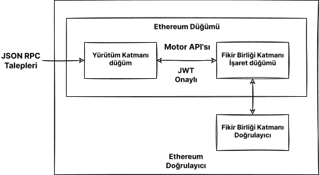

Kendi düğümünüzü çalıştırmak size birçok fayda sağlar, yeni fırsatlar oluşturur ve ekosistemi desteklemeye yardımcı olur. Bu sayfa size kendi düğümünüzü başlatmanız ve Ethereum işlem doğrulamalarına katılmanız için rehber olacaktır.

[Birleşimden](/roadmap/merge) sonra, bir Ethereum düğümünü çalıştırmak için iki istemcinin gerektiğini unutmayın. Bunlardan biri **yürütüm katmanı (EL)** istemcisi, diğeri ise **fikir birliği katmanı (CL)** istemcisidir. Bu sayfa, bir Ethereum düğümünü çalıştırmak için, bu iki istemcinin nasıl kurulacağını, yapılandırılacağını ve bağlanacağını gösterecektir.

## Ön Koşullar {#prerequisites}

Bir Ethereum düğümünün ne olduğunu ve neden bir istemci çalıştırmak isteyebileceğinizi anlamalısınız. Bunlar, [Düğümler ve istemciler](/developers/docs/nodes-and-clients/) bölümünde anlatılmıştır.

Eğer düğüm çalıştırma konusunda acemiyseniz veya daha az teknik bir yol arıyorsanız, ilk olarak [bir Ethereum düğümü çalıştırmak üzerine](/run-a-node) kullanıcı dostu öğreticimize göz atmanızı öneririz.

## Bir yaklaşım seçme {#choosing-approach}

Düğümünüzü başlatmak için atmanız gereken ilk adım bir yaklaşım seçmek olacaktır. Gereksinimlere ve çeşitli olasılıklara bağlı olarak, istemci uygulamasını (hem yürütüm hem de fikir birliği istemcilerinin), ortamı (donanım, sistem) ve istemci ayarları için parametreleri seçmelisiniz.

Bu sayfa, size bu seçimlerde rehberlik edecek ve Ethereum oluşumunuzu çalıştırmak için en uygun yolu bulmanıza yardım edecektir.

İstemci uygulamalarından seçim yapmak için, tüm Ana Ağ'a hazır [yürütüm istemcilerini](/developers/docs/nodes-and-clients/#execution-clients), [fikir birliği](/developers/docs/nodes-and-clients/#consensus-clients) istemcilerini görün ve [istemci çeşitliliği](/developers/docs/nodes-and-clients/client-diversity) hakkında bilgi edinin.

İstemcinin [gereksinimlerini](#requirements) göz önünde bulundurarak, yazılımı kendi [donanımınızda mı yoksa bulutta mı](#local-vs-cloud) çalıştıracağınıza karar verin.

Ortamı hazırladıktan sonra, seçilmiş istemcileri ya [acemi dostu bir arayüzle](#automatized-setup) ya da gelişmiş seçeneklere sahip bir terminalle [manuel](#manual-setup) bir şekilde kurun.

Düğüm çalışırken ve senkronize olurken bunu [kullanabilirsiniz](#using-the-node) ama [bakımına](#operating-the-node) dikkat ettiğinizden emin olun.



### Ortam ve donanım {#environment-and-hardware}

#### Yerel veya bulut {#local-vs-cloud}

Ethereum istemcileri, tüketici sınıfı bilgisayarlarda çalışabilirler ve madencilik makineleri gibi özel bir donanım gerektirmezler. Bu sebeple, düğümü ihtiyaçlarınıza göre dağıtmak için çeşitli seçenekleriniz vardır. Basitleştirmek gerekirse, fiziksel bir makine üzerinde ve bir bulut sunucusunda çalışan bir düğümü düşünelim:

- Bulut
  - Sağlayıcılar yüksek sunucu hizmet zamanı ve statik halka açık IP adresleri sunarlar
  - Özel veya sanal bir sunucu almak kendinizinkini yapmaktan daha rahat olabilir
  - Eksisi ise üçüncü bir parti olan sunucu sağlayıcısına güvenmeniz gerekmesidir
  - Tam düğüm için gereken depolama boyutu sebebiyle, kiralık sunucunun fiyatı yükselebilir
- Kendi donanımınız
  - Daha az güven gerektiren ve egemen yaklaşım
  - Bir kerelik yatırım
  - Önceden yapılandırılmış makine alma seçeneği
  - Makineyi fiziksel olarak hazırlamanız, bakımını yapmanız ve potansiyel makine ve ağ arızalarını gidermeniz gerekir

İki seçenek de yukarıda özetlendiği gibi farklı avantajlara sahiptir. Eğer bir bulut çözümü arıyorsanız, birçok geleneksel bulut bilişim sağlayıcısının yanı sıra ayrıca düğüm dağıtımına odaklı hizmetler bulunmaktadır. Barınımlı düğümler hakkında daha fazla seçenek için [bir servis olarak düğümleri](/developers/docs/nodes-and-clients/nodes-as-a-service/) inceleyin.

#### Donanım {#hardware}

Ancak sansüre dirençli bir merkeziyetsiz ağ, bulut sağlayıcılarına bağımlı olmamalıdır. Bunun yerine, düğümünüzü kendi yerel donanımınızda çalıştırmanız ekosistem için daha faydalıdır. [Tahminler](https://www.ethernodes.org/networkType/Hosting), düğümlerin büyük bir kısmının bulutta çalıştığını gösteriyor ve bu da tek hata noktası yaratabilir.

Ethereum istemcileri bilgisayarınızda, dizüstü bilgisayarınızda, sunucunuzda ve hatta tek kartlı bir bilgisayarda bile çalışabilir. İstemcileri kendi bilgisayarınızda çalıştırmak mümkün olsa da sadece düğümünüz için bir makineye sahip olmak, birincil bilgisayarınızın üzerindeki etkiyi azaltırken düğümün performansını ve güvenliğini de önemli ölçüde iyileştirebilir.

Kendi donanımınızı kullanmak çok kolay olabilir. Daha teknik kişiler için gelişmiş kurulumlar olduğu gibi birçok basit seçenek de mevcuttur. Hadi makinenizde Ethereum istemcileri çalıştırmak için gereksinimlere ve araçlara bakalım.

#### Gereksinimler {#requirements}

Donanım gereksinimleri istemciye göre farklılık gösterir, ancak düğümün yalnızca senkronize kalması gerektiğinden bu gereksinimler genellikle pek yüksek değildir. Bunu madencilikle karıştırmayın; madencilik çok daha fazla bilgi işlem gücü gerektirir. Bununla birlikte, senkronizasyon süresi ve performansı, daha güçlü donanımlarla iyileşir.

Herhangi bir istemciyi kurmadan önce, lütfen bilgisayarınızın onu çalıştırmak için yeterli kaynaklara sahip olduğundan emin olun. Minimum ve önerilen gereksinimleri aşağıda bulabilirsiniz.

Donanımınız için darboğaz çoğunlukla disk alanı olacaktır. Ethereum blok zinciri senkronizasyonunda girdi/çıktı yoğunluğu vardır ve çok fazla alan gerektirir. Senkronizasyon sonrasında bile yüzlerce GB boş alanı kalacak bir **katı hal sürücüsü (SSD)** kullanmak en iyisidir.

Veritabanının boyutu ve ilk senkronizasyon hızı, seçilmiş istemciye, yapılandırmasına ve [senkronizasyon stratejisine](/developers/docs/nodes-and-clients/#sync-modes) bağlıdır.

Ayrıca internet bağlantınızın bir [bant genişliği sınırı](https://wikipedia.org/wiki/Data_cap) tarafından sınırlandırılmadığından da emin olun. Başlangıç senkronizasyonu ve ağa yayınlanan veri, kotanızı aşabileceği için sınırsız bağlantı kullanmanız önerilir.

##### İşletim sistemi

Tüm istemciler ana işletim sistemlerini destekler: Linux, MacOS, Windows. Bu, düğümleri sıradan masaüstü veya sunucu makinelerinde, size en uygun işletim sistemiyle (OS) çalıştırabileceğiniz anlamına gelir. Potansiyel sıkıntılardan ve güvenlik açıklarından kaçınmak için işletim sisteminizin güncel olduğundan emin olun.

##### Minimum gereksinimler

- 2+ çekirdekli CPU
- 8 GB RAM
- 2 TB SSD
- 10+ MBit/sn bant genişliği

##### Tavsiye edilen özellikler

- 4+ çekirdekli hızlı CPU
- 16 GB+ RAM
- 2+ TB hızlı SSD
- 25+ MBit/sn bant genişliği

Seçtiğiniz senkronizasyon modu ve istemci alan gereksinimlerini etkileyecektir, ancak her bir istemci için ihtiyaç duyacağınız disk alanını aşağıda tahmin ettik.

| İstemci    | Disk boyutu (anlık senkronizasyon) | Disk boyutu (tam arşiv) |
| ---------- | ---------------------------------- | ----------------------- |
| Geth       | 500GB+                             | 12TB+                   |
| Nethermind | 500GB+                             | 12TB+                   |
| Besu       | 800GB+                             | 12TB+                   |
| Erigon     | Yok                                | 2.5TB+                  |

- Not: Erigon anlık senkronizasyon sunmaz, ancak Tam Budama mümkündür (yaklaşık 500 GB)

Fikir birliği istemcileri için, alan gereksinimi ayrıca istemci uygulaması ve açık olan özelliklere (ör. doğrulayıcı kesici) de bağlıdır ancak genel olarak işaret verisi için gereken ilave bir 200 GB ekleyin. Büyük bir doğrulayıcı sayısı ile bant genişliği yükü de artmaktadır. [Bu analizde fikir birliği istemcileri gereksinimleri hakkında detaylar](https://mirror.xyz/0x934e6B4D7eee305F8C9C42b46D6EEA09CcFd5EDc/b69LBy8p5UhcGJqUAmT22dpvdkU-Pulg2inrhoS9Mbc) bulabilirsiniz.

#### Tak-çalıştır çözümler {#plug-and-play}

Kendi donanımınızla bir düğüm çalıştırmak için en kolay seçenek tak-çalıştır kutular kullanmaktır. Satıcılardan önceden yapılandırılmış makineler en basit deneyimi sunar: sipariş et, bağla, çalıştır. Her şey önceden yapılandırılmıştır, açık bir kılavuz ve yazılım gözlemlemek ve kontrol etmek için bir kontrol paneli ile otomatik olarak çalışır.

- [DappNode](https://dappnode.io/)
- [Avado](https://ava.do/)

#### Tek kartlı bir bilgisayarda Ethereum {#ethereum-on-a-single-board-computer}

Ethereum düğümünü çalıştırmanın kolay ve ucuz bir yolu, ARM mimarisine sahip olan Raspberry Pi bile olsa tek kartlı bir bilgisayar kullanmaktır. [ARM'de Ethereum](https://ethereum-on-arm-documentation.readthedocs.io/en/latest/) Raspberry Pi ve diğer ARM cihazları için birden fazla yürütme ve fikir birliği istemcisinin çalıştırması kolay görüntüler sağlar.

Bunlar gibi küçük, ucuz ve verimli cihazlar evde düğüm çalıştırmak için idealdir fakat sınırlı performansları olduğunu aklınızda tutun.

## Düğümü başlatmak {#spinning-up-node}

Asıl istemci kurulumu otomatik başlatıcılarla veya istemci yazılımını direkt şekilde ayarlayarak tamamlanabilir.

Daha az gelişmiş kullanıcılar için, önerilen yaklaşım size kurulumda rehberlik eden ve istemci kurulum sürecini otomatik hale getiren bir başlatıcı kullanılmasıdır. Ancak terminal kullanım deneyiminiz var ise, elle kurulum adımlarını takip etmek kolay olmalıdır.

### Kılavuzlu kurulum {#automatized-setup}

Birden fazla kullanıcı dostu proje, istemci kurulum deneyimini geliştirmeyi hedeflemektedir. Bu başlatıcılar otomatik istemci kurulumu ve yapılandırması sunar ve hatta bazıları kılavuzlu bir kurulum ve istemcilerin gözlemi için grafik bir arayüz sunar.

Aşağıda birkaç tıklamayla istemci kurmanıza ve yönetmenize yardımcı olacak birkaç proje bulunmaktadır:

- [DappNode](https://docs.dappnode.io/user/quick-start/first-steps/) - DappNode sadece bir satıcıdan gelecek bir makine ile gelmez. Yazılım, asıl düğüm başlatıcısı ve birçok özelliği olan kontrol merkezi herhangi bir donanımda kullanılabilir.
- [eth-docker](https://eth-docker.net/) - Basit ve güvenli kilitlemeye odaklı, Docker ile otomatik kurulum, temel terminal ve Docker bilgisi gerektirir, biraz daha gelişmiş kullanıcılara önerilir.
- [Stereum](https://stereum.net/ethereum-node-setup/) - Uzak bir sunucuya SSH bağlantısı aracılığıyla istemci kurulumu için GUI kurulum kılavuzu, kontrol merkezi ve daha birçok özelliği bulunan bir başlatıcı.
- [NiceNode](https://www.nicenode.xyz/) - Bilgisayarınızda bir düğüm çalıştırmak için basit bir kullanıcı deneyimi olan başlatıcı. Sadece istemciler seçin ve birkaç tıkta bunları başlatın. Hâlâ geliştirilmektedir.
- [Sedge](https://docs.sedge.nethermind.io/docs/intro) - CLI sihirbazını kullanarak otomatik olarak bir Docker yapılandırması oluşturan düğüm kurulum aracı. Nethermind tarafından Go ile yazılmıştır.

### Manuel istemci kurulumu {#manual-setup}

Diğer bir seçenek ise istemci yazılımını manuel olarak indirmek, doğrulamak ve yapılandırmaktır. Bazı istemciler bir grafik arayüzü sunsa bile, manuel bir kurulum basit terminal kabiliyeti gerektirir ancak çok daha fazla değişkenlik sağlar.

Önceden de anlatıldığı gibi, kendi Ethereum düğümünüzü kurmak bir fikir birliği ve yürütüm istemcisi çifti çalıştırmayı gerektirecektir. Bazı istemciler diğer türden bir hafif istemci içerebilir ve başka bir yazılıma duymadan eşlenebilir. Ancak, tam güven gerektirmeyen doğrulama iki uygulamayı da gerektirir.

#### İstemci yazılımını edinme {#getting-the-client}

İlk olarak tercih ettiğiniz [yürütüm istemcisi](/developers/docs/nodes-and-clients/#execution-clients) ve [fikir birliği istemcisi](/developers/docs/nodes-and-clients/#consensus-clients) yazılımını elde etmeniz gerekir.

İşletim sisteminize ve mimarinize uyan bir yürütülebilir uygulama veya bir kurulum paketi indirmeniz yeterlidir. Her zaman indirilen paketlerin imzalarını ve denetim toplamlarını doğrulayın. Bazı istemciler ayrıca daha kolay kurulum ve güncellemeler için depolar veya Docker görüntüleri sağlar. Tüm istemciler açık kaynaklıdır, yani bunları kaynağından da inşa edebilirsiniz. Bu daha gelişmiş bir yöntemdir, ancak bazı durumlarda gerekli olabilir.

Her bir istemcinin kurulumu için yönergeler yukarıdaki istemci listelerinde bağlantısı verilmiş dokümanlarda sağlanmıştır.

İstemcilerin önceden inşa edilmiş dosyalarını veya kurulum yönergelerini bulabileceğiniz çıkarım sürüm notu sayfaları buradadır:

##### Yürütüm istemcileri

- [Besu](https://github.com/hyperledger/besu/releases)
- [Erigon](https://github.com/ledgerwatch/erigon#usage) (önceden inşa edilmiş bir kütüphane sağlamaz, derlenmesi gerekir)
- [Geth](https://geth.ethereum.org/downloads/)
- [Nethermind](https://downloads.nethermind.io/)

Ayrıca istemci çeşitliliğinin [yürütüm katmanında bir sorun](/developers/docs/nodes-and-clients/client-diversity/#execution-layer) olduğundan da bahsetmeye değer. Okurların azınlık bir yürütüm istemcisi çalıştırması önerilir.

##### Mutabakat istemcileri

- [Lighthouse](https://github.com/sigp/lighthouse/releases/latest)
- [Lodestar](https://chainsafe.github.io/lodestar/install/source/) (Önceden inşa edilmiş bir kütüphane sağlamaz, ya kaynağından derlenir ya da bir Docker görüntüsü)
- [Nimbus](https://github.com/status-im/nimbus-eth2/releases/latest)
- [Prysm](https://github.com/prysmaticlabs/prysm/releases/latest)
- [Teku](https://github.com/ConsenSys/teku/releases)

[İstemci çeşitliliği](/developers/docs/nodes-and-clients/client-diversity/) doğrulayıcılar çalıştıran fikir birliği düğümleri için önemlidir. Eğer doğrulayıcıların çoğunluğu tek bir istemci uygulaması kullanıyorsa, ağ güvenliği risktedir. Bundan dolayı azınlık bir istemci seçiminin düşünülmesi önerilir.

[Güncel ağ istemci kullanımını görün](https://clientdiversity.org/) ve [istemci çeşitliliği](/developers/docs/nodes-and-clients/client-diversity) hakkında dahasını öğrenin.

##### Yazılımı doğrulamak

İnternetten yazılım indirirken, bütünlüğünün doğrulanması önerilir. Bu adım zorunlu değildir ancak özellikle Ethereum istemcisi gibi önemli bir altyapı parçası için potansiyel saldırı vektörleri ve onlardan nasıl kaçınılacağıyla ilgili farkındalık sahibi olmak önemlidir. Eğer önceden inşa edilmiş bir dosya indirdiyseniz, ona güvenmeniz gerekir ve bir saldırganın çalıştırılabilir dosyayı zararlı bir versiyonuyla değiştirebileceği riskini göze alırsınız.

Geliştiriciler yayınlanmış dosyaları kendi PGP anahtarları ile imzalarlar böylece tam olarak onların oluşturduğu yazılımı çalıştırdığınızı kriptografik olarak doğrulayabilirsiniz. Geliştiriciler tarafından kullanılan herkese açık anahtarları elde etmeniz gerekir, bunlar da istemci yayım sayfalarında veya dokümanlarda bulunur. İstemci yayımını ve imzasını indirdikten sonra örneğin [GnuPG](https://gnupg.org/download/index.html) gibi bir PGP uygulamasını onları doğrulamak için kullanabilirsiniz. [Linux](https://www.tecmint.com/verify-pgp-signature-downloaded-software/) veya [Windows/MacOS](https://freedom.press/training/verifying-open-source-software/) üzerinde `gpg` kullanarak açık kaynak yazılım doğrulama üzerine bir öğreticiye bakın.

Başka bir doğrulama yöntemi ise geliştiriciler tarafından sağlanan karmanın, yani eşsiz kriptografik bir parmak izinin, indirdiğiniz yazılımınki ile uyup uymadığından emin olmaktır. Bu PGP kullanmaktan bile daha kolaydır ve bazı istemciler sadece bu seçeneği sunar. Sadece karma fonksiyonunu indirilen yazılım üzerinde çalıştırın ve sürüm notu sayfasındaki ile karşılaştırın. Örneğin:

```
sha256sum teku-22.6.1.tar.gz

9b2f8c1f8d4dab0404ce70ea314ff4b3c77e9d27aff9d1e4c1933a5439767dde
```

#### İstemci kurulumu {#client-setup}

İstemci yazılımını indirdikten, kurduktan veya derledikten sonra, çalıştırmaya hazırsınız. Bu sadece yeterli yapılandırma ile yürütülebileceği anlamına gelir. İstemciler birçok özelliği etkinleştirebilen zengin yapılandırma seçenekleri sunarlar.

Hadi istemci performansını ve veri kullanımını büyük oranda etkileyen seçeneklerle başlayalım. [Senkronizasyon modları](/developers/docs/nodes-and-clients/#sync-modes) farklı blok zinciri verileri indirme ve doğrulama yöntemlerini temsil eder. Düğümü başlatmadan önce, hangi ağı ve senkronizasyon modunu kullanacağınıza karar vermelisiniz. Göz önünde bulundurulması gereken en önemli şeyler ise disk alanı ve istemcinin ihtiyaç duyacağı senkronizasyon süresidir. Hangi senkronizasyon modunun varsayılan olduğunu belirlemek için istemcinin dokümanlarına dikkat edin. Eğer size uymazsa, güvenlik düzeyine, mevcut veriye ve maliyete göre başka birini seçin. Senkronizasyon algoritmasının yanı sıra, farklı türdeki eski verilerin budanmasını da ayarlayabilirsiniz. Budama, örneğin son bloklardan erişilemeyen durum ağaç düğümlerini kaldırma gibi eski verilerin silinmesini sağlar.

Bazı diğer yapılandırma seçenekleri, örnek verecek olursak bir ağ seçmek - Ana Ağ veya test ağları, RPC veya WebSockets için HTTP uç noktalarını etkinleştirmek ve benzeridir. Tüm özellikler ve seçenekleri istemcinin dokümanlarında bulabilirsiniz. İstemciyi uyumlu bayraklarla çalıştırarak direkt olarak CLI'de veya yapılandırma dosyasında çeşitli istemci yapılandırmaları belirlenebilir. Her istemci biraz farklıdır; lütfen her zaman yapılandırma seçenekleri hakkında detaylar için resmi dokümanlara veya yardım sayfasına başvurun.

Test etmek amaçlı olarak, istemciyi test ağlarından birinde çalıştırmayı tercih edebilirsiniz. [Desteklenen ağları gözden geçirin](/developers/docs/nodes-and-clients/#execution-clients).

Yürütüm istemcilerinin basit yapılandırma ile çalıştırılma örnekleri sıradaki bölümde görülebilir.

#### Yürütüm istemcisini başlatmak {#starting-the-execution-client}

Ethereum istemci yazılımını başlatmadan önce, ortamınızın hazır olduğuna dair son bir kontrol yapın. Örneğin, şunlara emin olun:

- Seçilmiş ağ ve senkronizasyon modu hesaba katıldığında yeterli disk alanı olduğuna.
- Bellek ve CPU'nun diğer programlar tarafından durdurulmadığına.
- İşletim sisteminin en güncel sürüme güncellendiğine.
- Sistemin doğru saat ve tarihe ayarlı olduğuna.
- Yönlendiriciniz ve güvenlik duvarınızın, dinleme bağlantı noktalarındaki bağlantıları kabul ettiğine. Varsayılan olarak Ethereum istemcileri, ikisi de varsayılan olarak 30303 üzerinde olan bir dinleyici (TCP) bağlantı noktası ve bir keşif (UDP) bağlantı noktası kullanır.

Her şeyin doğru çalıştığından emin olmak için önce istemcinizi bir test ağında çalıştırın.

Başlangıçta, varsayılan olmayan tüm istemci ayarlarını bildirmeniz gerekir. Tercih yapılandırmalarınızı duyurmak için bayrakları veya yapılandırma dosyasını kullanabilirsiniz. Her bir istemcinin özellik listesi ve yapılandırma söz dizimi farklılık gösterir. Detaylar için istemcinizin dokümanlara bakın.

Yürütüm ve fikir birliği istemcileri [Motor API](https://github.com/ethereum/execution-apis/tree/main/src/engine)'da belirtilen doğrulanmış bir uç noktası aracılığıyla iletişim kurarlar. Bir fikir birliği istemcisine bağlanmak için yürütüm istemcisinin bilinen bir yolda bir [`jwtsecret`](https://jwt.io/) oluşturması gerekir. Güvenlik ve istikrar sebeplerinden dolayı, istemciler aynı makinede çalışmalıdır ve iki istemci de bu yolu aralarında yerel bir RPC bağlantısını doğrulamak için kullanıldığından bilmelidir. Yürütüm istemcisi ayrıca kimliği doğrulanmış API'lar için bir dinleme bağlantı noktası tanımlamalıdır.

Bu token istemci yazılmı tarafından otomatik olarak oluşturulur ama bazı durumlar kendiniz yapmanız gerekebilir. [OpenSSL](https://www.openssl.org/) kullanarak oluşturabilirsiniz:

```
openssl rand -hex 32 > jwtsecret
```

#### Bir yürütüm istemcisi çalıştırmak {#running-an-execution-client}

Bu bölüm size yürütüm istemcileri başlatmada rehberlik edecektir. Sadece istemciyi şu ayarlarla başlatacak temel bir yapılandırma örneği olarak görev yapmaktadır:

- Bağlanılacak ağı belirler, bizim örneklerimizde ana ağ
  - Kurulumunuzun ön hazırlığı için [test ağlarından birini](/developers/docs/networks/) seçebilirsiniz
- Blok zincir dahil tüm verinin depolanacağı veri klasörünü belirtir
  - Yolu gerçek bir versiyonu ile değiştirdiğinizden emin olun, örneğin harici diskinize işaret edecek şekilde
- İstemci ile iletişim için arayüzleri aktif eder
  - Fikir birliği istemcisi ile iletişim için Motor API ve JSON RPC dahil
- Doğrulanmış API için `jwtsecret` yolunu belirler
  - Örnek yolu istemciler tarafından erişilebilecek gerçek bir versiyonu ile değiştirdiğinizden emin olun, ör. `/tmp/jwtsecret`

Bunun temel bir örnek olduğunu aklınızda tutun, diğer tüm ayarlar varsayılana ayarlı olacaktır. Varsayılan değerler, ayarlar ve özellikleri öğrenmek için her bir istemcinin dokümasyonlarına dikkat edin. Gözlem, doğrulayıcı çalıştırmak ve benzeri gibi daha fazla özellik için spesifik istemcinin dokümanlarına başvurun.

> Örneklerdeki ters eğik çizgilerin `\` sadece biçimlendirme amaçlı olduğunu unutmayın, yapılandırma bayrakları tek bir satırda belirlenebilir.

##### Besu'yu Çalıştırmak

Bu örnek Besu'yu ana ağda başlatır, blok zincir verisini varsayılan biçimde `/veri/ethereum` lokasyonunda tutar, JSON RPC ve Motor RPC'yi fikir birliği istemcisini bağlamak için etkinleştirir. Motor API `jwtsecret` ile doğrulanmıştır ve sadece `localhost` tarafından gelen çağrılara izin verilir.

```
besu --network=mainnet \
    --data-path=/data/ethereum \
    --rpc-http-enabled=true \
    --engine-rpc-enabled=true \
    --engine-host-allowlist="*" \
    --engine-jwt-enabled=true \
    --engine-jwt-secret=/path/to/jwtsecret
```

Besu aynı zamanda birtakım sorular soran ve yapılandırma dosyasını oluşturan bir başlatıcı seçeneği ile beraber gelir. Etkileşimli başlatıcıyı şunu kullanarak çalıştırın:

```
besu --Xlauncher
```

[Besu'nun dokümanlarını](https://besu.hyperledger.org/en/latest/HowTo/Get-Started/Starting-node/) daha fazla seçenek ve yapılandırma detayları içerir.

##### Erigon'u Çalıştırmak

Bu örnek Erigon'u ana ağda başlatır, blok zincir verisini `/data/ethereum` lokasyonunda depolar, JSON RPC'yi etkinleştirir, hangi isim alanlarına izin verildiğini belirler ve `jwtsecret` yolu tarafından belirlenen mutabakat mekanizmasının bağlanması için doğrulamayı etkinleştirir.

```
erigon --chain mainnet \
    --datadir /data/ethereum  \
    --http --http.api=engine,eth,web3,net \
    --authrpc.jwtsecret=/path/to/jwtsecret
```

Erigon varsayılan olarak 8 GB bir HDD ile tam senkronizasyon gerçekleştirir, bu da 2 TB'den fazla arşiv verisi ortaya çıkartır. `datadir` yolunun yeterli alanı olan bir diske işaret ettiğinden emin olun veya farklı veri türlerini kesebilecek `--prune` bayrağını inceleyin. Daha fazlasını öğrenmek için Erigon'un `--help` komutuna bakın.

##### Geth'i Çalıştırmak

Bu örnek Geth'i ana ağda başlatır, blok zincir verisini `/data/ethereum` lokasyonunda depolar, JSON RPC'yi etkinleştirir ve hangi isim alanlarına izin verildiğini belirler. Aynı zamanda `jwtsecret` yolu gereken bağlanan fikir birliği istemcisi için doğrulamayı ve hangi bağlantılara izin verildiğini belirlemeyi etkinleştirir, bizim örneğimizde bu sadece `localhost` tarafından gelenlerdir.

```
geth --mainnet \
    --datadir "/data/ethereum" \
    --http --authrpc.addr localhost \
    --authrpc.vhosts="localhost" \
    --authrpc.port 8551
    --authrpc.jwtsecret=/path/to/jwtsecret
```

[Daha fazla yapılandırma seçeneği için dokümanlara](https://geth.ethereum.org/docs/fundamentals/command-line-options) bakın ve [Geth'i bir fiklir birliği istemcisi ile çalıştırma](https://geth.ethereum.org/docs/getting-started/consensus-clients) üzerine daha fazlasını öğrenin.

##### Nethermind'ı Çalıştırmak

Nethermind çeşitli [kurulum seçenekleri](https://docs.nethermind.io/nethermind/first-steps-with-nethermind/getting-started) sunar. Paket çeşitli dosyalarla gelir, bunlara yapılandırmayı etkileşimli bir şekilde oluşturmanıza yardımcı olacak kılavuzlu kurulumu olan bir Başlatıcı dahildir. Alternatif olarak, çalıştırılabilir dosyanın kendisi olan Çalıştırıcı'yı bulacaksınız ve bunu sadece yapılandırma bayrakları ile çalıştırabilirsiniz. JSON RPC varsayılan olarak etkinleştirilir.

```
Nethermind.Runner --config mainnet \
    --datadir /data/ethereum \
    --JsonRpc.JwtSecretFile=/path/to/jwtsecret
```

Nethermind dokümanları Nethermind'ı bir fikir birliği istemcisi ile çalıştırmak üzerine [tam bir kılavuz](https://docs.nethermind.io/nethermind/first-steps-with-nethermind/running-nethermind-post-merge) sunar.

Bir yürütüm istemcisi çekirdek fonksiyonlarını ve seçili uç noktalarını başlatacak ve eşleri aramaya başlayacaktır. İstemci, eşlerini başarılı bir şekilde bulduktan sonra senkronizasyonu başlatır. Yürütüm istemcisi fikir birliği istemcisinden bir bağlantı bekleyecektir. İstemci mevcut duruma başarılı şekilde senkronize edildiğinde mevcut blok zincir verisi mevcut olacaktır.

#### Fikir birliği istemcisini başlatmak {#starting-the-consensus-client}

Fikir birliği istemcisi yürütüm istemcisi ile yerel bir RPC bağlantısı kurmak için doğru bir port yapılandırması ile başlatılmalıdır. Fikir birliği istemcilerinin bir yapılandırma argümanı olarak açık yürütüm istemcisi portu ile çalıştırılmaları gerekir.

Fikir birliği istemcisi ayrıca aralarındaki RPC bağlantısını doğrulamak için yürütüm istemcisinin `jwt-secret` yoluna ihtiyaç duyar. Yukarıdaki yürütüm örneklerine benzer şekilde, her fikir birliği istemcisinn jwt token dosya yolunu argüman olarak alan bir yapılandırma bayrağı bulunur. Bu, yürütüm istemcisine sağlanan `jwtsecret` yolu ile tutarlı olmalıdır.

Bir doğrulayıcı çalıştırmayı planlıyorsanız, alıcının Ethereum adresini belirten bir yapılandırma bayrağı eklediğinizden emin olun. Bu doğrulayıcınızın ether ödüllerinin birikeceği yerdir. Her fikir birliği istemcisi, ör. `--suggested-fee-recipient=0xabcd1` gibi argüman olarak Ethereum adresi alan bir seçeneğe sahiptir.

Bir test ağı üzerinde İşaret Düğümü başlatırken, [kontrol noktası senkronizasyonu](https://notes.ethereum.org/@launchpad/checkpoint-sync) için herkese açık bir uç noktası kullanarak senkronizasyon süresinden önemli oranda zaman kazanabilirsiniz.

#### Bir fikir birliği istemcisi çalıştırmak

##### Lighthouse'u Çalıştırmak

Lighthouse'u çalıştırmadan önce, nasıl kurulacağı ve yapılandırılacağıyla ilgili dahasını [Lighthouse Kitabı](https://lighthouse-book.sigmaprime.io/installation.html)'ndan öğrenin.

```
lighthouse beacon_node \
    --network mainnet \
    --datadir /data/ethereum \
    --http \
    --execution-endpoint http://127.0.0.1:8551 \
    --execution-jwt /path/to/jwtsecret
```

##### Lodestar'ı Çalıştırmak

Lodestar yazılımını derleyerek veya Docker görüntüsünü indirerek kurun. Dahasını [dokümanlarda](https://chainsafe.github.io/lodestar/) ve daha detaylı [kurulum rehberinde](https://hackmd.io/@philknows/rk5cDvKmK) öğrenin.

```
lodestar beacon \
    --rootDir="/data/ethereum" \
    --network=mainnet \
    --eth1.enabled=true \
    --execution.urls="http://127.0.0.1:8551" \
    --jwt-secret="/path/to/jwtsecret"
```

##### Nimbus'u Çalıştırmak

Nimbus hem yürütüm hem de fikir birliği istemcileriyle gelir. En makul hesaplama gücüne sahip olan çeşitli cihazlarda bile çalıştırılabilir. [Nimbus'un kendisini ve bağımlılıklarını indirdikten](https://nimbus.guide/quick-start.html) sonra, fiklir birliği istemcisini çalıştırabilirsiniz:

```
nimbus_beacon_node \
    --network=mainnet \
    --web3-url=http://127.0.0.1:8551 \
    --rest \
    --jwt-secret="/path/to/jwtsecret"
```

##### Prysm'i Çalıştırmak

Prysm kolay otomatik kurulum sağlayan bir betikle gelir. Detaylar [Prysm dokümanlarında](https://docs.prylabs.network/docs/install/install-with-script) bulunabilir.

```
./prysm.sh beacon-chain \
    --mainnet \
    --datadir /data/ethereum  \
    --execution-endpoint=http://localhost:8551  \
    --jwt-secret=/path/to/jwtsecret
```

##### Teku'yu Çalıştırmak

```
teku --network mainnet \
    --data-path "/data/ethereum" \
    --ee-endpoint http://localhost:8551 \
    --ee-jwt-secret-file "/path/to/jwtsecret"
```

Bir fikir birliği istemcisi yatırım sözleşmesini okumak ve doğrulayıcıları tespit etmek için yürütüm istemcisine bağlandığında, aynı zamanda diğer İşaret Düğümü eşlerine bağlanır ve başlangıçtan itibaren mutabakat yuvalarını senkronize etmeye başlar. İşaret Düğümü mevcut döneme ulaştığında, İşaret API doğrulayıcınız için kullanılabilir hale gelir. [İşaret Düğümü API'ları](https://eth2docs.vercel.app/) hakkında dahasını öğrenin.

### Doğrulayılar Eklemek {#adding-validators}

Bir fikir birliği istemcisi, doğrulayıcıların bağlanması için bir İşaret Düğümü işlevi görür. Her fikir birliği istemcisinin ilgili dokümanlarında detaylı şekilde açıklanan kendi doğrulayıcı yazılımı bulunur.

Kendi doğrulayıcınızı çalıştırmak Ethereum ağını desteklemek için en etkili ve güven gerektirmeyen yöntem olan [solo hisseleme](/staking/solo/) ön ayak olur. Ancak bunun için 32 ETH'lik bir yatırım gerekir. Kendi düğümünüzde daha az bir miktarlar doğrulayıcı çalıştırmak için, [Rocket Pool](https://rocketpool.net/node-operators) gibi izin gerektirmeyen düğüm operatörleri olan merkeziyetsiz bir havuz ilginizi çekebilir.

Kilitleme ve doğrulayıcı anahtar oluşumuna başlamak için en kolay yol olan [Goerli Test Ağı Hisseleme Başlama Noktası](https://goerli.launchpad.ethereum.org/) kurulumunuzu [Goerli üzerinde düğümler çalıştırarak](https://notes.ethereum.org/@launchpad/goerli) test etmenizi sağlar. Ana ağ için hazır olduğunuzda, [Ana Ağ Hisseleme Başlama Noktasını](https://launchpad.ethereum.org/) kullanarak bu adımları tekrarlayabilirsiniz.

Hisseleme seçeneklerine genel bir bakış için [hisseleme sayfasını](/staking) ziyaret edin.

### Düğümü kullanmak {#using-the-node}

Yürütüm istemcileri, işlemleri göndermek, etkileşim kurmak veya Ethereum ağında akıllı sözleşmeleri çeşitli şekillerde dağıtmak için kullanabileceğiniz [RPC API uç noktaları](/developers/docs/apis/json-rpc/) sunar:

- Bunları uyumlu bir protokolle manuel olarak çağırmak (ör. `curl` kullanarak)
- Sağlanan bir konsolu eklemek (ör. `geth attach`)
- Bunları örnek olarak [web3.py](https://web3py.readthedocs.io/en/stable/overview.html#overview), [ethers](https://github.com/ethers-io/ethers.js/) gibi web3 kütüphanelerini kullanarak uygulamalara eklemek

Farklı istemciler, RPC uç noktalarının farklı uygulamalarına sahiptir. Ancak her istemciyle kullanabileceğiniz standart bir JSON-RPC bulunmaktadır. Genel bir bakış için [JSON-RPC dokümanlarını](/developers/docs/apis/json-rpc/) okuyun. Ethereum ağından bilgiye ihtiyaç duyan uygulamalar bu RPC'yi kullanabilir. Örnek olarak, popüler cüzdan MetaMask büyük gizlilik ve güvenlik faydaları olan [kendi RPC uç noktanıza bağlanmanıza](https://metamask.zendesk.com/hc/en-us/articles/360015290012-Using-a-Local-Node) olanak verir.

Fikir birliği istemcilerinin tümü, fikir birliği istemcisinin durumunu kontrol etmek veya blokları ve mutabakat verilerini indirmek için kullanılabilecek bir [İşaret API'sı](https://ethereum.github.io/beacon-APIs) sunar. Bunu [Curl](https://curl.se) gibi araçları kullanıp istek göndererek yapar. Bununla ilgili daha fazla bilgiye, her bir fikir birliği istemcisinin dökümanlarından ulaşılabilir.

#### RPC'ye ulaşma {#reaching-rpc}

Yürütüm istemcisi JSON RPC'si için varsayılan port `8545`'tir, ancak yapılandırmada yerel uç noktalarının portlarını değiştirebilirsiniz. Varsayılan olarak, RPC arayüzüne sadece bilgisayarınızın yerel sunucusundan erişilebilir. Eğer bunu uzaktan erişilebilir hale getirmek istiyorsanız, adresi `0.0.0.0` yaparak genel duruma getirebilirsiniz. Bu, onu yerel ağ ve genel IP adresleri üzerinden erişilebilir hale getirecektir. Çoğu durumda yönlendiricinizde port yönlendirmeyi de kurmanız gerekecektir.

İnternete port açmaya dikkatle yaklaşın çünkü bu internetteki herhangi birinin düğümünüzü kontrol etmesine izin verecektir. Kötü amaçlı aktörler, sisteminizi çökertmek için düğümünüze erişim sağlayabilirler veya istemcinizi cüzdan olarak kullanıyorsanız paranızı çalabilirler.

Bu engeli aşmanın bir yolu ise potansiyel olarak zararlı olan RPC yöntemlerinin değiştirilebilmesini engellemektir. Örneğin, Geth ile değiştirilebilir yöntemleri bir bayrakla bildirebilirsiniz: `--http.api web3,eth,txpool`.

RPC arayüzüne erişim, sınır katman API'larının geliştirmesi veya Nginx gibi web sunucusu uygulamaları ve onların istemcinizin yerel adres ve portuna bağlanması ile genişletilebilir. Orta bir katman kullanmak ayrıca geliştiricilerin RPC arayüzüne güvenli `https` bağlantıları için sertifika kurma kabiliyetini de sağlayabilir.

Bir web sunucusu, proxy veya dışa bakan bir Rest API ayarlamak düğümünüzün RPC uç noktasına erişim sağlamak için tek yol değildir. Herkese açık şekilde erişilebilir bir uç noktası kurmanın gizlilik sağlayan diğer bir yolu ise düğümü kendi [Tor](https://www.torproject.org/) onion servisiniz üzerinde çalıştırmaktır. Bu, genel statik bir IP adresi veya açık portlar olmadan yerel ağınızın dışında RPC'ye erişmenizi sağlayacaktır. Ancak bu yapılandırmanın kullanılması RPC uç noktasının sadece tüm uygulamalar tarafından desteklenmeyen Tor ağı aracılığıyla erişilebilir olmasına yol açacaktır ve bağlantı sorunlarına sebep olabilir.

Bunu yapmak için, kendi [onion servisinizi](https://community.torproject.org/onion-services/) kurmanız gerekir. Kendiniz barındırmak için onion servisi kurulumu üzerine [dokümanlara](https://community.torproject.org/onion-services/setup/) inceleyin. Onu RPC portuna proxy'si olan bir web sunucusu ile veya direkt olarak RPC'ye işaret ettirebilirsiniz.

Sonuncu ve iç ağlara erişim sağlamak için en popüler yollardan biri ise VPN bağlantısıdır. Kullanım alanınıza ve düğümünüze ihtiyaç duyan kullanıcı niceliğine göre, güvenli VPN bağlantısı bir seçenek olabilir. [OpenVPN](https://openvpn.net/) endüstri standardı olan SSL/TLS protokolünü kullanan ve OSI katman 2 veya 3 güvenli ağ eklentisini kullanan tam teşekkülü bir SSL VPN'dir; sertifikalar, akıllı kartlar ve/veya kullanıcı adı/şifre bilgileri ile esnek istemci doğrulama yöntemlerini destekler ve VPN sanal arayüzüne uygulanan savunma duvarı kurallarına göre kullanıcı veya gruba özel erişim kontrol politikaları sağlar.

### Düğümü çalıştırma {#operating-the-node}

Düğümünüzün düzgün çalıştığından emin olmak için onu düzenli olarak izlemelisiniz. Zaman zaman bakım yapmanız gerekebilir.

#### Bir düğümü çevrimiçi tutmak {#keeping-node-online}

Düğümünüzün her zaman çevrimiçi olması gerekmez, ancak ağ ile senkronize durumda olması için onu olabildiğince çevrimiçi tutmalısınız. Yeniden başlatmak için kapatabilirsiniz ama şunu unutmayın:

- Kapatmak, eğer güncel durum hâlâ sabit diske yazılıyorsa birkaç dakika sürebilir.
- Zorla kapatmalar veritabanına hasar verebilir, bu da tüm düğümü yeniden senkronize etmenizi gerektirir.
- İstemcinizin ağ ile senkronizasyonu bozulacaktır ve yeniden başlattığınızda tekrar senkronize etmeniz gerekecektir. Düğüm kapatıldığı son yerden senkronize olmaya başlasa da, çevrim dışı olduğu süreye göre süreç zaman alabilir.

_Bu, fikir birliği katmanı doğrulayıcı düğümleri için geçerli değildir._ Düğümünüzü çevrimdışı yapmak ona bağlı olan tüm servisleri etkiler. Eğer _hisseleme_ amacıyla bir düğüm çalıştırıyorsanız kesinti süresini olabildiğince azaltmalısınız.

#### İstemci hizmetleri oluşturma {#creating-client-services}

İstemcilerinizi başlangıçta otomatik olarak çalıştırmak için bir hizmet oluşturmayı düşünün. Örneğin Linux sunucularında en iyi pratik, ör. `systemd` ile istemciyi düzgün bir yapılandırmayla, sınırlı izinleri olan bir kullanıcı altında ve otomatik başlatan bir servis oluşturmak olurdu.

#### İstemcileri güncellemek {#updating-clients}

İstemci yazılımınızı en son güvenlik yamaları, özellikler ve [EIP'ler](/eips/) ile güncel tutmalısınız. Özellikle [sert çatallanmalardan](/history/) önce, doğru istemci sürümlerini çalıştırdığınızdan emin olun.

> Önemli ağ güncellemelerinden önce, EF [blogunda](https://blog.ethereum.org) bir gönderi yayınlar. Düğümünüz güncellemeye ihtiyaç duyduğunda postanıza bir bildirim almak için [bu duyurulara abone olabilirsiniz](https://groups.google.com/a/ethereum.org/g/announcements).

İstemcileri güncellemek çok basittir. Her istemcinin dokümanlarında belirli yönergeler vardır, ancak süreç genellikle en güncel sürümü indirmek ve istemciyi yeni çalıştırılabilir dosya ile yeniden başlatmaktır. İstemci kaldığı yerden ancak uygulanan güncellemelerle devam etmelidir.

Her istemci uygulamasının, eşler arası protokolde kullanılan insan tarafından okunabilir bir sürüm dizesi vardır, ancak buna komut satırından da erişilebilir. Bu sürüm dizesi, kullanıcıların doğru sürümü çalıştırıp çalıştırmadıklarını kontrol etmelerini sağlar ve belirli istemcilerin ağ üzerindeki dağılımını ölçmekle ilgilenen blok arayıcılarına ve diğer analitik araçlara izin verir. Sürüm dizileri hakkında daha fazla bilgi için lütfen bireysel istemci dokümanlarına bakın.

#### Ek hizmetler çalıştırma {#running-additional-services}

Kendi düğümünüzü çalıştırmak Ethereum istemci RPC'sine doğrudan erişim gerektiren hizmetleri kullanmanızı sağlar. Bunlar [Katman 2 çözümleri](/developers/docs/scaling/#layer-2-scaling), cüzdan arka uçları, blok arayıcıları, geliştirici araçları ve diğer Ethereum altyapıları gibi Ethereum üzerinde inşa edilmiş servislerdir.

#### Düğümü izleme {#monitoring-the-node}

Düğümünüzü düzgün şekilde gözlemlemek istiyorsanız, metrik toplamayı gözden geçirin. İstemciler, düğümünüz hakkında kapsamlı veri alabilmeniz için metrik uç noktaları sunar. [Grafana](https://grafana.com/) gibi uygulamalarda görselleştirmelere ve tablolara dökebileceğiniz veri tabanları oluşturmak için [InfluxDB](https://www.influxdata.com/get-influxdb/) veya [Prometheus](https://prometheus.io/) gibi araçlar kullanın. Bu yazılımları kullanmak için birçok farklı kurulum ve düğümünüzle ağı tamamen görselleştirebilmek için farklı Grafana gösterge panelleri bulunmaktadır. Örnek olarak, [Geth'i gözlemleme hakkındaki öğreticiye](/developers/tutorials/monitoring-geth-with-influxdb-and-grafana/) bakın.

Gözetlemenize dahil olarak, makinenizin performansına da dikkat etmeyi unutmayın. Düğümünüzün başlangıç senkronizasyonu esnasında istemci yazılımı CPU ve RAM üzerinde ağırlık yapabilir. Grafana'ya ek olarak, işletim sisteminizin sunduğu `htop` veya `uptime` gibi araçları da kullanabilirsiniz.

## Daha fazla bilgi {#further-reading}

- [Ethereum Hisseleme Kılavuzları](https://github.com/SomerEsat/ethereum-staking-guides) - _Somer Esat, sık güncellenir_
- [Kılavuz | Ana ağda Ethereum hisselemek için bir doğrulayıcı nasıl kurulur](https://www.coincashew.com/coins/overview-eth/guide-or-how-to-setup-a-validator-on-eth2-mainnet) _– CoinCashew, düzenli güncellenir_
- [Test ağlarında doğrulayıcı çalıştırma üzerine ETHStaker kılavuzları](https://github.com/remyroy/ethstaker#guides) – _ETHStaker, düzenli güncellenir_
- [Düğüm operatörleri için Birleşim SSS](https://notes.ethereum.org/@launchpad/node-faq-merge) - _Temmuz 2022_
- [Tam doğrulanmış bir Ethereum düğümü olmak için gereken donanımın analizi](https://medium.com/coinmonks/analyzing-the-hardware-requirements-to-be-an-ethereum-full-validated-node-dc064f167902) _– Albert Palau, 24 Eylül 2018_
- [Ethereum Tam Düğümlerini Çalıştırmak: Pek Motivasyonu Olmayanlar İçin Kılavuz](https://medium.com/@JustinMLeroux/running-ethereum-full-nodes-a-guide-for-the-barely-motivated-a8a13e7a0d31) _– Justin Leroux, 7 Kasım 2019_
- [Ethereum Ana Ağı'nda Hyperledger Besu Düğümünü Çalıştırma: Faydaları, Gereksinimleri ve Kurulum](https://pegasys.tech/running-a-hyperledger-besu-node-on-the-ethereum-mainnet-benefits-requirements-and-setup/) _– Felipe Faraggi, 7 Mayıs 2020_
- [İzleme Yığını ile Nethermind Ethereum İstemcisini Dağıtma](https://medium.com/nethermind-eth/deploying-nethermind-ethereum-client-with-monitoring-stack-55ce1622edbd) _– Nethermind.eth, 8 Temmuz 2020_

## İlgili konular {#related-topics}

- [ Düğümler ve İstemciler](/developers/docs/nodes-and-clients/)
- [Bloklar](/developers/docs/blocks/)
- [Ağlar](/developers/docs/networks/)
