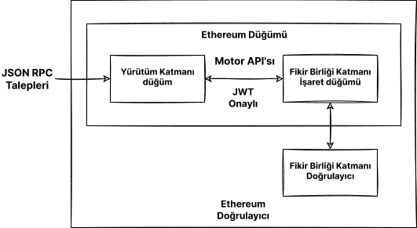

Kendi düğümünüzü (node) çalıştırmak size çeşitli avantajlar sağlar, yeni olasılıkların kapısını açar ve ekosistemi desteklemeye yardımcı olur. Bu sayfa, kendi düğümünüzü çalıştırmanız ve [Ethereum](/) işlemlerini doğrulamada yer almanız için size rehberlik edecektir.

[Birleşme](/roadmap/merge)'den sonra bir Ethereum düğümünü çalıştırmak için iki istemcinin gerekli olduğunu unutmayın; bir **yürütme katmanı (EL)** istemcisi ve bir **mutabakat katmanı (CL)** istemcisi. Bu sayfa, bir Ethereum düğümünü çalıştırmak için bu iki istemcinin nasıl kurulacağını, yapılandırılacağını ve bağlanacağını gösterecektir.

## Ön koşullar {#prerequisites}

Bir Ethereum düğümünün ne olduğunu ve neden bir istemci çalıştırmak isteyebileceğinizi anlamalısınız. Bu konu [Düğümler ve istemciler](/developers/docs/nodes-and-clients/) bölümünde ele alınmıştır.

Düğüm çalıştırma konusuna yeniyseniz veya daha az teknik bir yol arıyorsanız, öncelikle [bir Ethereum düğümü çalıştırma](/run-a-node) hakkındaki kullanıcı dostu giriş bölümümüze göz atmanızı öneririz.

## Bir yaklaşım seçmek {#choosing-approach}

Düğümünüzü çalıştırmanın ilk adımı yaklaşımınızı seçmektir. Gereksinimlere ve çeşitli olasılıklara dayanarak, istemci uygulamasını (hem yürütme hem de fikir birliği istemcileri için), ortamı (donanım, sistem) ve istemci ayarları için parametreleri seçmelisiniz.

Bu sayfa, bu kararlarda size rehberlik edecek ve Ethereum örneğinizi çalıştırmanın en uygun yolunu bulmanıza yardımcı olacaktır.

İstemci uygulamaları arasından seçim yapmak için, mevcut tüm Ana Ağ'a hazır [yürütme istemcilerini](/developers/docs/nodes-and-clients/#execution-clients), [fikir birliği istemcilerini](/developers/docs/nodes-and-clients/#consensus-clients) görün ve [istemci çeşitliliği](/developers/docs/nodes-and-clients/client-diversity) hakkında bilgi edinin.

İstemcilerin [gereksinimlerini](#requirements) göz önünde bulundurarak, yazılımı kendi [donanımınızda mı yoksa bulutta mı](#local-vs-cloud) çalıştıracağınıza karar verin.

Ortamı hazırladıktan sonra, seçilen istemcileri [yeni başlayanlar için uygun bir arayüzle](#automatized-setup) veya gelişmiş seçeneklere sahip bir terminal kullanarak [manuel olarak](#manual-setup) kurun.

Düğüm çalışırken ve eşzamanlama yaparken, onu [kullanmaya](#using-the-node) hazırsınız demektir, ancak [bakımına](#operating-the-node) dikkat ettiğinizden emin olun.



### Ortam ve donanım {#environment-and-hardware}

#### Yerel veya bulut {#local-vs-cloud}

Ethereum istemcileri tüketici sınıfı bilgisayarlarda çalışabilir ve örneğin madencilik makineleri gibi özel bir donanım gerektirmez. Bu nedenle, ihtiyaçlarınıza göre düğümü dağıtmak için çeşitli seçenekleriniz vardır.
Basitleştirmek gerekirse, bir düğümü hem yerel bir fiziksel makinede hem de bir bulut sunucusunda çalıştırmayı düşünelim:

- Bulut
  - Sağlayıcılar yüksek sunucu çalışma süresi ve statik genel IP adresleri sunar
  - Özel veya sanal bir sunucu almak, kendinizinkini oluşturmaktan daha rahat olabilir
  - Bunun bedeli üçüncü bir tarafa, yani sunucu sağlayıcısına güvenmektir
  - Tam düğüm için gereken depolama boyutu nedeniyle, kiralanan bir sunucunun fiyatı yüksek olabilir
- Kendi donanımınız
  - Daha güven gerektirmeyen ve bağımsız bir yaklaşım
  - Tek seferlik yatırım
  - Önceden yapılandırılmış makineler satın alma seçeneği
  - Makineyi ve ağı fiziksel olarak hazırlamanız, bakımını yapmanız ve potansiyel olarak sorunlarını gidermeniz gerekir

Her iki seçeneğin de yukarıda özetlenen farklı avantajları vardır. Bir bulut çözümü arıyorsanız, birçok geleneksel bulut bilişim sağlayıcısına ek olarak, düğümleri dağıtmaya odaklanan hizmetler de vardır. Barındırılan düğümler hakkında daha fazla seçenek için [hizmet olarak düğümlere](/developers/docs/nodes-and-clients/nodes-as-a-service/) göz atın.

#### Donanım {#hardware}

Ancak, sansüre dirençli, merkeziyetsiz bir ağ bulut sağlayıcılarına güvenmemelidir. Bunun yerine, düğümünüzü kendi yerel donanımınızda çalıştırmak ekosistem için daha sağlıklıdır. [Tahminler](https://www.ethernodes.org/networkType/cl/Hosting), düğümlerin büyük bir kısmının bulutta çalıştığını gösteriyor ki bu da tek bir hata noktası haline gelebilir.

Ethereum istemcileri bilgisayarınızda, dizüstü bilgisayarınızda, sunucunuzda veya hatta tek kartlı bir bilgisayarda çalışabilir. İstemcileri kişisel bilgisayarınızda çalıştırmak mümkün olsa da, yalnızca düğümünüz için özel bir makineye sahip olmak, birincil bilgisayarınız üzerindeki etkiyi en aza indirirken performansını ve güvenliğini önemli ölçüde artırabilir.

Kendi donanımınızı kullanmak çok kolay olabilir. Daha teknik kişiler için gelişmiş kurulumların yanı sıra birçok basit seçenek de vardır. Öyleyse, makinenizde Ethereum istemcilerini çalıştırmak için gereksinimlere ve araçlara bakalım.

#### Gereksinimler {#requirements}

Donanım gereksinimleri istemciye göre değişir ancak düğümün yalnızca eşzamanlı kalması gerektiğinden genellikle o kadar yüksek değildir. Bunu, çok daha fazla bilgi işlem gücü gerektiren madencilik ile karıştırmayın. Ancak eşzamanlama süresi ve performansı daha güçlü donanımlarla iyileşir.

Herhangi bir istemciyi kurmadan önce, lütfen bilgisayarınızın onu çalıştırmak için yeterli kaynağa sahip olduğundan emin olun. Minimum ve önerilen gereksinimleri aşağıda bulabilirsiniz.

Donanımınız için darboğaz çoğunlukla disk alanıdır. Ethereum Blokzincirini eşzamanlamak çok fazla girdi/çıktı yoğunlukludur ve çok fazla alan gerektirir. Eşzamanlamadan sonra bile yüzlerce GB boş alana sahip bir **katı hal sürücüsüne (SSD)** sahip olmak en iyisidir.

Veritabanının boyutu ve ilk eşzamanlamanın hızı, seçilen istemciye, yapılandırmasına ve [eşzamanlama stratejisine](/developers/docs/nodes-and-clients/#sync-modes) bağlıdır.

Ayrıca internet bağlantınızın bir [bant genişliği sınırı](https://wikipedia.org/wiki/Data_cap) ile kısıtlanmadığından emin olun. İlk eşzamanlama ve ağa yayınlanan veriler sınırınızı aşabileceğinden, kotasız bir bağlantı kullanmanız önerilir.

##### İşletim sistemi {#plug-and-play}

Tüm istemciler başlıca işletim sistemlerini destekler - Linux, macOS, Windows. Bu, düğümleri size en uygun işletim sistemine (OS) sahip normal masaüstü veya sunucu makinelerinde çalıştırabileceğiniz anlamına gelir. Olası sorunlardan ve güvenlik açıklarından kaçınmak için işletim sisteminizin güncel olduğundan emin olun.

##### Minimum gereksinimler {#ethereum-on-a-single-board-computer}

- 2+ çekirdekli CPU
- 8 GB RAM
- 2TB SSD
- 10+ MBit/s bant genişliği

##### Önerilen özellikler {#spinning-up-node}

- 4+ çekirdekli hızlı CPU
- 16 GB+ RAM
- 2+TB hızlı SSD
- 25+ MBit/s bant genişliği

Seçtiğiniz eşzamanlama modu ve istemci alan gereksinimlerini etkileyecektir, ancak her bir istemci için ihtiyaç duyacağınız disk alanını aşağıda tahmin ettik.

| İstemci    | Disk boyutu (snap eşzamanlama) | Disk boyutu (tam arşiv) |
| ---------- | ------------------------------ | ----------------------- |
| Besu       | 800GB+                         | 12TB+                   |
| Erigon     | Yok                            | 2.5TB+                  |
| Geth       | 500GB+                         | 12TB+                   |
| Nethermind | 500GB+                         | 12TB+                   |
| Reth       | Yok                            | 2.2TB+                  |

- Not: Erigon ve Reth snap eşzamanlama sunmaz, ancak Tam Budama (Full Pruning) mümkündür (Erigon için ~2TB, Reth için ~1.2TB)

Fikir birliği istemcileri için alan gereksinimi ayrıca istemci uygulamasına ve etkinleştirilen özelliklere (örneğin, doğrulayıcı kesici) bağlıdır, ancak genel olarak işaret verileri için gereken ek 200GB'ı hesaba katın. Çok sayıda doğrulayıcı ile bant genişliği yükü de artar. [Fikir birliği istemcisi gereksinimleriyle ilgili ayrıntıları bu analizde](https://mirror.xyz/0x934e6B4D7eee305F8C9C42b46D6EEA09CcFd5EDc/b69LBy8p5UhcGJqUAmT22dpvdkU-Pulg2inrhoS9Mbc) bulabilirsiniz.

#### Tak ve çalıştır çözümleri {#automatized-setup}

Kendi donanımınızla bir düğüm çalıştırmanın en kolay seçeneği tak ve çalıştır kutuları kullanmaktır. Satıcılardan alınan önceden yapılandırılmış makineler en basit deneyimi sunar: sipariş verin, bağlayın, çalıştırın. Her şey önceden yapılandırılmıştır ve yazılımı izlemek ve kontrol etmek için sezgisel bir kılavuz ve kontrol paneli ile otomatik olarak çalışır.

- [DappNode](https://dappnode.io/)
- [Avado](https://ava.do/)

#### Tek kartlı bir bilgisayarda Ethereum {#manual-setup}

Bir Ethereum düğümünü çalıştırmanın kolay ve ucuz bir yolu, Raspberry Pi gibi bir ARM mimarisine sahip olsa bile tek kartlı bir bilgisayar kullanmaktır. [ARM üzerinde Ethereum](https://ethereum-on-arm-documentation.readthedocs.io/en/latest/), Raspberry Pi ve diğer ARM kartları için birden fazla yürütme ve fikir birliği istemcisinin çalıştırılması kolay imajlarını sağlar.

Bunlar gibi küçük, uygun fiyatlı ve verimli cihazlar evde bir düğüm çalıştırmak için idealdir ancak sınırlı performanslarını aklınızda bulundurun.

## Düğümü çalıştırmak {#getting-the-client}

Gerçek istemci kurulumu, otomatik başlatıcılarla veya istemci yazılımını doğrudan kurarak manuel olarak yapılabilir.

Daha az gelişmiş kullanıcılar için önerilen yaklaşım, kurulum boyunca size rehberlik eden ve istemci kurulum sürecini otomatikleştiren bir yazılım olan bir başlatıcı kullanmaktır. Ancak, terminal kullanma konusunda biraz deneyiminiz varsa, manuel kurulum adımlarını takip etmek basit olacaktır.

### Rehberli kurulum {#client-setup}

Birden fazla kullanıcı dostu proje, bir istemci kurma deneyimini iyileştirmeyi amaçlamaktadır. Bu başlatıcılar otomatik istemci kurulumu ve yapılandırması sağlar, hatta bazıları rehberli kurulum ve istemcilerin izlenmesi için grafiksel bir arayüz sunar.

Aşağıda, sadece birkaç tıklamayla istemcileri kurmanıza ve kontrol etmenize yardımcı olabilecek birkaç proje bulunmaktadır:

- [DappNode](https://docs.dappnode.io/docs/user/getting-started/choose-your-path) - DappNode yalnızca bir satıcıdan alınan bir makineyle gelmez. Yazılım, asıl düğüm başlatıcısı ve birçok özelliğe sahip kontrol merkezi herhangi bir donanımda kullanılabilir.
- [EthPillar](https://www.coincashew.com/coins/overview-eth/ethpillar) - Tam bir düğüm kurmanın en hızlı ve en kolay yolu. Tek satırlık kurulum aracı ve düğüm yönetimi TUI'si. Ücretsiz. Açık kaynak. Bireysel staker'lar tarafından Ethereum için kamusal mallar. ARM64 ve AMD64 desteği.
- [eth-docker](https://eth-docker.net/) - Kolay ve güvenli staking'e odaklanan Docker kullanarak otomatik kurulum, temel terminal ve Docker bilgisi gerektirir, biraz daha ileri düzey kullanıcılar için önerilir.
- [Stereum](https://stereum-dev.github.io/ethereum-node-web-docs) - Bir GUI kurulum kılavuzu, kontrol merkezi ve diğer birçok özellikle SSH bağlantısı üzerinden uzak bir sunucuya istemci kurmak için başlatıcı.
- [Sedge](https://docs.sedge.nethermind.io/docs/intro) - CLI sihirbazını kullanarak otomatik olarak bir Docker yapılandırması oluşturan düğüm kurulum aracı. Nethermind tarafından Go dilinde yazılmıştır.
- [Chainstack Self-Hosted](https://docs.chainstack.com/docs/self-hosted/introduction) - Kubernetes üzerinde yürütme ve fikir birliği istemcilerini dağıtmak için Web UI ve CLI. Snapshot önyüklemesi ve yerleşik izleme dahildir. Ücretsiz. Chainstack hesabı gerekmez. Chainstack tarafından oluşturulmuştur.

### Manuel istemci kurulumu {#starting-the-execution-client}

Diğer seçenek, istemci yazılımını manuel olarak indirmek, doğrulamak ve yapılandırmaktır. Bazı istemciler grafiksel bir arayüz sunsa bile, manuel kurulum yine de terminal ile temel beceriler gerektirir ancak çok daha fazla çok yönlülük sunar.

Daha önce açıklandığı gibi, kendi Ethereum düğümünüzü kurmak, bir çift fikir birliği ve yürütme istemcisi çalıştırmayı gerektirecektir. Bazı istemciler diğer türden bir hafif istemci içerebilir ve başka bir yazılıma ihtiyaç duymadan eşzamanlama yapabilir. Ancak, tam güven gerektirmeyen doğrulama her iki uygulamayı da gerektirir.

#### İstemci yazılımını edinme {#running-an-execution-client}

İlk olarak, tercih ettiğiniz [yürütme istemcisi](/developers/docs/nodes-and-clients/#execution-clients) ve [fikir birliği istemcisi](/developers/docs/nodes-and-clients/#consensus-clients) yazılımını edinmeniz gerekir.

İşletim sisteminize ve mimarinize uygun çalıştırılabilir bir uygulama veya kurulum paketini kolayca indirebilirsiniz. İndirilen paketlerin imzalarını ve sağlama toplamlarını (checksum) her zaman doğrulayın. Bazı istemciler daha kolay kurulum ve güncellemeler için depolar veya Docker imajları da sunar. İstemcilerin tümü açık kaynaktır, bu nedenle onları kaynaktan da derleyebilirsiniz. Bu daha gelişmiş bir yöntemdir, ancak bazı durumlarda gerekli olabilir.

Her bir istemciyi kurma talimatları, yukarıdaki istemci listelerinde bağlantısı verilen belgelerde sağlanmıştır.

Önceden derlenmiş ikili dosyalarını veya kurulum talimatlarını bulabileceğiniz istemcilerin sürüm sayfaları şunlardır:

##### Yürütme istemcileri {#starting-the-consensus-client}

- [Besu](https://github.com/hyperledger/besu/releases)
- [Erigon](https://github.com/ledgerwatch/erigon/releases)
- [Geth](https://geth.ethereum.org/downloads)
- [Nethermind](https://downloads.nethermind.io/)
- [Reth](https://reth.rs/installation/installation.html)

İstemci çeşitliliğinin [yürütme katmanında bir sorun](/developers/docs/nodes-and-clients/client-diversity/#execution-layer) olduğunu da belirtmekte fayda var. Okuyucuların azınlıkta olan bir yürütme istemcisi çalıştırmayı düşünmeleri önerilir.

##### Fikir birliği istemcileri {#running-a-consensus-client}

- [Lighthouse](https://github.com/sigp/lighthouse/releases/latest)
- [Lodestar](https://chainsafe.github.io/lodestar/run/getting-started/installation#build-from-source/) (Önceden derlenmiş bir ikili dosya sağlamaz, yalnızca bir Docker imajı veya kaynaktan derlenmesi gerekir)
- [Nimbus](https://github.com/status-im/nimbus-eth2/releases/latest)
- [Prysm](https://github.com/prysmaticlabs/prysm/releases/latest)
- [Teku](https://github.com/ConsenSys/teku/releases)

[İstemci çeşitliliği](/developers/docs/nodes-and-clients/client-diversity/), doğrulayıcıları çalıştıran fikir birliği düğümleri için kritik öneme sahiptir. Doğrulayıcıların çoğunluğu tek bir istemci uygulaması çalıştırıyorsa, ağ güvenliği risk altındadır. Bu nedenle azınlıkta olan bir istemci seçmeyi düşünmeniz önerilir.

[En son ağ istemcisi kullanımını görün](https://clientdiversity.org/) ve [istemci çeşitliliği](/developers/docs/nodes-and-clients/client-diversity) hakkında daha fazla bilgi edinin.

##### Yazılımı doğrulama {#adding-validators}

İnternetten yazılım indirirken bütünlüğünü doğrulamanız önerilir. Bu adım isteğe bağlıdır ancak özellikle Ethereum istemcisi gibi çok önemli bir altyapı parçası söz konusu olduğunda, potansiyel saldırı vektörlerinin farkında olmak ve bunlardan kaçınmak önemlidir. Önceden derlenmiş bir ikili dosya indirdiyseniz, ona güvenmeniz ve bir saldırganın çalıştırılabilir dosyayı kötü amaçlı bir dosyayla değiştirebileceği riskini almanız gerekir.

Geliştiriciler, yayınlanan ikili dosyaları PGP anahtarlarıyla imzalarlar, böylece tam olarak onların oluşturduğu yazılımı çalıştırdığınızı kriptografik olarak doğrulayabilirsiniz. Sadece geliştiriciler tarafından kullanılan ve istemci sürüm sayfalarında veya belgelerde bulunabilen açık anahtarları edinmeniz gerekir. İstemci sürümünü ve imzasını indirdikten sonra, bunları kolayca doğrulamak için örneğin [GnuPG](https://gnupg.org/download/index.html) gibi bir PGP uygulaması kullanabilirsiniz. [Linux](https://www.tecmint.com/verify-pgp-signature-downloaded-software/) veya [Windows/macOS](https://freedom.press/training/verifying-open-source-software/) üzerinde `gpg` kullanarak açık kaynaklı yazılımları doğrulama hakkındaki eğitime göz atın.

Doğrulamanın bir başka şekli de, indirdiğiniz yazılımın benzersiz bir kriptografik parmak izi olan hash'inin geliştiriciler tarafından sağlananla eşleştiğinden emin olmaktır. Bu, PGP kullanmaktan bile daha kolaydır ve bazı istemciler yalnızca bu seçeneği sunar. İndirilen yazılım üzerinde hash fonksiyonunu çalıştırmanız ve sürüm sayfasındakiyle karşılaştırmanız yeterlidir. Örneğin:

```sh
sha256sum teku-22.6.1.tar.gz

9b2f8c1f8d4dab0404ce70ea314ff4b3c77e9d27aff9d1e4c1933a5439767dde
```

#### İstemci kurulumu {#using-the-node}

İstemci yazılımını kurduktan, indirdikten veya derledikten sonra çalıştırmaya hazırsınız. Bu sadece uygun yapılandırma ile yürütülmesi gerektiği anlamına gelir. İstemciler, çeşitli özellikleri etkinleştirebilen zengin yapılandırma seçenekleri sunar.

İstemci performansını ve veri kullanımını önemli ölçüde etkileyebilecek seçeneklerle başlayalım. [Eşzamanlama modları](/developers/docs/nodes-and-clients/#sync-modes), Blokzincir verilerini indirme ve doğrulamanın farklı yöntemlerini temsil eder. Düğümü başlatmadan önce, hangi ağı ve eşzamanlama modunu kullanacağınıza karar vermelisiniz. Dikkate alınması gereken en önemli şeyler, istemcinin ihtiyaç duyacağı disk alanı ve eşzamanlama süresidir. Hangi eşzamanlama modunun varsayılan olduğunu belirlemek için istemcinin belgelerine dikkat edin. Bu size uymuyorsa, güvenlik düzeyine, mevcut verilere ve maliyete göre başka bir tane seçin. Eşzamanlama algoritmasının yanı sıra, farklı türdeki eski verilerin budanmasını (pruning) da ayarlayabilirsiniz. Budama, güncel olmayan verilerin silinmesini, yani son bloklardan ulaşılamayan durum ağacı düğümlerinin kaldırılmasını sağlar.

Diğer temel yapılandırma seçenekleri, örneğin bir ağ seçmek (Ana Ağ veya test ağları), RPC veya WebSocket'ler için HTTP uç noktasını etkinleştirmek vb. Tüm özellikleri ve seçenekleri istemcinin belgelerinde bulabilirsiniz. Çeşitli istemci yapılandırmaları, istemciyi doğrudan CLI'da veya yapılandırma dosyasında ilgili bayraklarla (flags) yürüterek ayarlanabilir. Her istemci biraz farklıdır; yapılandırma seçenekleriyle ilgili ayrıntılar için lütfen her zaman resmi belgelerine veya yardım sayfasına başvurun.

Test amacıyla, bir istemciyi test ağı ağlarından birinde çalıştırmayı tercih edebilirsiniz. [Desteklenen ağlara genel bakışı görün](/developers/docs/nodes-and-clients/#execution-clients).

Temel yapılandırma ile yürütme istemcilerini çalıştırma örnekleri bir sonraki bölümde bulunabilir.

#### Yürütme istemcisini başlatma {#reaching-rpc}

Ethereum istemci yazılımını başlatmadan önce, ortamınızın hazır olduğuna dair son bir kontrol yapın. Örneğin, şunlardan emin olun:

- Seçilen ağ ve eşzamanlama modu göz önüne alındığında yeterli disk alanı var.
- Bellek ve CPU diğer programlar tarafından durdurulmuyor.
- İşletim sistemi en son sürüme güncellenmiş.
- Sistem doğru saat ve tarihe sahip.
- Yönlendiriciniz ve güvenlik duvarınız dinleme bağlantı noktalarındaki bağlantıları kabul ediyor. Varsayılan olarak Ethereum istemcileri, her ikisi de varsayılan olarak 30303'te olan bir dinleyici (TCP) bağlantı noktası ve bir keşif (UDP) bağlantı noktası kullanır.

Her şeyin doğru çalıştığından emin olmak için istemcinizi önce bir test ağında çalıştırın.

Başlangıçta varsayılan olmayan tüm istemci ayarlarını bildirmeniz gerekir. Tercih ettiğiniz yapılandırmayı bildirmek için bayrakları veya yapılandırma dosyasını kullanabilirsiniz. Her istemcinin özellik seti ve yapılandırma sözdizimi farklıdır. Ayrıntılar için istemcinizin belgelerine göz atın.

Yürütme ve fikir birliği istemcileri, [Engine API](https://github.com/ethereum/execution-apis/tree/main/src/engine) içinde belirtilen kimliği doğrulanmış bir uç nokta aracılığıyla iletişim kurar. Bir fikir birliği istemcisine bağlanmak için, yürütme istemcisi bilinen bir yolda bir [`jwtsecret`](https://jwt.io/) oluşturmalıdır. Güvenlik ve kararlılık nedenleriyle, istemciler aynı makinede çalışmalıdır ve aralarındaki yerel bir RPC bağlantısının kimliğini doğrulamak için kullanıldığından her iki istemci de bu yolu bilmelidir. Yürütme istemcisi ayrıca kimliği doğrulanmış API'ler için bir dinleme bağlantı noktası tanımlamalıdır.

Bu token, istemci yazılımı tarafından otomatik olarak oluşturulur, ancak bazı durumlarda bunu kendiniz yapmanız gerekebilir. [OpenSSL](https://www.openssl.org/) kullanarak oluşturabilirsiniz:

```sh
openssl rand -hex 32 > jwtsecret
```

#### Bir yürütme istemcisi çalıştırma {#operating-the-node}

Bu bölüm, yürütme istemcilerini başlatma konusunda size rehberlik edecektir. Yalnızca istemciyi şu ayarlarla başlatacak temel bir yapılandırma örneği olarak hizmet eder:

- Bağlanılacak ağı belirtir, örneklerimizde Ana Ağ
  - Kurulumunuzun ön testi için bunun yerine [test ağlarından birini](/developers/docs/networks/) seçebilirsiniz
- Blokzincir dahil tüm verilerin depolanacağı veri dizinini tanımlar
  - Yolu gerçek bir yolla değiştirdiğinizden emin olun, örneğin harici sürücünüze işaret eden bir yol
- İstemci ile iletişim kurmak için arayüzleri etkinleştirir
  - Fikir birliği istemcisi ile iletişim için JSON-RPC ve Engine API dahil
- Kimliği doğrulanmış API için `jwtsecret` yolunu tanımlar
  - Örnek yolu, istemciler tarafından erişilebilen gerçek bir yolla değiştirdiğinizden emin olun, örneğin `/tmp/jwtsecret`

Lütfen bunun sadece temel bir örnek olduğunu, diğer tüm ayarların varsayılana ayarlanacağını unutmayın. Varsayılan değerler, ayarlar ve özellikler hakkında bilgi edinmek için her bir istemcinin belgelerine dikkat edin. Daha fazla özellik için, örneğin doğrulayıcıları çalıştırmak, izlemek vb. için lütfen ilgili istemcinin belgelerine başvurun.

> Örneklerdeki ters eğik çizgilerin `\` yalnızca biçimlendirme amaçlı olduğunu unutmayın; yapılandırma bayrakları tek bir satırda tanımlanabilir.

##### Besu'yu çalıştırma {#keeping-node-online}

Bu örnek Besu'yu Ana Ağ'da başlatır, Blokzincir verilerini varsayılan formatta `/data/ethereum` konumunda depolar, fikir birliği istemcisini bağlamak için JSON-RPC ve Engine RPC'yi etkinleştirir. Engine API'nin kimliği `jwtsecret` token'ı ile doğrulanır ve yalnızca `localhost` adresinden gelen çağrılara izin verilir.

```sh
besu --network=mainnet \
    --data-path=/data/ethereum \
    --rpc-http-enabled=true \
    --engine-rpc-enabled=true \
    --engine-host-allowlist="*" \
    --engine-jwt-enabled=true \
    --engine-jwt-secret=/path/to/jwtsecret
```

Besu ayrıca bir dizi soru soracak ve yapılandırma dosyasını oluşturacak bir başlatıcı seçeneğiyle birlikte gelir. Etkileşimli başlatıcıyı şu şekilde çalıştırın:

```sh
besu --Xlauncher
```

[Besu'nun belgeleri](https://besu.hyperledger.org/public-networks/get-started/start-node/) ek seçenek ve yapılandırma ayrıntıları içerir.

##### Erigon'u çalıştırma {#creating-client-services}

Bu örnek Erigon'u Ana Ağ'da başlatır, Blokzincir verilerini `/data/ethereum` konumunda depolar, JSON-RPC'yi etkinleştirir, hangi ad alanlarına (namespaces) izin verildiğini tanımlar ve `jwtsecret` yolu tarafından tanımlanan fikir birliği istemcisini bağlamak için kimlik doğrulamayı etkinleştirir.

```sh
erigon --chain mainnet \
    --datadir /data/ethereum  \
    --http --http.api=engine,eth,web3,net \
    --authrpc.jwtsecret=/path/to/jwtsecret
```

Erigon varsayılan olarak 8GB HDD ile tam bir eşzamanlama gerçekleştirir ve bu da 2TB'den fazla arşiv verisiyle sonuçlanır. `datadir` dizininin yeterli boş alana sahip bir diski işaret ettiğinden emin olun veya farklı türdeki verileri kırpabilen `--prune` bayrağına bakın. Daha fazla bilgi edinmek için Erigon'un `--help` belgesini kontrol edin.

##### Geth'i çalıştırma {#updating-clients}

Bu örnek Geth'i Ana Ağ'da başlatır, Blokzincir verilerini `/data/ethereum` konumunda depolar, JSON-RPC'yi etkinleştirir ve hangi ad alanlarına izin verildiğini tanımlar. Ayrıca, `jwtsecret` yolunu ve hangi bağlantılara izin verildiğini tanımlayan seçeneği (örneğimizde yalnızca `localhost` adresinden) gerektiren fikir birliği istemcisini bağlamak için kimlik doğrulamayı etkinleştirir.

```sh
geth --mainnet \
    --datadir "/data/ethereum" \
    --http --authrpc.addr localhost \
    --authrpc.vhosts="localhost" \
    --authrpc.port 8551
    --authrpc.jwtsecret=/path/to/jwtsecret
```

[Tüm yapılandırma seçenekleri için belgelere](https://geth.ethereum.org/docs/fundamentals/command-line-options) göz atın ve [Geth'i bir fikir birliği istemcisiyle çalıştırma](https://geth.ethereum.org/docs/getting-started/consensus-clients) hakkında daha fazla bilgi edinin.

##### Nethermind'ı çalıştırma {#running-additional-services}

Nethermind çeşitli [kurulum seçenekleri](https://docs.nethermind.io/get-started/installing-nethermind) sunar. Paket, yapılandırmayı etkileşimli olarak oluşturmanıza yardımcı olacak rehberli bir kuruluma sahip bir Başlatıcı da dahil olmak üzere çeşitli ikili dosyalarla birlikte gelir. Alternatif olarak, çalıştırılabilir dosyanın kendisi olan Runner'ı bulabilir ve onu sadece yapılandırma bayraklarıyla çalıştırabilirsiniz. JSON-RPC varsayılan olarak etkindir.

```sh
Nethermind.Runner --config mainnet \
    --datadir /data/ethereum \
    --JsonRpc.JwtSecretFile=/path/to/jwtsecret
```

Nethermind belgeleri, Nethermind'ı fikir birliği istemcisiyle çalıştırma konusunda [eksiksiz bir kılavuz](https://docs.nethermind.io/get-started/running-node/) sunar.

Bir yürütme istemcisi temel işlevlerini, seçilen uç noktaları başlatacak ve eşler aramaya başlayacaktır. Eşleri başarıyla keşfettikten sonra, istemci eşzamanlamaya başlar. Yürütme istemcisi, fikir birliği istemcisinden bir bağlantı bekleyecektir. İstemci mevcut duruma başarıyla eşzamanlandığında güncel Blokzincir verileri mevcut olacaktır.

##### Reth'i çalıştırma {#monitoring-the-node}

Bu örnek, varsayılan veri konumunu kullanarak Reth'i Ana Ağ'da başlatır. `jwtsecret` yolu tarafından tanımlanan fikir birliği istemcisini bağlamak için JSON-RPC ve Engine RPC kimlik doğrulamasını etkinleştirir ve yalnızca `localhost` adresinden gelen çağrılara izin verilir.

```sh
reth node \
    --authrpc.jwtsecret /path/to/jwtsecret \
    --authrpc.addr 127.0.0.1 \
    --authrpc.port 8551
```

Varsayılan veri dizinleri hakkında daha fazla bilgi edinmek için [Reth'i Yapılandırma](https://reth.rs/run/config.html?highlight=data%20directory#configuring-reth) bölümüne bakın. [Reth'in belgeleri](https://reth.rs/run/mainnet.html) ek seçenekler ve yapılandırma ayrıntıları içerir.

#### Fikir birliği istemcisini başlatma {#further-reading}

Fikir birliği istemcisi, yürütme istemcisine yerel bir RPC bağlantısı kurmak için doğru bağlantı noktası yapılandırmasıyla başlatılmalıdır. Fikir birliği istemcileri, yapılandırma argümanı olarak açığa çıkarılan yürütme istemcisi bağlantı noktasıyla çalıştırılmalıdır.

Fikir birliği istemcisi ayrıca, aralarındaki RPC bağlantısının kimliğini doğrulamak için yürütme istemcisinin `jwt-secret` yoluna ihtiyaç duyar. Yukarıdaki yürütme örneklerine benzer şekilde, her fikir birliği istemcisinin jwt token dosya yolunu argüman olarak alan bir yapılandırma bayrağı vardır. Bu, yürütme istemcisine sağlanan `jwtsecret` yolu ile tutarlı olmalıdır.

Bir doğrulayıcı çalıştırmayı planlıyorsanız, ücret alıcısının Ethereum adresini belirten bir yapılandırma bayrağı eklediğinizden emin olun. Burası, doğrulayıcınız için Ether ödüllerinin biriktiği yerdir. Her fikir birliği istemcisinin, bir Ethereum adresini argüman olarak alan, örneğin `--suggested-fee-recipient=0xabcd1` gibi bir seçeneği vardır.

Bir test ağında bir İşaret Düğümü (Beacon Node) başlatırken, [Kontrol noktası eşzamanlaması](https://notes.ethereum.org/@launchpad/checkpoint-sync) için genel bir uç nokta kullanarak önemli ölçüde eşzamanlama süresinden tasarruf edebilirsiniz.

#### Bir fikir birliği istemcisi çalıştırma {#related-topics}

##### Lighthouse'u çalıştırma

Lighthouse'u çalıştırmadan önce, [Lighthouse Kitabı](https://lighthouse-book.sigmaprime.io/installation.html)'nda nasıl kurulacağı ve yapılandırılacağı hakkında daha fazla bilgi edinin.

```sh
lighthouse beacon_node \
    --network mainnet \
    --datadir /data/ethereum \
    --http \
    --execution-endpoint http://127.0.0.1:8551 \
    --execution-jwt /path/to/jwtsecret
```

##### Lodestar'ı çalıştırma

Lodestar yazılımını derleyerek veya Docker imajını indirerek kurun. [Belgelerde](https://chainsafe.github.io/lodestar/) ve daha kapsamlı [kurulum kılavuzunda](https://hackmd.io/@philknows/rk5cDvKmK) daha fazla bilgi edinin.

```sh
lodestar beacon \
    --dataDir="/data/ethereum" \
    --network=mainnet \
    --eth1.enabled=true \
    --execution.urls="http://127.0.0.1:8551" \
    --jwt-secret="/path/to/jwtsecret"
```

##### Nimbus'u çalıştırma

Nimbus hem fikir birliği hem de yürütme istemcileriyle birlikte gelir. Çok mütevazı bilgi işlem gücüne sahip çeşitli cihazlarda bile çalıştırılabilir.
[Bağımlılıkları ve Nimbus'un kendisini kurduktan](https://nimbus.guide/quick-start.html) sonra, fikir birliği istemcisini çalıştırabilirsiniz:

```sh
nimbus_beacon_node \
    --network=mainnet \
    --web3-url=http://127.0.0.1:8551 \
    --rest \
    --jwt-secret="/path/to/jwtsecret"
```

##### Prysm'i çalıştırma

Prysm, kolay otomatik kuruluma izin veren bir komut dosyasıyla birlikte gelir. Ayrıntılar [Prysm belgelerinde](https://prysm.offchainlabs.com/docs/install-prysm/install-with-script/) bulunabilir.

```sh
./prysm.sh beacon-chain \
    --mainnet \
    --datadir /data/ethereum  \
    --execution-endpoint=http://localhost:8551  \
    --jwt-secret=/path/to/jwtsecret
```

##### Teku'yu çalıştırma

```sh
teku --network mainnet \
    --data-path "/data/ethereum" \
    --ee-endpoint http://localhost:8551 \
    --ee-jwt-secret-file "/path/to/jwtsecret"
```

Bir fikir birliği istemcisi, yatırma sözleşmesini okumak ve doğrulayıcıları tanımlamak için yürütme istemcisine bağlandığında, aynı zamanda diğer İşaret Düğümü eşlerine de bağlanır ve başlangıçtan (genesis) itibaren fikir birliği yuvalarını (slots) eşzamanlamaya başlar. İşaret Düğümü mevcut döneme ulaştığında, İşaret API'si doğrulayıcılarınız için kullanılabilir hale gelir. [İşaret Düğümü API'leri](https://eth2docs.vercel.app/) hakkında daha fazla bilgi edinin.

### Doğrulayıcı Ekleme

Bir fikir birliği istemcisi, doğrulayıcıların bağlanması için bir İşaret Düğümü görevi görür. Her fikir birliği istemcisinin, ilgili belgelerinde ayrıntılı olarak açıklanan kendi doğrulayıcı yazılımı vardır.

Kendi doğrulayıcınızı çalıştırmak, Ethereum ağını desteklemenin en etkili ve güven gerektirmeyen yöntemi olan [bireysel staking](/staking/solo/)'e olanak tanır. Ancak bu, 32 ETH'lik bir yatırma işlemi gerektirir. Kendi düğümünüzde daha küçük bir miktarla bir doğrulayıcı çalıştırmak için, [Rocket Pool](https://rocketpool.net/node-operators) gibi izinsiz düğüm operatörlerine sahip merkeziyetsiz bir havuz ilginizi çekebilir.

Staking ve doğrulayıcı anahtarı oluşturmaya başlamanın en kolay yolu, [Hoodi üzerinde düğümler çalıştırarak](https://notes.ethereum.org/@launchpad/hoodi) kurulumunuzu test etmenize olanak tanıyan [Hoodi Test Ağı Staking Başlatma Serisi](https://hoodi.launchpad.ethereum.org/)'ni kullanmaktır. Ana Ağ için hazır olduğunuzda, [Ana Ağ Staking Başlatma Serisi](https://launchpad.ethereum.org/)'ni kullanarak bu adımları tekrarlayabilirsiniz.

Staking seçeneklerine genel bir bakış için [staking sayfasına](/staking) göz atın.

### Düğümü kullanma

Yürütme istemcileri, Ethereum ağında işlem göndermek, akıllı sözleşmelerle etkileşimde bulunmak veya bunları dağıtmak için çeşitli şekillerde kullanabileceğiniz [RPC API uç noktaları](/developers/docs/apis/json-rpc/) sunar:

- Uygun bir protokolle manuel olarak çağırmak (örneğin, `curl` kullanarak)
- Sağlanan bir konsolu eklemek (örneğin, `geth attach`)
- Web3 kütüphanelerini kullanarak uygulamalarda uygulamak, örneğin [Web3.py](https://web3py.readthedocs.io/en/stable/overview.html#overview), [ethers](https://github.com/ethers-io/ethers.js/)

Farklı istemcilerin RPC uç noktalarının farklı uygulamaları vardır. Ancak her istemciyle kullanabileceğiniz standart bir JSON-RPC vardır. Genel bir bakış için [JSON-RPC belgelerini okuyun](/developers/docs/apis/json-rpc/). Ethereum ağından bilgiye ihtiyaç duyan uygulamalar bu RPC'yi kullanabilir. Örneğin, popüler Cüzdan MetaMask, güçlü gizlilik ve güvenlik avantajlarına sahip olan [kendi RPC uç noktanıza bağlanmanıza](https://metamask.zendesk.com/hc/en-us/articles/360015290012-Using-a-Local-Node) olanak tanır.

Fikir birliği istemcilerinin tümü, fikir birliği istemcisinin durumunu kontrol etmek veya [Curl](https://curl.se) gibi araçları kullanarak istekler göndererek blokları ve fikir birliği verilerini indirmek için kullanılabilecek bir [İşaret API'si](https://ethereum.github.io/beacon-APIs) sunar. Bu konuda daha fazla bilgi her bir fikir birliği istemcisinin belgelerinde bulunabilir.

#### RPC'ye ulaşma

Yürütme istemcisi JSON-RPC için varsayılan bağlantı noktası `8545`'dir ancak yapılandırmadaki yerel uç noktaların bağlantı noktalarını değiştirebilirsiniz. Varsayılan olarak, RPC arayüzüne yalnızca bilgisayarınızın localhost'unda erişilebilir. Uzaktan erişilebilir hale getirmek için, adresi `0.0.0.0` olarak değiştirerek herkese açık hale getirmek isteyebilirsiniz. Bu, yerel ağ ve genel IP adresleri üzerinden erişilebilir olmasını sağlayacaktır. Çoğu durumda yönlendiricinizde bağlantı noktası yönlendirmeyi (port forwarding) de ayarlamanız gerekecektir.

Bağlantı noktalarını internete açmaya dikkatle yaklaşın çünkü bu, internetteki herkesin düğümünüzü kontrol etmesine izin verecektir. Kötü niyetli aktörler, sisteminizi çökertmek veya istemcinizi bir Cüzdan olarak kullanıyorsanız fonlarınızı çalmak için düğümünüze erişebilir.

Bunun bir yolu, potansiyel olarak zararlı RPC yöntemlerinin değiştirilebilir olmasını önlemektir. Örneğin, Geth ile değiştirilebilir yöntemleri bir bayrakla bildirebilirsiniz: `--http.api web3,eth,txpool`.

RPC arayüzüne erişim, uç katman API'lerinin veya Nginx gibi web sunucusu uygulamalarının geliştirilmesi ve bunların istemcinizin yerel adresine ve bağlantı noktasına bağlanması yoluyla genişletilebilir. Bir orta katmandan yararlanmak, geliştiricilere RPC arayüzüne güvenli `https` bağlantıları için bir sertifika ayarlama yeteneği de sağlayabilir.

Bir web sunucusu, bir proxy veya dışa dönük Rest API kurmak, düğümünüzün RPC uç noktasına erişim sağlamanın tek yolu değildir. Herkese açık olarak ulaşılabilir bir uç nokta kurmanın gizliliği koruyan bir başka yolu da düğümü kendi [Tor](https://www.torproject.org/) onion hizmetinizde barındırmaktır. Bu, statik bir genel IP adresi veya açılmış bağlantı noktaları olmadan yerel ağınızın dışındaki RPC'ye ulaşmanızı sağlayacaktır. Ancak, bu yapılandırmayı kullanmak RPC uç noktasının yalnızca tüm uygulamalar tarafından desteklenmeyen ve bağlantı sorunlarına yol açabilecek Tor ağı üzerinden erişilebilir olmasına izin verebilir.

Bunu yapmak için kendi [onion hizmetinizi](https://community.torproject.org/onion-services/) oluşturmanız gerekir. Kendinizinkini barındırmak için onion hizmeti kurulumu hakkındaki [belgelere](https://community.torproject.org/onion-services/setup/) göz atın. Bunu RPC bağlantı noktasına proxy'si olan bir web sunucusuna veya doğrudan RPC'ye yönlendirebilirsiniz.

Son olarak ve dahili ağlara erişim sağlamanın en popüler yollarından biri VPN bağlantısıdır. Kullanım durumunuza ve düğümünüze erişmesi gereken kullanıcı sayısına bağlı olarak, güvenli bir VPN bağlantısı bir seçenek olabilir. [OpenVPN](https://openvpn.net/), endüstri standardı SSL/TLS protokolünü kullanarak OSI katman 2 veya 3 güvenli ağ uzantısını uygulayan, sertifikalara, akıllı kartlara ve/veya kullanıcı adı/parola kimlik bilgilerine dayalı esnek istemci kimlik doğrulama yöntemlerini destekleyen ve VPN sanal arayüzüne uygulanan güvenlik duvarı kurallarını kullanarak kullanıcıya veya gruba özel erişim kontrol politikalarına izin veren tam özellikli bir SSL VPN'dir.

### Düğümü işletme

Düzgün çalıştığından emin olmak için düğümünüzü düzenli olarak izlemelisiniz. Ara sıra bakım yapmanız gerekebilir.

#### Bir düğümü çevrimiçi tutma

Düğümünüzün her zaman çevrimiçi olması gerekmez, ancak ağ ile eşzamanlı kalması için mümkün olduğunca çevrimiçi tutmalısınız. Yeniden başlatmak için kapatabilirsiniz, ancak şunları aklınızda bulundurun:

- Son durum hala diske yazılıyorsa kapatma işlemi birkaç dakika sürebilir.
- Zorla kapatmalar veritabanına zarar vererek tüm düğümü yeniden eşzamanlamanızı gerektirebilir.
- İstemciniz ağ ile eşzamanlamasını kaybedecek ve yeniden başlattığınızda yeniden eşzamanlanması gerekecektir. Düğüm en son kapatıldığı yerden eşzamanlamaya başlayabilse de, bu işlem ne kadar süredir çevrimdışı olduğuna bağlı olarak zaman alabilir.

_Bu, mutabakat katmanı doğrulayıcı düğümleri için geçerli değildir._ Düğümünüzü çevrimdışı duruma getirmek, ona bağlı tüm hizmetleri etkileyecektir. _Staking_ amacıyla bir düğüm çalıştırıyorsanız, kesinti süresini mümkün olduğunca en aza indirmeye çalışmalısınız.

#### İstemci hizmetleri oluşturma

İstemcilerinizi başlangıçta otomatik olarak çalıştırmak için bir hizmet oluşturmayı düşünün. Örneğin, Linux sunucularında iyi bir uygulama, örneğin `systemd` ile, istemciyi uygun yapılandırmayla, sınırlı ayrıcalıklara sahip bir kullanıcı altında yürüten ve otomatik olarak yeniden başlatan bir hizmet oluşturmak olacaktır.

#### İstemcileri güncelleme

İstemci yazılımınızı en son güvenlik yamaları, özellikler ve [EIP'ler](/eips/) ile güncel tutmanız gerekir. Özellikle [sert çatallanmalardan (hard forks)](/ethereum-forks/) önce, doğru istemci sürümlerini çalıştırdığınızdan emin olun.

> Önemli ağ güncellemelerinden önce EF, [blogunda](https://blog.ethereum.org) bir gönderi yayınlar. Düğümünüzün bir güncellemeye ihtiyacı olduğunda postanıza bir bildirim almak için [bu duyurulara abone olabilirsiniz](https://blog.ethereum.org/category/protocol#subscribe).

İstemcileri güncellemek çok basittir. Her istemcinin belgelerinde özel talimatlar vardır, ancak süreç genellikle yalnızca en son sürümü indirmek ve istemciyi yeni çalıştırılabilir dosyayla yeniden başlatmaktır. İstemci, güncellemeler uygulanmış olarak kaldığı yerden devam etmelidir.

Her istemci uygulamasının, eşler arası protokolde kullanılan ancak komut satırından da erişilebilen, insanlar tarafından okunabilir bir sürüm dizesi vardır. Bu sürüm dizesi, kullanıcıların doğru sürümü çalıştırdıklarını kontrol etmelerini sağlar ve belirli istemcilerin ağ üzerindeki dağılımını ölçmekle ilgilenen blok gezginlerine ve diğer analitik araçlara olanak tanır. Sürüm dizeleri hakkında daha fazla bilgi için lütfen ilgili istemci belgelerine başvurun.

#### Ek hizmetler çalıştırma

Kendi düğümünüzü çalıştırmak, Ethereum istemcisi RPC'sine doğrudan erişim gerektiren hizmetleri kullanmanıza olanak tanır. Bunlar, [katman 2 (l2) çözümleri](/developers/docs/scaling/#layer-2-scaling), cüzdanlar için arka uç, blok gezginleri, geliştirici araçları ve diğer Ethereum altyapısı gibi Ethereum üzerine inşa edilmiş hizmetlerdir.

#### Düğümü izleme

Düğümünüzü düzgün bir şekilde izlemek için metrikleri toplamayı düşünün. İstemciler, düğümünüz hakkında kapsamlı veriler alabilmeniz için metrik uç noktaları sağlar. [Grafana](https://grafana.com/) gibi yazılımlarda görselleştirmelere ve grafiklere dönüştürebileceğiniz veritabanları oluşturmak için [InfluxDB](https://www.influxdata.com/get-influxdb/) veya [Prometheus](https://prometheus.io/) gibi araçları kullanın. Bu yazılımı kullanmak için birçok kurulum ve düğümünüzü ve bir bütün olarak ağı görselleştirmeniz için farklı Grafana kontrol panelleri vardır. Örneğin, [Geth'i izleme eğitimine](/developers/tutorials/monitoring-geth-with-influxdb-and-grafana/) göz atın.

İzlemenizin bir parçası olarak, makinenizin performansına göz kulak olduğunuzdan emin olun. Düğümünüzün ilk eşzamanlaması sırasında, istemci yazılımı CPU ve RAM üzerinde çok ağır olabilir. Grafana'ya ek olarak, bunu yapmak için işletim sisteminizin sunduğu `htop` veya `uptime` gibi araçları kullanabilirsiniz.

## Daha fazla bilgi

- [Ethereum Staking Kılavuzları](https://github.com/SomerEsat/ethereum-staking-guides) - _Somer Esat, sık sık güncellenir_
- [Kılavuz | Ana ağda Ethereum staking için bir doğrulayıcı nasıl kurulur](https://www.coincashew.com/coins/overview-eth/guide-or-how-to-setup-a-validator-on-eth2-mainnet) _– CoinCashew, sık sık güncellenir_
- [Test ağlarında doğrulayıcı çalıştırma üzerine ETHStaker kılavuzları](https://github.com/remyroy/ethstaker#guides) – _ETHStaker, düzenli olarak güncellenir_
- [Ethereum Düğümleri için Örnek AWS Blokzincir Düğüm Çalıştırıcı uygulaması](https://aws-samples.github.io/aws-blockchain-node-runners/docs/Blueprints/Ethereum) - _AWS, sık sık güncellenir_
- [Düğüm operatörleri için Birleşme SSS](https://notes.ethereum.org/@launchpad/node-faq-merge) - _Temmuz 2022_
- [Tam doğrulanmış bir Ethereum düğümü olmak için donanım gereksinimlerini analiz etme](https://medium.com/coinmonks/analyzing-the-hardware-requirements-to-be-an-ethereum-full-validated-node-dc064f167902) _– Albert Palau, 24 Eylül 2018_
- [Ethereum Tam Düğümlerini Çalıştırmak: Zar Zor Motive Olanlar İçin Bir Kılavuz](https://medium.com/@JustinMLeroux/running-ethereum-full-nodes-a-guide-for-the-barely-motivated-a8a13e7a0d31) _– Justin Leroux, 7 Kasım 2019_
- [Ethereum Ana Ağında Bir Hyperledger Besu Düğümü Çalıştırmak: Faydalar, Gereksinimler ve Kurulum](https://pegasys.tech/running-a-hyperledger-besu-node-on-the-ethereum-mainnet-benefits-requirements-and-setup/) _– Felipe Faraggi, 7 Mayıs 2020_
- [İzleme Yığını ile Nethermind Ethereum İstemcisini Dağıtma](https://medium.com/nethermind-eth/deploying-nethermind-ethereum-client-with-monitoring-stack-55ce1622edbd) _– Nethermind.eth, 8 Temmuz 2020_

## İlgili konular

- [Düğümler ve istemciler](/developers/docs/nodes-and-clients/)
- [Bloklar](/developers/docs/blocks/)
- [Ağlar](/developers/docs/networks/)