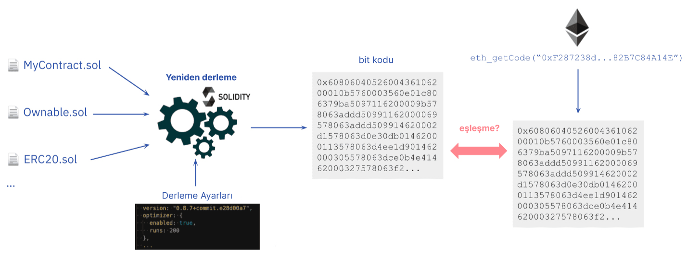

[Akıllı sözleşmeler](/developers/docs/smart-contracts/) "güven gerektirmez" nitelikte tasarlanmışlardır, yani kullanıcıların bir sözleşme ile etkileşime geçmeden önce üçüncü şahıslara (örn. geliştiriciler ve şirketler) güvenmelerine gerek yoktur. Güven gerektirmezliğin bir ön koşulu olarak kullanıcılar ve diğer geliştiriciler, bir akıllı sözleşmenin kaynak kodunu doğrulayabilmelidir. Kaynak kodu doğrulaması, kullanıcılara ve geliştiricilere yayımlanmış sözleşme kodunun Ethereum blokzinciri üzerindeki sözleşme adresinde çalışan kod ile aynı kod olduğunu garanti eder.

"Kaynak kodu doğrulaması" ile "[resmi doğrulama](/developers/docs/smart-contracts/formal-verification/)" arasındaki ayrımı yapmak önemlidir. Aşağıda ayrıntılı olarak açıklanacak olan kaynak kodu doğrulaması, bir akıllı sözleşmenin üst düzey bir dildeki (ör. Solidity) belirli kaynak kodunun, sözleşme adresinde yürütülecek olan aynı bit koduna derlendiğinin doğrulanması anlamına gelir. Ancak resmi doğrulama, akıllı sözleşmenin doğruluğunun teyit edilmesini, yani sözleşmenin beklendiği gibi davranmasını açıklar. Bağlama göre değişse de, sözleşme doğrulaması genelde kaynak kodu doğrulaması anlamına gelir.

## Kaynak kodu doğrulaması nedir? {#what-is-source-code-verification}

Bir akıllı sözleşmeyi [Ethereum Sanal Makinesi (EVM)](/developers/docs/evm/) üzerinde dağıtmadan önce, geliştiriciler sözleşmenin kaynak kodunu ([Solidity](/developers/docs/smart-contracts/languages/) veya başka bir üst düzey programlama dilinde yazılmış talimatları) [derleyerek](/developers/docs/smart-contracts/compiling/) bit koduna dönüştürür. Ethereum Sanal Makinesi yüksek seviye talimatları yorumlayamayacağı için kaynak kodunu bit koduna (yani düşük seviye, makine talimatları) derlemek, sözleşme mantığını Ethereum Sanal Makinesi'nde yürütmek için şarttır.

Kaynak kodu doğrulaması, sözleşme oluşturma sırasında farklılıkları ortaya çıkarmak için kullanmak üzere sözleşmenin kaynak kodu ile derlenmiş bit kodunu karşılaştırmaktır. Akıllı sözleşmeleri doğrulamak, reklamı yapılan sözleşme kodu blokzincirde çalışmakta olandan farklı olabileceği için önemlidir.

Akıllı sözleşme doğrulaması, bir sözleşmenin yazıldığı yüksek seviye dilde ne yaptığını, makine kodunu okumadan incelemeye olanak sağlar. Fonksiyonlar, değerler ve genelde değişken adları ile yorumlar, derlenen ve dağıtılan orijinal kaynak koduyla aynı kalır. Bu, kodu okumayı çok daha kolay kılar. Kaynak doğrulaması, kod dokümanları için de hazırlık yapar, bu sayede son kullanıcılar bir akıllı sözleşmenin ne yapmak üzere tasarlandığını bilir.

### Tam doğrulama nedir? {#full-verification}

Kaynak kodunun, yorumlar ve değişken adları gibi derlenmiş bit kodunu etkilemeyen bazı bölümleri vardır. Bu, farklı değişken adları ve farklı yorumları olan iki kaynak kodunun aynı sözleşmeyi doğrulayabileceği anlamına gelir. Bu sayede, kötü niyetli bir kişi kaynak kodunun içine aldatıcı yorumlar ekleyip ya da yanlış yönlendiren değişken adları verip sözleşmenin orijinal kaynak kodundan farklı bir kaynak koduyla doğrulanmasını sağlayabilir.

Bunu, kaynak kodunun doğruluğu için _kriptografik bir güvence_ ve derleme bilgilerinin _parmak izi_ olarak hizmet etmesi amacıyla bit koduna ek veri ekleyerek önlemek mümkündür. Gerekli bilgiler [Solidity'nin sözleşme meta verilerinde](https://docs.soliditylang.org/en/v0.8.15/metadata.html) bulunur ve bu dosyanın karması, bir sözleşmenin bit koduna eklenir. Bunu [meta veri oyun alanında](https://playground.sourcify.dev) çalışırken görebilirsiniz

Meta veri dosyası, sözleşmenin derlemesiyle ilgili kaynak kodları ve bu kodların karmalarını da içeren bilgiler barındırır. Yani bir derleme ayarı ya da kaynak dosyalarında bir bayt bile değişse, meta veri dosyası da değişecektir. Sonuç olarak, bit koduna iliştirilmiş olan meta veri dosyasının karması da değişir. Bir sözleşmenin bit kodu + iliştirilmiş meta veri karması verilen kaynak kodu ve derleme ayarlarıyla eşleşiyorsa, bunun orijinal derlemede kullanılan kaynak koduyla tamamen aynı olduğundan ve tek bir baytın bile farklı olmadığından emin olabiliriz.

Meta veri karmasından yararlanan bu tür doğrulamaya **"[tam doğrulama](https://docs.sourcify.dev/docs/full-vs-partial-match/)"** (ayrıca "mükemmel doğrulama") adı verilir. Meta veri karmaları eşleşmiyorsa ya da doğrulamada dikkate alınmıyorsa buna, şu anda sözleşmeleri doğrulamanın daha yaygın yolu olan "kısmi eşleşme" denir. Tam doğrulama olmadan, doğrulanmış kaynak kodunda görünmeyecek [kötü niyetli kod eklemek](https://samczsun.com/hiding-in-plain-sight/) mümkündür. Çoğu geliştirici tam doğrulamadan haberdar değildir ve derlemelerinin meta veri dosyasını tutmaz; bu yüzden kısmi doğrulama şimdiye kadar sözleşmeleri doğrulamada kullanılan genel geçer yöntem olmuştur.

## Kaynak kodu doğrulaması neden önemlidir? {#importance-of-source-code-verification}

### Güven Gerektirmeme {#trustlessness}

Güven gerektirmeme, tartışmasız bir şekilde akıllı sözleşmelerin ve [merkeziyetsiz uygulamaların (dapp'ler)](/developers/docs/dapps/) en büyük önermesidir. Akıllı sözleşmeler "değiştirilemez" niteliktedir; bir sözleşme, yalnızca dağıtım sırasında kodda tanımlanmış olan iş mantığını uygular. Bu, geliştiricilerin ve işletmelerin Ethereum'da dağıtıldıktan sonra bir sözleşmenin kodunun üzerinde oynama yapamayacakları anlamına gelir.

Bir sözleşmenin güven gerektirmez olması için sözleşme kodunun bağımsız doğrulamaya açık olması gerekir. Her akıllı sözleşmenin derlenmiş bit kodu blokzincirde herkese açık bir şekilde mevcut olsa da, hem geliştiriciler hem de kullanıcılar için alt düzey dilin anlaşılması zordur.

Projeler, sözleşmelerinin kaynak kodunu yayımlayarak güven varsayımlarını azaltır. Fakat bu başka bir probleme yol açar: Yayımlanan kaynak kodunun, sözleşme bit kodu ile aynı olduğunu doğrulamak zordur. Bu senaryoda, güven gerektirmezliğin değeri kaybolur. Çünkü kullanıcıların, geliştiricilerin blokzincirde dağıtmadan önce sözleşmenin iş mantığını değiştirmeyeceklerine (bit kodunu değiştirerek) güvenmeleri gerekir.

Kaynak kodu doğrulama araçları, bir akıllı sözleşmenin kaynak kodunun derleme koduyla eşleştiğine dair güvenceler sağlar. Sonuç, kullanıcıların üçüncü taraflara körü körüne güvenmediği ve bunun yerine bir sözleşmeye para yatırmadan önce kodu doğruladıkları güven gerektirmez bir ekosistemdir.

### Kullanıcı Güvenliği {#user-safety}

Akıllı sözleşmeler söz konusu olduğunda ortadaki para miktarı oldukça yüksektir. Bu, daha yüksek güvenlik garantileri ve kullanmadan önce akıllı sözleşmenin mantığının doğrulanmasını gerektirir. Sorun şu ki, ahlaki endişelere sahip olmayan bazı geliştiriciler akıllı sözleşmelerin içine kötü niyetli kod ekleyerek kullanıcıları kandırabilirler. Doğrulama olmadan, kötü niyetli akıllı sözleşmelerin [arka kapıları](https://www.trustnodes.com/2018/11/10/concerns-rise-over-backdoored-smart-contracts), tartışmalı erişim kontrol mekanizmaları, istismar edilebilir güvenlik açıkları ve kullanıcı güvenliğini tehlikeye atacak fark edilmeyecek başka şeyler olabilir.

Bir akıllı sözleşmenin kaynak kod dosyalarının yayımlanması, denetçiler gibi konuyla ilgili olanların sözleşmeyi potansiyel saldırı vektörleri açısından değerlendirmesini daha kolay hale getirir. Bir akıllı sözleşmeyi birden fazla tarafın doğrulaması sayesinde kullanıcılar daha güçlü güvencelere sahip olur.

## Ethereum akıllı sözleşmeleri için kaynak kodu nasıl doğrulanır {#source-code-verification-for-ethereum-smart-contracts}

[Ethereum'da bir akıllı sözleşmeyi dağıtmak](/developers/docs/smart-contracts/deploying/), özel bir adrese veri yükü (derlenmiş bit kodu) olan bir işlem göndermeyi gerektirir. Veri yükü, kaynak kodunun derlenmesiyle ve sözleşme örneğinin [yapıcı argümanlarının](https://docs.soliditylang.org/en/v0.8.14/contracts.html#constructor) işlemdeki veri yüküne eklenmesiyle oluşturulur. Derleme deterministiktir, yani aynı kaynak dosyaları ve derleme ayarları (ör. derleyici sürümü, iyileştirici) kullanılırsa, her zaman aynı çıktıyı (yani sözleşme bit kodunu) üretir.

Akıllı sözleşmeyi doğrulamanın temel adımları aşağıdaki gibidir:

1. Kaynak dosyaları ve derleme ayarları derleyiciye girilir.

2. Derleyici, sözleşmenin bit kodunu çıktı olarak verir.

3. Belirlenen adreste dağıtılmış sözleşmenin bit kodu alınır.

4. Dağıtılan bit kodu ile yeniden derlenen bit kodu karşılaştırılır. Kodlar eşleşiyorsa sözleşme, belirlenen kaynak kodu ve derleme ayarlarıyla doğrulanır.

5. Ek olarak, bit kodu eşleşmesi sonundaki meta veri karmaları eşleşiyorsa tam eşleşme söz konusu olur.

Bunun, doğrulamanın basitleştirilmiş bir açıklaması olduğunu ve [değişmez değişkenlere](https://docs.sourcify.dev/docs/immutables/) sahip olmak gibi bununla çalışmayacak birçok istisna bulunduğunu unutmayın.

## Kaynak kodu doğrulama araçları {#source-code-verification-tools}

Sözleşme doğrulamanın geleneksel süreci karmaşık olabilir. İşte bu nedenle, Ethereum'da dağıtılmış akıllı sözleşmelerin kaynak kodunu doğrulamaya yarayan araçlara sahibiz. Bu araçlar, kullanıcı yararına kaynak kodu doğrulamasının büyük kısmını otomatikleştirir ve doğrulanmış sözleşmeleri derler.

### Etherscan {#etherscan}

Çoğunlukla bir [Ethereum blokzincir gezgini](/developers/docs/data-and-analytics/block-explorers/) olarak bilinmesine rağmen Etherscan, akıllı sözleşme geliştiricileri ve kullanıcıları için bir [kaynak kodu doğrulama hizmeti](https://etherscan.io/verifyContract) de sunar.

Etherscan, sözleşme bit kodunu orijinal veri yükünden (kaynak kodu, kütüphane adresi, derleyici ayarları, sözleşme adresi vb.) yeniden derlemenize olanak sağlar. Yeniden derlenen bit kodu, zincir üstü sözleşmenin bit kodu (ve yapıcı parametreleri) ile ilişkilendirilirse, [sözleşme doğrulanır](https://info.etherscan.com/types-of-contract-verification/).

Doğrulandıktan sonra, sözleşmenizin kaynak kodu bir "Doğrulandı" etiketi alır ve başkalarının denetlemesi için Etherscan'de yayınlanır. Ayrıca, doğrulanmış kaynak kodlarına sahip akıllı sözleşmelerin bir deposu olan [Doğrulanmış Sözleşmeler](https://etherscan.io/contractsVerified/) bölümüne de eklenir.

Etherscan, sözleşmeleri doğrulamak için en çok kullanılan araçtır. Ancak Etherscan'in sözleşme doğrulamasının bir dezavantajı vardır: zincir üstü bit kodunun ve yeniden derlenmiş bit kodunun **meta veri karmasını** karşılaştırmada başarısız olur. Bundan dolayı Etherscan'deki eşleşmeler kısmi eşleşmelerdir.

[Etherscan'de sözleşmeleri doğrulama hakkında daha fazlası](https://medium.com/etherscan-blog/verifying-contracts-on-etherscan-f995ab772327).

### Blockscout {#blockscout}

[Blockscout](https://blockscout.com/), akıllı sözleşme geliştiricileri ve kullanıcıları için bir [sözleşme doğrulama hizmeti](https://eth.blockscout.com/contract-verification) de sunan açık kaynaklı bir blokzincir gezginidir. Açık kaynaklı bir alternatif olarak Blockscout, doğrulamanın nasıl yapıldığı konusunda şeffaflık sunar ve doğrulama sürecini iyileştirmek için topluluk katkılarına olanak tanır.

Diğer doğrulama hizmetlerine benzer şekilde Blockscout, bit kodunu yeniden derleyerek ve dağıtılmış sözleşmeyle karşılaştırarak sözleşmenizin kaynak kodunu doğrulamanıza olanak tanır. Doğrulandıktan sonra, sözleşmeniz doğrulama durumu alır ve kaynak kodu denetim ve etkileşim için herkese açık hale gelir. Doğrulanmış sözleşmeler ayrıca, kolay gezinme ve keşif için Blockscout'un [doğrulanmış sözleşmeler deposunda](https://eth.blockscout.com/verified-contracts) listelenir.

### Sourcify {#sourcify}

[Sourcify](https://sourcify.dev/#/verifier), sözleşmeleri doğrulamak için kullanılan, açık kaynaklı ve merkeziyetsiz başka bir araçtır. Bir blok gezgini değildir ve yalnızca [farklı EVM tabanlı ağlardaki](https://docs.sourcify.dev/docs/chains) sözleşmeleri doğrular. Diğer araçların üzerine inşa edilebileceği halka açık bir altyapı görevi görür ve meta veri dosyasında bulunan [ABI](/developers/docs/smart-contracts/compiling/#web-applications) ve [NatSpec](https://docs.soliditylang.org/en/v0.8.15/natspec-format.html) yorumlarını kullanarak daha insan dostu sözleşme etkileşimleri sağlamayı amaçlar.

Sourcify, Etherscan'den farklı olarak meta veri karmasıyla tam eşleşmeleri destekler. Doğrulanmış sözleşmeler, merkeziyetsiz, [içerik adresli](https://docs.storacha.network/concepts/content-addressing/) bir depolama olan HTTP ve [IPFS](https://docs.ipfs.io/concepts/what-is-ipfs/#what-is-ipfs) üzerindeki [genel deposunda](https://docs.sourcify.dev/docs/repository/) sunulur. Bu, eklenen meta veri karması bir IPFS karması olduğu için bir sözleşmenin meta verilerinin IPSF üzerinden alınmasına olanak sağlar.

Ek olarak, bu dosyaların IPFS karmaları meta veride de bulunduğu için kaynak kod dosyaları IPFS üzerinden de alınabilir. Bir sözleşme, API'si veya [kullanıcı arayüzü](https://sourcify.dev/#/verifier) üzerinden meta veri dosyası ve kaynak dosyaları sağlanarak veya eklentiler kullanılarak doğrulanabilir. Sourcify izleme aracı, yeni bloklar üzerinde oluşturulan sözleşmeleri de dinler ve meta verileri ile kaynak dosyaları IPFS üzerinde yayımlanmış sözleşmeleri de doğrulamaya çalışır.

[Sourcify'da sözleşmeleri doğrulama hakkında daha fazlası](https://soliditylang.org/blog/2020/06/25/sourcify-faq/).

### Tenderly {#tenderly}

[Tenderly platformu](https://tenderly.co/), Web3 geliştiricilerinin akıllı sözleşmeler oluşturmasını, test etmesini, izlemesini ve çalıştırmasını sağlar. Hata ayıklama araçlarını gözlemlenebilirlik ve altyapı yapı taşları ile birleştiren Tenderly, geliştiricilerin akıllı sözleşme geliştirme sürecini hızlandırmasına yardımcı olur. Tenderly özelliklerini tam olarak etkinleştirmek için geliştiricilerin çeşitli yöntemler kullanarak [kaynak kodu doğrulaması yapmaları](https://docs.tenderly.co/monitoring/contract-verification) gerekir.

Bir sözleşmeyi gizli veya herkese açık şekilde doğrulamak mümkündür. Eğer gizlice doğrulanırsa, akıllı sözleşme sadece size (ve projenizdeki diğer üyelere) görünür olur. Bir sözleşmeyi herkese açık biçimde doğrulamak, bu sözleşmenin Tenderly platformunu kullanan herkes için görünür olmasına yol açar.

Sözleşmelerinizi [Kontrol Paneli'ni](https://docs.tenderly.co/contract-verification), [Tenderly Hardhat eklentisini](https://docs.tenderly.co/contract-verification/hardhat) veya [CLI'yi](https://docs.tenderly.co/monitoring/smart-contract-verification/verifying-contracts-using-cli) kullanarak doğrulayabilirsiniz.

Gösterge Paneli aracılığıyla sözleşme doğrularken Solidity derleyicisi tarafından üretilen kaynak dosyasını ya da meta veri dosyasını, adresi/ağı ve derleyici ayarlarını içe aktarmanız gerekir.

Tenderly Hardhat eklentisini kullanmak, otomatik (kodsuz) ve manuel (kod tabanlı) doğrulama arasında seçim yapmanıza olanak tanıyarak doğrulama işlemi üzerinde daha az çabayla daha fazla kontrole sahip olmanızı sağlar.

## Daha fazla kaynak {#further-reading}

- [Sözleşme kaynak kodunu doğrulama](https://programtheblockchain.com/posts/2018/01/16/verifying-contract-source-code/)
