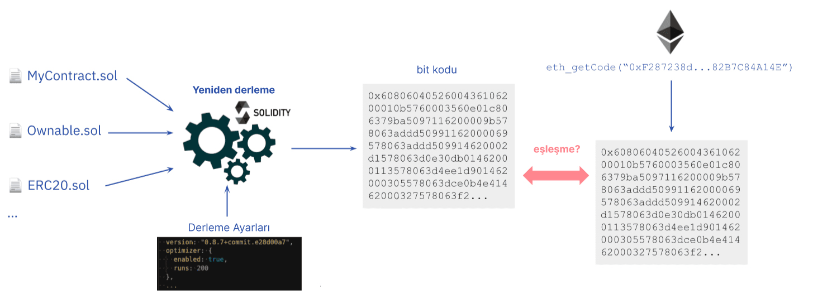

[Akıllı sözleşmeler](/developers/docs/smart-contracts/) "güven gerektirmeyen" yapıda tasarlanmıştır, yani kullanıcıların bir sözleşmeyle etkileşime girmeden önce üçüncü taraflara (ör. geliştiriciler ve şirketler) güvenmek zorunda kalmamaları gerekir. Güven gereksinimsizliğinin bir gereği olarak, kullanıcılar ve diğer geliştiriciler bir akıllı sözleşmenin kaynak kodunu doğrulayabilmelidir. Kaynak kodu doğrulaması, kullanıcılara ve geliştiricilere yayınlanan sözleşme kodunun Ethereum blokzincirindeki sözleşme adresinde çalışan kodla aynı olduğunun güvencesini verir.

"Kaynak kodu doğrulaması" ile "[biçimsel doğrulama](/developers/docs/smart-contracts/formal-verification/)" arasındaki ayrımı yapmak önemlidir. Aşağıda ayrıntılı olarak açıklanacak olan kaynak kodu doğrulaması, yüksek seviyeli bir dilde (ör. Solidity) yazılmış bir akıllı sözleşmenin verilen kaynak kodunun, sözleşme adresinde yürütülecek olan aynı baytkoda derlendiğini doğrulamayı ifade eder. Ancak biçimsel doğrulama, bir akıllı sözleşmenin doğruluğunu, yani sözleşmenin beklendiği gibi davrandığını doğrulamayı tanımlar. Bağlama bağlı olmakla birlikte, sözleşme doğrulaması genellikle kaynak kodu doğrulamasını ifade eder.

## Kaynak kodu doğrulaması nedir? {#what-is-source-code-verification}

Geliştiriciler, bir akıllı sözleşmeyi [Ethereum Sanal Makinesinde (EVM)](/developers/docs/evm/) dağıtmadan önce, sözleşmenin kaynak kodunu (yani [Solidity](/developers/docs/smart-contracts/languages/) veya başka bir yüksek seviyeli programlama dilinde yazılmış talimatları) baytkoda [derler](/developers/docs/smart-contracts/compiling/). EVM yüksek seviyeli talimatları yorumlayamadığından, kaynak kodunu baytkoda (yani düşük seviyeli makine talimatlarına) derlemek, sözleşme mantığını EVM'de yürütmek için gereklidir.

Kaynak kodu doğrulaması, herhangi bir farklılığı tespit etmek için bir akıllı sözleşmenin kaynak kodu ile sözleşme oluşturma sırasında kullanılan derlenmiş baytkodun karşılaştırılmasıdır. Akıllı sözleşmeleri doğrulamak önemlidir çünkü duyurulan sözleşme kodu blokzincirinde çalışan koddan farklı olabilir.

Akıllı sözleşme doğrulaması, makine kodunu okumak zorunda kalmadan, bir sözleşmenin ne yaptığını yazıldığı yüksek seviyeli dil üzerinden incelemeyi sağlar. İşlevler, değerler ve genellikle değişken adları ile yorumlar, derlenen ve dağıtılan orijinal kaynak koduyla aynı kalır. Bu, kodu okumayı çok daha kolaylaştırır. Kaynak doğrulaması ayrıca kod belgelendirmesine de olanak tanır, böylece son kullanıcılar bir akıllı sözleşmenin ne yapmak üzere tasarlandığını bilirler.

### Tam doğrulama nedir? {#full-verification}

Kaynak kodunun, yorumlar veya değişken adları gibi derlenmiş baytkodu etkilemeyen bazı kısımları vardır. Bu, farklı değişken adlarına ve farklı yorumlara sahip iki kaynak kodunun da aynı sözleşmeyi doğrulayabileceği anlamına gelir. Bununla birlikte, kötü niyetli bir aktör kaynak kodunun içine aldatıcı yorumlar ekleyebilir veya yanıltıcı değişken adları verebilir ve sözleşmeyi orijinal kaynak kodundan farklı bir kaynak koduyla doğrulayabilir.

Kaynak kodunun doğruluğu için bir _kriptografik garanti_ ve derleme bilgisinin bir _parmak izi_ olarak hizmet etmesi amacıyla baytkoda ekstra veri ekleyerek bundan kaçınmak mümkündür. Gerekli bilgiler [Solidity'nin sözleşme meta verilerinde](https://docs.soliditylang.org/en/v0.8.15/metadata.html) bulunur ve bu dosyanın hash'i bir sözleşmenin baytkoduna eklenir. Bunu [meta veri oyun alanında](https://playground.sourcify.dev) çalışırken görebilirsiniz.

Meta veri dosyası, kaynak dosyaları ve bunların hash'leri dahil olmak üzere sözleşmenin derlenmesi hakkında bilgiler içerir. Yani, derleme ayarlarından herhangi biri veya kaynak dosyalarından birindeki tek bir bayt bile değişirse, meta veri dosyası değişir. Sonuç olarak, baytkoda eklenen meta veri dosyasının hash'i de değişir. Bu, bir sözleşmenin baytkodu + eklenen meta veri hash'i verilen kaynak kodu ve derleme ayarlarıyla eşleşiyorsa, bunun orijinal derlemede kullanılan kaynak kodunun tamamen aynısı olduğundan ve tek bir baytın bile farklı olmadığından emin olabileceğimiz anlamına gelir.

Meta veri hash'inden yararlanan bu tür doğrulamaya **"[tam doğrulama](https://docs.sourcify.dev/docs/full-vs-partial-match/)"** (aynı zamanda "kusursuz doğrulama") denir. Meta veri hash'leri eşleşmezse veya doğrulamada dikkate alınmazsa, bu bir "kısmi eşleşme" olur ki bu şu anda sözleşmeleri doğrulamanın daha yaygın yoludur. Tam doğrulama olmadan doğrulanmış kaynak koduna yansımayacak [kötü niyetli kod eklemek](https://samczsun.com/hiding-in-plain-sight/) mümkündür. Çoğu geliştirici tam doğrulamanın farkında değildir ve derlemelerinin meta veri dosyasını saklamaz, bu nedenle kısmi doğrulama şimdiye kadar sözleşmeleri doğrulamak için fiili yöntem olmuştur.

## Kaynak kodu doğrulaması neden önemlidir? {#importance-of-source-code-verification}

### Güven gereksinimsizliği {#trustlessness}

Güven gereksinimsizliği, tartışmasız akıllı sözleşmeler ve [merkeziyetsiz uygulamalar (dapp'ler)](/developers/docs/dapps/) için en büyük vaattir. Akıllı sözleşmeler "değişmez"dir ve değiştirilemez; bir sözleşme yalnızca dağıtım sırasında kodda tanımlanan iş mantığını yürütecektir. Bu, geliştiricilerin ve işletmelerin Ethereum'da dağıtım yaptıktan sonra bir sözleşmenin kodunu kurcalayamayacağı anlamına gelir.

Bir akıllı sözleşmenin güven gerektirmeyen yapıda olması için, sözleşme kodunun bağımsız doğrulama için erişilebilir olması gerekir. Her akıllı sözleşme için derlenmiş baytkod blokzincirinde herkese açık olarak bulunsa da, düşük seviyeli dili anlamak hem geliştiriciler hem de kullanıcılar için zordur.

Projeler, sözleşmelerinin kaynak kodunu yayınlayarak güven varsayımlarını azaltır. Ancak bu başka bir soruna yol açar: yayınlanan kaynak kodunun sözleşme baytkoduyla eşleştiğini doğrulamak zordur. Bu senaryoda, güven gereksinimsizliğinin değeri kaybolur çünkü kullanıcılar, blokzincirinde dağıtmadan önce bir sözleşmenin iş mantığını değiştirmeyecekleri (yani baytkodu değiştirmeyecekleri) konusunda geliştiricilere güvenmek zorundadır.

Kaynak kodu doğrulama araçları, bir akıllı sözleşmenin kaynak kodu dosyalarının çeviri (assembly) koduyla eşleştiğine dair garantiler sağlar. Sonuç, kullanıcıların üçüncü taraflara körü körüne güvenmediği ve bunun yerine bir sözleşmeye fon yatırmadan önce kodu doğruladığı, güven gerektirmeyen bir ekosistemdir.

### Kullanıcı Güvenliği {#user-safety}

Akıllı sözleşmelerde genellikle ortada büyük miktarda para vardır. Bu, daha yüksek güvenlik garantileri ve bir akıllı sözleşmenin mantığının kullanılmadan önce doğrulanmasını gerektirir. Sorun şu ki, vicdansız geliştiriciler bir akıllı sözleşmeye kötü niyetli kod ekleyerek kullanıcıları aldatabilir. Doğrulama olmadan, kötü niyetli akıllı sözleşmelerde [arka kapılar](https://www.trustnodes.com/2018/11/10/concerns-rise-over-backdoored-smart-contracts), tartışmalı erişim kontrol mekanizmaları, istismar edilebilir güvenlik açıkları ve kullanıcı güvenliğini tehlikeye atan diğer şeyler tespit edilemeyebilir.

Bir akıllı sözleşmenin kaynak kodu dosyalarını yayınlamak, denetçiler gibi ilgilenenlerin sözleşmeyi potansiyel saldırı vektörleri açısından değerlendirmesini kolaylaştırır. Birden fazla tarafın bir akıllı sözleşmeyi bağımsız olarak doğrulamasıyla, kullanıcılar sözleşmenin güvenliği konusunda daha güçlü garantilere sahip olur.

## Ethereum akıllı sözleşmeleri için kaynak kodu nasıl doğrulanır {#source-code-verification-for-ethereum-smart-contracts}

[Ethereum'da bir akıllı sözleşme dağıtmak](/developers/docs/smart-contracts/deploying/), özel bir adrese veri yükü (derlenmiş baytkod) içeren bir işlem göndermeyi gerektirir. Veri yükü, kaynak kodunun derlenmesi ve işlemdeki veri yüküne eklenen sözleşme örneğinin [kurucu argümanları](https://docs.soliditylang.org/en/v0.8.14/contracts.html#constructor) ile oluşturulur. Derleme deterministiktir, yani aynı kaynak dosyaları ve derleme ayarları (ör. derleyici sürümü, optimize edici) kullanıldığında her zaman aynı çıktıyı (yani sözleşme baytkodunu) üretir.

Bir akıllı sözleşmeyi doğrulamak temel olarak aşağıdaki adımları içerir:

1. Kaynak dosyalarını ve derleme ayarlarını bir derleyiciye girin.

2. Derleyici sözleşmenin baytkodunu çıkarır

3. Belirli bir adresteki dağıtılmış sözleşmenin baytkodunu alın

4. Dağıtılan baytkodu yeniden derlenen baytkodla karşılaştırın. Kodlar eşleşirse, sözleşme verilen kaynak kodu ve derleme ayarlarıyla doğrulanır.

5. Ek olarak, baytkodun sonundaki meta veri hash'leri eşleşirse, bu tam bir eşleşme olacaktır.

Bunun doğrulamanın basit bir açıklaması olduğunu ve [değişmez değişkenlere](https://docs.sourcify.dev/docs/immutables/) sahip olmak gibi bununla çalışmayacak birçok istisna olduğunu unutmayın.

## Kaynak kodu doğrulama araçları {#source-code-verification-tools}

Sözleşmeleri doğrulamanın geleneksel süreci karmaşık olabilir. Bu nedenle Ethereum'da dağıtılan akıllı sözleşmelerin kaynak kodunu doğrulamak için araçlarımız var. Bu araçlar, kaynak kodu doğrulamasının büyük bir bölümünü otomatikleştirir ve ayrıca kullanıcıların yararına doğrulanmış sözleşmeleri derler.

### Etherscan {#etherscan}

Çoğunlukla bir [Ethereum blok gezgini](/developers/docs/data-and-analytics/block-explorers/) olarak bilinse de Etherscan, akıllı sözleşme geliştiricileri ve kullanıcıları için bir [kaynak kodu doğrulaması hizmeti](https://etherscan.io/verifyContract) de sunar.

Etherscan, sözleşme baytkodunu orijinal veri yükünden (kaynak kodu, kütüphane adresi, derleyici ayarları, sözleşme adresi vb.) yeniden derlemenize olanak tanır. Yeniden derlenen baytkod, zincir içi sözleşmenin baytkoduyla (ve kurucu parametreleriyle) ilişkiliyse, [sözleşme doğrulanır](https://info.etherscan.com/types-of-contract-verification/).

Doğrulandıktan sonra, sözleşmenizin kaynak kodu "Doğrulandı" (Verified) etiketini alır ve başkalarının denetlemesi için Etherscan'de yayınlanır. Ayrıca, doğrulanmış kaynak kodlarına sahip akıllı sözleşmelerin bir deposu olan [Doğrulanmış Sözleşmeler](https://etherscan.io/contractsVerified/) bölümüne de eklenir.

Etherscan, sözleşmeleri doğrulamak için en çok kullanılan araçtır. Ancak, Etherscan'in sözleşme doğrulamasının bir dezavantajı vardır: zincir içi baytkodun ve yeniden derlenen baytkodun **meta veri hash'ini** karşılaştırmada başarısız olur. Bu nedenle Etherscan'deki eşleşmeler kısmi eşleşmelerdir.

[Etherscan'de sözleşmeleri doğrulama hakkında daha fazla bilgi](https://medium.com/etherscan-blog/verifying-contracts-on-etherscan-f995ab772327).

### Blockscout {#blockscout}

[Blockscout](https://blockscout.com/), akıllı sözleşme geliştiricileri ve kullanıcıları için bir [sözleşme doğrulama hizmeti](https://eth.blockscout.com/contract-verification) de sağlayan açık kaynaklı bir blok gezginidir. Açık kaynaklı bir alternatif olarak Blockscout, doğrulamanın nasıl gerçekleştirildiği konusunda şeffaflık sunar ve doğrulama sürecini iyileştirmek için topluluk katkılarına olanak tanır.

Diğer doğrulama hizmetlerine benzer şekilde Blockscout, baytkodu yeniden derleyerek ve dağıtılan sözleşmeyle karşılaştırarak sözleşmenizin kaynak kodunu doğrulamanıza olanak tanır. Doğrulandıktan sonra, sözleşmeniz doğrulama durumu alır ve kaynak kodu denetim ve etkileşim için herkese açık hale gelir. Doğrulanmış sözleşmeler, kolay gezinme ve keşif için Blockscout'un [doğrulanmış sözleşmeler deposunda](https://eth.blockscout.com/verified-contracts) da listelenir.

### Sourcify {#sourcify}

[Sourcify](https://sourcify.dev/#/verifier), sözleşmeleri doğrulamak için açık kaynaklı ve merkeziyetsiz olan başka bir araçtır. Bir blok gezgini değildir ve yalnızca [farklı EVM tabanlı ağlardaki](https://docs.sourcify.dev/docs/chains) sözleşmeleri doğrular. Diğer araçların üzerine inşa edilmesi için halka açık bir altyapı görevi görür ve meta veri dosyasında bulunan [ABI](/developers/docs/smart-contracts/compiling/#web-applications) ve [NatSpec](https://docs.soliditylang.org/en/v0.8.15/natspec-format.html) yorumlarını kullanarak daha insan dostu sözleşme etkileşimleri sağlamayı amaçlar.

Etherscan'in aksine Sourcify, meta veri hash'i ile tam eşleşmeleri destekler. Doğrulanmış sözleşmeler, HTTP ve merkeziyetsiz, [içerik adresli](https://docs.storacha.network/concepts/content-addressing/) bir depolama olan [IPFS](https://docs.ipfs.io/concepts/what-is-ipfs/#what-is-ipfs) üzerindeki [halka açık deposunda](https://docs.sourcify.dev/docs/repository/) sunulur. Eklenen meta veri hash'i bir IPFS hash'i olduğundan, bu bir sözleşmenin meta veri dosyasının IPFS üzerinden getirilmesine olanak tanır.

Ek olarak, bu dosyaların IPFS hash'leri de meta verilerde bulunduğundan, kaynak kodu dosyaları IPFS üzerinden de alınabilir. Bir sözleşme, meta veri dosyası ve kaynak dosyaları API'si veya [kullanıcı arayüzü (UI)](https://sourcify.dev/#/verifier) üzerinden sağlanarak veya eklentiler kullanılarak doğrulanabilir. Sourcify izleme aracı ayrıca yeni bloklardaki sözleşme oluşturmalarını dinler ve meta verileri ile kaynak dosyaları IPFS'te yayınlanmışsa sözleşmeleri doğrulamaya çalışır.

[Sourcify'da sözleşmeleri doğrulama hakkında daha fazla bilgi](https://soliditylang.org/blog/2020/06/25/sourcify-faq/).

### Tenderly {#tenderly}

[Tenderly platformu](https://tenderly.co/), Web3 geliştiricilerinin akıllı sözleşmeler oluşturmasına, test etmesine, izlemesine ve işletmesine olanak tanır. Hata ayıklama araçlarını gözlemlenebilirlik ve altyapı yapı taşlarıyla birleştiren Tenderly, geliştiricilerin akıllı sözleşme geliştirmeyi hızlandırmasına yardımcı olur. Tenderly özelliklerini tam olarak etkinleştirmek için geliştiricilerin çeşitli yöntemler kullanarak [kaynak kodu doğrulaması gerçekleştirmesi](https://docs.tenderly.co/monitoring/contract-verification) gerekir.

Bir sözleşmeyi özel veya herkese açık olarak doğrulamak mümkündür. Özel olarak doğrulanırsa, akıllı sözleşme yalnızca sizin (ve projenizdeki diğer üyelerin) tarafından görülebilir. Bir sözleşmeyi herkese açık olarak doğrulamak, onu Tenderly platformunu kullanan herkes için görünür kılar.

Sözleşmelerinizi [Kontrol Paneli](https://docs.tenderly.co/contract-verification), [Tenderly Hardhat eklentisi](https://docs.tenderly.co/contract-verification/hardhat) veya [CLI](https://docs.tenderly.co/monitoring/smart-contract-verification/verifying-contracts-using-cli) kullanarak doğrulayabilirsiniz.

Sözleşmeleri Kontrol Paneli üzerinden doğrularken, kaynak dosyasını veya Solidity derleyicisi tarafından oluşturulan meta veri dosyasını, adresi/ağı ve derleyici ayarlarını içe aktarmanız gerekir.

Tenderly Hardhat eklentisini kullanmak, daha az çabayla doğrulama süreci üzerinde daha fazla kontrol sağlar ve otomatik (kodsuz) ile manuel (kod tabanlı) doğrulama arasında seçim yapmanıza olanak tanır.

## Daha fazla bilgi {#further-reading}

- [Sözleşme kaynak kodunu doğrulama](https://programtheblockchain.com/posts/2018/01/16/verifying-contract-source-code/)